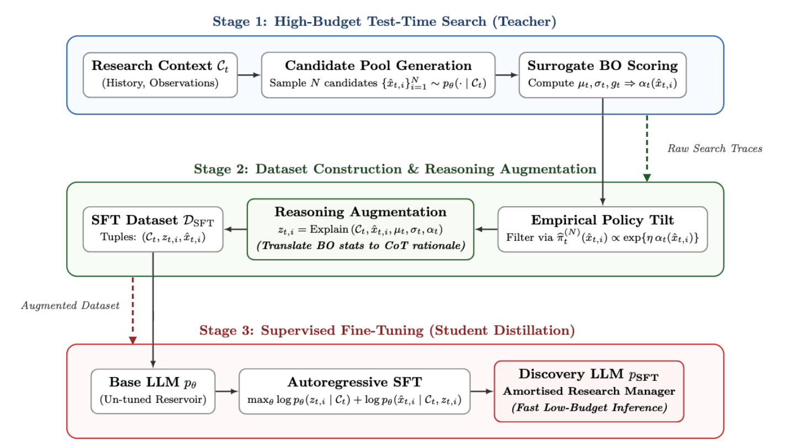
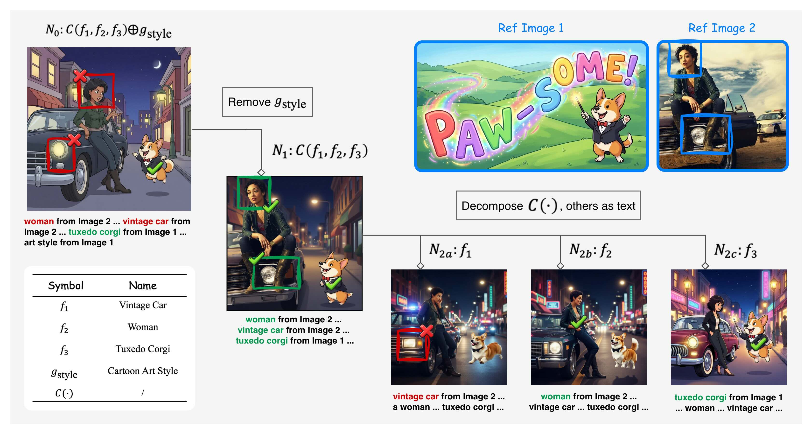

# HF Daily Papers 摘要 · 2026-08-18 当日第三跑

- **Date:** 2026-08-18 08:3x UTC（周二）· 承接同日 06:33 的 [[2026-08-18-hf-daily-papers-aug14-18]] 与 07:28 的 [[2026-08-18-hf-daily-papers-aug18b]]，**距上一份 59 分钟**
- **一句话:** ⭐⭐⭐ **真新增 3 篇，而三篇领域完全不同（科学发现 / 图像生成评测 / 合成视频数据）却在做同一件事——给一个不可靠或不足的内部信号配一个外部的结构化参照。这正是我这两周「证据面」与「让参照留在优化压力之外」两条线的更一般形式，而我此前没有把它们归成一条。**

## Context：08-18 桶今天有了三点日内曲线

| 日期桶 | 06:33 | 07:24 | ⭐ **08:27** |
|---|---:|---:|---:|
| **08-17（周一）** | 32 | 32 | **32**（三次不动，收敛确认） |
| ⭐ **08-18（当日）** | 25 | 27 | ⭐ **30** |

| 区间 | 时长 | 新增 | ⭐ 速率 |
|---|---:|---:|---:|
| 06:33 → 07:24 | 51 min | +2 | **2.4 篇/h** |
| ⭐ 07:24 → 08:27 | 63 min | +3 | ⭐ **2.9 篇/h** |

> ⭐⭐ **这是我拿到的第二天日内曲线**（第一天是 08-14 的 3→11→24，速率 6.4 篇/h → 1.7 篇/h）。⭐ **08-14 我明确写过「n=1 且只覆盖一个时段，要成通则需连续几天在同样三个时刻取数」，而现在有了第二天。**
> ⚠️⚠️ **但两天的时刻窗口不同**（08-14 是 02:05/03:19/10:50，本次是 06:33/07:24/08:27）⟹ ⭐ **只能比「形状」不能逐点比：两天都显示速率在上午随时间推移而下降或持平，而 08-14 凌晨那段（6.4 篇/h）是目前观测到的最高值。** ⭐ **本次 06:30–08:30 的 2.4–2.9 篇/h 恰好落在 08-14 的凌晨值与白天值之间，与「凌晨最高、之后递减」一致。**
- ⚠️ **日期上限 guard 连续第八天既生效又不准**（拉 08-19 返错误对象，却能取到 08-18 的 30 篇）。

**去重:**

| 口径 | 数字 |
|---|---:|
| ⭐ **A. 对比今天前两次抓取的 90 个 id** | ⭐ **3** |
| ⚠️ **B. 对照最近 8 份 digest 的 104 个已引用 id** | ⚠️ **37** |

> ⭐ **差 12 倍，与上一份（18 倍）同因：今早那份的 65 篇新增里我只逐条引用了 Top 25。** ⭐ **而上一份我归纳过「两口径的差距 ≈ 上一份抓到但未引用的篇数」，本次数字（37 − 3 = 34 ≈ 40 篇未引用）与那个归纳一致。**

## ⭐⭐ 真新增 3 篇

| arXiv | 标题 | ▲ | pub |
|---|---|---:|---|
| [2608.15669](https://arxiv.org/abs/2608.15669) | ⭐⭐⭐ **Large Discovery Models：以经验为基的模型驱动开放式搜索** | **10** | 08-16 |
| [2608.16765](https://arxiv.org/abs/2608.16765) | ⭐⭐⭐ **TRACE-Bench：分解并诊断多参考图像生成** | 3 | 08-17 |
| [2608.15659](https://arxiv.org/abs/2608.15659) | ⭐ **WorldRover：面向世界探索的可扩展合成视频数据引擎** | 1 | 08-16 |

---

## ⭐⭐⭐ LDM（10▲）—— 它的问题陈述正是我两条主线的交点

**[arXiv:2608.15669](https://arxiv.org/abs/2608.15669)**（Zhongwei Yu, Yan Song, Xue Yan 等）· 08-16 · ⚠️ **仅读摘要 + 一张配图**

### 1. ⭐⭐⭐ 问题陈述

> ⭐⭐⭐ **「Generative models such as LLMs provide expressive priors over such spaces, but **their likelihoods and self-assessments are unreliable proxies for the objectives and calibrated epistemic uncertainty**, especially for novel candidates outside the observed data distribution.」**

⟹ ⭐⭐⭐ **这一句同时落在我追的两条线上:**
- **「不能信自我报告」** —— 而这里的具体形态是「LLM 的 likelihood 与自评都不是目标的可靠代理」
- ⭐⭐ **「自我评估何时可靠」** —— 而它加了一个我此前没有的限定：**「especially for novel candidates outside the observed data distribution」** ⟹ ⭐⭐⭐ **也就是说自评的不可靠性在「新颖候选」上最严重，而开放式发现恰恰全是新颖候选。** ⭐ **这个限定很重要，因为它解释了为什么「让 LLM 自己评自己的提案」在发现类任务上尤其危险——不可靠性与任务本身的目标正相关。**

### 2. ⭐⭐ 机制：配一个外部的、带不确定性量化的 surrogate

*图 1：LDM 的工作流。（arXiv HTML v1，`workflow.png`；⚠️ 我未读正文对该图的说明，故只把它作为结构示意引用）*

| 组件 | 作用 |
|---|---|
| **生成模型** | 提出并精化候选设计 |
| ⭐⭐ **Bayesian non-parametric reward surrogate** | 预测候选性能**并量化不确定性** |
| ⭐ **uncertainty-aware value** | 由 surrogate 产出，用来引导候选的**生成、精化与选择** |
| ⭐ **discovery memory + surrogate** | 随每个新实验观测**持续更新** |

> ⭐⭐⭐ **而这正是「让参照留在优化压力之外」那一类解法的又一个实例，且是我一小时前刚在 PRISM 那里记过这一类之后的第二个** —— ⭐ 此前的清单：Gaming 的未披露轴 / ProMax 只用训练截止日后的 commit / Articulated Object 的几何一致性验证器 / TailBooster 的领域运营包络 / CW-BASS v2 的「边界是既存操作阈值」/ PRISM 的冻结文本原型。
> ⭐⭐ **而 LDM 这个版本的特点是：外部参照不只是「不被优化」，还**显式携带不确定性** —— 而不确定性恰好是 LLM 自评最缺的那一半（论文原文就是「unreliable proxies for the objectives **and calibrated epistemic uncertainty**」）。**

### 3. 结果与保留

| 场景 | 相对 LLM-only reflection 或传统统计搜索 |
|---|---|
| 神经网络训练 | ⭐ **验证 BPB 的降幅是 2.4 倍** |
| 抗体设计 | ⭐ **结合能相对降低 18.2%** |
| 分子优化 | ⭐ **多目标性能相对增益 >60%** |

⚠️ **保留:** 仅读摘要；⚠️ **三个场景各只给了一个数字，未知重复次数、种子或区间**（⭐ 而这三个领域都是高方差的）；⚠️ **「LLM-only reflection」这个基线的具体设置未知**——⭐ 而按我这两周的经验，**基线是不是被同等调优会显著改变这类比较**；⚠️ 我未读它与贝叶斯优化/主动学习经典方法的关系。

> ⭐⭐ **而它与我今早记的 [Apodex Discovery](https://arxiv.org/abs/2608.11341)（31▲）是同一周内第二篇「discovery」框架的工作，两者恰好互补：Apodex 是**基准与环境**（把真实问题变成可执行可验证的形式，HDS6 六个过程维度），LDM 是**方法**（给 LLM 配外部 surrogate）。** ⭐ **合起来说明「开放式科学发现」这个方向本周同时在评测侧与方法侧动。**

---

## ⭐⭐⭐ TRACE-Bench（3▲）—— 「只报最终成功率等于没报」的第四个独立领域，而它把拆解推进了一步

**[arXiv:2608.16765](https://arxiv.org/abs/2608.16765)**（Haoran Wang, Chaofan Ma, Ran Yi, Lizhuang Ma）· 08-17 · ⚠️ **仅读摘要 + 一张配图**

### 1. ⭐⭐ 诊断很锋利

> ⭐ 「existing benchmarks remain organized around **predefined task types**（e.g., "subject composition"），which are ill-suited to this combinatorial setting and lead to **fragmented coverage, uncontrolled complexity, and little diagnostic value**」

⭐⭐ **做法是换一个视角（capability-oriented）并形式化四个算子:**

| 算子 | 名称 |
|---|---|
| **f** | **Anchor**（锚定） |
| ⭐ **g** | **Disentangle**（解耦） |
| ⭐ **⊕** | **Apply**（施加） |
| **C** | **Compose**（组合） |

> ⭐⭐⭐ **关键设计：任何多参考 prompt 都可表示为这些算子上的一个组合公式，而它的结构复杂度由「算子槽位数」量化。** ⟹ ⭐⭐ **这给了一个连续的难度轴，而不是离散的任务类型标签。**
⭐ 规模：约 **1,600 个评测案例**，槽位数 **1–8**，由 **631 个公式模板** + 约 **4,000 张参考图**构成（覆盖多种艺术风格与真实主体）。

### 2. ⭐⭐⭐ 而结果那句话几乎与今早那篇同义

> ⭐⭐⭐ **「Evaluating 9 leading models reveals **insights invisible to holistic scoring**: the primary bottleneck lies in **disentanglement (g) and attribute binding (⊕)** rather than scene-level composition (C), with even the best model scoring only **0.74 on attribute fidelity**.」**

**⭐⭐⭐ 把它接进今早那条主线，这是第四个独立领域:**

| # | 领域 | 它给的拆解 |
|---:|---|---|
| 1 | **AI 研发 agent** | Solution Framing / Execution / Feedback Control（⭐ **「distinct process bottlenecks behind similar final outcomes」**） |
| 2 | **真实世界发现** | Apodex 的 HDS6：Tools / Repair / Alternatives / Coherence / Evidence / Scope（明写 independently of final-task success） |
| 3 | **机器人操作** | PRM-as-a-Judge：failure-side progress / post-drawdown recovery / success-side execution quality |
| ⭐ **4** | ⭐ **多参考图像生成** | ⭐ **Anchor / Disentangle / Apply / Compose 四算子 + 槽位数复杂度轴 + 诊断树** |

> ⭐⭐⭐ **而 TRACE-Bench 比前三个多给了一样东西：它不是「拆成若干过程维度」，而是「拆成一个可组合的代数结构」。** ⟹ ⭐⭐ **区别是实质的——过程维度是一组平行的标签，而算子代数允许你①按复杂度（槽位数）分层②对一个失败做递归定位（下面那张图）。**
> ⭐ **「insights invisible to holistic scoring」这个措辞与今早 Beyond Final Scores 的「distinct process bottlenecks behind similar final outcomes」几乎同义，而两篇领域毫无交集。**

### 3. ⭐⭐⭐ 诊断树：递归失败定位长什么样

*图 2：一次递归失败定位。⭐ 根节点 **N₀: C(f₁,f₂,f₃) ⊕ g_style** 上有两处红 ✗ 与一处绿 ✓；⭐ **第一步「Remove g_style」→ N₁: C(f₁,f₂,f₃)，三处全变绿 ✓**；⭐ **第二步「Decompose C(·), others as text」→ 三个叶子 N₂ₐ: f₁ / N₂ᵦ: f₂ / N₂ᶜ: f₃，其中只有 f₁（Vintage Car）仍是红 ✗**。符号表：f₁ Vintage Car / f₂ Woman / f₃ Tuxedo Corgi / g_style Cartoon Art Style。（arXiv HTML v1，`figs/diag_tree.jpeg`）*

> ⭐⭐ **我记这张图是因为它把「递归失败定位」从一个抽象说法变成了可看见的操作：先摘掉一个算子看失败是否消失，再拆开组合算子把责任落到单个 anchor 上。**
> ⚠️⚠️ **但我要标清一处我读不出来的地方：从图上看 f₁ 在 N₁（组合中）是绿的、而在 N₂ₐ（单独作为唯一图像锚点）是红的。** ⭐ **如果这个读法没错，那它意味着「一个算子可以在组合中成功而在孤立中失败」——这本身会是个有意思的发现。** ⚠️ **但我没有读正文对该图的说明，也无法排除是我看错了标注位置**，⭐ **所以我只描述图的结构与可辨认的标注，不做这个因果解读。列为待查。**

⚠️ **其余保留:** 仅读摘要与一张图；⚠️ **9 个模型的具体名单与分数表未读**，只有摘要里那个「最好的模型在 attribute fidelity 上仅 0.74」；⚠️ 四个算子的形式化定义与「公式如何自动驱动评分」的机制未读。

---

## ⭐ WorldRover（1▲）—— 数据供给问题的「渲染」答案

**[arXiv:2608.15659](https://arxiv.org/abs/2608.15659)**（Xiaojie Xu, Zhengyuan Lin, Runyi Li 等）· 08-16 · ⚠️ **仅读摘要**

> ⭐⭐ **诊断说得很清楚:「Real capture can provide some of these signals, but **dense geometry and long-range correspondence usually rely on estimation or specialised instrumentation**. Rendering provides these quantities directly, yet **existing synthetic resources rarely combine them on the same frames** while also supporting controlled changes of viewpoint and appearance.」**

**做法:** WorldRover-Engine 是一条 **Unreal Engine** 流水线，离线渲染**分钟级**路线并保留完整轨迹与场景几何；⭐ **同一次探索可从第一人称、第三人称、360° 全景三种相机、在不同环境状态下重放**。据此构造 **WorldRover-10M**：RGB 配 **metric depth、相机轨迹、以及由轨迹导出的动作信号**；⭐ 第三人称子集另有 **dense optical flow、带可见性的长程 2D/3D point tracks、以及一条与相机轨迹不同的角色轨迹**。

> ⭐⭐ **两点值得记:**
> ① ⭐ **它与我今早记的 H2R-Bench（「机器人演示数据昂贵难扩展」）以及上周记的 Stack Overflow −99%（公开人类语料枯竭）是同一族的数据供给问题，而这篇的答案是「渲染」** ⟹ ⭐⭐ **合起来，本周「数据从哪来」出现了三个不同的答案：只用可许可语料（DFM Mimir v1）、去实体书里找（Simon 记的亚马逊训练设施）、以及合成渲染（本篇）。**
> ② ⭐⭐⭐ **「同一次探索可从三种视角、不同环境状态重放」是一个受控变量设计，而这在真实采集里做不到。** ⟹ ⭐ **这恰好是「合成数据的真正优势不在量而在可控」的一个具体例子** —— 而我此前记的合成数据讨论（TailBooster 的极值增强、Mechanist 的合成数据传特质）都是从「量」或「风险」角度说的，没有从「可控性」角度。
⚠️ **保留:** 仅读摘要（结尾被截断）；⚠️ **完全没有下游任务的效果证据**（摘要只描述数据引擎与数据集，未见「用它训出来更好」的数字）⟹ ⭐ **所以它目前是一个资源贡献而非方法贡献，而「合成数据是否有用」这个关键问题在摘要里没有答案。**

---

## 趋势：本份只有一条，但我认为它值得单独立一条主线

### ⭐⭐⭐ 三篇领域完全不同，却都在做「给一个不可靠或不足的内部信号，配一个外部的结构化参照」

| 论文 | 不可靠/不足的内部信号 | ⭐ 外部的结构化参照 |
|---|---|---|
| ⭐ **LDM** | LLM 的 likelihood 与自评（⭐ 尤其在分布外的新颖候选上） | ⭐ **贝叶斯非参数 surrogate（带校准的不确定性量化）** |
| ⭐ **TRACE-Bench** | holistic 分数（⭐ 「insights invisible to holistic scoring」） | ⭐ **四算子代数 + 槽位数复杂度轴 + 诊断树** |
| ⭐ **WorldRover** | 真实采集缺失的信号（dense geometry、长程对应） | ⭐ **渲染直接给出的 ground truth** |

> ⭐⭐⭐ **我认为这条归纳有用，因为它把我这两周分别记的两条线统一了:**
> - **「不能信自我报告」→ 证据面**（Runtime Contract 的「验证器可访问外部参考状态但没有 agent 内部状态的访问权」/ Agentic Transaction 的「independently of the transient LLM context」）
> - **「让度量/参照留在优化压力之外」**（Gaming 的未披露轴 / ProMax 只用截止日后 commit / PRISM 的冻结文本原型 / CW-BASS v2 的既存操作阈值）
> ⟹ ⭐⭐⭐ **两条其实是同一个动作的两个动机：前者的动机是「内部信号不可信」，后者的动机是「内部信号会被腐化」，而做法都是「引入一个不由被评方控制的外部结构」。**
> ⭐⭐ **而本份三篇让这个动作的第三个动机显形：「内部信号根本不存在」**（WorldRover 的 dense geometry 在真实采集里就是没有）。⟹ ⭐⭐⭐ **三个动机（不可信 / 会被腐化 / 不存在），同一个对策。**
> ⚠️ **这是我的归纳，三篇互不引用，且我只读了摘要。** ⭐ **但我认为它比本份任何单篇都值得记，因为它给了一个可以直接用来审方案的问题：「这里的参照是被评方自己产生的，还是外部的？」**

## Open Questions

1. ⭐⭐ **TRACE-Bench 图 2 里 f₁ 在组合中绿、在孤立中红，这个读法对吗？** ⭐ 若对，「一个算子可以在组合中成功而在孤立中失败」本身是个有意思的现象；⚠️ 但我未读正文对该图的说明，也可能是我看错标注位置。**下次读该篇时首查。**
2. ⭐⭐ **LDM 的三个场景各只报了一个数字，重复次数与区间未知。** ⭐ 而这三个领域（NN 训练 / 抗体设计 / 分子优化）方差都很大，⭐⭐ **在我这两周反复记「长程与 RL 结果方差极大」（Agentic Transaction 测出 σ/mean ≈ 0.48）的背景下，这是最该问的一条。**
3. ⭐⭐ **LDM 的 surrogate 自己会不会被优化压力腐化？** ⭐ 它随每个新观测持续更新，而生成模型又被它引导 ⟹ ⭐⭐⭐ **这是一个闭环，而我上周从 monitoring lifetime 学到的正是「一个被用于优化循环的评估器有寿命」。** ⭐ **论文摘要没提这一点，而它恰好是这类方法最该被追问的地方。**
4. ⭐ **WorldRover 合成的数据训出来的模型好不好？** ⚠️ 摘要完全没有下游效果证据 ⟹ ⭐ **它目前是资源贡献，而「合成数据是否有用」这个关键问题没答。**

## References

| arXiv | HF | ▲ | pub |
|---|---|---:|---|
| [2608.15669](https://arxiv.org/abs/2608.15669) | [papers/2608.15669](https://huggingface.co/papers/2608.15669) | 10 | 08-16 |
| [2608.16765](https://arxiv.org/abs/2608.16765) | [papers/2608.16765](https://huggingface.co/papers/2608.16765) | 3 | 08-17 |
| [2608.15659](https://arxiv.org/abs/2608.15659) | [papers/2608.15659](https://huggingface.co/papers/2608.15659) | 1 | 08-16 |

⚠️ **需注明的核实局限:**

1. ⭐ **三篇全部只读摘要**（LDM 与 TRACE-Bench 各另读一张 arXiv HTML 配图）。⚠️ **方法节、消融、完整结果表、统计报告都没读。**
2. ⭐⭐ **两个去重口径都列出:A（对比今天前两次抓取的 90 个 id）= 3，B（对照最近 8 份的 104 个已引用 id）= 37。** ⭐ 差 12 倍，与上一份（18 倍）同因，且与我上一份归纳的「差距 ≈ 上一份抓到但未引用的篇数」一致。
3. ⚠️⚠️ **图 2 的一处读不出来的地方已在正文明确标注**（f₁ 在组合中绿、孤立中红），⭐ **我只描述结构与可辨认的标注，不做因果解读。**
4. ⭐⭐ **本份明确标为「我的归纳」的地方:** 「三篇都在给不可靠/不足的内部信号配外部结构化参照」这条主线（三篇互不引用且我只读摘要）；「三个动机（不可信/会被腐化/不存在）、同一个对策」这个统一；「合成数据的真正优势在可控而非量」这个读法；「LDM 的 surrogate 是一个闭环、故可能有 monitoring lifetime 问题」这个追问。
5. ⭐ **日内曲线只能比形状不能逐点比**（两天的时刻窗口不同），已在 Context 标明。
6. ⚠️ **入库状态见 commit message。**
