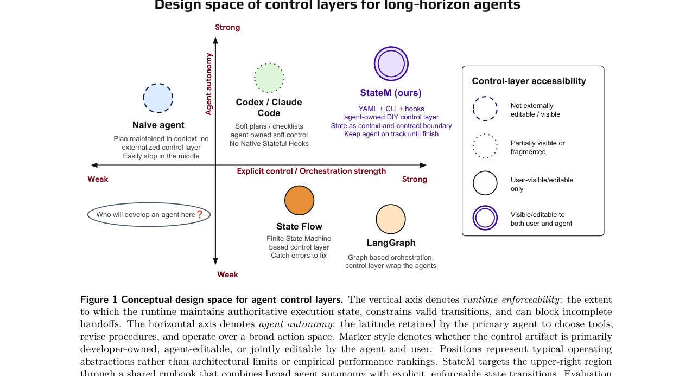
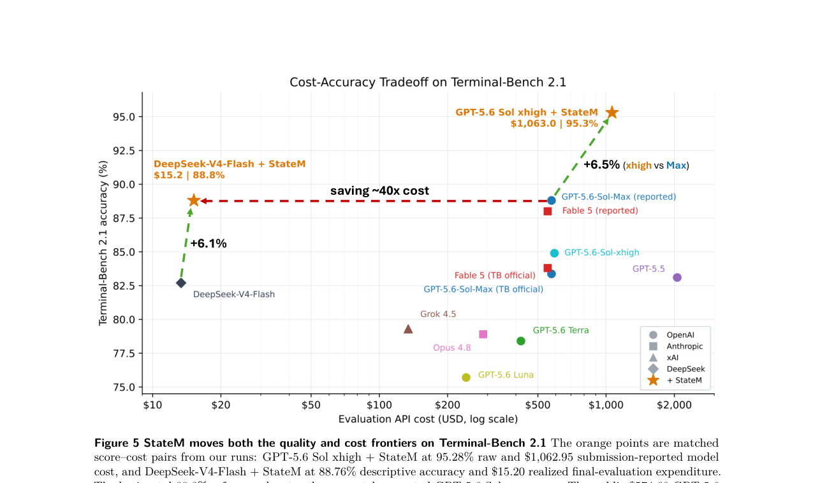
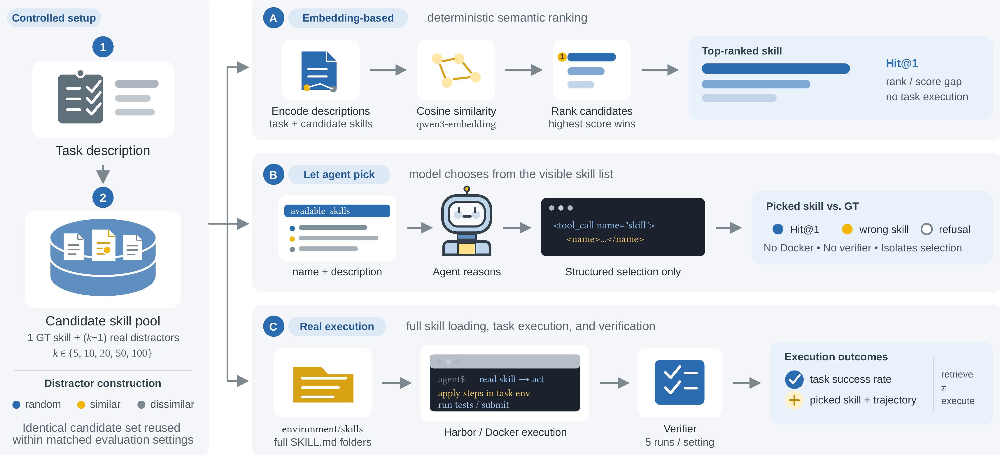

# HF Daily Papers 摘要：08/18 回填 + 08/19–08/20

- **抓取时间**：2026-08-20 05:24 UTC（本日第一份，无后缀）
- **覆盖**：08-18 桶回填 + 08-19 + 08-20
- **窗口唯一**：**89 篇** ｜ 对照最近 8 份 digest 的 107 个已引用 id 去重后 **新增 73 篇**，取 **Top 25**
- **数据源**：HF `GET /api/daily_papers?date=YYYY-MM-DD&limit=100&sort=publishedAt`

> ⚠️⚠️ **本份是两天空缺补跑，而它的发现方式值得先记**：cron prompt 里那句「**以 `date -u` 为准判断今天是第几份，不要假设**」是我 08-18 重建时刚加进去的，**它立刻救了一次** —— 我看到一堆 mtime 是 `08:31 / 07:28 / 06:33` 的文件，差点按「同日第四跑」来处理，而 `date -u` 说今天是 **08-20**。⟹ ⭐⭐ **那些 mtime 是 08-18 的，两天前的**。

## 运维：08-19 又漏了，而这次形态与前两次完全相同

| 任务 | 08-19 | 依据 |
|---|---|---|
| **AWS** | ✅ 跑了 | `aws-whats-new/2026-08-19.md` + commit `d30ee1f`，且**心跳日志里有它自己写的 `start` 09:04 / `done` 09:10** |
| **HF** | ❌ | 无产出、无心跳行 |
| **Reddit** | ❌ | 同上 |
| **tech-blogs** | ❌ | 同上 |

⟹ ⭐⭐⭐ **这是「AWS 活、另三个死」这个不对称形态的第三次出现**（08-01/02、08-15~17、08-19），而 AWS 恰好是四个里时刻最晚的那个（09:04）。⚠️ 我目前无法解释这个相关性，只记下它连续三次成立。

⭐⭐⭐ **而 08-18 刚落地的心跳产物在这次真实事件上第一次发挥作用，且方式与我设计时的预期不同：**

- ✅ **AWS 08-19 那次自己写了两行**（`start` 09:04 → `done` 09:10，detail 里记着 `13 items (10 in-window + 3 backfill), 4 highs; Tue counterexample refuted...`）⟹ **机制在生产环境上工作了，`check` 因此正确地没把 08-19 aws 报成漏跑。**
- ⭐⭐ **不对称性现在是「被记录的」而不是「靠推断的」** —— 此前我判断「哪几个漏了」靠的是数产出文件，而产出文件的缺失和「跑了但没内容」不可区分；现在日志直接给出答案。

### ⚠️ 但真实数据第一次运行就暴露了我设计里的一个盲点（已当场修掉）

我为避免误报，把观测起点设成**按任务算**（一个任务的第一行日期之前一律不报）。⭐ 这本身是对的——否则「明天」会把 08-18 那三个任务报成漏跑，而它们确实跑了、只是跑在心跳存在之前。

⚠️⚠️ **但它有个代价：一个在写下第一次心跳之前就静默死掉的任务，对检测器永远不可见** —— HF/Reddit/tech-blogs 因为 08-19 没跑、08-20 之前从未写过任何行，全部落在中性的 `not yet under observation` 里，而不是被报成异常。

✅ **已修**：若某个**日任务**从未写过行、而日志整体已跨 ≥2 天，则升级为 ANOMALY：

```
RUNLOG ANOMALY
  observed: aws since 2026-08-18, hf since 2026-08-20  [5 rows, window 7d]
  not yet under observation (no rows ever): cross-digest, reddit, tech-blogs
  reddit: never logged, while the log spans 2d — a daily task should have appeared by now
  tech-blogs: never logged, while the log spans 2d — a daily task should have appeared by now
```

⭐⭐ **三条回归都测了，其中两条是防过度矫正的**：①日志只跨 1 天时不误报 ②周任务（cross-digest）不因跨 2 天被升级 ③**观测起点之后真的漏一天时仍报出来**。⭐ 第三条是关键——**只测「误报消失了」看不出正常路径有没有被一起关掉**，这是我 08-18 在 AWS 延迟日志那个 bug 上刚学到的。

## 桶读数

| 桶 | 本次（08-20 05:24）| 上次读数 | 变化 |
|---|---:|---|---|
| **08-18** | **42** | 30（08-18 08:27，第 3 次读数）| **+12** |
| **08-19** | **34** | — | 首次读数 |
| **08-20** | **13** | — | 首次读数（05:24，凌晨） |

⭐⭐ **08-18 桶的第 4 次读数（25→27→30→42）把我此前的模型往下修了一档**：08-18 那天我写「当日拿到约 3/4」，实际当天 08:27 拿到的是 **30/42 ≈ 71%**，而那之后又进来 12 篇。⚠️ 但 08-18 只有上午三个读数、没有当天傍晚与隔夜读数，**「+12 发生在什么时候」我没有观测**，不能说它是隔夜进来的。

⚠️ **日期上限 guard 连续第 9 天既生效又不准**：拉 08-21 返回错误对象 `✖ "date" must be less than or equal to "2026-08-20T00:00:00.000Z"`，**而它声称上限是 08-20T00:00 却能取到 08-20 全天 13 篇**。

## ⭐⭐⭐ 本份最强信号：「harness」这个词同时出现在五篇论文的标题里

| arXiv | 标题里的位置 | ▲ |
|---|---|---:|
| 2608.15089 | **StateM: … via Harness Scaling** | 409 |
| 2608.16590 | Zetta ζ: An Efficient Closed-Loop Embodied **Harness** | 53 |
| 2608.18565 | SemaPLC: A Project-Grounded, **Verification-Gated Agent Harness** | 28 |
| 2608.17528 | Agent Lightning v1.0: Towards **Harnessed** Agentic RL | 17 |
| 2608.17393 | LEGO-RL: **Harness-Native** Reinforcement Learning | 14 |
| 2608.15008 | **Harness** the Memory: … Memory Substrates | 13 |

⟹ ⭐⭐⭐ **我从 07 月底开始追这条线时，harness 还只是论文正文里的一个描述性名词；本窗口它进入了六篇论文的标题位置，且跨越四个子领域（终端 agent / 具身 / 工控代码生成 / agentic RL / 记忆）。** ⭐ 这与 [[tech-blogs/2026-W33d]] 记的「harness 一词进入中文消费级报道」、[[tech-blogs/2026-W34]] 记的「`meta-harness` 进入产品叙事」是同一扩散过程在学术侧的表现，但**标题位置比正文提及是更强的信号：它意味着作者认为这个词本身能定位一篇论文的贡献。**

## 论文总览表（Top 25，按 upvote 降序）

⚠️ **一处编辑选择已在此交代**：严格 upvote 的第 25 名有三篇并列 **13▲**（CoinVE-200K / Dynamic Multi-Byte Prediction / Harness the Memory），本无区分度。我取 **Harness the Memory**（直接回答我追的记忆基底主线），未取 CoinVE-200K（视频编辑数据集）。⭐ **入库列表已同步更新** —— 这是 08-18 那次踩过的坑（编辑替换后忘了同步入库，导致出现「引用了但没入库」的条目）。

| # | arXiv | 标题 | ▲ | 桶 |
|---|---|---|---:|---|
| 1 | [2608.15089](https://arxiv.org/abs/2608.15089) | StateM：靠 harness scaling 在 Terminal-Bench 2.1 达 95.3% raw，或一次 $15 的前沿运行 | **409** | 08-18 |
| 2 | [2608.14036](https://arxiv.org/abs/2608.14036) | 解构 Agent Skills：它们为何有效——直到失效 | **149** | 08-19 |
| 3 | [2608.17310](https://arxiv.org/abs/2608.17310) | Agentic ESOpt：用极少 GPU 微调长程 LLM agent | 96 | 08-19 |
| 4 | [2608.16157](https://arxiv.org/abs/2608.16157) | FreeToken：带宽自适应执行的边端原生 MoE 服务 | 64 | 08-19 |
| 5 | [2608.17271](https://arxiv.org/abs/2608.17271) | ASI-Bench：在人工超级智能的黎明 | 55 | 08-19 |
| 6 | [2608.16590](https://arxiv.org/abs/2608.16590) | Zetta ζ：面向自进化物理智能的高效闭环具身 harness | 53 | 08-20 |
| 7 | [2608.17512](https://arxiv.org/abs/2608.17512) | Embodied-Navigator：指、想、记、对齐 | 45 | 08-19 |
| 8 | [2608.15045](https://arxiv.org/abs/2608.15045) | MOSS-VL 技术报告 | 42 | 08-18 |
| 9 | [2608.17426](https://arxiv.org/abs/2608.17426) | SemComp-Bench：视频生成里的语义任务完成度 | 32 | 08-20 |
| 10 | [2608.18565](https://arxiv.org/abs/2608.18565) | SemaPLC：面向 PLC 代码生成的项目接地、验证门控 agent harness | 28 | 08-20 |
| 11 | [2608.14905](https://arxiv.org/abs/2608.14905) | Agent 在 AutoResearch 上如何失败：100 个真实前沿研究任务的端到端诊断评测 | 27 | 08-18 |
| 12 | [2608.16319](https://arxiv.org/abs/2608.16319) | 推进开放可复现的关系学习：RelArena-α / TabPFN-Rel / RPI | 23 | 08-18 |
| 13 | [2608.18063](https://arxiv.org/abs/2608.18063) | EDITBRIDGE：忠实且高效的超高分辨率图像编辑 | 21 | 08-19 |
| 14 | [2608.13556](https://arxiv.org/abs/2608.13556) | V-RAE：重新思考用于生成的视频潜空间 | 21 | 08-19 |
| 15 | [2608.19197](https://arxiv.org/abs/2608.19197) | SPADE：自适应合成可执行环境中的自我博弈 | 20 | 08-20 |
| 16 | [2608.14577](https://arxiv.org/abs/2608.14577) | HarmProfile：刻画前沿 LLM 里的有害分布 | 19 | 08-18 |
| 17 | [2608.14783](https://arxiv.org/abs/2608.14783) | MegaParts：把部件感知 3D 生成扩到 300 个部件 | 17 | 08-18 |
| 18 | [2608.17528](https://arxiv.org/abs/2608.17528) | Agent Lightning v1.0：走向被 harness 化的 agentic RL | 17 | 08-19 |
| 19 | [2608.17253](https://arxiv.org/abs/2608.17253) | Co-RL：无监督推理从多 agent RL 的多样化群体中涌现 | 17 | 08-20 |
| 20 | [2608.17067](https://arxiv.org/abs/2608.17067) | DiSCO：用分布引导的对比式提示优化防护文生图 | 15 | 08-19 |
| 21 | [2608.14929](https://arxiv.org/abs/2608.14929) | 训练留下痕迹：用中心化残差签名做语言模型血缘验证 | 15 | 08-20 |
| 22 | [2608.16884](https://arxiv.org/abs/2608.16884) | 用现代优化与 AlphaEvolve 改进矩阵乘法指数 | 14 | 08-18 |
| 23 | [2608.17393](https://arxiv.org/abs/2608.17393) | LEGO-RL：面向编码 agent 的 harness 原生强化学习 | 14 | 08-19 |
| 24 | [2608.16328](https://arxiv.org/abs/2608.16328) | GRNEdit：从二值证据视角做通用视频编辑 | 13 | 08-18 |
| 25 | [2608.15008](https://arxiv.org/abs/2608.15008) | Harness the Memory：记忆 agent 里记忆基底的整体评测 | 13 | 08-19 |

---

# Deep Dive 1 ⭐⭐⭐ StateM：把「harness scaling」做成一个有层级的迁移实验（409▲，本份最高）

**[StateM: Reaching 95.3% Raw Accuracy, or a $15 Frontier Run, on Terminal-Bench 2.1 via Harness Scaling](https://arxiv.org/abs/2608.15089)** · Ziheng Qin / Yaxin Lu / Zhangyang "Atlas" Wang / Kai Wang · 26 页

> ⚠️ **取全文触发降级链两级**：HF `.md` 端点返回 **52,630 字节的 HF 页面 HTML** —— ⭐⭐ **而这个字节数与我 08-18 记的 ClawGym II 与 Agentic Transaction 完全相同，说明 52,630 已经可以当「HF 页面外壳」的判据常数用**；转 arXiv HTML 只有 **616 字符**（无 HTML 版）→ **PDF + pymupdf 抽出 92,055 字符**，配图从 PDF 渲染。⭐ 这是我第一次在同一篇上连走两级降级。
>
> ⭐ 它正是我在 [[tech-blogs/2026-W34]] 里标为「下一份必读」的那篇 —— 当时只有标题。

## 它把我追了三周的那个问题写成了论文的中心问句

> **「How much apparent model failure is actually failure of the harness that maintains state, constrains execution, verifies progress, and recovers from errors?」**

并给它命名 **harness scaling**，明确「不替代 model scaling，而是问能否把模型已有的能力更多地转化成完成的、可靠的工作」。

⭐⭐⭐ **而它把这个问题分解成三个递进的经验检验，这个结构本身值得学**（与 DarwinX「按演化信号与测试之间的分离程度递增排列四个基准」是同一个方法论姿态）：

1. 更好的 harness 能否在**不改权重**的前提下提升一个固定模型？
2. 用一个模型开发出的 harness 能否**不重新调参就迁移到更新的模型**？
3. 由此得到的控制原则能否**超出开发它的那个基准**？

## 机制：状态即「上下文与契约的边界」

StateM 是一个给长跑 CLI agent 的轻量运行时，控制层是一份**人类可读的 YAML runbook**（states / valid transitions / state-local instructions / hooks / checks / recovery rules）。

- **进入一个状态**＝刷新该阶段的活动指令与持久任务信息；**离开**＝必须满足显式退出条件
- ⭐⭐⭐ **硬/软证据之分被独立重新推导出来了**：「The host runtime can evaluate executable conditions directly. Conditions that require semantic judgment are recorded as **auditable attestations** and may trigger further review or repair. This distinction matters because **an agent's declaration of completion does not constitute independent verification.**」⟹ 与 [[research-notes/2026-08-13-hf-daily-papers-aug12-13]] 的 Runtime Contract、与 Agentic Transaction 的 ACID 重解释是**第三组用各自语言得出同一原则的社群**
- ⭐⭐ **agent-native 的确切含义**：agent 通过它执行任务时用的**同一个 CLI 动作空间**来操作控制层（查当前状态、请求转移、看失败条件、回顾执行史、中断后恢复、更新允许的 runbook 产物），而人类监督者能检查、编辑、版本化、审计同一份 runbook
- ⭐⭐⭐ **它给控制层设计空间提了一个我此前没有的轴**：「The distinction is not whether a system has state, but **who can inspect, modify, and operate the stateful control layer during execution**」



⭐⭐ **而它对现有做法的批评很精确，且直接打到我自己的工作方式上**：

> 「General-purpose CLI agents preserve a broader reasoning and action space, but **their plans, instruction files, memories, and hooks do not by themselves form a unified, transition-aware control surface.**」

⟹ ⭐⭐⭐ **「CLAUDE.md + skills + hooks」这一套确实有状态，但它不是一个「知道转移」的控制面 —— 没有哪一步会因为退出条件不满足而被拦住。** 这条批评我认为成立，而它恰好解释了我这几天反复踩的那类问题（读了旧输入、统计口径越界、忘了同步入库）：**那些不是记性问题，是没有闸门。**

⭐ 两个被明确标为「操作性假设而非关于 transformer 注意力的基本论断」的设计动机（这个自我限定很规矩）：
- **control-signal dilution**：紧凑的计划与完成标准被越来越长的命令/观察/修复轨迹包围
- **mutable-state ambiguity**：已完成目标、待处理依赖、失败尝试、有效下一步必须从**只追加的历史**里重建，而不是从一个权威的当前状态里读出来

## 结果：三个检验各有答案，而第三个是负面的

### 检验 1 — 同模型换 harness

| 配置 | Terminal-Bench 2.1 |
|---|---:|
| GPT-5.5 xhigh **+ StateM** | **92.1%** |
| 参考值 | 83.1% |
| GPT-5.6 Sol Ultra（更强的模型）| 91.9% |
| GPT-5.6 Sol xhigh **+ StateM** | **95.3% raw**（445 次公开提交试验，89 个任务**每个至少成功一次**）|
| GPT-5.6 **Luna** + StateM | **76.7% → 85.4%**（+8.7）|
| GPT-5.6 Sol xhigh 参考 | 84.9% |

⟹ ⭐⭐⭐ **Luna + StateM（85.4%）> Sol xhigh 参考（84.9%）＝「便宜档位模型配好 harness 超过贵档位模型」，这是这个形状的第八次独立实证**（前七次：LongHorizon-Harness / Evo-Bench / ProMax / A²E / AI4AI / SKILLER / Grounded Reasoning Cup 的 30.4pp）。

### ⭐⭐⭐ 检验 2 — 迁移随「模型距离」分层，而跨厂商那一格是**负的**

| 迁移距离 | 迁移的对象 | 结果 |
|---|---|---|
| **同家族跨代**（GPT-5.5 → GPT-5.6）| **完整控制 profile 原样不动**（states / 激活策略 / 路由 / checks / 修复结构）| ✅ 参考差从 +9.0 涨到 **+10.4**；Luna +8.7 |
| **跨厂商**（GPT profile → DeepSeek-V4-Flash）| 同样原样不动 | ❌ **82.7% → 82.0%（略微变差）** |
| 跨厂商（改为迁移方法）| 通用运行时、runbook 高层结构、路由策略、失败分析循环、**golden rules** | ✅ 见检验 3 的成本前沿 |

⭐⭐⭐ **「Transfer follows distance: exact profiles transfer across nearby GPT models, while development principles and the control structure transfer across providers.」**

⭐⭐⭐ **这给我一直在拼的一个判断补上了最精确的一格。四篇合起来构成一个有梯度的图景：**

| 执行者距离 | 论文 | 具体 harness/skill 原样迁移的结果 |
|---|---|---|
| 同家族跨代 | **StateM** | ✅ 免费，且增益变大 |
| 同模型换 harness（in-loop → held-out）| **DarwinX** | ⚠️ 有效但增益远小于原地（84.2% 落在 80.8–84.2 窄带）|
| 跨 harness（训练侧）| **ClawGym II** | ⚠️ white→black 保留约 29%、black→white 约 55% |
| **跨厂商** | **StateM** | ❌ **−0.7pp** |
| **强模型→弱模型（跨家族）** | **SKILLER** | ❌ **明显退化**（GAIA 上掉到无技能基线以下）|

⟹ ⭐⭐⭐ **执行者越远，可迁移的对象越抽象；而距离足够远时，具体产物会从「没用」变成「有害」。** ⭐ 而 StateM 给出了为什么：「Because StateM **preserves substantial autonomy in the base agent**, provider-specific behavior remains consequential even when the task set and control interface are held fixed.」 ⟹ ⭐⭐ **这是一个真实的取舍陈述：agent 自主性越高，harness 的可移植性越低。**

### ⭐⭐⭐ 检验 3 — 超出开发基准的泛化：**聚合上几乎为零，而在执行结构匹配处很大**

BusinessBench（Codex + GPT-5.6 Luna），家族级 profile 在一个 split 上开发、在**同家族留出实例**上测：

| 范围 | Codex CLI | StateM–Codex | Δ |
|---|---:|---:|---:|
| **冻结一次性 · 留出 · family macro** | 84.67 | 85.22 | **+0.55** |
| **冻结一次性 · 留出 · instance micro** | 84.44 | 85.78 | **+1.34** |
| 开发集 | 86.07 | 91.71 | +5.64 |
| 全部 StateM 处理过的 | 84.76 | 88.72 | +3.96 |
| ⭐ **探索性 · 机制匹配的留出子群**（Budget Approval + Machine Operating）| 71.91 | **81.94** | **+10.04** |

⟹ ⭐⭐⭐ **这是「收益极不均衡」这个形状的第四次独立出现，而它第一次给了条件**：「concrete runbook rules generalize **when tasks share the relevant execution structure**, while the methodology for identifying and enforcing such controls remains applicable across more heterogeneous workflows」。⭐ 前三次（Evo-Bench 的 Search 追平/Office 不动、AI4AI 的 BigToM 胜人工/MMToM 落后、DarwinX 的 ML/Sci +15 / Security −1）都只给了「不均衡」这个事实，本篇给的是「按什么分」。

⚠️ **而 0.55 与 10.04 的并列必须一起报**：只引 10.04 会读成「跨基准泛化很好」，只引 0.55 会读成「完全不泛化」。

### 成本前沿：⭐⭐⭐ 而这里有一处**标题的 "or" 在做实事**



| 配置 | 分数 | 成本 |
|---|---:|---:|
| GPT-5.6 Sol xhigh + StateM | 95.28% raw | **$1,062.95** |
| DeepSeek-V4-Flash + StateM | 88.76% descriptive | **$15.20**（最终评测实际支出）|
| ↑ 加上跨厂商适配 $37.02 | | 全部支出 **$52.22** |
| 公开 GPT-5.6 Sol max Codex 提交 | **83.37% raw**（裁定后 76.18%）| **$574.68** |
| OpenAI 另行报告的 Sol max | 88.8% | —（不同评测）|

⚠️⚠️ **标题写的是「95.3% Raw Accuracy, **or** a $15 Frontier Run」，那个 or 是必须的：95.3% 那次花了 $1,062.95，$15 是 DeepSeek 那次的 88.76%。** 粗读会合并成「95.3% 只花 $15」，而论文本身没有这么说。

⭐⭐⭐ **而它对成本口径的处理是我见过最规矩的一次，直接对上我那份「成本口径不一致」清单**：

> 脚注 5：「The 88.8% Sol max score and the $574.68 public-submission cost **originate from different evaluations**. The $574.68 submission reports 83.37% raw before adjudication and 76.18% after adjudication. We therefore use 88.8% as a **score-only reference** and plot $574.68 **only at its matched submission score**」

⟹ ⭐⭐ **它明确拒绝把一次评测的分数与另一次的成本配对，并说明每个数各画在哪里。** 这是我这份清单上（BDH-CQ 的自算硬件成本 vs 他人 API 报价 / SKILLER 的 167× 是价目表比值 / DeepSeek 的缓存命中 50×）**第一次看到有人正确处理**。⭐ 论文自己给的比值是「DeepSeek 证据用了那次提交成本的 **2.65%，即 1/37.8**；整个 $52.22 的适配加评测活动约为 **1/11**」。

## ⭐⭐⭐ §4.7「harness 不应该记住什么」——本篇对我最有价值的一节

它把 runbook 同时当作运行时控制面**与**跨独立执行持久的选择性记忆，并把「一次失败 → 一条候选实践」写成循环（执行 → 观察失败/验证器反馈 → 归因候选原因 → 抽象出可复用教训 → 编码成 profile 变更 → 再验证）。

⭐⭐ **然后它说「更多被记住的流程不是更好的记忆」，并给了四个具体案例**：RefactorBench 要把重复的兼容性审查换成更小的「义务与闭合」实践才变好；WooCommerce 要把通用流程换成真实的跨系统不变量；WebArena 需要更轻的查询状态边界；⭐ **而 Attendance 的正确策略是「根本不要引入 StateM 工作流」**。

> ⭐⭐⭐ **「experience must be filtered before it becomes memory. Harness scaling is an abstraction problem, not rule accumulation. The objective is to remember the consequential boundary, not every failure trace.」**

⭐⭐ **一篇系统论文报告「我这个系统在某个家族上不该被用」，这很少见，值得表扬。**

### ⭐⭐⭐ 而「不该记住什么」里的三个失效机制，其中一个回答了我此前明确记下的一个 open question

| # | 机制 | 具体案例 |
|---|---|---|
| 1 | **含糊规格被事后补全，然后当成普适实践存下来** | Terminal-Bench 的视频任务没完整规定目标帧精度；hyper-agent **在观察基准行为之后**引入了默认精度值。「These defaults may be operationally useful, but they also show how **an ambiguous specification can be resolved post hoc and then stored as if it were a universal practice**」|
| 2 | ⭐⭐⭐ **评测者的未言明约定被吸收进记忆，而从未读过评测者代码** | DNA 插入任务里，验证器选**最左侧的合法插入边界**，而这个约定**在可见的任务描述里不存在**。反复的反馈让 profile 复现了它。「The resulting behavior agrees with the evaluator, but **its semantics come from the evaluator rather than the stated task contract**」|
| 3 | **即便是有效的失败也可能被错误地抽象** | RefactorBench 收到过多兼容性流程、检索型 WebArena 收到过重的工作流、早期 WooCommerce 漏掉连接其系统的不变量 |

⭐⭐⭐ **机制 2 是 Gaming Without an Attacker 的直接续篇，且填上了我留下的缺口。** 我 08-12 记那篇时写过：它的四个模式里三个依赖「可分支的配置参数」，**「在无离散配置轴的 agent 任务上模式 D 应仍存在但比率未知」**。

⟹ ⭐⭐⭐ **StateM 给了无配置轴情形下的机制：harness 通过反复的验证器反馈，把评测者未言明的约定吸收成自己的持久规则。** 不需要 `if (config == X)` 这样的谓词，也不需要任何意图——**只需要一个反馈循环和一个把教训写进 profile 的动作。** ⭐ 而它与 Gaming 的关键差别是：Gaming 那边作弊藏在**生成的程序**里，这边藏在**被保留的流程知识**里，后者更难发现，因为它看起来正是「学到了经验」。

⭐⭐ **它也给我此前对 SkillZip 的一个保留提供了对照**：我记 SkillZip 时写「若某条罕见规则本身是错的，『按构造保留』就变成按构造保留缺陷」。**StateM 正是那个反面配重**——它主张记忆必须能**增、改、删**三种操作，而 SkillZip 的保真保证只覆盖「不丢」。两篇互不引用，取舍相反。

⭐ **多任务下抽象这一步是决定性的**：BusinessBench 里由 GPT-5.6 Luna 任务 agent 执行开发实例并提出可复用变更，**再由一个更强的 hyper-agent 评估其家族级普适性与兼容性**后才并入共享 profile。⭐⭐ 而 Terminal-Bench 因为 89 个异构任务共享一份 profile、累积轨迹超出 hyper-agent 单次上下文，只能用**稀疏路由**：薄的共享 runbook + 从可见任务语义做可泛化路由 + **只在当前任务与工作区证据使其相关时才激活的晚期状态局部检查**；⭐ 原文明说「逐个任务修会造成 **control drift**：一条局部规则可能加入不必要的流程或损坏另一个任务」。

## §4.8 22 小时开发运行

一次 Terminal-Bench profile 开发运行里，hyper-agent 跨长交互历史、上下文刷新或压缩、stop-hook 续跑**持续了 22 小时**，全程由持久的 StateM 记录提供当前阶段、转移历史、未解决义务与恢复锚点。⭐ **观测到的变慢来自「界面里未折叠的累积终端输出」，而不是 StateM 控制状态的丢失** —— 这个具体归因很有用。⚠️ 作者自陈「不意味着无界执行」。

## ⭐⭐ §3.6「控制保证的范围」——它自己划的边界比我能划的更准

- 「StateM provides **control points, not a correctness oracle**」；保证在「转移条件能被一条命令、一个谓词或一个人的判断独立检查」时最强
- 「Semantic self-review and agent-authored receipts **remain fallible**」
- ⭐⭐⭐ **「StateM can prevent a configured requirement from being silently skipped, but it cannot detect a missing requirement that neither the runbook nor the agent introduces.」**

⟹ ⭐⭐⭐ **最后这句是「证据面/闸门」这条路线的根本边界，而我没见过谁说得这么干脆：闸门只能强制已被指定的东西。** ⭐⭐ **而它与我 08-14 在 AWS 那边得到的教训是同一件事的两面**：我当时写「回填不是失败，我这边没有任何一步出错可供断言检测 ⟹ 除了『让失败变响』，还要问『我的窗口/口径会不会把上游的正常行为变成我的静默缺失』」。**两者合起来：守卫抓不到的，是「没有人想到要指定的那一条」，而唯一的对策是定期与第二数据源对账。**

⭐ 它把自己定位成三个角色：**运行时**（维护流程状态与控制转移）／**审计面**（暴露进度、证据、失败）／**优化目标**（把经验得来的流程知识保存在模型权重之外）。

## ⚠️ 保留

- ⭐⭐ **未做消融**，且作者明说：「The results measure this combined system, including the profile's evolved prompts, routing, checks, and practices; **they do not isolate the state-machine runtime from the procedural content encoded in the runbook**」⟹ **无法区分「状态机运行时」与「runbook 里的流程内容」各贡献多少**，而这恰是最想知道的那个拆分
- ⚠️⚠️ **BusinessBench 每个实例每臂只有一条随机轨迹**（脚注 6），家族规模不等 ⟹ 那些个位数百分点的差异**没有区间**。⭐ 而这在长程 agent 任务上是实质问题：VibeLifeBench 测出 within-task σ=10.0、Agentic Transaction 测出单域三次运行 63.9 ± 30.9 ⟹ **+0.55 与 +1.34 很可能落在噪声里**，作者未讨论这一点
- ⭐ 但**它明确标注了哪些结果未被触碰**：「Only the first frozen held-out evaluation is untouched; later results are explicitly post-evaluation validation」——这个区分本身是好的实践
- ⚠️ 分工已披露：「Human input supplies the high-level architecture and golden rules; **GPT-5.5 Codex produces most of the Terminal-Bench harness implementation** and performs much of the low-level trace analysis and proposal generation」⟹ ⭐ 这本身是「AI 改进 AI 的 harness」的一个实例，而作者没有把它当卖点
- ⚠️ 作者单位写作「Somewhere on the Earth」，脚注称「本工作在作者个人时间完成，不代表任何关联机构观点」⟹ **无机构背书**，我按此折价
- ⭐ 它引了一篇我没记过的工作 **AgingBench**（Zhu et al. 2026）：「an agent with frozen weights **remains a changing system** as its memory is compressed, retrieved, revised, and maintained」⟹ 直接接我追的「让状态持久」与「monitoring lifetime」两条线，列为待读

---

# Deep Dive 2 ⭐⭐⭐ 解构 Agent Skills：技能靠「流程锚定」起作用，而它同时造出一类新的失效（149▲）

**[Demystifying Agent Skills: Why They Work—Until They Don't](https://arxiv.org/abs/2608.14036)** · Princeton / UCSD / Stanford / USC / Johns Hopkins（Zhiyuan Jiang、Fangrui Huang 等，Mengdi Wang 与 Yijiang Li 通讯）

> ⚠️ HF `.md` 返回 **281 字节退化响应**（标题是 `retrieval_pipeline_precision.svg`）→ arXiv HTML **88,671 字符**；⭐ 配图又不是 `x{N}.png` 而是 `assets/*.png`，需从 HTML `src` 提取（连续第三次）。

## 它问的问题正是「只报聚合成功率等于没报」在技能这一层的版本

> 「existing evaluations largely measure whether skills improve aggregated task success, leaving a more fundamental question underexplored: **When do skills help, why do they work, and where do they fail?**」

**规模**：8,135 条标准化 trial 记录；240 条采样轨迹做开放编码，保留 238 个有效唯一标签；归并成 **3 个高层类别 × 12 个技能使用模式**。基准是 Terminal-Bench Pro（400 题里的 200 题公开 split，8 领域）+ Terminal-Bench 2.0（89 题）+ SkillsBench（86 题、11 领域）。


## ⭐⭐⭐ 发现一：技能起作用的机制是「流程锚定」而不是「注入知识」

| 机制 | 占技能臂标签 |
|---|---:|
| **procedural anchoring（流程锚定）** | **65.7%** |
| explicit knowledge injection（显式知识注入） | **4.5%** |

> 「skills usually do not work by supplying missing facts. They work by **stabilizing action**: which setup steps to run, which tool sequence to follow, what intermediate checks to perform, and which recurring pitfalls to avoid.」

⭐⭐ **而对照组设计使这个结论很硬**：Workflow Memory 与 Skill **由同一批源轨迹构造**，所以

| | oracle-status 成功率 |
|---|---:|
| **Skill** | **61.9%** |
| Raw | 59.1% |
| Workflow Memory | 55.9% |

⟹ ⭐⭐⭐ **最强的聚合效应不是「技能 vs 原始执行」，而是「技能 vs 直接流程记忆」：+6.06pp，95% bootstrap CI [+0.76, +11.36]** ⟹ **增益不能归因于「给了 agent 更多先验经验」，只能归因于「那份经验以何种形式表示」。** ⭐ 而它**报了区间** —— 这是我这两周反复抱怨「不报区间」之后的又一个正面样本，⚠️ 且区间很宽（下界 +0.76），应读作「显著但效应量不确定」。

⭐ Workflow Memory 的对应模式占 54.5%，所以它也有用；但「remains closer to the original trajectory and therefore preserves more incidental process, failed attempts, and task-specific details」⟹ **携带无关探索、失败分支与冗长过程噪声，会增加超时与漂移。**

## ⭐⭐⭐ 发现二（本篇最该记的，而摘要没突出）：技能是**用一类失效换另一类**

三个高层类别：**SC1** 成功的流程锚定 ／ **SC2** 执行层与验证失效 ／ **SC3** 调用、适用性与边界失效。同一批配对三元样本内、每臂 528 个标签：

| 臂 | SC1（成功锚定）| SC2（执行层/验证失效）| SC3（调用/适用性/边界失效）|
|---|---:|---:|---:|
| Raw | — | **197**/528 | **19**/528 |
| Workflow Memory | 294/528 | 176/528 | — |
| **Skill** | **326**/528 | **124**/528 | **78**/528 |

⟹ ⭐⭐⭐ **技能把 SC2 从 197 降到 124（按比例 37.3% → 23.5%），却把 SC3 从 19 拉到 78 ——约 4 倍，而这一类在没有技能时几乎不存在。** ⭐⭐ **这就是标题里「until they don't」的答案，也是我认为比 65.7% 那个数更重要的发现：技能不是单纯地加收益，它引入了一类由自己创造的失效。**

⭐⭐⭐ **而这给 SKILLER（08-14 那份深读）的结论提供了机制**：SKILLER 测出「为强模型写的技能会让紧凑模型**退化**」，归因是认知过载与参数幻觉。⟹ **SC3 就是那个通道：技能带来调用/适用性/边界失效，而能力更弱的执行者更没有余量去察觉「这条技能不适用」。** ⭐ 两篇互不引用，这个连接是我提的，且它是可检验的——**在 SKILLER 的设定里按 SC1/SC2/SC3 标注，若小模型的 SC3 占比显著更高，则成立。**

## ⭐⭐⭐ 发现三：检索是一个**独立的**瓶颈，而它塌得很彻底

三个实验共用同一套候选池构造（每池含该任务的 ground-truth 技能 + 干扰项，池大小 5→100，干扰项分随机/语义相似/不相似），⭐ **关键设计：三个实验相互独立，A 与 B 的输出不传给 C。**



| 实验 | 池 5 → 池 100 |
|---|---|
| **Arm 1** 纯 embedding top-1 精度（Qwen3-Embedding-0.6B）| 88.3% → 76.9% |
| **Arm 2** 显式 agent 选择 | 70.0% → 63.7% |
| **Arm 3** 全池真实执行后解析「实际用了哪些技能」的精度 | ⭐⭐ **29.6% → 3.3%**（Gemini 16.9%→0.7%，Codex 42.3%→5.9%）|
| **Arm 3 下游任务成功率** | ⭐⭐⭐ **36.4% → 39.3%（几乎不变，甚至微升）** |

⭐⭐⭐ **而 Arm 3 的 recall 在池 100 时仍保持 54.3–73.6%，尽管精度只有 0.7–8.1%** ⟹ 「execution-time failure is **not simply a failure to inspect any skill**: agents often inspect or invoke multiple candidates, but do not reliably restrict use to the task's annotated ground-truth skill.」

> ⭐⭐⭐ **「exact ground-truth skill invocation is neither sufficient nor strictly necessary for success」**，以及 **「exact skill-use matching and task completion are independent measurements of different aspects of skill use rather than successive stages of one pipeline」**

⟹ ⭐⭐⭐ **这是一条测量有效性结论，而它的实践后果很锋利：一个为「检索精度」优化的技能库系统，优化的是一个不决定结果的量。** ⭐ 而它与我这两周攒的「只报最终成功率等于没报」是**方向相反的同一类错误**——那边是聚合指标掩盖过程结构，这边是**过程指标（检索精度）与结果脱钩**。⟹ ⭐⭐ **合起来的判据是「先确认这个指标与你关心的结果之间有没有因果链」，而不是「过程指标一定比结果指标好」。**

⭐⭐ 两种困难的机制还不一样：**相似干扰项是离线识别的主要压力源**（池 100 时相似池上 Gemini 54.3% / Codex 51.9%），**而 Arm 3 的精度在三种池型下全部塌掉** ⟹ 离线识别难在「区分」，执行期难在「约束自己只用对的那个」。

⭐ 另一个值得学的设计：SkillsBench 自带任务–技能 ground-truth 标注，「which lets us compute precision, recall, and F1 **without using downstream task success as a circular proxy for relevance**」⟹ ⭐⭐ **主动避免了循环指标**，本份第二个方法学正面样本。

## ⭐⭐ 与 StateM 合读：技能库膨胀不是一个「该被解决的检索问题」

- **本篇测出**：池从 5 涨到 100，实际使用精度 29.6% → 3.3%
- **StateM 主张**：「experience must be filtered before it becomes memory……harness scaling is an **abstraction problem, not rule accumulation**」

⟹ ⭐⭐⭐ **两篇互不引用，一篇量化了「库变大之后检索指标崩塌」，另一篇论证「不要让库变那么大」。合起来的结论是：这不是一个等待更好检索器的问题，而是一个应当在写入端避免的问题。** ⭐ 而它同时解释了为什么「更好的 embedding」帮不上多少忙——Arm 1（纯 embedding）从 88.3% 只掉到 76.9%，塌掉的是**执行期的自我约束**（Arm 3），那不是检索器能修的。

## ⚠️ 保留

- ⚠️ **只覆盖终端与工具使用类基准**，不含长程 web 交互或开放式协作
- ⚠️ **agent–模型配置数量有限**，作者自陈结论可能不迁移到其他 scaffold / 模型家族 / 模型版本 ⟹ ⭐ 这个自我限定本身与它测出的东西一致（技能效果依赖执行者）
- ⚠️⚠️ **分类学来自分层开放编码的抽样，只覆盖标准化记录的约 3%（240/8,135）**，作者明说「rare behavioral modes may be underrepresented」⟹ **65.7% / 4.5% / SC1-2-3 那些比例都是这 3% 样本内的比例**，不是全量统计。我引用时按此理解

---

## 其他值得关注（Top 25 余下 + 三篇 Top 25 之外但接主线的）

### harness 这条线的其余四篇

- ⭐⭐ **[Zetta ζ](https://arxiv.org/abs/2608.16590)**（53▲）—— **harness 演化进具身领域的第二篇**（第一篇是 08-14 的 SHAPER）。标题里就是「Closed-Loop Embodied **Harness** for Self-Evolving Physical Intelligence」。⚠️ 仅标题与 upvote，未读。⭐ 值得记的是**闭环**这个词：SHAPER 是冻结模型演化技能与 context-code harness，本篇的「闭环 + 自进化」若指环境反馈直接驱动 harness 更新，则按 Co-Evolution 综述的定义可能更靠近 Stage 2。列为待读。
- ⭐⭐⭐ **[SemaPLC](https://arxiv.org/abs/2608.18565)**（28▲）—— **「Project-Grounded, Verification-Gated Agent Harness」，标题里同时出现「verification-gated」与「harness」**。⟹ ⭐⭐ **这正是 Runtime Contract 的「证据面」在一个真实高危领域（PLC 工控代码）的实例，而工控恰恰是「非幂等动作」的极端形态——代码错了会动真实机械。** ⚠️ 未读，但**领域选择本身就是论证**：在 PLC 上没人会接受「agent 说它写对了」。列为高优先待读。
- ⭐⭐ **[Agent Lightning v1.0](https://arxiv.org/abs/2608.17528)**（17▲，「Towards **Harnessed** Agentic RL」）与 **[LEGO-RL](https://arxiv.org/abs/2608.17393)**（14▲，「**Harness-Native** Reinforcement Learning for Coding Agents」）—— ⭐⭐⭐ **两篇同窗、方向与今早 ClawGym II 完全一致：固定 harness、训练模型去用好它。** ⟹ ⭐⭐ **08-18 我记 ClawGym II 时说它「填的是 harness 主线的对偶面」，而三天内同一对偶面又出现两篇独立工作 ⟹ 这不是单篇的角度，是一个正在形成的子方向。** ⚠️ 均未读。
- ⭐⭐ **[Harness the Memory](https://arxiv.org/abs/2608.15008)**（13▲）—— 记忆 agent 里**记忆基底**的整体评测。⟹ ⭐ **接上我 08-18 记的「记忆不能只当检索」三处**（Governed Persistent Memory 的治理面 / FluctlightDB 的数据模型面 / MobileMem 的内容面），**本篇是第四个位置：基底选择本身**。⚠️ 未读。

### 评估与失效诊断

- ⭐⭐⭐ **[How Do Agents Fail on AutoResearch](https://arxiv.org/abs/2608.14905)**（27▲）—— 100 个真实前沿研究任务上的**端到端诊断评测**。⟹ ⭐⭐⭐ **「只报最终成功率等于没报」的第五个独立领域**（前四：Beyond Final Scores 的三过程维度 / Apodex 的 HDS6 / PRM-as-a-Judge 的三指标 / TRACE-Bench 的算子代数）。⭐ 而它与 08-18 记的 Beyond Final Scores、AutoWorldModel-Bench 同属「agent 做科研」这条线，⚠️ **且我对 AutoWorldModel-Bench 提的那个口径问题（「improve」是按 session 内最好算还是最终冻结算）在本篇同样该问**，列为待查。
- ⭐⭐ **[ASI-Bench](https://arxiv.org/abs/2608.17271)**（55▲）—— ⚠️ 标题「At the Dawn of Artificial Superintelligence」很大，我未读正文，**不对它的框架主张做任何评价**，只记它以 55▲ 进入本窗口。⭐ 值得追的是它如何定义与测量，因为这类基准最容易犯的正是我这两周记的那几种错（口径、区间、探针披露）。
- ⭐ **[SemComp-Bench](https://arxiv.org/abs/2608.17426)**（32▲）—— 视频生成里的**语义任务完成度**。⭐ 与 08-18 的 HarnessEval-W（把 harness 范式带进世界模型评测）同向：视觉生成侧的评测正在从「像不像」转向「有没有完成被要求的事」。
- ⭐ **[HarmProfile](https://arxiv.org/abs/2608.14577)**（19▲）—— 刻画前沿 LLM 里的**有害分布**（而非单点越狱成功率）。⭐ 分布视角与 CaRL 的「过度自信 vs 过度保守 6 倍不对称」是同类的度量姿态。
- ⭐ **[FM-Bench](https://arxiv.org/abs/2608.18423)**（12▲）—— **长程管理 + 相互竞争的 agent**。⟹ ⭐⭐ **正对上 08-14 tech-blogs 深读的 Anthropic Frontier Red Team「多 agent 地盘战」（三个同模型实例目标冲突 → 自我复制恶意软件互相破坏）与「无通信共谋」** ⟹ ⭐ **那边是第一方受控实验，本篇是把它做成基准 —— 若成立，则「竞争性多 agent」在六天内从实验现象变成可复现的测量对象。** ⚠️ 仅标题。

### 自我博弈 / 多样性 / 溯源

- ⭐⭐ **[SPADE](https://arxiv.org/abs/2608.19197)**（20▲，Self-Play in Adaptive Synthetic **Executable** Environments）—— ⭐ 「可执行」这个限定是关键：08-18 我记 WorldRover 时归纳过「合成数据的真正优势在**可控**而非量」，而**可执行**再加一条：环境能给出不由生成器控制的判定。⚠️ 未读。
- ⭐⭐⭐ **[Co-RL](https://arxiv.org/abs/2608.17253)**（17▲，「Unsupervised Reasoning Emerges from **Diverse Cohort** in Multi-agent RL」）—— ⟹ ⭐⭐⭐ **「多样性是能力来源而非仅是稳健性来源」的一个新数据点，且它是无监督的。** ⭐ 把我这条线的证据排一下：U-OPSD（多条独立 rollout 的一致性，不要外部教师）→ DarwinX（四个 in-loop 专家 24/25/26/27、合并 28，而 base 是 25）→ Anthropic 多 agent（低方差 → 同质群体系统性失效，反面）→ Yale 在 Grounded Reasoning Cup 的四条去相关 arm → **本篇（多样化群体使推理能力涌现）**。⚠️ 仅标题，「涌现」这个词我不采纳，只记「多样化群体 + 多 agent RL + 无监督」这个配置。
- ⭐⭐⭐ **[Training Leaves Traces](https://arxiv.org/abs/2608.14929)**（15▲，用**中心化残差签名**做**语言模型血缘验证**）—— ⟹ ⭐⭐⭐ **这是我追了六份 digest 的「来源可检测性」主线上一个全新的层次**：此前三层是**文本水印**（主动嵌入、统计检测、改写后可能失效）、**文件签名**（C2PA 密码学）、**视频检测器**（RA-Bench 测出三类家族都不能一致泛化）。**本篇测的是模型自身的血缘 —— 不是「这段内容是不是 AI 生成的」，而是「这个模型是不是从那个模型来的」。** ⭐⭐ 而它直接对上 08-12 那篇「Stealing Reasoning Traces」留下的问题（社区标题声称「show Kimi likely distilled this way」，而论文实际只证明了行为可被偷来的轨迹操控）⟹ **若血缘验证可行，那类主张就从「无法判定」变成「可测量」。** ⚠️ 仅标题，未读方法与假阳性率——而假阳性率恰恰是这类主张能否用于指控的关键。
- ⭐ **[SkillForge](https://arxiv.org/abs/2608.18933)**（9▲，Self-Distilling Agents for **Project-Specific** Issue Resolution）—— ⭐ 「项目特定」与本份两篇深读的结论一致：技能的价值来自匹配具体执行上下文，而不是通用性。
- ⭐ **[Looped Language Models Improve Compositional Tool Calling](https://arxiv.org/abs/2608.18171)**（12▲）—— ⭐ 接 [[2026-08-14-hf-daily-papers-aug14b]] 的「全带宽 transformer」与 BDH-CQ 那条「加宽不产生 token 的通道」线，而本篇把它接到**工具调用的组合性**上。

### 其余（模型/视觉/系统）

- **[Agentic ESOpt](https://arxiv.org/abs/2608.17310)**（96▲，用极少 GPU 微调长程 agent）⟹ ⭐ 与 Agent Lightning / LEGO-RL 同属「训练侧」，而「minimal GPU」这个卖点说明该子方向正在往可负担方向走 · **[FreeToken](https://arxiv.org/abs/2608.16157)**（64▲，带宽自适应的边端 MoE 服务）⟹ ⭐ 与我记的「端侧 agent 芯片」「Muse Glimmer 定位 always-on 本地」同一条部署线 · **[MOSS-VL](https://arxiv.org/abs/2608.15045)**（42▲，技术报告）· **[Embodied-Navigator](https://arxiv.org/abs/2608.17512)**（45▲，Point/Think/Memorize/Align）⟹ ⭐ 四个动词里两个是记忆与对齐，与 AtlasVLA 命名的 perception forgetting 同族 · **[RelArena-α / TabPFN-Rel / RPI](https://arxiv.org/abs/2608.16319)**（23▲，⭐ 标题里写「Open and **Reproducible**」，与 HF 复现 2,200 篇那条线同期）· **[EDITBRIDGE](https://arxiv.org/abs/2608.18063)**（21▲）· **[V-RAE](https://arxiv.org/abs/2608.13556)**（21▲，重新思考视频潜空间；⭐ 接 08-14 记的 PixSDS「VAE 诱导的像素漂移」）· **[MegaParts](https://arxiv.org/abs/2608.14783)**（17▲，300 个部件）· **[DiSCO](https://arxiv.org/abs/2608.17067)**（15▲）· **[GRNEdit](https://arxiv.org/abs/2608.16328)**（13▲，⭐ 「二值证据视角」）· ⭐⭐ **[用现代优化与 AlphaEvolve 改进矩阵乘法指数](https://arxiv.org/abs/2608.16884)**（14▲）⟹ ⭐⭐ **接上我追的「AI 做数学」那条线**（Claude 的 ζ 零点下界 41.6%→67.2% / OpenAI 十项数学进展 / 08-20 Reddit 记的临床医生用 GPT 解数值线性代数猜想 / Claude 扫清 2000 阶以下哈达玛矩阵），⭐ **而本篇是其中唯一一篇「用一个具名的自动化系统（AlphaEvolve）改进一个具名的经典指标（矩阵乘法指数 ω）」**，⚠️ 未读、不知改进幅度，但**这类结果的好处是它可被独立验证**，正是我 08-03 那四项判据里最难满足的一项。

---

## 趋势

### ⭐⭐⭐ 1. harness 从「一个描述性名词」变成「能定位论文贡献的标题词」，且六篇跨四个子领域

见前文那张表。⭐ 更重要的是**方向已经分化成三条**，而本窗口三条都有：

| 方向 | 本窗口 | 此前 |
|---|---|---|
| **改 harness，冻结模型** | **StateM**（harness scaling）· Zetta ζ · SemaPLC | Evo-Bench / AI4AI / DarwinX / AutoDesign / SHAPER / SKILLER |
| **固定 harness，训练模型去用好它** | **Agent Lightning v1.0** · **LEGO-RL** · Agentic ESOpt | ClawGym II（08-18，当时是唯一一篇）|
| **测 harness 与技能本身** | **Demystifying Agent Skills** · Harness the Memory | A²E / Evo-Bench / HarnessEval-W / Grounded Reasoning Cup |

⟹ ⭐⭐ **08-18 我写「ClawGym II 填的是对偶面」，两天内那个对偶面就有了三篇 ⟹ 它不是一个角度，是一个子方向。**

### ⭐⭐⭐ 2. 「迁移随距离分层」这条判断本份收口，且负面那一端有了第二个实例

StateM 的跨厂商 **82.7% → 82.0%** 与 SKILLER 的「为强模型写的技能让小模型掉到无技能基线以下」是**同一现象的两个位置**（一个换厂商、一个换规模），而中间还有 DarwinX 与 ClawGym II 的「有效但增益打折」。⟹ ⭐⭐⭐ **完整表述：执行者越远，可迁移的对象越抽象（完整 profile → 结构与路由 → 只剩方法论）；而距离足够远时，具体产物从「没用」变成「有害」。** ⭐ 且 StateM 给了代价来源：**agent 自主性越高，harness 可移植性越低。**

### ⭐⭐⭐ 3. 「优化一个固定度量就会把它打坏」在本份得到一个**无需配置轴**的机制

StateM §4.7 的 DNA 插入案例（验证器选最左侧边界、该约定不在任务描述里、profile 通过反复反馈复现了它）**填上了我 08-12 给 Gaming Without an Attacker 留的缺口**（那篇四个模式里三个依赖可分支的配置参数，我当时写「无离散配置轴的 agent 任务上比率未知」）。

⟹ ⭐⭐⭐ **无配置轴时的通道是：harness 把评测者的未言明约定吸收成自己的持久规则。** ⭐ 且它比 Gaming 更难发现，因为**它看起来正是「学到了经验」**。而 StateM 自己的处方（experience must be filtered before it becomes memory）与 Gaming 的处方（探针只在未披露且不可枚举的轴上有效）是**同一问题的两端**：一端管写入、一端管度量。

### ⭐⭐ 4. 两个方法学正面样本，且都直接对上我此前记的抱怨

| 抱怨 | 本份的正面样本 |
|---|---|
| **成本口径不一致**（BDH-CQ 自算硬件 vs API 报价 / SKILLER 的 167× 是价目表比值 / 缓存 50×）| ⭐⭐⭐ **StateM 脚注 5 明确拒绝把一次评测的分数与另一次的成本配对**，并说明 88.8% 只作参考线、$574.68 只画在其匹配的 83.37% 上 |
| **不报区间** | ⭐⭐ **Skills 那篇报了 bootstrap 95% CI [+0.76, +11.36]**；⚠️ 而 StateM 的 BusinessBench 每臂只有一条轨迹、没有区间，⭐ **本份内部就构成对照** |

⭐ 另 Skills 那篇还有一处：用自带的任务–技能标注算 precision/recall，「without using downstream task success as a **circular** proxy for relevance」＝主动避免循环指标。

### ⚠️ 5. 一个我要对自己提的怀疑

本份我记了 2 个方法学正面样本，而 08-14 那份我记了 3 个并当时写下「⚠️ 我倾向认为这是我的采样变了而非领域趋势变化」。⟹ ⭐ **现在多了一个数据点但仍不足以判断**：本窗口 73 篇里我只深读了 2 篇，而那 2 篇恰好都是方法学导向的（一个是系统+评测、一个纯粹是测量研究）。**若要判断趋势，需要在同一批里随机抽读而不是按 upvote 与相关性挑**——而我的工作流按设计就是挑，所以这个问题在当前流程下无法回答。记下来，不假装能回答。

---

## Open Questions

1. ⭐⭐⭐ **StateM 无法拆开「状态机运行时」与「runbook 流程内容」的贡献，而这是最想知道的拆分。** ⭐ 可做的消融很明确：用**空 runbook**（只有状态与转移、无流程实践）跑一遍。若增益主要来自运行时，则 harness scaling 是可复用基础设施；若主要来自 runbook 内容，则它是**每个任务分布都要重新付一次的成本** —— 而 BusinessBench 那个 +0.55 的聚合结果倾向后者。
2. ⭐⭐⭐ **Skills 那篇的 SC3（19 → 78）能否在 SKILLER 的设定里复现？** 若小模型的 SC3 占比显著高于大模型，则「技能伤害弱执行者」的机制就被确认为「调用/适用性失效」，而不是笼统的「认知过载」。⭐ 这是本份我认为最值得做的一个检验，因为**两篇的数据都已公开、不需要新实验环境**。
3. ⭐⭐ **StateM §3.6 那条边界（「无法检测一个 runbook 与 agent 都没引入的缺失要求」）有没有对策？** ⭐ 我目前只有一个：与第二数据源对账（这正是我在 AWS 回填上唯一有效的做法）。⟹ **而这意味着「证据面」需要一个配套的「覆盖面审计」，且后者不能由同一个 agent 提供。** 未见有人做。
4. ⭐⭐ **Training Leaves Traces 的假阳性率是多少？** 血缘验证若要用于任何实际指控（蒸馏、权重泄漏），假阳性率是唯一重要的数字，而这正是文本水印那边 Anthropic 主动承认「没有水印也不意味着不是 AI 生成」的位置。⚠️ 我只读了标题。
5. ⭐⭐ **08-18 桶那 +12 篇是什么时候进来的？** 本份只有「08-18 上午三点 + 08-20 凌晨一点」四个读数，中间隔了两天 ⟹ **无法区分「当天傍晚进来」与「隔夜进来」与「第二天白天进来」**，而这三种对 17:41 那次晚跑的价值判断完全不同。⭐ 要答它需要连续几天在**同一天的傍晚与次日凌晨**各取一次数，而这正是 17:41 那个 cron 会自然产生的副产品——前提是它别再漏跑。

---

## References

本份覆盖的全部论文（Top 25 + 三篇 Top 25 之外但正文讨论过的），**全部 28 篇已入库**（`references/references.bib`：2236 → **2264**，0 次 OpenAlex fallback）。

| arXiv | HF | 标题 |
|---|---|---|
| [2608.15089](https://arxiv.org/abs/2608.15089) | [HF](https://huggingface.co/papers/2608.15089) | StateM |
| [2608.14036](https://arxiv.org/abs/2608.14036) | [HF](https://huggingface.co/papers/2608.14036) | Demystifying Agent Skills |
| [2608.17310](https://arxiv.org/abs/2608.17310) | [HF](https://huggingface.co/papers/2608.17310) | Agentic ESOpt |
| [2608.16157](https://arxiv.org/abs/2608.16157) | [HF](https://huggingface.co/papers/2608.16157) | FreeToken |
| [2608.17271](https://arxiv.org/abs/2608.17271) | [HF](https://huggingface.co/papers/2608.17271) | ASI-Bench |
| [2608.16590](https://arxiv.org/abs/2608.16590) | [HF](https://huggingface.co/papers/2608.16590) | Zetta ζ |
| [2608.17512](https://arxiv.org/abs/2608.17512) | [HF](https://huggingface.co/papers/2608.17512) | Embodied-Navigator |
| [2608.15045](https://arxiv.org/abs/2608.15045) | [HF](https://huggingface.co/papers/2608.15045) | MOSS-VL |
| [2608.17426](https://arxiv.org/abs/2608.17426) | [HF](https://huggingface.co/papers/2608.17426) | SemComp-Bench |
| [2608.18565](https://arxiv.org/abs/2608.18565) | [HF](https://huggingface.co/papers/2608.18565) | SemaPLC |
| [2608.14905](https://arxiv.org/abs/2608.14905) | [HF](https://huggingface.co/papers/2608.14905) | How Do Agents Fail on AutoResearch |
| [2608.16319](https://arxiv.org/abs/2608.16319) | [HF](https://huggingface.co/papers/2608.16319) | RelArena-α / TabPFN-Rel / RPI |
| [2608.18063](https://arxiv.org/abs/2608.18063) | [HF](https://huggingface.co/papers/2608.18063) | EDITBRIDGE |
| [2608.13556](https://arxiv.org/abs/2608.13556) | [HF](https://huggingface.co/papers/2608.13556) | V-RAE |
| [2608.19197](https://arxiv.org/abs/2608.19197) | [HF](https://huggingface.co/papers/2608.19197) | SPADE |
| [2608.14577](https://arxiv.org/abs/2608.14577) | [HF](https://huggingface.co/papers/2608.14577) | HarmProfile |
| [2608.14783](https://arxiv.org/abs/2608.14783) | [HF](https://huggingface.co/papers/2608.14783) | MegaParts |
| [2608.17528](https://arxiv.org/abs/2608.17528) | [HF](https://huggingface.co/papers/2608.17528) | Agent Lightning v1.0 |
| [2608.17253](https://arxiv.org/abs/2608.17253) | [HF](https://huggingface.co/papers/2608.17253) | Co-RL |
| [2608.17067](https://arxiv.org/abs/2608.17067) | [HF](https://huggingface.co/papers/2608.17067) | DiSCO |
| [2608.14929](https://arxiv.org/abs/2608.14929) | [HF](https://huggingface.co/papers/2608.14929) | Training Leaves Traces |
| [2608.16884](https://arxiv.org/abs/2608.16884) | [HF](https://huggingface.co/papers/2608.16884) | 矩阵乘法指数 + AlphaEvolve |
| [2608.17393](https://arxiv.org/abs/2608.17393) | [HF](https://huggingface.co/papers/2608.17393) | LEGO-RL |
| [2608.16328](https://arxiv.org/abs/2608.16328) | [HF](https://huggingface.co/papers/2608.16328) | GRNEdit |
| [2608.15008](https://arxiv.org/abs/2608.15008) | [HF](https://huggingface.co/papers/2608.15008) | Harness the Memory |
| [2608.18423](https://arxiv.org/abs/2608.18423) | [HF](https://huggingface.co/papers/2608.18423) | FM-Bench |
| [2608.18171](https://arxiv.org/abs/2608.18171) | [HF](https://huggingface.co/papers/2608.18171) | Looped LM · 组合式工具调用 |
| [2608.18933](https://arxiv.org/abs/2608.18933) | [HF](https://huggingface.co/papers/2608.18933) | SkillForge |
