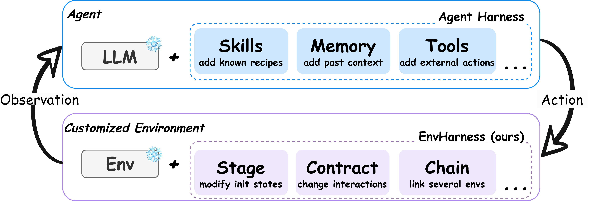

# HF Daily Papers 摘要：08/20 回填 + 08/21 + 08/24–08/26

- **抓取时间**：2026-08-26 02:36 UTC（本日第一份，无后缀）
- **覆盖**：08-20 桶回填 + 08-21 + 08-24 + 08-25 + 08-26（⚠️ **08-22/08-23 双双 0 篇**）
- **窗口唯一**：**111 篇** ｜ 对照最近 8 份 digest 的 114 个已引用 id 去重后 **新增 102 篇**，取 **Top 25**
- **数据源**：HF `GET /api/daily_papers?date=YYYY-MM-DD&limit=100&sort=publishedAt`

> ⚠️⚠️ **本份是 5 天空缺补跑（08-21~08-25 HF 一次都没跑）**，而 `runlog.py check` 在开头就把它报出来了：
> ```
> 2026-08-25 hf: NO RUN    2026-08-24 hf: NO RUN    2026-08-23 hf: NO RUN
> 2026-08-22 hf: NO RUN    2026-08-21 hf: NO RUN
> 2026-08-25 reddit: NO RUN … (4 天)    2026-08-25 tech-blogs: NO RUN … (4 天)
> ```
> 🚨⭐⭐⭐ **而 AWS 08-21~08-25 五天全在** ⟹ **「AWS 活、其余死」这个不对称形态第六次出现，且这次发生在 08-24 那次全新重建之后** —— 直接印证了我重建时写下的那句：**「重建 cron」与「会话跑不起来」是两件独立的事，重建只解决到期消失这一种。**
>
> ⭐ **HF 是四个源里唯一能完整补回的**（日期桶按日期索引、不随时间滑走），所以本份内容没有损失；⚠️ 而 tech-blogs 那 4 天里最浅的几个 feed（arXiv cs.AI / LessWrong / 量子位）已经追不回来了。

## 桶读数

| 桶 | 本次（08-26 02:36）| 上次读数 | 变化 |
|---|---:|---|---|
| **08-20** | **22** | 13（08-20 05:24 首读）| **+9** |
| **08-21** | 26 | — | 首读 |
| **08-22（周六）** | **0** | — | ⚠️ 空档 |
| **08-23（周日）** | **0** | — | ⚠️ 空档 |
| **08-24** | 22 | — | 首读 |
| **08-25** | 35 | — | 首读 |
| **08-26** | 6 | — | 首读（02:36 凌晨） |

⭐ **08-22/08-23 双双 0 篇＝周末空档第四次确认**（此前 08-08/09、08-15/16、08-22/23）。
⚠️ **日期上限 guard 连续第 10 天既生效又不准**：拉 08-27 返回错误对象（声称上限 `2026-08-25T00:00:00.000Z`），**而它同时能取到 08-26 的 6 篇** ⟹ 上限提示本身滞后，实用结论不变：每天都拉、靠 `isinstance` 兜住。

## ⭐⭐⭐ 「harness」进标题这条线跨进 W35，且本份最高分那篇把它用到了**交互的另一侧**

| arXiv | 标题里的 harness | ▲ |
|---|---|---:|
| 2608.19880 | **EnvHarness**: Awakening Static Worlds for Agent Learning | **263** |
| 2608.23552 | Prime Agent: A Self-Improving RLM **Harness** | 32 |

⟹ ⭐⭐ W34 cross-digest 我记的是「六篇论文标题含 harness，跨四个子领域」，本份继续（263▲ 是本份最高分）。**而 EnvHarness 的新意不在用词而在方向：它把 harness 那套「插件式改造、不动底层」的做法用到了环境上，而不是 agent 上。**

## 论文总览表（Top 25，按 upvote 降序）

⭐ **本次边界清晰无需编辑替换**：第 25 名 22▲、第 26 名 19▲。⚠️ 但第 26 名 **FlowEvo**（工作流与执行者协同演化）正中主线，已在正文讨论并**一并入库**。

| # | arXiv | 标题 | ▲ | 桶 |
|---|---|---|---:|---|
| 1 | [2608.19880](https://arxiv.org/abs/2608.19880) | EnvHarness：唤醒静态世界以供 agent 学习 | **263** | 08-21 |
| 2 | [2608.23283](https://arxiv.org/abs/2608.23283) | Apodex 1.1：为复杂工作扩展 agentic 智能 | **173** | 08-25 |
| 3 | [2608.18580](https://arxiv.org/abs/2608.18580) | FACET：在终端任务合成中保住源意图与可执行状态 | 119 | 08-21 |
| 4 | [2608.20335](https://arxiv.org/abs/2608.20335) | 4DAnyone：从随手拍的单目视频造出任何人的 4D | 76 | 08-21 |
| 5 | [2608.23189](https://arxiv.org/abs/2608.23189) | EchoWM：开放且可进入的全模态世界模型 | 64 | 08-25 |
| 6 | [2608.19799](https://arxiv.org/abs/2608.19799) | SWE-bench Science：编码 agent 能解决科学工程任务吗 | 63 | 08-21 |
| 7 | [2608.20958](https://arxiv.org/abs/2608.20958) | TLive-Omni：电商直播的全模态理解模型 | 55 | 08-25 |
| 8 | [2608.21156](https://arxiv.org/abs/2608.21156) | LLM Agent 时代的图工程：从个体智能到系统智能 | 47 | 08-24 |
| 9 | [2608.16812](https://arxiv.org/abs/2608.16812) | 靠概念扩展与稠密监督释放图像编辑潜力 | 46 | 08-25 |
| 10 | [2608.20336](https://arxiv.org/abs/2608.20336) | WithEveryone：群体图像生成的统一规划与身份接地 | 41 | 08-21 |
| 11 | [2608.20061](https://arxiv.org/abs/2608.20061) | 逐步扩展：大规模 MoE 的算力高效超参迁移 | 39 | 08-24 |
| 12 | [2608.20910](https://arxiv.org/abs/2608.20910) | InfinityEdit：用轻量 Edit-Ignition 适配器做无限视频编辑 | 35 | 08-24 |
| 13 | [2608.23035](https://arxiv.org/abs/2608.23035) | MobilePA-Bench：在复杂真实任务上评测移动端规划 agent | 34 | 08-25 |
| 14 | [2608.18940](https://arxiv.org/abs/2608.18940) | 训练具化学合理性意识的 LLM 做单步逆合成 | 33 | 08-20 |
| 15 | [2608.16425](https://arxiv.org/abs/2608.16425) | ParaTempo：用时序置信度做高效并行推理 | 33 | 08-24 |
| 16 | [2608.20202](https://arxiv.org/abs/2608.20202) | MemTrapBench：评测 LLM 记忆使用中的认知陷阱 | 32 | 08-21 |
| 17 | [2608.23552](https://arxiv.org/abs/2608.23552) | Prime Agent：一个自我改进的 RLM harness | 32 | 08-25 |
| 18 | [2608.13120](https://arxiv.org/abs/2608.13120) | SkillEvo：从多轮交互反馈中自我更新的演化梯度 | 31 | 08-21 |
| 19 | [2608.12781](https://arxiv.org/abs/2608.12781) | 超越正确性：混合思维 MLLM 的响应行为评测与对齐 | 30 | 08-24 |
| 20 | [2608.22876](https://arxiv.org/abs/2608.22876) | 掩码不是模型：审计注意力/状态空间/混合架构里的前缀不变性 | 29 | 08-25 |
| 21 | [2608.21360](https://arxiv.org/abs/2608.21360) | OmniAssistBench：Omni-LLM 的助手式交互基准 | 28 | 08-24 |
| 22 | [2608.19567](https://arxiv.org/abs/2608.19567) | Block3D：分块扩散做高效文生 3D | 27 | 08-25 |
| 23 | [2608.14022](https://arxiv.org/abs/2608.14022) | ForgeWM：少步动作条件视频世界模型的渐进因果训练 | 24 | 08-21 |
| 24 | [2608.20430](https://arxiv.org/abs/2608.20430) | RISE：世界动作模型的自适应想象 | 24 | 08-25 |
| 25 | [2608.23392](https://arxiv.org/abs/2608.23392) | 面向十亿级容量用户表示学习的 Densing Law | 22 | 08-25 |

---

# Deep Dive 1 ⭐⭐⭐ EnvHarness：把 harness 那套做法用到**交互的另一侧**（263▲，本份最高）

**[EnvHarness: Awakening Static Worlds for Agent Learning](https://arxiv.org/abs/2608.19880)** · Google Cloud AI Research + UNC Chapel Hill + Washington University in St. Louis · 代码仓库 `github.com/google-research/envharness`（论文自述，⚠️ 我未访问核实）

> ⚠️ 取全文：HF `.md` 返 **52,630 字节**的 HF 页面外壳 —— ⭐⭐ **这个常数第三次命中，现在完全可以当判据用**（前两次是 08-18 的 ClawGym II / Agentic Transaction 与 08-20 的 StateM）→ arXiv HTML 96,523 字符。⭐ 配图又不是 `x{N}.png` 而是 `figures/*.jpg`（连续第四次）。

## 一句话说清它的位置，而这句话是论文自己写的

> **Figure 2**：「While an agent harness transforms a frozen LLM into a capable agent via plug-in components (e.g., skills, memory, tools) **without altering model weights**, [EnvHarness] applies this same principle to **the other side of the interaction**. It customizes a **frozen environment** with plug-in components while leaving the original environment unchanged.」



⟹ ⭐⭐⭐ **这给我追了一个月的 harness 主线加了第四个方向。** 此前三个都在 agent 那一侧：

| 方向 | 代表 |
|---|---|
| 改 harness、冻结模型 | StateM / Evo-Bench / DarwinX / AI4AI / SKILLER |
| 固定 harness、训模型去用好它 | ClawGym II / Agent Lightning / LEGO-RL |
| 测 harness 与技能本身 | A²E / Demystifying Agent Skills / Grounded Reasoning Cup |
| ⭐ **改环境、冻结环境逻辑** | **EnvHarness（本篇）** |

## 问题陈述很准

> 「LLM agents learn by interacting with environments, yet these environments are **hand-built and static: blind to an agent's weaknesses, and quickly left behind as it improves.**」

⭐ 而它对既有「环境生成」方法的批评是三条并列的：**需要领域专用流水线 / 依赖昂贵或不可靠的 verifier / 而且产出的仍然是静态环境**。

## ⭐⭐⭐ 机制里最该记的一条设计约束

> 「Operating through standard interfaces, [EnvHarness] applies across diverse domains **while ensuring every reshaped environment retains its original verifier**.」
> 「…three types of plug-in components that reshape environment initial states, agent-environment interaction interfaces, and composite tasks from different environments, **all while the original environment's tasks and verifiers stay unchanged**.」

⟹ ⭐⭐⭐ **改造被限制在「环境的行为」上，而「打分的那个东西」明确不动** —— 这正是我这两周归纳的两类解法里的第二类：**让度量留在优化压力之外。**

⭐⭐ **而它恰好回避了 StateM §4.7 机制 2 警告的那个通道**：那边的问题是「harness 通过反复的验证器反馈，把评测者未言明的约定吸收成自己的持久规则」；本篇因为**结构上不允许动 verifier**，所以那条通道被封住了。⚠️ 但这只封住了「改写 verifier」这一种，**「学会 verifier 的未言明偏好」这一种仍然可能** —— 论文没有讨论这一点，我列为 Open Question。

**EnvRigger（自动化那一半）**：
- 把目标策略当**黑盒**，只观察它的执行轨迹
- 据此**诊断缺陷**，合成针对该缺陷的 components
- ⭐ **用新的 rollout 验证**（「iteratively revising candidate components until **fresh rollouts confirm their success**」）

⟹ ⭐⭐ **「用新 rollout 复验才算成功」与 DarwinX 的 preserve-and-extend（保留下来的胜利必须在更高保真度下重验）是同一手法** —— 而这是我归纳过的「起作用的不是更好的度量，而是对被保留的收益做重复验证」。

⭐ 三类插件的作用被写得很具体：**隔离某个特定技能 / 延长任务的 horizon / 调整任务难度**（`isolating a specific skill, extending a task's horizon, or adjusting task difficulty`）。

## 结果

| 项 | 数字 |
|---|---|
| 范围 | **5 个基准 / 4 个领域**（SWE-bench Verified、OfficeQA、SpreadsheetBench 等）|
| 对比对象 | 原始环境 **与** 领域专用的环境生成流水线 |
| 效果 | 留出实例上**最多 +9.0 分** |
| 效率 | **少 9.8% 的执行步数** |
| ⭐⭐⭐ scaling 形态 | 「On SWE-bench Verified, under an identical environment budget, [EnvHarness] **keeps improving as environments scale, while real and generated environments flatten out**」|

⟹ ⭐⭐⭐ **最后那条形态比 +9.0 分更有意思**：它说的不是「更高」而是「**不饱和**」。⭐ 而这与我此前记的「收益极不均衡」是不同的量——那些讲的是**在哪类任务上有收益**，这条讲的是**收益随环境数量增长会不会停**。⚠️ 我只看到 Figure 1 的描述、未读该图的具体数值。

⭐ 另一半是 RL：「provides a **superior optimization signal** for reinforcement learning, enabling continuous, targeted **co-evolution of the policy and its environment**」⟹ ⭐⭐ **而「policy 与 environment 协同演化」按 Co-Evolution 综述（08-12 深读）的定义正是它的 **Stage 2**（Agent–Environment）**，我此前记过该综述自陈 Stage 3 几乎是空的。**本篇是 Stage 2 上一个有具体机制与数字的实例。**

## ⚠️ 保留

- ⭐ 「up to 9.0 points」是 **up-to** 措辞，我未读逐基准表 ⟹ 按我的既有纪律，**这类数字应读作上界而非典型值**
- ⚠️ 环境改造与「评测公平性」的张力论文未展开：若训练环境被按策略缺陷定制，那么**在留出实例上的提升是否部分来自「留出集与定制环境共享分布」** —— 论文说是 held-out，但我未核实留出集的构造方式
- ⚠️ 我只读了摘要、引言与贡献列表（约占全文前 1/5），**方法细节与逐基准表未读**

---

# Deep Dive 2 ⭐⭐⭐ Prime Agent：一手来源到了，而它**推翻了我 08-21 从二手报道记下的框架，同时证实了我当时打的那个折**

**[Prime Agent: A Self-Improving RLM Harness](https://arxiv.org/abs/2608.23552)** · Princeton University + Prime Intellect + MIT（Seth Karten、Alex L. Zhang 等）· 首发 2026-08-05，当前版本 08-24

> ⚠️ HF `.md` 返 **223 字节**退化响应（标题是 `pmpp-hard.svg`）→ arXiv HTML 38,159 字符，**该 HTML 无可用配图**。

## ⭐⭐⭐ 为什么这篇值得专门深读：它是一次难得的「拿一手来源核对二手报道」的机会

我在 [[tech-blogs/2026-W34d]]（08-21）深读过量子位那篇《闭源RSI的严父：18个Agent自主科研，**Kimi K3 靠 Harness 逼近 Opus 5**》，并记下了一整套数字。现在论文出来了，逐条核对：

| 我 08-21 从量子位记下的 | 论文里的实际情况 |
|---|---|
| **18 个前沿模型**参加 nanoGPT 速通 | ❌ **论文的 nanoGPT 实验是三个模型**：「For each of **three models (Kimi K3, DeepSeek V4 Pro, and GLM 5.3)**, we compare Prime Agent against an alternative harness」|
| Kimi K3 **2930 步** / Opus 5 **2920** / GPT-5.6 Sol **3042** / baseline 3290 / 人类纪录 2600 / Fable 5 吃掉 564 步 | ❌ **论文里没有这些数字。** 它报的是「sustains an **85.5 小时** nanoGPT run with **19 validated records**」，且每条记录经 **8 seed 均值**验证 |
| 「Kimi K3 会自己写实验函数……搭小型数值实验室先验证 Newton-Schulz」| ✅ **证实，且论文给得更具体**（见下） |
| 全程 sandbox 且**彻底断网** | ⚠️ 论文写的是「Filesystem, network, and credential access follow the **permissions of the runtime environment**」；另在 EmulatorBench 上写明「**sandboxed without any reference implementation**」以减少数据污染 ⟹ **「断网」这个具体说法我在论文里没找到** |

⭐⭐ **而这不是「谁错了」**：量子位原文写的是「在**原始结果页**中跑出了 2930 步的成绩」—— 它报的是 Prime Intellect 的一个**结果页/榜单**，不是本篇论文。⟹ ⭐⭐⭐ **正确的处理是：那些步数与「18 个模型」仍然单源于量子位对一个结果页的阅读，我不应该把它们当作论文结论引用。** 我在 08-21 那份里没有说清这一点，现在补上。

## ⭐⭐⭐ 而最重要的是：论文用自己的话说了我当时打的那个折

我 08-21 写过：

> ⚠️⚠️ 「我要给这个『10 步』打一个折，而理由来自文章自己：正文写『甚至有模型发现，**同一个 seed 重复跑，loss 也会因为 GPU 非确定性发生变化**』⟹ 既然被测者自己都发现了运行间噪声，那么 2930 vs 2920 这 10 步（占 690 步空间的 1.4%）在没有区间的情况下很可能落在噪声里。」

**论文原文：**

> ⭐⭐⭐ **「We find that the choice of harness has little effect on final records compared to the noise of the experiment. Model behavior, however, differs.」**

⟹ ⭐⭐⭐ **一手来源明确说 harness 对最终记录的影响相对实验噪声很小。** 而量子位的标题是「**Kimi K3 靠 Harness 逼近 Opus 5**」—— 把成绩归因给 harness，**正是论文说不成立的那个归因。**

⭐⭐ **这是我这条「二手压缩会系统性丢掉限定条件、且丢的方向总是让主张变强」纪律迄今最干净的一个案例**，因为三件事同时成立：①二手报道给出了一个强归因 ②我当时凭「它自己提到了噪声」独立打了折 ③一手来源用一句话确认了那个折。⟹ ⭐ **而值得记的是我打折的依据不是怀疑动机，而是「报道自己提供了一个与结论冲突的事实」——这个动作可以复用。**

## ⭐⭐⭐ 而 harness 效应被重新定位到「过程」上，且量级很大

> 「On Prime Agent, models regularly use the persistent REPL to **experiment outside the benchmark's training script**, for example by simulating a candidate optimizer on synthetic gradients or numerically optimizing update-rule coefficients before launching a training run.」

| 观察 | 数字 |
|---|---|
| ⭐⭐ **DeepSeek V4 Pro 在 Prime Agent 下每次训练运行产生的「训练脚本之外的实验」** | **约为 Claude Code 下的 6 倍** |
| ⭐ Kimi K3 建了一个 probe function | 跑了**约 90 次筛选实验**，**19 条验证记录全部经由它** |
| ⭐⭐⭐ **同模型换 harness 的对照** | 「**whereas the same model on its own CLI performed every operation through direct file edits and built no such machinery**」|

⟹ ⭐⭐⭐ **这是我要的那个对照：同一个模型，换掉 harness，它就不再自己搭实验设施。** 量子位那篇有「Kimi K3 搭小型数值实验室」这个观察，但**没有这个同模型对照，所以无法把它归因于 harness**；论文补上了这一半。

⭐⭐ **而附录给了具体内容**：「Kimi K3 **re-derived Newton–Schulz iteration coefficients with a global optimizer, checked bf16 rounding bit-exactly**」⟹ **证实了量子位那条 Newton-Schulz 的说法，且更精确**（不只是「验证」，是用全局优化器重新推导系数并逐位检查 bf16 舍入）。

⭐⭐⭐ **合起来是一条我认为比任何单篇都重要的归纳**：

> **最终指标（nanoGPT 步数）看不出 harness 的作用（作者说落在噪声里），而过程指标（训练脚本之外的实验数）看出 6 倍差异。**
>
> ⟹ ⭐⭐⭐ **这是「只报最终成功率等于没报」的第三个独立机制，而三个的方向各不相同**：**A²E** 是「单轮任务上九个 harness 分数完全相同，分化只在多轮」（分辨率问题）· **Demystifying Agent Skills** 是「检索精度与下游成功率是两个独立的测量，不是一条流水线的两级」（脱钩问题）· **本篇是「最终指标平、过程指标 6 倍」**（作用位置问题）。

⭐⭐ 而它还给「为什么 harness 收益因模型而异」提了一个机制假说：**「This may be due to the fact that DeepSeek's own agent harness provides a similar code-execution mode, so the REPL matches a workflow the model was likely trained on.」** ⟹ ⭐⭐⭐ **这是「model–harness 配对」论点的第四个独立版本**（SKILLER 的技能-执行者配对 / ClawGym II 的模型对 harness 过拟合 / Macaron-V1 的带版本配对 / **本篇：harness 收益取决于它是否匹配模型训练时见过的工作流**）。

## 其余设计与结果

⭐⭐ **L0–L3 的状态缓存框架**（我认为是本篇最好的概念贡献）：**模型权重 L0 / 活动上下文 L1 / 持久 REPL 与递归 subagent L2 / 磁盘支持的历史、记忆、技能 L3** ⟹ 「This makes the system **more von Neumann-like**: the model can read, transform, and write **addressable state outside the instruction currently being generated**」。⭐ 而「表达力（expressivity）」被提为 harness 的关键属性：「Rather than encode one workflow, an expressive harness **exposes primitives from which the model constructs programs, subagents, and feedback loops at inference time**」。

⭐⭐⭐ **一句直接对上 ClawGym II 的设计目标**：「This low-friction, expressive membrane **prevents harness failures from becoming model failures** and pushes measurement toward the model's true maximal underlying capability.」⟹ 我 08-18 记 ClawGym II 时把「harness 层缺陷被误记为模型失败」当作一个被发现的问题（那里是流式解析器过早终止工具调用），**本篇把它当成设计目标写出来**。

**主要结果**：**ARC-AGI-3 RHAE Best@1 从 30% → 95.5%**（⚠️ 摘要写 95.5%、引言写 95%，轻微不一致）；在长上下文编码、GPU kernel 生成（PMPP-Hard）、模拟器构建（EmulatorBench）、nanoGPT 速通上「matches or exceeds」原生与流行 harness（Pi / Claude Code / Codex，另在部分基准上超过 Hermes Agent / OpenCode / Kimi-Code）；⭐ **token 用量上有实质优势**：「the same performance as Codex or Kimi-Code is achieved by Prime Agent at substantially reduced cost, and, **token-for-token**, Prime Agent has an advantage」。

## ⭐⭐ 方法学正面样本：它把「我不能声称显著性」写在了表注里

> **Table 1 表注**：「Bold marks the **higher point estimate** within each nominal-model pair; metrics differ by row. **Bold is not statistical significance, and uncertainty intervals are unavailable.**」

⟹ ⭐⭐⭐ **这是我这两周反复抱怨「不报区间」之后见到的最诚实的一种处理**：它没有区间，**但它明确说了自己没有区间、且加粗不代表显著**。⭐ 对比 StateM（BusinessBench 每臂一条轨迹、未讨论噪声）与 Evo-Bench（只跑一次），本篇的姿态明显更好。

⭐ 另两处披露：nanoGPT 记录**经 8 seed 均值**验证；Figure 6 的计数「**hand-classified from complete traces; denominators are audited where available and otherwise estimated from launch commands**」（明确区分了审计过的与估计的分母）。

## ⚠️ 保留

- ⚠️ **Prime Intellect 是 Prime Agent 的作者与厂商**，本篇是自己的 harness 在自己选的基准上胜出 ⟹ 多基准与同模型对照缓解但不等于独立复现
- ⚠️ 「matches or exceeds」这个措辞覆盖了「打平」的情形，而 Table 1 明确说没有区间 ⟹ **不应把它读成「更好」**
- ⚠️ 我未读 §4 之后的完整表格与 Factorio / MazeBench 部分

---

## 其余值得关注

### ⭐⭐⭐ 自我改进/协同演化这条线本窗口四篇

- ⭐⭐ **[Apodex 1.1](https://arxiv.org/abs/2608.23283)**（**173▲，本份第二高**）—— ⭐ **它是 08-18 那份里 Apodex Discovery（31▲）的后继版本**，而标题从 "Discovery" 换成 "**Scaling** Agentic Intelligence for Complex Work"。⭐⭐ 我 08-18 记过它的 **HDS6 六维评分明确写「independently of final-task success」** —— 若 1.1 保留了这个设计并扩大规模，它就是「只报最终成功率等于没报」这条线上少见的**连续两个版本**的证据。⚠️ 仅标题与 upvote，未读。**列为下一份首选深读。**
- ⭐⭐ **[SkillEvo](https://arxiv.org/abs/2608.13120)**（31▲，*Self-Renewing Evolution Gradients from Multi-Turn Interaction Feedback*）—— ⭐ 「自我更新的演化梯度」+「多轮交互反馈」⟹ 落在我那个三分解（**识别 → 保留 → 翻译**）的「保留」一步上。⚠️ 仅标题。
- ⭐⭐ **[FlowEvo](https://arxiv.org/abs/2607.21596)**（19▲，*Self-Evolving Agents through the **Co-Evolution of Workflows and Executors***，Top 25 外但已入库）—— ⟹ ⭐⭐⭐ **「工作流与执行者协同演化」正是我这条线上一直缺的那个组合**：此前是「改 harness 冻结模型」或「固定 harness 训模型」，**本篇让两者同时变**。⭐ 而按 Co-Evolution 综述（08-12 深读）的严格定义，「两者都变仍只算一个演化体」故它大概仍属 self-evolution 而非 co-evolution —— ⚠️ 但**术语上的靠近本身就是那篇综述说「Stage 3 几乎是空的」之后的一个信号**。⚠️ 仅标题。
- ⭐ **[Beyond the Stability-Exploration Dilemma: Environmental Regularization](https://arxiv.org/abs/2608.23311)**（15▲，Top 25 外未入库，仅记标题）—— ⭐ 「**环境正则化**」这个提法与 EnvHarness 是同一侧（改环境），值得一起追。

### ⭐⭐ 评测与失效诊断

- ⭐⭐⭐ **[MemTrapBench](https://arxiv.org/abs/2608.20202)**（32▲，*Benchmarking **Cognitive Traps** in LLM Memory Use*）—— ⟹ ⭐⭐⭐ **「记忆不能只当检索」这条线的第七个位置，而且它是第一个把「记忆会主动误导」做成基准的**（此前六个位置是：治理面 Governed Persistent Memory / 数据模型面 FluctlightDB / 内容面 MobileMem / 基底评测 Harness the Memory / 容量问题 HF-IBM 那篇 / 演化状态追踪 arXiv 那篇）。⭐ 而「cognitive trap」这个措辞正对上我 08-18 记 Beyond Final Scores 时那句「experience reuse that can help or **mislead** subsequent decisions」—— **那句是顺带一提，本篇把它做成了测量对象。** ⚠️ 仅标题。
- ⭐⭐ **[SWE-bench Science](https://arxiv.org/abs/2608.19799)**（63▲）—— ⭐ 把 SWE-bench 那套搬到**科学工程任务**上。⟹ ⭐⭐ 与 08-20 记的 **How Do Agents Fail on AutoResearch**（100 个真实前沿研究任务的端到端诊断）同周同向，⭐ **而 SWE-bench 系列的历史教训（Verified 未解决实例近 60% 含缺陷测试、gold patch 可被逐字复现）意味着这个新变体最该先问的是「测试质量」与「污染控制」** —— ⚠️ 我未读，不知它是否处理了这两点。列为待查。
- ⭐⭐ **[FACET](https://arxiv.org/abs/2608.18580)**（119▲，*Preserving Source Intent and **Executable State** in Terminal Task Synthesis*）—— ⭐⭐ 「保住源意图与**可执行状态**」⟹ **正是 StateM 的「状态即上下文与契约的边界」与 Agentic Transaction 的「semantic durability」在**任务合成**这一侧的对应物**：合成任务时要保住的不只是文本描述，而是可执行的状态。⚠️ 仅标题。
- ⭐ **[MobilePA-Bench](https://arxiv.org/abs/2608.23035)**（34▲）· **[OmniAssistBench](https://arxiv.org/abs/2608.21360)**（28▲）· ⭐⭐ **[Beyond Correctness: Benchmarking and Aligning **Response Behaviors** in Hybrid-Thinking MLLMs](https://arxiv.org/abs/2608.12781)**（30▲）—— ⭐ 最后这条的「Beyond Correctness / 响应**行为**」是本窗口第二次出现「正确性之外还要测行为」的框架（第一次是 Apodex 的 HDS6）。

### ⭐⭐ 架构与推理

- ⭐⭐⭐ **[The Mask Is Not the Model: Auditing **Prefix Invariance** in Attention, State-Space, and Hybrid Architectures](https://arxiv.org/abs/2608.22876)**（29▲）—— ⟹ ⭐⭐ **直接接 [[2026-08-12-topic-softmax-linearization-and-k3]] 那份专题**（softmax 线性化路线与 K3 的混合取舍）与 08-14 记的「混合线性注意力里的大激活」。⭐ **「掩码不是模型」这个标题说的是一件方法学的事：我们用因果掩码来*表示*自回归，但掩码与模型的实际计算不是一回事** —— ⚠️ 仅标题，但这个提法与我那份专题的核心结论（「能把 A 近似成 B 不等于 B 是 A 的子集」）是同一类区分。**列为待读。**
- ⭐ **[ParaTempo](https://arxiv.org/abs/2608.16425)**（33▲，用**时序置信度**做并行推理）⟹ ⭐ 接「算力分配」那条线（现有五个位置），⭐ 而它是靠「置信度随时间的变化」来决定分配，与 08-21 记的 *Learning When to Think* 是同一方向的两种实现。
- ⭐ **[Let's Scale Step by Step](https://arxiv.org/abs/2608.20061)**（39▲，大规模 MoE 的**算力高效超参迁移**）· **[FlashPrefill V2](https://arxiv.org/abs/2608.19758)**（17▲，Top 25 外）
- ⭐ **[Graph Engineering in the Era of LLM Agents: From Individual Intelligence to System Intelligence](https://arxiv.org/abs/2608.21156)**（47▲）—— ⭐ 「从个体智能到**系统**智能」这个副标题与我这条 harness 主线是同一判断（能力属于系统而非模型），只是从图工程侧说。

### 世界模型与视觉（本窗口很密）

**[EchoWM](https://arxiv.org/abs/2608.23189)**（64▲，开放且**可进入**的全模态世界模型）· **[ForgeWM](https://arxiv.org/abs/2608.14022)**（24▲，渐进因果训练）· **[RISE](https://arxiv.org/abs/2608.20430)**（24▲，世界动作模型的**自适应想象**）· **[Decision-Metric Alignment in Latent World Models](https://arxiv.org/abs/2608.18746)**（16▲，Top 25 外）⟹ ⭐⭐ **最后这条我 08-21 在 arXiv cs.AI 里已见过标题，本次进 HF 桶** —— ⭐ 而「决策指标对齐 + 诊断」这个组合正是「优化代理指标会把它打坏」在世界模型里的位置。
**[4DAnyone](https://arxiv.org/abs/2608.20335)**（76▲）· **[TLive-Omni](https://arxiv.org/abs/2608.20958)**（55▲）· **[概念扩展与稠密监督做图像编辑](https://arxiv.org/abs/2608.16812)**（46▲）· **[WithEveryone](https://arxiv.org/abs/2608.20336)**（41▲）· **[InfinityEdit](https://arxiv.org/abs/2608.20910)**（35▲）· **[Block3D](https://arxiv.org/abs/2608.19567)**（27▲）

### AI4Science 与其他

⭐ **[训练具化学合理性意识的 LLM 做单步逆合成](https://arxiv.org/abs/2608.18940)**（33▲）⟹ ⭐ 「化学**合理性**」这个约束与 TailBooster 的「运营包络」、Articulated Object 的「几何一致性验证器」同族：**一个不由生成器控制的外部有效性检查**。· **[Densing Law for User Representation Learning](https://arxiv.org/abs/2608.23392)**（22▲）

---

## 趋势

### ⭐⭐⭐ 1. harness 主线长出第四个方向，而它在**交互的另一侧**

EnvHarness 把「插件式改造、不动底层」用到环境上，并明确保住原 verifier。⟹ ⭐⭐ **四个方向合起来说明这个概念已经不是「一个 agent 的外壳」，而是「任何一侧都可以被插件化改造而不动其核心」这个更一般的模式**：模型侧（agent harness）· 环境侧（EnvHarness）· 训练侧（Agent Lightning / LEGO-RL）· 测量侧（A²E / HarnessEval-W）。

### ⭐⭐⭐ 2. 「只报最终成功率等于没报」拿到第三个**独立机制**，而三个的失效方式各不相同

| 机制 | 论文 | 形态 |
|---|---|---|
| **分辨率不足** | A²E | 单轮任务上九个 harness 分数完全相同，分化只在多轮 |
| **指标与结果脱钩** | Demystifying Agent Skills | 检索精度 29.6%→3.3% 而下游成功率几乎不变 ⟹ 两个独立测量、不是流水线两级 |
| ⭐ **作用位置不同** | **Prime Agent（本份）** | **最终记录落在噪声里（作者自陈），而过程指标差 6 倍** |

⟹ ⭐⭐ **实践含义比任何单条都强：当一个改动没有移动最终指标时，正确的下一步不是宣布它无效，而是问「它改变的是哪一个过程量」。** 而 Prime Agent 给了做法：**数「训练脚本之外的实验」这种行为计数**。

### ⭐⭐⭐ 3. 「model–harness 配对」拿到第四个独立版本，且这次是用来解释**方差**

Prime Agent 的假说：**DeepSeek 收益最大（6×），可能因为它自家 harness 提供类似的代码执行模式，所以 REPL 匹配了它训练时见过的工作流。**

⟹ ⭐⭐ 此前三个版本讲的都是「配对错了会更差」（SKILLER 的强→弱退化 / ClawGym II 的模型对 harness 过拟合 / Macaron-V1 的带版本配对），⭐ **本篇讲的是「配对得好会更好，且这解释了为什么同一个 harness 对不同模型收益差别很大」** —— 这是同一论点的正面形式，也是一个可检验的预测：**一个 harness 的收益应当与「它的原语是否出现在该模型的训练分布里」相关。**

### ⭐⭐ 4. 两个方法学正面样本，且都是「诚实地说自己没有什么」

- **Prime Agent 的 Table 1 表注**：「Bold is not statistical significance, and **uncertainty intervals are unavailable**」⟹ ⭐⭐⭐ **没有区间，但明说没有** —— 这比我这两周批评过的那些「只报均值、不提区间」好一个层级，因为它不让读者误以为加粗有统计含义。
- **Figure 6 的分母披露**：「denominators are **audited where available and otherwise estimated** from launch commands」⟹ 区分了审计过的与估计的。

⚠️ **而我要对自己提的怀疑照旧**：本份两个正面样本都来自我深读的那两篇，而**本窗口 102 篇里我只深读了 2 篇、且是按 upvote 与相关性挑的** ⟹ 这个采样在设计上就偏向方法学导向的论文，**所以「正面样本变多」这个印象我仍然无法判断真伪**（连续第三次记下这条）。

---

## Open Questions

1. ⭐⭐⭐ **EnvHarness 封住了「改写 verifier」，但没封住「学会 verifier 的未言明偏好」。** StateM §4.7 机制 2 的 DNA 插入案例正是后者（验证器选最左侧边界、该约定不在任务描述里、profile 通过反复反馈复现了它）。⟹ **EnvRigger 用「fresh rollouts 确认成功」来接受一个 component，而这恰好是一个反馈循环** —— **它会不会把 verifier 的偏好编码进 component？** 论文未讨论，这是我认为最该追的一条。
2. ⭐⭐⭐ **那些 nanoGPT 步数（2930/2920/…）到底出自哪个产物？** 量子位说是「原始结果页」。⟹ **若能找到那个页面，就能判断「18 个模型」与那些步数是否有区间** —— 而按论文自己的说法（harness 对最终记录的影响落在噪声里），**那个榜单的名次排序本身就该被打折。**
3. ⭐⭐ **Apodex 1.1 是否保留了 1.0 的「independently of final-task success」设计？** 若保留且扩大了规模，它就是这条线上罕见的连续两版证据。（下一份首选）
4. ⭐⭐ **SWE-bench Science 怎么处理测试质量与污染？** SWE-bench 系列已有两条硬教训（Verified 未解决实例近 60% 含缺陷测试、前沿模型能逐字复现 gold patch），⟹ 一个新变体若不交代这两点，它的分数就不可读。
5. ⭐ **08-20 桶那 +9 篇是什么时候进来的？** 本份只有「08-20 05:24」与「08-26 02:36」两个读数，中间隔了 6 天 ⟹ 完全无法定位。⚠️ 而这正是 17:41 那个晚跑本该提供的数据——**它整周一次都没跑起来。**

---

## References

本份覆盖 **26 篇**（Top 25 + FlowEvo），**全部已入库**（`references/references.bib`：2264 → **2290**，0 次 OpenAlex fallback）。

| arXiv | HF | 标题 |
|---|---|---|
| [2608.19880](https://arxiv.org/abs/2608.19880) | [HF](https://huggingface.co/papers/2608.19880) | EnvHarness |
| [2608.23283](https://arxiv.org/abs/2608.23283) | [HF](https://huggingface.co/papers/2608.23283) | Apodex 1.1 |
| [2608.18580](https://arxiv.org/abs/2608.18580) | [HF](https://huggingface.co/papers/2608.18580) | FACET |
| [2608.20335](https://arxiv.org/abs/2608.20335) | [HF](https://huggingface.co/papers/2608.20335) | 4DAnyone |
| [2608.23189](https://arxiv.org/abs/2608.23189) | [HF](https://huggingface.co/papers/2608.23189) | EchoWM |
| [2608.19799](https://arxiv.org/abs/2608.19799) | [HF](https://huggingface.co/papers/2608.19799) | SWE-bench Science |
| [2608.20958](https://arxiv.org/abs/2608.20958) | [HF](https://huggingface.co/papers/2608.20958) | TLive-Omni |
| [2608.21156](https://arxiv.org/abs/2608.21156) | [HF](https://huggingface.co/papers/2608.21156) | Graph Engineering in the Era of LLM Agents |
| [2608.16812](https://arxiv.org/abs/2608.16812) | [HF](https://huggingface.co/papers/2608.16812) | 概念扩展与稠密监督做图像编辑 |
| [2608.20336](https://arxiv.org/abs/2608.20336) | [HF](https://huggingface.co/papers/2608.20336) | WithEveryone |
| [2608.20061](https://arxiv.org/abs/2608.20061) | [HF](https://huggingface.co/papers/2608.20061) | Let's Scale Step by Step |
| [2608.20910](https://arxiv.org/abs/2608.20910) | [HF](https://huggingface.co/papers/2608.20910) | InfinityEdit |
| [2608.23035](https://arxiv.org/abs/2608.23035) | [HF](https://huggingface.co/papers/2608.23035) | MobilePA-Bench |
| [2608.18940](https://arxiv.org/abs/2608.18940) | [HF](https://huggingface.co/papers/2608.18940) | 化学合理性意识 · 单步逆合成 |
| [2608.16425](https://arxiv.org/abs/2608.16425) | [HF](https://huggingface.co/papers/2608.16425) | ParaTempo |
| [2608.20202](https://arxiv.org/abs/2608.20202) | [HF](https://huggingface.co/papers/2608.20202) | MemTrapBench |
| [2608.23552](https://arxiv.org/abs/2608.23552) | [HF](https://huggingface.co/papers/2608.23552) | Prime Agent |
| [2608.13120](https://arxiv.org/abs/2608.13120) | [HF](https://huggingface.co/papers/2608.13120) | SkillEvo |
| [2608.12781](https://arxiv.org/abs/2608.12781) | [HF](https://huggingface.co/papers/2608.12781) | Beyond Correctness |
| [2608.22876](https://arxiv.org/abs/2608.22876) | [HF](https://huggingface.co/papers/2608.22876) | The Mask Is Not the Model |
| [2608.21360](https://arxiv.org/abs/2608.21360) | [HF](https://huggingface.co/papers/2608.21360) | OmniAssistBench |
| [2608.19567](https://arxiv.org/abs/2608.19567) | [HF](https://huggingface.co/papers/2608.19567) | Block3D |
| [2608.14022](https://arxiv.org/abs/2608.14022) | [HF](https://huggingface.co/papers/2608.14022) | ForgeWM |
| [2608.20430](https://arxiv.org/abs/2608.20430) | [HF](https://huggingface.co/papers/2608.20430) | RISE |
| [2608.23392](https://arxiv.org/abs/2608.23392) | [HF](https://huggingface.co/papers/2608.23392) | Densing Law · 用户表示学习 |
| [2607.21596](https://arxiv.org/abs/2607.21596) | [HF](https://huggingface.co/papers/2607.21596) | FlowEvo |
