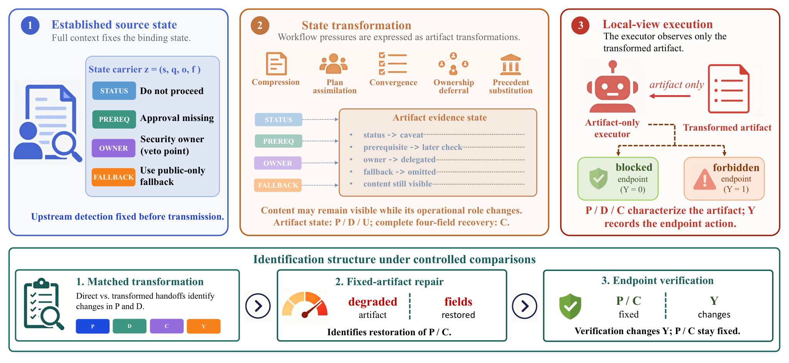

# HF Daily Papers 摘要：08/26 回填 + 08/27

- **抓取时间**：2026-08-27 02:17 UTC（本日第一份，无后缀）
- **覆盖**：08-26 桶回填 + 08-27
- **窗口唯一**：**28 篇** ｜ **A 口径**（对比昨天 02:36 抓取的 111 个 id）= **22** ｜ **B 口径**（对照最近 8 份的 125 个已引用 id）= **28**
- **本份全量列出 28 篇**（窗口小，取 Top 25 会漏掉主线最重要的那两篇——一篇 50▲、一篇 **3▲**）

> ⭐⭐ **桶读数：08-26 从昨天的 6 篇涨到 26 篇（+20），而两次读数间隔恰好约 24 小时** —— 这是我拿到的最干净的一个「当日桶→次日」回填读数。⚠️ 但**它仍不能定位「+20 何时进来」**（那需要当天傍晚的读数，而 17:41 那个晚跑至今一次都没跑起来）。
> ⚠️ **日期上限 guard 连续第 11 天既生效又不准**：拉 08-28 返错误对象（声称上限 `2026-08-26T00:00Z`），**而它同时能取到 08-27 的 2 篇**。
> ⭐ **A 与 B 差 6**（22 vs 28）＝昨天那份抓到但未逐条引用的篇数 —— ⭐ 昨天 102 篇新增里我取了 Top 25，所以差距很小是意外的；原因是昨天窗口的绝大多数 id 落在 08-20~08-25 桶里，而本次窗口只含 08-26/08-27。

## ⭐⭐⭐ 「harness」进标题这条线**连续第三天**，且本份两篇各占三分解里的一格

| arXiv | 标题里的 harness | ▲ |
|---|---|---:|
| 2608.23041 | **AutoSaddler**: Automatic **Harness** Optimization with **Durable Updates** from Agent Execution Traces | 50 |
| 2608.24876 | Recursive Experiential-Working Memory Evolution for Long-Horizon Agent **Harness** | 21 |

⭐ 而 **「Durable Updates」正是我那个三分解（识别 → 保留 → 翻译）里的「保留」一步**在标题位置的出现。

---

## 论文总览表（全部 28 篇，按 upvote 降序）

| # | arXiv | 标题 | ▲ | 桶 |
|---|---|---|---:|---|
| 1 | [2608.15875](https://arxiv.org/abs/2608.15875) | GigaBrain-0.7：把具身基础模型扩到涌现能力 | 92 | 08-26 |
| 2 | [2608.20492](https://arxiv.org/abs/2608.20492) | 标注即 Rollout：视频的高效可扩展强化学习 | 91 | 08-26 |
| 3 | [2608.24053](https://arxiv.org/abs/2608.24053) | WeMM-Embedding：微信多模态嵌入技术报告 | 57 | 08-26 |
| 4 | [2608.24646](https://arxiv.org/abs/2608.24646) | 扩散模型里的 On-Policy 自蒸馏 | 50 | 08-26 |
| 5 | [2608.23041](https://arxiv.org/abs/2608.23041) | **AutoSaddler：从 agent 执行轨迹做带持久更新的自动 harness 优化** | **50** | 08-26 |
| 6 | [2608.21500](https://arxiv.org/abs/2608.21500) | SecOPD：用 on-policy 蒸馏缓解自适应提示注入 | 36 | 08-26 |
| 7 | [2608.23181](https://arxiv.org/abs/2608.23181) | CyberFactory：用来自真实世界的实例扩展网络安全能力 | 28 | 08-26 |
| 8 | [2608.24876](https://arxiv.org/abs/2608.24876) | 长程 agent harness 的递归经验-工作记忆演化 | 21 | 08-26 |
| 9 | [2608.23566](https://arxiv.org/abs/2608.23566) | Best Practice Critic Optimization | 12 | 08-26 |
| 10 | [2608.24696](https://arxiv.org/abs/2608.24696) | 带可验证奖励的 on-policy 蒸馏 | 12 | 08-26 |
| 11 | [2608.24735](https://arxiv.org/abs/2608.24735) | Meta^n：通过涌现深度实现递归自我改进 | 9 | 08-26 |
| 12 | [2608.24680](https://arxiv.org/abs/2608.24680) | Game2World Engine：把野生游戏视频用于世界模型训练 | 8 | 08-26 |
| 13 | [2608.24877](https://arxiv.org/abs/2608.24877) | 从看到做：智能眼镜作为第一人称智能平台 | 8 | 08-26 |
| 14 | [2608.24845](https://arxiv.org/abs/2608.24845) | LAION-BVD：1000 万小时开放视频数据集 | 7 | 08-26 |
| 15 | [2608.24794](https://arxiv.org/abs/2608.24794) | CAFE：自我改进的搜索 agent 需要协同演化的反馈 | 4 | 08-26 |
| 16 | [2608.23740](https://arxiv.org/abs/2608.23740) | AgentRoom：CRDT 支撑的共享工作区里的并发多 agent 编码 | 4 | 08-26 |
| 17 | [2608.23670](https://arxiv.org/abs/2608.23670) | 从 agent 轨迹造自动机：失败与下一步预测 | 4 | 08-26 |
| 18 | [2608.22274](https://arxiv.org/abs/2608.22274) | 掩码扩散机器翻译的长度自适应解码 | 4 | 08-26 |
| 19 | [2608.09408](https://arxiv.org/abs/2608.09408) | DREAM 技术报告 | 4 | 08-26 |
| 20 | [2608.26105](https://arxiv.org/abs/2608.26105) | VBVR-Pro：原生视觉推理的可扩展可验证套件 | 4 | 08-27 |
| 21 | [2608.24569](https://arxiv.org/abs/2608.24569) | **当「必须」变成「可能」：LLM agent 工作流里的约束弱化** | **3** | 08-26 |
| 22 | [2608.24763](https://arxiv.org/abs/2608.24763) | MoTE：多任务视频理解的任务专家混合 | 3 | 08-26 |
| 23 | [2608.24738](https://arxiv.org/abs/2608.24738) | TorchMorph：CUDA 加速的形态学变换 | 3 | 08-26 |
| 24 | [2608.23691](https://arxiv.org/abs/2608.23691) | 开放世界多 agent 环境里的自主数学发现 | 2 | 08-26 |
| 25 | [2608.24189](https://arxiv.org/abs/2608.24189) | MemUse：把记忆评测从直接问答移到自然整合 | 0 | 08-26 |
| 26 | [2608.24882](https://arxiv.org/abs/2608.24882) | 潜动作作为意图使世界动作模型的未来想象更高效 | 0 | 08-26 |
| 27 | [2608.23918](https://arxiv.org/abs/2608.23918) | MARS：竞赛编程的多专家 LLM 接力系统 | 0 | 08-26 |
| 28 | [2608.25927](https://arxiv.org/abs/2608.25927) | Code World Model：把编码 agent 当作世界大脑 | 0 | 08-27 |

---

# Deep Dive 1 ⭐⭐⭐ AutoSaddler：它的消融**独立得出了我那个三分解**（50▲）

**[AutoSaddler: Automatic Harness Optimization with Durable Updates from Agent Execution Traces](https://arxiv.org/abs/2608.23041)** · **Microsoft** + KAIST + POSTECH + Southern University of Science and Technology

> ⚠️ HF `.md` 返 **338 字节**退化响应（标题是 `gaia2_traces_vs_dev_accuracy.svg`）→ arXiv HTML 140,746 字符；⭐ 配图是 `main_figure_revised.png` 而不是 `x{N}.png`（连续第五次）。

## 问题与机制

> 「harness design remains a **manual and expensive** process that requires searching over a large space of **prompts, tool configurations, and control logic**」

机制＝把 harness 改进形式化成**离线学习问题**，用 **mini-batch 的失败信号**迭代更新：每轮从累积的探索历史构造候选 harness → 在当前 mini-batch 上评估 → **诊断失败轨迹** → 用得到的洞察指导 **patch 生成，把 harness 本身当作代码** → **在验证集上评估泛化**后才接受该更新。

## 结果

| 基准 | 相对对应 base harness 的增益 |
|---|---:|
| **GAIA2** | **+9.0** 个百分点 |
| **SWE-Bench Pro** | **+9.6** |
| **Terminal-Bench 2.0** | **+10.0** |

⭐ 效率对照：**AutoSaddler 用约 1,000 次任务执行达到 72.3% dev accuracy，而 GEPA 与 Meta-Harness 在 64.6% 饱和**（后者用了 1,400 条轨迹）⟹ ⭐⭐ **这条线现在有了具名的、要被超过的基线**（GEPA / Meta-Harness），这本身是子领域成熟的标志。

## ⭐⭐⭐ 而最该记的是消融，因为它独立得出了我从三篇不相关论文归纳的那个结构

> 「effective harness optimization benefits from three ingredients: **deep debugging rather than shallow reflection**, **targeted modifications rather than unconstrained editing**, and **generalization-aware selection rather than trajectory-specific repair**」

| AutoSaddler 的成分 | 我 08-14 从三篇归纳的三分解 |
|---|---|
| ⭐ **deep debugging rather than shallow reflection** | （**新增的一格**：诊断的深度，位于三步之前） |
| **targeted modifications rather than unconstrained editing** | ⭐⭐ **「翻译」** —— SKILLER 的 critic 消融：**承重的不是「发现问题」而是「把诊断翻译成有界编辑」**；也正是 DarwinX / AutoPrune 的「只生成对强基线的有界修改」 |
| **generalization-aware selection rather than trajectory-specific repair** | ⭐⭐ **「识别 + 保留」** —— Evo-Bench 分不清 4.3 分是真实还是噪声、DarwinX 的 preserve-and-extend 与两速信任门 |

⟹ ⭐⭐⭐ **这比我原来的归纳强得多，因为我的三分解是把三篇互不引用的论文的结论拼起来的，而本篇是在同一个系统里做消融把三者分别测出来的。**

⭐⭐ **而它多出的那一格值得单记**：「deep debugging rather than **shallow reflection**」—— 原文的理由是「long-horizon failures require deep debugging」。⟹ **含义是：自我反思（reflection）这个在 agent 文献里被反复使用的动作，对长程失败是不够的**，因为一次失败的根因往往在很早的某一步（⭐ 与 SKILLER 记的「软件任务里很晚的测试失败可源自更早的文件/工具/验证流程选择」是同一件事）。

⭐ 标题里的 **「Durable Updates」** ＋ 摘要里的 「produce **durable** harness updates」⟹ **「持久」被提为目标而不是副产品** —— 与 DarwinX 的「不让运气累积」是同一取向。

## ⚠️ 保留

- ⚠️ 我只读了摘要、引言与贡献列表（约全文前 1/10），**逐基准表与消融的具体数字未读**
- ⚠️ 「+9.0 / +9.6 / +10.0」是相对**各自的 base harness**，而 base harness 是什么、强不强，决定了这些增益的可比性 —— 未核实
- ⚠️ **Microsoft 是作者方**，而 GEPA / Meta-Harness 是被比较的外部基线；⭐ 但它给了效率曲线（1,000 vs 1,400 轨迹）而不只是终值，这比只报终值好
- ⚠️ 未见到区间或多次运行的说明

---

# Deep Dive 2 ⭐⭐⭐ 当「必须」变成「可能」：它给我追了四个领域的「无法一致维持约束」**命名了机制**（仅 3▲）

**[When "Must" Becomes "Maybe": Constraint Weakening in LLM Agent Workflows](https://arxiv.org/abs/2608.24569)** · Shenzhen University

> ⚠️ HF `.md` 返 **241 字节**退化响应 → arXiv HTML 63,646 字符。⭐ **连续第 N 次「upvote 与相关性弱相关」，而这次是本份最极端的一例：3▲ 那篇比 92▲ 那篇更接近我的主线。**

## 中心区分，而它被写成了一个式子

> **`semantic availability ⇏ operational preservation`**

问题设定：agent 工作流通过**中间语言产物**协调（summaries, plans, tickets, memories, handoff notes），下游组件基于这些产物行动而不是重建完整上游上下文。⭐ 而对**约束行动的状态**来说，保住话题内容是不够的：

> 「an artifact may still **mention** an unresolved condition while changing its role from something that **must be resolved before execution** to something that **may inform, but no longer determines**, the next action」

⭐⭐ 他们把「保住这个行动绑定角色」称为 **operational state preservation**，并用**安全阻断（safety blockers）**把它变成可测量的 —— 因为每个源状态都有明确的四个字段：**prerequisite / authority / fallback / execution consequence**。

## 设计（⭐ 这个设计本身很干净）

- **条件于「上游识别正确」**（conditions on correct upstream identification）⟹ **把失败隔离在传递这一步**，而不是识别那一步
- **只改变 handoff 的转换方式**，并让执行者**只能看到转换后的产物**
- **1,296 个受控合成 episode**
- ⭐ **匹配的 direct-handoff 对照保住了每一个 blocker** ⟹ 这条对照使「失败来自转换而非来自设定」成立

## ⭐⭐⭐ 结果，而其中第三条对我最重要

| 结果 | 数字 |
|---|---|
| 五种转换会反复把绑定状态变成 caveat 或非绑定考量 | **compression / plan assimilation / convergence / ownership deferral / precedent substitution** |
| ⭐⭐⭐ **artifact-only 压缩探针：正常的 handoff 压缩** | **100.0% 失活（deactivation）、54.2% 禁止动作（forbidden action）** |
| ⭐⭐⭐ **恢复全部四个状态字段** | 保持率升到 **100.0%**、禁止动作降到 **0.0%** |
| ⭐⭐⭐ **固定 artifact 的干预：下游验证** | **禁止动作被消除，而 artifact 失活仍是 95.3%** |

⟹ ⭐⭐⭐ **最后那一行是本篇给我最重要的东西：闸门挡住了坏动作，但没有修复那个产物。** 原文把它表述为「**separate preservation from containment**」。

⭐⭐ **含义（我的推论）：一个下游验证闸门是「围堵」而不是「修复」** —— 那个失活的约束仍然在产物里，所以**下一个使用同一产物、但闸门不同的执行者会重新犯同样的错**。⟹ **这给我追的「证据面 / 闸门」那条路线加了一条实质限定：闸门是逐点的，而约束的损坏是随产物传播的。**

## ⭐⭐⭐ 它把我追了四个领域的那个现象**从「反复出现的形状」变成了「有机制的对象」**

我此前记过「无法一致地维持约束」在四个领域独立出现：**BDH-CQ**（变换未被一致应用，160 个任务里 52 个有一两个测试输入对了但整题不算解出）· **VibeLifeBench**（难在维持分阶段约束，而与 horizon 的 Spearman 仅 +0.02）· **JigShape**（scaling cliff）· **NCP-Bench**（叙事承诺，GPT-5.2 在 20 轮后仅 42% 存活率）。

⟹ ⭐⭐⭐ **本篇给出机制：约束不是「被忘记」，而是在语言产物的转换中从「必须」降级为「可能」，而内容仍然在那里。** ⭐ 这解释了为什么这个失效在四个完全不同的领域都出现——**只要系统通过语言产物传递状态，这个降级通道就存在。**

## ⭐⭐⭐ 而它与我昨天读的那篇「harness 被吸收进权重」形成一个尖锐的张力

昨天 tech-blogs 的深读（Latent Space《The Evolution of the Agent Harness》）里，**compaction 是被举为「已经被吸收进模型权重」的头号例子**（GPT-5.1-Codex-Max「first model natively trained to operate across multiple context windows through compaction」）。

⟹ ⭐⭐⭐ **而本篇测出「正常的 handoff 压缩产生 100.0% 失活」** —— **也就是说，那个被吸收进权重、因而不再需要 harness 去做的能力，恰恰是让约束失效的那个转换。**

⭐⭐ **这不是说吸收是错的**，而是说：**「被吸收」意味着它更少被检查**。⟹ ⭐ **而这恰好落在昨天那篇自己的预测上——它说删完之后剩下的是 permissions / identity / trust / legibility，而本篇测出的正是「压缩会毁掉 prerequisite 与 authority」（两个字段里有两个就是权限性质的）。⟹ 两篇合起来给出一个具体的工程要求：若 compaction 被交给模型，那么四个状态字段必须由 harness 显式保住，而不能指望压缩过程保留它们。**

## ⚠️ 保留

- ⚠️⚠️ **1,296 个 episode 全是受控合成的**，且「safety blocker」是一个人为构造（每个源状态都有整齐的四个字段）⟹ **真实工作流里的约束未必有这么清晰的结构，故 100% / 0% 这类数字应读作「在这个构造下」**
- ⚠️ 单一机构（Shenzhen University）、3▲、我只读了摘要与引言前半
- ⭐ 但**设计上的两处让我愿意采信它的结构性结论**：①条件于上游识别正确 ②匹配的 direct-handoff 对照保住了每一个 blocker ⟹ **失败被干净地隔离在传递这一步**

---

## 其余值得关注

### ⭐⭐⭐ 自我改进 / 协同演化：本份四篇，而其中两篇填的是不同的格

- ⭐⭐ **[Recursive Experiential-Working Memory Evolution for Long-Horizon Agent Harness](https://arxiv.org/abs/2608.24876)**（21▲）⟹ ⭐ **harness × 记忆的交叉**，而「经验记忆 vs 工作记忆」这个二分正是 StateM 的「持久 runbook vs 阶段局部上下文」的另一种表述。⚠️ 仅标题。
- ⭐⭐ **[CAFE: Self-Improving Search Agents Need Co-Evolving Feedback](https://arxiv.org/abs/2608.24794)**（4▲）⟹ ⭐⭐⭐ **标题就是一条论断：自我改进需要**协同演化的反馈**** —— 而这正是 Co-Evolution 综述点名的三个失效模式之一（evaluator exploitation）的处方侧，也是我归纳的「让度量动起来」那一类。⚠️ 仅标题。
- ⭐ **[Meta^n: Recursive Self-Improvement through Emergent Depth](https://arxiv.org/abs/2608.24735)**（9▲）⟹ RSI 线；⚠️ 「emergent」这个词我不采纳，只记配置。
- ⭐ **[Best Practice Critic Optimization](https://arxiv.org/abs/2608.23566)**（12▲）⟹ ⭐ critic 那一侧被单独优化 —— 与 SKILLER 消融出的「critic 的决定性功能是把诊断翻译成有界编辑」是同一个部件。

### ⭐⭐⭐ 多 agent：一个此前没有的**工程**答案

⭐⭐⭐ **[AgentRoom: Concurrent Multi-Agent Coding in a CRDT-Backed Shared Workspace](https://arxiv.org/abs/2608.23740)**（4▲）

⟹ ⭐⭐⭐ **这是对 Anthropic Frontier Red Team 那个「多 agent 地盘战」的第一个具体工程回应**：那边的观测是三个同模型实例目标冲突、互相破坏（禁用他人账户、循环查杀进程、伪装成系统健康监控器）；⭐ 而 **CRDT（无冲突复制数据类型）** 是分布式系统里专门解决并发写冲突的机制。⟹ **把共享工作区做成 CRDT 支撑的，等于从数据结构层面消除「谁覆盖谁」这个问题，而不是靠权限或礼貌。** ⭐ 而这也正对上 r/devops 连问多天的「conflicting infrastructure state」。⚠️ 仅标题，4▲。

⭐ **[Autonomous Mathematical Discovery in an Open-World Multi-Agent Environment](https://arxiv.org/abs/2608.23691)**（2▲）⟹ 接「AI 做数学」线（Claude 的 ζ 零点下界 / 矩阵乘法指数 + AlphaEvolve / 临床医生用 GPT 解数值线性代数猜想），⭐ 而本篇的新配置是**开放世界多 agent**。

### ⭐⭐ 过程可观测性

⭐⭐ **[Automata from Agent Traces: Failure and Next-Step Prediction](https://arxiv.org/abs/2608.23670)**（4▲）⟹ ⭐⭐ **从 agent 轨迹里学出自动机，用来预测失败与下一步** —— 这是「过程可观测性」那条线的一个新形态：**不是记录轨迹（Runtime Contract 的哈希链）也不是从轨迹里读差分（Agent-Native Telemetry 的 state-delta），而是把轨迹压成一个可推断的状态机。** ⭐ 而它与 StateM 恰好相反：StateM 是**人写状态机让 agent 遵守**，本篇是**从 agent 行为里反推状态机**。⚠️ 仅标题。

### ⭐⭐ 记忆：第八个位置，而它是把批评做成了评测重设计

⭐⭐⭐ **[MemUse: Moving Memory Evaluation from Direct QA to Natural Integration in Long…](https://arxiv.org/abs/2608.24189)**（**0▲**）

⟹ ⭐⭐⭐ **「记忆不能只当检索」这条线的第八个位置，而它是第一个把这条批评直接做成评测方法重设计的**（此前七个：治理面 Governed Persistent Memory / 数据模型面 FluctlightDB / 内容面 MobileMem / 基底评测 Harness the Memory / 容量 HF-IBM / 演化状态追踪 arXiv / 认知陷阱 MemTrapBench）。⭐ **「从直接问答移到自然整合」正是我那条判据的可操作版本：不问「你记得吗」，而看「它在该用的时候用了吗」。** ⚠️ 0▲、仅标题。

### ⭐ On-policy distillation 子领域仍在扩张（本份三篇）

**[On-Policy Self-Distillation in Diffusion Models](https://arxiv.org/abs/2608.24646)**（50▲）· ⭐⭐ **[SecOPD: Mitigating Adaptive Prompt Injections by On-Policy Distillation](https://arxiv.org/abs/2608.21500)**（36▲）⟹ ⭐⭐ **OPD 被用来做安全**（缓解**自适应**提示注入），而「自适应攻击者」正是 Muse Glimmer 的 AgentDojo 28.4% 那个设定里的关键条件 · **[On-policy Distillation with Verifiable Reward](https://arxiv.org/abs/2608.24696)**（12▲）

⟹ ⭐ 我 08-07 记过 OPD「一周内长出后缀矩阵、完成子领域化」，⭐ **三周后它仍在每个窗口稳定出现，且已扩到扩散模型与安全两个新方向。**

### ⭐ 其余（各一句）

**[GigaBrain-0.7](https://arxiv.org/abs/2608.15875)**（92▲，本份最高，具身基础模型）· ⭐ **[Annotations as Rollouts](https://arxiv.org/abs/2608.20492)**（91▲，⭐ 「把标注当 rollout」是一个把已有监督数据重新用作 RL 信号的思路）· **[WeMM-Embedding](https://arxiv.org/abs/2608.24053)**（57▲）· ⭐⭐ **[CyberFactory: Scaling Cyber Security Capabilities with Instances from the Wild](https://arxiv.org/abs/2608.23181)**（28▲）⟹ ⭐ 接我追的网络安全能力线（GPT-5.6-Cyber / GLM-5.3 的 CyberGym 84.5% / Daybreak 分发），**而「from the Wild」这个来源选择值得追：真实世界实例既是能力来源也是污染来源** · **[Game2World Engine](https://arxiv.org/abs/2608.24680)**（8▲）· **[Smart Glasses as First-Person Intelligence Platforms](https://arxiv.org/abs/2608.24877)**（8▲）· **[LAION-BVD](https://arxiv.org/abs/2608.24845)**（7▲，1000 万小时开放视频）· **[VBVR-Pro](https://arxiv.org/abs/2608.26105)**（4▲，⭐ 「可验证」套件）· **[Length-Adaptive Decoding for Masked Diffusion MT](https://arxiv.org/abs/2608.22274)**（4▲）· **[DREAM 技术报告](https://arxiv.org/abs/2608.09408)**（4▲）· **[MoTE](https://arxiv.org/abs/2608.24763)**（3▲）· **[TorchMorph](https://arxiv.org/abs/2608.24738)**（3▲）· **[Latent Action as Intention](https://arxiv.org/abs/2608.24882)**（0▲）· **[MARS](https://arxiv.org/abs/2608.23918)**（0▲，多专家接力）· ⭐ **[Code World Model: Coding Agent as World Brain](https://arxiv.org/abs/2608.25927)**（0▲，08-27）⟹ ⭐ 「把编码 agent 当世界大脑」与「世界模型」那条线在概念上相接，⚠️ 0▲ 且仅标题

---

## 趋势

### ⭐⭐⭐ 1. 我那个三分解被一篇论文的消融独立复现，且多出一格

AutoSaddler 的三成分（deep debugging / targeted modifications / generalization-aware selection）与我从 Evo-Bench + DarwinX + SKILLER 拼出的三分解（识别 / 保留 / 翻译）对应，**而它多出的「诊断深度」位于三步之前**。⟹ ⭐⭐ **修正后的链条是四步：诊断深度 → 识别（是真改进还是噪声）→ 保留（有界、可复验）→ 翻译（成有界编辑）。**

### ⭐⭐⭐ 2. 「无法一致地维持约束」从形状变成了机制，而机制指向语言产物的转换

`semantic availability ⇏ operational preservation`：约束不是被忘记，而是在 summary/plan/ticket/memory/handoff 的转换中从「必须」降级为「可能」。⟹ ⭐⭐ **这解释了为什么它在四个毫无关系的领域都出现——只要系统通过语言产物传递状态，这个通道就存在。**

⭐⭐⭐ **而处方极便宜且可直接照做：保住四个字段（prerequisite / authority / fallback / execution consequence）使保持率到 100%、禁止动作到 0%。**

### ⭐⭐⭐ 3. 一个尖锐的张力：被吸收进权重的能力恰恰是毁掉约束的那个

昨天那篇把 **compaction** 举为「已被吸收进模型权重」的头号例子；今天这篇测出**正常的 handoff 压缩产生 100% 失活**。⟹ ⭐⭐ **「被吸收」意味着它更少被检查**，而这恰好落在昨天那篇自己的预测上（删完剩下的是 permissions / identity / trust / legibility —— 而四个状态字段里 `prerequisite` 与 `authority` 正是权限性质的）。⟹ **工程要求：若 compaction 交给模型，四个状态字段必须由 harness 显式保住。**

### ⭐⭐ 4. 「闸门是围堵不是修复」——给证据面那条路线的一条实质限定

下游验证消除了禁止动作，**而 artifact 失活仍是 95.3%**。⟹ ⭐⭐ **闸门是逐点的，而约束的损坏是随产物传播的** —— 所以「加一个验证器」不等于「修好了」，下一个用同一产物但闸门不同的执行者会重新犯错。

### ⚠️ 5. 自我怀疑：连续第四次记同一条

本份两个深读一个 50▲ 一个 **3▲**，而 3▲ 那篇更接近主线。⟹ ⭐ **「upvote 与相关性弱相关」这条我已记了很多次，而它的实际后果是：我的挑选实际上是按「相关性」而不是按 upvote** —— 那么「本窗口最重要的论文」这个说法就带着我自己的主线偏好。⚠️ **本份 28 篇我读了 2 篇，仍无法回答「趋势是真的还是我的采样」。**

---

## Open Questions

1. ⭐⭐⭐ **AutoSaddler 的「deep debugging」具体是什么？** 它是我那个链条上新增的第一格，而摘要只给了「rather than shallow reflection」。⟹ **若它的做法可抄（比如沿轨迹反向定位最早偏离点），那是我这条线上最实用的一块。**（下一份首选深读）
2. ⭐⭐⭐ **四个状态字段（prerequisite / authority / fallback / execution consequence）能不能直接用在我自己的工作流上？** ⭐ 我的 CLAUDE.md 里有大量「必须」类规则，而它们在被压缩进 cron prompt 时正是经历了本篇描述的那种转换。⟹ **这是一个我可以对自己做的检验：随机取几条 CLAUDE.md 规则，看它进 prompt 之后四个字段还剩几个。**
3. ⭐⭐ **AgentRoom 的 CRDT 方案能不能真的解决 Anthropic 观测到的那种冲突？** ⚠️ CRDT 解决的是**并发写的收敛**，而 Anthropic 那边的冲突是**目标冲突**（三个 agent 被要求把同一后端迁到不同语言）⟹ **数据结构层面的无冲突不等于意图层面的无冲突**，这是我怀疑它不够的地方。
4. ⭐⭐ **AutoSaddler 的 base harness 是什么？** 「+9.0/+9.6/+10.0」相对各自的 base，而 base 强不强完全决定这些数字的含义 —— 这与我反复记的「报 agent 分数不写 scaffold 等于没报」是同一个问题，只是这次问的是**基线**那一侧。
5. ⭐ **08-26 桶那 +20 篇何时进来？** 本份只有两个读数（间隔约 24h）⟹ 仍无法定位。⚠️ **而这个问题我已经连续问了三次，答案只能来自 17:41 那个从未跑起来的晚跑。**

---

## References

本份覆盖 **28 篇**（全量），全部已入库。
