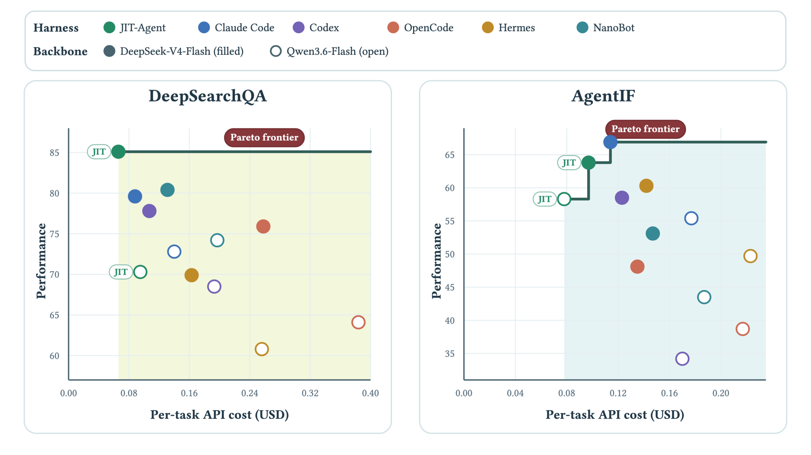
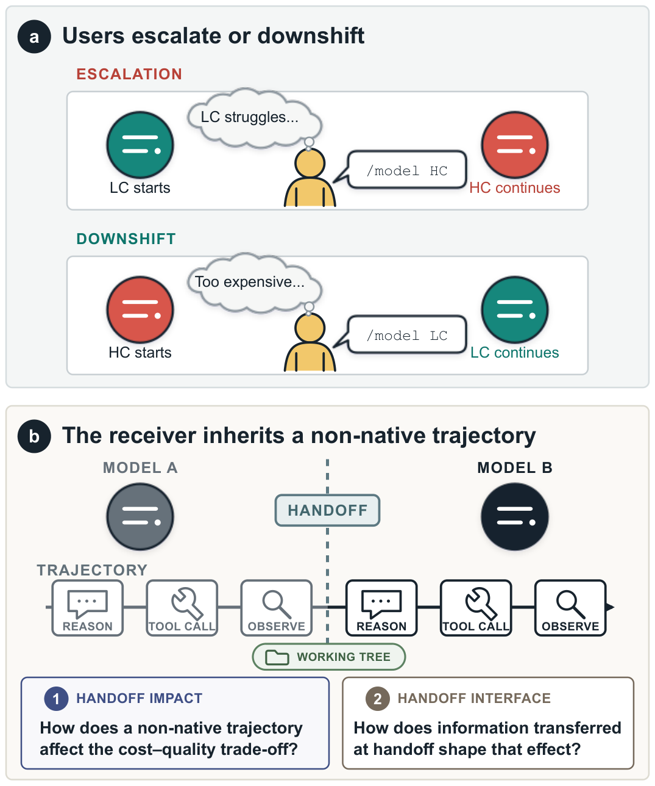

# HF Daily Papers 摘要：08/27 回填 + 08/28 + 08/31（3 天空缺补跑）

- **抓取时间**：2026-08-31 01:57 UTC（周一，W36 第一份，无后缀）
- **覆盖**：08-27 桶回填 + 08-28 + 08-31（08-29/08-30 周末双双 0 篇）
- **窗口唯一**：**60 篇** ｜ **A 口径**（对比 08-27 那次抓取的 28 个 id）= **58** ｜ **B 口径**（对照最近 8 份的 137 个已引用 id）= **58**
- **取 Top 25**（新增 58 篇，量大）

> ⚠️⚠️ **本份是 3 天空缺补跑：08-28 / 08-29 / 08-30 三天 HF / Reddit / tech-blogs 一次都没跑**（`check` 在开头就报出来了）。🚨 **而 AWS 那四天全在（08-27~08-30）⟹「AWS 活、其余死」第七次，且又是发生在 08-24 那次全新重建之后** —— 这直接印证重建时写下的「重建 cron 与会话跑不起来是两件独立的事」。
> - ⭐ **HF 是四个源里唯一能完整补回的**（日期桶按日期索引、不随时间滑走），故本份内容无损失；⚠️ tech-blogs 那三天里最浅的几个 feed 已追不回。
>
> ⭐⭐ **桶读数：08-27 桶从我 08-27 01:5x 那次读到的 2 篇涨到 33 篇（+31）**；08-28 首读 23；**08-29 / 08-30 双双 0 篇＝周末空档第五次确认**；08-31 首读 4（凌晨 01:57）。
> ⚠️ **日期上限 guard 连续第 12 天既生效又不准**：拉 09-01 返错误对象（声称上限 `2026-08-28T00:00Z`），**而它同时能取到 08-31 的 4 篇**。
> ⭐ **A 与 B 恰好相等（都是 58）**，原因是 08-27 那份把抓到的 28 篇全量列出了 —— 正是我 08-14 记过的「上一份全量引用时两个口径等价」那种情形；⟹ **两个口径的差距 ≈「上一份抓到但未逐条引用的篇数」这条规律再得一个印证点（差 0）。**

## ⭐⭐⭐ 「harness」进标题连续第四天，而这次是两篇，且它们分处同一个分叉的两端

| arXiv | 标题里的 harness | ▲ |
|---|---|---:|
| 2608.25593 | **JIT-Agent**: Scaling **Harness** Intelligence via **Just-in-Time Harness Evolution** | **110** |
| 2608.15763 | **Training Agents to Evolve with Their Harness**: TaoLive Digital Avatar Agent Technical Report | 46 |

⭐ 另有五篇不带 harness 但同属这条线：PILOT in the Loop（30▲，long-horizon agent 的 live self-improvement）· WikiSkill（19▲，把经验编译成持久知识）· **The Handoff Tax**（13▲，见 Deep Dive 2）· CaSKG（5▲，技能检索）· ContextPilot（3▲，主动上下文管理）。

---

## 论文总览表（Top 25，按 upvote 降序）

| # | arXiv | 标题 | ▲ | 桶 |
|---|---|---|---:|---|
| 1 | [2608.25518](https://arxiv.org/abs/2608.25518) | Agentic 游戏开发作为可验证轨迹数据引擎，用于扩展世界模型 | 182 | 08-28 |
| 2 | [2608.19583](https://arxiv.org/abs/2608.19583) | VGI-Bench：探测视频生成模型里的视觉智能 | 174 | 08-27 |
| 3 | [2608.26005](https://arxiv.org/abs/2608.26005) | VoiceMem：面向实时交互的流式双脑记忆 | 169 | 08-27 |
| 4 | [2608.24979](https://arxiv.org/abs/2608.24979) | FrontierChallenge：评测科学工作流的完成度 | 142 | 08-27 |
| 5 | [2608.24479](https://arxiv.org/abs/2608.24479) | WarpSAC：重新思考探索与利用以逼近可扩展 off-policy RL 的顶点 | 138 | 08-27 |
| 6 | [2608.27345](https://arxiv.org/abs/2608.27345) | PAWBench：我们离概率对齐的世界建模还有多远？ | 136 | 08-28 |
| 7 | [2608.25593](https://arxiv.org/abs/2608.25593) | **JIT-Agent：用 just-in-time harness 演化扩展 harness 智能** | **110** | 08-27 |
| 8 | [2608.27456](https://arxiv.org/abs/2608.27456) | UrbanGround：从局部感知到真实尺度城市里的空间能动性 | 104 | 08-28 |
| 9 | [2608.27448](https://arxiv.org/abs/2608.27448) | TTPO：测试期策略优化 | 73 | 08-28 |
| 10 | [2608.26872](https://arxiv.org/abs/2608.26872) | Self-OPD：流匹配模型的无教师 on-policy 蒸馏 | 71 | 08-28 |
| 11 | [2608.27260](https://arxiv.org/abs/2608.27260) | 什么是好的 agentic 数据？用 ACE 视角看 LLM agent 的数据生成 | 63 | 08-28 |
| 12 | [2608.15763](https://arxiv.org/abs/2608.15763) | **训练 agent 与它的 harness 一起演化**：淘宝直播数字人技术报告 | 46 | 08-28 |
| 13 | [2608.26200](https://arxiv.org/abs/2608.26200) | GameWAM：电子游戏的世界-动作模型 | 44 | 08-28 |
| 14 | [2608.26530](https://arxiv.org/abs/2608.26530) | PILOT in the Loop：长程 agent 的在线自我改进 | 30 | 08-28 |
| 15 | [2608.23318](https://arxiv.org/abs/2608.23318) | Agent-G²：用高斯引导做 agentic 强化学习 | 26 | 08-27 |
| 16 | [2608.24987](https://arxiv.org/abs/2608.24987) | D³-MOPD：面向高效多教师蒸馏的自适应动态域调度 | 25 | 08-27 |
| 17 | [2608.23256](https://arxiv.org/abs/2608.23256) | 下一块推理的 RL 真的比 SFT 好吗？在无 CoT 设定下重审训练策略 | 21 | 08-27 |
| 18 | [2608.19098](https://arxiv.org/abs/2608.19098) | Open-MOPD：诊断并修复多教师 on-policy 蒸馏里的能力不平衡 | 20 | 08-27 |
| 19 | [2608.23383](https://arxiv.org/abs/2608.23383) | 面向持久故事与交互世界的长程音视频生成 | 19 | 08-27 |
| 20 | [2608.27454](https://arxiv.org/abs/2608.27454) | WikiSkill：把 agent 经验编译成持久知识以实现技能演化 | 19 | 08-28 |
| 21 | [2608.26103](https://arxiv.org/abs/2608.26103) | Zero-WAM：从人类视频做上下文内世界-动作建模以泛化开放式任务 | 19 | 08-28 |
| 22 | [2608.26067](https://arxiv.org/abs/2608.26067) | StreamPI：面向视觉-语言-动作模型的流式多模态时序建模 | 18 | 08-27 |
| 23 | [2608.25529](https://arxiv.org/abs/2608.25529) | Video-IFBench：评测多模态 LLM 在视频理解场景里的指令遵循 | 16 | 08-27 |
| 24 | [2608.27351](https://arxiv.org/abs/2608.27351) | 理解演化策略用于 LLM 推理：比 GRPO 更宽的推理覆盖 | 16 | 08-28 |
| 25 | [2608.25580](https://arxiv.org/abs/2608.25580) | V-Rubrics：用基于 rubric 的强化学习实现视觉忠实性 | 15 | 08-27 |

> ⚠️ **一处编辑选择已在正文交代**：我把 **The Handoff Tax（2608.24358，13▲，严格排名第 28）** 提进正文做第二篇深读，因为它正落在主线交点上（连续第 N 次「upvote 与相关性弱相关」）。⭐ **它已一并入库**（这正是 08-18 踩过的坑：引用了但没入库）。

---

# Deep Dive 1 ⭐⭐⭐ JIT-Agent：它与我昨天深读的 AutoSaddler **互为同一个分叉的两端，且各自点名对方的假设**（110▲）

**[Scaling Harness Intelligence via Just-in-Time Harness Evolution](https://arxiv.org/abs/2608.25593)** · LV-NUS Lab（Project Lead: Guibin Zhang；Corresponding: Wangchunshu Zhou, Shuicheng Yan）

> ⚠️ HF `.md` 返 **162 字节**退化响应 → arXiv HTML 95,075 字符。⭐ **而提取时我踩了一个自己的坑：第一遍把 `<math>` 标签一起剥掉了，于是摘要里所有数字都变成空白**（「gains up to points」）—— ⭐⭐ **保留 `alttext` 重新提取后数字全回来了**（`+9.1` / `+4.3` / `+20.2`）⟹ **arXiv HTML 里的数字常在 MathML 里，去标签时必须保留 `alttext`，否则会得到一份读起来通顺、但所有量化结论都消失了的正文。**

## ⭐⭐⭐ 中心区分借了编译器的术语，而它恰好把昨天那篇归了类

论文把既有工作归为 **Ahead-of-Time (AOT)** 范式：

> 「many of these methods share an Ahead-of-Time (AOT) assumption: **the harness is treated as a durable artifact to be optimized over an experience stream**, with the hope that the resulting artifact will generalize across future tasks, domains, or model versions. This is a powerful paradigm when **the deployment distribution is stable and homogeneous**. However, it still asks the optimization loop to **precompile a broadly useful harness before seeing the exact structure of each future problem**.」

⟹ 🚨⭐⭐⭐ **而我昨天深读的 AutoSaddler 正是这个范式的教科书版本**：它把 harness 改进形式化成**离线学习问题**、用 mini-batch 失败信号迭代，**而它标题里的关键词就是 `Durable Updates`**。⟹ ⭐⭐⭐ **所以我连续两天深读的两篇论文，是同一个分叉的两端，且每一篇都把另一篇的核心承诺（durable / precompiled）当作自己要拒绝的那个假设。** ⭐ 这在我的记录里是第一次。

**JIT 那一侧的论证是「合适的 harness 不只依赖领域，还依赖实例」**，并逐类给了先验：

| 任务类型 | 合适的 harness 先验 |
|---|---|
| Wide-search | 并行证据探索 |
| Terminal | 精简的串行 ReAct 循环 |
| Deep-research | 对检索到的证据做工作记忆 |
| NL2Repo 编码 | 由文件系统中介（存 patch / 测试 / trace / 仓库状态）|

> 「In short, the appropriate harness is **not only domain-dependent, but instance-dependent**.」

⟹ 🚨⭐⭐⭐ **而这一句解释了我记过四次但一直只当「事实」的那个形状——「收益极不均衡」**（Evo-Bench 的 Search 追平人工／Office 几乎不动 · AI4AI 的 BigToM 1.00 胜人工／MMToM-QA 0.84 vs 0.98 · DarwinX 的 ML/Sci +15／**Security −1** · StateM 的 family macro +0.55 vs 机制匹配子群 **+10.04**）⟹ ⭐⭐ **若正确的 harness 是实例依赖的，那么单一被优化过的 harness 必然表现出不均匀的增益 —— 不均匀不是异常，而是这个观点的一个预测。** ⭐ 这是我第一次能把那四个观察归到一个机制下面，而不是只并列它们。

## 机制：固定四模块协议 + 三阶段训练

**把 harness 形式化为「可组合、可被机器生成的 artifact，受一个固定的四模块协议约束」**（memory management / planning strategy / action protocol / tool-skill orchestration），然后训练一个模型去：**① 为当前任务定制 harness ② 修复 harness 以获得稳定可靠的执行 ③ 自我演化 —— 从一个不断扩张的历史 harness 配置档案里蒸馏性能信号**。

⭐⭐ **注意第 ②③ 两步正是我那个四分解里的后两格**：「修复」＝翻译（把诊断变成有界编辑）、「只在推进档案前沿时才保留」＝保留。⭐ **而 6.6 节明说 Evo-GDPO 的目标是「retains harnesses only when they advance the archive frontier」** —— 与 DarwinX 的 preserve-and-extend 是同一个设计意图的第三个独立实现。

## 结果

| 项 | 数字 |
|---|---|
| DeepSeek-V4-Flash **超过 GPT-5.6** | DeepSearchQA **+9.1** / OdysseyBench **+4.3** |
| 已经很强的 GLM-5.2 | 最多 **+20.2** 点 |
| 与成熟 agent runtime（OpenCode / Claude Code）对比 | **性能相当** |
| ⭐⭐ 跨模型对迁移（24 组直接匹配的 backbone×benchmark）| **24/24 全部优于 ReAct，平均 +7.6 点** |
| 按家族 | DeepSeek V4 **+10.2** / Qwen 3.6 **+4.0** / Mimo 2.5 **+8.6** |
| 最大增益基准 | DeepSearchQA 平均 **+15.2**（含 Mimo-V2.5-Pro **+22.2**、DeepSeek-V4-Flash **+19.0**）|

⚠️ **口径**：DeepSearchQA 用 100 例子集，其余三个用 50 例子集。

## 🚨⭐⭐⭐ 而 6.5 节那个「跨模型对都涨」的结论，解决了我一直觉得别扭的一处张力

我此前从四篇论文攒出一条**迁移随距离分层**的梯度：**同家族跨代原样迁移免费**（StateM 参考差 +9.0→+10.4）→ **跨 harness 保留 29–55%**（ClawGym II）→ **跨厂商 82.7%→82.0% 略微变差**（StateM）→ **强→弱明显退化**（SKILLER）。⟹ 而 JIT-Agent 说「harness intelligence 跨模型家族与变体都迁移」，看起来与那条梯度冲突。

⟹ ⭐⭐⭐ **但两者说的不是同一个东西，而这个区分是本篇给我的最有用的一条**：

| 被迁移的对象 | 可迁移性 |
|---|---|
| **一个具体的 harness**（artifact）| **随执行者距离衰减，跨厂商时变负** |
| ⭐ **合成 harness 的能力**（generator）| **跨家族与变体都保持**（24/24、平均 +7.6）|

⟹ ⭐⭐ **含义：「harness 不可移植」这句话应当限定为「具体 harness 不可移植」；而这恰好也是 JIT 相对 AOT 的立论基础** —— **若具体 harness 本就不能跨实例迁移，那么预编译一个通用 harness 这件事在设计上就是逆着风的。** ⭐ 论文自己的说法是「These consistent within-backbone gains show that harness intelligence transfers across model families and variants **rather than compensating for a particular backbone**」。

## ⭐⭐⭐ 而成本那一节是我这条线上第一次「全部设定下同时更好且更便宜」

> 「JIT-Agent has the **lowest token consumption and API cost in all six controlled settings**. Relative to the cheapest fixed harness in each setting, it reduces per-case cost by **14.9–54.1%**, with an average reduction of **36.0%**.」

| 设定 | token | 成本 | 分数 |
|---|---|---|---|
| DeepSeek-V4-Flash · xBench-DS | **527K → 212K** | **$0.075 → $0.039** | **78.0 → 82.0** |
| Qwen3.6-Flash · AgentIF | **394K**（固定 harness 至少 839K）| **$0.078**（对方 $0.170）| **55.4 → 58.3** |
| DeepSearchQA Pareto 点 | — | **$0.131 → $0.066（−49.6%）** | **+4.7 点**（对手是最强固定 harness NanoBot）|

⟹ ⭐⭐⭐ **论文自己点出了要害：「Thus, the gains are not explained by longer trajectories; the generated harnesses typically achieve stronger results with shorter, more selective execution.」** ⭐⭐ **而我那份「成本买不到分数」清单里，此前唯一「更便宜且更好」的案例是 SKILLER 的 167×，而那是价目表比值；本篇是实测每例成本，且在全部六个受控设定下都成立。**

## ⭐⭐ 测试期演化：Streaming JIT 在三个流上都收于 Static 之上

⭐ 关键限定是作者自己给的：**「the endpoint gains are not uniformly coupled to larger interaction budgets」** —— 也就是收益不是靠多花预算换来的（cost 与 tool-call 轨迹「remain task-dependent and of broadly similar scale」）。

## ⭐⭐⭐ Future Work 与我 08-26 读的那篇「harness 会被吸收进权重」是同一个预测，而这次说的是刚建完工具的人

> 「we believe future systems **need not follow the deliberately radical form explored in this work**, where the entire scaffold can be redesigned just in time: production runtimes may instead **retain a stable core** while allowing the model to construct, revise, or replace **selected** harness components when the task demands it. As this paradigm matures, **the capabilities developed here for harness synthesis, repair, and evolution will increasingly be internalized by foundation models themselves.** Models will then learn not only to act within a given harness, but also to improve the harness through which they act, opening a broad research agenda around adaptive interfaces, **verifiable runtime modification**, and jointly scaling models with their execution systems.」

⟹ 🚨⭐⭐⭐ **这与 Latent Space《The Evolution of the Agent Harness》（我 08-26 深读）是同一个预测**（那篇的判据是「进步表现为你能删掉多少 harness 而保持同等能力」，并预测接下来被吸收的是多 agent 编排/工具选择/记忆）。⭐⭐ **两个来源互不引用而收敛，且都留了一个「稳定内核」** —— ⚠️ **而它们对内核内容的说法不同：Latent Space 明确说删完剩下的是 permissions / identity / trust / legibility，本篇没说是什么。** ⟹ ⭐⭐ **这是一个可追的差异，而不是一致意见。**

⭐ 另外「**verifiable runtime modification**」这个词组直接落在我的「证据面」主线上；⭐ 而「**model–harness co-design**」是「model-harness 配对」这条线的第五个版本（前四：Macaron-V1 带版本的配对 / SKILLER 的技能对执行者敏感 / ClawGym II 的模型对 harness 过拟合 / Prime Agent 的「REPL 匹配模型训练过的工作流」）。

## ⚠️ 保留

- ⚠️ 我读了摘要、引言、§6.3–6.6 与 Future Work，**§3–§5（harness 设计空间、三阶段训练细节、推理架构）只读了小节标题**
- ⚠️ **基准用的是 100 例／50 例子集**，且**未见区间或重复次数** —— 而「24/24 全部优于 ReAct」这类全胜结论在 50 例子集上尤其需要区间
- ⚠️ **「与 OpenCode / Claude Code 性能相当」是在受控 backbone 下比的**，而那两个成熟 runtime 通常配特定模型，故这个比较的含义要按 A²E 那条读（跨 harness 比较必须固定骨干，本篇做了，但反过来也意味着它不代表那两个 runtime 在自己默认配置下的表现）
- ⚠️ 作者方即方法方，无第三方复现

---

# Deep Dive 2 ⭐⭐⭐ The Handoff Tax：它给我昨天那篇「约束在 handoff 里降级」补上了另一半，而合起来的结论是「带状态，别带推理」（13▲）

**[The Handoff Tax: Continuing Non-Native Trajectories in LLM Agents](https://arxiv.org/abs/2608.24358)** · **AWS, Agentic AI**（Roy Ganz, Mor Shpigel Nacson, Adi Kalyanpur, Ron Litman）

> ⚠️ HF `.md` 返 **183 字节**退化响应 → arXiv HTML 77,398 字符。

## 问题设定，而它是一个真实的产品问题

⭐ 编码 agent 一个任务会串起几十到几百次模型调用，于是**换模型成了一个经济决策**：便宜模型卡住时**升档（escalate）**到强模型，或在硬推理做完后**降档（downshift）**省钱。⭐⭐ **而论文点明这已经是产品功能**（`/model` 命令在 **Kiro / Codex / Claude Code** 里都有），**却几乎没人研究过它的成本-质量后果**。

**中心观察**：中途换模型把接收方放在一个不寻常的位置 —— 它必须**续写另一个模型产生的轨迹**。

> 「Unlike ordinary generation, where models extend their own trajectory–their own phrasing, hypotheses, tool-use idioms, and dead ends–**a handoff requires them to inherit a trajectory they did not create.** This inherited context may contain reasoning the receiver would not have generated and mistakes it would not have made.」

⭐⭐ 而方向不同则机制不同：**HC 可能被 LC 的错误转向锚定（anchored by LC's wrong turns）；LC 可能借着 HC 的铺垫顺势而行——也可能在超出自己能力的地方推理时崩掉。**

**三个轴**：**方向**（LC→HC / HC→LC）· **时机**（按难度校准的百分位扫过）· ⭐⭐ **界面**（full-trajectory transfer / compaction / trajectory removal，**而三者都保留仓库状态**）。基准 SWE-bench Verified，模型对 **Claude Haiku 4.5 / Opus 4.7** 与 **GPT-5.6 Luna / Sol**。

## 🚨⭐⭐⭐ 结果一：升档（LC→HC）是一笔糟糕的交易，而对 Claude 它被「重新开始」严格支配

| 项 | Claude | GPT |
|---|---|---|
| Raw 升档恢复的 LC–HC 质量差（QRec）| **47%** | **36%** |
| 相对 LC-only 的成本 | **约 4.0×** | 约 **6.1×** |
| 与「直接用 HC」比 | ⭐ **$1.61 vs $0.72＝贵一倍以上** | $0.36 vs $0.47（仍更便宜）|

⭐ **两家差别的原因论文给了：baseline 每任务经济性不同 —— HC-only 对 LC-only 是 GPT 约 8×、Claude 约 2×。**

⟹ 🚨⭐⭐⭐ **而 Claude 那一侧最锐**：作者专门做了两个控制臂，**都为 LC 已做的工作付费、但把它的对话与工作树修改全部丢弃后再从原始任务状态重启 HC** —— **Abort + HC fresh $0.90、LC-full + HC-full $1.12，而 Raw 是 $1.61** ⟹ 原文：**「for the Claude pair, Raw escalation is strictly dominated by restarting HC from scratch: restarting costs less and solves more tasks.」**

⟹ ⭐⭐ **这是一个很反直觉但可直接用的结论：卡住之后把强模型接上去续写，可能比「作废重来」既更贵又更差。**

## 🚨🚨🚨 结果二：界面减信息能大幅改善升档，而 GPT 那个数字是本篇最该记的

| 界面 | Claude QRec | GPT QRec |
|---|---|---|
| **Raw**（全轨迹）| 47% | 36% |
| **Compact-pre**（压缩）| **60%**（CSRet 从 **−285% → −11%**，接近 HC-only 成本平价）| 40%（CSRet 26%→49%）|
| ⭐⭐⭐ **Traj-drop**（**去掉轨迹但保留 LC 的工作树修改**）| **64%** | 🚨 **84%** |

⟹ 🚨⭐⭐⭐ **GPT 那一格：只是把发送方的推理轨迹丢掉、保留它改过的文件，质量恢复率就从 36% 跳到 84%** —— ⭐⭐ **也就是说，被继承的那段推理是主动有害的：缺失质量里超过一半是「带着它」造成的。**

⟹ 🚨⭐⭐⭐ **而这是「让状态持久、让 agent 短命」那个设计模式目前最干净的一次受控量化验证**：我 08-13 记过五篇互不引用的论文收敛到这个模式（Persistent Recursive Worlds / StateFlow / AtlasVLA / AutoWorldModel-Bench / Runtime Contract），**而 Traj-drop 恰好就是它的操作化——保留持久状态（工作树），丢掉 agent 的轨迹。** ⭐ 此前那五篇给的是设计论证，本篇给的是 36%→84%。

⚠️ 但成本上仍有代价：Traj-drop 的 CSRet 在两家都是负的（−30% / −8%），**即仍比 HC-only 贵**。

## 🚨⭐⭐⭐ 结果三：偏好的界面随方向反转，而这一条我认为最有工程价值

**降档（HC→LC）方向，同一个界面的表现完全翻过来**：

| 项 | Claude | GPT |
|---|---|---|
| Raw 降档 | pass **54.6% → 65.6%**，成本仅 $0.41 → $0.51，**保住 LC 成本优势的 80%** | 保住 HC 质量优势的 **79%**，但只保住 LC 成本优势的 14% |
| ⭐⭐⭐ **Traj-drop**（升档里最好的那个）| **变成最差且最贵的降档策略：只恢复 28%**（Raw 50% / Compact-pre 56%），且只保住 59% 成本优势 | **只恢复 53%**（Raw 79% / 两种压缩 72–75%）|

> 「across both model families, **the HC trajectory is important for downshift quality**: preserving it retains substantially more of HC's advantage than removing it entirely.」

⟹ 🚨⭐⭐⭐ **合起来一句话：升档时该丢掉发送方的推理，降档时必须留住它。** ⭐⭐ 而机制上自洽：**弱模型的推理是噪声，强模型的推理是脚手架。**

## ⭐⭐⭐ 而它与我昨天深读的那篇（When "Must" Becomes "Maybe"）互为另一半

昨天那篇（Shenzhen University）测出：**handoff 的语言产物转换会把绑定约束降级为 caveat，而正常的压缩产生 100% 失活、54.2% 禁止动作；补齐四个字段（prerequisite / authority / fallback / execution consequence）后保持率回到 100%。**

⟹ ⭐⭐⭐ **两篇同一周、都在讲 handoff、都测了 compaction，而结论看似相反：一篇说压缩毁掉了必须保住的东西，一篇说去掉发送方轨迹让质量翻倍。** ⟹ ⭐⭐⭐ **但它们不矛盾，因为讲的是被携带的不同东西**：

| | 该保住的 | 该丢掉的 |
|---|---|---|
| **When "Must" Becomes "Maybe"** | **义务与状态**（四个字段，尤其 prerequisite 与 authority）| — |
| **The Handoff Tax** | **持久工作产物**（仓库状态/工作树）| ⭐ **发送方的推理轨迹（升档方向）** |

⟹ 🚨⭐⭐⭐ **合成的工程结论是两篇各自都没说出来的：一次 handoff 应当「丢掉推理、保住状态与义务」，而两篇一致否掉的恰是那两个默认做法——全都带过去（Raw）或对全部内容做统一压缩。** ⭐ 后者尤其值得记：**统一压缩会同时犯两个错——它压掉了必须保住的约束字段，又保留了应当丢掉的推理。**

## ⭐⭐ 结果四：换了任务的「信息动态」之后，方向偏好会反转

⭐ 论文把这一节做成一个正交轴：**任务相关信息如何随时间到达** —— SWE-bench 规格前置而仓库信息在执行中累积；**LiC 的需求逐轮增量披露**；**BrowseComp 问题前置而证据靠搜索累积**。

**LiC（535 例、5 个任务族、Claude 平均，Raw handoff）：**

| 策略 | Score | Cost | QRec | CSRet |
|---|---:|---:|---:|---:|
| LC-only | 62.1 | 0.015 | 0 | 100 |
| HC-only | 76.9 | 0.080 | 100 | 0 |
| ⭐ **Escalation** | **74.2** | 0.056 | **86** | 36 |
| Downshift | 67.0 | 0.046 | 31 | 53 |

⟹ ⭐⭐⭐ **在编码设定里升档差、降档好；而「需求迟到」把这个次序整个反转了（升档 QRec 86）** —— 原文「late-arriving requirements reverse the coding quality ordering」。⟹ ⭐⭐ **含义：方向偏好不是模型属性也不是 handoff 的固有属性，而是任务信息动态的函数。**

## ⭐⭐⭐ 而结论那句是我这条路由主线上最需要的一句话

> 「**model handoffs should be treated as a distinct inference problem rather than merely as an extension of model routing. Routing determines WHICH model acts next, whereas the handoff interface determines WHAT trajectory information that model inherits.**」
>
> 「routing methods should **treat the handoff interface as part of the switching policy** rather than assume that the full trajectory simply carries forward.」

⟹ 🚨⭐⭐⭐ **我这两周把「路由」追到了四层（现象多篇实测 → 产品 NVIDIA Switchyard / Databricks Smart Routing / GenRouter → 学术基础设施 LLMRouter → 资本 Stripe 收 OpenRouter），而这四层全部是在任务边界上路由。本篇说的是任务中途路由有一笔税，而那四层的分析里都没有这一项。** ⟹ ⭐⭐ **可直接用的判据（与「报 agent 分数不写 scaffold 等于没报」同形）：报路由收益时不写切换界面等于没报** —— 因为同一个切换在 Raw / 压缩 / Traj-drop 三种界面下，质量恢复率可以从 36% 到 84%。

## ⚠️ 保留（作者自陈的部分很规矩）

- ⚠️ **只有两个模型对**（Claude Haiku 4.5 / Opus 4.7、GPT-5.6 Luna / Sol），**主实验只有一个基准**（SWE-bench Verified）—— 作者在 Limitations 里明写
- ⚠️ **切换点是固定的**，作者说明这是为了把「handoff 的后果」与「触发它的策略」分开；⭐ 并把「自适应的、感知进度的策略」列为 future work ⟹ **这意味着本篇的数字是「在这些固定切换点上」的，一个好的触发策略可能改变结论**
- ⚠️ 我读了摘要、引言、§4.1–4.2、§5 前半与 §6；**§3 实验框架细节与附录未读**，故 QRec / CSRet 的确切定义我只从上下文推断（质量恢复率 / 成本节省保留率）
- ⭐ 而**结论里有一句自我限定值得表扬**：「Evaluation should also extend across model families, capability gaps, pricing regimes, repeated rollouts, and **multiple handoffs per trajectory**」⟹ **它主动指出真实使用里会有多次 handoff，而本篇只测了一次。**

---

## 其余值得关注

### ⭐⭐⭐ harness 与自我改进：本窗口七篇，而其中两篇填的是我此前的空格

- ⭐⭐ **[Training Agents to Evolve with Their Harness: TaoLive Digital Avatar Agent Technical Report](https://arxiv.org/abs/2608.15763)**（46▲）⟹ ⭐⭐⭐ **标题就是 ClawGym II 那个「对偶面」的第三篇，而这次是一份工业技术报告（淘宝直播数字人）** —— 我 08-18 记 ClawGym II 时写过「我串的七篇全是冻结模型改 harness，本篇是训模型去用好 harness」，08-20 那个对偶面就有了三篇；⭐ **本篇的新处在于它是真实产品线上的报告，而不是基准论文。** ⚠️ 仅标题。
- ⭐⭐ **[PILOT in the Loop: Live Self-Improvement for Long-Horizon Agents](https://arxiv.org/abs/2608.26530)**（30▲）⟹ ⭐ **`Live` 这个限定与 JIT-Agent 的 Streaming JIT 是同一取向**（在任务流中边跑边改，而不是离线优化），⟹ **也就是说 AOT/JIT 这个分叉今天在两篇论文里同时出现。**
- ⭐⭐ **[WikiSkill: Compiling Agent Experience into Persistent Knowledge for Skill Evolution](https://arxiv.org/abs/2608.27454)**（19▲）⟹ ⭐ **「编译成持久知识」正是 StateM §4.7 那条警告的对象**（「experience must be filtered before it becomes memory. Harness scaling is an abstraction problem, not rule accumulation」）⟹ **最该追的是它有没有「删」这个动作**，而不只是累积。
- ⭐⭐ **[CaSKG: Counterfactual-Causal Skill Graphs for Scalable Agent Skill Retrieval](https://arxiv.org/abs/2608.25500)**（5▲）⟹ ⭐⭐⭐ **它正对上 Demystifying Agent Skills 测出的那个塌陷**（池 5→100 时，真实执行期的技能使用精度 **29.6%→3.3%**，而 recall 仍有 54.3–73.6%）—— ⭐ **而我当时的判断是「塌掉的是执行期的自我约束，那不是检索器能修的」** ⟹ **所以本篇最该问的是：它改的是检索还是执行期约束？若只是更好的检索器，那条判断预测它修不动那个 3.3%。** ⚠️ 仅标题、5▲。
- ⭐ **[ContextPilot: Teaching Agents for Proactive Context Management via Fine-grained RL](https://arxiv.org/abs/2608.28476)**（3▲）⟹ ⭐ **「主动上下文管理」用 RL 训出来，与 ClawGym II 那条对偶面同侧**；⚠️ 而按今天 Handoff Tax 的结论，**上下文管理的正确目标函数不是「压得更小」而是「丢对东西」**，这一点在标题里看不出来。
- ⭐ **[Skill Issue: Are Skills Language-Invariant in LLMs?](https://arxiv.org/abs/2608.25832)**（4▲）⟹ ⭐ **技能可迁移性的第三个轴**（此前两个：跨执行者规模 SKILLER / 跨模型家族 JIT-Agent；**本篇是跨语言**）
- ⭐ **[What Makes Good Agentic Data? An ACE Lens on Data Generation for LLM Agents](https://arxiv.org/abs/2608.27260)**（63▲）⟹ 接「数据从哪来」那条线，且这次问的是 agentic 数据的质量标准而非来源

### ⭐⭐⭐ 一个基准恰好把 Anthropic 那个「地盘战」实验做成了任务

⭐⭐ **[SWE Refactor Bench: Can Coding Agents Complete a Long-Horizon, Whole-Repository Stack Migration?](https://arxiv.org/abs/2608.23564)**（14▲）

⟹ 🚨⭐⭐⭐ **「whole-repository stack migration」正是 Anthropic Frontier Red Team 那个多 agent 地盘战实验的任务设定**（三个同模型实例各被要求把同一个 Python 后端迁移到**不同**语言，起初互不知情 → 用自我复制的恶意软件互相破坏）。⟹ ⭐⭐ **区别是本篇把它做成单 agent 的长程能力基准，而那边是多 agent 的冲突实验 ⟹ 同一个任务形态，一个测能力上限、一个测协同失效。** ⭐ 而「整仓库迁移」之所以适合两者，是同一个原因：**它需要维持跨大量文件的一致性，而这正是我追的「无法一致维持约束」那条线的典型场景。** ⚠️ 仅标题。

### ⭐⭐ 评测有效性：一篇标题里就带着「许可」这个隐喻

⭐⭐ **[What Does an Evaluation License? A Commit-Bound Census of Claim-Relative Inference in Inspect](https://arxiv.org/abs/2608.19269)**（3▲）

⟹ ⭐⭐⭐ **「一次评测许可了什么」这个提法我此前没见过，而它正是我这两周反复在问的那个问题的另一种表述**（一个分数支持哪些主张、不支持哪些）；⭐ **`commit-bound census`（绑定到 commit 的普查）暗示它把「评测结果」与「产生它的确切代码版本」绑在一起** —— 而这正是 HF 复现 2,200 篇那次抓到的两个失效之一（**代码默认算 forward KL 而理论部分分析 reverse KL**）。⭐ `Inspect` 是 UK AISI 的评测框架 ⟹ **若它是对一个真实评测生态做的普查，那证据性质比单篇方法学论文强。列为下一份首选。** ⚠️ 仅标题、3▲。

⭐ 相邻两篇诊断型评测：**[AnTrap: Are Android GUI Agents Robust Against Runtime Anomalies?](https://arxiv.org/abs/2608.24099)**（12▲，⭐ 运行时异常鲁棒性）· **[GUI-Primitives: Diagnosing Spatial Reasoning Failures in Vision-Language GUI Grounding](https://arxiv.org/abs/2608.21832)**（9▲）· **[FrontierChallenge: Evaluating Scientific Workflow Completion](https://arxiv.org/abs/2608.24979)**（142▲，⭐ 接 Apodex / AutoResearch 那条「AI 做科研」线，而「workflow completion」这个口径值得追——**它是终局判定还是过程判定？**）

### ⭐⭐ OPD 子领域第四周仍在扩张，且今天出现「无教师」版本

⭐⭐ **[Self-OPD: On-Policy Distillation for Flow Matching Models without Teacher](https://arxiv.org/abs/2608.26872)**（71▲）⟹ ⭐⭐⭐ **「无教师」正是我 08-12 从 U-OPSD 归纳的那个姿态（「干脆不要外部教师」）在流匹配模型上的版本** —— 而那条归纳的原因是「教师被污染」有三种机制（DAPD 的信息不对称 / SMRC-SD 的状态错配 / 身份错配）⟹ ⭐⭐ **而今天 The Handoff Tax 给了第四种：续写非原生轨迹时被锚定** —— 四种机制的共同点是**「来源不是自己」本身就是代价**，而 Self-OPD 与 U-OPSD 的共同回答是绕开它。

⭐ 另两篇是多教师方向：**[D³-MOPD](https://arxiv.org/abs/2608.24987)**（25▲，自适应动态域调度）· **[Open-MOPD](https://arxiv.org/abs/2608.19098)**（20▲，⭐ **诊断并修复多教师蒸馏里的「能力不平衡」** —— ⭐⭐ 这与「收益极不均衡」是同一形状在蒸馏侧的版本）⟹ ⭐ **我 08-07 记过 OPD「一周内完成子领域化」，四周后它已扩到扩散 / 安全 / 流匹配 / 多教师四个方向。**

### ⭐⭐ 世界模型这一窗口异常密集（六篇），而最高分那篇的框架值得记

⭐⭐ **[Agentic Game Development as a Verifiable Trajectory Data Engine for Scaling World Models](https://arxiv.org/abs/2608.25518)**（**182▲ 本份最高**）⟹ ⭐⭐⭐ **「可验证轨迹数据引擎」＝ 用 agentic 游戏开发来造世界模型的训练数据，而关键词是 verifiable** —— ⭐ **这与我记的「合成数据」那条线是同一个动作，但它多了一个我一直在找的东西：可验证性**（游戏的规则本身提供了不由生成器控制的判定）⟹ **落在「让参照留在优化压力之外」那一类里。** ⚠️ 仅标题。

⭐ 另五篇：**[PAWBench](https://arxiv.org/abs/2608.27345)**（136▲，⭐ **「概率对齐的世界建模」这个提法暗示它测的是分布而非单点预测**）· [GameWAM](https://arxiv.org/abs/2608.26200)（44▲）· [Zero-WAM](https://arxiv.org/abs/2608.26103)（19▲，从人类视频做上下文内世界-动作建模）· [Magpie](https://arxiv.org/abs/2608.27168)（8▲，实时世界渲染器）· ⭐ **[Code as Worlds: Agentic Discovery of Executable World Representations for Physical Reasoning](https://arxiv.org/abs/2608.27549)**（2▲，⭐ **「可执行的世界表示」＝把世界模型做成代码，而代码是可检验的** ⟹ 与上面那条 verifiable 同取向）

### ⭐ 其余（各一句）

⭐⭐ **[VoiceMem: Streaming Dual-Brain Memory for Real-Time Interaction](https://arxiv.org/abs/2608.26005)**（169▲）⟹ ⭐ **「记忆不能只当检索」第九个位置，且这次是实时语音**（此前八个：治理面 / 数据模型面 / 内容面 MobileMem / 基底评测 / 容量 / 演化状态追踪 / 认知陷阱 MemTrapBench / 自然整合 MemUse）· [VGI-Bench](https://arxiv.org/abs/2608.19583)（174▲，探测视频生成模型的视觉智能）· [WarpSAC](https://arxiv.org/abs/2608.24479)（138▲，可扩展 off-policy RL）· [UrbanGround](https://arxiv.org/abs/2608.27456)（104▲，真实尺度城市里的空间能动性）· ⭐ **[TTPO: Test-Time Policy Optimization](https://arxiv.org/abs/2608.27448)**（73▲，⭐ 与 JIT-Agent 的 test-time harness evolution 是同一时刻的两个层次——一个改策略一个改 harness）· ⭐ **[Understanding Evolution Strategies for LLM Reasoning: Broader Reasoning Coverage than GRPO](https://arxiv.org/abs/2608.27351)**（16▲，⭐ **「更宽的推理覆盖」正是 DarwinX 那条「保留多样档案而非单一 incumbent」的训练侧对应**）· ⭐ [Is Next-Chunk Reasoning RL Really Better than SFT?](https://arxiv.org/abs/2608.23256)（21▲，⭐ **一篇主动重审 RL vs SFT 的论文，标题就是问句**）· [Agent-G²](https://arxiv.org/abs/2608.23318)（26▲）· ⭐ [Long-Horizon Audio-Visual Generation for Persistent Stories and Interactive Worlds](https://arxiv.org/abs/2608.23383)（19▲，⭐ `Persistent` 又一次出现）· [StreamPI](https://arxiv.org/abs/2608.26067)（18▲）· [Video-IFBench](https://arxiv.org/abs/2608.25529)（16▲）· [V-Rubrics](https://arxiv.org/abs/2608.25580)（15▲，⭐ **rubric 做 RL 奖励**，而 rubric 是人写的外部参照）· ⭐ **[CritICL: Inference-Time Weak-to-Strong Generalization from Small Language Model Failure Modes](https://arxiv.org/abs/2608.27455)**（9▲，⭐⭐ **「从小模型的失效模式做弱到强泛化」——它把弱模型的错误当作有用信号，而这与今天 Handoff Tax 测出的「弱模型的轨迹是有害噪声」方向相反** ⟹ ⭐ **两者可同时为真：作为被分析的对象有用、作为被续写的上下文有害，而区别在于谁在用它**）· ⭐ [Blind Men and the Elephant: Probing the Epistemic Myopia of LLMs under Long-Tail Divergent Knowledge](https://arxiv.org/abs/2608.28478)（3▲，⭐ 接「模型不知道自己的边界」那条线）

---

## 趋势

### ⭐⭐⭐ 1. AOT vs JIT：harness 这条线出现了第一个真正的范式分叉，而我连续两天各深读了一端

**AutoSaddler（08-27 深读）＝ 离线学习 + `Durable Updates`** vs **JIT-Agent（本份）＝ 即时合成 + 明确拒绝「precompile a broadly useful harness」**。⟹ ⭐⭐ **而每一篇都把另一篇的核心承诺当作自己要拒绝的假设，这在我的记录里是第一次。** ⭐ 同窗口 PILOT in the Loop 的 `Live` 也落在 JIT 那一侧 ⟹ 分叉不是两篇论文的偶然对立。

### ⭐⭐⭐ 2. 「收益极不均衡」第一次有了机制解释，而它是一个预测而非异常

JIT-Agent 的「the appropriate harness is **not only domain-dependent, but instance-dependent**」⟹ ⭐⭐ **若正确的 harness 依赖实例，那么单一 harness 必然增益不均** —— 这把我记过四次的那个形状（Evo-Bench / AI4AI / DarwinX / StateM）从并列观察变成了一条可解释的推论。

### ⭐⭐⭐ 3. 「可迁移性」需要区分 artifact 与 generator，而这解掉了我一处张力

**具体 harness 随执行者距离衰减、跨厂商变负**（我从四篇攒的梯度）vs **合成 harness 的能力跨家族保持（24/24、平均 +7.6）** ⟹ ⭐⭐ **两句都对，因为被迁移的东西不同；而这也正是 JIT 相对 AOT 的立论基础。**

### ⭐⭐⭐ 4. Handoff：两篇同周论文合起来给出「丢掉推理、保住状态与义务」

**When "Must" Becomes "Maybe"（该保住四个字段）⊕ The Handoff Tax（该丢掉发送方轨迹，GPT 上 36%→84%）** ⟹ ⭐⭐⭐ **而两篇一致否掉的是那两个默认做法：全都带过去，或对全部内容统一压缩** —— **统一压缩会同时犯两个错（压掉必须保住的约束、保留应当丢掉的推理）。** ⭐ 且 Handoff Tax 给了「让状态持久、让 agent 短命」那个五篇共振模式第一次受控量化验证。

### ⭐⭐ 5. 路由这条线需要加一项：切换界面

**「Routing determines which model acts next, whereas the handoff interface determines what trajectory information that model inherits」** ⟹ ⭐⭐ **我追的路由四层全在任务边界上路由，而任务中途切换有一笔税，且同一次切换在三种界面下质量恢复率能从 36% 到 84%** ⟹ **报路由收益不写切换界面等于没报。**

### ⚠️ 6. 自我怀疑：本份两篇深读一篇 110▲ 一篇 13▲，而后者贡献了更多可操作结论

⟹ ⭐ **「我的挑选按相关性而非 upvote」这条已连续第五次记**，⚠️ 而本份 58 篇里我只深读 2 篇 ⟹ **「本窗口最重要的论文」这个说法照旧带着我自己的主线偏好。**

---

## Open Questions

1. ⭐⭐⭐ **JIT-Agent 与 AutoSaddler 谁在什么条件下更好？** ⭐ JIT 自己给了条件（AOT 在「deployment distribution is stable and homogeneous」时有效）—— ⟹ **这是一个可检验的预测：在同质任务流上 AOT 应当追平或超过 JIT，而在异质流上 JIT 领先。** 两篇互不引用、无人做过这个对照，**而这是我这两周攒的问题里第二个有明确可操作检验方案的**（第一个是「在 Gaming 的循环里加入重验，30% 应下降」）。
2. ⭐⭐⭐ **JIT-Agent 那个「稳定内核」应当包含什么？** ⭐ Latent Space 那篇预测删完剩下的是 **permissions / identity / trust / legibility**，而 JIT-Agent 只说 "a stable core" 没说内容 —— ⟹ **而今天 Handoff Tax 与昨天那四个字段给了一个具体候选：`authority` 与 `prerequisite` 这类义务字段恰好既是权限性质的、又是压缩会毁掉的** ⟹ **两条线在这里合流，值得写成一条明确假设。**
3. ⭐⭐ **CaSKG 改的是检索还是执行期约束？** ⭐ 若只是更好的检索器，则按 Demystifying Agent Skills 的结论它修不动那个 29.6%→3.3%（因为 recall 仍有 54–74%，塌掉的是「约束自己只用对的那个」）。
4. ⭐⭐ **「What Does an Evaluation License?」是对真实评测生态（Inspect）做的普查吗？** ⭐ 若是，则它的证据性质强于单篇方法学论文，而「一次评测许可了什么」正是我这两周反复在问的那个问题。
5. ⭐⭐ **多次 handoff 会不会累积？** ⭐ Handoff Tax 自己把这列为 future work（「multiple handoffs per trajectory」）—— ⟹ **而若「锚定」是机制，则多次切换应当累积损害；若「非原生」只是一次性折扣，则不会。这两种预测可区分。**
6. ⭐ **WikiSkill 有没有「删」这个动作？** ⭐ StateM §4.7 明确说「experience must be filtered before it becomes memory」「remember the consequential boundary, not every failure trace」，而「编译成持久知识」这个措辞听起来只有增。

---

## References

本份覆盖 **60 篇**（新增 58），正文引用并入库 **26 篇**（Top 25 ＋ 编辑替换提进来的 The Handoff Tax）。

