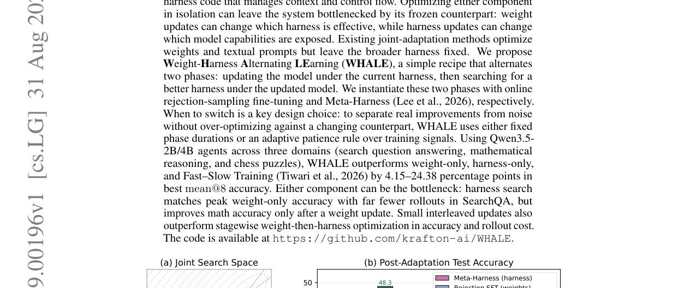

# HF Daily Papers 摘要：09-03 回填 + 09-04 ~ 09-06

> **抓取时刻**：2026-09-06 09:5x UTC（⭐ **以 `date -u` 为准**：今天是 **09-06（周日，W36）**，本份是当日第一份，按日期命名不加后缀）
>
> ⚠️⚠️ **2 天空缺补跑**：HF / Reddit / tech-blogs 上一次跑都是 **09-03**，**09-04（周五）与 09-05（周六）一次都没跑**。🚨 **而 AWS 09-04 / 09-05 / 09-06 三份都在 ⟹「AWS 活、其余死」第九次。**
>
> ⭐ **两个 prompt 里那个「晚间/第二跑」框架不适用**：今天在此之前没有任何一份，故本次按空缺补跑处理，覆盖范围往前拉到 09-03。

---

## §0 抓取与去重

| 日期桶 | 本次读数 | 说明 |
|---|---:|---|
| **09-03** | **36** | ⭐ 09-03 那次读到 **10** 篇 ⟹ **+26** |
| **09-04**（周五）| **31** | 首读 |
| 09-05（周六）| **0** | ⭐ 周末空档 |
| 09-06（周日）| **0** | ⭐ 周末空档 |
| **窗口唯一** | **67** | |

⭐ **HF 侧周末为零又一次确认**（09-05 与 09-06 双双 0，而两天都返回的是**正常空数组**不是错误对象）。

⚠️ **日期上限 guard 连续第 16 天既生效又不准**：拉 09-07 返回错误对象 `✖ "date" must be less than or equal to "2026-09-04T00:00:00.000Z"`（`isinstance` guard 生效），⭐ **而它声称上限是 09-04，我却能正常取到 09-05 与 09-06 的空数组** ⟹ **实用结论不变：每天都拉、靠 guard 兜住、不要用它的提示判断哪天有数据。**

### 🚨⭐⭐⭐ 去重两个口径：本次 **B > A**，而这是我第一次拿到一个足够大的差值去说清这两个量的关系

| 口径 | 值 | 含义 |
|---|---:|---|
| **A**（对比 09-03 那次抓取的 110 个 id）| **56** | feed 里新出现了什么 |
| **B**（对照最近 8 份 digest 的 193 个已引用 id）| **65** | 我还没写过什么 |
| **B − A** | **9** | |

⭐⭐⭐ **那 9 篇的身份是确定的：它们在 09-03 那次抓取里就在窗口内、但我那份取 Top 25 + 增补后没有逐条引用，而 09-03 桶从 10 涨到 36 又把它们带回了今天的窗口。** 逐条看正是 **SolarWM（140▲）· It Takes Two（70▲）· Pixel Text Representation（32▲）· Gold-Medal Post-Training（9▲）· MULTI3IR（8▲）· PaperCompiler（6▲）** 等。

⟹ ⭐⭐ **由此可以把这两个口径的关系写准（我 08-18 那句「差距 ≈ 上一份抓到但未引用的篇数」方向对但没写符号与例外）**：

> **B − A ＝（上次抓到但未引用、且仍在今天窗口里的篇数）−（上次没抓到、但被更早的 digest 引用过的篇数）**

⭐ 而第二项通常是 0（更早 digest 引用过的东西一般也在上次抓取里），所以实践中 **B ≥ A**，差值就是「上一份的未引用残留」。⭐⭐ **含义：`B − A` 是一个「我上一份漏了多少还值得看的东西」的量，而它本身值得报** —— 本次 9 篇里最高 140▲，说明 09-03 那份取 Top 25 确实把一些相当受关注的论文留在了外面。

**本份取 Top 25 ＋ 编辑增补**，入库口径沿用 09-03 那次放宽后的做法（**正文与 References 里逐条引用过的全部 id**）。

---

## §1 论文总览表（Top 25，按 upvote）

| # | ▲ | arXiv | 标题（中译）| 主题 |
|---:|---:|---|---|---|
| 1 | **520** | [2609.02749](https://huggingface.co/papers/2609.02749) | ⭐⭐ **Repo-To-Skill：把 GitHub 仓库蒸馏成 AI4AI 技能** | 技能库 / AI4AI |
| 2 | 314 | [2609.04199](https://huggingface.co/papers/2609.04199) | Compile by Training：把自然语言规格变成本地神经函数 | 编译 / 规格 |
| 3 | 268 | [2609.04148](https://huggingface.co/papers/2609.04148) | Terminal-Universe：把 agent 轨迹变成可扩展的终端环境 | 环境生成 |
| 4 | **240** | [2609.01437](https://huggingface.co/papers/2609.01437) | ⭐⭐⭐ **HarnessDev：LLM 能创建并演化自己的 agent harness 吗？** | **harness / 深读 1** |
| 5 | 226 | [2609.03796](https://huggingface.co/papers/2609.03796) | LLaDA-Image：用完全开放的训练配方构建强图像生成器 | 生成 |
| 6 | 210 | [2608.31111](https://huggingface.co/papers/2608.31111) | ⭐⭐ **Aspire：模型能从含糊的目标自我演化吗？** | 自我演化 |
| 7 | 161 | [2609.03430](https://huggingface.co/papers/2609.03430) | Random Attention：重新思考面向高效推理的 KV cache 逐出 | KV cache |
| 8 | 149 | [2608.26730](https://huggingface.co/papers/2608.26730) | ⭐⭐⭐ **知道何时不要复用：自主 LLM 后训练中的条件化经验迁移** | 经验 / 授权 |
| 9 | 140 | [2609.02886](https://huggingface.co/papers/2609.02886) | SolarWM：长程视频世界模型的开放数据与可扩展训练 | 世界模型 |
| 10 | 113 | [2609.02783](https://huggingface.co/papers/2609.02783) | ⭐⭐ **EarlyEval：用早期结果预测把 agent 评测做便宜** | 评测成本 |
| 11 | 108 | [2609.03199](https://huggingface.co/papers/2609.03199) | RoboTok：人类演示检索与灵巧操作的互联网级数据引擎 | 具身 / 数据 |
| 12 | 108 | [2609.01507](https://huggingface.co/papers/2609.01507) | LatentPress：超越文本与视觉的上下文压缩 | 上下文压缩 |
| 13 | 75 | [2609.04172](https://huggingface.co/papers/2609.04172) | ⭐⭐⭐ **重新思考 LLM 的 On-Policy Distillation II：一个训练样例** | 蒸馏 |
| 14 | 73 | [2609.04098](https://huggingface.co/papers/2609.04098) | ⭐ **Gated DeltaNet 为何能扛住 4-bit 量化：混合模型循环那一半的 NVFP4 W4A4** | 架构 / 量化 |
| 15 | 70 | [2609.00638](https://huggingface.co/papers/2609.00638) | It Takes Two to Match：用 RL 协同演化生成式检索器 | 检索 / 协同演化 |
| 16 | 66 | [2609.04196](https://huggingface.co/papers/2609.04196) | Puffin-World：以原生 3D 世界状态扩展统一多模态模型 | 世界模型 |
| 17 | 62 | [2609.02737](https://huggingface.co/papers/2609.02737) | ⭐ **语言模型可以控制自己的注意力** | 架构 |
| 18 | 45 | [2609.04201](https://huggingface.co/papers/2609.04201) | Scal3R：面向可扩展在线 3D 重建的高效多相对位姿查询 | 3D |
| 19 | 41 | [2609.04034](https://huggingface.co/papers/2609.04034) | Editable Visual Design | 视觉设计 |
| 20 | 33 | [2609.02367](https://huggingface.co/papers/2609.02367) | 缺失的时间链接：脚本驱动音视频生成的时间上下文路由 | 音视频 |
| 21 | 32 | [2609.01147](https://huggingface.co/papers/2609.01147) | 像素文本表示学习的设计基本原理 | 表示学习 |
| 22 | 32 | [2608.31100](https://huggingface.co/papers/2608.31100) | ⭐⭐ **S³Gym：LLM 能把自我测试与自我裁决变成自我改进吗？** | 自我演化 |
| 23 | 30 | [2609.00196](https://huggingface.co/papers/2609.00196) | ⭐⭐⭐ **WHALE：权重–harness 联合优化的一个简单配方** | **harness / 深读 2** |
| 24 | 29 | [2609.04131](https://huggingface.co/papers/2609.04131) | 超越检索：面向流式视频理解的渐进式潜记忆演化 | 记忆 |
| 25 | 27 | [2609.04173](https://huggingface.co/papers/2609.04173) | Last Translation Benchmark | 评测 |

### ⚠️ 编辑增补（已同步入库）

| ▲ | arXiv | 增补理由 |
|---:|---|---|
| 25 | [2608.27831](https://huggingface.co/papers/2608.27831) | ⭐⭐ **RealSWE** —— 「真实用户请求下的编码 agent 组合式评测」，落在评测有效性主线 |
| 26 | [2608.21450](https://huggingface.co/papers/2608.21450) | 超越视觉相似性：知识型 VQA 的实体对齐检索（多模态权重）|
| 24 | [2609.04083](https://huggingface.co/papers/2609.04083) | CORE：用重排器蒸馏改进 MLLM 嵌入的组合推理 |

---

## §2 🚨🚨🚨 本窗口的故事，但**第一件事是一个我必须先做的读法更正**

**表面上看：本窗口有六篇自我改进/harness 论文，其中两篇 harness 进标题，而 HarnessDev 的 240▲ 是我见过 upvote 最高的 harness 论文**（此前最高是 StarHarness 39▲、LoopArena 100▲ 是「loop」）。

⚠️⚠️ **但我核实之后发现三篇是同一个研究项目，不是三个独立信号：**

| 篇 | ▲ | 单位 / 项目页 |
|---|---:|---|
| **HarnessDev** | 240 | ByteDance Seed · SUTD · Georgia Tech · M-A-P · TokenWave.AI ｜ `self-developing-agents.github.io` |
| **Aspire** | 210 | ⭐ **同一项目页、同批单位**（ByteDance Seed / M-A-P / TokenWave，已核实） |
| **S³Gym** | 32 | ⭐ **同一项目页、同批单位**（已核实） |

⭐ **而 HarnessDev 自己在 §2 明确把三者定位成互补的三块**：「Whereas **Aspire** studies how broad deployment needs become capability growth and **S³Gym** studies whether interaction experience can be judged and reused, **HarnessDev** isolates how models build and maintain the systems that carry them.」

⟹ 🚨⭐⭐⭐ **含义：这是一个协调发布的三件套（一个研究纲领三个基准），所以「同窗六篇」在证据上应当算作「一个纲领 + 三篇独立工作（WHALE / Repo-To-Skill / BCIT）」。** ⭐⭐ **而这与我在 AWS 侧记过的那条纪律是同一族：「必须按事件聚合，不要按条目计数」** —— 那边是同一次 feed 故障造成的四条延迟点被我当成四个独立事件，这边是同一个项目的三篇论文。⟹ ⭐⭐⭐ **可推广：凡我要说「本窗口这条主线有 N 篇」，都要先查这 N 篇的单位与项目页是否重叠；而这个检查很便宜（grep affiliation 与项目页 URL）。**

⭐ **顺带记一个便宜的发现方式**：我是在读 HarnessDev 全文时看到它 §2 主动比较 Aspire 与 S³Gym 才起疑的 —— ⟹ **论文自己「与谁比较」这件事往往就暴露了它与谁是一伙的。**

### ⭐⭐ 而剩下的三篇独立工作各自补上不同的一块

| 篇 | ▲ | 它补的那一块 |
|---|---:|---|
| ⭐⭐⭐ **WHALE**（深读 2）| 30 | **把「改 harness 冻结模型」与「固定 harness 训模型」这两条我分开追了三周的方向合并成交替优化** |
| ⭐⭐ **Repo-To-Skill / DisCo** | 520 | **技能库规模的答案：5,000+ 条经验证技能，从 1,000 个 ML 仓库蒸馏** |
| ⭐⭐⭐ **知道何时不要复用 / BCIT** | 149 | ⭐ **把「授权」这个概念带进了训练域** |

---

## §3 ⭐⭐⭐ Repo-To-Skill（520▲，本窗口最高）：它给「技能库该有多大」一个答案，而这个答案与我三周前记的一个测量直接冲突

**诊断很清楚**：agent ＝ 模型骨干 + harness（planning / execution / memory / verification），「**but this architecture still leaves domain-specific know-how outside the agent**」；⭐ 它给这一层起名 **operational knowledge**，定义是「**the know-how that separates knowing a method from making it work**」。

⭐ **而它指出这些知识并不缺失，只是形态不对**：「It appears in repositories and papers, but in forms **written for human readers and too large to load during a task**.」

**做法**：DisCo，两种互补的蒸馏 —— **task-agnostic**（把领域里被广泛使用的仓库压成可复用技能）+ **task-oriented**（为具体任务产出它需要的技能）。

**规模**：⭐⭐ **AREX-Skill Library ＝ 5,000+ 条经验证技能，从 1,000 个被广泛使用的 ML 仓库蒸馏，组织成 20 个领域、178 个能力族。**

⟹ 🚨🚨⭐⭐⭐ **而这与我 08-20 深读 Demystifying Agent Skills 时记下的那个测量直接冲突，且冲突的量级很大**：那篇测出**技能池从 5 涨到 100 时，执行期实际使用精度从 29.6% 崩到 3.3%**（而 recall 仍有 54–74%），并且我当时明确写下「**塌掉的是执行期的自我约束，那不是检索器能修的**」。

⟹ ⭐⭐⭐ **本篇的池子是 5,000+，是那个实验最大池子的 50 倍。** ⚠️⚠️ **我只读了摘要，不知道 DisCo 怎么处理这件事**（178 个能力族这个层级结构本身可能就是答案：若检索先落到能力族再落到技能，有效池就不是 5,000 而是族内规模）⟹ ⭐⭐ **这是本份最值得追的一条：一个 5,000 技能的库如何避免那个 3.3%，而层级组织是不是充分的答案。**

⭐ **另一条我能直接说的**：这条线现在有了一个**规模量级**（此前我记的技能库讨论——SkillZip 的压缩、CaSKG 的检索、StateM 的「experience must be filtered」——都没有规模数字）。

---

## §4 🚨⭐⭐⭐ 「知道何时不要复用」（BCIT，149▲）：「授权」这个概念进了训练域

**它形式化的问题一句话说清**：「**which past update evidence remains actionable after subsequent training has changed the parent model?**」—— 因为「An update's effect depends on its parent, data, and training stage.」

⭐⭐⭐ **而它用的词是「permission」与「authorizes」**：

> 「Treating past success as **context-free permission** can waste compute. If the resulting child is promoted, it can also degrade the subsequent training trajectory.」
> BCIT「**authorizes experience reuse before weight-changing training**」，做法是「**binds an observed effect to its source context, checks applicability conditions, vetoes candidates with named hard conflicts**, and obtains current-state evidence through a bounded training trial when needed」。

⟹ 🚨⭐⭐⭐ **这与我 08-27 立起来、09-03 拿到第一个实证的那条主线（「谁授权了这个动作」）是同一个概念结构，而这次它出现在训练域而不是运行域** —— ⭐⭐ **更精确的对应是 EAL-Bench 那句我标为「全篇最该记」的话**：

> EAL-Bench：「a record with a **valid, authoritative source** can still carry the **wrong scope, validity, or revocation state**」（来源过滤后仍有 5.5% 形成率）
> BCIT：「**binds an observed effect to its source context, checks applicability conditions**」

⟹ ⭐⭐⭐ **两篇互不引用、领域完全不同（一个是 agent 记忆的授权洗白，一个是后训练的经验复用），而它们给的是同一个答案：光有来源不够，必须带适用条件。** ⭐ 而 BCIT 多给了两样 EAL-Bench 没有的东西：**「vetoes candidates with named hard conflicts」（具名硬冲突的否决权）** 与 **「obtains current-state evidence through a bounded training trial when needed」（不确定时花有界的成本去实测当前状态）**。

⭐ 另 **「only observed events extend memory」** ＝ StateM §4.7 那句「experience must be filtered before it becomes memory」的第二个独立实现。

⚠️ 保留：仅摘要；「on one 4B model adapted across finance reasoning, te…」被截断，故我不知道它的实验规模与效应量。

---

## §5 ⭐⭐⭐ OPD 子领域连续第二个窗口出现「拆掉一个被认为必需的成分」的论文，而三篇拆的是不同成分

⭐⭐ [**Rethinking On-Policy Distillation II: One Training Example**](https://huggingface.co/papers/2609.04172)（75▲）

**它在数据这一侧做到极限**：只用**一个 query** 训练。

| 量 | 值 |
|---|---|
| 单个 query 的 state coverage（full-data OPD 访问过的状态里被覆盖的比例）| **71.5%**，且大部分在前 100 步内达到 |
| 16 个语义不同的 query | **98.9%**，并追平 full-data |
| One-shot OPD | 「keeps improving for hundreds of steps and **recovers most of full-data OPD's gain** across task domains and model families」|

🚨⭐⭐⭐ **而结论那句是这三篇里最锋利的**：「**OPD is therefore data-overfed but algorithm-starved.** Its rollouts quickly expose broad supervision, while the student **absorbs that supervision increasingly slowly**.」

⟹ ⭐⭐⭐ **把三篇并排看，它们各拆掉一个不同的「必需成分」，而三篇互不引用**：

| 篇 | 拆掉的成分 | 证据 |
|---|---|---|
| **Does OPD Really Distill?**（09-03 深读，127▲）| **教师** | 教师噪声随规模升 30.6%→50.6%；用固定负 advantage 替换即可匹配 |
| **IDA-OPD**（09-03，4▲）| **（不是拆，是指出没继承）多样性** | pass@1 升而 pass@k 停滞 |
| ⭐ **One Training Example**（本份，75▲）| **数据** | 一个 query 就有 71.5% state coverage，16 个追平全量 |

⟹ ⭐⭐ **合起来的图景：OPD 的收益既不来自教师的正确性、也不来自数据的多样性，而它连多样性都没传下去 —— 剩下能解释增益的就是「在学生自己走过的状态上做 token 级的概率质量重分配」，而这个过程很慢（algorithm-starved）。** ⭐ 而这与 09-03 那篇提出的 OPSA（无教师、按熵自适应的负 advantage）自洽：**若教师与数据都不承重，那么无教师版本能追平就不奇怪。**

---

## §6 ⭐⭐ EarlyEval（113▲）：它把我一条只当「失败信号」记的观察做成了省钱工具

**问题陈述给了我一直缺的成本数字**：「a single pass of a frontier model over an agentic benchmark can cost **hundreds to thousands of dollars**, a price paid repeatedly across iterative development cycles」；⭐ 并指出既有的 benchmark distillation 只减少任务数、**不减少每个任务的执行成本**。

⭐⭐⭐ **核心洞见正是我 08-14 从三处独立观察归纳出的那条**：「**an agent's final outcome is often evident from its intermediate behavior well before execution completes**」

⭐ 我当时的原话是：「**『本次运行消耗资源相对成功分布的位置』是不依赖自我报告、完全外部可测的失败信号**」，三处证据分别是 **ProMax 的「失败的尝试消耗的轮数明显多于成功的」· SPIEval 的检索行为 · CaRL 的「过度自信生成 2–3× tokens 且分布平坦长尾」**。

**做法**：一对 **LightGBM** 成功/失败分类器，特征是**行为、文本与参考解**三类；任一分类器越过校准置信阈值即中止该次运行，每步开销可忽略。

| 结果（SWE-bench Verified / TerminalBench / Toolathlon）| 值 |
|---|---|
| 消除的 agent 步数 | **13%–26%** |
| 输入 token | 最多省 **44.1%** |
| 输出 token | 最多省 **29.4%** |
| 预测准确率 | **89%–97%** |
| 对 per-agent resolve rate 的扰动 | （摘要截断在「perturbing per-agent resolve rates by…」）|

⟹ ⭐⭐ **含义：那条观察从「一个可用的失败信号」变成了「一个已量化的成本削减手段」。** ⚠️⚠️ **但有一个关键限制我必须写清：它的特征里含 `reference-solution features`（参考解特征）** ⟹ ⭐⭐⭐ **这是特权信息，只有在「你已经知道正确答案」的评测场景里才有 —— 所以它能用来省评测钱，不能直接用来做生产环境的运行时监控。** ⭐ 而这恰好是我那条观察最想用的地方（生产侧的早期失败检测），**故这篇没有解决那个问题，只解决了它便宜的那一半。**

⚠️ 另一处口径：**「对 resolve rate 的扰动」这个数被摘要截断**，而它是这个方法能否被接受的关键（若中止得太早会低估成功率）。

---

## §7 深读 1 ⭐⭐⭐ HarnessDev: Can LLMs Create and Evolve Their Own Agent Harness?（240▲）

> **arXiv**：[2609.01437](https://arxiv.org/abs/2609.01437) ｜ ByteDance Seed · Singapore University of Technology and Design · Georgia Tech · M-A-P · TokenWave.AI ｜ 项目页 `self-developing-agents.github.io`
> ⭐ **`.md` 端点这次给了真内容（146,746 字节）** —— 与深读 2 那篇的 52,630 字节形成同一天的正反对照

### ⭐⭐⭐ 它换掉的是评测单元本身

> 「a benchmark that **shifts the unit of evaluation from task outputs to runnable infrastructure**: measuring a model's ability to construct and maintain execution systems that are **durable, inspectable, and reusable**」

⭐ 两个阶段：**Creation**（从一个刻意做弱但可运行的 seed 出发建出完整执行系统）+ **Evolution**（从自己造的 harness 出发、用下游执行反馈迭代修改）。

### 🚨⭐⭐⭐ 它对「为什么改自己的 harness 是另一类问题」给了我见过最清楚的一句

> 「harness engineering is **fundamentally different from ordinary code editing**. When a model modifies a standalone program, the target behavior is externally specified and success is locally verifiable. **When a model modifies its own harness, it is editing the execution substrate through which it acts: the change alters how the model itself observes, plans, and recovers in all future tasks.**」

⟹ ⭐⭐ **这解释了我此前只当经验记下的那些困难**：SKILLER 的「诊断必须变成有界编辑」、DarwinX 的「不让运气累积」、EvoUndo 的「197 个能力提升不可安全回退」—— **它们难的原因是同一个：被修改的对象是模型自己赖以行动的基底。**

### ⭐⭐⭐ 而它枚举的四种「生成的 harness 会怎样骗过评测」，逐条对上我此前的记录

> 「A harness can **① overfit to the model that wrote it**, **② memorize development examples**, **③ improve one capability while silently regressing another**, or **④ improve the feedback-set score through benchmark-specific changes that do not transfer to new tasks**.」

| 它的第 N 种 | 我此前的对应 |
|---|---|
| ① 对写它的模型过拟合 | SKILLER 的「为强模型写的技能让紧凑模型退化」· Macaron-V1 的「带版本的 model-harness 配对」|
| ② 记住开发样例 | 污染主线（ProMax 只挖截止日后 commit / PaperGym 的 criterion leakage 3.7% vs 11.9–34.1%）|
| ③ 提升一个能力而静默拖坏另一个 | ⭐⭐ **DarwinX 的有界回退契约 `R(c) ≤ δ`** —— 这一条正是那个契约要防的东西 |
| ④ 靠 benchmark 特定改动刷反馈集分数 | Gaming 的 30% 不可迁移 · DarwinX §5.1 的 31.7 分落差 |

⟹ ⭐⭐ **四种里有三种是我从三篇不同论文攒的，而这篇把它们列成了一个基准设计必须防的清单。**

### ⭐⭐⭐ 两个评测轴，而第二个轴是新的

- **Capability**：held-out 下游任务的成功率
- ⭐⭐ **Efficiency**：**冻结的 harness 部署去解下游任务时消耗多少 executor 模型 token**（⭐ 口径明确：**创建/修改 harness 本身用掉的 token 被排除** ⟹ 它量的是部署成本不是开发成本）

⟹ 🚨 **而这个轴立刻给出一个结论**：「MLE-bench token use varies by about **nineteen-fold**, yet **higher cost does not reliably produce a higher score**」⟹ ⭐⭐ **「成本买不到分数」这条线的第 N 个数据点，而这次是在「同一个基准上不同模型造的 harness 之间」，19 倍。**

### ⭐⭐⭐ Seed 的定义方式给了我目前最精确的「harness 是什么」

> seed 是「a runnable **compatibility layer**, not a task-solving agent」，它解析任务与模型配置、暴露被允许的低层工具、写出结果/轨迹/日志/产物，**而它的工具是被动的、只在 harness 调用时才动作**。
> 🚨 **「The seed has no ① agent loop, ② task decomposition, ③ tool policy, ④ context management, ⑤ persistent task state, ⑥ verifier, ⑦ retry or recovery logic, or ⑧ stopping rule.」**
> 「Unmodified, it produces an empty or partial artifact and **scores zero on every downstream benchmark**. Any nonzero Creation score must therefore come from execution logic added by the creator.」

⟹ ⭐⭐⭐ **这八项是「harness 包含什么」的一个否定式定义，而它比我此前记的任何一份清单都精确** —— 对比 GitHub 术语表（tools / permissions / memory / context / orchestration，09-02）与 StarHarness（prompt 与任务框定 / 工具接口 / 技能 / MCP provider / subagent 结构 / agent-loop 配置）⟹ ⭐⭐ **三份清单的交集是「循环 + 工具 + 上下文」，而 HarnessDev 独有的是 ⑤持久任务状态、⑥验证器、⑦重试恢复、⑧停止规则** —— 而下面会看到，**恰恰是这四项里的第 ⑤ 项，生成出来的 harness 几乎全都没有。**

⭐ **而「seed 未修改时得零分」这个设计使 Creation 分数有一个干净的归因**：任何非零分都来自创建者加上去的执行逻辑。

### 🚨🚨🚨 最该记的实证发现：模型自己造 harness 时系统性地不造持久状态与检查点

| 组件（18 个 Code 产物）| 完整实现的数量 |
|---|---|
| 显式执行循环 | **18/18** |
| 工具 | 13/18 |
| 生命周期控制 | 13/18 |
| 结果验证 | 15/18 |
| 🚨 **状态与记忆** | **11/18 定义了 State 类，但只有 1 个暴露状态保存接口、只有 1 个实现周期性 checkpoint** |
| 🚨🚨 **26,679 条记录的任务轨迹里** | ⭐⭐⭐ **一个 checkpoint 事件都没有出现** |

⟹ 🚨⭐⭐⭐ **这是本份最强的单个发现**：**当模型自己设计执行基底时，它会造出循环、工具与验证，但几乎不造「跨任务持久的状态」。**

⟹ ⭐⭐⭐ **而它与我此前三处独立记录合起来构成一个清单，即「自动演化最不容易长出来的东西」**：

| 缺的东西 | 出处 |
|---|---|
| 验证/仲裁（12%）与自我一致性（5%）| **AI4AI**（08-13，读 57 份 scaffold 代码编码） |
| verifier 完全放行 | **Evo-Bench**（08-11 的失败分析）|
| ⭐ **持久状态与 checkpoint（1/18、0/26,679）** | ⭐⭐ **本篇** |
| （对照）而 `checkpoints` 恰好在 GitHub 术语表的「好 loop 五原语」清单里 | GitHub AI lingo（09-02）|
| （对照）而 LoopArena 的第一种失效正是「trust a stale progress note」 | LoopArena（本窗口，100▲）|

⟹ ⭐⭐ **五处合起来的判据：若「验证」与「持久状态」是自动演化最不容易长出来的两样东西，那它们就应当是人工优先固定下来的两样东西。** ⭐ 我 08-13 从 AI4AI 只得到了前半（验证），**今天补上了后半（状态）。**

### 🚨⭐⭐⭐ 第二个强发现：「声明了但从不执行」是一个我完全没有的失效类别

| 领域 | 死代码/未观察到的机制 |
|---|---|
| Code | 108 个组件实例里 **72 个在真实运行中触发、18 个只有部分证据、18 个从未被观察到** ⟹ ⭐⭐ **而所有未被观察到的实例全部关于状态与记忆** |
| Writing | **587 个特性里 124 个被确认是死代码** |
| Data | 36 个机制落在死路径上 |

⟹ ⭐⭐⭐ **「一个 harness 里有多少机制真的会被执行」是一个可测量的量，而它与代码里写了什么是两件事。** ⭐ 这与我 08-13 记的视觉工具使用那篇（**Calling Without Looking**：返回的观察对答案无因果效应）是同一形态在 harness 域的版本 —— **两者都是「组件存在但不承重」**。

⭐ **配套还有一个可直接抄的判据（Figure 5 的评分方式）**：「Full weight requires a mechanism to **enter the main path or to trigger during a formal run**, while **declared code, configuration, or transient state receives only partial weight**」⟹ ⭐⭐ **审计一个 harness 时，「声明」与「触发」要分开计分。**

### ⭐⭐⭐ 第三个强发现：自我测试的次数几乎不预测效果，而「修订调用」预测得很好

| 量 | 与下游分数的 Spearman |
|---|---|
| 自我测试次数 | **0.13–0.26，不显著** |
| ⭐ **修订调用（revision calls）** | **0.57（p ≤ .0005）** |

> 「Testing helps when the creator **reads the failure, makes a targeted change, and re-verifies it**.」

⟹ 🚨⭐⭐⭐ **这是我 08-14 从 SKILLER 的 critic 消融得到的那条结论的定量版本** —— SKILLER 当时说的是「**translation is the critic's decisive function … the learning loop improves only when the diagnosis becomes a bounded edit to the textual policy. Without this operation, rollout evidence remains descriptive**」，是定性的；⭐⭐ **本篇给了 0.13–0.26 vs 0.57 这个对比。** ⟹ ⭐⭐ **合起来可以说：承重的不是「测了多少次」而是「测完之后有没有产生一次有针对性的修改并重验」。**

### 🚨⭐⭐⭐ 第四个强发现：它把我上一份提出的那个「可检验预测」证实了，并给了机制

**我 09-03 在 StarHarness 那里遇到一处与自己攒的梯度冲突的说法**（它声称增益「transfer without re-evolution across GPT and Qwen model families」，而 StateM 测出跨厂商 82.7%→82.0% 略微变差），当时我写下的调和与预测是：

> 「我倾向的调和是**被迁移的对象不同**……⭐ **可检验预测：可迁移性应与「编码的是环境知识还是执行者行为」相关，而不只与执行者距离相关。**」

**本篇的 Executor transfer 一节正是这个预测的直接检验，而结论一致且带机制：**

| 现象 | 数字 |
|---|---|
| Qwen 与 DeepSeek 的几个 harness 换到 Gemini **变好** | Qwen 在 BrowseComp **+17.6**、MLE-bench **+12.9**（说明它们原来的执行者才是瓶颈）|
| 🚨 Opus 相反 | Self-Eval SWE-Pro **69.3 → 33.0**（−36.3）；Writing **84.6 → 74.2** |
| 🚨⭐⭐⭐ **机制被指名** | **Opus 的 Search harness 换执行者后，重复查询率从 10.1% 升到 88.2%**，因为「its deduplication, review, and termination rules **are adapted to the original model**」|
| ⭐ 另一个具体机制 | 一个 Opus Code harness 在 Gemini 下**近乎崩溃，因为它把一个 120 步上限硬编码在原执行者周围** |

> 结论原文：「A runnable harness can therefore be used by another model, but **capability transfers only when its prompts, tool protocol, budgets, and stopping rules remain compatible**.」

⟹ ⭐⭐⭐ **这就是那个预测的答案：可迁移的是环境知识（StarHarness 的接口修复与环境约定），不可迁移的是执行者行为参数（预算、停止规则、去重阈值、步数上限）。** ⭐⭐ **而 StarHarness 与本篇因此不矛盾 —— 它们演化出的 harness 编码的东西不同。** ⭐ 这是我这两个月攒的「可操作检验」里第一个在一周内被别人做掉并证实的。

### ⭐⭐ Creation 与 Evolution 的具体成绩

| | 值 |
|---|---|
| Self-Eval 最高（Opus 4.8）| **67.8**，而人工工程参考是 **86.2** |
| 领域分化 | Writing 接近参考 · **Search 差距最大** · Code 仍明显落后 · ⭐ **MLE-bench 上 Opus 4.8 与 Gemini 3.1 Pro 的 medal rate 32.9 / 32.4 超过所选参考** |
| 🚨 **Data 任务失败的归因** | ⭐⭐⭐ **77.8% 归因于 harness 缺陷** ⟹ 「the bottleneck is **not only executor capability**」 |
| Evolution（自运行时）| 五个创建者在**可见反馈集**上全部提升，但 held-out 上收益收缩；**Opus 4.8 的 held-out 提升最大，+4.44 点** |
| 🚨 Evolution（固定 Gemini 执行者）| ⭐⭐ **只有 Opus 在 held-out 上提升，另外三条谱系全部退化** |
| 编辑量与效果 | 18 个 Code 产物共加 **17,111 净行**，⭐ **而编辑规模不预测效果：Gemini 加的行数最少（1,006）却拿到最好的 Terminal-Bench 分数（68.8）** |
| 验证的粗糙程度 | ⭐ **2,325 个执行的 Data 任务里有 441 个产出退化提交（约 19%），而没有任何 harness 检测到** |

⟹ ⭐⭐ **「领域分化」这个形状第五次出现且方向一致**（Evo-Bench Search vs Office · AI4AI BigToM vs MMToM · DarwinX ML/Sci +15 vs Security −1 · StateM +0.55 vs +10.04 · 本篇 Writing/MLE ≈或> 人工 而 Search/Code 明显落后）—— ⭐ **而这正是 JIT-Agent 那个「合适的 harness 依赖领域甚至实例」的预测。**

### ⭐⭐⭐ 而它的实验设计有两处我认为是这条线上最好的

1. ⭐⭐⭐ **Self-Eval 与 Unified-Eval 并列**：Self-Eval 让创建者同时当执行者（量的是**完整的创建者–harness 系统**），Unified-Eval 让所有 harness 都跑在同一个固定执行者（Gemini 3.1 Pro）上（**隔离执行者兼容性**）⟹ ⭐⭐ **这是 A²E 那个「固定骨干比 harness」的设计被当作对照使用，而两种模式并列才能把「harness 质量」与「harness–模型契合度」分开** —— 我此前记的所有 harness 论文都只有其中一种。
2. 🚨⭐⭐⭐ **约束合规被做成「可检查」而不是「劝告性」，并且报了一个 null result**：
   > 「**the score path is isolated from the harness: a harness's self-reported status is never a scoring input**, SWE-Pro credit comes only from the real repository diff left in the task workdir, and Terminal-Bench credit only from final environment state, so **no harness can earn score by asserting success**.」
   > 「We audited the delivered harness source and the recorded execution artifacts of **every run** reported in this paper, and report the outcome as a null result: **no harness obtained score through a prohibited route**, and no run is excluded on these grounds.」
   ⟹ ⭐⭐⭐ **「a harness's self-reported status is never a scoring input」＝我追两个月的「不能信自我报告」被写进了评分路径的设计**，而「credit 只来自真实仓库 diff / 最终环境状态」正是 VibeLifeBench 那句「checkers read the objective end state of the world … from the host side」。
   ⟹ ⭐⭐ **而「审计了每一次运行并报告没找到作弊」是这类主动披露的第二个实例**（第一个是 DarwinX §4.2 审计 370 条被奖励轨迹、found no harness-level cheating）。
   ⭐ 禁止清单也具体：硬编码实例特定解 / 从任务 id、文件名白名单或已知答案推导 patch / 查阅隐藏测试、答案、patch、私有 scorer 内部或官方评测反馈 / ⭐ **用自己的 LLM 访问路径替换提供的 provider-neutral 运行时接口**（最后一条很巧——它防的是绕过 token 计量）。

### ⚠️ 保留

- ⚠️⚠️ **人工参考不是受控对照**：作者明说「Human-reference results are **verified public system results rather than paired controls under one executor**」，且 Figure 4 的图注写明「Exceeding 100% means exceeding **that external reference**, not exceeding human ability」⟹ **那个「67.8 vs 86.2」不能读成「模型 vs 人类」，只能读成「模型 vs 所选的那几个成熟开源系统」。**
- ⭐ 但 **RQ1 报 avg@3**（每个创建者–基准对独立造并评三个 harness），而这正是被方差逼出来的（那个 Opus Code harness 的例子）⟹ 比我批评过的「只跑一次」好一档；⚠️ 仍未报区间。
- ⚠️ Evolution 目前只覆盖 code harness；Seed 2.0 Pro 没有 RQ2 轨迹。
- ⚠️ 我未读 Appendix，Table 3/4/5 的逐格数字只取了正文引用的那些。

---

## §8 深读 2 ⭐⭐⭐ WHALE: A Simple Recipe for Joint Harness-Weight Optimization（30▲）

> **arXiv**：[2609.00196](https://arxiv.org/abs/2609.00196) ｜ KRAFTON AI ｜ 代码 `github.com/krafton-ai/WHALE`
> ⚠️ **`.md` 端点返回 52,630 字节 ＝ 那个判据常数第四次命中**（前三次：ClawGym II / Agentic Transaction、StateM、EnvHarness）→ arXiv HTML 716,378 字节 → 抽出 67,445 字符，⭐ **去标签时把 `<math>` 替换成 `alttext` 再剥**（08-31 那条教训），自检数字密度 2,333 个数字字符 ＝ 没有被剥空

### 🚨⭐⭐⭐ 它的开篇两句就是我分开追了三周的那个二分，而它把二分说成了一个瓶颈论证

> 「Agent performance depends **jointly** on the model parameters and the executable harness code that manages context and control flow. Optimizing either component in isolation can leave the system **bottlenecked by its frozen counterpart**: **weight updates can change which harness is effective, while harness updates can change which model capabilities are exposed.**」

⟹ ⭐⭐⭐ **我此前把这两侧记成了两个方向**：

| 方向 | 我记过的成员 |
|---|---|
| **改 harness、冻结模型** | Evo-Bench · AI4AI · DarwinX · SKILLER · JIT-Agent · AutoSaddler · StarHarness · EnvHarness · HarnessDev |
| **固定 harness、训模型去用好它** | ClawGym II（08-18，我当时写「填的是对偶面」）· Agent Lightning · LEGO-RL · Agentic ESOpt |

⟹ 🚨⭐⭐⭐ **WHALE 是这两侧第一次被合并成一个交替优化问题，而它的论证是「各自单独优化都会被冻结的那一半卡住」** —— ⭐ 而 Aspire（同窗，210▲）的摘要里也有一句同向的表述（「supports both model-weight and agent-harness evolution in a unified interactive environment」）⟹ **两篇独立工作（不同单位）在同一窗口都把这两侧放进了一个框架。**

⭐ 它还划清了一条边界：「Existing joint-adaptation methods optimize weights and **textual prompts** but leave the **broader harness** fixed」⟹ ⭐⭐ **prompt 调优 ≠ harness 优化**，而这与 HarnessDev 的八项 seed 缺失清单是同一个区分（prompt 只是其中很小一块）。

### ⭐⭐ 机制：两个相位交替

| 相位 | 实例化 |
|---|---|
| **更新模型（在当前 harness 下）** | 在线 rejection-sampling fine-tuning（RSFT）|
| **搜索更好的 harness（在更新后的模型下）** | **Meta-Harness**（Lee et al., 2026）|

### 🚨🚨🚨 而本篇最该记的不是结果而是它提出的那个调度张力，因为那两股压力方向相反

> 「This raises a key scheduling question: **how much should each component change before switching?** Each phase must **gather enough evidence to distinguish genuine improvements from noise**, but **stop before over-optimizing against a fixed counterpart**.」

⟹ 🚨⭐⭐⭐ **这两句话里的两个要求，各自正好是我追的两条主线，而它们要求的相位长度方向相反**：

| 要求 | 它对应我哪条主线 | 它要求相位 |
|---|---|---|
| 「gather enough evidence to distinguish genuine improvements from noise」| ⭐⭐ **Evo-Bench 的失败**（Qwen 分不清 4.3 分是真实改进还是 2.2 分噪声，于是把最好的 harness 扔了）| **更长** |
| 「stop before over-optimizing against a fixed counterpart」| ⭐⭐ **「优化一个固定的度量就会把它打坏」**（DarwinX 的 31.7 分落差 / Gaming 的 30% 不可迁移 / PaperGym 的 criterion leakage）| **更短** |

⟹ ⭐⭐⭐ **我此前把这两条当成两个独立的问题在收集，而 WHALE 指出在协同适配的设定下它们是同一个旋钮的两端** —— ⭐⭐ **这是本份给我的最有价值的一个结构洞见，因为它说明「多跑几轮再判断」这个对 Evo-Bench 失败的自然对策，在协同设定下有一个明确的代价。**

⭐ **它的两个解法**：固定相位长度，或 **adaptive patience rule** —— 「switching, after a minimum duration, when the current phase's training [signal stops improving]」。

### ⭐⭐ 结果

| 量 | 值 |
|---|---|
| 模型 / 域 | Qwen3.5-**2B / 4B**，三个域：搜索问答 · 数学推理 · **国际象棋残局** |
| 相对 weight-only / harness-only / **Fast–Slow Training** | **best mean@8 高 4.15–24.38 个百分点** |
| ⭐ 报的指标 | **mean@8**（每样例 8 条测试轨迹）⟹ 比我批评过的「只跑一次」好 |
| 🚨 **哪一侧是瓶颈随域而变** | ⭐⭐⭐ **「harness search matches peak weight-only accuracy with far fewer rollouts in SearchQA, but improves math accuracy only after a weight update」** |
| 小步交替 vs 分段 | **小步交替在准确率与效率上都优于「先训权重再搜 harness」的分段做法** |
| Adaptive 的实际相位长度 | 中位 **0.24 / 0.29** 个 weight-update epoch，**每周期 I=7 次 harness 搜索迭代**（接近 (0.2,6) 的最优），⭐ 而信号持续改善时单个相位会延长到 **1.16 epoch / I=13** |
| ⚠️ **Adaptive 并不是最好的** | ⭐ 它比 (0.6,6) 那个 schedule 好、且少用 **4%** rollout，**但比最好的手调 schedule 低 1.87 点（28.33%）** |

⟹ 🚨⭐⭐ **「哪一侧是瓶颈随域而变」这一条值得单记**：⭐ **在 SearchQA 上搜 harness 就能追平权重训练的峰值且 rollout 少得多，而在数学上必须先更新权重 harness 才推得动** ⟹ ⭐⭐⭐ **这给「先调 harness 还是先训模型」一个域相关的答案，而它与我记过五次的「收益极不均衡」是同一形状换了一个轴：那五次是「同一个动作在不同域收益不同」，这一次是「不同域该做哪个动作不同」。**

⭐ **而 adaptive 低于最好手调 1.87 点这件事诚实且有用**：⟹ **自动调度买到的是「不用手调」而不是「更好」**，与我记过的「自动演化的收益是 elicitation 而非扩展边界」同取向。

### ⚠️ 保留

- ⚠️ **模型只到 4B**，且三个域里两个（数学、象棋）有清晰的可验证奖励 ⟹ 能否扩到更大模型与不可验证域未知。
- ⚠️ **harness 搜索用的是现成的 Meta-Harness**，所以本篇的贡献是**调度**而不是搜索本身；⭐ 这也意味着「harness 那一侧能做多好」受 Meta-Harness 上限约束。
- ⚠️ 我只读了摘要、引言与 §6 的部分，逐表数字未核；**4.15–24.38 这个区间跨度很大而我不知道它对应哪些域/基线组合。**

---

## §9 其他值得记的（各一到两句）

- ⭐⭐ **Compile by Training（314▲）** —— 「把自然语言规格变成本地神经函数」。⟹ ⭐ **名字里的 `compile` 与 JIT-Agent 那个编译器术语框架（AOT vs JIT）落在同一比喻里，而这一篇编译的对象是规格而不是 harness** ⟹ 值得追它是否也谈「什么时候编译、什么时候解释」。⚠️ 仅标题。
- ⭐⭐ **Terminal-Universe（268▲）** —— 「把 agent 轨迹变成可扩展的终端环境」。⟹ ⭐⭐ **这是「环境/模拟成为独立能力来源」那条线的又一个实例，且它的输入是 agent 自己跑出来的轨迹** —— 与 EnvHarness（改造冻结环境）、CogEvol、PaperGym（把论文变成训练环境）合起来，**环境侧本窗口与上窗口各有多篇** ⟹ ⭐ **而「轨迹 → 环境」这个方向是新的：它把执行记录回收成训练场。**
- ⭐ **Random Attention（161▲）** —— 重新思考面向高效推理的 KV cache 逐出。⟹ KV cache 子领域仍在稳定产出（我 08-11 记过它「一天 7 篇且其中 2 篇是元层次」）。
- ⭐ **LatentPress（108▲）** —— 「超越文本与视觉的上下文压缩」。⟹ ⚠️ **而我 08-27 深读的 When "Must" Becomes "Maybe" 测出正常压缩会产生 100% 约束失活** ⟹ ⭐⭐ **任何新的压缩方法，我现在该问的第一个问题是「它对绑定性约束（prerequisite / authority / fallback / execution consequence）做了什么」** —— ⭐ 而本窗口 S³Gym 恰好给了一个条件（见下）。
- ⭐⭐ **S³Gym（32▲）** —— Self-Testing / Self-Judging / Self-Improvement 三个耦合能力，七个文本游戏带可执行环境验证器，⭐ **「separates permissive exploration from strict held-out evaluation」**（＝proposer-hidden 设计模式的又一实例）。🚨⭐⭐⭐ **而它给「压缩什么时候有帮助」一个条件**：「the most effective pathway depends strongly on the task structure: **summaries are beneficial when experience can be compressed into reusable strategic rules, yet often underperform raw history when success depends on precise, s[pecific]…**」⟹ ⭐⭐ **含义：经验能不能压缩，取决于它能不能被表达成可复用的策略性规则；而当成功依赖精确的具体细节时，原始历史反而更好** —— ⭐⭐⭐ **这恰好解释了 When "Must" Becomes "Maybe" 那个 100% 失活：一条「行动前先确认」的授权约束正是「精确的具体细节」而不是「可复用的策略性规则」。** ⚠️ 但 S³Gym 只有一个纲领内的证据（且属那三件套），故我把它记成一个假设而不是结论。
- ⭐ **Gated DeltaNet 为何能扛住 4-bit 量化（73▲）** —— NVFP4 W4A4 用在「混合模型循环那一半」。⟹ ⭐⭐ **直接接我 [[2026-08-12-topic-softmax-linearization-and-k3]]**：那份的结论是 2026 旗舰必然是混合体（K3 ＝ KDA + MLA），⭐ **而这一篇说的是混合体里线性/循环那一半在低比特下的鲁棒性更好** ⟹ **若成立，它给「为什么要混合」加了一条我没有的理由：不只是算力与 KV 取舍，还有量化容忍度。** ⚠️ 仅标题。
- ⭐ **语言模型可以控制自己的注意力（62▲）** —— ⟹ ⭐ 与「Language models can control X」这一族（本窗口）以及我记过的 Adaptive/可配置推理强度是同取向：**把原本外部的旋钮交给模型自己**。⚠️ 仅标题，而这类标题很容易被高估，故只记存在。
- ⭐⭐ **RealSWE（25▲，编辑增补）** —— 「真实用户请求下的编码 agent 组合式评测」。⟹ ⭐ **SWE-bench 家族的又一个变体，而这条线上我已有两条硬教训**（Verified 未解决实例近 60% 含缺陷测试 · gold patch 可被逐字复现）⟹ **对任何新变体我该先问测试质量与污染控制**；⭐ 而「组合式」与「真实用户请求」两个词暗示它测的是**需求不完整时的行为**，那正是 The Handoff Tax 的 LiC（需求逐轮增量披露）那一侧。
- ⭐ 世界模型三篇（**SolarWM 140▲ · Puffin-World 66▲ · 以及跨窗残留**）+ 3D 两篇（Scal3R 45▲ / ZipTok3D）+ 生成三篇（LLaDA-Image 226▲ / Editable Visual Design 41▲ / 时间上下文路由 33▲）+ 检索与嵌入三篇（It Takes Two 70▲ 协同演化检索器 / CORE 24▲ / 实体对齐检索 26▲）+ **RoboTok（108▲，互联网级人类演示检索数据引擎）** ⟹ ⭐ 后者落在「具身数据从哪来」那条线上（与 H2R-Bench 记的「机器人演示数据昂贵难扩展」是同一痛点的供给侧回答）。

---

## §10 趋势

### 🚨⭐⭐⭐ 1. 本份最该记的不是任何一篇，而是一个读法更正：「同窗 N 篇」必须先按项目聚合

**HarnessDev（240▲）· Aspire（210▲）· S³Gym（32▲）三篇共享单位与项目页 `self-developing-agents.github.io`**，且 HarnessDev 自己把三者定位成互补三块。⟹ ⭐⭐⭐ **所以「本窗口六篇自我改进」在证据上是「一个研究纲领（三篇）＋ 三篇独立工作」。** ⭐ 与我在 AWS 侧记的「必须按事件聚合」同族，⭐⭐ **而检查成本极低（grep 单位与项目页 URL），发现线索也很便宜（论文自己主动与谁比较）。**

### 🚨⭐⭐⭐ 2. 两条我分开追了三周的方向被合并，而合并暴露出一个方向相反的张力

**WHALE 把「改 harness 冻结模型」与「固定 harness 训模型」做成交替优化**，论证是「各自单独优化都会被冻结的那一半卡住」。⟹ 🚨 **而它的调度问题让我第一次看到那两条主线是同一个旋钮的两端**：**要跑够长才能把真实改进与噪声分开（Evo-Bench 的失败），但要停得够早才不会对着一个冻结的对手方过度优化（度量被打坏）。** ⭐⭐ **含义：我此前对 Evo-Bench 失败给的自然对策（多跑几轮再判断）在协同设定下有明确代价。**

### 🚨⭐⭐⭐ 3. 「自动演化最不容易长出来的东西」清单补上了第二项，而它有一个 0

**HarnessDev：11/18 定义了 State 类，但只有 1 个有状态保存接口、1 个有周期 checkpoint，而 26,679 条轨迹里 0 个 checkpoint 事件。** ⟹ 与 AI4AI 的「验证 12% / 自我一致性 5%」合起来 ⟹ ⭐⭐⭐ **判据：验证与持久状态是自动演化最不容易长出来的两样，因而应当是人工优先固定的两样。** ⭐ 而 GitHub 术语表把 `checkpoints` 列进「好 loop 五原语」、LoopArena 的第一种失效是「trust a stale progress note」——**三处独立指向同一个缺口。**

### ⭐⭐⭐ 4. 我上一份提出的一个可检验预测，在一周内被别人做掉并证实

**09-03 我为调和 StarHarness 与 StateM 的冲突提出：「可迁移性应与『编码的是环境知识还是执行者行为』相关，而不只与执行者距离相关。」** ⟹ 🚨 **HarnessDev 的 Executor transfer 一节直接检验了它并给出机制**：Opus 的 Search harness 换执行者后**重复查询率 10.1% → 88.2%**，因为它的去重、复核与终止规则是**针对原执行者调的**；另一个 harness 因**硬编码 120 步上限**而崩。⭐ 结论原文「capability transfers only when its **prompts, tool protocol, budgets, and stopping rules** remain compatible」。⟹ ⭐⭐ **这是我这两个月攒的可操作检验里第一个这么快被证实的，而它同时消解了那个表面冲突。**

### ⭐⭐ 5. OPD 三篇各拆掉一个「必需成分」，而三篇互不引用

**教师（噪声随规模升到 50.6%、可被固定负 advantage 替换）· 多样性（pass@k 停滞）· ⭐ 数据（一个 query 71.5% state coverage、16 个追平全量）** ⟹ ⭐⭐ **合起来：OPD 的增益不来自教师的正确性也不来自数据的多样性，剩下的解释是「在学生自己走过的状态上做概率质量重分配」，而这个过程慢（data-overfed but algorithm-starved）。**

### ⭐⭐ 6. 「不能信自我报告」被写进了一个基准的评分路径设计

**HarnessDev：「a harness's self-reported status is never a scoring input」，credit 只来自真实仓库 diff 与最终环境状态**，并**审计每一次运行、报告 null result**。⟹ ⭐ 与 VibeLifeBench（从 host 侧读客观终态）、DarwinX（审计 370 条轨迹未发现 harness 级作弊）合起来 ⟹ **这条原则在基准设计侧已经是可抄的标准做法，而在生产侧（Runtime Contract 的 12 系统审计里提交闸门 2/12）还不是。**

### ⚠️ 7. 自我怀疑

⚠️ **本份两篇深读都是 harness（240▲ 与 30▲），而我明知本窗口最高的是 Repo-To-Skill（520▲）却只在 §3 用一节写它。** ⭐ 理由我认为站得住（它与我的技能库测量冲突，值得单独追而不是塞进深读），⚠️ **但代价可指名：5,000 技能的库如何避免那个 3.3% 精度崩塌，我今天没有答案。**

⚠️ **另一条**：本份 §2 那个「项目聚合」的更正是我这几周做过的最有价值的一次读法修正，⭐ **而它之所以发生，只是因为我这次读了 HarnessDev 的全文而不是摘要** ⟹ ⚠️ **那么此前那些我只读摘要就归成「N 篇独立共振」的窗口，可能也有同样的问题而我不知道。** ⭐ 便宜的对策已经有了（grep 单位 + 项目页），**从下一份起对每条「N 篇共振」的主线都跑一次。**

---

## §11 Open Questions

1. 🚨⭐⭐⭐ **一个 5,000+ 技能的库如何避免 Demystifying Agent Skills 测出的那个崩塌（池 5→100 时执行期使用精度 29.6%→3.3%）？** ⭐ 我的猜测是那 **178 个能力族**的层级结构就是答案（若检索先落到族再落到技能，有效池是族内规模而不是 5,000），⚠️ 但我只读了摘要。**本份最高优先。**
2. ⭐⭐⭐ **WHALE 那个调度张力有没有一个原则性的解？** ⭐ 「跑够长以压过噪声」与「停够早以免过度优化冻结的对手方」方向相反，而 adaptive patience 只是启发式（且比最好手调低 1.87 点）⟹ **这个张力看起来像一个可以被形式化的取舍，而我没见过有人形式化它。**
3. ⭐⭐ **HarnessDev 的「0 个 checkpoint 事件」是能力问题还是激励问题？** ⭐ 若基准的评分不奖励可恢复性（而它确实主要看 held-out 成功率与 token 成本），那不造 checkpoint 就是理性的 —— ⟹ ⭐⭐ **而 EvoUndo（09-03，197/600 能力提升不可安全回退）恰好是把可恢复性做成评分项的那个基准** ⟹ **两篇合起来该问：在一个奖励可恢复性的基准上，模型会不会造出 checkpoint？**
4. ⭐⭐ **S³Gym 那个「压缩何时有帮助」的条件能不能用来预测 When "Must" Becomes "Maybe" 的失活？** ⭐ 若条件是「经验能否被表达成可复用的策略性规则」，那么**授权类约束（prerequisite / authority）应当系统性地落在「不可压缩」那一侧** —— 这是一个可测的预测。
5. ⭐⭐ **EarlyEval 去掉 `reference-solution features` 之后还剩多少准确率？** ⭐ 这决定它能不能从「省评测钱」变成「生产侧的早期失败检测」，而后者才是我那条观察最想用的地方。
6. ⭐ **Gated DeltaNet 的量化鲁棒性是否给「为什么必须混合」加了一条新理由？** ⭐ 我 08-12 那份专题里的理由全是算力与 KV 取舍，没有量化容忍度这一条。

---

## References

**深读**

- [2609.01437 HarnessDev: Can LLMs Create and Evolve Their Own Agent Harness?](https://huggingface.co/papers/2609.01437)（240▲）
- [2609.00196 WHALE: A Simple Recipe for Joint Harness-Weight Optimization](https://huggingface.co/papers/2609.00196)（30▲）

**自我改进 / harness**

- [2609.02749 Repo-To-Skill](https://huggingface.co/papers/2609.02749)（520▲）· [2608.31111 Aspire](https://huggingface.co/papers/2608.31111)（210▲）· [2608.26730 Knowing When Not to Reuse (BCIT)](https://huggingface.co/papers/2608.26730)（149▲）· [2608.31100 S³Gym](https://huggingface.co/papers/2608.31100)（32▲）· [2609.04148 Terminal-Universe](https://huggingface.co/papers/2609.04148)（268▲）

**评测 / 蒸馏**

- [2609.02783 EarlyEval](https://huggingface.co/papers/2609.02783)（113▲）· [2609.04172 Rethinking OPD II: One Training Example](https://huggingface.co/papers/2609.04172)（75▲）· [2608.27831 RealSWE](https://huggingface.co/papers/2608.27831)（25▲）· [2609.04173 Last Translation Benchmark](https://huggingface.co/papers/2609.04173)（27▲）

**架构 / 效率**

- [2609.04199 Compile by Training](https://huggingface.co/papers/2609.04199)（314▲）· [2609.03430 Random Attention](https://huggingface.co/papers/2609.03430)（161▲）· [2609.01507 LatentPress](https://huggingface.co/papers/2609.01507)（108▲）· [2609.04098 Why Gated DeltaNet Survives 4-Bit Quantization](https://huggingface.co/papers/2609.04098)（73▲）· [2609.02737 Language Models Can Control Their Own Attention](https://huggingface.co/papers/2609.02737)（62▲）· [2609.01147 Pixel Text Representation Learning](https://huggingface.co/papers/2609.01147)（32▲）

**世界模型 / 具身 / 多模态**

- [2609.02886 SolarWM](https://huggingface.co/papers/2609.02886)（140▲）· [2609.03199 RoboTok](https://huggingface.co/papers/2609.03199)（108▲）· [2609.04196 Puffin-World](https://huggingface.co/papers/2609.04196)（66▲）· [2609.03796 LLaDA-Image](https://huggingface.co/papers/2609.03796)（226▲）· [2609.04201 Scal3R](https://huggingface.co/papers/2609.04201)（45▲）· [2609.04034 Editable Visual Design](https://huggingface.co/papers/2609.04034)（41▲）· [2609.02367 The Missing Temporal Link](https://huggingface.co/papers/2609.02367)（33▲）· [2609.04131 Progressive Latent Memory Evolution](https://huggingface.co/papers/2609.04131)（29▲）

**检索 / 嵌入**

- [2609.00638 It Takes Two to Match](https://huggingface.co/papers/2609.00638)（70▲）· [2608.21450 Entity-Aligned Retrieval for KB-VQA](https://huggingface.co/papers/2608.21450)（26▲）· [2609.04083 CORE](https://huggingface.co/papers/2609.04083)（24▲）
