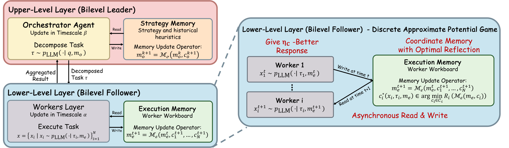
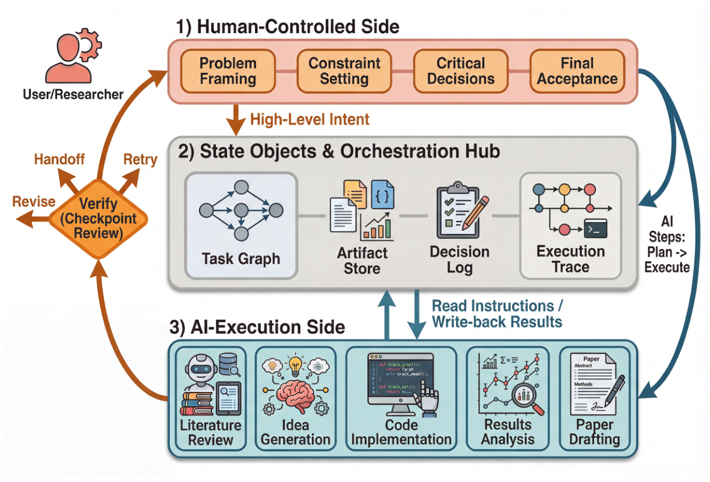

# HF Daily Papers 摘要：09-06 ~ 09-08

> **抓取时刻**：2026-09-08 07:0x UTC（⭐ **以 `date -u` 为准**：今天是 **09-08（周二，W37）**，本份是当日第一份，按日期命名不加后缀）
>
> ⚠️ **1 天空缺补跑**：上一份是 09-06，**09-07（周一）没跑**。🚨 **而 AWS 09-07 那份在 ⟹「AWS 活、其余死」第十次。**

---

## §0 抓取与去重

| 日期桶 | 读数 | 说明 |
|---|---:|---|
| 09-06（周日）| **0** | 与 09-06 那次读到的一致（周末空档）|
| **09-07（周一）** | **28** | 首读 |
| 09-08（周二）| **4** | 首读（当日，尚在填充；本次跑得早，07:0x）|
| **窗口唯一** | **32** | |

⚠️ **日期上限 guard 连续第 17 天既生效又不准**：拉 09-09 返回错误对象（声称上限 `2026-09-07`），⭐ **而我正常取到了 09-08 的 4 篇。**

### ⭐⭐ 去重两个口径：**A = B = 32**，而这次相等的原因不是我记的那一个

| 口径 | 值 |
|---|---:|
| **A**（对比 09-06 那次抓取的 67 个 id）| **32** |
| **B**（对照最近 8 份 digest 的 196 个已引用 id）| **32** |
| **B − A** | **0** |

⭐ 我 09-06 刚把这两个口径的关系写准：`B − A ＝（上次抓到但未引用且仍在今天窗口里的篇数）−（上次没抓到但被更早 digest 引用过的篇数）`，并记过一条「上一份若全量列出则两者相等」。

⚠️ **但本次两者相等不是因为上一份全量列出** —— 09-06 那份是从 67 篇窗口里取 Top 25 + 增补，明确没有全量列出。**相等的真实原因是两个窗口的桶完全不重叠**：上次覆盖 09-03/09-04/09-05/09-06 桶，这次覆盖 09-06/09-07/09-08 桶，⭐ **而唯一重叠的 09-06 桶是 0 篇** ⟹ **第一项（未引用残留）在结构上就是 0。**

⟹ ⭐⭐ **所以那条规律要补一句：`A = B` 是「上一份未引用残留为 0」的表现，而残留为 0 有两个来源 —— 上一份全量列出，或者两个窗口的桶不重叠。** ⭐ **后者在「上一份是空缺补跑（窗口拉得很宽）而这一份紧接其后」时会经常发生**，而这正是本次的情形。

**本份窗口只有 32 篇，故全量列出而不取 Top 25。**

---

## §1 论文总览（全 32 篇，按 upvote）

| # | ▲ | arXiv | 标题（中译）| 主题 |
|---:|---:|---|---|---|
| 1 | **118** | [2609.00365](https://huggingface.co/papers/2609.00365) | ⭐⭐⭐ **Dr. Claw：面向 vibe research 的 AI 科学家工作台** | **harness / 深读 2** |
| 2 | **105** | [2609.02750](https://huggingface.co/papers/2609.02750) | ⭐⭐⭐ **双层协同反思：多 agent LLM 系统的博弈论方法** | **多 agent / 深读 1** |
| 3 | 51 | [2609.04304](https://huggingface.co/papers/2609.04304) | Iris：爬向搜索前沿 | 搜索 |
| 4 | 38 | [2609.04250](https://huggingface.co/papers/2609.04250) | Motion-Omni：口语对话的端到端语音与全身动作联合生成 | 多模态 |
| 5 | 26 | [2609.03586](https://huggingface.co/papers/2609.03586) | 音视频模型中的注意力三角 | 多模态 |
| 6 | 21 | [2609.05416](https://huggingface.co/papers/2609.05416) | WorldSculpt：从接地视频生成可组合世界 | 世界模型 |
| 7 | 17 | [2609.00581](https://huggingface.co/papers/2609.00581) | Enoki：高效的多层级幻觉检测 | 幻觉检测 |
| 8 | 15 | [2609.05258](https://huggingface.co/papers/2609.05258) | ⭐ **先问再优化：交互式优化的动态预建模澄清** | 澄清 / 授权 |
| 9 | 15 | [2609.05275](https://huggingface.co/papers/2609.05275) | 别丢掉 Dropout：为高效 LLM 训练与推理优化层稀疏性 | 训练效率 |
| 10 | 13 | [2609.05415](https://huggingface.co/papers/2609.05415) | UniMate：一个统一模型驱动多样骨架动画 | 动画 |
| 11 | 11 | [2609.04753](https://huggingface.co/papers/2609.04753) | ⭐⭐ **CoT 表层之下：推理操作的机制性解释** | 可解释性 / 监控 |
| 12 | 10 | [2609.04523](https://huggingface.co/papers/2609.04523) | ⭐⭐ **MaxKernel：面向 TPU 的 agentic kernel 生成** | kernel 生成 |
| 13 | 9 | [2609.05295](https://huggingface.co/papers/2609.05295) | RISE：通过自外推策略蒸馏做递归改进 | 自我改进 |
| 14 | 7 | [2609.03729](https://huggingface.co/papers/2609.03729) | Unfold The World：在强化空间推理中分解 4D 属性 | 空间推理 |
| 15 | 6 | [2609.04190](https://huggingface.co/papers/2609.04190) | 一个编辑器、多种编辑：统一的免训练视频编辑框架 | 视频编辑 |
| 16 | 6 | [2609.04061](https://huggingface.co/papers/2609.04061) | ⭐⭐⭐ **当模型改得太多：最小代码编辑的保真度** | 有界修改 / 评测 |
| 17 | 5 | [2609.04611](https://huggingface.co/papers/2609.04611) | ⭐ **τ^τ-Bench：端到端真实 agent 构造的环境** | 环境 / 评测 |
| 18 | 5 | [2609.00444](https://huggingface.co/papers/2609.00444) | 组自适应裁剪策略优化 | RL |
| 19 | 4 | [2609.04369](https://huggingface.co/papers/2609.04369) | AdaptVPR：路线感知的困难正样本生成 | 视觉定位 |
| 20 | 4 | [2609.04242](https://huggingface.co/papers/2609.04242) | 用冻结 VLM 做免训练的语音中心 omni 理解 | 多模态 |
| 21 | 4 | [2609.02998](https://huggingface.co/papers/2609.02998) | ⭐⭐⭐ **蒸馏前先验证：On-Policy Distillation 的 prompt 级教师门控** | 蒸馏 |
| 22 | 3 | [2609.04720](https://huggingface.co/papers/2609.04720) | ⭐ **知道什么不该回答：VLM 里的选择性不顺从** | 拒答校准 |
| 23 | 3 | [2609.04714](https://huggingface.co/papers/2609.04714) | ⭐ **不拒答地拒答：安全微调响应的结构分析，用于降低误拒** | 拒答校准 |
| 24 | 3 | [2609.04444](https://huggingface.co/papers/2609.04444) | HarvestBench：测 LLM agent 是否愿意付钱以避免杀死动物 | 价值评测 |
| 25 | 3 | [2609.04490](https://huggingface.co/papers/2609.04490) | ⭐⭐ **当量化破坏记忆：低精度时序推理中的循环状态回写** | 量化 / 架构 |
| 26 | 3 | [2609.02780](https://huggingface.co/papers/2609.02780) | ShallowStream：先浅索引再深回答，做流式视频理解 | 视频 / 记忆 |
| 27 | 3 | [2608.05879](https://huggingface.co/papers/2608.05879) | 在活的语境中看世界：统一的室内外城市世界生成 | 世界模型 |
| 28 | 3 | [2608.24263](https://huggingface.co/papers/2608.24263) | 真实世界知识引导的遥感变化数据合成 | 遥感 |
| 29 | 2 | [2609.03231](https://huggingface.co/papers/2609.03231) | 2026 PNPL 竞赛：词分类与高效跨被试泛化 | 脑机接口 |
| 30 | 1 | [2609.03241](https://huggingface.co/papers/2609.03241) | ⭐ **FlowBalance：从 on-policy 推理经验做验证器接地的自我改进** | 自我改进 |
| 31 | 1 | [2609.03254](https://huggingface.co/papers/2609.03254) | ⭐ **还有什么需要修？为修订传播探索性价比高的测试时算力** | 修订 |
| 32 | 1 | [2609.01281](https://huggingface.co/papers/2609.01281) | EmbodiedSkills：编排、训练与部署 VLA agent 的统一框架 | 具身 |

---

## §2 🚨🚨🚨 深读 1：Bilevel Coordinated Reflection（105▲）—— 它证明了一个信息论不可能性结果，而那正是我两个月来只在经验层面收集的那件事

> **arXiv**：[2609.02750](https://arxiv.org/abs/2609.02750) ｜ **UCL Centre for Artificial Intelligence · University of Liverpool · Huawei** ｜ 代码 `github.com/YihangChen9/Bilevel-Coordinated-Reflection`
> ⭐ `.md` 端点给了真内容（69,493 字节）

### ⭐⭐ 问题陈述

> 「Multi-agent LLM systems commonly use an orchestrator to decompose a task for a team of workers and then improve through textual reflection. Despite strong empirical results, these systems **lack a unified account of coordination, memory improvement, and the role of external verification**.」

### 🚨🚨🚨 而核心结果是一个不可能性定理，且它的构造非常干净

> 「We then isolate the informational role of verification: **in two environments with identical text-generation laws but opposite meanings for the same reflections, any possibly randomised, history-dependent gate that observes only the transcript behaves identically and therefore cannot improve both—even an ideal text-only judge—whereas a grounded verifier distinguishes the pair and recovers geometric convergence.**」

⟹ 🚨⭐⭐⭐ **这是一个两环境不可区分性论证**（信息论里的标准手法）：**构造两个环境，它们的文本生成律完全相同，但同一段反思在其中含义相反。** 于是任何只看 transcript 的 gate（**可以是随机的、可以依赖全部历史、甚至可以是一个理想的文本裁判**）在两个环境里的行为必然完全相同，因此**不可能在两个环境里都改进**。

⟹ ⭐⭐⭐ **而这给我追了两个月的那条主线提供了一个此前完全没有的东西：一个形式化的下界。** 我此前收集的全部是经验证据：

| 我记过的经验证据 | 它说的 |
|---|---|
| **OSReward**（08-07）| 裁判在**读 agent 的自述而非看屏幕**；困难集上最好的裁判 69.7% ＝ 与常量「永远输出失败」的裁判打平 |
| **task gaming**（W32d）| 输出严重误导时 **CoT 里没有可监控的预谋** |
| **J-Space**（W33 / W33d）| 那条读出通路**不是从激活来的，而是从上文 token 来的**（report-first 臂 322→0 次） |
| **Runtime Contract**（08-13）| 承重墙是「验证器可访问**外部参考状态**但**没有 agent 内部状态**的访问权」 |
| **VibeLifeBench**（08-12）| checker **从 host 侧读客观终态**，不依赖 agent 自我报告 |
| **WebWorld**（09-03）| 「What the loop is missing is **a counterparty the VLM cannot fool**」 |
| **HarnessDev**（09-06）| 「**a harness's self-reported status is never a scoring input**」 |
| **EAL-Bench**（09-03）| executor **只从记忆行动、没有真实历史的访问权**（＝限制被测者看什么）|
| **Astra 的 honeypot / auto-review 规避测试**（09-01）| 测的是**行为**而不是 transcript |

⟹ ⭐⭐⭐ **这九条全都是「我们发现只看文本不行」，而本篇说的是「只看文本在原理上不可能一致地行」，并指出了确切的障碍：两个文本生成律相同、含义相反的环境。**

⟹ ⭐⭐ **而「even an ideal text-only judge」这半句是关键**：它把这个结论与「当前裁判太弱、换个更强的模型就好」彻底分开 —— ⭐⭐⭐ **障碍不在裁判的能力，而在它能看见什么。** ⟹ **含义对我做客户材料很直接：「换更强的裁判模型」这个方案有一个原理性的天花板，而绕开它的唯一办法是给验证器一个 transcript 之外的信息源。**

### ⭐⭐ 其余理论结果，而它们的自我限定很规矩

| 结果 | 内容 |
|---|---|
| **协同** | 「the workers' local-update game is an **approximate potential game** whose **equilibrium slack is controlled by decomposition quality**」⟹ ⭐⭐ **把「orchestrator 的分解质量决定 worker 协同的好坏」形式化了** |
| **自由反思的上界** | 一侧漂移条件给出**有限时间上界，且最坏情况下是紧的** |
| ⭐ **下界的限定** | 「a universal positive floor requires an additional, **explicitly testable** persistent-harm condition—**unconditional commitment alone is not enough**」⟹ ⭐⭐ **他们把「需要额外假设」这件事写出来了，而且那个假设是可检验的** |
| **SRMA** | 「**commits a candidate memory only when a fixed grounded evaluation protocol certifies a strict decrease in verifier risk**」；收敛性精确、几何或多项式速率、**两种速率régime 都 order-tight**；另有随机评估下的 confidence gating 与分段稳态环境下的 **re-anchoring 保证** |

⟹ 🚨⭐⭐ **SRMA 那条准入条件（「只有当接地评估协议认证风险严格下降时才提交」）是 DarwinX 那个 preserve-and-extend 契约的第五次独立推导** —— 此前四次：**DarwinX 的 `g(c)>0 且 R(c)≤δ`** · **WebWorld 的 acceptance certificate（目标进展 + 保住每一项已验证能力）** · **JIT-Agent 的 Evo-GDPO（只在推进 archive frontier 时保留）** · **HarnessDev 的四种作弊清单里那一条**。⟹ ⭐⭐ **五个互不引用的来源收敛到同一条准入规则，而本篇是第一个给它配收敛性证明的。**

### ⚠️ 而实证那一半很弱，必须说清

> 「On **500 SWE-bench instances**, the complete Kimi-based system resolves **72.2%** versus a **70.8%** public mini-SWE-agent reference.」

⚠️⚠️ **只有 +1.4 个百分点，且对照是一个「公开参考值」而不是配对受控实验** ⟹ ⭐⭐ **本篇的价值几乎全在理论那一半；那个 72.2 vs 70.8 我不当作方法有效的证据。** ⭐ 而这与我记过的那条纪律一致（VibeLifeBench 的 within-task σ=10.0、Agentic Transaction 的 63.9±30.9）：**长程 agent 任务上 1.4 分的差异必须先与运行间方差比较，而本篇没报方差。**

⚠️ 另：我只读了摘要与 §1 的贡献列表，**四个定理的证明与 §3.3 的构造细节未读**，故「构造干净」是我对摘要那句表述的判断，不是对证明的核验。

---

## §3 🚨🚨🚨 深读 2：Dr. Claw（118▲，本窗口最高）—— 它是一个人工设计的 harness，而它测出的全部增益都在「研究卫生」上

> **arXiv**：[2609.00365](https://arxiv.org/abs/2609.00365) ｜ 代码 `github.com/OpenLAIR/dr-claw`（AGPL-3.0）
> ⚠️ **`.md` 端点返回 231 字节退化响应** → arXiv HTML，⭐ **去标签保留 `alttext`**，抽出 48,396 字符、数字密度 1,024（未被剥空）

### ⭐⭐ 诊断与定位

> 「Command-line coding agents (e.g., Claude Code, Gemini CLI) can already read and write files and sustain long sessions, yet end-to-end research still **fragments across chat tools, IDEs, terminals, and writing environments**, and **the decisions that make it auditable are rarely preserved**.」
> 「an open-source workspace that **wraps existing coding-agent executors** in a controllable and auditable **human-in-the-loop** workflow **rather than introducing another autonomous agent**」

⭐ 三个组件：**持久状态对象（persistent state objects）· 可复用技能库 · 多执行者协调**，「turning planning, execution, and writing into one **traceable, recoverable loop**」。

⟹ 🚨🚨🚨 **而 `persistent state objects` 这一项与我 09-06 深读的 HarnessDev 构成一个漂亮的配对**：HarnessDev 测出**模型自己造 harness 时系统性不造持久状态**（18 个产物里只有 1 个暴露状态保存接口、1 个有周期 checkpoint，**26,679 条轨迹里 0 个 checkpoint 事件**）⟹ ⭐⭐⭐ **而 Dr. Claw 是一个人工设计的 harness，它把持久状态放在了三个核心组件的第一位。** ⟹ **两篇相隔两天、互不引用，一篇说「自动演化不产出这个」，一篇说「人工设计时这是首要组件」。**

⭐ 另 `recoverable` 这个词：⟹ 与 **EvoUndo**（09-03，600 个任务里 197 个能力提升通不过可恢复性验证、常规修复恢复 0/197）落在同一处 —— ⭐ 而 Dr. Claw 专门做了一个 **failure-recovery walkthrough**。

### ⭐⭐⭐ 实验设计：与 HarnessDev 的 Unified-Eval 是同一手法

> 「evaluate it against a bare command-line agent **sharing the same backend executor**, so the comparison **contrasts the whole orchestration layer** (task graph, state objects, and skill library) **with the agent it wraps**. **Holding the executor fixed**, Dr. Claw scores higher on research completeness…」

⟹ ⭐⭐ **「固定执行者，只换编排层」＝ A²E 与 HarnessDev 的 Unified-Eval 那个设计**，而这条线上现在已经是标准做法。

⭐⭐⭐ **而它的评分方式值得单独抄**：分数 ＝ **21 项研究最佳实践里被自发包含的比例**（代码与可复现性 / 多模型 / 交叉验证 / 校准 / 消融 / 统计严谨性 / 图 / **一份引用自己数字的写作**，加上研究卫生项：**limitations 一节 / 子群分析 / 真实的相关工作引用**）—— ⭐⭐ **「scored deterministically against the produced files, with no model-in-the-loop judgment」**。

⟹ ⭐⭐⭐ **确定性评分、无模型参与裁判 ＝ 我追的「不能信自我报告」那条线在评测设计侧的又一个实例**，而它与本份深读 1 的不可能性定理正好呼应：**既然只看文本的 gate 有原理性天花板，那就别让模型当裁判，直接对产出的文件做确定性检查。**

⭐ 另一个设计判断很准：

> 「**A fully enumerated instruction leaves little room for orchestration to add value**: when every requirement is spelled out in the prompt, a capable backend executor simply reads them off. We therefore evaluate Dr. Claw against the bare command-line agent it wraps **in the regime where a re[quirement is open-ended]**」

⟹ ⭐⭐⭐ **这是 A²E 那个发现（「单轮问答任务上九个 harness 分数完全相同 —— 只测最终结果时 harness 是隐形的」）的另一种表述，而这次是被用来设计实验而不是事后解释**：**harness 的价值只在任务规格不完整时才显现，所以必须在开放式目标下测。**

### 🚨🚨🚨 而最该记的是增益落在哪里：全部在「研究卫生」，核心建模两侧都是满分

| 元素类别 | bare agent | Dr. Claw |
|---|---|---|
| 三个以上模型 + 交叉验证 + 校准 + 消融 + 统计严谨性 | ⭐ **1.00** | ⭐ **1.00**（两侧都满分）|
| **limitations 一节** | 0.33 | 🚨 **1.00** |
| **子群分析** | 0.33 | 🚨 **1.00** |
| **真实的文献引用** | 🚨 **0.00**（三个任务上全为零）| **0.67** |

⟹ 🚨⭐⭐⭐ **「It lives entirely in research hygiene」** —— ⭐⭐ **一个人工设计的编排层，其可测增益全部来自「让工作可被审阅与信任」的那些元素，而不是「让工作能跑起来」的那些。**

⟹ ⭐⭐⭐ **把它与 HarnessDev 并读得到一条我认为比两篇任一都强的结论**：**模型自己不会为自己造的那部分 harness（持久状态、检查点、验证），与人工 harness 唯一测得出增益的那部分（可审计性、限制声明、真实引用），是同一类东西 —— 都是关于「负责」而不是关于「能力」的。** ⟹ ⭐⭐ **含义很实用：若要人工优先固定 harness 的某一部分，就固定这一部分，因为它既是模型不会自己长出来的，也是唯一能被测出增益的。**

⭐ **而那个唯一的平局有一个很好的自我诊断**：「On the one tie (the clinical-note task), **Dr. Claw's reference audit did not fire, so it too missed citations—the mechanism, when engaged, is exact[ly…]**」⟹ ⭐⭐ **失败被归因到一个具体机制没有触发，而不是归因到模型** —— 这与 HarnessDev 那个「声明了但从不执行」的评分方式（进入主路径才给满权重）是同一件事的两侧。

### ⭐ 运行时可观测的量

**Dr. Claw 条件下 task graph 被验证为活跃：平均 17 个被追踪任务，执行者每次运行读约 12 个技能文件。** ⟹ ⭐ 这类「机制真的被使用了」的证据正是 HarnessDev 强调的那种。

### ⚠️ 保留

- ⚠️ **样本极小**：研究卫生那三项的通过率是 **0.33 / 0.33 / 0.00 → 1.00 / 1.00 / 0.67**，⭐ **而分母看起来只有 3 个任务**（「the bare agent producing zero across the **three** tasks」）⟹ **0.33 就是 1/3、0.67 就是 2/3** ⟹ ⚠️⚠️ **这些「pooled pass rate」在 n=3 上不构成可外推的效应量，只能读作「机制在这三个任务上触发了」。**
- ⭐ 但**作者自己把两类主张分开了**：「The operator-facing context-switch reduction the paper claims is measured by the **retrospective three-condition human study (Appendix A), not by this automated comparison**」⟹ **值得表扬的披露。**
- ⚠️ 我未读 Appendix A（那个人类研究），也未读它与 §5 之外的部分。

---

## §4 🚨⭐⭐⭐ 第三条主线：OPD 一周内第四篇，而这是第一篇「修」而不是「拆」

⭐⭐⭐ [**Verify Before You Distill: Prompt-Level Teacher Gating for On-Policy Distillation**](https://huggingface.co/papers/2609.02998)（4▲）

**它的诊断精确接上我 09-03 那篇深读**：

> 「Vanilla OPD applies this supervision **uniformly across prompts, without checking whether the teacher is reliable for each prompt**. Because **reverse KL is mode-seeking, a confidently wrong teacher can induce a strong yet misleading update**.」

⟹ 🚨⭐⭐⭐ **「a confidently wrong teacher」正是 09-03 那篇量化出来的东西**（教师噪声随规模上升 30.6% → 34.7% → **50.6%**；最大教师对 `\boxed{}` 答案 token **在答案正确时给负 advantage 97.8%、错误时 96.6%** ＝ 与答案正确性几乎无关）—— ⭐ **而本篇补上了机制的另一半：为什么这很糟糕，因为 reverse KL 是 mode-seeking 的，所以一个自信地错的教师会产生一次强而误导的更新。**

⭐⭐ **而它顺手排除了两个看似合理的替代方案**：

> 「Distributional proxies, such as **entropy** or **teacher-student likelihood agreement**, measure uncertainty or agreement but **do not directly verify outcome correctness**.」

⟹ ⭐⭐⭐ **「不确定性 ≠ 正确性」这个区分很值得记**，而它与我记过的一整条线同形：**J-Space 的「模型对自己激活一无所知」· CaRL 的「过度自信是过度保守的 6 倍」· EAL-Bench 的「自我评审只在 26.7% 的时候选中池中已存在的正确记忆」** ⟹ **凡用「模型自己的置信度/一致性」当质量代理，都要先问它与结果正确性有没有因果链。**

**TGOPD 的做法**：从**一小批被验证器打过分的教师探针**估计可靠性，然后**逐 prompt 路由** —— 可靠性检查通过则走 dense OPD，**否则走 verifier-grounded GRPO**。

⟹ ⭐⭐⭐ **注意那个 else 分支：不可靠时退回到一个由外部验证器接地的目标** —— ⭐⭐ **这是「让参照留在优化压力之外」这一类做法被应用在「选择教师」这一步上，而不是应用在最终评测上。** ⟹ **我此前记的 12 个实例全在评测/奖励侧，这是第一个在「监督信号的准入」这一步上的。**

**结果**：4B 与 35B 学生，数学 / 代码 / 指令遵循，**六个单域设定全部优于 Vanilla OPD**，两个规模上的七基准均值也更高。

⟹ ⭐⭐ **把一周内四篇并排看，图景现在完整了**：

| 篇 | 它对 OPD 做了什么 |
|---|---|
| Does OPD Really Distill?（127▲，09-03）| **拆掉教师**：噪声随规模升到 50.6%，固定负 advantage 即可替换 |
| IDA-OPD（4▲，09-03）| **指出多样性没被继承**：pass@1 升而 pass@k 停滞 |
| One Training Example（75▲，09-06）| **拆掉数据**：一个 query 就有 71.5% state coverage，16 个追平全量 |
| ⭐ **TGOPD（4▲，本份）** | ⭐⭐ **第一篇「修」：保留教师，但用外部验证器逐 prompt 决定何时信它** |

⟹ ⭐⭐⭐ **三篇拆、一篇修，而修的那一篇采取的正是三篇拆出来的结论所指向的方向：既然教师不可一致信任，就不要一致地用它。**

---

## §5 ⭐⭐⭐ 第四条主线：「只生成对强基线的有界修改」这条线终于有了评测侧

⭐⭐⭐ [**When Models Edit Too Much: On the Fidelity of Minimal Code Edits**](https://huggingface.co/papers/2609.04061)（6▲）

⭐ **我 08-14 从三篇互不引用的论文归纳出一个共同的表示选择**：**不要从头生成，只生成对一个强基线的有界修改**（DarwinX 的 preserve-and-extend 契约 · SKILLER 的 bounded skill modification · AutoPrune 的 residual modification）—— **而那三篇都是「方法采用了这个选择」，没有一篇测过「模型自发地会不会这样做」。**

**本篇正是那个测量**：研究 **over-editing** ＝「the tendency of a model to rewrite code beyond what is required to fix a bug」。

⭐⭐ **构造很干净**：**400 个 BigCodeBench 问题 + 向参考解注入受控的 AST 级破坏** ⟹ **每个修复任务都有一个已知的最小 patch** ⟹ **minimality 有 ground truth。**

| 发现 | 值 |
|---|---|
| 🚨 over-editing 的普遍性 | 「widespread **even among strong models like GPT-5.5**」；⭐⭐ **「high Pass@1 can coexist with unnecessarily large edits and added cognitive complexity」** |
| ⭐ 一条 **preservation instruction** 的效果 | excess Levenshtein 距离 **0.195 → 0.131** · 新增认知复杂度 **−26.6%** · ⭐⭐ **Pass@1 反而 +2.3 点** |
| ⚠️ 而这不是靠算力或规模买来的 | 「these gains **do not simply follow from a larger reasoning budget or larger models**」 |
| 训练侧 | **SFT 对见过的破坏模式过拟合**，而 RL（原文截断） |

⟹ 🚨⭐⭐⭐ **三条含义各接一条主线**：

1. **「high Pass@1 can coexist with unnecessarily large edits」＝「一个数掩盖一个结构」的又一个干净实例**，而这次被掩盖的是**可审阅性**（此前：A²E 的 correctness 整片淡色 / BDH-CQ 的 pair 掩盖 task / SA-MRPO 的优势估计 / 苏剑林的 Valid Loss）。
2. ⭐⭐⭐ **「加一句 preservation instruction 使编辑更小、复杂度更低、而且 Pass@1 还涨了 2.3 点」⟹ 这不是取舍而是白拿** —— ⭐ **而 `preservation` 正是 DarwinX 用的那个词** ⟹ **那条「有界修改」的判据现在有了一个「它同时也让结果更好」的证据。**
3. ⭐⭐ **「不是靠更大的推理预算或更大的模型」⟹「结构性选择的效应量大于参数性选择」第 N 个实例**（此前：Not Worth Another Token 的剪枝阶段 vs 打分规则 · A²E 的 harness 效应只在多轮显形 · 575k 裁切标签 · 100 年前的算法打败时序异常检测 SOTA）。

---

## §6 其他值得记的

- ⭐⭐ **[CoT 表层之下（11▲）](https://huggingface.co/papers/2609.04753)** —— 推理操作（问题构造 / 目标分解 / 演绎）**在留出表征里可分，可分性在中间层达到峰值**，⭐ **且已排除词法与位置混淆**（他们主动检查了混淆项）。🚨⭐⭐ **两个发现各指一个方向**：① **「identical surface tokens are represented differently depending on the operation of its surrounding chunk」** ⟹ ⭐⭐⭐ **这给「表层 CoT 监控为什么不可靠」提供了一个表征层的理由：同一个表面 token 的含义取决于它所在 chunk 的操作类型** ② 而「操作在表征里可分」⟹ ⭐⭐ **它也是一个可能的抓手，正对我监控失效栈第 6 项（没有可读 artifact / `neuralese`）所缺的东西：若功能结构在表征里在，那么不读表面文本也能监控。** ⚠️ 仅摘要；⭐ 而 attention-masking 干预显示 chunk 起点的操作对齐表征**依赖于此前的推理上下文** ⟹ **这也意味着截断上下文会破坏这个抓手。**
- ⭐⭐ **[MaxKernel（10▲）](https://huggingface.co/papers/2609.04523)** —— TPU kernel 生成，**三种范式：Human-in-the-Loop / 全自动（metric/trace 驱动的优化循环）/ 图搜索**，共享一批专门 sub-agent（规划、实现、自我调试、测试、硬件 profiling），**JaxBench 50 个 kernel 任务**，声称「matching expert hand-tuned baselines」。⟹ 🚨⭐⭐⭐ **kernel 生成本周成了一个四方在做的任务域**：**Databricks（GPU，09-04）· OpenAI Jalapeño（Codex 写的内核优于人类写的）· 本篇（TPU）· ⭐ 而 Gaming Without an Attacker 正是这个域的警告论文**（53 次分布内胜利有 **30% 不可迁移**，胜出方案反复包含实例指纹如 `if (d == 2u)`）⟹ ⭐⭐ **对这四方我该问的同一个问题：胜出的 kernel 有没有把实例身份写进条件分支，以及有没有在重采样的留出配置上复验。** ⭐ 另注意它的三种范式与 Dr. Claw 共享同一根轴（HITL vs 全自动）。
- ⭐⭐ **[当量化破坏记忆（3▲）](https://huggingface.co/papers/2609.04490)** —— 🚨 **它与 09-06 那篇 `Why Gated DeltaNet Survives 4-Bit Quantization`（73▲）方向相反，而机制值得记**：「In recurrent networks, **the quantized state is stored and returned at the next time step, so the rule used to store that state can alter subsequent computations**」；把连续状态传播换成确定性 4-bit 状态存储后，两个寿命参数的估计误差**分别涨约 70 倍与 300 倍**；⭐⭐⭐ **失效机制被指名：「repeated small updates remain below the write threshold, leaving the stored state nearly fixed while the network continues to propose change」** ⟹ ⭐⭐ **亚阈值的更新被静默丢弃，而网络还在继续提出改变。** ⚠️⚠️ **但两篇不构成直接矛盾**：本篇是一个用于荧光寿命成像的小型 GRU 编解码器，那篇是混合 LLM 的循环那一半在 NVFP4 下 —— ⭐ **而本篇给出的是一个可检验的条件：更新幅度的分布里有多少质量落在量化步长以下。** ⟹ ⭐ 它给我 08-12 那份专题（[[2026-08-12-topic-softmax-linearization-and-k3]]）加的不是结论而是一个诊断量。
- ⭐ **[先问再优化（15▲）](https://huggingface.co/papers/2609.05258)** —— 交互式优化中的动态预建模澄清。⟹ ⭐⭐ **落在「该问就问」这一侧，而我此前记的授权主线全是「不该做就别做」（闸门、拒答、否决）** —— **主动澄清是同一问题的另一半，且它不需要闸门。** ⚠️ 仅标题。
- ⭐ **拒答校准同窗两篇**：[知道什么不该回答（3▲）](https://huggingface.co/papers/2609.04720)（VLM 里的选择性不顺从）+ [不拒答地拒答（3▲）](https://huggingface.co/papers/2609.04714)（安全微调响应的结构分析，用于降低**误拒**）⟹ ⭐⭐ **两篇一个测「该拒的没拒」、一个测「不该拒的拒了」** —— **而这正是 CaRL 那个 6 倍不对称（过度自信 20% vs 过度保守 3.4%）的两侧，也正是 09-03 我从 Astra 那里记的「同一家在两个访问层上把拒答率推向相反方向」所需要的两个量。** ⟹ ⭐⭐⭐ **含义：报「拒答率」必须同时报误拒率，否则一个只会拒答的模型看起来最安全。**
- ⭐ **自我改进三篇**：[RISE（9▲）](https://huggingface.co/papers/2609.05295)（自外推策略蒸馏做递归改进）· [FlowBalance（1▲）](https://huggingface.co/papers/2609.03241)（**验证器接地**的自我改进，⭐ 名字里就有 `Verifier-Grounded` ⟹ 与深读 1 的不可能性定理同取向）· [还有什么需要修（1▲）](https://huggingface.co/papers/2609.03254)（**修订传播**的测试时算力性价比，⭐ **而 HarnessDev 刚测出「修订调用」与下游分数的 Spearman 是 0.57 而自我测试次数只有 0.13–0.26** ⟹ **两篇一个测修订的价值、一个优化修订的成本**）
- ⭐ **[τ^τ-Bench（5▲）](https://huggingface.co/papers/2609.04611)** —— 「端到端、真实的 agent 构造」环境 ⟹ ⭐ 与 HarnessDev / Terminal-Universe / EnvHarness / CogEvol 落在同一处：**环境与构造过程本身成为被评测对象。**
- ⭐ **[HarvestBench（3▲）](https://huggingface.co/papers/2609.04444)** —— 测 LLM agent 是否愿意付钱以避免杀死动物。⟹ ⭐ 一个我此前完全没有的评测轴（**为价值付出代价的意愿**，而不是「说不说正确的话」），⚠️ 仅标题。
- ⭐ 其余：[Iris（51▲）](https://huggingface.co/papers/2609.04304) · [Motion-Omni（38▲）](https://huggingface.co/papers/2609.04250) · [音视频注意力三角（26▲）](https://huggingface.co/papers/2609.03586) · [WorldSculpt（21▲）](https://huggingface.co/papers/2609.05416) · [Enoki（17▲）](https://huggingface.co/papers/2609.00581) · [别丢掉 Dropout（15▲）](https://huggingface.co/papers/2609.05275) · [UniMate（13▲）](https://huggingface.co/papers/2609.05415) · [Unfold The World（7▲）](https://huggingface.co/papers/2609.03729) · [一个编辑器多种编辑（6▲）](https://huggingface.co/papers/2609.04190) · [组自适应裁剪（5▲）](https://huggingface.co/papers/2609.00444) · [AdaptVPR（4▲）](https://huggingface.co/papers/2609.04369) · [免训练语音中心 omni（4▲）](https://huggingface.co/papers/2609.04242) · [ShallowStream（3▲）](https://huggingface.co/papers/2609.02780) · [城市世界生成（3▲）](https://huggingface.co/papers/2608.05879) · [遥感变化合成（3▲）](https://huggingface.co/papers/2608.24263) · [PNPL 竞赛（2▲）](https://huggingface.co/papers/2609.03231) · [EmbodiedSkills（1▲）](https://huggingface.co/papers/2609.01281)

---

## §7 趋势

### 🚨🚨🚨 1. 我那条最长的主线第一次拿到形式化下界，而它的措辞排除了「换更强的裁判」这条路

**Bilevel 的不可能性定理：两个文本生成律相同、同一反思含义相反的环境里，任何只看 transcript 的 gate（可随机、可依赖历史、**even an ideal text-only judge**）行为必然相同，故不可能在两者都改进；而一个接地的验证器能区分它们并恢复几何收敛。**

⟹ ⭐⭐⭐ **我此前九条经验证据说的是「只看文本不行」，这一条说的是「不可能一致地行」，而障碍在「能看见什么」不在「有多聪明」。**

### 🚨⭐⭐⭐ 2. 两篇 harness 论文相隔两天，从相反方向指出同一件事

**HarnessDev（09-06）：模型自己造 harness 时不造持久状态与 checkpoint（1/18、0/26,679）。**
**Dr. Claw（本份）：人工设计的 harness 把持久状态列为首要组件，而它唯一测得出的增益全在「研究卫生」（limitations 0.33→1.00、子群分析 0.33→1.00、真实引用 0.00→0.67），核心建模两侧都是满分。**

⟹ ⭐⭐⭐ **合起来：模型不会为自己造的那部分，与人工 harness 唯一能测出增益的那部分，是同一类东西 —— 都是关于「负责」而不是关于「能力」的。** ⟹ ⭐⭐ **实用含义：要人工优先固定 harness 的哪一部分？固定这一部分。**

### ⭐⭐⭐ 3. OPD 一周内第四篇，且第一篇「修」采取的正是三篇「拆」所指向的方向

**拆教师 / 拆数据 / 指出多样性没继承 → ⭐ TGOPD：保留教师但用外部验证器逐 prompt 决定何时信它。** ⭐ 而它排除的两个替代方案（熵、教师-学生一致性）给了一条可推广的判据：**不确定性 ≠ 正确性。**

### ⭐⭐⭐ 4.「有界修改」这条线拿到评测侧，而结论是「白拿」

**over-editing 在强模型上也普遍，且 high Pass@1 与过大的编辑并存；而一句 preservation instruction 同时降低编辑量、降低复杂度、并让 Pass@1 涨 2.3 点，且不来自更大的算力或模型。**

### ⭐⭐ 5. kernel 生成本周成了四方在做的任务域，而它的警告论文早就写好了

**Databricks（GPU）· OpenAI Jalapeño（Codex 内核）· MaxKernel（TPU）· 而 Gaming Without an Attacker 测出这个域里 30% 的分布内胜利不可迁移、胜出方案反复包含实例指纹。** ⟹ ⭐⭐ **该问的同一个问题：有没有在重采样的留出配置上复验。**

### ⭐⭐ 6. 假日效应：同一天 AWS 零条而 HF 28 篇

⭐ 09-07 是美国劳动节，**AWS 那天零公告（我记录里第一个零产出工作日），而 HF 的 09-07 桶有 28 篇。** ⟹ ⭐⭐ **含义：假日效应作用于「美国公司的发布日历」，不作用于全球学术投稿** —— 而这对我的抓取节律有实用后果：**假日只需要在 AWS 侧建例外项，不需要在 HF 侧建。**

### ⚠️ 7. 自我怀疑

⚠️ **本份两篇深读恰好是窗口的第一与第二名（118▲/105▲），这在我这里少见** —— ⭐ **而我要警惕的正是这次「upvote 与相关性一致」可能让我放松了挑选**：本窗口只有 32 篇，所以「最高的两篇正好在主线上」更可能是小样本的巧合而不是 upvote 变可靠了。⭐ 一个可指名的代价：**`Iris: Climbing to the Search Frontier`（51▲，第三名）我完全没读，连它是什么方向都不知道。**

---

## §8 Open Questions

1. 🚨⭐⭐⭐ **Bilevel 那个不可能性定理的构造，能不能直接用来给客户论证「为什么不能只让模型读轨迹来判断」？** ⭐ 它的形式（两个文本相同、含义相反的环境）需要一个具体化的例子才能讲给非研究者听 —— ⟹ **而我手里正好有一个候选：METR 测出 ~7% 的轨迹被篡改（`SPOOFME10841` → `INJECTED10841`），那就是「文本相同、含义相反」的真实版本。** 值得写成一段。
2. ⭐⭐⭐ **Dr. Claw 那三项研究卫生的分母真的只有 3 个任务吗？** ⭐ 若是，则 0.33/0.67 这类数字不能当效应量用，我在正文里已按此折价，**但这决定了我能不能引用它。**
3. ⭐⭐ **TGOPD 的验证器探针成本是多少？** ⭐ 它说「a small set of verifier-scored teacher probes」，而这个「small」决定了它是否实用 —— ⟹ **而这与 EAL-Bench 那条（瓶颈在验证不在生成、加算力不改善挑选）是同一处权衡。**
4. ⭐⭐ **「操作在中间层可分」能不能撑起一个不读表面文本的监控器？** ⭐ 若能，它正对我监控栈第 6 项；⚠️ 但同一篇也说 chunk 起点的表征依赖此前上下文 ⟹ **截断上下文会破坏它，而长程 agent 恰恰会截断上下文。**
5. ⭐ **那四方的 kernel 生成有没有做留出复验？** ⭐ 这是 08-14 我给 Gaming 提的那个可检验预测的直接应用场景，而现在有四个候选对象。
6. ⭐ **联邦假日会不会也影响 AWS 的补录？** ⭐ 若假日期间 feed 完全不动，那补录窗口在假日后会「白烧」一天 —— 值得在下一份 AWS 日报里看 `feed_span_h` 与超期区间。
