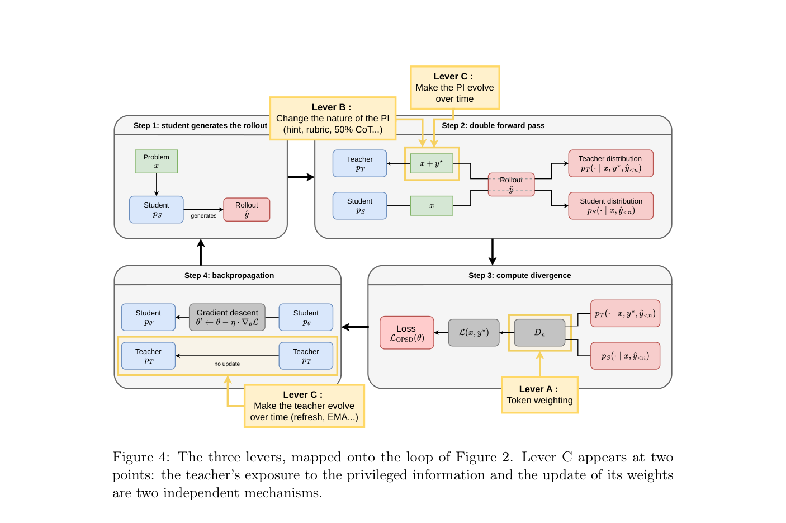
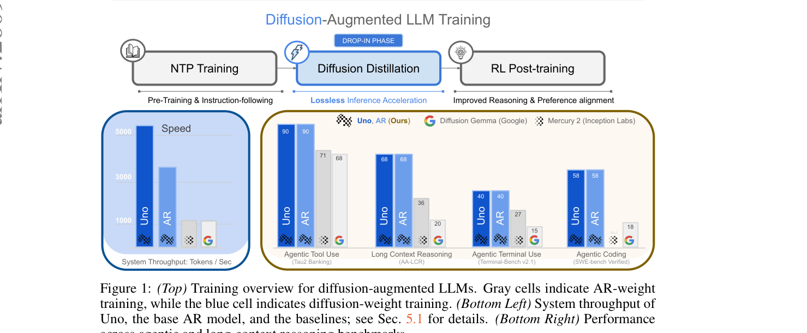

# HF Daily Papers — 09/08 当日第二跑（2026-09-08 08:2x UTC）

## Context

- **`date -u` = 2026-09-08 08:27**，而我今早 **07:11** 已落盘一份（`2026-09-08-hf-daily-papers-sep06-sep08.md`）⟹ **本份是当日第二跑，间隔 1.3 小时**（是我测过最短的 HF 窗口之一，此前最短是 08-18 的 51 分钟与 59 分钟）。
- ⚠️ **prompt 是早班（07:57）框架而实际时刻已过它** —— 以 `date -u` 为准，本份加后缀 `b`。
- ⚠️ `check` 报出 hf/reddit/tech-blogs 各漏 09-02/09-04/09-05/09-07 四天、cross-digest 漏 09-07，⭐ **但那些空缺已分别由 09-06 那份、今早那份、以及今天补写的 W36 cross-digest 处理掉** ⟹ **本次不是补跑。**

### 桶读数

| 桶 | 今早 07:11 | 本次 08:27 | |
|---|---:|---:|---|
| 09-04 | 31 | **31** | 收敛 |
| 09-05 | 0 | **0** | 周末 |
| 09-06 | 0 | **0** | 周末 |
| 09-07 | 28 | **28** | ⭐ 已收敛 |
| **09-08** | 4 | ⭐ **6** | **+2** |

⟹ **窗口唯一（09-07 + 09-08）= 34 篇。**

⚠️ **日期上限 guard 连续第 18 天既生效又不准**（声称上限是 `2026-09-07T00:00:00.000Z`，却能取到 09-08 的 6 篇）—— 实用结论不变：每次都拉、靠 `isinstance(d, list)` 兜住。

### 🚨 去重两个口径：A = B = 2，而本次是第①种成因

- **A（对比今早那次抓取的 32 个 id）= 2**
- **B（对照最近 8 份 digest 累计 226 个已引用 id）= 2**
- **B − A = 0**

⭐⭐⭐ **而按我今天刚立的判据必须说清是哪一种成因，本次是第①种：今早那份把窗口里 32 篇全部逐条引用了**（因量小全列）⟹ 两个口径在构造上等价。

⟹ 🚨⭐⭐⭐ **而这产生了一个我认为很有价值的对照：同一天、相隔 1.3 小时的两份 digest 都给出 `A = B`，而原因完全不同** —— **今早那份是第②种（09-06 那份的窗口是 09-03/09-04 两个桶、本份是 09-07/09-08 两个桶，两组桶零交集，B 退化成「窗口大小」）；本份是第①种（上一份全量引用）。** ⟹ ⭐⭐ **这就是那条判据为什么必要：`A = B` 本身不携带信息，携带信息的是它出于哪一种成因** —— 第①种说「上一份覆盖率是 100%」（好消息），第②种什么都不说（由构造决定）。

### ⭐ 另一个可记的抓取细节：一篇 8 月 26 日的论文今天才进桶

`2608.25936` 的 arXiv 日期是 **2026-08-26**，而它今天才出现在 09-08 桶里 ⟹ **挂了 13 天**。⭐ 这是 CLAUDE.md 那条「HF 日期桶会回溯含旧论文」的又一个干净实例（此前最极端的是 DarwinX 挂了两周、Modular Cognitive Architecture 挂了近两个月），⚠️ **而它同时是「upvote 与相关性弱相关」目前最极端的一次：这篇 6▲ 的论文是我这条 OPD 主线两个月来最需要的一篇。**

---

## 论文总览（2 篇，全列）

| arXiv | 标题 | ▲ | 桶 | 主题 |
|---|---|---:|---|---|
| [2608.25936](https://arxiv.org/abs/2608.25936) | One Symptom, Three Levers: A Critical Review of On-Policy Self-Distillation | **6** | 09-08 | 🚨 OPD/OPSD 综述 |
| [2609.04010](https://arxiv.org/abs/2609.04010) | Unlocking Lossless Speedups in LLMs via Discrete Diffusion | **18** | 09-08 | 推理加速 / 离散扩散 |

---

## 🚨🚨🚨 Deep Dive：`One Symptom, Three Levers` —— 它把我分散在十几篇论文里的 OPD 记录组织成一张图，并给了我一直缺的那个**正面判据**

> [arXiv:2608.25936](https://arxiv.org/abs/2608.25936)（**6▲**，Justin Robert（通讯）· Raheel Qader，**OVHai LLM** ＝ OVHcloud 的 AI 部门；cs.LG，08-26；30 页）
>
> ⚠️ 取全文触发降级链：`.md` 端点返 **327 字节退化响应**（标题是 `OPSD-V1.svg`）→ arXiv HTML **93,040 字符**（⭐ 去标签时保留 `alttext`，自检数字密度 1.82% ＝ 没被剥空）。⚠️ **而 arXiv HTML 里没有任何嵌入位图**（`` 只有站点 logo 与资助方标志，配图是 SVG）⟹ **配图从 PDF 第 23 页渲染 ＝ 降级链第四级。**

### ⭐ 先记它自己声明的性质，因为这决定了怎么用它

> 「**We report no new experiments.** The contribution is structural: **a shared vocabulary for phenomena named differently across papers**, and **a clear line between what is settled and what is still disputed**.」

⟹ ⭐⭐⭐ **这正是我需要的那种东西。** 我这两个月从十几篇 OPD 论文攒了一堆现象（教师噪声随规模上升 / pass@1 升而 pass@k 停滞 / 单个 query 已达 71.5% state coverage / 置信度不代表正确性…），⚠️ **而它们在不同论文里名字不同、彼此不引用，所以我没法判断哪些是同一件事** —— 一份提供共享词汇的综述对我的价值高于任何单篇新方法。

⭐ **它顺带给了我一直缺的一个规模数字**：「The field opened by OPSD now comprises **more than two hundred works**。Its two largest branches are **multimodal learning** and **tool-using agents**。」⟹ **我从 08-07 起记「OPD 一周内完成子领域化」、之后每周都记它在扩张，但从来没有一个总量。200+ 是第一个，而它明确把范围限在数学推理（方法起源处、失效模式记录得最好的地方）。**

### 🚨 术语第一次被划清，而我此前一直在混用

| 名字 | 教师是谁 | 教师凭什么更强 |
|---|---|---|
| **OPD**（on-policy distillation）| **一个更大的外部模型** | 能力更强 |
| **OPSD**（On-Policy **Self**-Distillation）| **模型自己** | ⭐⭐⭐ **只是被喂了学生在测试时拿不到的特权信息**（参考解） |
| **SDPO**（Self-Distillation Policy Optimization）| 模型自己 | 环境反馈 |

🚨⭐⭐⭐ **中心句：「The teacher is no stronger than the student, only better informed.」**

⟹ ⭐⭐⭐ **这一句直接解释了我 08-07 深读 DAPD 时记下的那个结论（「privilege illusion 的根因是信息不对称而非教师质量」）为什么成立** —— **在 OPSD 里教师按构造就不比学生强，所以任何效应都只能来自信息不对称。** ⭐ 而我当时把它当作 DAPD 的一个发现，现在知道它其实是这个方法族的定义性质。

⭐ 另记：**OPSD 与 SDPO 是「在几天内独立提出」的**（一个用参考解、一个用环境反馈）⟹ 又一个「同一问题被独立命名两次」的实例（HF 侧我记过两篇不同论文同名 SkillZip）。

### 🚨🚨🚨 §1.4「三种幻觉」—— 本篇对我最即刻可用的一节，且有一条我完全没有

| 幻觉 | 内容 |
|---|---|
| **Variance** | ⭐⭐⭐ **AIME 只有 30 题：一题翻转就移动 3 分以上，而两个解码种子之间的跨度可达 15 分** ⟹ 「**A '+3 points' from a single decode is usually noise.**」 |
| **Contamination** | AIME 2024 题面部分在预训练数据里，**有些模型凭记忆做出其中一半，而在训练截止之后发布的基准上失败** |
| 🚨🚨🚨 **Model-family specificity** | **「On Qwen models, even a random training signal can raise the score. The effect is absent on Llama and OLMo, and comes from pre-training rather than from the method under evaluation.」** |

⟹ 🚨⭐⭐⭐ **第三条是我完全没有的一条，且它极其锋利：在 Qwen 上，一个随机的训练信号也能提分** ⟹ ⭐⭐ **任何只在 Qwen 上验证的后训练方法，其增益无法与「Qwen 特有的预训练效应」区分开。**

⚠️⚠️ **而它给了我一个可以回头审查自己记录的检查项**：我这两个月深读过的 OPD 论文里，**Does OPD Really Distill?（Qwen3-1.7B）· One Training Example · IDA-OPD** 都主要在 Qwen 家族上做 —— ⟹ **它们的效应量按这条应当打折，而三篇里没有一篇提到过这个 Qwen 效应。**

#### ⭐⭐⭐ 而它给出的「严格读法」是一张可以直接搬走的检查表

**测量侧三条**：
- **avg@k**，跨**多个样本**与**多个种子**，**带置信区间**
- ⭐ **pass@k** —— 「exposes a loss of diversity that a mean score conceals」
- ⭐ **G-Pass@k** —— 「measures the stability of reasoning beyond its one-off success」（⭐ 这个量我此前没有）

**协议侧四条控制**：
1. 🚨⭐⭐⭐ **对照 null 或随机的特权信息** —— **这一条我从没想到，而它能一次性区分「特权信息真的携带信号」与「任何密集信号都有效」**
2. **等算力预算的对照**
3. **污染测试**（老基准 vs 训练截止后发布的新基准）
4. ⭐ **在 Qwen 家族之外复现**

⟹ ⭐ 而它的 Key takeaway 就是使用说明：「**No figure in Part 2 should be read without checking how it was obtained, namely how many seeds, whether pass@k is reported, and which model family was used.**」

### 🚨 §2.2 症状 ＝ collapse，而它有三个层次且**三者不等价**

| 层次 | 表现 |
|---|---|
| **行为** | pass@1 升，**pass@k 走平甚至下降**；域内更好、域外更差 |
| **token 分布** | 熵趋于零 |
| **几何** | 目标变成单峰；对一个问题只学一个正确解并只用它 |

🚨🚨🚨 **「These three levels are often presented as equivalent. They are not.」** —— Nicolicioiu et al. 在 **Qwen3-8B** 上测得：**自蒸馏把 pass@1 从 71.9 抬到 73.4，而 pass@16 从 83.6 掉到 78.5**；🚨 **而同一个模型的 token 熵**高于**GRPO 训练的模型，尽管它的功能性多样性**更低**。**

⟹ 🚨⭐⭐⭐ **「Entropy is therefore not a valid proxy for diversity」** ⟹ ⭐⭐⭐ **这是「一个数掩盖一个结构」在这条线上最干净的实例，而它推翻的是一个被广泛当作等价的代理量。**

⚠️⚠️ **而它对我自己的记录有一个直接后果**：我 09-03 记 IDA-OPD 时写它「用 First-Order Local Entropy Influence 分解熵效应、保留扩熵更新」—— ⟹ **若熵不是多样性的有效代理，那么一个基于熵的方法在处理「多样性坍缩」时就有一个未被讨论的前提。** ⭐ 我不能据此说它错，但这是一个该问的问题，而我当时没问。

#### 两族原因，而作者区分「形状匹配」与「机制匹配」这一步值得抄

**① 先于 OPSD 存在的（不涉及教师也不涉及特权信息）**
- **RL 梯度本身**：Cui et al. 给出定律 **`R = −a·e^H + b`** ⟹ 性能被一个正在耗尽的熵预算限住，而该预算在训练中单调下降。**每一次偏向某个正确答案的更新都会抬高它、压低其他同样正确但略不那么可能的答案。**
- **Model collapse**（Shumailov et al.）：两阶段 —— **尾部先消失（罕见但有效的解），然后收敛到一个近零方差的单峰**；原因是**有限采样**而非优化目标。
- ⭐⭐⭐ **而这里作者做了一件我该学的事**：它说 model collapse 的**签名**（先尾部、后单峰）与 OPSD 观察到的匹配，⚠️ **但机制迁移得不完美** —— Gerstgrasser et al. 证明 collapse 预设**合成数据替换了真实数据**，而仅仅累积两者会把误差限住；**而 OPSD 每一步都重新注入真实数据（参考解 `y*`），只是它经由教师的条件而非学生的训练分布进入。** ⟹ 「**Model collapse therefore describes the shape of the phenomenon, but not its cause.**」
  - ⟹ ⭐⭐⭐ **这正是我反复警告自己的那类错误的正面处理：形状相似不等于机制相同。** ⭐ 而我 08-14 就因为「形状相似」把不同论文的结论并置过（当时我自己标了「只说同一形状反复出现、不说同一阈值可搬」）。

**② OPSD 特有的：PMI** 🚨🚨🚨

Shen et al. 证明**逐 token 从教师传到学生的信号是「产生的 token」与「特权上下文」之间的一个 pointwise mutual information（PMI）**。

> **把教师条件在解上，就把它变成了一个 oracle：它强烈奖励解已经蕴含的那些 token（连接词、可验证的内容），而惩罚 deliberation token（"wait"、"let"、"maybe"）—— 一个已知答案的 oracle 不再需要它们。** ⭐⭐⭐ **然而正是这个 deliberation 阶段让学生能在推理时做多步搜索。**

**三个来自不同角度的独立确认**：
- ⭐⭐⭐ **Kim et al. 称之为 `suppression of epistemic verbalization`**：一个被过度告知的教师表达更少的不确定性，学生失去它，**域外性能坍缩**。
- ⭐⭐ **Nicolicioiu et al. 给出动力学 `rich-get-richer`**：被采样并作为特权信息交给教师的那个演示**最常是主导模式**，于是罕见但正确的策略只收到弱信号并死掉。
- ⭐⭐ **Kaur et al. 定位它**：特权上下文**降低 `fork rate`** ＝ **推理可以改变方向的那些决策点的比例**（⭐ 这个可测量我此前没有，且它把「多样性」定位到了具体的决策点上）。

⭐ **PMI 因此可能不只是一个解释，而是一张预测网格**：「the more directly the privileged information entails the tokens of the solution, the more the signal should inflate shortcuts and crush deliberation」⚠️ **但作者主动写明「no study has yet tested it as a predictor」。**

#### 🚨⭐⭐⭐ 而 remedies 那一节的结构性诊断是全篇最该记的一句

三族对策：**在 RL 梯度上**（Clip-Higher / DAPO；针对概率与 logit 更新高协方差的 token）· **在 divergence 上**（DPH-RL 用 mass-covering，且**逐问题**而非逐 token，在模型已掌握的问题上锚定回初始策略）· **在信号的符号上**（**Anti-SD 把「朝教师做梯度下降」换成「divergence 上升」以鼓励探索** ＝ 三者中唯一直接针对 PMI 机制的）。

> 「Two of these three families address the general cause, only one the mechanism specific to OPSD. **All of them intervene downstream, once the teacher has already been conditioned. None touches the variable that sits upstream: the information given to the teacher.**」

⟹ ⭐⭐⭐ **这与我记过的那一整类对策（preserve-and-extend、两速信任门、acceptance certificate）形成对照：那些也全是下游的（在收益被保留时才验证），而这里指出上游那个变量从来没被当作设计对象。**

### 🚨🚨🚨 §2.3 Lever B —— 我这条线一直缺的**正面判据**，而它来自机器人领域

**先是一条 2009 年的老规则**（Vapnik & Vashist）：特权信息**「serves to learn better, not to be copied」**；在他们的模型里它**从不进入最终决策**，只用来识别哪些例子是困难的。⭐ 而 Lopez-Paz et al. 证明**蒸馏是这个框架的一个特例**。

**然后是机器人侧的判据**，本篇最重要的一句：

> 🚨🚨🚨 **「Privileged information is safe if the student can reconstruct it on its own from what it perceives at test time, and toxic if it must presuppose or memorize it.」**

**三个支撑结果**：
1. ⭐ **成功的案例（Learning by Cheating）**：第一个 agent「作弊」（看到场景的精确布局）学会开车，第二个只有摄像头去模仿它 —— **成立的原因是学生能从图像里恢复出教师所知道的东西。**
2. 🚨⭐⭐⭐ **失败的案例（Weihs et al.）**：当教师依据学生拿不到的信息行动时，**那个信息在模仿中被边缘化，产生一个 `imitation gap` 与可证明地糟糕的策略。** ⟹ ⭐⭐⭐ **这是我这条线上第一个带 `provably` 的理论结果，而它精确地就是 SMRC-SD（state–reference mismatch）与 DAPD 在 LLM 侧独立重新发现的那个东西。**
3. ⭐⭐ **正确的设计（RMA）**：特权信息**从不被复制；学生学的是从自己的历史里重新生成它** ⟹ 目标因此保持可达。

🚨⭐⭐⭐ **而作者的判断一句极锋利：「This lineage is largely absent from the OPSD literature, which has rediscovered its vocabulary without inheriting its results.」**

⟹ ⭐⭐⭐ **这与我 08-13 记的那条（Runtime Contract 与 Agentic Transaction 两个互不相干社群用各自语言得出同一原则 ⟹「那条原则更可能由问题结构决定」）是同一现象的反面**：那次我把独立收敛当作**证据**，⭐ **而这次说的是它的代价——独立重新发现意味着浪费了已经有的答案。** ⟹ ⭐⭐ **两者都对，而正确的读法是：独立收敛提高对那条原则的置信度，同时说明领域间的知识传递失败了。**

#### 🚨 LLM 侧的中心结果（Kaur et al.）

- 🚨 **给教师特权信息，对 thinking 模型不是帮助而是**损害**，相对幅度最多 **−17%**（avg@16）。** 解释与 PMI 一致：一个已知答案的教师停止犹豫、产出更少 deliberation token，并推学生放弃它们。
- 🚨🚨 **两条决定性结论**：
  - **效应依赖模型：同样的信息损害 thinking 模型，但帮助 instruction-tuned 模型。** ⟹ ⭐⭐ **与 SKILLER 那条（为强模型写的技能让紧凑模型退化）同族，但轴不同：那是容量轴，这是「是否 thinking」轴。**
  - **效应依赖信息量，且随预算反转**：完整演示（推理＋答案）在生成预算**短**时收益最好；**预算变长时效应反转**，而只给最终答案则让模型贴近基座 ⟹ 「**Giving the teacher more is therefore not uniformly worse, only less stable.**」

### 🚨🚨🚨 按风险排序的分类学 —— 我想要这个已经很久了

⭐ **判据是「预设解的程度」：越预设，风险越高（学生会记住它而不是从它学）。**
⚠️ **而作者主动声明「The ranking below is only partially supported by the literature and may therefore contain errors」。**

| 风险 | 特权信息 | 为什么 |
|---|---|---|
| **最高** | **最终答案（oracle）** | 学生无法重建它，而教师无可斟酌 |
| 高 | **worked solution（参考推导＋答案）＝标准 OPSD 用的那个** | ⭐⭐ **与 oracle 同样完全预设答案，但额外提供通往那里的推理 ⟹ 「因此它不只是『更多 CoT』」** |
| 中 | **完整 CoT** | 较弱意义上预设（展示推理但不必给出答案）；⭐ **有工作提出只给教师看 CoT 的前一半，且发现优于全部** |
| 中低 | **plan / 步骤骨架** | 给结构不给数值，目标更可达 |
| 低 | **rubric** | 列出好答案的标准而不强加路径 ⟹ ⭐ **教师因此可覆盖多条推理线，多样性得以保留** |
| **最低** | **error feedback · action-only**（强模型的动作但不给它的推理）| 部分且有条件 |

#### 首批受控比较（两篇，固定模型与数据）

**① Kara and Ersoy** 对比三种自教师上下文：二元奖励（GRPO）· 参考解（标准 OPSD）· ⭐ **step-aligned critique**（一个 critic **逐字复制学生推理中正确的步骤、只重写错误的那些、且用学生自己的风格**，把学习信号集中在推理失败的 token 上）。
- **结果：aligned critique 比条件于参考解的 OPSD 高 +5.27、比 GRPO 高 +16.11（avg@12）。**
- 🚨🚨🚨 **而它的 per-token advantage 分析揭示了一个区别于 PMI 的第二机制**：「When the model sees the reference solution, it **modifies its behaviour at every token, including those already correct**. The aligned critique modifies only the incorrect ones, which makes the learning signal far more targeted.」
  - ⟹ ⭐⭐⭐ **这与我今早记的 `When Models Edit Too Much`（6▲：一句保留指令把多余 Levenshtein 从 0.195 降到 0.131、复杂度 −26.6%，而 Pass@1 反而 +2.3）是同一件事在两个层次** —— **那是代码编辑层，这是梯度层，而「只改该改的」在两处都同时更省且更好。** ⭐ 而这也是 DarwinX 那个有界回退契约的第三个位置（前两个：harness 演化、代码编辑）。

**② Yu et al.** 把比较扩到五种：最终答案 · 带执行的步骤提示 · 不带执行的步骤提示 · 摘要化的提示 · 完全无特权信息。
- 🚨 **最终答案落在「无特权信息」基线之下（C-Eval 上 59.5 vs 63.0）**，而**不带执行的步骤提示明显占优（71.3）**。
- 🚨⭐⭐⭐ **结论与安全判据吻合：「what makes privileged information effective is not the correctness of the answer it contains, but its capacity to transmit a skill.」**

⚠️ 作者主动指出两者都不完美支持那个排序（第一个只比三种；第二个比五种但在 strong→weak 而非严格自蒸馏）。

⭐⭐ **而 Table 1 的表头本身就是一个判断**：「Not all privileged information is equal, and **the kind easiest to obtain is the least useful**」⟹ **最容易拿到的（标注解答／最终答案）恰是最没用的。**

### ⭐⭐ §2.4 Lever C —— 一个漂亮的反转：特权信息既是坍缩的原因，又是防止教师与学生合并的承重物

⭐ **问题陈述**：在 OPSD 里教师是**冻结在初始策略上的模型**，所以学习目标停在原处而学生在远离它。**不对称是双重的：时间上（冻结权重 vs 更新权重）与信息上（有特权上下文 vs 无）。**

⭐ **两个简单答案都失败**：冻结 ⟹ 很快过时；与学生同步更新 ⟹ **「the loop confirms itself instead of correcting itself」**（⭐⭐ 这一句是我 08-12 归纳的「多条独立 rollout 的一致性可靠 vs 同一个被反复优化的标量腐化」的精确表述）。

🚨 **而作者指出视觉自监督五年前就在一个一模一样的循环里解决过它，三条规则直接迁移**：

1. **stop-gradient**（永不把梯度回传进教师）—— SimSiam 证明它是决定性成分，**没有它模型坍缩到 0.1% 准确率**。⭐ OPSD 已经满足它，且更进一步（教师权重就是初始策略）。
2. **让教师演化但比学生慢** —— EMA：`θ_T ← ρ·θ_T + (1−ρ)·θ_S`（Mean Teacher）。⚠️ Busbridge et al. 证明 **momentum `ρ` 在 batch size 变化时必须重新校准，否则动力学会不稳** ⚠️ **而「This has never been tested directly on an LLM teacher.」**
3. 🚨⭐⭐⭐ **维持两个角色之间的不对称**（BYOL）—— 慢教师不够，**学生还必须在结构上与教师不同，否则循环收敛到一个常数。** ⭐⭐⭐ **而在 OPSD 里这个不对称是自动的，因为教师看到特权信息而学生看不到 —— 「That imbalance is what prevents the two models from merging.」**
   - ⟹ 🚨⭐⭐⭐ **这是一个漂亮的反转：特权信息既是 collapse 的机制来源（PMI），又是防止教师与学生退化成同一个模型的那个承重物** ⟹ ⭐⭐ **所以它不是一个可以简单去掉的缺陷 —— 这正好解释了为什么 Lever B 的答案是「换成什么」而不是「去掉」。**

⚠️ **而作者主动说视觉文献自己在第 2 条上是分裂的**（SimSiam 说 momentum encoder 不必要、stop-gradient 单独就够；BYOL 与 Mean Teacher 依赖它）⚠️ **「That dissociation has never been tested in the LLM setting.」**

**LLM 侧两篇 2026 工作**：
- ⭐⭐ **CGTR（时机）**：按固定间隔刷新教师会把它锁在一个正在漂移的学生上，他们称这个失效状态 **`state-oblivious collapse`**；对策是**只在学生真的进步了（以 reward gain 度量）之后才刷新**。⭐⭐⭐ **而他们的论证是「买到稳定性的是两次刷新之间的 `isolation period`，其间教师完全冻结、不吸收学生的漂移」** ⟹ 🚨 **按这个论证，一个 EMA 教师根本没有 isolation period，因为它每一步都吸收一部分漂移** —— ⭐⭐ **这是一个来自 LLM 侧、针对上面第 2 条规则的直接反论证。**
- ⭐ **TOP-D（距离）**：教师离学生太远会产生大而嘈杂的梯度、训练发散 ⟹ 用 trust region 的方式**让教师保持接近**，从而限住梯度方差。

#### ⭐⭐ 学生会遗忘吗 —— 两条冲突的结果，而作者提出调和然后立刻给出反对它的证据

- 🚨 **RL's Razor 给了最锐利的答案：遗忘由单一个量预测 —— 训练后策略与起始策略之间的 KL 距离（在新任务上量）。** 而 on-policy RL 在所有解法里**选择移动模型最少的那一个**，故比 SFT 遗忘更少。
- ⚠️ **两条结果看起来冲突**：**SDFT** 说自蒸馏**减少**遗忘（让模型产出自己版本的答案使权重变化很小）· **Denser ≠ Better** 说相反（持续学习里稠密自蒸馏比稀疏 RL 遗忘**更多**，甚至会坍缩）。
- ⭐ **作者的调和（明确标为自己的猜想）**：`遗忘(raw SFT) > 遗忘(稠密自蒸馏) > 遗忘(稀疏 RL)`
- ⚠️⚠️ **而它紧接着给出反对自己的证据**：Hübotter et al. 在留出任务上评最终 checkpoint，报告 **SDPO（一个稠密自蒸馏方法）比 GRPO 更少损害既有能力**，这会**把后两项颠倒**；协议不同（单任务 vs 任务序列），⚠️ **「the discrepancy is unresolved」。**
  - ⟹ ⭐⭐⭐ **一份综述提出自己的调和猜想、然后立刻给出反例并说「未解决」，这是方法学正面样本**（而我这两个月批评过很多「只报支持自己的那一半」的论文）。
- ⭐⭐⭐ **两个对策里 CaMOPD 那个观察值得单记**：「the gradient that **recovers general capabilities** and the one that **preserves the domain** often point in **opposite directions and cancel out**. Their solution is to apply them **in alternation** rather than to add them.」
  - ⟹ 🚨⭐⭐⭐ **这与我 08-18 从 SA-MRPO 记的那个是同一族问题的不同解法**（那边是多奖励下已饱和目标仍在吃梯度预算，对策是按饱和度重加权；这边是两个梯度方向相反并相互抵消，对策是交替）⟹ ⭐⭐ **而「两个梯度相加后相互抵消」正是「一个数掩盖一个结构」在梯度层的形态：合成梯度的模长小，不代表两个目标都没在动。**

#### ⭐⭐ 引导的衰减 —— 而它明确区分两个常被混用的机制

⭐ 「We will call this the **decay of privileged information**, to distinguish it from **the update of the teacher's weights**. **These are two independent mechanisms that a loose vocabulary often conflates.**」

**off-policy guidance 那一脉**：**R3**（给出问题＋解的大部分，只剩几个 token 要产生，然后把起点往回推）· **Prefix-RFT**（前缀长度随训练缩短）· ⭐ **AdaBack**（自适应：**失败的题给更多帮助、已掌握的给更少**）· 🚨 **UFT 供理论依据**：「without initial help, a weak model takes **exponentially long** to stumble upon a good trajectory. **Decaying guidance is therefore not a convenience but a condition of convergence.**」

🚨 **而 ATESD 把它转到 OPSD**：标准 OPSD 里教师总是看到完整参考轨迹，他们称这个缺陷为 **`teacher-side exposure mismatch`**；固定曝光的扫描显示 **(i) 完整曝光不可靠地是最佳选择 (ii) 教师与学生的分歧随揭示的推理量单调增长。**

### ⭐⭐⭐ §3 综合 —— 三个 lever 映射到训练循环

⭐ **这张图把机制说得比任何文字都清楚**：Step 2 里**教师拿到 `x + y*` 而学生只拿到 `x`，两者处理的是同一条 rollout `ŷ`** ⟹ 两个分布 `p_T(·|x, y*, ŷ_<n)` 与 `p_S(·|x, ŷ_<n)` 的差别**只来自上下文里有没有 `y*`**。而 Step 4 里教师那一行明确标着 `no update`。

⭐⭐ **而三个 lever 的位置也一目了然**：**Lever A** 落在 Step 3 的 `D_n`（token 加权）· **Lever B** 落在 `x + y*`（换 PI 的性质：hint / rubric / 50% CoT）· ⭐ **Lever C 出现在两个点**（`x + y*` 上让 PI 随时间演化 · 教师那行让权重随时间演化：refresh / EMA）—— 图注明确说这两个是**独立机制**。

**三个轴的一句话总结**：

| 轴 | 问题 | 创始论文的选择 | 现状 |
|---|---|---|---|
| **A. Where?** | token 怎么加权 | **全部 token 均匀加权** | 🚨 **「A rollout of at most 1,024 tokens contains only a small number of decisions that genuinely commit the reasoning; the rest is formatting. Weighting uniformly therefore dilutes the signal attached to reasoning, and lets formatting occupy most of the gradient.」** ⟹ ⭐⭐⭐ **这与 SA-MRPO 的诊断完全同构（format 已饱和却仍在吃梯度预算），一处在多奖励 advantage 估计层、一处在 token 加权层** |
| **B. What?** | 给教师什么 | **参考解** | 🚨 **「The intuition that 'the better informed the teacher, the better the signal' has since been REFUTED.」** |
| **C. When?** | 教师怎么动 | **冻结在初始策略** | ⚠️ **三个轴里最少被探索的，而困难既是概念性也是方法性的：这一族记录到的坍缩发生在几百步之后，短跑看不到** |

🚨⭐⭐⭐ **而 Axis B 那一段给了我这两个月「模型不知道自己的边界」那条线一个训练侧的根因**：

> 「A teacher that already knows the final answer no longer needs to deliberate or to reason. **It ceases to express uncertainty**, which pushes the student to skip steps and **to behave as though it already knew the answer**. The student thereby becomes **overconfident** and loses substantial diversity and out-of-domain capability.」

⟹ ⭐⭐⭐ **CaRL 测出 vanilla 拒答率 0%、过度自信是过度保守的 6 倍；`Are You Sure You're Sure?` 测出指令微调一致地改变言述置信度** —— ⭐⭐ **而这里说的是：一个被喂了答案的教师自己就不表达不确定性，学生因此学会「表现得好像已经知道答案」** ⟹ 🚨 **过度自信不是一个涌现的怪癖，它有一个可指名的训练来源。**

### ⭐⭐⭐ 结论：三条已确立的结果 ＋ 一句「不要在生产里天真地用」

1. **特权信息只在学生能在测试时自己重建它的时候有帮助，一旦必须被预设就有害。**
2. **由此，参考解 —— 那个最自然的选择 —— 是被测过的形式里最不可迁移的之一。**
3. **collapse 既不出现在均值分数里也不出现在熵里：一个自蒸馏模型可以熵更高而产生更少不同的推理线，只有 pass@k 能揭示它。**

> 🚨 **「Should OPSD then be used in production today? **No, not naively.** It is a research technique whose failure modes are by now well documented…It remains a promising direction under two conditions.」**（两个条件：用 §1.4 那套守卫；以及把它看成它今天实际是的东西 —— 一个 post-SFT 的阶段）

⚠️ **保留**：⚠️ **它明确不做新实验**，故所有数字都是转引（我引的那几个关键数字——15 分种子跨度、−17%、+5.27/+16.11、59.5 vs 63.0、71.9→73.4 与 83.6→78.5——都未回到原论文核实）· ⚠️ **范围限在数学推理**（它自陈两个最大分支多模态与工具使用 agent 都不覆盖，⭐ 而后者恰是我最关心的那个）· ⚠️ **风险排序作者自称「only partially supported…may contain errors」** · ⚠️ 单位是 OVHcloud 的 AI 部门，**通讯地址是一个 yahoo.com 邮箱** ⟹ 这是一份小团队的独立综述而非某个大实验室的立场文（⭐ 我认为这在这里是优点：它没有要推销的方法）。

---

## ⭐⭐ 另一篇：`Unlocking Lossless Speedups in LLMs via Discrete Diffusion`（Uno / Ψ-Spec）

> [arXiv:2609.04010](https://arxiv.org/abs/2609.04010)（**18▲**，Subham Sekhar Sahoo 等；**Institute of Foundation Models（MBZUAI）· UIUC · Cornell Tech · Harvard · Cerebras Systems**；09-03，38 页）
>
> ⚠️ 取全文降级链：`.md` 端点返 **恰好 52,630 字节 ＝ HF 页面外壳**（⭐ **这个判据常数第 5 次命中**）→ arXiv HTML 只有 885 字符（无 HTML 版）→ **PDF + pymupdf 抽出 125,204 字符**。

### 机制：定义一个 AR 分布，然后用扩散从**那个分布**里并行取多个 token

- **参数被解耦成两组**：**AR 权重**（标准 NTP 目标训练）+ **轻量的扩散权重**（一个 `Diffusion Distillation` 阶段学到，「adds negligible overhead to existing LLM training pipelines」）。⭐ 图 1 把它画成现有流程里的一个 **DROP-IN PHASE**（NTP Training → **Diffusion Distillation** → RL Post-training）。
- **生成时两组权重并行起草，然后由 AR 权重单独验证。**
- 🚨 **「Our sampler `provably` preserves the AR model's output distribution, enabling lossless acceleration without sacrificing response quality.」**
- ⭐⭐ **可用在任何因果自回归网络上，包括因果 Transformer 与 State-Space Model** ⟹ **这接我 [[2026-08-12-topic-softmax-linearization-and-k3]] 那份专题：一个能同时用在两类架构上的加速框架，而那份的结论是「2026 旗舰架构全是混合体」。**

### 🚨 结果：Uno 与基座 AR 在**每一个能力轴上逐点相等**，只有速度轴不同

从图 1 逐个读出（Uno / AR / Mercury 2 / DiffusionGemma）：

| 基准 | Uno | AR（基座）| Mercury 2（Inception Labs）| DiffusionGemma 26B（Google）|
|---|---:|---:|---:|---:|
| Agentic Tool Use（Tau2 Banking）| **90** | **90** | 71 | 68 |
| Long Context Reasoning（AA-LCR）| **68** | **68** | 36 | 20 |
| Agentic Terminal Use（Terminal-Bench v2.1）| **40** | **40** | 27 | 15 |
| Agentic Coding（SWE-bench Verified）| **58** | **58** | N/A | 18 |

⟹ 🚨⭐⭐⭐ **四个轴上 Uno = AR 逐点相等（90/90、68/68、40/40、58/58），而不是「接近」** —— **这就是「无损」的可视化，且它与那个 `provably` 一致**；速度轴上 Uno 约 5000+ tok/s vs AR 约 3300（系统吞吐）。

**其余数字**：**在每一个被评的 batch size 上吞吐都高于领先的投机解码方法**、相对基座 AR **最多 3× 加速，包括在设备支持的最大 batch size 上**；⭐ **8B 的 Uno 在全部被评基准上超过 26B 的 DiffusionGemma 与专有的 Mercury 2。**

### ⭐⭐⭐ 三条接主线的观察

**① 它对我那条「up-to 阶梯」的处理方式值得单记。** 我记过 DFlash 那条：**论文自称 >6× 无损 → NVIDIA 宣传最高 15× → Meta 出货实测 3.1×**（同一技术在三方手里相差 5 倍）。⟹ ⭐⭐ **本篇自报的上界是 3×，与 Meta 那个实测同量级**，⭐⭐⭐ **而更值得记的是它报 up-to 的方式不同：它明确说「at every evaluated batch size」并「including at the largest batch size supported by the device」** —— **这两个限定把一个无条件的上界变成了一个带覆盖声明的上界**，而我记过的那些 up-to 数字（尤其 NVIDIA 的 15×）都没有 batch size 覆盖声明。

**② 与 Muse Glimmer 的 DFlash 是同族但架构选择相反。** DFlash 自带一个 **2.56B 的独立 drafter 仓库**（block_size 16 的掩码块扩散，读目标模型 5 层），⭐ **而本篇明确「Unlike speculative decoding, our method requires no separate draft model」** ⟹ ⭐⭐ **同一个想法（用块扩散并行起草、AR 验证）的两种工程化：一个把 drafter 做成独立模型，一个把它做成同一模型的第二组权重。**

**③ 🚨 它给「纯 d-LLM 路线」一个我此前没有的数量级，而这对我的监控主线有含义。** **26B 的开放 d-LLM 在 AA-LCR 上是 20 而 8B AR 是 68（3.4 倍）、在 SWE-bench Verified 上是 18 vs 58（3.2 倍）。** ⟹ ⭐ 我 08-18 在 tech-blogs 记过 AlignmentForum 的 `Does DiffusionGemma do latent reasoning?`（针对我监控失效栈第 6 项「没有可读 artifact」）⟹ ⭐⭐ **若纯 d-LLM 在 agentic 与长上下文上落后这么多，而一个「保持 AR 分布」的方案能拿到同样的加速，那么「扩散模型的潜推理是否可监控」这个问题的紧迫性会下降——因为主流可能不会走纯 d-LLM 那条路。** ⚠️ **这是我的推断，本篇不谈可监控性。**

### ⭐ 一个我此前没有的区分

⭐ Related work 里指出 **Stern et al. 2018 的 exact-match 验证规则「guarantees equivalence to `greedy decoding`, rather than exact `sampling`」** ⟹ ⭐⭐ **「无损」有两种不同强度：等价于贪心解码 vs 等价于精确采样。** 本篇声称的是保持输出**分布**，即后者。

⚠️ **保留**：⚠️ 我只读了摘要、引言、related work 片段与图 1，**§4 那个 `provably` 的证明没读** · ⚠️ 图 1 的分数是我从渲染图上逐个读出的（⭐ 但数字标在柱子上、读数无歧义）· ⚠️ 全部由作者方评测、无第三方 · ⚠️ 它自己标出一个组件级局限（**DCD 在确定性 probability-flow 轨迹上训练，而采样时走的是随机去噪轨迹 ⟹ train-test mismatch 限制其有效性**）。

⭐⭐ **另一处口径提醒**：**Terminal-Bench v2.1 上 Uno/AR 是 40**，而我记过同一基准上 **StateM 报 95.3%、DarwinX 报 84.2%** ⟹ 🚨⭐⭐ **三个数字差别巨大，因为它们测的不是同一件事**（那两个是 harness scaling 的成果、本篇是一个基座模型的能力）⟹ ⭐⭐⭐ **这是「报 agent 分数不写 harness 等于没报」的又一个实例，而这次的对比尤其锐利：同一基准上从 40 到 95.3，跨度比任何模型间差异都大。**

---

## 趋势

### 🚨🚨🚨 1. 我这条 OPD 主线两个月来第一次拿到「共享词汇」，而它同时纠正了我几处读法

⭐ **被这份综述组织进一个框架的（我此前是散着记的）**：

| 我此前的记录 | 综述给的位置 |
|---|---|
| DAPD「privilege illusion 根因是信息不对称非教师质量」| ⭐ 是 OPSD 的**定义性质**（「The teacher is no stronger than the student, only better informed」）|
| SMRC-SD 的 state–reference mismatch | ⭐⭐ 机器人侧的 **`imitation gap`**，且 Weihs et al. 有 **provably** 结果 |
| IDA-OPD「pass@1 升而 pass@k 停滞」| ⭐ **collapse 的行为层**，而根源是 divergence 方向（reverse KL 性能最好、多样性最低）|
| CaRL 的过度自信 / `Are You Sure You're Sure?` | 🚨⭐⭐⭐ **`suppression of epistemic verbalization`** ＝ 一个可指名的**训练侧**来源 |
| `Does OPD Really Distill?` 的教师噪声 30.6→50.6% | ⭐ `Unmasking OPD` 的 **alignment score**（正/零/负三档），且它多给一条：**最优教师是学生容量的函数**（0.6B 上自蒸馏比外部教师好 2–3×，1.7B 上不成立）|
| SA-MRPO「已饱和目标仍在吃梯度预算」| ⭐⭐ **Axis A**：1,024 token 的 rollout 里只有少数决策真正承诺推理，**其余是格式，而均匀加权让格式占了大部分梯度** |

⚠️ **而它纠正我的三处**：
- **IDA-OPD 我记成「拆掉多样性这个必需成分」，而正确的读法是「它在处理一个由 divergence 方向造成的已知症状」。**
- **我此前混用 OPD / OPSD / SDPO 三个名字。**
- 🚨 **我记的几篇 OPD 论文主要在 Qwen 家族上做，而「Qwen 上随机训练信号也能提分」意味着它们的效应量该打折 —— 而三篇都没提这件事。**

### 🚨⭐⭐⭐ 2. 「熵不是多样性的有效代理」是「一个数掩盖一个结构」这条线上最干净的一个反例

**同一个模型 token 熵更高而功能性多样性更低**（pass@1 71.9→73.4 而 pass@16 83.6→78.5）⟹ ⭐⭐ **它推翻的不是一个粗糙指标，而是一个被广泛当作等价的代理量** ⟹ ⭐ 而对策是现成的：**报 pass@k**（以及 G-Pass@k）。

### ⭐⭐ 3. 一个正面判据，而我这条线此前只有失效机制

**「特权信息只在学生能在测试时自己重建它的时候安全，一旦必须被预设或记住就有毒。」**

⟹ ⭐⭐⭐ **我攒了五种「教师被污染」的机制（DAPD 的信息不对称 / SMRC-SD 的状态错配 / 身份错配 / Handoff Tax 的锚定 / 分布错配随规模变坏），但从来没有一个说「什么时候它是安全的」** —— ⭐ 而这个判据还带一个正面设计模式（**RMA：不复制特权信息，让学生学会从自己的历史重新生成它**）。

### ⭐⭐ 4. 「只改该改的」今天在三个层次上同时出现

**梯度层**（step-aligned critique 只改错误步骤，比参考解 OPSD 高 +5.27；而参考解会「在每一个 token 上都修改行为，包括已经正确的」）· **代码编辑层**（今早的 `When Models Edit Too Much`：多余 Levenshtein 0.195→0.131 而 **Pass@1 反而 +2.3**）· **harness 演化层**（DarwinX 的有界回退契约）⟹ ⭐⭐ **三处都是「少改」与「改对」不冲突。**

### ⭐⭐ 5. 「无损」这个词今天在两处出现，而只有一处有精确定义

**Uno 的「lossless」＝ provably 保持 AR 输出分布**（图上四个能力轴逐点相等）· ⭐ 而我今早在 Reddit 侧记的 `Lossless compression that stays queryable`（数据/日志侧）⟹ ⭐⭐ **数据领域对「无损」有明确定义，而 agent 上下文压缩那边没有** —— 而 `When "Must" Becomes "Maybe"` 测出的 100% 约束失活正是「以为无损其实有损」。

### ⚠️ 6. 自我怀疑

⚠️ **本份只有 2 篇新增，而我把几乎全部篇幅给了那篇 6▲ 的综述** —— ⭐ 理由站得住（它是我这条线两个月来最需要的一篇），⚠️ **但代价可指名：18▲ 那篇我只读了摘要、引言、related work 与一张图，而它那个 `provably` 的证明（§4）是整篇的承重墙而我没看。**

⚠️ **另一条更重要**：这份综述明确把范围限在**数学推理**，并自陈两个最大分支（**多模态** 与 **工具使用 agent**）不覆盖 ⟹ 🚨 **而工具使用 agent 恰是我最关心的那个** ⟹ **它给我的那些判据（尤其那个重建判据与风险排序）在 agent 设定下是否成立，本篇答不了。**

---

## Open Questions

1. 🚨⭐⭐⭐ **那个「重建判据」在 agent 设定下是什么样子？** 数学推理里「学生能否自己重建特权信息」相对清楚（参考解 vs rubric），⭐ **而 agent 任务里特权信息常是「环境的真实状态」或「正确的工具调用序列」** —— ⚠️ **而后者在测试时是可以通过与环境交互重建的** ⟹ **按这个判据，agent 设定可能比数学推理更宽容，而这与我从 SDPO（用环境反馈）观察到的相对正面结果一致。这是一个可检验的预测。**
2. 🚨⭐⭐⭐ **我记过的那些 OPD 结果里有多少落在「Qwen 效应」上？** ⭐ 这条可以自己查：回到 `Does OPD Really Distill?`、`One Training Example`、`IDA-OPD` 三篇，看它们有没有在 Llama 或 OLMo 上复现过。
3. ⭐⭐ **PMI 作为**预测器**能不能用？** 作者说「no study has yet tested it as a predictor」⟹ ⭐ 而那张风险排序表正是它的预测，故**测法很直接：按「预设程度」排序若能预测 collapse 严重度，PMI 就从解释升级成机制。**
4. ⭐⭐ **`isolation period` 与 EMA 那个冲突怎么解决？** CGTR 论证「买到稳定性的是隔离期」而 EMA 每一步都吸收漂移；⚠️ 而视觉侧文献自己在 EMA 是否必要上分裂，且**那个分歧从没在 LLM 上测过**。
5. ⭐ **Uno 那个 `provably` 的证明有多强？** ⭐ 关键在它保持的是「分布」还是「贪心解码等价」—— 摘要说前者，而 related work 明确区分了两者 ⟹ 值得读 §4。
6. ⭐ **那三条「幻觉」里的 variance 数字（种子间跨度 15 分）来自哪一篇？** ⭐ 若成立，它是我「不报区间的代价」那条线上最直接可用的数字，值得回到原文核实。

---

## References

| arXiv | 标题 |
|---|---|
| [2608.25936](https://arxiv.org/abs/2608.25936) | One Symptom, Three Levers: A Critical Review of On-Policy Self-Distillation |
| [2609.04010](https://arxiv.org/abs/2609.04010) | Unlocking Lossless Speedups in LLMs via Discrete Diffusion |
