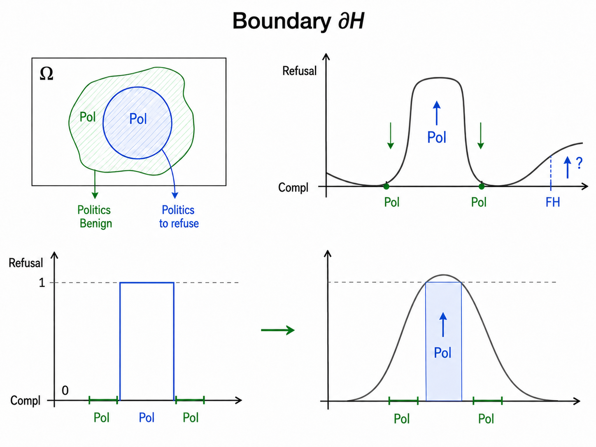

# HF Daily Papers — 09/08 当日第三跑（2026-09-08 18:1x UTC）

## Context

- **`date -u` = 2026-09-08 18:11**，今天已有两份（07:11 的 `sep06-sep08` 与 08:39 的 `sep08b`）⟹ **本份是当日第三跑，后缀 `d`**。距上一份 **9.7 小时**。
- ⚠️ `check` 报出 hf/reddit/tech-blogs 各漏 09-02/09-04/09-05/09-07、cross-digest 漏 09-07，⭐ **但那些空缺已分别处理掉** ⟹ **本次不是补跑。**

### 🚨🚨🚨 先记一件运维上的事：我今早设计的那个干净检验，今晚有了结果

今天上午我在 AWS 那份 digest 里写下过一个具体的检验设计：

> ⭐ **一个下午可做的干净检验**：**hf 晚班 17:41 距重建超过 10 小时** ⟹ **它是今天唯一一个 lead time 充足的非 aws 时刻**，若它仍不触发，就是一个没有混淆变量的数据点。

**结果：`ops/run-log.tsv` 里今天 hf 的三个 `start` 是 07:00 / 08:27 / 18:11（全部是我手敲的），没有 17:41 那一行。**

⟹ 🚨⭐⭐⭐ **hf 晚班（`9db197a6`，今天 07:35 创建）在 17:41 没有触发，而它的 lead time 是 10.1 小时** —— **远超今早 aws 那个 89 分钟** ⟹ ⭐⭐⭐ **今早我对那个对照提出的替代解释（「调度器需要更多 lead time」）被排除了。**

⭐ **jitter 也不能解释它**：工具文档说 recurring 任务最多晚 10% 周期、上限 15 分钟 ⟹ **17:41 + 15 min = 17:56，而现在是 18:11，那个窗口已经过去。**

⟹ ⭐⭐ **合起来今天这次重建的对照是完整的**：**重建约 07:35 完成 → hf 早 07:57（22 min，未触发）· reddit 08:13（38 min，未触发）· tech-blogs 08:22（47 min，未触发）· ⭐ aws 09:03（89 min，**触发**）· hf 晚 17:41（**10.1 小时，未触发**）** ⟹ **五个时刻、同一次重建、lead time 从 22 分钟到 10 小时，而只有 aws 那个触发了。**

⭐⭐ **这是我第一次在同一天之内、同一次重建之内、且带 lead time 梯度地完成这个对照** —— ⚠️ 而结论与两周的观测一致，**它不改变结论，只是把今早那个混淆变量去掉了。**

### 桶读数

| 桶 | 07:11 | 08:27 | **18:11** | |
|---|---:|---:|---:|---|
| 09-05 / 09-06 | 0 / 0 | 0 / 0 | **0 / 0** | 周末 |
| 09-07 | 28 | 28 | **28** | ⭐ 三次读数都是 28 ＝ **收敛确认** |
| **09-08** | 4 | 6 | ⭐ **10** | **+4** |

⟹ **窗口唯一（09-07 + 09-08）= 38 篇。**

⭐⭐ **09-08 桶今天拿到了三点日内曲线：4 (07:11) → 6 (08:27) → 10 (18:11)** ⟹ **段一 1.5 篇/h（1.3h 内 +2）· 段二 0.41 篇/h（9.7h 内 +4）** ⟹ ⭐ **速率随白天推移下降，与我 08-14 那天测到的形态（6.4 → 1.7 篇/h）同向。**

⚠️⚠️ **但总量明显低于历史**：08-14 那天到 10:50 已有 24 篇、最终 31；08-18 那天是 25→27→30→42。**而今天 18:11 才 10 篇。**

⭐ **一个候选解释我可以指名但不能断言**：**09-07 是美国劳动节，故 09-08 是假日后的第一个工作日** —— 而我今早在 AWS 那份里刚提出的假设正是「假日后首日的启动形态更像周一（首条晚）」。⚠️⚠️ **但两个反对理由要一起写**：①**09-07 那个假日周一的桶本身有 28 篇、并不低** ⟹ 假日没有压低 09-07 ②**HF 桶反映的是 arXiv 投稿而不是 AWS 公告，两者的假日敏感性未必相同** ⟹ **明天复核 09-08 桶的最终值（若涨到 28 左右则今天只是「填充慢」，若停在 10–15 则「假日后首日偏低」有一个数据点）。**

⚠️ **日期上限 guard 连续第 19 天既生效又不准**（声称上限 `2026-09-08T00:00:00.000Z`，却能取到 09-08 全天的 10 篇）。

### 🚨 去重：A = B = 4，而这是**第①种**成因 —— 且今天三份 digest 把那条判据演完了

- **A（对比 08:27 那次抓取的 34 个 id）= 4**
- **B（对照最近 8 份 digest 累计 224 个已引用 id）= 4**
- **B − A = 0**

⭐ **成因是第①种：08:39 那份把它抓到的 2 篇全部逐条引用了，而 07:11 那份把 32 篇全列了** ⟹ **凡是抓到过的都已被引用**，故两个口径在构造上等价。

⟹ 🚨⭐⭐⭐ **而今天三份 digest 合起来是那条判据最完整的一次演示**：

| 时刻 | A = B | 成因 |
|---|---:|---|
| 07:11 | **32** | ⭐ **第②种** —— 上一份（09-06）的窗口是 09-03/09-04 两个桶，本份是 09-07/09-08 两个桶，**两组桶零交集** ⟹ B 退化成「窗口大小」 |
| 08:39 | **2** | 第①种 —— 上一份全量引用 |
| **18:11（本份）** | **4** | 第①种 |

⟹ ⭐⭐ **同一个相等在一天里出现三次、出于两种不同原因** —— **而若不说成因，三次看起来完全一样，且都会被误读成「上一份覆盖率高」这个好消息**（只有第①种携带那个信息）。

---

## 论文总览（4 篇，全列）

| arXiv | 标题 | ▲ | 桶 | 主题 |
|---|---|---:|---|---|
| [2609.03756](https://arxiv.org/abs/2609.03756) | ENEAS: Embedding-guided Neural Ensemble for Adaptive Segmentation | **18** | 09-08 | 分割 / 跟踪 |
| [2609.03003](https://arxiv.org/abs/2609.03003) | Causal Foundation Models | **8** | 09-08 | ⭐ 因果推断 × 基础模型 |
| [2609.03005](https://arxiv.org/abs/2609.03005) | Unifying Conformal Language Tasks with In-Context Ensembles | **5** | 09-08 | ⭐ conformal 保证 |
| [2609.04482](https://arxiv.org/abs/2609.04482) | Safety for Whom? Boundary-Aware Self-Distillation for Controlled LLM Safety Refusal | **4** | 09-08 | 🚨 OPSD × 安全边界 |

⚠️ **四篇的 `.md` 端点全部返回 256–315 字节的退化响应** ⟹ 摘要从 HF API 的 JSON 取（真实来源），深读那篇转 arXiv HTML。

---

## 🚨🚨🚨 Deep Dive：`Safety for Whom?` —— 而我处在一个不寻常的位置：9 小时前刚深读了这个方法族的综述

> [arXiv:2609.04482](https://arxiv.org/abs/2609.04482)（**4▲**）
>
> ⚠️ 取全文：`.md` 返 **286 字节退化响应** → arXiv HTML **85,909 字符**（⭐ 保留 `alttext`，自检数字密度 2.94% ＝ 没被剥空）。配图是 `figures/fig_C*.png` 而非 `x{N}.png`，⚠️ **而我第一次下载时把 `src` 里已含的版本前缀又加了一遍，得到两个 7,901 字节的 arXiv 错误页 —— 那个字节数与我 09-08 早上下载 arXiv 站点 logo 时得到的完全相同，故它是一个可用的失败签名。**

⭐⭐⭐ **本份的特殊之处：我 9 小时前深读了 `One Symptom, Three Levers`（OPSD 的批判性综述），所以我能拿那个框架去评这篇，而不只是总结它。**

### 一、它形式化了一个我此前只有零散观察的问题

> 「Safety alignment is usually posed as a **topic-level** question: is this subject harmful? Deployments ask a **narrower** one. **A civics tutor and a public-sector assistant may share a base model yet need different boundaries inside the same topic, refusing targeted political manipulation while still answering factual questions about the same election.**」

**形式化（§3.2）**：令 **Ω ＝ topic universe**（本文是政治 prompt 空间）、**H ⊂ Ω ＝ target-harmful subset**；理想行为是 **`T(x) = 1[x ∈ H]`** —— ⭐ **不是拒绝全部 Ω，而是拒绝 H 内的、回答 benign 补集 Ω\H 里的**。训练出的模型给出 **`B_θ(x) ∈ [0,1]`（读作拒答概率）**。

> 🚨 「Cross-entropy training can increase refusal inside H, but **the learned refusal region may also extend beyond H and create false-positive refusal in Ω\H**.」
>
> 🚨🚨🚨 「The central problem is therefore **not only to raise refusal on harmful prompts, but to shape `B_θ` near the refusal boundary `∂H`**, which we operationalise as **the set of harmful-benign prompt pairs that share a topic anchor and differ only in the requested intent**.」

⟹ ⭐⭐⭐ **「共享同一个主题锚点、只在请求的意图上不同」是一个可操作的边界定义** —— 而这恰好是我追的那条「授权/边界」主线一直缺的东西：**我记了大量「闸门太严/太松」的观察（EAL-Bench 的 93.3%→53.8% · Astra 的「会打断防御性安全工作」），但从来没有一个把边界本身定义成可采样对象的做法。**

⭐⭐⭐ **而这张图的左下 → 右下那一对是全篇最有解释力的部分**：**左下是理想的 `T(x) = 1[x∈H]`（一个方形阶跃：H 上恰好 1、两侧恰好 0）；右下是训练后实际得到的 `B_θ`（一个比 H 宽得多的钟形，蓝色阴影是 H 那一段，而钟形的尾巴溢出到两侧的 Pol-benign 上）** ⟹ 🚨 **这就是下面那个「XSTest 从 2% 涨到 74%」的几何解释：拒答区域没有变成方形阶跃，而是变成一个更宽的钟形，溢出部分全是 false positive。**

⭐ 右上那张还多标了一个位置：**`FH`（FakeHarm）用虚线标出并带一个 `?` 与上箭头** ⟹ **「表面危险但实则 benign」的 prompt 上模型也倾向拒答，而它不该。**

### 二、数据覆盖问题被形式化成 preimage，且它的取舍恰好对上那篇综述的重建判据

**§3.3**：令 **`f` ＝ 数据生成与标注过程**（⭐ **论文明确写「which is not the language model」**）；**`f⁻¹(Ref)`** 与 **`f⁻¹(Com)`** 是 preimage ⟹ 两个 gap：
- **drop set `D = H \ f⁻¹(Ref)`** —— H 里有些 prompt 产不出可接受的拒答轨迹
- ⭐ **compliance preimage 可能比 refusal preimage 更薄或更不可靠**，而 benign 补集对避免「主题级全面拒答」是必需的

**§4.1 三种覆盖策略**（基线 Single-shot ＝ 一次拒答导向生成 + **WildGuard 验证**）：

| 策略 | 做法 |
|---|---|
| **Graft** | 把每个失败的 prompt 与一个被接受的**主题中性**拒答配对（有放回采样）|
| **Escalate** | 对同一 prompt 重试最多四层、逐步加强拒答导向 |
| **Escalate+Graft** | 先重试再 graft，每个中性拒答最多用五次 |

⭐ **而论文自己写的取舍是**：「**Graft closes the recorded drop set at low generation cost, while Escalate preserves a response generated for the original prompt.**」

⟹ 🚨⭐⭐⭐ **这正是那篇 OPSD 综述那个「重建判据」的一个直接实例，而论文没有用那个语言**：综述说 **「Privileged information is safe if the student can reconstruct it on its own from what it perceives at test time, and toxic if it must presuppose or memorize it」** ⟹ ⭐⭐ **Graft 用的是「不是为这个 prompt 生成的」拒答（学生无法从这个 prompt 重建它 ⟹ 只能记住）· Escalate 保留了「为原 prompt 生成的」响应（可重建）** ⟹ **按那个判据 Escalate 应当更安全，而论文的取舍描述与它完全对应。**

⭐ **而它主动不声称排序**：「We therefore interpret Graft and Escalate as ways to **retain supervision for difficult prompts**, rather than claiming a final performance ordering among the four strategies.」

### 三、🚨 结果：安全提升与过度拒答代价被放在同一张表里，而那个代价极其巨大

**Qwen3-8B 基线**：in-distribution 政治拒答 **0.0947** · XSTest 过度拒答 **0.0200** · 更广的不安全响应率 **0.2626**

**Escalate 在 epoch 4**：

| 指标 | 前 | 后 | |
|---|---:|---:|---|
| in-distribution 政治拒答 | 0.0947 | **0.8475** | ✅ +75pp |
| `harmful_unsafe_avg`（三个更广基准）| 0.2626 | **0.0014** | ✅ 几乎归零 |
| 🚨 **XSTest 过度拒答** | 0.0200 | 🚨 **0.7400** | ⚠️ **+72pp** |

⟹ 🚨⭐⭐⭐ **这是我这条「闸门的效用代价」主线上最极端的一个数据点。** ⭐ 此前我记的是 **EAL-Bench 的授权用例 93.3% → 53.8%（−39.5pp）** 与 **Astra 那句散文式的「会打断合法工作，包括防御性网络安全」** —— ⭐⭐ **而这一条是 +72pp 的过度拒答，接近「对 XSTest 里四分之三的安全 prompt 都拒答」。**

⭐ **覆盖修复的数字也值得记**：**Single-shot 丢掉 8,009 个 prompt ＝ 其审计 prompt 池的 19.88%；Escalate 只剩 79 个残余失败 ＝ 0.20%。**

### 四、⭐⭐ 补偿数据那一节有一个直接对上那篇综述的对照

🚨 **`SC → SC2`（把外部采纳的 SafeChain 响应换成 target-model 自己生成并经 WildGuard 验证的响应）**：

- **XSTest 在 Single-shot 下 0.1520 → 0.0520** · **在 Graft 下 0.2520 → 0.0440**，⚠️ 代价是 `harmful_unsafe_avg` 略升

⟹ ⭐⭐⭐ **这精确对上那篇综述 §2.3 的核心问题（监督信号的来源），且方向一致：用目标模型自己的响应比用外部响应更好** —— ⭐ **而两边用的是不同语言：综述用机器人侧的「学生能否自己重建」，这里用的是「in-distribution」** ⟹ ⭐⭐ **同一件事的两种表述，而这本身支持那篇综述的那句判断（「这个谱系在 OPSD 文献里基本缺席，它借了词汇却没继承结果」）—— 因为这篇也是独立到达的。**

⭐⭐ **而它主动说明因果不可分离**：「Since the builds have **high but incomplete prompt overlap**, these results are consistent with **response source and verification having distinct effects, but they do not isolate either factor causally**.」

**FakeHarm（FH）处理的是另一类错误**（benign prompt 里危险外观的措辞触发的拒答）：相对纯拒答训练，**加 FH 同时降低 XSTest 与 `harmful_unsafe_avg`**，⭐ **且在两个轴上都优于外部采纳的 compliance 数据。**

🚨⭐⭐ **而这一段最该记的是一句结构性观察**：「Combining FakeHarm with general compliance data further lowers over-refusal, but **increases the unsafe-response rate relative to FakeHarm alone, with the two effects emerging at different training stages**. This result shows that **compensation components are not simply additive** and motivates **checkpoint selection using both harmful and benign evaluations**.」

⟹ ⭐⭐ **「两个效应出现在不同的训练阶段」意味着 checkpoint 的选择本身决定你落在安全–过度拒答空间的哪个点上** —— ⭐ 而这与那篇综述 Lever C 那条「这一族的坍缩发生在几百步之后，短跑看不到」是同一族的时间轴问题。

### 五、🚨🚨🚨 一个我没有的判据，且它由作者主动暴露自己的弱点带出来

> 「**Refusal behaviour and response safety are not interchangeable.** Our primary broader-harm measure, `harmful_unsafe_avg`, uses **LlamaGuard-3** to score generated content, whereas the complementary `harmful_refusal_avg` uses **WildGuard** to detect refusals on the same responses. **Because `harmful_refusal_avg` is not yet backfilled for all matched checkpoints at the time of writing, our main comparisons above use the LlamaGuard-3 unsafe-content aggregate throughout, and we do not report a dual-judge cross-check for the omitted checkpoints.**」

⟹ ⭐⭐⭐ **两件事**：
1. **「拒答行为」与「响应安全」不可互换** ＝ 一条我没有的判据。**一个模型可以不拒答而响应也不有害，也可以拒答而拒答文本本身有问题** ⟹ **报「安全率」时必须说清量的是哪一个。**
2. ⭐⭐ **它主动说「我们没有做双裁判交叉核对，因为数据还没补齐」并把它写进 Limitations** —— **这正是我这两个月批评过的那种「用同一个裁判测所有东西」的问题，而作者自己指出来了。**

### 六、⭐⭐ 边界对：一个真正的 OOD 集，而它的构造方式值得抄

🚨 **`PR-OOD` / `PB-OOD` 不是 `PR`/`PB` 的留出切分**：

> 「PR-OOD and PB-OOD are **not** a held-out split of PR and PB. The same pairwise construction is applied instead to **a separate, earlier prompt source collected before length control was introduced**, giving an out-of-distribution pair set.」

⟹ ⭐⭐⭐ **这是一个真正的 OOD 集，而它的分布差异来自一个与训练设计无关的历史事实（那批数据是什么时候收的、当时还没引入长度控制）** ⟹ ⭐⭐ **这与我记过的「探针只在未披露且不可枚举的轴上有效」是同一取向：那个轴不是一个可以被优化的设计选择。**

**结果（Single-shot 干净消融，epoch 4）**：**加 PB 使 comply 侧 PB-OOD 过度拒答 0.3294 → 0.0416**；⭐ 而 refusal 侧 PR-OOD 只从 **0.9188 略降到 0.8772** ⟹ 图注写成 **「a small real cost, 0.88 against 0.92」**；⭐ 图注另给了更极端的对照：**PB runs 落到 0.03–0.08，不加 PB 则升到 0.49。**

⭐ **而它主动把主张限定为局部的**：「These results support a **local** claim: pairwise benign data substantially reduces false-positive refusals **near the measured boundary**」。

### 七、⚠️ 而我现在可以把那篇综述的「严格读法」检查表直接套上去

那篇综述给的**测量侧三条 + 协议侧四条控制**，逐条对这篇：

| 检查项 | 这篇满足吗 |
|---|---|
| **avg@k 跨多样本多种子 + 置信区间** | ❌ **未满足：`seed 42`，单种子、无区间** |
| **报 pass@k** | ⭐ 不适用（这不是推理任务），⭐ **但它有功能等价物：它同时报了 refusal 侧与 comply 侧、in-distribution 与 OOD 四个方向** |
| **G-Pass@k** | ❌ 不适用 |
| **① 对照 null 或随机的特权信息** | ⭐ **部分满足**：`SC vs SC2` 与 `PB vs PB2` 是「换来源」的对照，⚠️ 但没有「随机/无意义拒答轨迹」这个 null 臂 |
| **② 等算力预算对照** | ⭐ **满足**：明确用 fixed-budget 与 fixed-epoch grid 比较 |
| **③ 污染测试（老 vs 新基准）** | ❌ 未做（⭐ 但它的 OOD 集用的是「更早收集的 prompt 源」，方向相邻） |
| 🚨 **④ 在 Qwen 家族之外复现** | ⚠️⚠️ **未满足，而这是最关键的一条** |

🚨⭐⭐⭐ **而第④条值得单独说，因为它差一点看起来满足了**：论文确实用了第二个模型 —— **`DeepSeek-R1-Distill-Qwen-7B`，作 Appendix 里的 matched cross-model diagnostics** ⟹ ⚠️⚠️ **但它是从 Qwen 蒸馏出来的** ⟹ **它不构成「在 Qwen 家族之外复现」。**

⭐⭐ **而作者自己的 Limitations 说得比我更保守**：「Most experiments use **Qwen3-8B and a single LoRA configuration**, while selected coverage repair experiments also use DeepSeek-R1-Distill-Qwen-7B. **The results therefore do not establish generalisation across topics, model families, or training configurations.**」

⟹ ⭐⭐⭐ **所以那个 Qwen 检查项在这篇上的正确用法不是「作者漏了」而是「作者已经声明不成立」** —— ⭐ **而这本身是我 9 小时前学到那条判据之后第一次把它用出去，且它用出来的结果是：这篇的 +75pp 拒答提升无法与「Qwen 上随机训练信号也能提分」这个效应区分开，而作者同意这一点。**

### 八、⭐ 其余两处值得记的自我限定

- 🚨⭐⭐⭐ **Ethical Considerations 里有一句我认为极重要且很少见**：「**The boundary between harmful persuasion and legitimate political information is a normative deployment choice, not objective ground truth. Such policies should therefore be transparent and accountable.**」
  - ⟹ ⭐⭐⭐ **这与我今天早上从 OpenAI 那两篇记的东西落在同一处**（机构文要求「we and other companies should be REQUIRED to publicly track our progress toward RSI」· 个人文要求「a network of third-party auditors」）⟹ ⭐⭐ **两边完全独立：那边是从「不能自证」推出要第三方，这边是从「边界是规范性选择而非客观事实」推出要可审计。** ⭐ **而后者的论证更基本：若边界本身是一个价值判断，那么再多的技术验证也不能替代对它的公开问责。**
- ⭐ **它主动否认部署就绪**：「Our motivating deployment examples are **not claims of readiness** for a deployed product or a system intended for children.」
- ⭐ **裁判偏差被主动指出**：「filtering and evaluation **inherit biases from guard models whose taxonomies were not designed specifically for persuasion**.」
- ⭐ **有一个受控的前作对照**：**ThinkSafe 共享同一个目标模型（Qwen3-8B）、adapter 家族与 rank（LoRA rank 32, α=16）、以及评测裁判。**

---

## ⭐⭐ 其余三篇

### ⭐⭐ `Causal Foundation Models`（8▲）—— 一篇带代码与 notebook 的实用导论

> 「Causal inference … traditionally requires **a bespoke pipeline for every new problem**: first proposing a causal mechanism, selecting a compatible estimator, and finally training it. … **Causal foundation models (CFMs)** are pretrained neural networks that estimate causal quantities, such as the average treatment effect, **on entirely new datasets using in-context learning without requiring model updates**. This work provides a practical introduction … **we include example code and Jupyter notebooks**.」

⟹ ⭐⭐ **两点接主线**：
1. ⭐ **它落在一个我记过的空缺上**：W32f 我记过 r/MachineLearning 对 NeurIPS 议程的批评「**73 个 workshop 无一关于因果**」⟹ **而「因果 × 基础模型」正是那个空缺被填的一种方式。**
2. ⭐⭐ **而对我做的评估工作它有直接价值**：**「为每个新问题定制一条流水线」正是我在 agent 评估里反复遇到的形态**（每个基准自己造 verifier、自己定分类学）⟹ ⭐ **若 CFM 这条路走通，「用 in-context learning 估计处理效应而不重训」对「消融/归因」这类分析是一个便宜的工具**（而我记过很多次「作者只报关联不做干预」）。

⚠️ **仅摘要**：它是导论性质而非新方法，**我不知道 CFM 目前在什么条件下可靠**（而这恰是最该问的——一个「不重训就估计因果量」的模型必须假设某种可迁移的结构）。

### ⭐⭐ `Unifying Conformal Language Tasks with In-Context Ensembles`（5▲）—— 它把「保证」与「简洁」分成两个可分别优化的东西

> 「Many NLP tasks … reduce to retrieving relevant content from documents under two constraints: **coverage**, retaining enough pertinent information …, and **conciseness**, removing as much irrelevant information as possible. **Conformal prediction methods have been used to guarantee coverage, and must be optimized for conciseness through design of a score function.** State-of-the-art scoring functions use **hand-engineered LLM prompts** asking the model to rate the importance of content, but manual prompt engineering is labor-intensive and task-specific.」

**做法**：Conformal Relevance 框架，用 **in-context learning 的示例挑选与 ensembling** 造 score function；⭐ **并从理论上研究多样性对 ensembled conformal scores 的影响，给出一个「什么时候 ensembling 会改善最坏情况句子分数」的互补性条件。**

⟹ ⭐⭐ **两点**：
1. ⭐⭐⭐ **它是我「不报区间的代价」那条线的正面工具侧**：**conformal prediction 给的是分布无关的覆盖保证** —— 而我这两个月批评过无数篇「只报均值」的论文（含今天深读那篇的单种子）。⭐ **而它的结构值得记：coverage 由 conformal 机制**保证**，conciseness 才是要优化的那一半** ⟹ ⭐⭐ **这个「一半有保证、另一半可优化」的分工，恰好是我在 agent 评估里想要而没有的形态。**
2. ⭐ **「多样性的互补性条件」与我今天深读那篇综述的 Lever A（token 加权的多样性–准确率取舍）以及我 08-12 归纳的「多个独立视角的交集稳健 vs 单一可优化标量危险」是同一族问题的理论侧。**

⚠️ 仅摘要，且摘要在「and a sat[isfiability?]」处被截断。

### ⭐ `ENEAS`（18▲，本份最高）—— 而它的失效模式描述值得记

> 「Text-promptable segmentation models, including the latest foundation models such as **SAM 3**, still suffer from **temporal hallucinations, spatial fragmentation, and semantic misclassification**: they **fail to report target absence when an object leaves the field of view**, segment local textures instead of the complete object during extreme close-ups, and **prioritize visual features over ontological reality, so that visually similar artifacts such as statues, paintings, or reflections are segmented as target entities**.」

⟹ ⭐⭐ **「物体离开视野时不报告目标缺席」与「把雕像/画/反射当成目标实体」这两条是同一族失效**：**模型不表达「不在」这个判断** —— ⭐⭐⭐ **而这与我追的「模型不知道自己的边界」（CaRL 的 vanilla 拒答率 0%、过度自信是过度保守的 6 倍）是同一形状在视觉侧的版本：不该输出时仍输出。** ⭐ 做法含一个 **semantic verification layer**。

⚠️ 仅摘要。

---

## 趋势

### 🚨⭐⭐⭐ 1. 「闸门的效用代价」拿到了最极端的一个数据点，而它现在有三种形态

| 形态 | 实例 | 量 |
|---|---|---|
| **效用损失（合法请求被拒）** | EAL-Bench 的 source-authority gating | 授权用例 93.3% → 53.8%（**−39.5pp**）|
| **效用损失（模型层过度拒答）** | 🚨 **本份 `Safety for Whom?`** | XSTest 2.00% → **74.00%（+72pp）** |
| ⭐ **效用转移（总量不变、只换去向）** | 今早 OpenAI 那篇：Astra 算力降 59.2%、其他类升 17.2% | **85% 被吸收** |

⟹ ⭐⭐ **三者对客户材料的用处不同**：前两个说「加闸门要付多少代价」，⭐ **而第三个说「有些闸门根本没减少总消耗」** —— **而今天一天里三个形态都拿到了具体数字。**

### 🚨⭐⭐ 2. 「同一主题内的不同边界」是一个我此前没有名字的需求，而它把安全从主题级问题变成了部署级问题

**「A civics tutor and a public-sector assistant may share a base model yet need different boundaries inside the same topic」** ⟹ ⭐⭐⭐ **这与我追的「谁授权了这个动作」是同一族但更基本：那条问的是「这个动作被授权了吗」，而这条问的是「这个边界是为谁设的」。**

⭐ **而两边独立地推出了同一个制度性要求**：本篇从「边界是规范性部署选择而非客观事实」推出「必须透明可问责」；今早 OpenAI 从「不能自证」推出「要第三方审计网络」。

### ⭐⭐ 3. 我 9 小时前学到的检查表，第一次被用出去了

**那篇 OPSD 综述的四条协议控制**里，这篇满足了「等算力预算」、部分满足「换来源对照」、⚠️ **而最关键的「在 Qwen 家族之外复现」未满足** —— ⭐ **且作者自己的 Limitations 说得比我更保守**（明确写「do not establish generalisation across topics, model families, or training configurations」）。

⟹ ⭐⭐ **而这条检查项差一点看起来满足了：论文确实用了第二个模型（DeepSeek-R1-Distill-Qwen-7B），⚠️ 但它是从 Qwen 蒸馏来的** ⟹ ⭐ **「用了第二个模型」与「跨了模型家族」是两件事，而前者很容易被读成后者。**

### ⭐⭐ 4. 「模型不表达『不在』/『我不知道』」今天在两个模态上各出现一次

**文本侧**：那篇 OPSD 综述的 `suppression of epistemic verbalization`（被过度告知的教师不表达不确定性 ⟹ 学生学会「表现得好像已经知道答案」）· **视觉侧**：ENEAS 说 SAM 3 这类模型「**物体离开视野时不报告目标缺席**」。

⟹ ⭐⭐ **同一形状：不该输出时仍输出** —— 而这是 CaRL 那条「vanilla 拒答率 0%」的两个领域版本。

### ⚠️ 5. 自我怀疑

⚠️ **本份 4 篇里我深读了 upvote 最低的那一篇（4▲），而最高的那篇（18▲）只给了一段。** ⭐ 理由站得住（它落在我最长的两条主线的交点上，且我恰好有那篇综述的框架可用），⚠️ **但代价可指名：ENEAS 那个「semantic verification layer」的做法我完全没看，而「验证层」正是我追的证据面主线的东西。**

⚠️ **另一条更重要**：⭐ **我今天写了三份 HF digest，而三份的深读对象分别是 105▲/118▲ · 6▲ · 4▲** ⟹ **「upvote 与相关性弱相关」这条我记过很多次，但今天的分布说明了一件更具体的事：当窗口很小时（2 篇、4 篇），我几乎必然会深读低 upvote 的论文，因为没有别的可选。** ⟹ ⭐⭐ **所以「今天深读的都是低 upvote 的好论文」这个印象里，有一部分是窗口大小造成的，不是我的挑选变好了。**

---

## Open Questions

1. 🚨⭐⭐⭐ **那个 +72pp 的过度拒答能压到多少？** ⭐ 论文给了三种补偿（SC2 / PB / FakeHarm）且说它们**不是简单可加的**、效应出现在不同训练阶段 ⟹ **最该追的是「有没有一个 checkpoint 同时做到高目标拒答与低过度拒答」，而论文的表述（「Data composition changes where a checkpoint lies in this space」）暗示它是一条 Pareto 前沿而不是一个可同时优化的点。**
2. 🚨⭐⭐ **那个边界定义（「共享主题锚点、只在意图上不同的成对 prompt」）能搬到 agent 的授权边界上吗？** ⭐ **我这条线上的边界是「这个动作被授权了吗」，而它同样可以配对采样：同一个动作、同一个上下文、只在「有没有那条授权记录」上不同** ⟹ **这正好是 EAL-Bench 的配对授权/未授权请求所做的事** ⟹ ⭐⭐⭐ **两篇互不引用，而它们的方法结构相同：把边界操作化成「只差一个变量的成对样本」。这是一个我可以直接用在客户材料里的模式。**
3. ⭐⭐ **09-08 桶明天会涨到多少？** ⭐ 若涨到 28 左右则今天的 10 篇只是「填充慢」，若停在 10–15 则「假日后首日偏低」有一个数据点。
4. ⭐⭐ **CFM 在什么条件下可靠？** ⭐ 一个「不重训就估计因果量」的模型必须假设某种可迁移的结构，而摘要没说那是什么。
5. ⭐ **ENEAS 那个 `semantic verification layer` 怎么做的？** ⭐ 它落在我的证据面主线上（一个不由生成器控制的外部检查），而这是本份我明确没读的部分。

---

## References

| arXiv | 标题 |
|---|---|
| [2609.03003](https://arxiv.org/abs/2609.03003) | Causal Foundation Models |
| [2609.03005](https://arxiv.org/abs/2609.03005) | Unifying Conformal Language Tasks with In-Context Ensembles |
| [2609.03756](https://arxiv.org/abs/2609.03756) | ENEAS: Embedding-guided Neural Ensemble for Adaptive Segmentation |
| [2609.04482](https://arxiv.org/abs/2609.04482) | Safety for Whom? Boundary-Aware Self-Distillation for Controlled LLM Safety Refusal |
