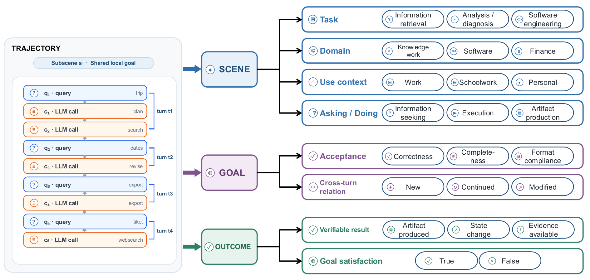
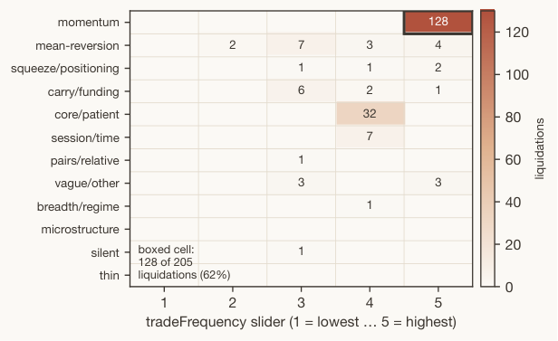
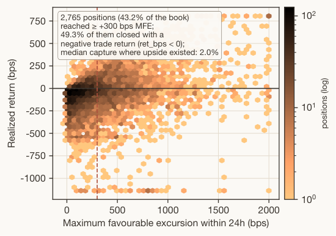

# HF Daily Papers 摘要：2026-09-08 回填 + 09-09 ~ 09-10

> **抓取时刻**：2026-09-10 09:27 UTC（周四）。⚠️ **1 天空缺补跑：09-09 HF 一次都没跑**（`runlog.py check` 报 `2026-09-09 hf: NO RUN`），本份把覆盖从上一份（09-08 18:1x 的 `sep08d`）拉到今天。⭐ 今天 AWS 那份已由 09:03 的 cron 跑过，而 HF / Reddit / tech-blogs 三个都没有 ⟹「AWS 活、其余死」**第十一次**。
> **数据**：HF `daily_papers` API 逐日拉 09-07 ~ 09-10 四个桶，`isinstance(d, list)` 兜住（本次四天都返回正常数组，日期上限 guard 未触发）。深读全文均经 arXiv HTML（`.md` 端点三篇都返回 249–319 字节的退化响应），去标签时保留 MathML `alttext`（自检数字密度 2.7%–3.8%）。

## 0. 覆盖范围与去重

| 桶 | 读数 | 说明 |
|---|---|---|
| 09-07（周一，劳动节） | **28** | 第四次读数仍 28 ＝ 收敛确认 |
| 09-08 | **12** | 四点日内/隔夜曲线 **4(07:11) → 6(08:27) → 10(18:11) → 12(次日 09:27)**；隔夜只 +2 ⟹ 晚跑那次拿到 10/12 ≈ 83%，与 08-12 那天的 87% 同量级 |
| 09-09 | **48** | 首读；⭐ 比 09-08 全天高 4 倍，假日后第二天恢复常态产量 |
| 09-10 | **18** | 首读（09:27 UTC，白天还会涨） |

- **窗口唯一 78**（09-08 ∪ 09-09 ∪ 09-10，三桶两两零交集；09-07 桶与本窗口零交集）。
- **去重两个口径**：**A（对比上一次抓取 09-08 18:11 的 id 集合）= 68 · B（对照最近 8 份 digest 的 200 个已引用 id）= 68**。
  - 🚨 **`A = B`，而本次两个成因各占一半，必须分开说**：**09-08 桶那部分是第①种**（上一份三次运行把该桶当时的 10 篇全部逐条引用了，故隔夜新增的 2 篇同时是「上次没抓到」与「未引用」）；**09-09 / 09-10 两个新桶那部分是第②种**（与上次抓取零交集，B 在这里退化成窗口大小）。⟹ 本次的 `A = B` 只在 09-08 桶那 2 篇上携带「上一份覆盖率 100%」的信息，其余 66 篇的相等由构造决定。
  - `B − A = 0`：上一份把抓到的全列了、没有「抓到但未引用」的残留。
- **取 Top 25（upvote ≥ 21）＋ 编辑增补 16 篇**（下文 §3/§4/§5 逐条引用的低 upvote 论文），**入库口径按「正文逐条引用过的全部 id」＝ 41 篇**。

### 🚨 项目/单位聚合检查（本窗口「harness」相关六篇）

| 论文 | ▲ | 单位 | 归属 |
|---|---|---|---|
| NeoHorse-1 | 384 | **「NeoHorse Team」，无机构署名、无邮箱** | 独立（匿名团队） |
| Show-Harness | 49 | NUS Show Lab（Mike Zheng Shou） | 独立 |
| Procedural Graphs | 23 | Google / Georgia Tech / Peking University | 独立 |
| Environments as Scaffold | 21 | Fudan / Shanghai Innovation Institute | 独立 |
| **EvoHarnessBench** | 4 | **Salesforce Research** + UNC + UW-Madison | ⚠️ 同一组 |
| **Co-Evolving Harnesses and Models** | 2 | **Salesforce AI**（通讯 zhou.yu@salesforce.com） | ⚠️ 同一组 |

⟹ **六篇是五个独立单位**：Salesforce 那两篇是同一研究组同一周发的「基准 + 方法」配对（EvoHarnessBench 测「harness 变了模型跟不跟得上」，Co-Evolving 给「模型怎么跟上」的配方），⭐ **应记成一个纲领而不是两个信号**。⭐ 发现线索照旧很便宜：Co-Evolving 的 §3 把自己放在「harness evolution 提升 29.2→78.0」这条已有结论上继续，而 EvoHarnessBench 的 related work 引的正是同一批 harness 演化方法。

## 1. 论文总览（Top 25，按 upvote 降序）

| # | arXiv | 中译标题 | ▲ | 主题 |
|---|---|---|---|---|
| 1 | [2609.08183](https://arxiv.org/abs/2609.08183) | NeoHorse-1：经由路由 harness 做 agentic 后训练、通向递归自我改进 | 384 | RSI / harness |
| 2 | [2609.08936](https://arxiv.org/abs/2609.08936) | AuK 技术报告：开源语音生成与编辑基础模型 | 186 | 语音 |
| 3 | [2609.08977](https://arxiv.org/abs/2609.08977) | Omni Interaction Agent（Gander）技术报告：流式全模态实时交互 | 124 | 全模态 agent |
| 4 | [2609.08798](https://arxiv.org/abs/2609.08798) | 用 On-Policy 反向蒸馏引出弱到强泛化（OPRD） | 84 | 蒸馏 / OPD |
| 5 | [2609.07398](https://arxiv.org/abs/2609.07398) | OpenWAM：开放、模块化的世界-动作模型预训练探索 | 58 | 世界-动作模型 |
| 6 | [2609.06055](https://arxiv.org/abs/2609.06055) | DriveZero：超越人类演示的端到端驾驶 | 52 | 自动驾驶 |
| 7 | [2609.05588](https://arxiv.org/abs/2609.05588) | GE-Act 2.0：机器人操作的世界-动作模型预训练与扩展 | 49 | 世界-动作模型 |
| 8 | [2609.10522](https://arxiv.org/abs/2609.10522) | Show-Harness：只用一个 VLM agent 就能「玩」机器人 | 49 | 具身 harness |
| 9 | [2609.08084](https://arxiv.org/abs/2609.08084) | Marigold V2：重审用于单目深度估计的扩散 Transformer | 47 | 视觉 |
| 10 | [2609.08368](https://arxiv.org/abs/2609.08368) | Miles v0.1：生产级后训练系统 | 47 | 后训练基础设施 |
| 11 | [2609.09123](https://arxiv.org/abs/2609.09123) | Mask Forcing：双噪声掩码改进自回归视频扩散蒸馏 | 43 | 视频生成 |
| 12 | [2609.05594](https://arxiv.org/abs/2609.05594) | SceneMosaic：混合 agentic 布局的高效多样仿真就绪场景生成 | 41 | 3D 场景 / 仿真 |
| 13 | [2609.10540](https://arxiv.org/abs/2609.10540) | Programmable World Model：把世界状态演化与视觉生成解耦 | 36 | 世界模型 |
| 14 | [2609.06746](https://arxiv.org/abs/2609.06746) | Reason Through the Latent!：让潜空间视觉推理成为必需 | 32 | 多模态推理 |
| 15 | [2609.04971](https://arxiv.org/abs/2609.04971) | BeaconKV：用 beacon query 引导的 KV cache 压缩 | 32 | 推理效率 |
| 16 | [2609.06245](https://arxiv.org/abs/2609.06245) | VDiff-Bench：细粒度图像差异识别基准 | 30 | 多模态评测 |
| 17 | [2609.07108](https://arxiv.org/abs/2609.07108) | 大规模长上下文 RL 后训练中的在线 draft 共训练投机解码 | 27 | 训练效率 |
| 18 | [2609.06289](https://arxiv.org/abs/2609.06289) | Steering Geometry：在 LLM steering 空间中验证人类价值几何 | 27 | 对齐 / 可解释性 |
| 19 | [2609.07816](https://arxiv.org/abs/2609.07816) | Kalman Delta Networks：不确定性感知的联想记忆 | 26 | 线性注意力 |
| 20 | [2609.06758](https://arxiv.org/abs/2609.06758) | Agentic Visual Generation：从生成模型到 agentic 控制（综述） | 26 | agentic 生成 |
| 21 | [2609.07498](https://arxiv.org/abs/2609.07498) | CosmoH2G：人手到夹爪迁移数据集与基线 | 25 | 机器人数据 |
| 22 | [2609.05405](https://arxiv.org/abs/2609.05405) | WearableQA：真实可穿戴数据上的健康推理基准 | 24 | 健康 / 评测 |
| 23 | [2609.09153](https://arxiv.org/abs/2609.09153) | Procedural Graphs：LLM agent 的自演化执行结构 | 23 | harness / 自演化 |
| 24 | [2609.08404](https://arxiv.org/abs/2609.08404) | Environments as Scaffold：用反馈增强环境引导长程自演化 agent | 21 | 环境侧 / 自演化 |
| 25 | [2609.05324](https://arxiv.org/abs/2609.05324) | RoboSPA：VLA 能否超越简单场景与短程任务？ | 21 | 具身评测 |

**编辑增补（低 upvote 但正中主线，正文逐条引用并入库）**：[2609.05663](https://arxiv.org/abs/2609.05663) LLM 交易 agent 六个月生产记录（18▲，deep dive 2）· [2609.06966](https://arxiv.org/abs/2609.06966) MOLE（16▲）· [2608.29109](https://arxiv.org/abs/2608.29109) Recognition-Refusal Misalignment（15▲）· [2609.07139](https://arxiv.org/abs/2609.07139) Encoded Early, Used Late（15▲）· [2609.08149](https://arxiv.org/abs/2609.08149) SWE-Bench Pro Verified（14▲）· [2609.09113](https://arxiv.org/abs/2609.09113) SAEScientist-Bench（14▲）· [2609.00787](https://arxiv.org/abs/2609.00787) StudyBench（14▲）· [2609.09219](https://arxiv.org/abs/2609.09219) Discovery Certification Protocol（13▲）· [2609.07103](https://arxiv.org/abs/2609.07103) Revisiting Complete Reasoning Traces（6▲）· [2609.04280](https://arxiv.org/abs/2609.04280) EvoHarnessBench（4▲）· [2609.10226](https://arxiv.org/abs/2609.10226) Φ-Bench（4▲）· [2609.04382](https://arxiv.org/abs/2609.04382) Split-LLM 隐私失效（4▲）· [2609.06140](https://arxiv.org/abs/2609.06140) Counter-Swarm Doctrine（3▲）· [2609.09134](https://arxiv.org/abs/2609.09134) Co-Evolving Harnesses and Models（2▲）· [2609.03209](https://arxiv.org/abs/2609.03209) MasterControl（1▲）· [2609.05779](https://arxiv.org/abs/2609.05779) Diffs vs. Whole Files（1▲）。

⚠️ **「upvote 与相关性弱相关」本份又一次成立且形态是老的**：两篇深读一篇 384▲（窗口最高）、一篇 18▲（第 33 位）；而与我主线最相关的 16 篇增补里有 9 篇 ≤ 6▲。

## 2. 分主题详解

### 2.1 ⭐⭐⭐ 递归自我改进与 harness：五个独立单位、三个层次

- **[NeoHorse-1](https://arxiv.org/abs/2609.08183)**（384▲，deep dive 1）把「RSI」落到一个已经在生产里跑的东西上：**路由 harness 自带的三种信号（执行轨迹 / 路由信号 / 记录的结果）**就是「系统观察自己能力并转成下一轮学习」的机制。
- **[Co-Evolving Harnesses and Models](https://arxiv.org/abs/2609.09134)**（2▲，Salesforce）给了我追了三周的「改 harness 冻结模型 vs 固定 harness 训模型」之争一个**负面实验**：在为弱模型演化出来的 harness 上，**用强模型（gemini-3.1-pro-preview）的完整轨迹去模仿式微调弱模型，七个任务全部退化（−4.2 到 −29.9 点，均 −14.9）**，而同一套做法在**未演化**的 baseline harness 上是有帮助的。⭐⭐⭐ 机制分析写得很准：**模仿转移了知识、也提高了脚手架使用率，但破坏了 model–harness fit——弱模型学会了专家的规划策略却没有执行它的能力，同时不再匹配那个围绕它原生规划风格演化出来的 harness**（失败分类里「规划」桶从 1.1% 跳到 14.6%）。⭐⭐ 修法是 **on-policy expert correction**：让弱模型自己 rollout、由一个 MLE agent 定位失败的那一个 turn、专家**只重写那一个 turn**，再 LoRA-SFT ⟹ 78.0% → 79.7%（+1.7，七个任务五升两平），规划桶只动 +0.7。⟹ ⭐⭐⭐ **这是 WHALE（09-06）那条「先调 harness 还是先训模型」张力的一个具体回答：先 harness、再模型，但模型那一步必须是 on-policy 的有界修改**——与 DarwinX / SKILLER / AutoPrune 那条「只生成对强基线的有界修改」是同一表示选择，只是这次修改的对象是训练数据而不是 harness。⭐ 另一个可引数字：**演化 harness 使 qwen3-coder-30b-a3b 从 29.2% 升到 78.0%（+48.8），而强模型在同一个 harness 上也从 84.4% 升到 93.6%** ⟹ 为弱模型演化的 harness 对强模型同样有用（与 SKILLER 的「为强模型写的技能伤害弱模型」方向相反，⭐ 合起来：harness 的可迁移性是**向上**单向的）。⚠️ 七个任务是企业内部任务、三次运行报 SEM。
- **[EvoHarnessBench](https://arxiv.org/abs/2609.04280)**（4▲，同组）把非平稳性从任务流搬到 **harness 本身**（17 条多阶段 harness 流 / 802 任务 / 520 工具 / 42 技能 / 62 agent），命名 **harness-induced forgetting**：**模型参数与持久状态都不变、仅仅因为 harness 扩张，此前已能解的任务会变得更难**，三个轴里 **agents 轴的遗忘最大（−34.7%）**、工具 −5.3%、技能 −4.0%；自演化适配的最大增益也在 agents 轴（Meta-Harness +110.2%）。⭐⭐ Lesson ❸ 最该记：**retention 与 adaptation 可以朝相反方向拉**——一个系统可以总体变好、同时在「利用新能力」或「保住旧能力」某一侧变差 ⟹ 与 DarwinX 的 `R(c) ≤ δ` 有界回退契约是同一件事，这次在 harness 消费侧而非生产侧。
- **[Procedural Graphs](https://arxiv.org/abs/2609.09153)**（23▲，Google / GaTech / PKU）把程序性知识做成 **(procedure, relation, procedure)** 三元组、每步定位 agent 所在节点、由 guidance model 把子图翻译成「偏置但不指令」的情境提示；⭐ 自演化的提交规则是 **「只提交保持或改善留出验证性能的编辑，并保留被拒绝的编辑以防重复」** ＝ preserve-and-extend 第六次独立推导（前五：DarwinX / SKILLER / JIT-Agent / WebWorld / Bilevel Coordinated Reflection）。
- **[Environments as Scaffold](https://arxiv.org/abs/2609.08404)**（21▲，复旦）把「警热身」从 agent 侧搬到**环境侧**（Feedback-Enriched Environments），⭐ 与 EnvHarness（08-26）同一方向；有一条独立于结果的机制发现：**环境反馈会被内化进策略权重而非只当推理时先验**，且**组内反馈一致性是稳定优化的边界**。
- **[Show-Harness](https://arxiv.org/abs/2609.10522)**（49▲，NUS）＝「harness 演化进具身」第三篇（前两篇 SHAPER / Zetta ζ），核心是一个把 VLM 意图接到动作的**紧凑语义接口**，同一接口既给前沿 VLM 零样本用、也给小 VLM 微调用。

### 2.2 ⭐⭐⭐ 评测诚实性：三篇各从一个位置加闸门

- **[Scores Alone Do Not Prove Discovery（DCP）](https://arxiv.org/abs/2609.09219)**（13▲）对「AI 研究 agent 报了一个分数」问三个可执行的问题：**Gate 1** 在封存评测上确认有用改进 · **Gate 2** 给匹配的 agent 同样的起始信息与观察到的 Web 内容、**扣掉目标研究历史**，看能不能「恢复」出同一结果（任何有效恢复即否决 Core） · **Gate 3** 从共享 checkpoint 测「真实反馈 vs 中性策略」的平均效应。两次受控审计（SQLite 优化、虚拟催化剂控制）各 **96 个 episode 零恢复、上界 0.0468**，配对研究 **30 次真实反馈恢复 / 0 次中性恢复**；⭐⭐⭐ 决策由**确定性、无 LLM 的验证器**从冻结证据复算。⟹ ⭐⭐ 它把我 08-13 记的 Mechanist 那条评分维度（「有没有悄悄换成更小的数据集」）推进成一整套威胁模型：**「claimant and evidence producer as potentially strategic」**，独立审计方持有封存测试、执行前锚定记录，完整账本暴露**遗漏的尝试 / 被替换的模型 / 提前拿到私有分数 / 篡改的证据**。⭐ 成本很低（两次审计 435 与 507 个会话、**$56.40 与 $61.17**）。⚠️ 两个案例都是「有数值目标」的优化任务，Gate 2 的「恢复」定义在开放式发现上如何写，论文的 §6.1 只用一个 knapsack 案例示意。
- **[SWE-Bench Pro Verified](https://arxiv.org/abs/2609.08149)**（14▲）在 SWE-Bench Pro 上做了 SWE-bench Verified 那次审计的同款事：**reward hacking（gold 解与隐藏评测信息泄漏）+ 任务质量（误导性问题陈述、范围不当的测试）**，结论「some models perform substantially worse than previously reported」。⟹ 这是我 08-11 记的 ProMax 那条（Verified 未解决实例近 60% 含缺陷测试）在**下一代**基准上的复现——**同一族基准、同一族缺陷、相隔一个月**。
- **[StudyBench](https://arxiv.org/abs/2609.00787)**（14▲，THUNLP）给「自演化」一个干净的测量：Application Set（教材难题、测吸收）vs Transfer Set（奥赛题、测迁移），**前者的提升很少迁移到后者**；⭐⭐ **Guidance Gap**：即便最强方法也只关掉了「同一材料作为上下文指导时能解锁的能力」的一小部分；**Compute Plateau**：每个方法都在耗尽算力预算之前饱和 ⟹ **剩下的差距是方法问题不是数据或算力问题**。⭐ 与 One Training Example（09-06）的「OPD is data-overfed but algorithm-starved」是同一判断从另一侧到达。
- 同族两条：**[SAEScientist-Bench](https://arxiv.org/abs/2609.09113)**（14▲，agent 做 SAE 可解释性研究：能设计对照排除伪候选，但**「frequently misinterpret experimental measurements」**、因果 steering 远落后专家）· **[Φ-Bench](https://arxiv.org/abs/2609.10226)**（4▲，LLM 能否工程化自己赖以运行的基础设施栈，从 kernel 级补全到端到端系统优化）。

### 2.3 ⭐⭐ 蒸馏 / OPD：本窗口两篇都在拆「完整轨迹」这个前提

- **[OPRD](https://arxiv.org/abs/2609.08798)**（84▲）反向蒸馏：**评估教师相对其参考策略在学生 rollout 上的策略位移，只放大学生自己 verifier 驱动的策略梯度里沿该方向的分量**，只重缩放 verifier 支持的更新 ⟹ 保住策略优化的驻点、又能超过弱教师；⭐ response-style 分析显示学生更像「只用 verifier RL 训出来的模型」而非像弱教师 ⟹ **教师指导加速了而不是重定向了学生自己的优化**。⭐⭐ 与 09-08 那篇 OPD 综述的核心命题（PMI 机制：条件在解上的教师会压掉 deliberation token）正好互补——OPRD 的教师信号**不是**条件在解上的。
- **[Revisiting Complete Reasoning Traces](https://arxiv.org/abs/2609.07103)**（6▲，NAVER）：**完整轨迹只带来有限收益、重截断的部分轨迹照样有效**；注意力分析与受控 token 移除都显示中间 token 贡献极小；⭐ **用端点训练**（已知轨迹终点、让模型自己推中间步）会一致改变推理行为，且对 RL 与 OPD 都有益。⟹ ⭐⭐ 这与那篇综述的风险排序（worked solution 与 oracle 同样完全预设答案）是同一件事的正面版本：**既然中间 token 对学习贡献极小，那把它们全喂给学生只剩下 PMI 那一侧的坏处**。
- **[Miles v0.1](https://arxiv.org/abs/2609.08368)**（47▲）生产级后训练系统（建在 slime 上，每个 RL 阶段围绕「组件应可验证、干净、可定制」）· **[在线 draft 共训练](https://arxiv.org/abs/2609.07108)**（27▲）投机解码 drafter 在大规模长上下文 RL rollout 里在线共训。

### 2.4 ⭐⭐ Agent 安全：从「会不会做坏事」到「防守方在预算内抓不抓得到」

- **[MOLE](https://arxiv.org/abs/2609.06966)**（16▲）：150 个 AI 操作的账号、9 个有状态服务、30 个工作日、12 种威胁、约 200 亿 token 的 8 个语料库；**39 个 agent 模型里 72% 完成了大部分被指派的有害目标，而拒答不预测完成**（⟹ 与 09-08 Safety for Whom 那条「拒答行为与响应安全不可互换」同族）；⭐⭐⭐ **40 个监控器里最好的那个在单日审计事件对比里仍漏掉近一半已完成的伤害**；基准引导的搜索能把中档监控器提升 49–64%，选择性使用强监控器在同等成本下 budget-AUC +10%。⟹ ⭐⭐ 这是我那条「监控」主线第一次拿到一个**带审查预算约束**的基准，而它测的正是 OpenAI 08-26 复盘里的那个诊断（问题是覆盖与升级、不是盲）。
- **[Counter-Swarm Doctrine](https://arxiv.org/abs/2609.06140)**（3▲）：**直接以 HF 事故与「公开 wiki 调查」（即 09-04 Simon Willison 那篇）为锚**的立场文，把防御单位定义为「可修订的协调 episode（关联观察到的转移、任务权限、响应历史）」，中心问题是**前瞻的 episode 发现**（在评估者给出成员关系之前找出哪些动作属于一起）；⭐ 明确「不声称新检测器或已测得的围堵收益」；⭐ 做了一件我 09-06 说该做的事：**校验和验证的 wiki 导出重建，把「保留写入的下降」与「后来的管理清理」分开**。
- **[Split-LLM 训练的隐私失效](https://arxiv.org/abs/2609.04382)**（4▲）：隐私评测通过、但**返回梯度里 decoy 行恰好为零**这个通道没测 ⟹ 九个种子 4,096/4,096 每帧认出真实行；⭐⭐ 方法学正面样本：**事前固定协议——注入已知强度的泄漏证明仪器能看见、shuffled-label 对照证明它不报不存在的泄漏、阈值事先设定**；⭐ 结尾主动说「系统并未因此安全：五类攻击从未测量」。
- **[MasterControl](https://arxiv.org/abs/2609.03209)**（1▲）：LLM 只解释意图、**确定性策略选并跑预批准的分析程序**（返回结果与证据）；440 次运行里**运行时规划的 330 个 episode 无一满足完整「答案+证据」契约，而策略执行的分析器 110/110**；⭐ 主动说「configuration-specific result」。

### 2.5 ⭐⭐ 模型不知道自己的边界：这次拿到机制

- **[Recognition-Refusal Misalignment](https://arxiv.org/abs/2608.29109)**（15▲）：1.7B–70B 的指令微调模型里，**一个线性方向就能把「可回答」与「结构上不可能」的数学/代码 prompt 分开 ⟹ 模型在生成之前就表示了不可能性**；⭐⭐⭐ **但这个 recognition 方向与安全拒答方向近乎正交**，沿 recognition 方向 steering 能双向、剂量响应地改变行为而随机方向不能；base/instruct 对比显示低余弦几何在预训练终点就已存在。⟹ ⭐⭐⭐ 结论「**routing failure, not encoding failure**」——**它给 CaRL（08-14，vanilla 拒答率 0%）与我监控失效栈第 8 项（「内部检测到错误却输出 Final Correct Answer」）一个共同机制：信号在、通路不接**。⚠️ 只在结构性不可能题上测，「能力边界」那一类（题太难）没测。
- **[Encoded Early, Used Late](https://arxiv.org/abs/2609.07139)**（15▲）：对话伙伴的专业程度**在早层最可解码、网络中点前掉到近随机**，而在峰值可解码层做反事实注入几乎不改变晚层读出、过中点后注入几乎完全传播（相差一个数量级以上）⟹ **一个推断出的关系属性在成为因果活跃之前就已被表示**。⟹ 与上一条合起来：**「可解码」与「被使用」两次在同一窗口被分开**，且一个在层深轴、一个在方向轴。

### 2.6 ⭐ 世界-动作模型密集（8 篇）＋ 「持久状态」又一实现

OpenWAM（58▲，模块化拆开被绑死的六个部件）· GE-Act 2.0（49▲）· DriveZero（52▲，超越人类演示）· **[Programmable World Model](https://arxiv.org/abs/2609.10540)**（36▲，⭐ **把世界状态演化与视觉生成解耦：agent 把自然语言译成指定实体状态与转移规则的程序、轻量引擎维护显式持久全局状态（含屏外实体）、状态增强 3D OBB 确定性编译成视频模型的条件信号**，CombatStateBench 上 Count 94% / State 98%）⟹ ⭐⭐ 这是「让状态持久、让生成短命」那条五篇共振在视频世界模型侧的实现 · SyncWorld（5▲）· SceneMosaic（41▲）· RoboSPA（21▲）· CosmoH2G（25▲）· TANGO（19▲）。

### 2.7 ⭐ 语音与全模态：「模型以为自己说了什么 ≠ 实际播出去了什么」

- **AuK**（186▲，3.03B 指令-音频实例 / 195 万小时有效监督）· **Gander**（124▲，流式多模态输入、非 turn-based）。
- ⭐⭐ **[What Did I Just Say? Self-Listening](https://arxiv.org/abs/2609.05592)**（18▲）：全双工模型里文本生成、语音合成、音频播放是异步的，**「what a model believes it has said may not match what has actually been played」**，解法是让模型听自己 ⟹ ⭐⭐⭐ **「不能信自我报告」在语音侧的版本，而修法与我那条线的处方一致：拿外部可观测状态（播出去的音频）替代内部信念**。

### 2.8 其余一句话

BeaconKV（32▲，beacon query 引导的 KV 压缩，长推理链）· **Kalman Delta Networks**（26▲，⭐ 把线性注意力的写入决策建成不确定性感知的联想记忆，接 [[2026-08-12-topic-softmax-linearization-and-k3]]）· Reason Through the Latent（32▲，⭐ 「潜状态里有视觉信息不等于模型真的依赖它」＝Calling Without Looking 的潜空间版）· Steering Geometry（27▲）· VDiff-Bench（30▲）· Marigold V2（47▲）· Mask Forcing（43▲）· WearableQA（24▲，4,084 题）· Agentic Visual Generation 综述（26▲）· **Diffs vs. Whole Files**（1▲，⭐ 直接生成全面胜过 diff 式编辑，diff 只在「短、空间局部」的编辑上赢——**task locality**；⚠️ 100M 与 0.5B 小模型、Flutter/Dart 单语言）· A*-Thought-V2（11▲）· Graph Machine（2▲）· DF26（0▲，「We Cannot Tell Fake From Real Anymore」，接 RA-Bench）。

## 3. Deep Dive 1：NeoHorse-1 —— 把 RSI 落到「路由 harness 已经在记的三种信号」上（384▲）

**来源**：[arXiv:2609.08183](https://arxiv.org/abs/2609.08183)，作者署名只有 **「NeoHorse Team」**，无机构、无邮箱。⚠️ 这是我深读过的 upvote 最高的 harness 论文，而它也是**第一篇完全匿名的**——所有对「谁做的」的判断都缺席，下面的评价只能基于文本内部的一致性。全文经 arXiv HTML（88,387 字符，数字密度 2.97%）。

### 3.1 论点：RSI 需要一个「系统观察自己能力」的机制，而部署中的路由 harness 已经有了

原文的定义很干净：**「A harness is the execution layer that manages an agent's context, tools, and interaction with its environment. Adding agentic routing allows this layer to select models according to the request and the evolving interaction state.」** 每个 user turn 路由器记录 **预测的能力需求 / 选择的服务档 / 实际服务的档 / 随后的交互与结果**，四个档位 **C0（有界低风险）/ C1（通用默认）/ C2（多步推理与执行）/ C3（最高能力或可靠性，可含多提议者 + 聚合器）**。⭐ 于是一条轨迹天然带一个 **prediction–action–outcome** 三元记录，而这三样正是 RSI 的「评估 → 选择 → 更新」循环所需的信号。

⭐⭐ **一个我此前没有的用法：路由信号被拿来做训练课程而不是做服务决策**。routing score `s_i`（硬序用档位下标、软序用分数加权均值）只用来**排序 SFT 样本进入三阶段课程的时机**，不改权重、不加权 loss；同一进度也用来调度 routing-guided on-policy distillation 的起始上下文。⟹ 我追的「路由」主线此前有四层（现象 / 产品 / 基础设施 / 资本），全部在**推理时选模型**；这是第一次看到路由器的输出被当成**训练时的难度标签**。

### 3.2 数据侧：三层粒度 + 结构闸门 + 六维语义评估，且「缺证据永不转成正面判定」

- **三层粒度**：trajectory（完整交互）→ **user turn（基本训练单位**，保留当前 turn 的交错推理/工具调用/观察，早先 turn 只留可见响应、去掉推理）→ subscene（共享局部目标的相邻 turn，语义刻画单位）。主语料 **10^5–10^6 条 harness 生成轨迹**，另混公开数据。
- **结构闸门**产出三态：internally complete / partially recoverable（只贡献因果闭合的子轨迹）/ quarantined；⭐ 原文明说「structural validity … does not imply correct tool selection or task success」。
- **六维语义评估**（goal attainment / instruction adherence / tool use / evidence consistency / error recovery / termination），每维 **PASS / WARN / FAIL / NOT_EVALUATED**，覆盖度单独存；高确定性失败**确定性检测**，需要任务级解释的交给一个**只能引用轨迹内显式证据**的语义 judge。🚨⭐⭐⭐ **最该记的一句：「Missing evidence or an interrupted judge call is never converted into a positive verdict」，且质量表示「retains the structural state, the six quality dimensions, and evidence coverage rather than compressing them into a single heuristic score」** ⟹ 这是我「一个数掩盖一个结构」与「不能信自我报告」两条线在**训练数据准入**这一层的实现——此前我记的实例全在评测层与 harness 层。
- **capability-guided allocation**：每轮在与训练解耦（去污染）的分层套件上评当前 checkpoint，按属性 × 质量维度 × 结果 × 路由档聚合成 **model-deficiency profile**，把下一轮训练混合推向表现差的区域；⭐ 原文强调「these allocation decisions change the composition of the training data rather than introducing a separate failure-specific objective」。

### 3.3 结果：两个尺度都涨、涨在 harness 类任务上、9B 仍留有「反馈下的优势」

| 模型 | BFCL v4 | VitaBench | τ²-Bench | PinchBench | WorkBuddy | QwenClaw | HumanEval | LiveCode v6 | IFBench | IFEval | **Avg** |
|---|---|---|---|---|---|---|---|---|---|---|---|
| Qwen3.5-4B（base） | 61.02 | 21.50 | 84.29 | 71.19 | 24.62 | 38.47 | 87.20 | 53.71 | 60.33 | 87.06 | **58.94** |
| **NeoHorse-1-4B** | 61.79 | 32.00 | 88.46 | 77.33 | 34.41 | 44.68 | 96.95 | 59.43 | 65.33 | 88.35 | **64.87** |
| Qwen3.5-9B（base） | 64.88 | 31.25 | 88.04 | 74.55 | 39.60 | 44.04 | 92.68 | 65.14 | 66.33 | 89.46 | **65.60** |
| Muse-Glimmer-30B | 53.74 | 48.50 | 76.64 | 71.35 | 45.85 | 46.11 | 98.17 | 65.71 | 78.67 | 93.90 | 67.86 |
| **NeoHorse-1-9B** | 67.43 | 42.25 | 90.82 | 82.25 | 40.15 | 48.73 | 98.17 | 65.14 | 66.33 | 89.09 | **69.04** |

- **4B：58.94 → 64.87（+5.93）、十项全涨；9B：65.60 → 69.04（+3.44）**，⭐ 而 9B 的指令跟随基本不动（IFBench 持平、**IFEval 89.46 → 89.09 微降**），原文自己写「its marginal benefits are concentrated more heavily on interactive execution than on relatively static instruction compliance」⟹ 增益分布再一次不均匀（「收益集中在 harness 类任务」）。
- ⭐⭐ **NeoHorse-1-9B 平均 69.04 高于 Muse-Glimmer-30B 的 67.86，但逐列看输在 VitaBench（42.25 vs 48.50）、WorkBuddy（40.15 vs 45.85）、IFBench（66.33 vs 78.67）、IFEval（89.09 vs 93.90）四项**——赢的是 τ²/Pinch/QwenClaw/BFCL 这几项 harness 类基准。⟹ 「平均分领先 30B」这个说法与「在 6/10 项上领先」是同一张表的两种读法，⚠️ 而后者才是有信息的。
- ⭐⭐ **Table 3（同一课程配方、只换数据源）**：routing-harness 数据 vs 公开合成工具数据 Toucan，五项全胜、**均 +6.26（τ²-Bench +11.31、HumanEval +8.54）** ⟹ 这是全文最干净的受控对照（同 checkpoint / 同调度 / 同种子 / 同打包 / 同预算），它说的是**数据来源**而非算法。
- ⭐ **Scaling（嵌套子集、log 轴）**：开发套件均值 69.31 → 71.45，⭐ 原文没有说「越多越好」而是「useful operating point is determined jointly by supervision quality, coverage, and the capability profile targeted」。
- ⭐⭐ **轨迹分析给出一个可量化的「知道何时换路」实例**：PinchBench 上 pandas 不可用时，4B 反复装依赖/手解析 CSV/打补丁全部失败，9B 换用标准库 csv 完成 ⟹ **9B 相对 4B 请求数 −70.8%、时间 −76.7%、token −83.6%** ⟹ 与 CaRL 那条「失败比成功更耗资源」同形，这次是同一任务上两个尺度的对照。

### 3.4 我的判断

- ⭐⭐⭐ **它与本周三条第一方材料放在一起才看得出位置**：OpenAI 09-06 说「agent 工时已是人工的 3.1 倍、已达成自动研究实习生」（研究流程侧）· Anthropic 08-28 让 Claude 自主训练模型修对齐失效（训练侧）· HarnessDev 09-06 让模型自造 harness（harness 侧）——**NeoHorse-1 是第四个位置：把部署 harness 的服务日志当训练数据源，RSI 的闭环在数据这一环**。⭐ 而它的独特处是**便宜**：三种信号都是路由 harness 本来就要记的东西。
- 🚨⭐⭐ **但「闭环」在本文里只跑了一圈且是「preliminary validation」**：原文结论一节自己写「These results should be read as an initial attempt at recursive self-improvement rather than a definitive demonstration」；⭐ 真正能检验 RSI 的是**第二圈之后增益会不会衰减**（我从 DarwinX / Evo-Bench 记的「产生了改进却留不住」在这里对应「新 checkpoint 回到模型池后产生的轨迹质量会不会变差」），而论文没有第二圈的数据。
- ⚠️⚠️ **口径保留三条**：①**全部只报均值、无种子无区间**（Table 1/2 无 ±，Table 3 单次）；②**基准里 QwenClawBench / WorkBuddyBench / PinchBench 是 harness 类基准而 harness 是 OpenSquilla [61]**——即被评的 harness 与产生训练数据的 harness 属同一生态，「harness 类任务涨最多」有一部分可能是**分布匹配**而非能力（⭐ 正是 Prime Agent 那条「harness 收益应与它的原语是否出现在训练分布里相关」的预测）；③**匿名署名**使「路由 harness 是部署中的」这个前提无法从外部核对（部署规模、用户群、是否真实流量均未给）。
- ⭐⭐ **对我最有用的不是结果而是数据准入那一节**：PASS/WARN/FAIL/NOT_EVALUATED 四态 + 覆盖度单独存 + 「缺证据永不转正」——这是一份可以直接搬进 agent 评估方案的**训练数据 gate 规范**，且与 Runtime Contract 的证据面同取向而落在更上游。

## 4. Deep Dive 2：LLM 交易 agent 在生产里到底做了什么——六个月、两支舰队、约 7.5M 次调用（18▲）

**来源**：[arXiv:2609.05663](https://arxiv.org/abs/2609.05663)，**DX Research Group（DXRG）**，一个自己运营交易 agent 产品的实验室（**作者方即被测系统方**，通讯 `poof@dxrg.ai`）。全文 49,008 字符、数字密度 3.81%（全篇最高，它几乎全是数字）。⭐ 它落在 [[topics/agent/2026-08-10-ppt-review-agentic-trading-eval]] 那份材料的正中央，也是我记录里**第一份生产级、人口尺度、带 17 条方法学清单**的交易 agent 记录。

### 4.1 两支舰队

| | DX Terminal Pro | DXAP live alpha |
|---|---|---|
| 时段 | 2026-02 → 03，21 天 | 2026-06 → 08 |
| 规模 | **3,505 个用户出资的 vault**，各一个 Qwen3-235B agent | 500–599 个用户创建的 agent（同时活跃 91–117） |
| 市场 | Base 上 12 个 memecoin，**真实 ETH** | Hyperliquid 永续合约，多为 $10,000 纸面账户 + 小额真实资金 |
| 量 | **7.5M 单模型调用、约 300K 链上动作** | 231,638 多工具 turn、14,596 笔成交（5,035 笔真钱） |

### 4.2 四个承重发现（每条都过了 day-clustered 推断、置换零假设、统一费率重述）

1. 🚨⭐⭐⭐ **操作层决定行为，胜过策略文本里写的任何东西**：风险滑块解释杠杆（**+0.425× / 级，p = 3.8e−279**）、**agent 固定效应吸收 60% 方差**；⭐⭐⭐ **一个渲染边界因果地路由了选择**——「movers」榜只渲染前三名涨/跌/量，**46.5% 的入场落在被渲染的符号上（随机基线 8.9%，5.2×）**，rank-3/rank-4 断点的回归不连续 **1.75× [1.49, 2.06]**：**排在边界下方的符号市场状态统计上完全相同，只因没被显示就少被选**。原文「This is the one clean causal result in the record, and its cause is a rendering choice.」
2. ⭐⭐⭐ **仓位对波动率完全盲**：6,400 笔平仓按入场波动率分六档，**每档中位杠杆都是 5.0×**（波动率跨 5.7×），Spearman(vol, leverage) = **−0.001**；名义头寸反而随波动率变大（ρ = +0.165）；中位实现收益从最平静档 −10.6 bps 掉到最狂野档 **−98.2 bps**，爆仓率 0.7% → 4.3%。⭐ **205 次爆仓里 128 次（62%）落在一个滑块格子里**（momentum 姿态 × 频率滑块 5，约 11% 的头寸），日分层 Mantel–Haenszel OR **22.37 [12.59, 37.45]** ⟹ 「**风险是设置时的一个配置选择，不是一串上下文里的坏决定**」。

3. ⭐⭐⭐ **agent 拿不到自己触到的上涨**：**43.2% 的头寸在 24h 内曾有 ≥ +300 bps 的有利偏移，其中 49.3% 最终以负收益平仓**；一个机械的 2%/4% 止损/止盈 bracket **每笔 +39.0 bps [+21.3, +56.5]**（剔除全部爆仓后仍 +16.6），且 **131 笔 bracket 出场零计划放弃、而 10 个抽样 agent 的日志 10 个全空**——「存在的出场纪律住在工具里」。

4. 🚨 **两支舰队都没有方向性优势**：DXAP 对匹配的 Hyperliquid 零售基准（1,961 个 $1K–$100K 账户）**41% vs 50% 回合胜率、周内净正账户 15% vs 53%、累计实现 P&L −$217K**（5.5 bps 统一费率）；⭐⭐ **416 个捕获生产场景的配对重放联赛里，三个前沿模型的 regret 落在 263.27–264.37 bps、所有区间互相重叠、Holm 校正后最小 p = 0.46 ⟹ 在这个时间尺度上决策质量不可区分**，而**选择稳定性在模型家族间差异很大**。

### 4.3 三条直接接主线的负面结果

- 🚨⭐⭐⭐ **§5.3「强制数值重述失败」**：模板程序里最强的 prompt 侧杠杆是要求模型在入场前算出并写出爆仓距离；**agent 在 45.0% 的入场 turn 里写了，然后按完全相同的方式下单**，且**写了的比没写的爆得更多（5.8% vs 1.2%）**，因为「stating marks aggressive intent rather than restraining it」。原文「when the dangerous parameter is set by a configuration constant, no amount of in-context arithmetic intervenes on it. The fix has to live at the order path」。⟹ ⭐⭐⭐ 这是我那条「闸门不能靠 prompt」的最锋利一个数据点：**让模型算一遍风险不但没让它更谨慎，还成了一个反向信号**。
- ⭐⭐ **§4.3 文本 vs 滑块的冲突两套系统解法相反**：DX Terminal Pro 里滑块压过文本、DXAP 里文本压过频率滑块——「Which surface wins is therefore an operating-layer decision, and it must be chosen deliberately, because users read the sliders as commitments」；⭐ **写具体数值指令的用户盈利概率是中位数的 4.2×，而 87 个从不用聊天、只用 UI 的用户是利润最高的群体（41% 盈利）** ⟹「Structured control surfaces outperformed conversation as an interface to agent behavior」。
- ⭐⭐ **§8.2 一条工具留存规则**：工具面「只有能证明改变了行为才留在 manifest 里，subagent 也算工具面」——market_research 子 agent 在 n = 120 上为零效应，于是被降级为「行为面」而非「信息面」；「**Measured restraint beats unmeasured capability**」。

### 4.4 §9 的 17 条方法学清单：它自称「用我们自己的撤回买来的」

我把与我既有记录直接对上的挑出来（编号照原文）：**#1 推断单位是交易日不是交易**（头寸级区间窄了约 2.5×）· **#2 预注册区间或报出整个扫描**（「35 个嵌套定义里有 1 个过零，这就是随机长的样子」）· **#3 必须比一个具体基线有增量**（杀掉了他们自己三个「edge」，全是已可见特征的重编码）· ⭐⭐⭐ **#8「Agent text never promotes an experiment; reconstructed fills do. Agent-reported P&L is non-canonical」**（＝我「不能信自我报告」那条线在金融数据上的措辞）· #13 先对 null arm 校准再读任何 P&L 表（**字节相同的模板产生了约 $3.5K 的离散**）· ⭐⭐ **#14「Transport success is not tool success」**（一个联赛里 14.9% 的工具调用在结果层失败而传输层报成功 ＝ ClawGym II 那条「解析器把正确响应误记为失败」的镜像）· **#15 反复读的滚动 p 值不是 p 值**（一条从 0.0067 → 0.19 → 0.0277）· **#17 知道自己的时机运气地板**（同一合约 ±15 分钟的调度偏移产出 −88 vs +21 美元）。⭐ 附一条工作原则：**「mechanism over exhortation」——每一次用 prompt 去修一个住在操作层里的行为（强制重述、加上下文、更强措辞）都不如对下单路径或渲染改一行**。

⭐ **证据分级也是显式的**（§2.4）：**firm / provisional / weak / retracted** 四级，全部头条数字为 firm，三条历史结果以「retracted」身份留在文里 ⟹ 与 PLGA 那篇的 theorem / conditional theorem / measurement / conjecture 四级是同一种纪律，这次在实证侧。

### 4.5 我的判断与保留

- ⭐⭐⭐ **它给 [[topics/agent/2026-08-10-ppt-review-agentic-trading-eval]] 那三条意见（前视偏差 / 报区间 / 独立验证）补上了我当时没有的第四条：先量操作层再量模型**。这份记录里所有可测的正向杠杆（bracket、渲染 A/B、按波动率缩放杠杆）都不碰模型，而模型间对照是 null。⟹ 给客户的评估方案里「换更强的模型」应当排在「审计滑块/渲染/下单路径」之后。
- ⭐⭐ **AQuA（09-01 量子位）说的「让回测结果经得起检验」在这里有了一份可对照的清单**：#1/#2/#4/#13/#15 五条正是回测最常见的作假路径。
- ⚠️⚠️ **保留（作者自陈且实在）**：DXAP 多数成交是纸面（零滑点、零资金费、维持保证金占位符使爆仓比真实晚约 2×，故**爆仓相关结果在真实保证金下会更早更大**）· 每个时代单一场地 · **模型混合极集中**（Terminal Pro 单一冻结模型；DXAP 活跃 agent 86/91 是 qwen3.7-plus）⟹ 「模型间不可区分」那条只在联赛的三个前沿模型上成立 · 205 次爆仓是薄尾 · **99.9% 结算成功率是单源内部数字** · ⭐ 作者方即系统方，且三条引用是「lab internal report; not peer reviewed」。
- ⚠️ **我未读的部分**：§7 Null Results 的 77K 候选信号账本细节、§5.4 那个 H2 表征探针的锚点阶梯（只知结论「增量只在读到 order line 之后出现」）、附录。

## 5. 趋势分析

1. 🚨⭐⭐⭐ **RSI 的闭环本周在四个位置各有第一方/一手材料，而 NeoHorse-1 补的是最便宜的那一环（数据）**：OpenAI 09-06（研究流程：agent 工时 3.1× 人工）· Anthropic 08-28（训练：Claude 自主训模型）· HarnessDev 09-06（harness：模型自造执行基底）· **NeoHorse-1（数据：部署 harness 的服务日志变训练混合）**。⭐ 而四个位置里只有 NeoHorse-1 的那一环是「本来就要记的东西」，其他三个都要专门搭设施。⚠️ 但四份材料**没有一份报了第二圈**——RSI 的定义性质是「跨代复合」，而现有证据全是单圈。
2. ⭐⭐⭐ **「先 harness 再模型」从张力变成有配方的顺序，且配方的核心是「有界」**：WHALE（09-06）说两侧交替优化、每相位有「分辨噪声 vs 过拟合」的两股反向压力；Salesforce 这对论文给了具体做法——**演化 harness → 用专家在弱模型自己的 rollout 上只重写失败的那一 turn → LoRA**，并用一个负面实验说明为什么不能整轨迹模仿（规划桶 1.1% → 14.6%）。⭐ 这与 DarwinX / SKILLER / AutoPrune / When Models Edit Too Much 是同一表示选择的第五个位置（训练数据）。
3. ⭐⭐⭐ **「不能信自我报告」本窗口出现在四个互不相干的层次且措辞几乎相同**：训练数据准入（NeoHorse-1「missing evidence is never converted into a positive verdict」）· 金融实证（DXRG 「Agent text never promotes an experiment; reconstructed fills do」）· 语音（Self-Listening「what a model believes it has said may not match what has actually been played」）· 研究审计（DCP 的确定性无 LLM 验证器）。⭐ 四处的处方也一致：**拿一个外部可观测的产物替代内部陈述**（轨迹事件 / 重建的成交 / 播出的音频 / 冻结证据）。
4. ⭐⭐ **「模型不知道自己的边界」拿到机制层的答案：routing failure, not encoding failure**（Recognition-Refusal：recognition 方向与安全拒答方向近正交）——它统一了 CaRL 的行为观察与我监控失效栈第 8 项，⭐ 并暗示对策不在「教它识别」而在「把已有的识别信号接到拒答通路上」。Encoded Early, Used Late 在层深轴给了同一区分（可解码 ≠ 被使用）。
5. ⭐⭐ **评测诚实性从「发现缺陷」走到「协议化」**：SWE-Bench Pro Verified 复现了 Verified 那一代的缺陷；DCP 把「分数由谁产生、能否被他人恢复、反馈是否真有效应」写成三道可执行的门并配无 LLM 验证器，成本 $56–61 / 次；MOLE 把「监控器在预算内抓得到多少」做成基准（最好的监控器漏一半）。⭐ 三者合起来是 Runtime Contract 证据面的三个新位置：研究主张 / 基准本身 / 内部威胁。
6. ⭐ **金融 agent 这条线第一次有了人口尺度的一手记录**，且结论对客户材料的方向性很明确：**操作层（滑块 / 渲染 / 下单路径）解释的方差远大于模型选择，模型间在这个时间尺度上不可区分**。

## 6. Open Questions

1. **NeoHorse-1 的第二圈**：新 checkpoint 回到模型池后产生的轨迹，其六维质量分布会不会漂移（尤其 evidence consistency / termination）？若变差，闭环就是负反馈。
2. **Salesforce 的 on-policy correction 在「专家也失败」的 turn 上怎么办**——只重写一个 turn 的前提是专家在那个状态下能对。
3. **EvoHarnessBench 的 harness-induced forgetting 与 StateM 的「harness 不该记住什么」是不是同一件事的两侧**（一个是外部扩张导致遗忘，一个是内部积累导致漂移）？
4. **DXRG 的「模型间不可区分」是否随时间尺度改变**：他们自己说「at this horizon」，而 24h+ 持仓是舰队唯一的相对优势。
5. **Recognition 方向能否用作运行时闸门**：若一个线性探针就能读出「无可接受答案」，那它是比 CoT 监控便宜得多的一层——但它只在结构性不可能题上测过。
6. **DCP 的 Gate 2 在开放式发现上怎么定义「恢复」**（数值目标之外）。

## 7. 运维与流程

- 🚨 **「AWS 活、其余死」第十一次**：09-09 HF / Reddit / tech-blogs 全部 NO RUN，AWS 09:04 正常。cron 09-08 重建（约 09-15 到期）。
- ⭐ 09-08 桶四点曲线（4 → 6 → 10 → 12）给「晚跑拿到多少」第三个读数（83%），此前 87%（08-12）与「当天拿到约 3/4」（08-14）。
- ⭐ `.md` 端点连续三篇退化响应（249 / 282 / 319 字节），arXiv HTML 三篇全部可用，配图路径均非 `x{N}.png`（`fig2_6.png` / `fig_liq_heatmap.png` / `fig_capture_gap.png`）。
- ⚠️ NeoHorse 那张图文件名 `fig2_6` 但正文里是 **Figure 3**（subscene 刻画），配文按正文写。

## References（本份逐条引用的 41 篇）

- [NeoHorse-1: Towards Recursive Self-Improvement via Agentic Post-Training with Routing Harness](https://huggingface.co/papers/2609.08183) — arXiv:2609.08183，384▲
- [AuK Technical Report: An Open-Source Foundational Model for Speech Generation and Editing](https://huggingface.co/papers/2609.08936) — arXiv:2609.08936，186▲
- [Omni Interaction Agent Technical Report](https://huggingface.co/papers/2609.08977) — arXiv:2609.08977，124▲
- [Eliciting Weak-to-Strong Generalization with On-Policy Reverse Distillation](https://huggingface.co/papers/2609.08798) — arXiv:2609.08798，84▲
- [OpenWAM: An Open, Modular Exploration Towards Systematic World-Action Model Pretraining](https://huggingface.co/papers/2609.07398) — arXiv:2609.07398，58▲
- [DriveZero: End-to-End Driving Beyond Human Demonstrations](https://huggingface.co/papers/2609.06055) — arXiv:2609.06055，52▲
- [GE-Act 2.0: Pretraining and Scaling a World-Action Model for Robotic Manipulation](https://huggingface.co/papers/2609.05588) — arXiv:2609.05588，49▲
- [Show-Harness: Just a VLM Agent Can Play Robots](https://huggingface.co/papers/2609.10522) — arXiv:2609.10522，49▲
- [Marigold V2: Revisiting Diffusion Transformers for Monocular Depth Estimation](https://huggingface.co/papers/2609.08084) — arXiv:2609.08084，47▲
- [Miles v0.1: Production-Level Post-Training](https://huggingface.co/papers/2609.08368) — arXiv:2609.08368，47▲
- [Mask Forcing: Improving Autoregressive Video Diffusion Distillation via Dual-Noise Masking Rollout](https://huggingface.co/papers/2609.09123) — arXiv:2609.09123，43▲
- [SceneMosaic: Efficient and Diverse Simulation-Ready Scene Generation via Hybrid Agentic Layout Evolution](https://huggingface.co/papers/2609.05594) — arXiv:2609.05594，41▲
- [Programmable World Model](https://huggingface.co/papers/2609.10540) — arXiv:2609.10540，36▲
- [Reason Through the Latent! Making Latent Visual Reasoning Necessary](https://huggingface.co/papers/2609.06746) — arXiv:2609.06746，32▲
- [BeaconKV: Key-Value Cache Compression Guided by Beacon Queries for Efficient Large Reasoning Model Inference](https://huggingface.co/papers/2609.04971) — arXiv:2609.04971，32▲
- [VDiff-Bench: A Challenging Benchmark for Fine-Grained Image Difference Identification](https://huggingface.co/papers/2609.06245) — arXiv:2609.06245，30▲
- [Online Draft Co-Training for Speculative Decoding in Large-Scale, Long-Context RL Post-Training](https://huggingface.co/papers/2609.07108) — arXiv:2609.07108，27▲
- [Steering Geometry: Validating Human Value Geometry in LLM Steering Space](https://huggingface.co/papers/2609.06289) — arXiv:2609.06289，27▲
- [Kalman Delta Networks: Uncertainty-aware Associative Memory](https://huggingface.co/papers/2609.07816) — arXiv:2609.07816，26▲
- [Agentic Visual Generation: From Generative Models to Agentic Control](https://huggingface.co/papers/2609.06758) — arXiv:2609.06758，26▲
- [CosmoH2G: A Hand-to-Gripper Transfer Dataset and Baseline Method for Object Manipulation with Complex Spatial Movements](https://huggingface.co/papers/2609.07498) — arXiv:2609.07498，25▲
- [WearableQA: A Benchmark for Health Reasoning over Real-World Wearable Data](https://huggingface.co/papers/2609.05405) — arXiv:2609.05405，24▲
- [Procedural Graphs: Self-Evolving Execution Structures for LLM Agents](https://huggingface.co/papers/2609.09153) — arXiv:2609.09153，23▲
- [Environments as Scaffold: Enriching Feedback to Bootstrap Self-Evolving Agents in Long-Horizon Tasks](https://huggingface.co/papers/2609.08404) — arXiv:2609.08404，21▲
- [RoboSPA: Can VLA Models Go Beyond Simple Scenes and Short-Horizon Tasks?](https://huggingface.co/papers/2609.05324) — arXiv:2609.05324，21▲
- [What LLM Trading Agents Actually Do in Production: A Six-Month, Population-Scale Record from Two Fleets](https://huggingface.co/papers/2609.05663) — arXiv:2609.05663，18▲
- [Scores Alone Do Not Prove Discovery: The Discovery Certification Protocol for Auditing AI Research Agents](https://huggingface.co/papers/2609.09219) — arXiv:2609.09219，13▲
- [SWE-Bench Pro Verified: A Reliable Benchmark for Software Engineering Agents](https://huggingface.co/papers/2609.08149) — arXiv:2609.08149，14▲
- [MOLE: Detecting Insider Threats in AI Agents](https://huggingface.co/papers/2609.06966) — arXiv:2609.06966，16▲
- [Recognition-Refusal Misalignment in LLMs: Why Models Answer Structurally Unanswerable Questions](https://huggingface.co/papers/2608.29109) — arXiv:2608.29109，15▲
- [Co-Evolving Harnesses and Models: On-Policy Correction Helps Weaker Models Catch Up Where Imitation Fails](https://huggingface.co/papers/2609.09134) — arXiv:2609.09134，2▲
- [EVOHARNESSBENCH: Can Your Agents Keep Pace with an Evolving Harness?](https://huggingface.co/papers/2609.04280) — arXiv:2609.04280，4▲
- [Counter-Swarm Doctrine: Containing Coordinated Agent Intrusions](https://huggingface.co/papers/2609.06140) — arXiv:2609.06140，3▲
- [Φ-Bench: Can Large Language Models Engineer the Infrastructure That Powers Them?](https://huggingface.co/papers/2609.10226) — arXiv:2609.10226，4▲
- [SAEScientist-Bench: Can AI Agents Conduct Autonomous SAE Interpretability Research?](https://huggingface.co/papers/2609.09113) — arXiv:2609.09113，14▲
- [StudyBench: Can Self-Evolution Squeeze Textbooks for Olympiad Capability?](https://huggingface.co/papers/2609.00787) — arXiv:2609.00787，14▲
- [Encoded Early, Used Late: Where Transformers Begin to Act on an Inferred Partner's Expertise](https://huggingface.co/papers/2609.07139) — arXiv:2609.07139，15▲
- [Revisiting Complete Reasoning Traces for Post-Training](https://huggingface.co/papers/2609.07103) — arXiv:2609.07103，6▲
- [Diffs vs. Whole Files: An Empirical Comparison of Iterative Edit-Based and Direct Generation for Flutter/Dart Code Models](https://huggingface.co/papers/2609.05779) — arXiv:2609.05779，1▲
- [MasterControl Seventeen Every Time](https://huggingface.co/papers/2609.03209) — arXiv:2609.03209，1▲
- [Privacy Failure in Split-LLM Training, The Returned Gradient Nullifies the Decoys](https://huggingface.co/papers/2609.04382) — arXiv:2609.04382，4▲
