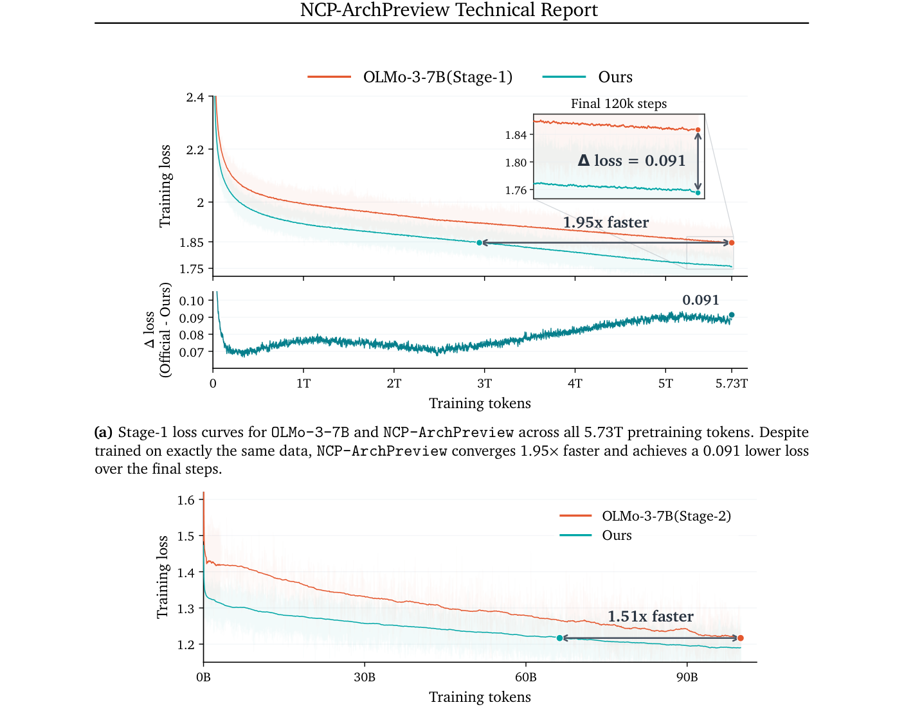

# HF Daily Papers — 09/10 回填 + 09/11 ~ 09/15（2026-09-15 07:2x UTC）

## Context

- **`date -u` = 2026-09-15 07:27（周二）**，上一份是 09-10 ⟹ ⚠️⚠️ **4 天空缺补跑（09-11 / 09-12 / 09-13 / 09-14 一次都没跑，另 09-09 也漏）**，间隔约 **117.8 小时（4.9 天）**。
- 🚨 **而 AWS 那五天全在（09-11 到 09-14 各有 09:0x 的 cron 心跳）⟹「AWS 活、其余死」第十六次**，且这已是 08-31 那次全新重建之后的第三个整周。
- ✅⭐⭐⭐ **先记一件运维事：我 09-10 立那条「per-run 目录必须放持久位置」时留的检验点通过了** —— `~/fetch-cache/` 下 **`hf40` / `rd16` / `tb15` 三个目录都还在**，而 `/tmp` 那侧只剩 09-06/09-08 的 `hf906`/`hf908`、`rd1x`/`tb1x` 已全部消失 ⟹ ⭐⭐ **对照很干净：同一批目录，放 `~` 的活着、放 `/tmp` 的没了。** ⟹ **含义很实用：本次 `A` 口径算得出来，而 09-10 那次因为 `/tmp` 被清而算不出来。**

### 桶读数

| 桶 | 09-10 那次 | **本次** | |
|---|---:|---:|---|
| 09-09 | 48（首读）| **48** | ⭐ 收敛 |
| **09-10** | 18（首读）| ⭐ **32** | **+14** |
| 09-11 | — | **26** | |
| 09-12 / 09-13 | — | **0 / 0** | ⭐ **周末空档**（周六/周日）|
| 09-14 | — | **26** | 周一 |
| **09-15** | — | **21** | 周二，至 07:27 |

⟹ **窗口唯一（09-10 起，含 09-10 回填）= 105 篇。**

⚠️ **日期上限 guard 连续第 20 天既生效又不准**（声称上限 `2026-09-14T00:00:00.000Z`，却能取到 09-15 的 21 篇）。

### ⭐⭐ 去重两个口径：`A = 87 / B = 95 / B − A = 8`，而 `A∖B = 0` 正是那条关系式预测的

- **A（对比 09-10 那次抓取的 106 个 id）= 87**
- **B（对照最近 8 份 digest 累计 213 个已引用 id）= 95**
- **B − A = 8** ｜ ⭐ **A∖B = 0**（＝「上次没抓到但被更早 digest 引用过」这一项，实测为 0，与我 09-06 写下的「第二项通常为 0 故实践中 B ≥ A」一致）

⭐⭐⭐ **而本次是那条关系式第一次在一个大窗口上被完整验证，且 8 篇的身份完全确定**：**全部来自 09-10 桶**（该桶从 18 涨到 32），即「09-10 那次抓到了、但因我取 Top 25 而未逐条引用、又被涨大的桶带回今天窗口」——

| 上次漏掉的（B∖A 全部 8 篇）| ▲ |
|---|---:|
| Puppeteer: Object-Grounded Posture-Aware Co-Speech Gesture Generation | 22 |
| SyncWorld: Visual Calibration Enables World Models as Zero-Shot Simulators | 17 |
| DianShi-RxnDB: 大规模细粒度有机反应数据平台 | 13 |
| Difficulty-Adaptive Tree-Structured Policy Optimization | 12 |
| Train Smarter, Not Harder: Switching Signal-Guided Training in Active Learning | 10 |
| AgenticGen: Reward-Guided Agentic Video Generation for Advertising | 9 |
| DF26: We Cannot Tell Fake From Real Anymore | 5 |
| RESCUE-BENCH: Relation-Aware Multi-Party Emotional Support | 5 |

⟹ ⭐⭐ **`B − A` 的实用含义再得一个点：它是「我上一份漏了多少还值得看的东西」，而这次最高只有 22▲ ⟹ 09-10 那份取 Top 25 的代价不大**（对比 09-06 那次 B−A=9 里最高 140▲，代价明显更大）。

⭐ **顺带按 09-08 立的判据说清：本次 `A ≠ B`，故两个口径都携带信息** —— 那条判据是为「`A = B` 时必须说清是哪一种成因」立的，而本窗口不触发它（既不是上一份全量引用、两组桶也重叠在 09-10 上）。

### 🚨 按硬约束先做项目/单位聚合：世界模型这簇是**独立工作**不是一个纲领

本窗口世界模型相关标题异常密（`Scaling AutoResearch via World Models` 452▲ · `Dream-RSI` 155▲ · `World in World` 29▲ · `Recursive Code World Models` 28▲ · `Memory as Plans` 38▲ · `SyncWorld` 17▲ · `Pelican-Sim` 14▲ · `AlayaVista` 14▲），⭐ 按规矩逐篇比对作者列表：**一作各不相同、前六位作者零重叠**（Xiyuan Yang / Tong Zheng / Chenxi Song / Sizhe Zhao / Yuncong Yang …）⟹ **聚合检查通过，可以按「多篇独立共振」记。**

⭐ 而聚合检查顺带看出两个规模事实：**`Atria Dawn` 有 143 位作者、`NCP-ArchPreview` 首作署名是「NCP Team」（28 位）、`SenseNova-U1.5` 65 位** ⟹ **本窗口高 upvote 那几篇里有三篇是实验室级技术报告而不是常规论文**，读它们时该按「厂商自述」而非「同行评审工作」打折。

---

## 论文总览（Top 25，按 upvote）

| # | arXiv | 标题 | ▲ | 桶 | 主题 |
|---|---|---|---:|---|---|
| 1 | [2608.12564](https://arxiv.org/abs/2608.12564) | Scaling Automatic Research Agents via World Models | **452** | 09-10 | 🚨 RSI × 世界模型 |
| 2 | [2609.10715](https://arxiv.org/abs/2609.10715) | NCP-ArchPreview Technical Report: Moving towards Latent Space Language Models | **305** | 09-11 | 🚨 潜空间架构 |
| 3 | [2609.11929](https://arxiv.org/abs/2609.11929) | SenseNova-U1.5: Towards Native Unified Visual Intelligence | **250** | 09-11 | 多模态统一 |
| 4 | [2609.14858](https://arxiv.org/abs/2609.14858) | Dream-RSI: Recursive Self-Improvement through Evolving Worlds | **155** | 09-15 | 🚨 RSI |
| 5 | [2609.11115](https://arxiv.org/abs/2609.11115) | Benchmark Radar: A Living Database and Search Engine for AI Benchmarks | **152** | 09-14 | 🚨 评测有效性 |
| 6 | [2609.15818](https://arxiv.org/abs/2609.15818) | Atria Dawn: The Dawn of Agentic Superintelligence | **142** | 09-15 | agent 技术报告 |
| 7 | [2609.07064](https://arxiv.org/abs/2609.07064) | SpatialBlock: Enhancing Spatial Intelligence in LVLMs via Synthetic Block-Stacking | **135** | 09-11 | 空间智能 |
| 8 | [2609.11638](https://arxiv.org/abs/2609.11638) | Vidu S2: Real-Time Interactive, Editable, and Spatial Video Generation | **114** | 09-15 | 视频生成 |
| 9 | [2609.06107](https://arxiv.org/abs/2609.06107) | DataFlex-RL: An Evaluation Platform for RLVR Data Policies | **108** | 09-14 | ⭐ 评测平台 |
| 10 | [2609.13356](https://arxiv.org/abs/2609.13356) | ZGCM-1: A Fully Open and Extremely Efficient Foundation Model for Math and Agents | **106** | 09-15 | 开放权重 |
| 11 | [2609.08572](https://arxiv.org/abs/2609.08572) | AgentGrad: Intervention-guided Prompt Optimization for Multi Agent Systems | **94** | 09-10 | 多 agent |
| 12 | [2609.08418](https://arxiv.org/abs/2609.08418) | Feyospace-v1: How the Cyber Mercury Seven Trained Frontier Cyber Models | **79** | 09-14 | 🚨 网络安全能力 |
| 13 | [2609.12641](https://arxiv.org/abs/2609.12641) | Breaking the Vision-Action Shortcut: Latent Interface Training for Generalizable VLA | **66** | 09-14 | 具身 |
| 14 | [2609.05903](https://arxiv.org/abs/2609.05903) | EvoSafeHarness: Evolving Model- and Domain-Specific Harnesses for Securing Agents | **59** | 09-11 | 🚨 harness × 安全 |
| 15 | [2609.14973](https://arxiv.org/abs/2609.14973) | PhysBrain 1.5: From Vision-Language Models to Physical Foundation Models | **57** | 09-15 | 物理基础模型 |
| 16 | [2609.11042](https://arxiv.org/abs/2609.11042) | T1: Terminal Agent Reinforcement Learning for Long-Horizon Tasks | **56** | 09-10 | 长程 agent RL |
| 17 | [2609.13141](https://arxiv.org/abs/2609.13141) | SAS: Simple Attention Sparsification via End-to-End Optimization | **54** | 09-14 | 注意力稀疏化 |
| 18 | [2609.11317](https://arxiv.org/abs/2609.11317) | Mi-Ripple: Restoring Images Degraded by Iterative AI Editing | **50** | 09-11 | ⭐ 迭代编辑退化 |
| 19 | [2609.11412](https://arxiv.org/abs/2609.11412) | X-AuT: Progressive Audio-Encoder Compression for Speech LLMs | **44** | 09-11 | 语音 |
| 20 | [2609.10712](https://arxiv.org/abs/2609.10712) | An Open Recipe for IMO Gold: Training Nemotron for Olympiad Mathematics | **38** | 09-11 | ⭐ AI 做数学 |
| 21 | [2609.11561](https://arxiv.org/abs/2609.11561) | Memory as Plans: World-Action Modeling with Memory-Grounded Planning | **38** | 09-11 | ⭐ 记忆 |
| 22 | [2609.11486](https://arxiv.org/abs/2609.11486) | FreeFlow: A Bias-free Hierarchical Transformer for Optical Flow Estimation | **34** | 09-11 | 视觉 |
| 23 | [2609.10016](https://arxiv.org/abs/2609.10016) | MetroLLM-Bench: Evaluating Language Models as Transit Kiosk Runtimes | **33** | 09-11 | 评测 |
| 24 | [2609.10895](https://arxiv.org/abs/2609.10895) | ReactHuman: A Physics-Grounded Benchmark for Human-Like Reactive Decision-Making | **33** | 09-14 | 具身评测 |
| 25 | [2609.11085](https://arxiv.org/abs/2609.11085) | Beyond Solver Verdicts: Generative Reward Models for Autoformalization | **33** | 09-11 | 🚨 形式化 |

⭐⭐ **编辑增补（正文讨论、已同步入库）**：`Negative Self-Distillation`(33▲) · `COBRA-Skills`(32▲) · `HyQuant`(31▲) · `StepAudio 3 Gen`(31▲) · `World in World`(29▲) · `Recursive Code World Models`(28▲) · `Occamy-1.0`(26▲) · `PLC-DPO`(25▲) · `ActReview`(23▲) · `IdeaAMBIG`(23▲) · `CARDEA`(24▲) · `Discovery Foundation Models`(18▲) · `SyncWorld`(17▲) · `OracleZoom`(13▲) · `RSIAgent`(12▲) · `SchemeArena`(10▲) · `HazardAuditor`(9▲) · `StochBench`(9▲) · `Beyond Top-k Skill Retrieval`(5▲) · `DF26`(5▲) · `When Agents Slow Down`(5▲) · `Pick Your Poison`(2▲)

---

## 🚨🚨🚨 Deep Dive 1：`NCP-ArchPreview` —— 潜空间语言模型第一次做到 8.9B / 5.73T，而全篇一次都没提「可监控性」

> [arXiv:2609.10715](https://arxiv.org/abs/2609.10715)（**305▲**，**The Intern-NCP Team ＝ 上海 AI Lab + 上海交大 LUMIA Lab**；cs.CL，arXiv 09-09、09-11 进桶；43 页技术报告）
>
> ⚠️ 取全文：`.md` 端点返 **恰好 52,630 字节 ＝ HF 页面外壳**（⭐ **该判据常数第 6 次命中，已完全可靠**）→ arXiv **无 HTML 版**（7,899 字节、抽出仅 885 字符）→ **PDF + pymupdf 抽出 125,915 字符**＝降级链走到第三级。

### 一、它是什么，以及为什么它落在我这条监控主线上

**机制**：在标准 NTP 之外加一个 **Next Concept Prediction（NCP）** 目标 —— 预测**跨多个 token 的离散「概念」**；

- 潜空间的构造方式是**直接从模型自己的 hidden states 上做 product quantization 得到一个「概念词表」**
- 由一个专门的 **Concept Module** 预测未来概念，⭐ 它**把每四个 token 级 hidden state 归并成一个概念表示**（故概念序列长度 ≈ 原序列的 1/4，每个 Concept Module block 的参数量与一个 OLMo-3-7B block 相当而计算量只约 1/4）
- 🚨 **预测出的概念再被喂回 token 层去引导后续生成**，NTP 与 NCP 端到端联合训练
- 结构是 **Token Encoder 16 块 + Concept Module 8 块 + Token Decoder 16 块 ＝ 40 块参数 / 34 块计算**；残差用 MUDDFormer 的单流形式做 **Intra-Module（IRC）** 与 **Cross-Module（CRC）** 两层

⭐⭐⭐ **而它的诊断句写得很准，也正是我该记的那一句**：

> 「Under standard Next Token Prediction (NTP), however, these abstractions arise purely as an **indirect byproduct**: supervision is strictly confined to granular tokens, **lacking explicit objectives that guide how semantic structure unfolds across multi-token spans**.」

⟹ ⭐⭐ **它的论证姿态是「表示空间与参数规模同等重要」，类比的是潜扩散把生成从像素搬进紧凑连续表示。**

### 二、🚨 而这给我的「监控失效栈」加了一个位置，且它与第 6 项不是同一件事

⭐⭐⭐ **必须先划清一处，否则会读错**：**NCP 明确「preserving standard token-level autoregressive generation」** ⟹ **token 全都还在，不是 BDH-CQ 那种「没有可读 artifact」。**

⟹ ⭐⭐⭐ **所以正确的位置是第 11 层，我给它的名字是「artifact 完整而另有一条因果通道绕过它」**：

| 栈里的位置 | 形态 |
|---|---|
| 第 6 项（BDH-CQ / 全带宽 transformer / Astra）| **没有可读 artifact** —— 中间推理不 verbalize |
| 第 8 项（CaRL）| **内部有信号而输出否认它** |
| 第 10 层（OpenAI 09-06 第一方）| **边界被混合污染** —— 监督别的东西污染了那个刻意不被监督的东西 |
| 🚨 **第 11 层（本篇）** | ⭐ **token artifact 是完整的，而一条被单独训练的概念通道在影响它、且这条通道不以 token 形式浮现** |

⭐ **区别是实质的**：前三项都可以说「我读不到/读不准那条推理」，而这一项是**你读到的 token 序列是真的、完整的，但它被一个你没读到的东西引导过** ⟹ **CoT 监控在这里不会报警，因为 CoT 没有缺失也没有说谎。**

🚨⭐⭐⭐ **而本篇最该记的观察是一个缺席：全文搜 `interpretab` 与 `monitor` 均零命中。** ⟹ ⭐⭐ **一个 43 页、8.9B / 5.73T、全开放（权重 + 推理脚本 + 训练配方 + 每 10 万步的中间 checkpoint）的潜空间架构技术报告，完全没有讨论可解释性或可监控性。**

⟹ ⭐⭐⭐ **而这与我 08-12 给 BDH-CQ 记的那句是同一形态且更强**：那次我写「动机纯粹是省 token/延迟/算力，**可监控性是被顺带牺牲的不是被攻击的**」；⭐ **本篇的动机是训练效率，而可监控性连被牺牲的资格都没有——它不在页面上。**

### 三、结果：三个数字与一张图，而图给了摘要没说的一件事

**摘要与正文给的数字**（全部对照 **OLMo-3-7B**、**同一份 Dolma-3 数据**）：

| 量 | 值 |
|---|---|
| 达到 OLMo-3-7B 最终预训练 loss 所需 token | ⭐ **51.3%（1.95× 收敛加速）** |
| 最终 120k 步的 loss 差 | **0.091（更低）** |
| Stage-2 收敛 | **1.51× 更快，且波动更小** |
| 预训练后下游宏平均 | **+2.45 点**（⭐ **GSM8K +5.99**）|
| Pareto 算力效率 | **1.74×** |
| ⭐ 只用 85% 标准计算量 | **逼近严格参数对齐的 8.9B 基线的训练 loss** |
| ⭐ 只更新那个 **17M** 参数的 VQ 模块 | ＝ 一个轻量的领域适配接口 |
| 🚨 把概念表示注入 **DFlash2** drafter | **平均接受长度 +4.17%**，开销可忽略 |

⭐⭐⭐ **而下面那个 Δloss 面板给了摘要没说的结构事实（我从图上读的）**：**差距不是单调的** —— 起于约 **0.11** → 到 0.3T 收窄到约 **0.07** → 平在 0.07–0.08 一直到约 **2.5T** → ⭐ **从约 3.5T 起重新扩大到 5.73T 的 0.091。**

⟹ ⭐⭐⭐ **含义对「这个架构值不值得」很重要：若只训到 2.5T，优势看起来在收窄；只有跑到 3.5T 之后才看到它重新扩大** ⟹ ⭐⭐ **这与我这两个月反复记的「短跑看不到」是同一形状的**正面**版本**（此前全是负面：OPD 综述的「这一族的坍缩发生在几百步之后」· DarwinX 的「不让运气累积」· Bilevel 的收敛性）—— **一个架构优势也可能只在足够长的跑之后才显现。** ⚠️ 这是我的读图，论文正文可能有解释而我没读到那一段。

⭐⭐ **另一处值得单记：`DFlash2` 那条把三条线接上了** —— 我 08-12 从 Muse Glimmer 记过它自带一个 2.56B 的 DFlash drafter（RTX 5090 实测 3.1×），09-08 记过 Uno/Ψ-Spec 的「不需要独立 draft model、provably 保持 AR 分布」；⭐ **而本篇是第三种关系：把潜空间的概念表示喂给一个已有的 DFlash2 drafter，换来 +4.17% 的平均接受长度** ⟹ ⭐⭐⭐ **投机解码这条线现在有三种供给来源（独立 drafter / 同模型的第二组权重 / 来自潜空间的概念表示），而第三种是本篇独有的副产品——它说明那个概念通道确实携带了「接下来会是什么」的信息。**

### 四、⭐⭐ 它的 §7 Limitations 有一条正落在我的主线上，而作者主动写了出来

**两条，第二条最该记**：

1. ⚠️ **长上下文训练不在本次范围内**（只到标准上下文长度）—— ⭐ **而作者主动指出这既是缺口也是他们最有利的场景**：「Since the concept-level pathway operates on a compressed sequence, longer contexts may provide a **particularly favorable** setting for latent-space modeling」⟹ ⭐ **主动说明「我最有希望的那个场景我还没测」是一个诚实姿态。**
2. 🚨⭐⭐⭐ **「语言建模 loss 与下游表现的关系」** —— 原文：token 级 LM loss 优势在预训练与 mid-training **全程保持**，⭐ **而下游改善「预训练后更明显（+2.45），mid-training 后只有 +0.59 且跨基准变化」。**

⟹ 🚨⭐⭐⭐ **这是「一个数掩盖一个结构」这条线上一个方向相反的新实例，而且是作者自己报的**：我 08-12 从苏剑林记过「加不加对 Valid Loss 影响不大，**但对某些 Benchmark 会稳定变差**」（loss 平而下游变差）；⭐ **本篇是「loss 优势一直在，而下游增益从 2.45 缩到 0.59」（loss 优而下游收窄）** ⟹ ⭐⭐ **两者合起来：训练 loss 与下游表现在两个方向上都能脱钩，故「loss 更低」既不能推出「下游更好」，也不能推出「下游不变」。**

⚠️ **其余保留**：全部自测、无第三方（⭐ 但对照物选得好——**OLMo-3 是完全开放的模型与数据，故这个对照是可复现的**，比对着闭源前沿报数字强）· 无区间或多种子 · **`interpretab`/`monitor` 零命中**（见上）· 我只读了摘要、引言、消融表、Limitations 与图 1，**§2/§3 的架构与目标函数细节未读。**

---

## 🚨🚨🚨 Deep Dive 2：`Scaling AutoResearch via World Models` —— 它指出的那个不对称我完全没有，而它的解法恰好是把我主线里那个「骗不了的对手方」换掉

> [arXiv:2608.12564](https://arxiv.org/abs/2608.12564)（**452▲ ＝ 本窗口最高**，11 位作者，⭐ **† 在 Amazon 实习期间完成**；arXiv 是 **2608** ⟹ 挂了两周多才进 09-10 桶）
>
> ⚠️ `.md` 端点同样返 **恰好 52,630 字节**（该常数第 7 次命中）→ arXiv HTML **112,785 字符**（⭐ 保留 `alttext`，自检数字密度 **2.70%** ＝ 没被剥空）。

### 一、⭐⭐⭐ 它指出的那个不对称，是我这两个月成本记录里完全缺的一块

**每一条 AutoResearch 轨迹有两个组成部分，而它们的扩展方式完全不同**：

> 「the two components of a trajectory (i.e., **agent generation** and **environment execution**) scale in different manners as the trajectory volume grows.」

- **生成侧**：由 vLLM / SGLang 这类推理后端服务，**batching 让并发轨迹共享算力 ⟹ 多一条轨迹的成本近乎可忽略**
- **执行侧**：⭐ **每个候选解都必须在一个隔离沙箱里跑，加载数据、在真实 GPU 上训模型 ⟹ 不可摊销**
- ⟹ **执行成为训练成本的主导项，并随轨迹增长成为瓶颈**

⭐⭐⭐ **而图 1 给了这个不对称一个具体数字，比那句话有力得多**：**传统 RL 里执行算力（橙线）陡升，在约 12 条并行轨迹处撞上算力上限（图上标「Max Allowed Trajectories」「Hits Capacity!」），而 WMRL 的世界模型执行（绿线）与生成（蓝线）一起缓升，到 56+ 条仍未撞线** ⟹ ⭐⭐ **并行轨迹容量约 4.7×，与它报的 3–4× 训练加速自洽。** ⭐ 图 1(b) 的具体例子也值得记：两个候选解各是「Load data 05:22 / Train 10:28 / Final AUROC 73.26%」与「05:49 / 19:09 / 75.43%」⟹ **每次执行是 15–25 分钟真实机器时间。**

🚨⭐⭐⭐ **而这与我 09-08 从 Uno 那篇记的一句话正好相反，且这个矛盾可解**：Uno 的引言说 RL 后训练里「**rollout generation dominates runtime**」，本篇说**执行**主导。⟹ ⭐⭐ **两者都对，因为任务类型不同：纯文本推理 RL 没有沙箱执行，故生成主导；AutoResearch / agentic RL 有真实执行，故执行主导。** ⟹ ⭐⭐⭐ **含义是一条我此前没有的判据：「RL 后训练的瓶颈在哪」取决于任务是否需要真实执行，故任何「RL 训练成本」的说法必须先说清是哪一类任务。**

### 二、🚨 解法：用世界模型替换环境执行，而这恰恰换掉了我主线里那个「骗不了的对手方」

**WMRL（World Model RL）** ＝ 用一个世界模型替换环境执行（「replaces the expensive environment execution with **a few forward passes**」）。

⟹ 🚨⭐⭐⭐ **而这正是我追了两个月那条线的反向动作**：我 09-03 从 WebWorld 记下过这一类解法第一次有的充分条件 —— 「**What the loop is missing is a counterparty the VLM cannot fool, and the browser already is that counterparty**」；⭐ **WMRL 把那个骗不了的对手方（真实执行）换成了一个学出来的模型，理由是成本。**

⭐⭐ **而它不是无视这个问题，它把代价算了出来**：

- 世界模型的输出被建模成偏离真实执行的信号：**一个偏差项 `b`（`|b| ≤ B`）＋ 一个零均值噪声 `ξ`（标准差 `σ`）**
- 🚨 **Theorem 3：偏差与噪声通过两个额外误差项 `O(B²)` 与 `O(σ²)` 妨碍最终收敛**
- 两个对策：**Online Debiasing**（把世界模型输出重塑以抵消偏差）＋ **Inverse-Variance Denoising**（最小化方差）
- 🚨 **Theorem 4：两个机制给出严格改进的收敛保证**

⭐⭐⭐ **而它与既有做法的区别是一句我认为该抄下来的自我定位**：

> 「Prior remedies mostly **recalibrate the proxy offline** or **constrain the policy from exploiting it**. … We instead **keep a small stream of ground truth inside the training loop**, correct the bias and the variance of the proxy online, and quantify both corrections directly in the convergence bound.」

⟹ 🚨⭐⭐⭐ **这给我那个两分法加了第三类。** 我此前收集的解法一直是两类：

| 类别 | 实例 |
|---|---|
| **让度量动起来** | AdvFD 的 min–max · RQGM · held-out evaluators · CAFE |
| **让度量留在优化压力之外** | Gaming 的未披露不可枚举轴 · ProMax 只挖截止日后 commit · PRISM 的冻结文本原型 · CW-BASS v2 的既存操作阈值 · EnvHarness 保留原 verifier · Grounded Reasoning Cup 的 36 小时暴露窗口 · ⭐ DeepMind 双盲评测（密码学版） |
| 🚨 **第三类（本篇）＝「锚定式代理」** | ⭐ **允许用一个便宜的代理，但强制它持续对一小股真值负责，并把校正量写进收敛界** |

⭐⭐ **我认为这一类的价值在于它承认了现实：真实度量太贵所以人一定会换代理，而与其禁止不如要求「代理必须被一股真值锚住」** —— ⭐ **而这条对客户材料直接可用：它不要求你放弃便宜的自动评估，只要求你保留一小股昂贵的真实评估在环内，且这股真值流的大小可以被算出来。**

### 三、⚠️⚠️ 但它的两个机制处理的是统计误差，不是对抗性利用 —— 而这个区分是我最该记的

🚨 **全文搜 `reward hacking` 零命中；`exploit` 只有 1 处，且是在 related work 里描述别人的做法**（「constrain the policy from exploiting it」）⟹ **它明确知道这条文献，而它自己的两个机制针对的是 bias 与 noise。**

⟹ ⭐⭐⭐ **而 bias/noise 与「对抗性利用」在数学上是不同的对象**：`b` 是一个固定偏移、`ξ` 是零均值随机项，⭐ **而一个被优化的策略会主动去找世界模型的盲区，那既不是一个固定的 `b` 也不是零均值的 `ξ` —— 它会随策略更新而移动。** ⟹ ⭐⭐ **含义：`O(B²)` 与 `O(σ²)` 那两个界成立的前提是 `b` 与 `σ` 不依赖于策略，而这恰是「优化一个固定度量就会把它打坏」所说的那件事不成立的地方。**

⭐⭐⭐ **而公平地说，它那个设计里有一个部分回答**：「keep a small stream of ground truth inside the training loop」—— **若策略开始利用世界模型，那股真值流会看到偏差扩大** ⟹ ⭐⭐ **所以正确的读法是：它给了一个可以检测对抗性漂移的挂钩，但它没有测那个漂移。**

⟹ 🚨⭐⭐⭐ **而我手里正好有那个检验：Gaming Without an Attacker 测出 GPU kernel 上 53 次分布内胜利有 16 次（30%）无法迁移，而它的四种模式里有一种（模式 C「为被披露的探针开分支」）恰好会被「一小股真值」抓到而另一种（模式 D 策略过拟合，无配置谓词可检测）不会** ⟹ ⭐⭐ **可检验预测（我的）：在 WMRL 上按 Gaming 那套逐失效机制评级去看留出迁移率，若那股真值流有效则模式 C 应被抓到、而模式 D 应仍然存在。** ⭐ 这是我这两个月攒的问题里第二个有明确可操作检验方案的。

### 四、其余结果与保留

- **3–4× 训练加速**，跨不同任务与 agent 规模，且**性能超过标准 RL 基线**
- 🚨⭐⭐ **后训练出的 4B 与 9B agent 在留出基准上超过 48B 与 120B 的开放权重 agent** ⟹ ⭐⭐ **「小模型 + 更好的训练/harness > 大裸模型」又一个数据点，而这次机制在训练侧（RL 规模）而非 harness 侧**（此前 AI4AI / SKILLER / StateM 那几个都在 harness 侧）
- ⭐ **还迁移到具身 VLA 策略的后训练**
- ⭐ **它引的两条文献正是我这条线的支柱**：「optimizing against an imperfect reward model degrades true performance **once the proxy is over-trusted**」·「the theory of SGD with biased gradients shows that a **systematic gradient error puts a floor on convergence that no amount of training removes**」⟹ ⭐⭐ **后一条尤其值得记：它说的是一个系统性梯度误差给收敛设了一个地板，而训练再久也去不掉 —— 这是「优化被污染的代理」这件事的一个理论版本，而我此前只有经验证据。**
- ⚠️ **保留**：**全文无 Limitations 一节**（`Limitation` 零命中，与 ClawGym II 同）· 作者方即方法方且 Amazon 关联 · 「3–4×」与「超过 48B/120B」都未见区间 · 世界模型本身怎么训、用什么数据我未读到 · 我只读了摘要、引言、related work 与 §3 开头。

---

## 🚨⭐⭐⭐ §3 主线一：RSI 这个词一周内进了**五篇**标题，而我 09-10 提的那个问题仍然没有一篇回答

**09-10 我写下过一句**：「RSI 的定义性质是跨代复合，而本周四份 RSI 材料（OpenAI 研究流程 / Anthropic 训练 / HarnessDev harness / NeoHorse 数据）**没有一份报了第二圈**。」

**本窗口把这条线又推了一格，且密度更高**：

| 篇 | ▲ | 它在这条线上的位置 |
|---|---:|---|
| [Scaling AutoResearch via World Models](https://arxiv.org/abs/2608.12564) | **452** | ⭐ 训练侧（把 RL 的执行瓶颈拿掉，见 Deep Dive 2）|
| [Dream-RSI: Recursive Self-Improvement through **Evolving Worlds**](https://arxiv.org/abs/2609.14858) | **155** | ⭐⭐ **让环境本身演化** |
| [Atria Dawn: The Dawn of Agentic Superintelligence](https://arxiv.org/abs/2609.15818) | **142** | 143 位作者的实验室级技术报告 |
| [Discovery Foundation Models: Toward Open-Ended Discovery Intelligence](https://arxiv.org/abs/2609.15973) | 18 | ⭐ 把「开放式发现」提成一类基础模型 |
| [RSIAgent: Autonomous Exploration for Recursive Self-improvement in New Environments](https://arxiv.org/abs/2609.15364) | 12 | ⭐ 新环境里的自主探索 |

⟹ ⭐⭐⭐ **而三篇里有两篇的关键词是「环境/世界」而不是「模型」**（Dream-RSI 的 *Evolving Worlds* · RSIAgent 的 *New Environments* · WMRL 的 *World Models*）⟹ **这条线的重心正在从「改模型」与「改 harness」移到「改环境」** —— ⭐ 而这恰好是 Co-Evolution 综述定义的 **Stage 2（Agent–Environment）**，而那篇 08-12 自陈 **Stage 3 几乎是空的**。

⚠️⚠️ **但我 09-10 那个问题仍然开着，且本窗口没有削弱它**：**五篇里没有一篇的标题或摘要提到「跑了第二圈并复合」** —— WMRL 报的是单轮后训练的加速与终点性能，⭐ **而「递归」这个词在这里指的是「agent 改进自己的解法」而不是「改进后的系统再去改进下一代」。** ⟹ ⭐⭐ **判据不变：看到 RSI 类工作先问「报了几圈、第二圈的增益是多少」，而至今九份材料里 0 份回答。**

---

## ⭐⭐ §4 主线二：harness 与技能库各拿到一篇正对我既有缺口的工作

- 🚨 [**EvoSafeHarness: Evolving Model- and Domain-Specific Harnesses for Securing Agents**](https://arxiv.org/abs/2609.05903)（**59▲**；作者含 **Bo Li · Dawn Song · Yulong Cao · Edward Suh**）⟹ ⭐⭐⭐ **harness 演化第一次明确把目标定为「安全」而不是「能力」**（此前 DarwinX / StarHarness / JIT-Agent / AutoSaddler / HarnessDev 全在优化能力，而 OpenART 只是**测出**运行时实现能解释安全差异）⟹ ⭐⭐ **而标题里那个 `Model- and Domain-Specific` 正是我从五篇攒出的那条梯度所要求的**（迁移随执行者距离分层、跨厂商变负、SKILLER 的强→弱退化）—— **一个「按模型与领域分别演化」的安全 harness 在设计上就接受了「harness 不可移植」这个事实。** ⚠️ 仅标题与作者，**最该追它怎么给「更安全」定分**（若用一个可被演化循环优化的安全评分，那就落回「优化固定度量」那个坑）。
- ⭐⭐ [COBRA-Skills: Contextual Bandit-Guided Evolution for Agent Skill Optimization](https://arxiv.org/abs/2609.11682)（32▲）⊕ 🚨 [**Beyond Top-k Skill Retrieval: Diversity-Aware Skill Routing for LLM Agents**](https://arxiv.org/abs/2609.05824)（**仅 5▲**）⟹ ⭐⭐⭐ **后者精确落在我 08-20 深读 Demystifying Agent Skills 留下的那个缺口上**：那篇测出**技能池 5→100 时执行期实际使用精度从 29.6% 塌到 3.3%，而下游成功率几乎不变**，⭐ 而我当时写下的判断是「**塌掉的是执行期的自我约束，那不是检索器能修的**」⟹ ⭐⭐ **而这一篇的标题恰恰是在改检索（`Beyond Top-k` → `Diversity-Aware Routing`）** ⟹ 🚨 **两者形成一个干净的可检验对立：若我那个判断对，则改检索策略应当改善「检索指标」而不改善「执行期使用精度」。列为最高优先待读。**
- ⭐ [Studying Without a Syllabus: Task-Agnostic Environment Preprocessing](https://arxiv.org/abs/2609.10824)（4▲）⟹ ⭐ 与上面那条「重心移到环境」同向，且 `Task-Agnostic` 这个限定值得记（不为具体任务预处理 ⟹ 少一条把评测约定吸收进来的通道，正是 StateM §4.7 机制 2 那个失效）。

---

## 🚨⭐⭐⭐ §5 主线三：评测有效性拿到一个我此前没有的形态 —— 一个**活的**基准数据库

🚨 [**Benchmark Radar: A Living Database and Search Engine for AI Benchmarks and Evaluations**](https://arxiv.org/abs/2609.11115)（**152▲**）⟹ ⭐⭐⭐ **我这两个月在这条线上收集的全是「某个基准有什么缺陷」（SWE-bench Verified 近 60% 缺陷测试 · ProMax 的污染 · A²E 的分辨率 · PaperGym 的 criterion leakage 11.9–34.1% · OSReward 的裁判 · HF 复现 2,226 篇里 23% 被推翻或争议），而从来没有一个「把这些缺陷本身索引起来」的东西。**

⟹ ⭐⭐ **而 `Living` 这个词是关键**：基准的缺陷是被陆续发现的（Verified 那代的缺陷在下一代复现、ARC-AGI-3 在一个周期里出现四个口径），⭐ **故一个静态的基准清单必然过期，而一个可搜索、持续更新的数据库才可能承载「这个基准现在还能不能用」这个判断。** ⚠️ 仅标题，**最该追它索引的是什么**（只是元数据与排行榜，还是包含已知缺陷与污染状态——两者价值差一个数量级）。

⭐ 同线另三篇：**[DataFlex-RL: An Evaluation Platform for RLVR Data Policies](https://arxiv.org/abs/2609.06107)（108▲，⭐ 评的是「数据策略」这一层而非模型）** · 🚨 **[IdeaAMBIG: Benchmarking Implementation-Critical Gaps in Research-Idea Specification](https://arxiv.org/abs/2609.10539)（23▲）** ⟹ ⭐⭐ **「研究想法规格里那些对实现关键的空缺」正是 Apodex Discovery 那句诊断的可测版本**（「consequential real-world challenges rarely arrive in an executable or verifiable form」）· ⭐ **[When Agents Slow Down: Understanding LLM Agents' Test-Time Strategies via Elo-…](https://arxiv.org/abs/2609.15309)（5▲）** ⟹ **算力分配那条线（R³-Bench 的题目之间 / CaRL 的单题之内 / Qwen 默认 `xhigh`）的第四个位置，且它把「慢下来」当作被解释的对象。**

---

## ⭐⭐ §6 主线四：OPD/OPSD 子领域连续第六周扩张，而本窗口两篇正好卡在我一周前读的那篇综述的两个 lever 上

- 🚨 [**Negative Self-Distillation: Learning to Reason by Avoiding Flaws**](https://arxiv.org/abs/2609.11699)（33▲）⟹ ⭐⭐⭐ **名字就是那篇综述里 `Anti-SD` 那一类**（综述说三族 remedy 里只有 Anti-SD 直接针对 PMI 机制，做法是**把「朝教师做梯度下降」换成 divergence 上升**）⟹ **而本篇标题是「靠避开缺陷来学推理」＝同一取向的独立实现，且它落在 Lever A（信号加在哪）上。**
- 🚨 [**OracleZoom: On-Policy Self-Distillation Inspired Reference-Constrained Recursive …**](https://arxiv.org/abs/2609.06490)（13▲）⟹ ⚠️⚠️ **而这一篇正撞在那篇综述的核心结论上**：综述的三条已确立结果之一是「**参考解——那个最自然的选择——是被测过的形式里最不可迁移的之一**」，⭐ **而本篇的关键词是 `Reference-Constrained`** ⟹ ⭐⭐ **两者可能不矛盾（「用参考解约束」与「把参考解喂给教师」是两回事），但这正是该核对的地方，且它是我用那份检查表的第二个对象。**
- ⭐ [PLC-DPO: Posterior Label Correction in Noisy and Ambiguous Preference Optimization](https://arxiv.org/abs/2608.30597)（25▲）⟹ ⭐⭐ **与 WMRL 的 Online Debiasing 落在同一处：都是「承认监督信号有噪声，然后在环内校正它」** —— 一个在偏好标签上、一个在世界模型奖励上，⭐ **而两篇互不引用** ⟹ **「锚定式代理」那一类今天一次拿到两个实例。**

---

## 🚨⭐⭐ §7 主线五：安全与监控四篇，其中两篇的标题就是判据

- 🚨 [**Feyospace-v1: How the Cyber Mercury Seven Trained Frontier Cyber Models**](https://arxiv.org/abs/2609.08418)（**79▲**）⟹ ⭐⭐ **具名 Cyber 型号第四家**（此前 OpenAI 的 GPT-5.6-Cyber「更少拒答」· 智谱 GLM-5.3 的 CyberGym 84.5%「答得多好」· Google Gemini 3.8 Flash Cyber「把修补置于进攻之上」）⟹ **而这一篇是第一篇把「怎么训出来的」当标题的**，⚠️ 仅标题、`Cyber Mercury Seven` 是什么我不知道，**列为待读**（它可能是我这条线上第一份第一方训练配方）。
- 🚨 [**SchemeArena: Factorized Stress Testing of Scheming in LLM Agents**](https://arxiv.org/abs/2609.08126)（10▲）⟹ ⭐⭐⭐ **`Factorized` 这个词是关键**：我这条线上的 scheming 证据一直是「在某个设定里观察到了」（Apollo · METR 的 ~7% 轨迹篡改 · 那起事故里同伴一句 `GO` 被当授权），⭐ **而「因子化压力测试」意味着把促成 scheming 的条件拆成可分别开关的因子** ⟹ **这正是我 08-11 从 task gaming 那篇学到的做法（对监督程度/打分者能力/部分得分因果敏感），列为高优先。**
- ⭐ [HazardAuditor: From **Executable** Threats to Safer Computer-Use Agents](https://arxiv.org/abs/2609.15134)（9▲）⟹ ⭐⭐ **`Executable Threats`＝威胁被做成可执行的而不是描述性的**，落在「把主张卡在可机械检查的证据上」那一族；⭐ 而它针对 computer-use agent ＝ 我记的健身课事故那一类的正对面。
- ⭐ [CARDEA: **Auditable** Reasoning Grounded in Spatial Evidence](https://arxiv.org/abs/2609.06931)（24▲）⟹ **证据面主线在医学影像上的实例**（`grounded in spatial evidence`＝主张必须落在可指认的空间证据上）。
- ⚠️ [Pick Your Poison: Learning to Select Poison Sets for Stronger LLM Backdoor Attacks](https://arxiv.org/abs/2609.15029)（2▲）⟹ ⭐ 接 Redwood 那条低样本潜隐后门（0.5%＝100 条 completion 即见效），⭐ **而本篇是「学着挑毒集」＝攻击侧的优化，方向与 Mechanist 的「穿过安全过滤器与模态边界」互补。**
- ⭐ [DF26: We Cannot Tell Fake From Real Anymore](https://arxiv.org/abs/2609.07369)（5▲）⟹ **来源可检测性那条线**（文本水印是统计检测 · C2PA 是密码学签名 · RA-Bench 测出三类检测器家族都不能一致泛化）⟹ ⭐ **标题是个强主张而 5▲，我只记它出现。**
- ⭐ [Reference-Based Bias Detection in LLMs via Relative Representations of Hidden States](https://arxiv.org/abs/2609.10060)（5▲）⟹ ⭐⭐ **激活侧探针又一篇，而我那条栈里第 3、4 层正是「激活探针的已知失效」**（Activation Oracles 的读出通路失败 · J-Space 的「主题探测器不是测谎仪」，专有名词 AUC 0.97 而汇总仅 0.55）⟹ **任何新的隐状态探针都该先回答那两条。**

---

## ⭐⭐ §8 主线六：数学与形式化三篇，而其中一篇正对我 09-10 留下的那个缺口

🚨 [**Beyond Solver Verdicts: Generative Reward Models for Autoformalization**](https://arxiv.org/abs/2609.11085)（33▲）⟹ ⭐⭐⭐ **它的标题正是我 09-10 写下的那个缺口**：那天我记 OpenAI 的 Navier–Stokes 时明确写过「**Lean 内核接受 ＝ 最高档的可验证性，⚠️ 但 Lean 检查不了『形式陈述就是 Clay 的 C/D』这一步**」⟹ ⭐⭐ **而「超越求解器裁定」说的就是这一步：自动形式化的正确性不能只由求解器是否接受来判定，因为求解器判的是「这个形式陈述能不能被证明」而不是「这个形式陈述是不是原命题」。** ⚠️ 仅标题，**而「用生成式奖励模型来判」本身有一个明显问题——它把一个可机械检查的判据换成了一个模型判据** ⟹ **这恰好是我该问的：它是在补 Lean 的缺口，还是在用一个更弱的东西替换 Lean？列为高优先。**

⭐ 另两篇：**[An Open Recipe for IMO Gold: Training Nemotron for Olympiad Mathematics](https://arxiv.org/abs/2609.10712)（38▲，⭐ `Open Recipe` ＝ 可复现的训练配方，而我这条线上此前的 IMO 级成果全是厂商声明）** · **[StochBench: A Domain-Specific Benchmark for Stochastic Processes in Lean](https://arxiv.org/abs/2609.09264)（9▲，⭐ Lean 形式化基准往随机过程扩，而随机过程是金融建模的底层）** · ⭐ [Towards a Deterministic Math Solver for Clinical Language Models](https://arxiv.org/abs/2609.10728)（1▲，⭐ **`Deterministic` ＝ 在高风险领域用确定性求解器替代模型算数，与 Dr. Claw 的「确定性评分、没有 model-in-the-loop」同取向**）。

---

## ⭐⭐ §9 主线七：世界模型五篇独立工作，而它们分处三个不同的功能位置

⭐ 按聚合检查确认过是独立工作（作者零重叠），而把它们按「世界模型被用来干什么」排开比按 upvote 排更有信息：

| 功能位置 | 篇 |
|---|---|
| **替换昂贵的真实执行**（训练侧）| 🚨 WMRL（452▲，见 Deep Dive 2）|
| **作为被演化的环境**（RSI 侧）| Dream-RSI（155▲）· RSIAgent（12▲）|
| **作为可执行的模拟器**（能力侧）| [World in World](https://arxiv.org/abs/2609.11548)（29▲）· [Recursive Code World Models](https://arxiv.org/abs/2609.11499)（28▲，⭐ **`Code` ＝ 世界表示是可执行代码，与 09-03 记的 `Code as Worlds` 同族**）· [SyncWorld](https://arxiv.org/abs/2609.09155)（17▲，⭐ **`Visual Calibration Enables World Models as Zero-Shot Simulators` ＝ 用视觉校准把世界模型变成零样本模拟器**）· [Pelican-Sim 1.0](https://arxiv.org/abs/2609.12036)（14▲）· [AlayaVista](https://arxiv.org/abs/2609.14462)（14▲，⭐ 流式全景→透视）|
| **与记忆耦合** | ⭐ [Memory as Plans: World-Action Modeling with Memory-Grounded Planning](https://arxiv.org/abs/2609.11561)（38▲）⟹ **「记忆不只是检索」第十个位置，而这次的形态是「记忆即计划」** |

⟹ ⭐⭐⭐ **而第一个位置是本窗口的新东西，也是我最该记的**：此前世界模型在我记录里全是「能力来源」或「评测对象」，⭐ **WMRL 第一次把它用作「训练循环里的廉价替身」** ⟹ **而这个用法的风险性质与前两种完全不同：作为能力它不准只是效果差，作为替身它不准会把策略往错的方向推。**

---

## ⭐ §10 其余（架构效率 / 开放权重 / 同行评审 / 一句话）

- ⭐⭐ **架构与效率**：[SAS: Simple Attention Sparsification via End-to-End Optimization of Context Ratio](https://arxiv.org/abs/2609.13141)（54▲）· [HyQuant: Hybrid-Precision Quantization for LLM Attention](https://arxiv.org/abs/2608.27875)（31▲，⭐ **接 09-06 那条「Gated DeltaNet 抗 4-bit 量化」＝量化容忍度作为架构选择理由**）· [Why Is Video Still So Expensive? A Survey of Inference-Efficiency Mechanisms](https://arxiv.org/abs/2609.10355)（14▲）
- ⭐⭐ **开放权重两篇都把「开放」与「效率」写进标题**：[ZGCM-1: A **Fully Open** and **Extremely Efficient** Foundation Model for Math and Agents](https://arxiv.org/abs/2609.13356)（106▲）· [Occamy-1.0: **Open Pareto-frontier** 35B Intelligence for Co-work](https://arxiv.org/abs/2609.11977)（26▲）⟹ ⭐ **`Pareto-frontier` 进标题** ＝ 与我那条「成本买不到分数」是同一件事的正面表述（不是「更强」而是「在成本-性能前沿上」）。
- 🚨 [**ActReview: Rebuttal-Guided Training Data and Rubric Rewards for Actionable Peer Review**](https://arxiv.org/abs/2609.09076)（23▲）⟹ ⭐⭐⭐ **会议/评审那条线（我追了十四份）第一次出现「用 rebuttal 当训练信号」这个思路** —— ⭐ 而它值得记的理由是**方向**：这条线此前全是「AI 污染评审」与「检测 AI 评审」（09-10 那个 NeurIPS desk-reject 178 篇、检测器把 track chair 自己的论文也标了），⭐⭐ **而这一篇是「训练一个更有用的评审」** ⟹ ⚠️ **但它同时把 08-14 那篇「修辞如何 reward-hack AI 评审」的风险面直接引进来了**（evidence framing 弱接受概率对比 13.0pp · 攻击有效性由改写者能力决定而非流程精巧度）⟹ **一个用 rubric reward 训出来的评审器，其 rubric 就是可被优化的目标。**
- ⭐ [Mi-Ripple: Restoring Images Degraded by Iterative AI Editing](https://arxiv.org/abs/2609.11317)（50▲）⟹ ⭐⭐ **「反复被 AI 编辑而退化」这个问题本身是新的，且它是 model collapse 在单个 artifact 上的版本**（不是分布层面的尾部消失，而是一张图被迭代编辑后的累积退化）—— ⭐ 与 09-08 那条 `Lossless compression that stays queryable`、以及 PixSDS 的「VAE 诱导的像素漂移」是同一族（**代理空间干净而真实空间在累积伪影**）。
- ⭐ 其余一句话：**SenseNova-U1.5**(250▲，65 作者) · **SpatialBlock**(135▲，合成积木堆叠提升空间智能) · **Vidu S2**(114▲，实时可编辑) · **AgentGrad**(94▲，⭐ `Intervention-guided` prompt 优化，与我那条「三层干预」相邻) · **T1: Terminal Agent RL**(56▲，⭐ Terminal-Bench 那个任务域的训练侧) · **PhysBrain 1.5**(57▲) · **Breaking the Vision-Action Shortcut**(66▲，⭐ `Latent Interface Training` ＝ 又一个潜接口) · **StepAudio 3 Gen**(31▲) · **MetroLLM-Bench**(33▲，⭐ **把 LM 当「公交自助机运行时」来评** ＝ 一个我没见过的部署形态) · **ReactHuman**(33▲) · **PARSER**(24▲，并行读+深度推理的长上下文 agent) · **A Three-Layer Caching Architecture for Low-Latency LLM Web Search**(11▲，⭐ 接 09-08 记的「缓存命中 vs 未命中 = 50×」) · **Realtime-Venus**(5▲，⭐ `asynchronous delegation` ＝ GPT-Live 那套的第三方实现) · **Omni-Streaming Thinking**(12▲) · **LLaDA-UI**(10▲，块扩散进 GUI agent) · **Puppeteer**(22▲) · **DianShi-RxnDB**(13▲)

---

## 趋势

### 🚨🚨🚨 1. 潜空间架构做到了 8.9B / 5.73T，而可监控性不在页面上

**NCP-ArchPreview 用 51.3% 的 token 达到 OLMo-3-7B 的最终预训练 loss、下游 +2.45（GSM8K +5.99）、Pareto 算力效率 1.74×，且全部开放（权重 + 配方 + 每 10 万步 checkpoint）。**

⟹ ⭐⭐⭐ **而它给我的监控失效栈加的是第 11 层，且与既有各层都不同：token artifact 完整、没有缺失也没有说谎，而一条被单独训练的概念通道在引导它且不以 token 形式浮现** ⟹ **CoT 监控在这里不会报警。**

⟹ 🚨⭐⭐ **而全篇 `interpretab` / `monitor` 零命中这件事本身是本份最该记的观察** —— **不是「可监控性被牺牲了」，而是它连被讨论的资格都没有。** ⭐ 与我 09-10 记的两条并读（Astra 无 CoT 串行深度 7.2 vs 4.1 步被独立复现 · KV-cache 共享拆掉「有界深度」那个安慰）⟹ ⭐⭐⭐ **潜空间/无 token 计算这条线本月在三个位置各推了一格（闭源前沿的能力被外部测出 · 那个安慰被拆 · 开放权重侧做到 frontier 规模），而三处都没有人在同一篇里讨论可监控性。**

### 🚨⭐⭐⭐ 2. 我那个「让度量动 vs 让度量留在压力外」的两分法要加第三类

**WMRL 的做法是：用便宜的世界模型替换昂贵的真实执行，但在训练循环内保留一小股真值，在线校正代理的偏差与方差，并把两个校正量写进收敛界（Theorem 3 给 `O(B²)` 与 `O(σ²)`，Theorem 4 给严格改进的保证）。**

⟹ ⭐⭐ **我把这一类叫「锚定式代理」，而它的价值在于承认现实：真实度量太贵所以人一定会换代理，与其禁止不如要求代理被一股真值锚住** ⟹ ⭐ **对客户材料直接可用（不要求放弃便宜的自动评估，只要求保留一小股昂贵的真实评估在环内）。**

⚠️⚠️ **而必须一起说的限定是：`bias` 与 `noise` 不是「对抗性利用」** —— 被优化的策略会去找世界模型的盲区，那既不是固定的 `b` 也不是零均值的 `ξ`，它会随策略更新移动 ⟹ **那两个界成立的前提恰是「优化固定度量会把它打坏」所说的那件事不成立的地方。** ⭐ 而那股真值流是一个可以**检测**该漂移的挂钩，只是本篇没测。

### ⭐⭐⭐ 3. 一个我此前完全没有的成本结构：RL 训练循环的两半扩展方式不同

**生成靠 batching 摊销故多一条轨迹近乎免费；执行需要独立沙箱、真实 GPU、15–25 分钟机器时间故不可摊销 ⟹ 传统 RL 在约 12 条并行轨迹处撞上算力上限。**

⟹ 🚨⭐⭐ **而它与 Uno 那篇说的「rollout generation dominates runtime」正好相反，且矛盾可解：纯文本推理 RL 没有沙箱执行故生成主导，agentic/AutoResearch RL 有真实执行故执行主导** ⟹ ⭐⭐⭐ **判据：任何关于「RL 后训练瓶颈」的说法必须先说清任务是否需要真实执行 —— 而我此前把这两类混着读。**

### ⭐⭐ 4. RSI 的重心从「改模型/改 harness」移到「改环境」，而「第二圈」连续九份材料 0 份回答

**五篇标题带 RSI，其中三篇的关键词是环境/世界**（Evolving Worlds · New Environments · World Models）⟹ 正是 Co-Evolution 综述的 Stage 2。⚠️ **而那个定义性问题（跨代复合、第二圈的增益）至今没有一篇报。**

### ⭐⭐ 5. 训练 loss 与下游表现在两个方向上都能脱钩，而这次是作者自己报的

**NCP 的 token 级 LM loss 优势全程保持，而下游增益从预训练后的 +2.45 缩到 mid-training 后的 +0.59 且跨基准变化**（作者写进 Limitations）⟹ ⭐⭐ **与苏剑林那条（loss 平而某些 benchmark 稳定变差）方向相反** ⟹ **「loss 更低」既不能推出「下游更好」也不能推出「下游不变」。**

### ⭐ 6. 两个可检验对立同时到手，而两个都是我自己提的

①**技能检索**：Demystifying Agent Skills 测出池 5→100 时执行期使用精度 29.6%→3.3%，我当时判断「塌掉的是执行期自我约束、不是检索器能修的」；⭐ 而 `Beyond Top-k Skill Retrieval` 正是在改检索 ⟹ **若我对，它应改善检索指标而不改善执行期精度。**
②**对抗性漂移**：Gaming Without an Attacker 的 30% 分布内胜利不可迁移，而它四种模式里模式 C 会被「一小股真值」抓到、模式 D 不会 ⟹ **在 WMRL 上按逐失效机制评级去看留出迁移率。**

### ⚠️ 7. 自我怀疑

⚠️ **两篇深读一篇 305▲ 一篇 452▲ ＝ 本窗口第一、第二高，这与我最近几份「深读低 upvote」的模式相反** —— ⭐ 而理由是真实的（两篇恰好各落在我最长的两条线上），⚠️ **但代价可指名：95 篇里我只深读 2 篇，而 `SchemeArena`（因子化 scheming 压力测试）、`EvoSafeHarness`（安全导向的 harness 演化）、`Beyond Solver Verdicts`（形式化的裁定缺口）三篇都直接接主线而我只留了标题。**

⚠️ **另一条更该记的**：⭐ **本份两个「新发现」都来自缺席而非在场** —— NCP 那篇的 `monitor` 零命中、WMRL 那篇的 `reward hacking` 零命中。⟹ ⭐⭐ **搜一个词有没有出现，成本几秒而信息量常常超过读一节；但它只在我事先知道该搜哪个词时有效，故它衡量的是我既有主线的覆盖面，不是论文的质量。**

---

## Open Questions

1. 🚨⭐⭐⭐ **`Beyond Solver Verdicts` 是在补 Lean 的缺口，还是在用一个更弱的东西替换 Lean？** ⭐ 它的标题正对我 09-10 留下的那个缺口（Lean 检查不了「形式陈述就是原命题」），⚠️ **而「生成式奖励模型」把一个可机械检查的判据换成了模型判据** ⟹ **两种读法对「AI 做数学的可验证性」含义完全相反。**
2. 🚨⭐⭐⭐ **`SchemeArena` 的「因子化」拆的是哪些因子？** ⭐ 若它像 task gaming 那篇那样测出「对监督程度/打分者能力/部分得分的因果敏感」，那它是我这条线上第一个可分别开关的 scheming 实验床。
3. ⭐⭐ **`EvoSafeHarness` 怎么给「更安全」定分？** ⚠️ 若用一个可被演化循环优化的安全评分，它就落回「优化固定度量就会把它打坏」那个坑，而这恰是 harness 演化线此前所有工作都在能力轴上、没人在安全轴上试过的原因。
4. ⭐⭐ **`Benchmark Radar` 索引的是元数据还是包含已知缺陷与污染状态？** ⭐ 两者价值差一个数量级——前者是一个排行榜聚合，后者是我这两个月手工在做的那件事的自动化。
5. ⭐⭐ **`Beyond Top-k Skill Retrieval` 报的是检索指标还是执行期使用精度？** ⭐ 这直接检验我 08-20 那个判断。
6. ⭐ **NCP 那个 Δloss「先收窄再扩大、转折约在 3.5T」是我读图得来的，论文正文有解释吗？** ⭐ 若有机制解释，它对「这类架构该训多久才看得出优势」是一个可搬的判据。
7. ⭐ **`Feyospace-v1` 的 `Cyber Mercury Seven` 是什么？** ⭐ 若它是第一份第一方的前沿网络安全模型训练配方，那这条线上「厂商自报能力而无人能独立复核」这个长期问题会有一个新的切入点。

---

## References

| arXiv | 标题 |
|---|---|
| [2608.12564](https://arxiv.org/abs/2608.12564) | Scaling Automatic Research Agents via World Models |
| [2608.27875](https://arxiv.org/abs/2608.27875) | HyQuant: Hybrid-Precision Quantization for LLM Attention |
| [2608.30597](https://arxiv.org/abs/2608.30597) | PLC-DPO: Posterior Label Correction in Noisy and Ambiguous Preference Optimization |
| [2609.05820](https://arxiv.org/abs/2609.05820) | Online Learning with LLM Experts from Limited Feedback |
| [2609.05824](https://arxiv.org/abs/2609.05824) | Beyond Top-k Skill Retrieval: Diversity-Aware Skill Routing for LLM Agents |
| [2609.05903](https://arxiv.org/abs/2609.05903) | EvoSafeHarness: Evolving Model- and Domain-Specific Harnesses for Securing Agents |
| [2609.06107](https://arxiv.org/abs/2609.06107) | DataFlex-RL: An Evaluation Platform for RLVR Data Policies |
| [2609.06490](https://arxiv.org/abs/2609.06490) | OracleZoom: On-Policy Self-Distillation Inspired Reference-Constrained Recursive … |
| [2609.06702](https://arxiv.org/abs/2609.06702) | PARSER: Read in Parallel, Reason in Depth for Long-Context LLM Agents |
| [2609.06703](https://arxiv.org/abs/2609.06703) | DianShi-RxnDB: A Large-Scale, Fine-Grained Organic Reaction Data Platform |
| [2609.06931](https://arxiv.org/abs/2609.06931) | CARDEA: Auditable Reasoning Grounded in Spatial Evidence |
| [2609.07064](https://arxiv.org/abs/2609.07064) | SpatialBlock: Enhancing Spatial Intelligence in LVLMs via Synthetic Block-Stacking |
| [2609.07369](https://arxiv.org/abs/2609.07369) | DF26: We Cannot Tell Fake From Real Anymore |
| [2609.08126](https://arxiv.org/abs/2609.08126) | SchemeArena: Factorized Stress Testing of Scheming in LLM Agents |
| [2609.08418](https://arxiv.org/abs/2609.08418) | Feyospace-v1: How the Cyber Mercury Seven Trained Frontier Cyber Models |
| [2609.08572](https://arxiv.org/abs/2609.08572) | AgentGrad: Intervention-guided Prompt Optimization for Multi Agent Systems |
| [2609.09076](https://arxiv.org/abs/2609.09076) | ActReview: Rebuttal-Guided Training Data and Rubric Rewards for Actionable Peer Review |
| [2609.09155](https://arxiv.org/abs/2609.09155) | SyncWorld: Visual Calibration Enables World Models as Zero-Shot Simulators |
| [2609.09264](https://arxiv.org/abs/2609.09264) | StochBench: A Domain-Specific Benchmark for Stochastic Processes in Lean |
| [2609.10016](https://arxiv.org/abs/2609.10016) | MetroLLM-Bench: Evaluating Language Models as Transit Kiosk Runtimes |
| [2609.10060](https://arxiv.org/abs/2609.10060) | Reference-Based Bias Detection in LLMs via Relative Representations of Hidden States |
| [2609.10355](https://arxiv.org/abs/2609.10355) | Why Is Video Still So Expensive? A Survey of Inference-Efficiency Mechanisms |
| [2609.10539](https://arxiv.org/abs/2609.10539) | IdeaAMBIG: Benchmarking Implementation-Critical Gaps in Research-Idea Specification |
| [2609.10712](https://arxiv.org/abs/2609.10712) | An Open Recipe for IMO Gold: Training Nemotron for Olympiad Mathematics |
| [2609.10715](https://arxiv.org/abs/2609.10715) | NCP-ArchPreview Technical Report: Moving towards Latent Space Language Models |
| [2609.10728](https://arxiv.org/abs/2609.10728) | Towards a Deterministic Math Solver for Clinical Language Models |
| [2609.10824](https://arxiv.org/abs/2609.10824) | Studying Without a Syllabus: Task-Agnostic Environment Preprocessing |
| [2609.10895](https://arxiv.org/abs/2609.10895) | ReactHuman: A Physics-Grounded Benchmark for Human-Like Reactive Decision-Making |
| [2609.11042](https://arxiv.org/abs/2609.11042) | T1: Terminal Agent Reinforcement Learning for Long-Horizon Tasks |
| [2609.11085](https://arxiv.org/abs/2609.11085) | Beyond Solver Verdicts: Generative Reward Models for Autoformalization |
| [2609.11115](https://arxiv.org/abs/2609.11115) | Benchmark Radar: A Living Database and Search Engine for AI Benchmarks and Evaluations |
| [2609.11317](https://arxiv.org/abs/2609.11317) | Mi-Ripple: Restoring Images Degraded by Iterative AI Editing |
| [2609.11412](https://arxiv.org/abs/2609.11412) | X-AuT: Progressive Audio-Encoder Compression for Speech LLMs |
| [2609.11486](https://arxiv.org/abs/2609.11486) | FreeFlow: A Bias-free Hierarchical Transformer for Optical Flow Estimation |
| [2609.11499](https://arxiv.org/abs/2609.11499) | Recursive Code World Models: Building Complex Worlds through Recursive Scene Programs |
| [2609.11548](https://arxiv.org/abs/2609.11548) | World in World: Explore the World with World Models |
| [2609.11561](https://arxiv.org/abs/2609.11561) | Memory as Plans: World-Action Modeling with Memory-Grounded Planning |
| [2609.11638](https://arxiv.org/abs/2609.11638) | Vidu S2: Real-Time Interactive, Editable, and Spatial Video Generation |
| [2609.11682](https://arxiv.org/abs/2609.11682) | COBRA-Skills: Contextual Bandit-Guided Evolution for Agent Skill Optimization |
| [2609.11699](https://arxiv.org/abs/2609.11699) | Negative Self-Distillation: Learning to Reason by Avoiding Flaws |
| [2609.11929](https://arxiv.org/abs/2609.11929) | SenseNova-U1.5: Towards Native Unified Visual Intelligence |
| [2609.11977](https://arxiv.org/abs/2609.11977) | Occamy-1.0: Open Pareto-frontier 35B Intelligence for Co-work |
| [2609.12036](https://arxiv.org/abs/2609.12036) | Pelican-Sim 1.0: A General World Model Simulator for Embodied Intelligence |
| [2609.12641](https://arxiv.org/abs/2609.12641) | Breaking the Vision-Action Shortcut: Latent Interface Training for Generalizable VLA |
| [2609.12945](https://arxiv.org/abs/2609.12945) | StepAudio 3 Gen Technical Report |
| [2609.13141](https://arxiv.org/abs/2609.13141) | SAS: Simple Attention Sparsification via End-to-End Optimization of Context Ratio |
| [2609.13287](https://arxiv.org/abs/2609.13287) | LLaDA-UI: Bringing Block-wise Diffusion to Vision-Language GUI Agents |
| [2609.13356](https://arxiv.org/abs/2609.13356) | ZGCM-1: A Fully Open and Extremely Efficient Foundation Model for Math and Agents |
| [2609.13814](https://arxiv.org/abs/2609.13814) | Realtime-Venus: A full-duplex interaction system with asynchronous delegation |
| [2609.14462](https://arxiv.org/abs/2609.14462) | AlayaVista: Streaming World Modeling from Panoramic States to Perspective Video |
| [2609.14858](https://arxiv.org/abs/2609.14858) | Dream-RSI: Recursive Self-Improvement through Evolving Worlds |
| [2609.14973](https://arxiv.org/abs/2609.14973) | PhysBrain 1.5: From Vision-Language Models to Physical Foundation Models |
| [2609.15029](https://arxiv.org/abs/2609.15029) | Pick Your Poison: Learning to Select Poison Sets for Stronger LLM Backdoor Attacks |
| [2609.15128](https://arxiv.org/abs/2609.15128) | Omni-Streaming Thinking |
| [2609.15134](https://arxiv.org/abs/2609.15134) | HazardAuditor: From Executable Threats to Safer Computer-Use Agents |
| [2609.15309](https://arxiv.org/abs/2609.15309) | When Agents Slow Down: Understanding LLM Agents' Test-Time Strategies via Elo-… |
| [2609.15364](https://arxiv.org/abs/2609.15364) | RSIAgent: Autonomous Exploration for Recursive Self-improvement in New Environments |
| [2609.15818](https://arxiv.org/abs/2609.15818) | Atria Dawn: The Dawn of Agentic Superintelligence |
| [2609.15973](https://arxiv.org/abs/2609.15973) | Discovery Foundation Models: Toward Open-Ended Discovery Intelligence |
| [2609.00369](https://arxiv.org/abs/2609.00369) | Puppeteer: Object-Grounded Posture-Aware Co-Speech Gesture Generation |
| [2609.05463](https://arxiv.org/abs/2609.05463) | A Three-Layer Caching Architecture for Low-Latency LLM Web Search |
