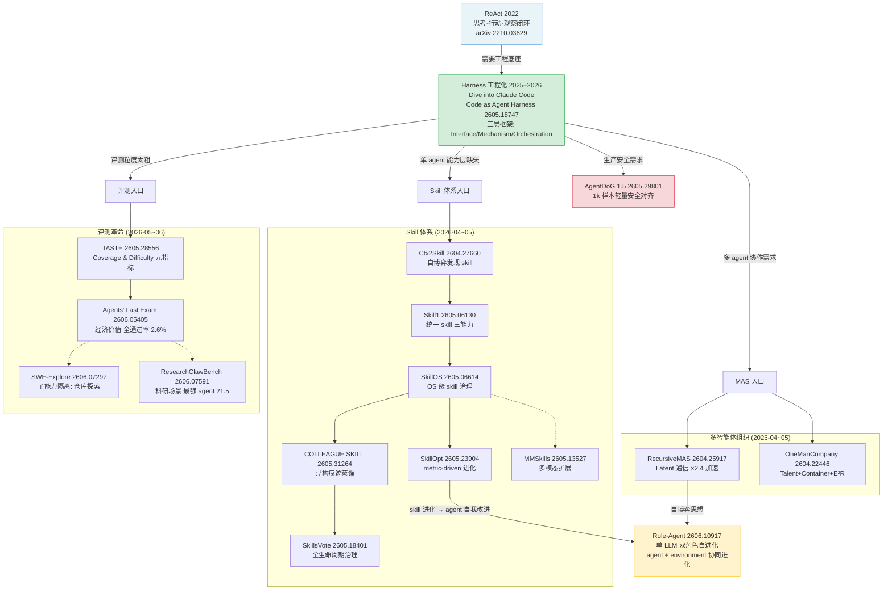

# Agent 体系演化谱系 · 2026 上半年

> **主线**: Agent 体系演化
> **Date**: 2026-06-12
> **Tags**: #agent #skill #multi-agent #benchmark #safety #self-evolution
> **所属专题**: [AI Frontier 2026 H1](2026-06-12-ai-frontier-comprehensive.md)

---

## 导读：这条线在解决什么根本问题

AI Agent 面临的根本矛盾是：**模型能力的边界是固定的，但真实世界的任务是开放的**。

早期 agent（2022–2023）用 prompt 工程把 LLM 包裹成"能自己想、自己动"的系统，但结果往往是在沙盒里跑通、真实任务一塌糊涂。其原因可以归结为三层缺失：

1. **执行层缺失**：没有稳定的工具调用、状态保持、异常恢复机制——ReAct 最早描述了"思考-行动"闭环，但没有给出工程底座。
2. **能力层缺失**：每次任务都从零开始，没有跨任务复用的能力单元（Skill）。
3. **组织层缺失**：单 agent 处理复杂任务能力有限，但多 agent 又难以协调、难以评测、难以保证安全。

2026 上半年的一批论文正在**系统性填补这三层缺失**：从 harness 工程化（Code as Agent Harness）出发，向上构建 Skill 体系（SkillOS / SkillOpt / COLLEAGUE.SKILL），向外扩展多智能体组织（RecursiveMAS / OneManCompany），向下夯实评测（ALE / SWE-Explore / ResearchClawBench）和安全（AgentDoG 1.5），最后触达自进化（Role-Agent）。

这条线的核心叙事是：**agent 系统从"大模型套壳"走向"可工程化、可治理、可评测、可自我改进"的软件系统**。

---

## 演化时间线

| 阶段 | 代表工作 | 突破点 | 局限 |
|------|---------|--------|------|
| **Ⅰ 原始 loop** (2022) | ReAct [2210.03629] | 思考-行动-观察三步闭环；首次系统化 agent trajectory | 无工程底座；工具调用脆，无状态保持 |
| **Ⅱ harness 工程化** (2025–2026) | Dive into Claude Code (Anthropic)；Code as Agent Harness [2605.18747] | 将 code 提升为 agent 推理/行动/环境建模的统一底座；三层框架统一 100+ 工作 | 评测仍看"任务通过率"，掩盖子能力差异 |
| **Ⅲ Skill 体系涌现** (2026-04~05) | Ctx2Skill [2604.27660]；Skill1 [2605.06130]；SkillOS [2605.06614]；SkillOpt [2605.23904]；COLLEAGUE.SKILL [2605.31264]；SkillsVote [2605.18401]；MMSkills [2605.13527] | Skill 从"prompt template"上升为可发现、可优化、可治理的软件工件 | 不同 skill 体系定义不统一；跨 agent 共享 skill 的标准缺失 |
| **Ⅳ 多智能体组织** (2026-04~05) | RecursiveMAS [2604.25917]；OneManCompany [2604.22446] | Latent 通信压缩 MAS 开销；组织抽象（Talent/Container/E²R）解决任务分解 | latent 路线可解释性差；组织路线基准数量少 |
| **Ⅴ 评测革命** (2026-05~06) | TASTE [2605.28556]；ALE [2606.05405]；SWE-Explore [2606.07297]；ResearchClawBench [2606.07591] | 从"通过率"转向"经济价值 + 子能力隔离"；硬数据：最强 agent 真实长流程全通过率仅 2.6% | 任务众包质量参差；LLM-as-judge 仍有污染风险 |
| **Ⅵ Agent 安全** (2026-05) | AgentDoG 1.5 [2605.29801] | 1k 样本训出 0.8B–8B 轻量安全对齐，逼近闭源 | 仅覆盖已知攻击模式；adversarial robustness 有限 |
| **Ⅶ 自进化** (2026-06) | Role-Agent [2606.10917] | 单 LLM 同时扮演 agent 和环境，双角色协同进化，无需外部监督 | 刚出现，长期稳定性和泛化能力未知 |

---

## 分阶段详解

### 阶段 Ⅰ · 原始 loop：ReAct 的思考-行动闭环

2022 年，ReAct（arXiv 2210.03629，Google Brain + Princeton）第一次把"让 LLM 在思考和行动之间交替"的想法系统化。核心设计是在每一步生成一个 Thought，再根据 thought 生成 Action（调用工具），然后把 Observation（工具返回值）拼回 context，形成 Thought → Action → Observation 的闭合循环。

ReAct 解决了此前 chain-of-thought 和 tool-use 分离的局面：CoT 擅长推理但不能行动，直接 tool-use 能行动但缺推理过程可见性。ReAct 把两者统一到同一 token 流里，让 trace 变得可调试。

**局限**：ReAct 的"底座"还是 prompt 工程。工具调用靠字符串解析，状态靠 context 累积（有长度上限），异常恢复靠重试——没有稳定的工程底座，任务复杂度稍高就崩溃。这个问题推动了下一阶段的 harness 工程化。

---

### 阶段 Ⅱ · Harness 工程化：代码作为 Agent 的统一底座

2025 年底，Anthropic 发布 "Dive into Claude Code" 工程博客，系统阐述了将代码语言作为 agent harness 的设计哲学：工具调用通过可解析的代码接口而非自由文本完成；状态通过文件系统和变量而非 context 维护；多步任务通过脚本流程而非 prompt 嵌套编排。

这一理念在 2026 年 5 月被 UIUC + Meta + Stanford 系统化提炼为 **Code as Agent Harness** 综述（arXiv 2605.18747，209 upvotes，60+ 页），给社区提供了统一词汇。

综述提出三层框架：

**Layer 1 · Harness Interface**：代码作为 agent 的三种接口——推理（PAL, Chain-of-Code 把推理外化为可执行程序）、行动（Voyager, Code-as-Policies 把生成代码作为 policy）、环境建模（SWE-bench, WorldCoder 用程序状态表示环境）。

**Layer 2 · Harness Mechanisms**：四大内部机制——Planning（CodePlan, MapCoder 做结构化任务分解）、Memory（RepoCoder 检索 repo 证据）、Tool Use（ToolCoder 暴露 API 给 agent）、Feedback Control（AgentCoder 用测试/运行时错误做迭代修复）。

**Layer 3 · Multi-Agent Orchestration**：角色分工（manager/planner/coder/reviewer/tester）+ 协作模式（协作/辩论/红蓝对抗）+ 拓扑结构（中心化/分布式/流式，AutoGen, MetaGPT）。

综述最关键的贡献是区分了三类组件：model-internal capabilities（模型自身推理能力）、system-provided harness infrastructure（预定义的工具/沙箱/memory）、以及最被忽视的 **agent-initiated code artifacts**——agent 自己创建、执行、观察、修订、持久化、共享的代码产物（regression test、临时工具、reusable skill）。第三类是当前最薄弱也最有潜力的层次。

六个 open challenges 中，最关键的两个是"评估不只看 final task success"和"regression-free harness improvement"——这直接预示了下一波评测革命的方向。

---

### 阶段 Ⅲ · Skill 体系涌现：从 prompt template 到可治理工件

"Skill"这个概念在 Anthropic 的 agent harness 工程文档中早有提及，但 2026 年 4–5 月，研究社区系统化地把它升级为独立学科，七篇高引论文密集涌现，从三个角度切入：

**如何发现 Skill（Ctx2Skill，2604.27660）**

THU + DeepLang + UIUC 等联合提出 Ctx2Skill，回答"LLM 能否从上下文中无监督地提炼 skill"。五个 frozen-LM 角色（Challenger / Reasoner / Judge / Proposer / Generator）构成自博弈循环：Challenger 生成 adversarial case，Reasoner 失败后触发 Proposer 提炼新 skill，Generator 把新 skill 写入 skill set。Cross-Time Replay 机制对抗"对抗坍缩"（Challenger 越来越极端 → Reasoner 过特化）。在 CL-Bench 上：GPT-4.1 从 11.1% 升至 16.5%，GPT-5.1 从 21.2% 升至 25.8%（+4.6pp）。

**如何统一训练三种 Skill 能力（Skill1，2605.06130）**

维护 skill library 需要三个子能力：选择（哪个 skill 匹配当前任务）、使用（怎么调用）、蒸馏（从成功经验中提炼新 skill）。已有方法把它们隔离训练或用不同奖励源，导致 partial & conflicting evolution。Skill1 用**单一 task-outcome 信号**同时训练：低频趋势给 selection 信用，高频波动给 distillation 信用，一次 rollout 完成查→重排→用→蒸馏全流程。ALFWorld / WebShop 上超越 skill-based 和 RL baseline。

**如何构建 OS 级 Skill 治理（SkillOS，2605.06614）**

SkillOS 把"策略地维护 skill"当作独立的一层 OS：训一个长期 skill curation policy，让 LLM agent 像操作系统调度进程一样调度 skill 的创建、评估、更新和废弃。与 Skill1 的差别在于：Skill1 在 single-policy 内联训三能力，SkillOS 把 curation policy 单独抽出，跨 executor 架构泛化。

**如何优化已有 Skill（SkillOpt，2605.23904）**

把 skill 进化做成"深度学习优化器"风格的可观测、可回滚过程。当前 skill 大多是手写、一次性生成或松散迭代，没有任何"梯度信号"。SkillOpt 给每个 skill 引入 metric + 受控更新策略，metric 下降时自动触发回滚——把 skill 工程化为有版本历史的软件工件。

**如何治理 Skill 生命周期（SkillsVote，2605.18401）**

从 long-horizon agent trace 中**采集**经验 → **推荐**给新任务 → 通过反馈信号**演化**。核心是把 skill 视为有版本、有质量、有 owner 的可治理资源，而不是用完即弃的 prompt。

**如何处理异构经验（COLLEAGUE.SKILL，2605.31264）**

把"人/角色"的异构执行痕迹（日志、交互记录、示范）蒸馏成结构化、可检查、可纠错的 skill 包。解决的问题是：真实工作场景中，skill 的源头是混乱的人类操作记录，不是整洁的 demonstration。

**如何扩展到多模态（MMSkills，2605.13527）**

扩展到多模态视觉 agent。强调一个 skill 不只是 prompt 文本，而是 (prompt, code, 学到的视觉策略) 的三元组——多模态 skill 需要独立的视觉推理路径。

> **阶段小结**：七篇论文共同批评了目前"prompt + bash"形态的 skill 过于扁平，集体走向"训练/治理/评测"三元组。这也回应了 Anthropic 的 SKILL.md 设计——不是要写更多 markdown 文档，而是要把 skill 当成软件工件来管理。

---

### 阶段 Ⅳ · 多智能体组织：Latent 数学化与系统工程化

单 agent 能力到顶后，如何把多个 agent 组合成更强系统？2026 年 5 月出现了两条路线：

**Latent 数学化路线：RecursiveMAS（2604.25917，258 upvotes）**

传统 MAS 用文本通信，存在两个瓶颈：（1）文本解码-编码的反复开销导致推理慢；（2）文本-SFT 训练时梯度消失，难以全系统协同优化。

RecursiveMAS 首次把"递归语言模型"的 scaling 思想搬到多智能体系统：每个 Agent 当作 RLM 的一层，通过轻量两层投影（RecursiveLink）在 latent 空间循环——Inner Link 在单 Agent 内部把上一步 last-layer hidden 反馈到下一步 input embedding，Outer Link 跨异构 Agent 把 hidden 投影到目标 Agent 的 embedding 空间。

关键结果（9 个 benchmark × 4 种协作模式）：递归 3 轮时平均准确率 +7.2pp，推理速度 ×2.4，token 减少 75.6%。理论上证明 latent 通信的梯度稳定性优于 text-based MAS。

**系统工程化路线：OneManCompany（2604.22446，120 upvotes）**

HUAWEI Noah's Ark + UCL 提出"AI 公司"抽象层，把多 agent 协作映射到真实企业组织：
- **Talent**：可移植的 Agent 身份（角色/Prompt/Skill/工具），类似员工档案；
- **Container**：异构后端（LangGraph、Claude Code、Script）的运行时，类似部门；
- **E²R 树搜索**（Explore-Execute-Review）：形式化保证终止性与无死锁的任务分解；
- **Talent Market**：社区驱动的 Agent 招聘市场，支持动态组队。

在 PRDBench（产品需求文档级别的软件工程任务）上单次零样本达到 84.67%，比当前 SOTA 高 15.48pp。

| 维度 | RecursiveMAS | OneManCompany |
|------|-------------|--------------|
| 抽象层级 | latent 计算流 | 人类组织流程（HR/Review）|
| 通信媒介 | hidden state | 结构化协议 + DAG |
| 优化方式 | 反向传播 RecursiveLink | SOP 演化 + Talent 市场 |
| 适合场景 | 数学/科学/代码 | 软件项目级 PRD |

两者代表了"latent 数学化"和"系统工程化"两种 MAS scaling 范式，并非竞争关系，而是对不同问题层次的回应。

---

### 阶段 Ⅴ · 评测革命：从"通过率"到"经济价值 + 子能力隔离"

2026 年 5–6 月，社区承认了一个尴尬事实：**agent 刷爆了各种 benchmark，却没在真实产业里产生对得上的经济价值**。一口气出现四个方向不同但核心信号一致的基准。

**TASTE（2605.28556）——Coverage & Difficulty**

A Matter of TASTE（TASTE）首先指出现有 agent benchmark 存在两个系统性问题：覆盖度不足（大量行业场景未被测试）、难度失真（简单任务被高估）。提出 Coverage 和 Difficulty 两个元指标来评价 benchmark 本身的质量。

**Agents' Last Exam（2606.05405，294 upvotes）——经济价值长流程**

ALE 是目前最激进的"经济价值转向"代表，由 250+ 行业专家共建，依据 O\*NET/SOC 2018 美国联邦职业分类，把非物理行业组织成 13 个行业簇 / 55 个子领域 / 1000+ 任务。

关键设计：
- 任务是专家贡献的已完成真实项目（耗时数天到数周），经五道质控门；
- 验证用"gate-and-score"——先过二元前置条件（如"刀路无碰撞"、"文件可解析"），再算连续质量分，刻意避免 LLM-as-judge；
- 1490 个实例只公开 150 个（~10%），其余私有池滚动轮换抗污染；
- 评测对象是 Generalist Computer-Use Agent（GCUA），把能力拆成 Brain/Eyes/Body/Hands/Feet 五层。

主要结果（按 Overall Pass Rate 排序，节选）：

| Agent (Backbone) | Easy Pass | Hard Pass | Overall Pass |
|-----------------|-----------|-----------|-------------|
| Codex (GPT-5.5) | 42.4% | 8.6% | **26.2%** |
| ALE-Claw (GPT-5.5) | 35.6% | 8.6% | 24.2% |
| Claude Code (Sonnet 4.6) | 31.4% | 0.0% | 17.1% |
| Gemini 3.1 Pro | 29.7% | 0.0% | 15.8% |
| Kimi K2.6 | 16.9% | 1.4% | 9.4% |

跨主流 harness×backbone 的平均全通过率仅 **2.6%**。最强配置在最难档不到 10%，多数主流 agent 在最难档接近零通过。

**SWE-Explore（2606.07297，108 upvotes）——子能力隔离：仓库探索**

SWE-bench 把编码当"解决/未解决"二元预测，掩盖了 repo 理解、上下文检索、代码定位、bug 诊断等细粒度能力。SWE-Explore 专门隔离**仓库探索**能力：给定 repo + issue，要求 explorer 在固定行预算内返回相关代码区域的排序列表，覆盖 848 issues / 10 语言 / 203 仓库，ground truth 从成功解决该 issue 的独立轨迹蒸馏。

**ResearchClawBench（2606.07591，85 upvotes）——科研场景端到端**

10 领域 40 任务端到端复现真实论文，每个 grounded 在一篇真实论文上，评测时隐藏目标论文，用专家多模态 rubric 做加权评分。结果：最强自主 agent（Claude Code）平均仅 **21.5**，距可靠"再发现"还很远。

> **三个基准共同传递的信号**：通过率/解决率这种粗粒度指标已经饱和或失真，下一代评测要么拉到真实经济价值（ALE），要么下钻到子能力（SWE-Explore），要么覆盖真实领域任务（ResearchClawBench）。

---

### 阶段 Ⅵ · Agent 安全：轻量对齐逼近闭源

随着 agent 从沙盒走向真实生产，安全问题也从"模型内容安全"升级到"agent 行为安全"。

**AgentDoG 1.5（2605.29801，142 upvotes）**

框架：用 1k 样本训出 0.8B–8B 参数的轻量安全对齐模型，在多个 agent safety benchmark 上逼近闭源系统。核心设计是"轻量可附加"——不需要修改底座模型，而是作为独立的安全检查层插入 agent loop 的关键节点。这让 AgentDoG 可以跨 backbone（Llama / Qwen / Mistral）部署，且随 backbone 升级而升级。

局限在于：仍只覆盖已知攻击模式（prompt injection、goal hijacking、capability boundary violation），对新型 adversarial attack 的鲁棒性有限；单任务安全和多步骤 agent 安全之间的迁移性也未充分验证。

---

### 阶段 Ⅶ · 自进化：Role-Agent 双角色协同

最新的进展来自 Role-Agent（2606.10917，73 upvotes），代表了 agent 自进化思路的早期探索。

核心设计：**单 LLM 同时扮演 agent 和 environment 两个角色**。agent 角色负责提出行动、解决任务；environment 角色负责生成反馈、制造挑战。两者使用同一个 LLM backbone，通过 role prompt 切换，形成双角色协同进化：agent 的失败会触发 environment 角色调整难度，environment 的反馈会推动 agent 角色学习。

这与 Self-Play 的思想一脉相承，但不同之处在于：Role-Agent 不需要两个独立的模型，也不需要预先定义任务空间，LLM 自己生成"合适难度的下一个挑战"。

这个方向非常早期，长期稳定性、是否会陷入 echo chamber（两个角色互相迁就）、以及在真实复杂任务上的泛化能力，都还是未知数。但它指向了一个重要方向：**agent 的进化不再依赖人工设计的课程，而是依赖自身与自身的交互**。

---

## 演化谱系图

---

## 本线小结

**Agent 体系演化的核心脉络**：

从 ReAct 的原语（think-act-observe loop）出发，经由 harness 工程化（code as unified substrate）建立稳定的执行底座，然后在底座之上同时展开三条并行线——Skill 体系（让 agent 有可复用的能力单元）、多智能体组织（让 agent 能协同分工）、评测革命（让 agent 的进步能被准确量化）——最终汇聚到自进化（agent 能自主产生新能力）和安全（agent 能在生产中安全部署）。

**两个最重要的数据点**：
1. ALE 跨主流 agent 的全通过率仅 **2.6%**——说明当前 agent 能力与真实经济价值之间仍有巨大鸿沟，评测革命是有意义的。
2. SkillOpt + Skill1 等论文把 skill 工程化为可观测、可回滚、可治理的工件——这是 agent 系统从"实验"走向"产品"的必要基础设施。

**这条线解决了什么，留下了什么**：

已解决：工程底座（harness）有了统一框架；Skill 概念从 prompt template 升级为软件工件；MAS 有了两条可行路线（latent/组织）；评测终于开始问"有多少经济价值"。

尚未解决：不同 skill 体系之间如何互操作；latent MAS 的可解释性；ALE 是否会被"针对性优化"而失真；Role-Agent 长期稳定性。

---

## 与其他主线的交叉点

| 交叉主线 | 交叉点 |
|---------|-------|
| **自动科研系统** | AutoResearchClaw 的多 agent 辩论机制（Innovator/Pragmatist/Contrarian）是 MAS 组织原则的具体应用；ResearchClawBench 既是 agent 评测也是 auto-research 评测 |
| **训练动态显微镜化** | Skill1/SkillOpt 把 skill 进化类比为"深度学习优化器"，本质上在问同一个问题：哪些更新是真正有判别力的？与 DelTA 的 token-level credit assignment 异曲同工 |
| **世界模型与具身** | OneManCompany 的 Container 层可对接具身 agent 的执行后端；Role-Agent 的"agent 自建 environment"思想与世界模型的 L3 Evolver 概念（自主修正自己的模型）高度重叠 |
| **PEFT / Skill 收敛** | 2026-06 期的 "Scaling of PEFT" (2606.02437) 把 adapter 重新定义为"持久本地状态"，与 SkillsVote / SkillOpt 的 skill 治理思想汇聚：**skill / adapter / memory 正在收敛为同一个研究对象——可版本化、可治理、可演化的本地能力载体** |

---

## References

### 阶段 Ⅰ · ReAct
- **ReAct**: Yao et al., 2022. [arXiv 2210.03629](https://arxiv.org/abs/2210.03629) · [HF](https://huggingface.co/papers/2210.03629)

### 阶段 Ⅱ · Harness 工程化
- **Code as Agent Harness Survey**: [arXiv 2605.18747](https://arxiv.org/abs/2605.18747) · [HF](https://huggingface.co/papers/2605.18747) · [GitHub](https://github.com/YennNing/Awesome-Code-as-Agent-Harness-Papers)
- **Dive into Claude Code** (Anthropic Engineering Blog): 经典工作，见原始出处 <https://www.anthropic.com/engineering>

### 阶段 Ⅲ · Skill 体系
- **Ctx2Skill**: [arXiv 2604.27660](https://arxiv.org/abs/2604.27660) · [HF](https://huggingface.co/papers/2604.27660)
- **Skill1**: [arXiv 2605.06130](https://arxiv.org/abs/2605.06130) · [HF](https://huggingface.co/papers/2605.06130)
- **SkillOS**: [arXiv 2605.06614](https://arxiv.org/abs/2605.06614) · [HF](https://huggingface.co/papers/2605.06614)
- **SkillOpt**: [arXiv 2605.23904](https://arxiv.org/abs/2605.23904) · [HF](https://huggingface.co/papers/2605.23904)
- **COLLEAGUE.SKILL**: [arXiv 2605.31264](https://arxiv.org/abs/2605.31264) · [HF](https://huggingface.co/papers/2605.31264)
- **SkillsVote**: [arXiv 2605.18401](https://arxiv.org/abs/2605.18401) · [HF](https://huggingface.co/papers/2605.18401)
- **MMSkills**: [arXiv 2605.13527](https://arxiv.org/abs/2605.13527) · [HF](https://huggingface.co/papers/2605.13527)

### 阶段 Ⅳ · 多智能体组织
- **RecursiveMAS**: [arXiv 2604.25917](https://arxiv.org/abs/2604.25917) · [HF](https://huggingface.co/papers/2604.25917)
- **OneManCompany (From Skills to Talent)**: [arXiv 2604.22446](https://arxiv.org/abs/2604.22446) · [HF](https://huggingface.co/papers/2604.22446)

### 阶段 Ⅴ · 评测革命
- **TASTE**: [arXiv 2605.28556](https://arxiv.org/abs/2605.28556) · [HF](https://huggingface.co/papers/2605.28556)
- **Agents' Last Exam (ALE)**: [arXiv 2606.05405](https://arxiv.org/abs/2606.05405) · [HF](https://huggingface.co/papers/2606.05405)
- **SWE-Explore**: [arXiv 2606.07297](https://arxiv.org/abs/2606.07297) · [HF](https://huggingface.co/papers/2606.07297)
- **ResearchClawBench**: [arXiv 2606.07591](https://arxiv.org/abs/2606.07591) · [HF](https://huggingface.co/papers/2606.07591)

### 阶段 Ⅵ · Agent 安全
- **AgentDoG 1.5**: [arXiv 2605.29801](https://arxiv.org/abs/2605.29801) · [HF](https://huggingface.co/papers/2605.29801)

### 阶段 Ⅶ · 自进化
- **Role-Agent**: [arXiv 2606.10917](https://arxiv.org/abs/2606.10917) · [HF](https://huggingface.co/papers/2606.10917)

### 相关 Digest 来源
- [2026-04-24 digest](../../research-notes/2026-04-24-hf-daily-papers-apr14-24.md) — Dive into Claude Code §4.2, AgentSPEX
- [2026-05-07 digest](../../research-notes/2026-05-07-hf-daily-papers-apr25-may7.md) — RecursiveMAS, OneManCompany, Ctx2Skill
- [2026-05-15 digest](../../research-notes/2026-05-15-hf-daily-papers-may8-15.md) — SkillOS, Skill1, MinT
- [2026-05-28 digest](../../research-notes/2026-05-28-hf-daily-papers-may16-28.md) — Code as Agent Harness, SkillOpt, SkillsVote, MMSkills
- [2026-06-12 digest](../../research-notes/2026-06-12-hf-daily-papers-may29-jun12.md) — ALE, SWE-Explore, ResearchClawBench, COLLEAGUE.SKILL, Role-Agent, AgentDoG 1.5
