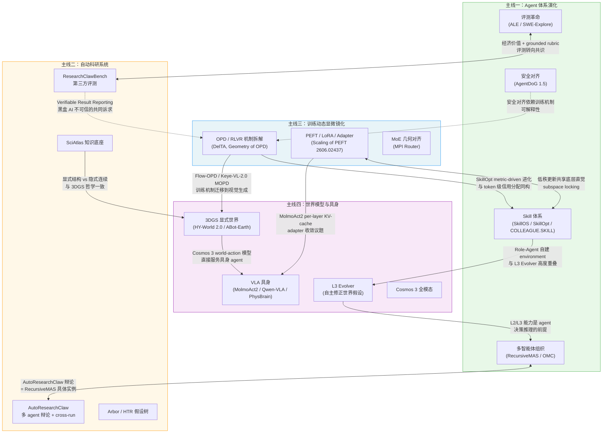

# 2026 上半年 AI 前沿演化谱系

> **Date**: 2026-06-12
> **Tags**: #ai-frontier #agent #auto-research #training-dynamics #world-models #survey #index
> **类型**: 专题索引文档
> **所属目录**: `topics/ai-frontier-2026h1/`

---

## 专题导读：2026 上半年 AI 的整体图景

如果用一句话概括 2026 年上半年的 AI 研究走向，那就是：**从"能力演示"迈向"工程可信"**。

2023–2024 年，AI 研究的主旋律是"规模扩张"——更大的模型、更多的数据、更高的 benchmark 分数。2026 年上半年，社区的注意力开始转向一个更难回答的问题：**这些能力在真实任务中能落地吗？边界在哪？怎么度量？**

这种转变在四条研究主线上都有清晰体现：

- **Agent 体系**：评测发现最强 agent 的真实长流程全通过率仅 2.6%（ALE），社区开始把 skill/adapter/memory 从 prompt template 升格为可治理的软件工件；
- **自动科研系统**：ResearchClawBench 让最先进的 auto-research 系统在标准化科研任务上仅得 21.5/100，暴露了"能生成论文"与"能可靠做科研"之间的量级差距；
- **训练动态显微镜化**：社区开始用线性代数和流形几何解剖 RLVR 和 OPD 的内部机制——不是为了炫技，而是因为黑盒训练无法保障 agent 的可信对齐；
- **世界模型与具身**：从视频生成转向显式 3D 表征（3DGS、ABot-Earth），因为机器人和自动驾驶需要的是可查询、可推理的环境，而不是逼真的像素序列。

四条主线在 2026 上半年不是平行推进的，而是**在关键节点相互收敛**：Skill 体系与 PEFT/adapter 在 2026-06 开始合流；世界模型的 L3 Evolver 与自动科研的"假设-验证-修正"闭环高度重叠；训练动态的 token 级信用分配与 agent skill 的判别力分析异曲同工；评测方法论（经济价值导向、grounded rubric）贯穿所有主线。

本专题整理自 9 期 HF Daily Papers Digest（2026-04-03 ~ 2026-06-12），所有论文均附 arXiv 链接。

---

## 四条主线导览

| 主线 | 核心问题 | 关键拐点 | 文档链接 |
|------|---------|---------|---------|
| **Agent 体系演化** | agent 如何从"大模型套壳"走向可工程化、可治理、可评测的软件系统 | ReAct → Code Harness → Skill 体系涌现 → MAS 组织 → ALE 评测革命 | [→ 详细文档](./2026-06-12-agent-evolution.md) |
| **自动科研系统** | 如何让 LLM 完成端到端科研全流程，并经受第三方评测的检验 | AI Scientist → 多 agent 辩论 → ResearchClawBench → 假设树 + 知识底座 | [→ 详细文档](./2026-06-12-auto-research.md) |
| **训练动态显微镜化** | 如何从黑盒经验配方走向对优化轨迹的几何化理解和主动控制 | Rethinking OPD → RLVR token 级拆解 → OPD 子空间锁定 → MoE 几何对齐 | [→ 详细文档](./2026-06-12-training-dynamics.md) |
| **世界模型与具身** | 如何让生成模型从"内容输出机"升级为可决策、可探索、遵守物理律的世界 | 视频扩散 → 3DGS 可探索世界 → L1/L2/L3 统一坐标系 → 全模态 3D 地球 | [→ 详细文档](./2026-06-12-world-models.md) |

---

### 主线一：Agent 体系演化

**一句话总结**：ReAct（2022）奠定思考-行动闭环原语，Code as Agent Harness 工程化执行底座，Skill 体系（Ctx2Skill→SkillOS→SkillOpt→COLLEAGUE.SKILL）把能力单元升格为可治理软件工件，RecursiveMAS/OneManCompany 两路扩展多智能体组织，ALE/SWE-Explore/ResearchClawBench 评测革命用经济价值替代通过率，AgentDoG 1.5 轻量安全对齐，Role-Agent 双角色自进化。

这条主线的核心问题是：agent 需要在开放世界中可靠执行长流程任务，但"能力"与"可靠性"之间存在一条工程鸿沟。2026-05 集中爆发的七篇 Skill 论文是这条线的拐点——它们把 skill 定义从"拼 prompt"升格为"带版本、可搜索、可评分的软件工件"，标志着 agent 工程从 prompt engineering 进入 software engineering 阶段。

[详见 Agent 体系演化谱系全文 →](./2026-06-12-agent-evolution.md)

---

### 主线二：自动科研系统

**一句话总结**：从 AI Scientist 的线性 pipeline + 单 agent 自评（2024-08）出发，经 AI Scientist-v2 树搜索（2025-04）、AutoResearchClaw 多 agent 辩论 + cross-run 经验积累（2026-05），到 ResearchClawBench 揭示最强 agent 仅得 21.5/100 的现实差距，再到 Arbor/HTR 假设树 + SciAtlas 知识底座——每代系统精确诊断上一代短板并给出工程修复。

这条主线的独特价值在于它同时是一面"放大镜"：科研任务对 agent 能力的要求（长流程规划、精确执行、诚信报告）恰好是现有 LLM 最薄弱的地方。ResearchClawBench 的出现标志着自动科研系统从"自我声称"进入"第三方验证"阶段，这一评测范式转变对整个 agent 生态都有示范意义。

[详见自动科研系统演化谱系全文 →](./2026-06-12-auto-research.md)

---

### 主线三：训练动态显微镜化

**一句话总结**：从 Rethinking OPD 的现象学积累出发，经 DelTA/Anti-Self-Distillation/DVAO 对 RLVR token 级机制的拆解，到 Geometry of OPD 发现 subspace locking、TRB 用信赖域 warmup 修复早期 rollout 浪费，再到 MPI Router 把几何约束推进 MoE 结构设计——整条线是"先经验→看机制→几何化→主动控制"的显微镜化演进。

这条主线的时代背景是：随着 RLVR 和大规模蒸馏成为 agent 对齐的标准工具，"为什么这样训练有效/无效"变成了不可回避的问题。DelTA 发现只有约 20% 的 token 在 RLVR 中携带判别信号，TRB 发现早期 rollout 质量差导致 teacher 信号浪费——这些精确诊断正在把训练从配方经验转变为可设计的工程。

[详见训练动态显微镜化演化谱系全文 →](./2026-06-12-training-dynamics.md)

---

### 主线四：世界模型与具身

**一句话总结**：从视频扩散模型（内容输出机）出发，经 Lyra 2.0/HY-World 2.0 的 3DGS 可探索世界、Agentic World Modeling 综述的 L1/L2/L3 统一坐标系、WAM 打通 VLA 与世界模型，最终到 Cosmos 3 全模态 mixture-of-transformers + ABot-Earth 卫星图直出 3D 地球 + Mirage latent 空间记忆——表征底座从像素转向显式 3D，VLA 具身支线并行完成 MolmoAct2 全开源 → PhysBrain 物理先验注入 → Qwen-VLA 跨形态统一。

这条主线的拐点是"显式 3D"：把世界模型的输出从帧序列（隐式几何）切换到 3D Gaussian Splatting（显式几何），使得 agent 可以在世界模型中查询距离、碰撞、遮挡等物理属性，而不仅仅是预测下一帧"看起来像什么"。

[详见世界模型与具身演化谱系全文 →](./2026-06-12-world-models.md)

---

## 四主线交叉关系图

---

## 趋势综合

四条主线的交叉分析提炼出 5-6 条跨线趋势，以及若干尚未收敛的开放问题，详见：

[趋势综合与开放问题 →](./2026-06-12-trends.md)

---

## References

**四篇主线文档**（本专题内部链接）：
- [Agent 体系演化谱系](./2026-06-12-agent-evolution.md)
- [自动科研系统演化谱系](./2026-06-12-auto-research.md)
- [训练动态显微镜化演化谱系](./2026-06-12-training-dynamics.md)
- [世界模型与具身演化谱系](./2026-06-12-world-models.md)

**关键 arXiv 论文**（按主线分组，ID 来自 HF digest，已验证）：

| 论文 | arXiv ID | 主线 |
|------|---------|------|
| Code as Agent Harness | [2605.18747](https://arxiv.org/abs/2605.18747) | Agent |
| SkillOS | [2605.06614](https://arxiv.org/abs/2605.06614) | Agent |
| SkillOpt | [2605.23904](https://arxiv.org/abs/2605.23904) | Agent |
| ALE (Agent Leaderboard via Economics) | [2606.05405](https://arxiv.org/abs/2606.05405) | Agent |
| ResearchClawBench | [2606.07591](https://arxiv.org/abs/2606.07591) | Auto-Research / Agent |
| Role-Agent | [2606.10917](https://arxiv.org/abs/2606.10917) | Agent |
| Rethinking On-Policy Distillation | [2604.13016](https://arxiv.org/abs/2604.13016) | Training |
| DelTA | [2605.21467](https://arxiv.org/abs/2605.21467) | Training |
| Geometry of OPD | 见 training-dynamics 文档 | Training |
| Scaling of PEFT | [2606.02437](https://arxiv.org/abs/2606.02437) | Training / Agent |
| Agentic World Modeling Survey | 见 world-models 文档 | World Model |
| ABot-Earth 3DGS | 见 world-models 文档 | World Model |
| MolmoAct2 | 见 world-models 文档 | World Model / VLA |

**素材来源**：9 期 HF Daily Papers Digest，`research-notes/` 目录下：
- `2026-04-03-huggingface-daily-papers-digest.md`
- `2026-04-07-hf-weekly-papers-apr4.md`
- `2026-04-08-hf-daily-papers-apr7-8.md`
- `2026-04-10-hf-daily-papers-apr9-10.md`
- `2026-04-13-hf-daily-papers-apr11-13.md`
- `2026-04-24-hf-daily-papers-apr14-24.md`
- `2026-05-07-hf-daily-papers-apr25-may7.md`
- `2026-05-15-hf-daily-papers-may8-15.md`
- `2026-05-28-hf-daily-papers-may16-28.md`
