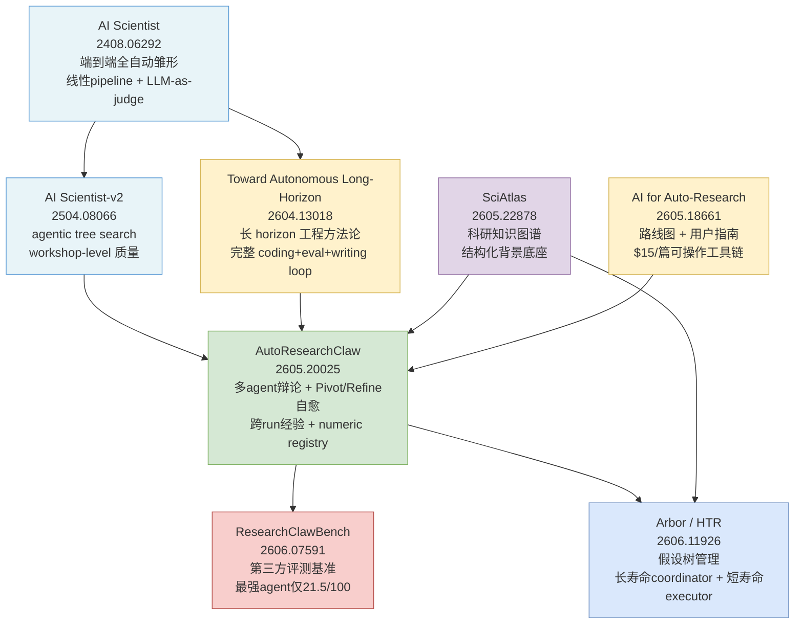

# 自动科研系统演化谱系

> **主线**: 自动科研系统（Auto-Research）
> **时间跨度**: 2024-08 ~ 2026-06
> **关键词**: AI Scientist, AutoResearchClaw, ResearchClawBench, Arbor, SciAtlas
> **文件路径**: `topics/ai-frontier-2026h1/2026-06-12-auto-research.md`

---

## 导读：这条线在解决什么根本问题？

科学研究是人类最密集的认知劳动：**假设生成 → 实验设计 → 执行 → 分析 → 写作 → 验证**，每个环节都要求领域知识、规划能力、执行鲁棒性和诚信。自动科研系统试图用 LLM agent 替代或增强这一全流程。

2024 年前，这条路线的主要形态是"工具辅助"：LLM 帮写代码、搜文献、润色论文——核心科研判断仍由人完成。AI Scientist（2024-08）是第一个宣称"端到端全自动"的系统，引发了质疑与跟随。问题随之暴露：

1. **单 agent 评估自身假设** → 缺乏对抗，假设质量无保障。
2. **执行失败即终止** → 浪费中间产物，规避高风险实验。
3. **每次 run 从零开始** → 无法积累跨实验经验。
4. **没有统一评测标准** → 各系统自我声称"生成论文"，无法横向比较。
5. **背景知识碎片化** → agent 获取领域背景依赖 web 搜索，缺乏结构化科研知识底座。

这条主线的演化，就是一轮轮地**诊断上一代系统的短板、然后提出修复方案**——从线性 pipeline → 自愈执行 → 端到端评测 → 长流程假设树 → 结构化知识底座。

值得注意的是，这条主线不只是"做科研的工具"。它的演化同时也是**对 LLM agent 可靠性的一次系统性压测**：科研任务要求的长流程规划、精确执行、诚信报告，正是 agent 能力最薄弱的地方。因此，这条线的每一个突破，往往也同时是对 agent 架构普遍局限的一次精确诊断。

---

## 演化时间线

| 阶段 | 代表工作 | 突破点 | 局限 |
|------|---------|--------|------|
| **Phase 0 · 全自动雏形** (2024-08) | AI Scientist (2408.06292) | 第一个端到端：idea → code → paper → review | 论文质量参差，单 agent 无对抗，引用幻觉严重 |
| **Phase 1 · 树搜索升级** (2025-04) | AI Scientist-v2 (2504.08066) | 用 agentic tree search 替换线性 pipeline；workshop-level 质量 | 多 agent 协作仍弱，执行失败无自愈，run 间无记忆 |
| **Phase 2 · 工程化里程碑** (2025-04) | Toward Autonomous Long-Horizon ML Research (2604.13018) | 系统化长 horizon 工程方法论；完整 coding+eval+writing loop | 聚焦 ML 领域单一，无跨领域评测 |
| **Phase 3 · 自愈 + 多 agent 辩论** (2026-05) | AutoResearchClaw (2605.20025) | Pivot/Refine 自愈执行 + 双阶段多 agent 辩论 + 跨 run 经验；ARC-Bench 比 AI Scientist-v2 高 54.7% | ARC-Bench 为自家评测；$15/篇假设仍待独立验证 |
| **Phase 4 · 可信评测标准** (2026-06) | ResearchClawBench (2606.07591) | 第三方端到端评测：10 领域 40 任务，grounded 于真实论文，最强 agent 仅 21.5 分 | 领域覆盖仍有限；rubric 仍是专家主观设计 |
| **Phase 5 · 假设树长流程** (2026-06) | Arbor / HTR (2606.11926) | 长寿命 coordinator + 短寿命 executor；假设树细化取代线性假设链 | 实验规模和域外泛化仍待检验 |
| **Phase 5 · 知识底座** (2026-05) | SciAtlas (2605.22878) | 大规模科研知识图谱，给 agentic research 提供结构化背景，而非依赖 web 搜索 | 图谱动态更新与最新论文覆盖仍是挑战 |

---

## 分阶段详解

### Phase 0 · AI Scientist：全自动的第一枪（2024-08）

Sakana AI 发布的 **The AI Scientist**（arXiv 2408.06292）是这条线的起点。它的雄心是做到"端到端"：从一个研究方向出发，自动生成 idea → 写代码做实验 → 分析结果 → 撰写论文 → 用 LLM-as-reviewer 自评。

这是一次重要的概念验证，但问题同样明显：生成的论文质量高度参差；LLM reviewer 对自产论文评分虚高（自我表扬陷阱）；文献引用大量幻觉，引用了不存在的论文；研究方向窄（主要是 ML 领域小实验）；每次 run 完全独立，没有任何经验积累。

这些问题不是偶然的 bug，而是**架构层面的必然后果**：线性 pipeline + 单 agent 自评 + 无持久记忆，注定了系统能做"自动化写作"但很难做"有质量的科研"。

AI Scientist 的发布在社区引发了两种截然不同的反应：一部分人认为"LLM 终于能做科研了"，另一部分人指出论文样本里充斥着事实错误和引用幻觉，AI Scientist 本身算不上真正的科研。这个争论推动了后续所有系统把"可信度验证"放到与"论文质量"同等重要的位置。

### Phase 1 · AI Scientist-v2：树搜索替代线性 pipeline（2025-04）

**The AI Scientist-v2**（arXiv 2504.08066，Sakana AI）把 Phase 0 的线性 pipeline 换成了 **agentic tree search**：在假设空间和实验空间都维护搜索树，通过 rollout 和回溯发现更优的实验方向。论文声称达到了"workshop-level"的成果质量（即被 NeurIPS/ICML 等 workshop 接收的水平）。

这是一个实质性的改进：树搜索自然处理了"失败即信息"的问题——一条搜索分支失败，可以回溯到另一个分支，而不是整个 run 终止。但多 agent 协作机制仍然薄弱：hypothesis 生成和评估还是同一套系统，缺乏对抗性压力；run 之间仍然独立，经验无法跨 run 积累。

### Phase 2 · Toward Autonomous Long-Horizon Engineering（2025-04）

**Toward Autonomous Long-Horizon Engineering for ML Research**（arXiv 2604.13018，HF ticket 34 upvotes）在 AI Scientist-v2 同期出现，走了一条不同的路线：不做科研结果的质量评估，而是系统化地研究**长 horizon 工程执行**本身——如何让 agent 可靠地完成包含数十步的 ML 研究工程（代码调试、环境管理、实验 logging、结果聚合）。

这篇工作的价值在于把"自动科研"分解为一个工程问题：研究质量固然重要，但如果底层工程执行不可靠（import 出错就崩、文件路径错误就终止），任何上层科研逻辑都是空中楼阁。它给出了一套 coding + evaluation + writing 的完整 loop，并明确了长 horizon 执行中的五类常见失败模式。

局限是聚焦 ML 领域，且没有提供跨系统可比较的评测基准——如何量化"更自主"成为这个阶段社区的公开问题。

### Phase 3 · AutoResearchClaw：自愈执行 + 多 agent 辩论（2026-05）

**AutoResearchClaw**（arXiv 2605.20025，UNC + UCSC + CMU + NUS 等 9 机构，184 upvotes）是这条主线迄今最完整的系统设计。它对 AI Scientist-v2、AIDE（2502.13138）、Agent Laboratory 等系统做了系统性对比，总结出三个**结构性**短板，并联合解决：

**三大短板的联合解决**：

| 短板 | AutoResearchClaw 的解法 |
|------|------------------------|
| 单 agent 假设自评 | 双阶段多 agent 辩论：Hypothesis 阶段（Innovator + Pragmatist + Contrarian）→ Result 阶段（Optimist + Skeptic + Methodologist） |
| 执行失败即终止 | Pivot/Refine 自愈循环：失败签名 → 三选一（Proceed / Refine / Pivot），失败变信息而非终点 |
| Run 间无记忆 | 跨 run 经验积累，半衰期 30 天时间衰减权重，无需重训直接注入 prompt |

**Verifiable Result Reporting** 是另一个关键创新：所有实验数字进入 numeric registry 白名单，写作时只能从 registry 取数，post-hoc verifier 检查所有数字的来源；引用走 4 层 pipeline（DOI → OpenAlex → arXiv → Semantic Scholar），幻觉引用直接删除。

**Human-in-the-Loop 的精细化**：7 种模式从 Full-Auto 到 Step-by-Step；关键发现是**最佳模式是 CoPilot（6 个高杠杆干预点），而非 Full-Auto**——完全自主在关键决策点犯错无法补救，步步审批则人类成本高且疲劳。

ARC-Bench（25 ML + 20 科学领域 topics，自家评测）上比 AI Scientist-v2 高 **54.7%**。须注意这是自家 benchmark 的内部对比，需谨慎解读。

同期，**AI for Auto-Research: Roadmap & User Guide**（arXiv 2605.18661，67 upvotes）发布了一份路线图，声称当前最便宜的全自动论文生成已降到 **$15/篇**，并提供了一份从数据获取到论文写作的完整工具链指南。这篇更像是"给早期用户的手册"而非新系统，但它标志着自动科研开始从学术原型走向可操作的实践工具。

### Phase 4 · ResearchClawBench：第三方可信评测（2026-06）

**ResearchClawBench**（arXiv 2606.07591，85 upvotes）是这条主线的评测转折点——**第三方端到端评测标准**的出现意味着这个子领域开始走向成熟。

设计理念：每个任务 grounded 在一篇**真实已发表论文**上，评测时隐藏目标论文；用专家多模态 rubric 把研究质量拆成加权标准（而非 LLM-as-judge）。覆盖 **10 个领域 / 40 个任务**，要求 agent 端到端复现论文的核心贡献。

关键数据：**最强自主 agent（Claude Code）平均得分仅 21.5 / 100**。这个数字比各系统自评的数字低得多，揭示了"自动科研"和"可靠地再发现真实研究"之间的巨大鸿沟。

这是这条主线的重要清醒剂：Phase 3 各系统的声称（"生成高质量论文"、"50%+ 相对提升"）在第三方评测下受到了检验。

### Phase 5a · Arbor / Hypothesis-Tree Refinement：长流程假设推演（2026-06）

**Arbor: Toward Generalist Autonomous Research via Hypothesis-Tree Refinement**（arXiv 2606.11926，HTR，70 upvotes）针对长流程研究中假设管理的失效提出了新架构。

核心观察：现有系统（含 AutoResearchClaw）在假设层面仍是"线性链"——生成一个假设，验证，修改，再验证。当研究方向需要多次大幅转向时，这个结构无法保存"已探索但尚未充分验证"的分支，也无法做跨分支的比较推断。

**Hypothesis-Tree Refinement（HTR）** 的设计：
- **长寿命 Coordinator**：维护假设树的全局状态，跨 session 持久化，记录哪些分支已探索、哪些分支尚未展开。
- **短寿命 Executor**：每个实验任务启动一个短寿命 executor，执行完毕报告结果，coordinator 根据结果更新假设树。
- **树式推进**：假设不再是单链，而是有分支有合并，支持"并行探索多个假设"和"根据结果合并假设"。

这个设计解决了 AutoResearchClaw 仍存在的问题：Pivot/Refine 循环在单次 run 内工作良好，但对**跨多 run 的假设空间全局管理**无能为力。

### Phase 5b · SciAtlas：结构化科研知识底座（2026-05）

**SciAtlas: A Large-Scale Knowledge Graph for Automated Scientific Research**（arXiv 2605.22878，55 upvotes）从另一个角度切入这条主线的根本问题：**agentic research 系统在生成假设时，依赖 web 搜索作为领域背景来源**——这既慢（多次 HTTP 调用）、又不可靠（检索噪音大）、又缺乏结构（无法查询"X 方法在哪些领域上被超越"这类结构化关系）。

SciAtlas 把分散的论文 / dataset / model / benchmark 编织成一个大规模科研知识图谱，核心实体类型包括：论文、方法、数据集、任务、指标、结果（含数值）。这使得 agent 可以做图查询而不是文本搜索：例如"列出所有在 CIFAR-100 上被更新的 SOTA 方法及其改进幅度"。

与 AutoResearchClaw 的 citation verification pipeline（DOI → OpenAlex → arXiv → Semantic Scholar）相比，SciAtlas 提供的是更结构化的背景知识，而不只是引用验证。这两者有互补性：AutoResearchClaw 解决的是"写出来的引用是否真实"，SciAtlas 解决的是"生成假设时能否调取准确的领域知识"。

---

## 横切关注点：可信度与诚信的工程化

贯穿这条主线的一个隐线是**科研诚信的工程化**——不是依赖道德约束，而是把可信度要求编译进系统设计。

### 三层引用幻觉的递进治理

- **Phase 0**：AI Scientist 的引用幻觉（引用不存在的论文）是有据可查的失败，但没有任何机制阻止。
- **Phase 3**（AutoResearchClaw）：引入 4 层 citation verification pipeline：DOI 查 CrossRef → 模糊标题查 OpenAlex → arXiv ID 直查 → Semantic Scholar fallback；LLM 做 relevance 分类，幻觉引用直接删除，不是标注而是删除。
- **Phase 4**（ResearchClawBench）：评测基准本身也要求 grounded 于真实论文，rubric 由人类专家设计，避免 LLM-as-judge 的循环幻觉。

### Numeric Registry：数字诚信的机制保障

AutoResearchClaw 的 numeric registry 是这条主线最精巧的设计之一：

1. 实验执行时，所有数字（每条件均值 / 标准差 / 每 seed 测量）实时写入 registry。
2. 写作阶段，LaTeX 表格只能从 registry 取数，agent 不能"凭记忆"填数字。
3. post-hoc verifier 扫描全文所有数字，检查是否每一个都在 registry 白名单里。
4. Abstract / Results / Experiments 章节中无法匹配 registry 的数字会触发 **document rejection**，而不是警告。

这实际上是在 agent 系统里实现了一个简化版的"数据血缘追踪"（data lineage），把科研诚信从软性要求变成硬性约束。

### 成本现实化：$15/篇的含义

**AI for Auto-Research**（2605.18661）声称的 "$15/篇" 需要分解理解：

| 成本构成 | 估算 |
|---------|------|
| LLM API 调用（文献检索 + 假设生成 + 写作） | ~$8-10 |
| 实验计算（取决于任务复杂度，用 GPU spot 实例） | ~$3-5 |
| 验证 pipeline（引用查验 + numeric check） | ~$1-2 |
| **合计** | **~$15** |

这个数字对应的是"简单的 ML 实验"（如超参数消融、小型模型 benchmark 比较）。ResearchClawBench 的实验表明，对于"端到端复现一篇真实论文的核心贡献"，最强 agent 得分仅 21.5/100——说明 $15 能买到的，更接近"有格式的实验报告"而非"有质量的原创研究"。

这个对比是这条主线当前状态最诚实的定位：**自动科研系统已经能在有限范围内自动化执行标准化实验流程，但距离"可靠地做真正的科研"还有量级差距**。

---

## 演化谱系图

---

## 本线小结

从 AI Scientist 到 Arbor，这条主线的核心演化是：

1. **执行可靠性**：从"失败即终止"（Phase 0）→ 树搜索回溯（Phase 1）→ Pivot/Refine 自愈（Phase 3）→ 假设树长期管理（Phase 5a）。
2. **评估对抗性**：从"单 agent 自评"（Phase 0）→ 多 agent 辩论双阶段（Phase 3）。
3. **可信度机制**：从"LLM-as-judge"（Phase 0）→ numeric registry + 4 层引用验证（Phase 3）→ 第三方 rubric 评测（Phase 4）。
4. **知识底座**：从"web 搜索"（Phase 0-3）→ 结构化科研知识图谱（Phase 5b）。
5. **成本现实化**：从"概念验证"（Phase 0）→ "$15/篇可操作工具链"（Phase 3-4）。

**最重要的清醒剂**：ResearchClawBench 的 21.5/100 这个数字。各系统自家 benchmark 上的亮眼数字（AutoResearchClaw ARC-Bench 54.7% 提升）在第三方评测下大幅收缩。这不是否定这条线的进展，而是提示：**"能生成论文"和"能可靠地做科研"之间，仍有巨大的距离**。

**下一代系统的方向预判**：综合这两年的演化节奏，下一个系统级突破点很可能是：
- **假设生成的主动 falsifiability 设计**：不只是生成假设，而是同时生成"如果假设错了，会有什么可观测的 counter-evidence"——类似 Karl Popper 的可证伪性要求被编译进系统。
- **跨领域知识迁移**：目前所有系统都聚焦单领域（ML 或科学子领域），跨领域的"创新类比"（如把物理方法迁移到生物学）仍完全依赖 LLM 的参数化知识。
- **Human-in-the-Loop 的主动学习**：AutoResearchClaw 的 SmartPause 已经走到了"根据不确定度触发人类干预"，下一步是"系统主动学习哪类人类干预最有价值，并改变干预点设计"。

---

## Open Questions

1. **LLM-as-reviewer 的 calibration 问题是否可以工程修复？** AutoResearchClaw 用 multi-agent debate 对抗自我表扬，但三个 agent 由同一 LLM backbone 实例化——"有偏见的法庭"能产生公正的裁决吗？还是需要真正异构的 backbone？

2. **numeric registry 防得住"精心构造的合规但虚假的实验"吗？** registry 保证数字一致性，但如果整个实验设计就有偏（如 cherry-picked seeds、cherry-picked metrics），registry 无法发现。真正的诚信需要 pre-registration（实验前公开设计）和独立重现（外部 agent 复现），这在自动科研系统里尚未实现。

3. **SciAtlas 的时效性问题**：科研知识图谱有"截止日期"——训练完成后，新发布的论文无法进入图谱，agent 会系统性地忽略最新发展。如何做到实时增量更新？hybrid（图谱 + 实时 web search）是当前最可行的方向，但两者的一致性如何保证？

4. **Arbor 的 coordinator 本身是否成为单点故障？** 长寿命 coordinator 管理假设树的全局状态，这把"执行可靠性"的问题上移了一层——现在是 coordinator 的可靠性决定了整个研究方向的合理性。coordinator 自身的验证机制是什么？

5. **自动科研是否会加剧"论文通货膨胀"？** 如果 $15/篇成为常态，arXiv 上的论文数量可能以前所未有的速度增长，但其中能真正推进科学边界的比例可能下降。这对整个科研生态（同行评审、引用文化、基金申请）的影响是什么？

---

## 与其他主线的交叉点

| 交叉点 | 相关主线 | 描述 |
|--------|---------|------|
| **Multi-agent 辩论架构** | Agent 体系演化 | AutoResearchClaw 的 Innovator/Pragmatist/Contrarian 三 agent 结构与 RecursiveMAS / OMC 的多 agent 组织研究直接呼应 |
| **Skill 体系与经验积累** | Agent 体系演化 | AutoResearchClaw 的 cross-run lesson（时间衰减权重）与 SkillOpt / SkillsVote 的 skill 治理共享"可版本化经验"的理念 |
| **Verifiable evaluation** | Agent 体系演化 | ResearchClawBench 的 grounded-rubric 设计与 ALE（Agents' Last Exam）的经济价值评测转向同属一类：从"通过率"走向"可验证质量" |
| **RLVR 显微镜化** | 训练动态 | AutoResearchClaw 的 numeric registry 和 Verifiable Result Reporting 理念，与 DelTA 等 RLVR 工作"看清更新到底发生在哪"的诉求，都是对"黑盒 AI 系统不可信"的回应 |
| **结构化知识 + 3D 表征** | 世界模型 | SciAtlas 的知识图谱底座与世界模型主线的"显式 3D 表征"（ABot-Earth 的 3DGS）有相似的设计哲学：显式结构比隐式连续表征更可查询、更可验证 |

---

## References

### 核心论文（均已验证 arXiv ID）

| 论文 | arXiv | HF 链接 |
|------|-------|---------|
| The AI Scientist: Towards Fully Automated Open-Ended Scientific Discovery | [2408.06292](https://arxiv.org/abs/2408.06292) | — |
| The AI Scientist-v2: Workshop-Level Automated Scientific Discovery via Agentic Tree Search | [2504.08066](https://arxiv.org/abs/2504.08066) | [HF](https://huggingface.co/papers/2504.08066) |
| Toward Autonomous Long-Horizon Engineering for ML Research | [2604.13018](https://arxiv.org/abs/2604.13018) | [HF](https://huggingface.co/papers/2604.13018) |
| AIDE: AI-Driven Exploration in the Space of Code | [2502.13138](https://arxiv.org/abs/2502.13138) | — |
| AutoResearchClaw: Self-Reinforcing Autonomous Research with Human-AI Collaboration | [2605.20025](https://arxiv.org/abs/2605.20025) | [HF](https://huggingface.co/papers/2605.20025) |
| AI for Auto-Research: Roadmap & User Guide | [2605.18661](https://arxiv.org/abs/2605.18661) | [HF](https://huggingface.co/papers/2605.18661) |
| SciAtlas: A Large-Scale Knowledge Graph for Automated Scientific Research | [2605.22878](https://arxiv.org/abs/2605.22878) | [HF](https://huggingface.co/papers/2605.22878) |
| ResearchClawBench: A Benchmark for End-to-End Autonomous Scientific Research | [2606.07591](https://arxiv.org/abs/2606.07591) | [HF](https://huggingface.co/papers/2606.07591) |
| Toward Generalist Autonomous Research via Hypothesis-Tree Refinement (Arbor / HTR) | [2606.11926](https://arxiv.org/abs/2606.11926) | [HF](https://huggingface.co/papers/2606.11926) |

### Digest 来源

- [2026-04-24 HF Daily Papers Digest (Apr 14-24)](../../research-notes/2026-04-24-hf-daily-papers-apr14-24.md) — Toward Autonomous Long-Horizon Engineering (§6.4)
- [2026-05-28 HF Daily Papers Digest (May 16-28)](../../research-notes/2026-05-28-hf-daily-papers-may16-28.md) — AutoResearchClaw (§主题四 + Deep Dive 4), SciAtlas, AI for Auto-Research
- [2026-06-12 HF Daily Papers Digest (May 29-Jun 12)](../../research-notes/2026-06-12-hf-daily-papers-may29-jun12.md) — ResearchClawBench (§主题一), Arbor/HTR (#22)
