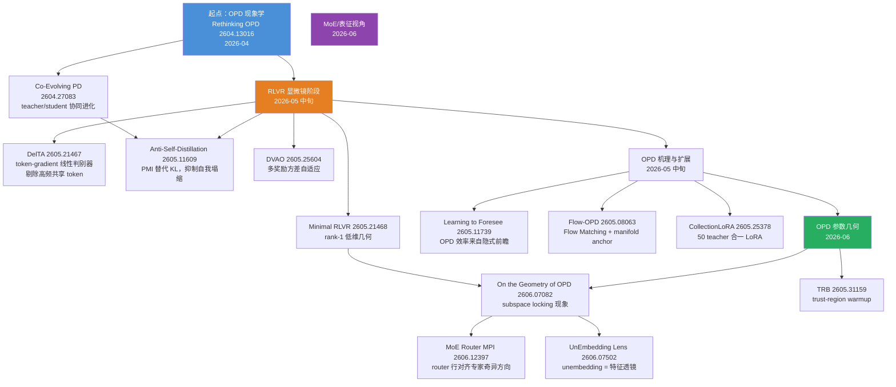

# 训练动态显微镜化：从经验配方到优化几何

> **专题**: 2026 上半年 AI 前沿演化谱系 · 主线三
> **Date**: 2026-06-12
> **Tags**: #training-dynamics #on-policy-distillation #RLVR #GRPO #LoRA #MoE #optimization-geometry

---

## 一、导读：这条线在解决什么根本问题

深度学习长期以一种"黑盒驾驶"的方式运作——研究者知道"什么 trick 有效"，却不知道"更新到底发生在参数空间的哪里"。2026 年上半年涌现的一批论文集体反对这种经验主义：它们把 RLVR（Reinforcement Learning from Verifiable Rewards）、On-Policy Distillation（OPD）、MoE router、文本嵌入矩阵等各个子系统放到"显微镜"下，用线性代数、信息论和流形几何逐层拆解：

- **哪些 token 在被更新，哪些在白费** (DelTA)
- **OPD 的参数更新沿什么轨迹运动，锁定在哪个子空间** (Geometry of OPD)
- **早期 rollout 质量差，teacher 信号被浪费在哪里** (TRB)
- **MoE 的 router 决策是否对齐了专家的真实"特长方向"** (MPI Router)
- **unembedding 矩阵暗含什么特征结构** (UnEmbedding Lens)

这种"训练动态显微镜化"的转变，和 2014 年 Adam 优化器出现后那两年学界对 second-moment estimator 的集体解剖如出一辙。它的重要性在于：**一旦看清更新发生在哪里，就能主动设计让正确的地方被更新**。

---

## 二、演化时间线

| 阶段 | 时间 | 代表工作 | arXiv | 突破点 | 局限 |
|---|---|---|---|---|---|
| **起点：现象学积累** | 2026-04 | Rethinking On-Policy Distillation | 2604.13016 | 系统整理 OPD 现象、机制、配方三层次；85 upvotes 标志社区注意力聚焦 | 仍停留在"什么有效"，尚无几何解释 |
| **RLVR 机理研究** | 2026-05 前半 | Co-Evolving Policy Distillation | 2604.27083 | teacher/student 协同进化防止塌缩 | 无 token 级分析 |
| **RLVR 显微镜阶段** | 2026-05 中 | DelTA / Anti-Self-Distillation / DVAO / Minimal RLVR | 2605.21467 / 2605.11609 / 2605.25604 / 2605.21468 | token-gradient 线性判别器视角；PMI 替代 self-distillation；rank-1 低维几何 | 各工作视角独立，尚无统一理论 |
| **OPD 前瞻机理** | 2026-05 中 | Learning to Foresee；Flow-OPD | 2605.11739 / 2605.08063 | OPD 的效率来源是"隐式前瞻"；Flow Matching 的 manifold anchor 正则 | 限于特定任务域 |
| **OPD 参数几何** | 2026-06 | On the Geometry of OPD；TRB；CollectionLoRA | 2606.07082 / 2605.31159 / 2605.25378 | subspace locking 现象；trust-region warmup；50 effect 合一 LoRA | subspace 设计方法尚未成熟 |
| **MoE/表征视角** | 2026-06 | MoE Router MPI；UnEmbedding Lens | 2606.12397 / 2606.07502 | router 行与专家主奇异方向对齐；unembedding = 特征透镜 | 仍限于诊断，控制方法待开发 |

---

## 三、分阶段详解

### 3.1 起点：On-Policy Distillation 走进聚光灯（2026-04）

**Rethinking On-Policy Distillation of Large Language Models**（arXiv:2604.13016，85 upvotes）是 2026 年 4 月中旬 HF Daily Papers 上第一个系统梳理 OPD 的工作。在此之前，OPD 作为一种"teacher 模型通过 privileged context 监督 student rollout"的后训练方法虽已在 reasoning 领域被广泛使用，但社区对"为什么有效"的理解停留在经验层面——从业者知道"OPD 在推理任务上比纯 SFT 好"，却说不清楚背后的机制。

这篇工作的贡献是三层框架：**现象学**（OPD 相比 SFT 在 distribution shift 下为何更稳定——student 在自己的 on-policy 分布上学习，避免了 SFT 的 exposure bias）、**机制**（teacher privileged context 即含 ground-truth 的条件信息如何在 token 级别传播差异信号）、**配方**（温度、KL 权重、rollout 数量等超参的最佳实践）。85 票的社区认可标志着 OPD 正式进入"被研究者集体解剖"的阶段——从此后数月，这个方向的论文密度持续上升。

理解 OPD 在这个阶段的背景很重要：它是 RLVR（GRPO/DAPO 类可验证奖励强化学习）之外的另一条 reasoning 后训练路线。RLVR 用奖励信号（对/错）做 policy gradient；OPD 用 teacher 提供的 privileged oracle 做密集 token 级 KL 监督。两者都声称"比 SFT 好"，但机制完全不同。这篇工作的出现相当于为 OPD 立起了第一根标杆。

同时期的 Co-Evolving Policy Distillation（arXiv:2604.27083，61 upvotes）从另一个角度提出问题：标准 OPD 中 teacher 是固定的，当 student 变差时 teacher 的信号反而成为负担。Co-Evolving PD 让 teacher 和 student 同步进化，student rollout 的质量反馈回 teacher 的采样策略，防止"自我塌缩"（self-collapse）。这与后来 Anti-Self-Distillation 发现的塌缩问题形成前后呼应。

---

### 3.2 RLVR 进入显微镜阶段（2026-05 中旬）

2026 年 5 月中下旬，连续多篇论文把 RLVR（GRPO/DAPO 等可验证奖励强化学习）从"提 trick"推进到"看机制"。这是整条主线最密集的拐点。需要先理解 RLVR 的基本设置：给模型一个问题，采样多个回答，用可验证奖励（如答案是否正确）给每个 response 打分，用 GRPO/PPO 类 policy gradient 更新模型。整个过程是 sequence 级别的——每个 response 得到一个标量奖励，但模型的实际更新是 token 级的 gradient。这中间的"sequence 奖励 → token 梯度"的映射长期是黑盒。

**DelTA**（arXiv:2605.21467，204 upvotes）提出 RLVR = 隐式线性判别器。作者证明：policy gradient 更新等价于在 token-gradient 向量空间里构造一个线性判别器，以 `(c⁺ - c⁻)` 为决策边界，其中 `c⁺`/`c⁻` 是正/负组 response 的 token-gradient 平均。问题在于**高频共享 token**（如格式符号 "Let's"、"Therefore"、markdown 标题符）在正负组都频繁出现，把两个中心同时拉向同一"背景方向"，稀疏的有判别力的方向被淹没。DelTA 引入判别度系数对每个 token 重新加权，在 Qwen3-8B-Base 上让 DAPO 提升 3.26 分，且训练曲线更稳定。这个几何视角第一次让 RLVR 的更新过程变得"可画"。

**Anti-Self-Distillation**（arXiv:2605.11609，193 upvotes）从信息论角度发现另一种失效：当 OPD 让模型向含 ground-truth 的 privileged-context 版本对齐时，模型会"自我塌缩"——强化已有高频 mode 而不是探索更优解。提出用 Pointwise Mutual Information（PMI）替代 KL 散度作为监督信号：PMI 衡量 token 在 privileged-context 下相比自由生成"意外出现"的程度，天然抑制无信息量的高频 token，鼓励学习新的推理步骤。

**DVAO**（arXiv:2605.25604，128 upvotes）针对多奖励场景：标准 GRPO 在多个奖励信号（格式奖励 + 正确性奖励 + 过程奖励等）融合时 advantage 方差爆炸，导致训练不稳定。动态方差自适应优化为每个奖励维度独立估计方差，自适应加权融合，让多奖励 RLVR 训练的方差减少达 40%+。

**Minimal RLVR**（arXiv:2605.21468）发现最小充分条件：只用 rank-1 trajectory（一个正例+一个负例，即最小对比组）也能训出有效 RLVR policy，揭示参数空间的有效更新几何比预期低维得多——大量正负 pair 的边际收益极低。这一结果与 Geometry of OPD 后来发现的 subspace locking 遥相呼应——都在说"更新只需要很小一个方向的激活"。

这一波论文的集体意义总结如下：

| 工作 | 核心视角 | 诊断的失效模式 | 解法方向 |
|---|---|---|---|
| DelTA | 线性代数 (梯度空间) | 高频共享 token 污染判别方向 | 判别度加权重采样 |
| Anti-Self-Distillation | 信息论 (PMI) | 低信息量 mode 被强化（塌缩） | PMI 替代 KL 监督 |
| DVAO | 统计学 (方差) | 多奖励融合方差爆炸 | 动态方差自适应加权 |
| Minimal RLVR | 低秩几何 | 冗余 trajectory 无边际收益 | rank-1 充分条件 |

> **Learning to Foresee**（arXiv:2605.11739）补充了 OPD 效率的前瞻性解释：OPD 提升不是因为每一步都有更密集的监督，而是因为 teacher 的 privileged context 在序列开头暗含了"前瞻"——模型隐式学到了如何更快到达正确解的路径规划。这个视角把 OPD 与规划研究联系起来，也为后来 TRB 的 warmup 策略提供了理论依据（早期 rollout 前瞻信号最强，值得最精确的 teacher 对齐）。

---

### 3.3 OPD 扩展到 Flow Matching 与多 teacher（2026-05 中旬）

**Flow-OPD**（arXiv:2605.08063，92 upvotes）把 on-policy distillation 带入扩散/flow matching 图像生成领域：teacher flow 模型采样 + student on-policy 反馈构成双重信号，并加入 **manifold anchor 正则**防止 student 跑出合法图像流形。这个设计解决了流匹配蒸馏特有的问题：当 student 的采样轨迹偏离流形后，teacher 的监督信号变成几何上无意义的"校正"，形成反馈循环的恶化。Manifold anchor 在优化目标里加入一个"流形保持"约束，相当于用几何先验规范化更新方向。在文生图对齐指标上双提升，是 OPD 从语言迁移到视觉生成的第一个系统性工作。

**CollectionLoRA**（arXiv:2605.25378）把多 teacher OPD 推向极致：用一个 LoRA 同时蒸馏 50 个不同风格/效果 teacher 的知识，通过 Multi-Teacher On-Policy Distillation 实现。核心问题是多 teacher 信号冲突——50 个 teacher 对同一个 student rollout 给出不同的"期望 token 分布"，梯度方向相互抵消导致训练崩溃。解法是让每个 teacher 对 student rollout 给出各自 token 级反馈，再用动态路由按 teacher 专长区域加权融合，避免梯度方向相互抵消。这与同期 Keye-VL-2.0 的 Cross-Modal Multi-Teacher OPD（MOPD）思路完全一致，说明"多 teacher + on-policy + 动态路由"正在成为大规模多任务蒸馏的标准范式。把 50 个独立 LoRA 的信息压进 1 个 LoRA 而不损失覆盖度，本身也是参数效率研究的重要里程碑。

---

### 3.4 OPD 参数几何：subspace locking 与 trust-region warmup（2026-06）

2026 年 6 月是这条主线的几何化阶段，三篇论文把 OPD 的参数更新轨迹变得"可测量"。这一阶段的工具箱来自已有的参数空间分析方法：主奇异方向追踪（SVD of update matrices）、参数子空间投影（projecting updates onto basis of early training steps）、以及 TRPO/PPO 已久的信赖域约束——现在被应用于蒸馏而非 RL。

**On the Geometry of On-Policy Distillation**（arXiv:2606.07082，67 upvotes）用参数空间诊断工具刻画 OPD 的更新轨迹，发现它处于"relaxed off-principal regime"：比 SFT 影响更少的参数、更避开主奇异方向，比 RLVR 的约束更松散。最关键发现是 **subspace locking**：OPD 的累计更新迅速进入一个狭窄低维通道，之后的更新几乎都在这个通道内进行。实验验证：把训练约束在早期形成的子空间内，OPD 性能基本不变；但同样的约束会严重损害 SFT 性能。这说明该锁定子空间对 OPD 是"功能充分的"——在这个方向上蒸馏已经足够，其他方向的更新是冗余甚至有害的。

**Trust-Region Behavior Blending**（arXiv:2605.31159，66 upvotes）切入 OPD 的早期训练阶段：student 初期 rollout 质量很差，teacher 的 token 级反馈被浪费在"低质前缀"上——错误的前几步之后的 teacher 信号毫无用处。TRB 的解法优雅：warmup 阶段不用真实 student rollout，而是在信赖域（KL 约束半径）内寻找"最接近 teacher 行为"的策略作为代理前缀，KL 预算退火到 0 后切回纯 student rollout。在两个数学推理蒸馏设定上取得所有 baseline 中的最强均分。这是把信赖域优化（来自 TRPO 思想）直接应用于蒸馏 warmup 的首个工作。

---

### 3.5 MoE Router 与表征视角（2026-06）

**Redesign MoE Routers with Manifold Power Iteration**（arXiv:2606.12397，76 upvotes）把"显微镜"对准 MoE 的 router 层。标准 top-k router 用 softmax 对专家打分，但这个打分是否真的对齐了专家权重矩阵的"主特长方向"？作者用 SVD 分析每个专家权重矩阵的主奇异方向，发现 router 行向量与这些方向存在显著偏差——也就是说，router 选的"擅长"的专家，不一定真的在这个 token 方向上有最强的权重覆盖。提出 Manifold Power Iteration（MPI）：把 router 的每一行约束在对应专家的主奇异向量的流形邻域内，用迭代幂法在流形上更新 router 参数。结果：更少的专家倾斜（expert collapse 减少）、更均衡的负载分配，同等参数下的 perplexity 改善明显。这是整条主线从"蒸馏/RL"延伸到"结构化设计"的一个标志性跳跃——不再只是诊断，而是用几何约束主动改变模型结构。

**Your UnEmbedding Matrix is Secretly a Feature Lens**（arXiv:2606.07502，87 upvotes）展示了表征视角的另一面：LLM 的 unembedding 矩阵（vocab projection）不只是把 hidden state 映射到 token 概率，它的行向量实际上编码了每个词的"特征方向"——把任意隐状态投影到 unembedding 空间，等价于用 vocabulary 做特征分解。基于此提出 EmbedFilter：用 unembedding 矩阵抑制文本嵌入中的高频词主导方向（类似于信息检索中的 IDF 降权），在多个文本嵌入基准上显著改善检索质量。这把 unembedding 从"输出头"重新定位为"通用特征透镜"。这一工作与 DelTA 的判别度视角有深刻呼应：两者都在说"语言模型里有一些频繁激活的无信息方向，真正有用的信号被它们遮蔽"。

---

## 四、演化谱系图

---

## 五、本线小结

### 核心演化逻辑

这条主线的演化有一条清晰的逻辑链：

1. **现象学积累**（Rethinking OPD）：把已有的 OPD 实践整理成系统框架，提炼共性问题。阶段产物是一套共同语言（privileged context、on-policy rollout、teacher collapse 等术语定义）。
2. **机制诊断**（DelTA, Anti-Self-Distillation, DVAO）：用线性代数和信息论拆解更新的内部结构，找到"高频共享 token 稀释判别信号"、"自我塌缩"等具体失效模式。这一阶段的核心贡献是让失效模式从"感觉上不对"变成"数学上可量化"。
3. **几何化**（Geometry of OPD, Minimal RLVR）：把更新轨迹映射到参数空间，发现低维 subspace locking 是 OPD 的结构性特征，rank-1 充分条件揭示更新几何的稀疏性。
4. **设计控制**（TRB, CollectionLoRA, MPI Router）：基于几何洞察，主动设计约束（信赖域 warmup、router 对齐流形、多 teacher 路由），把诊断变成改进。这是主线从"观察"转向"干预"的关键阶段。
5. **表征推广**（UnEmbedding Lens, Flow-OPD）：把同样的"看清更新几何"方法推广到表征空间和扩散模型领域，显示出方法论的跨域通用性。

每一阶段都在回答上一阶段的遗留问题：现象学指出"何处失效"，机制诊断给出"为何失效"，几何化揭示"在哪失效"，设计控制解决"如何修"，表征推广验证"是否普适"。这条演化逻辑和计算机科学历史上 Adam 优化器（2015 年）出现后两年内关于 adaptive learning rate 机制的集体解剖高度相似：社区先用再问为什么，问清楚了再去改。

### 与其他主线的交叉点

| 交叉主线 | 交叉节点 | 说明 |
|---|---|---|
| **Agent 体系** | CollectionLoRA、Keye MOPD | multi-teacher on-policy 蒸馏是 agent 多任务对齐的核心机制；COLLEAGUE.SKILL 也依赖蒸馏把异构 teacher 行为固化进可迁移 skill 包 |
| **自动科研系统** | — | 训练显微镜化的方法（subspace 分析、gradient attribution）有望成为自动科研系统的内省工具 |
| **世界模型与具身** | Flow-OPD、Keye MOPD、Qwen-VLA | Flow Matching 蒸馏和多模态 on-policy 对齐在视频/VLA 模型中大量使用；OPD 几何研究直接指导 VLA 的 multi-teacher 设计 |
| **PEFT 基础设施** | On the Scaling of PEFT | OPD 的 subspace locking 与 PEFT 的低秩更新有相同的"参数稀疏更新"直觉；adapter 作为持久个人状态与 subspace 约束训练高度互补 |

### Open Questions

1. **subspace locking 是 OPD 的上限还是特性？** 锁定低维子空间解释了 OPD 为何稳定，但是否也限制了能学到的能力上限？是否可以主动扩展这个子空间（类似 LoRA 动态 rank）？
2. **DelTA 的判别度加权 vs Anti-Self-Distillation 的 PMI**：两者都在抑制高频/低信息量 token 的影响，但出发点不同（梯度空间 vs 信息论）——是否存在统一框架？
3. **MoE router 对齐了奇异方向之后，能否进一步优化 subspace 分配？** 如果每个专家覆盖不同的 subspace locking 区域，router 对齐是否能减少 OPD 的 subspace 冲突？
4. **显微镜工具的自动化**：当前的 token-gradient 分析、subspace 诊断都依赖事后静态分析。能否在训练循环中实时检测并干预"退化更新方向"？

---

## References

| # | 论文 | arXiv | 来源 |
|---|---|---|---|
| 1 | Rethinking On-Policy Distillation of Large Language Models: Phenomenology, Mechanism, and Recipe | [2604.13016](https://huggingface.co/papers/2604.13016) | HF Daily Papers 2026-04-15 |
| 2 | Co-Evolving Policy Distillation | [2604.27083](https://huggingface.co/papers/2604.27083) | HF Daily Papers 2026-04-27 |
| 3 | DelTA: Discriminative Token Credit Assignment for Reinforcement Learning from Verifiable Rewards | [2605.21467](https://huggingface.co/papers/2605.21467) | HF Daily Papers 2026-05-28 |
| 4 | Anti-Self-Distillation for Reasoning RL via Pointwise Mutual Information | [2605.11609](https://huggingface.co/papers/2605.11609) | HF Daily Papers 2026-05-28 |
| 5 | DVAO: Dynamic Variance-adaptive Advantage Optimization for Multi-reward Reinforcement Learning | [2605.25604](https://huggingface.co/papers/2605.25604) | HF Daily Papers 2026-05-28 |
| 6 | You Only Need Minimal RLVR Training: Extrapolating LLMs via Rank-1 Trajectories | [2605.21468](https://huggingface.co/papers/2605.21468) | HF Daily Papers 2026-05-28 |
| 7 | Learning to Foresee: Unveiling the Unlocking Efficiency of On-Policy Distillation | [2605.11739](https://huggingface.co/papers/2605.11739) | HF Daily Papers 2026-05-28 |
| 8 | Flow-OPD: On-Policy Distillation for Flow Matching Models | [2605.08063](https://huggingface.co/papers/2605.08063) | HF Daily Papers 2026-05-15 |
| 9 | CollectionLoRA: Collecting 50 Effects in 1 LoRA via Multi-Teacher On-Policy Distillation | [2605.25378](https://huggingface.co/papers/2605.25378) | HF Daily Papers 2026-05-28 |
| 10 | On the Geometry of On-Policy Distillation | [2606.07082](https://huggingface.co/papers/2606.07082) | HF Daily Papers 2026-06-12 |
| 11 | Trust-Region Behavior Blending for On-Policy Distillation | [2605.31159](https://huggingface.co/papers/2605.31159) | HF Daily Papers 2026-06-12 |
| 12 | Redesign Mixture-of-Experts Routers with Manifold Power Iteration | [2606.12397](https://huggingface.co/papers/2606.12397) | HF Daily Papers 2026-06-12 |
| 13 | Your UnEmbedding Matrix is Secretly a Feature Lens for Text Embeddings | [2606.07502](https://huggingface.co/papers/2606.07502) | HF Daily Papers 2026-06-12 |

**数据来源**
- HF Daily Papers digest 系列（2026-04-24 · 2026-05-07 · 2026-05-15 · 2026-05-28 · 2026-06-12）
- arXiv 验证：所有 ID 均通过 `https://huggingface.co/api/papers/{ID}` 确认标题一致
