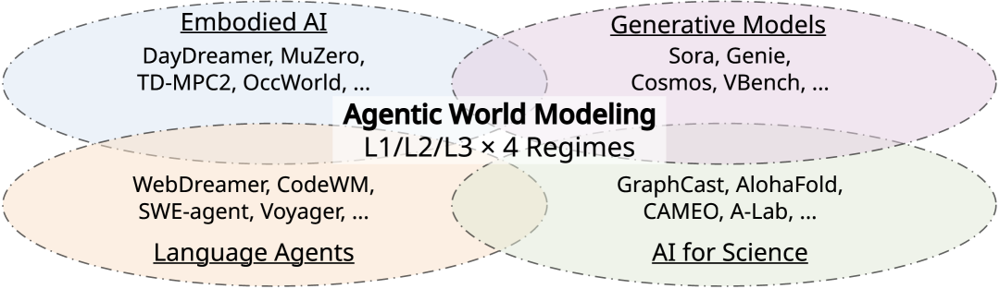
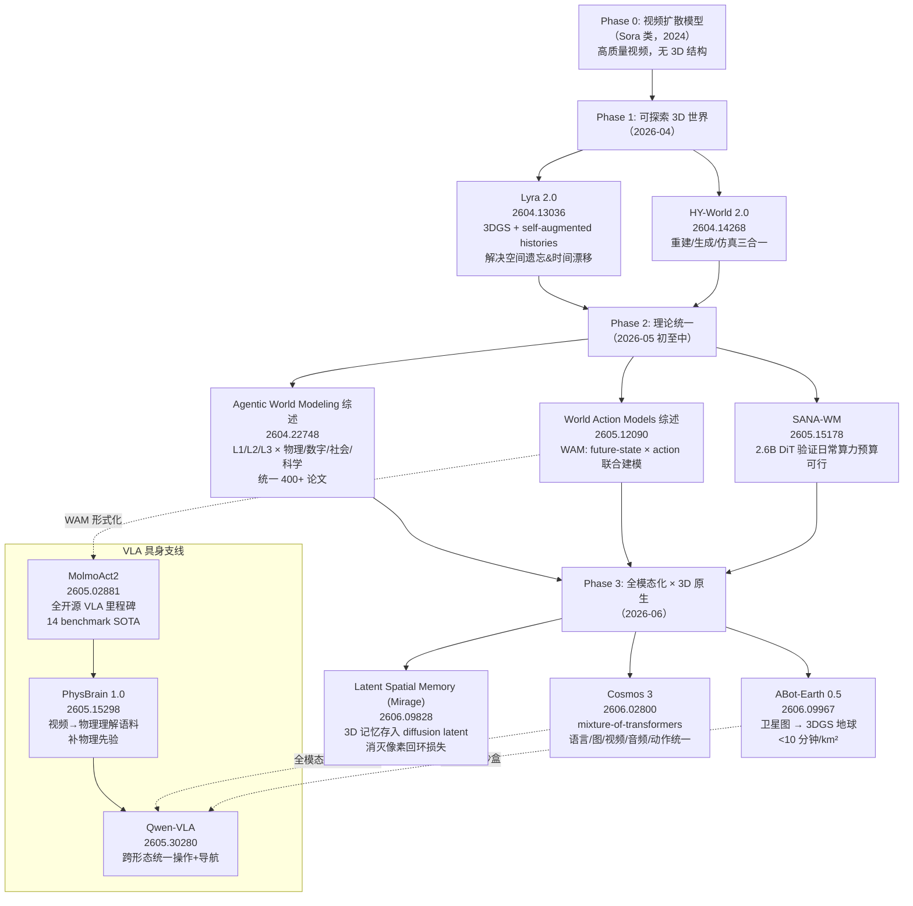

# 世界模型与具身演化

> **主线**：从"生成一段视频"到"创建可探索的持久 3D 世界"，再到物理驱动的具身 AI
> **时间跨度**：2026 年 4 月 ~ 6 月
> **所属专题**：[2026 上半年 AI 前沿演化谱系](../2026-06-12-ai-frontier-comprehensive.md)

---

## 1. 导读：这条线在解决什么根本问题

**视频生成**在 2024 年已经足够逼真，但逼真不等于有用。一段流畅的视频片段解决不了以下问题：

- 机器人需要的不是"看起来像厨房的视频"，而是能在其中 **操控物体、感知力反馈、规划轨迹** 的可交互环境；
- 自动驾驶和无人机需要的不是"好看的鸟瞰渲染"，而是有真实几何、可查询度量、能支持闭环仿真的 **3D 数字地球**；
- 科学仿真和社会模拟需要的不是下一帧预测，而是能 **追踪因果律、验证物理定律** 的世界模型。

这条主线回答的根本问题是：**如何让生成模型从"内容输出机"升级为"可决策、可探索、遵守物理律的世界"**。

演化路径可以归纳为三次拐点：

1. **拐点一（2026-04）**：3D 生成模型开始显式解决空间遗忘与时间漂移，从"生成一段视频"迈向"可探索世界"（Lyra 2.0、HY-World 2.0）；
2. **拐点二（2026-05）**：社区提出统一坐标系（L1/L2/L3 × 四律）打破碎片化叙事，WAM（World Action Models）把 VLA 与世界模型的边界正式打通；
3. **拐点三（2026-06）**：全模态化（Cosmos 3 mixture-of-transformers）和生成式 3D 地球（ABot-Earth 3DGS）同时落地，表征底座从像素转向显式 3D，Mirage 用 latent 空间空间记忆消灭像素回环损失。

VLA 具身支线与主线并行推进：MolmoAct2 打开"模型/代码/数据全开源"闸门，Qwen-VLA 实现跨形态统一，PhysBrain 1.0 补上物理先验缺口。

---

## 2. 演化时间线

| 阶段 | 代表工作 | arXiv | 突破点 | 局限 |
|------|---------|-------|-------|------|
| **Phase 0**（背景）| 视频扩散模型（Sora 类） | — | 高质量时序一致视频生成 | 无 3D 结构、不可探索、无物理律 |
| **Phase 1**（2026-04）| Lyra 2.0 | 2604.13036 | feed-forward 3DGS + self-augmented histories 解决空间遗忘与时间漂移 | 仅支持室外场景，长轨迹误差仍存 |
| **Phase 1**（2026-04）| HY-World 2.0 | 2604.14268 | 重建/生成/仿真三合一的多模态 3D 世界模型 | 细节未完全公开，评测标准不统一 |
| **Phase 2**（2026-05 初）| Agentic World Modeling 综述 | 2604.22748 | L1/L2/L3 能力 × 物理/数字/社会/科学四律二维分类法，统一 400+ 论文 | 分类法是描述性的，未给出从 L1 升 L3 的训练路径 |
| **Phase 2**（2026-05 中）| World Action Models 综述 | 2605.12090 | VLA × World Model 形式化为 WAM，联合建模 future-state × action | 形式化框架距实用 benchmark 仍有差距 |
| **Phase 2**（2026-05 中）| SANA-WM | 2605.15178 | 2.6B 混合线性 DiT，720p 分钟级世界模型，验证"日常算力预算"可行 | 分辨率与动态场景处理仍受限 |
| **Phase 3**（2026-06）| Cosmos 3 | 2606.02800 | 单一 mixture-of-transformers 统一语言/图/视频/音频/动作，RoboArena 最佳策略模型 | 开源后训练版本，全量预训练资源壁垒高 |
| **Phase 3**（2026-06）| ABot-Earth 0.5 | 2606.09967 | 卫星图直出 3DGS 地球，< 10 分钟/km²，190+ 国家 300+ 城市 | 几何精度 vs 渲染真实感 trade-off 未量化 |
| **Phase 3**（2026-06）| Latent Spatial Memory (Mirage) | 2606.09828 | 3D 记忆存入 diffusion latent 空间，消灭像素回环损失 | 对非结构化动态场景的泛化待验证 |
| **VLA 支线**（2026-05 初）| MolmoAct2 | 2605.02881 | 第一个模型/代码/数据全开源 VLA，14 个 benchmark SOTA | 主要验证在双臂/桌面场景，移动导航覆盖有限 |
| **VLA 支线**（2026-05 末）| Qwen-VLA | 2605.30280 | 单一 VLA 统一操作/导航跨任务、环境、机器人形态 | 跨形态泛化的边界条件未充分 ablation |
| **VLA 支线**（2026-05 中）| PhysBrain 1.0 | 2605.15298 | 视频 → 物理理解语料，补充 VLA 缺乏的物理先验 | 物理先验的覆盖范围仍以刚体为主 |

---

## 3. 分阶段详解

### Phase 1：从视频生成到可探索 3D 世界（2026 年 4 月）

**上一阶段遗留问题**：视频扩散模型（Sora 类）能生成流畅视频，但它们本质上是"图像序列生成器"——没有显式的 3D 结构，无法支持自由视角切换，更无法让 agent 在其中行走、操控物体。

Lyra 2.0（NVIDIA，arXiv: 2604.13036）是这一拐点的核心工作。它明确把问题定义为：在**长相机轨迹**下的两种退化——**空间遗忘**（spatial forgetting，模型遗忘了已访问区域的几何）和**时间漂移**（temporal drifting，生成结果随时间与初始场景偏移）。

Lyra 2.0 的方法论包含两个互补机制：

- **解决空间遗忘**：维护逐帧 3D 几何信息作为信息路由。检索相关历史帧并建立密集对应关系，同时依赖生成先验进行外观合成——相当于给生成模型加上了"空间日志"；
- **解决时间漂移**：使用 self-augmented histories 训练，把模型自身过去的生成结果作为训练输入，让模型学会纠正累积误差；
- **3D 渲染底座**：feed-forward 3D Gaussian Splatting（3DGS）实现实时渲染，无需 per-scene 优化。

HY-World 2.0（腾讯 HunYuan，arXiv: 2604.14268，110 票）与 Lyra 同步发布，走的是更宽泛的"重建/生成/仿真三合一"路线，支持多模态输入（文字、图像、视频）驱动 3D 世界创建。两者共同传递的信号是：**关键词从"生成一段视频"转变为"创建一个可探索的持久世界"**，这对 3D 一致性、空间记忆和时间连贯性的要求远高于单次生成。

这一阶段的局限：两个系统都在朝 3D 一致性努力，但评测标准仍沿用视频生成指标（FID/FVD），无法真正量化"世界的可探索性"。

---

### Phase 2：理论统一与形式化（2026 年 5 月初至中）

**上一阶段遗留问题**：World Model 概念在 RL、CV、Robotics、Language Agents、AI for Science 五个社区有完全不同的含义，同一工作在不同社区的定性判断天差地别，严重阻碍了协作与评测。

HKUST + NUS + Oxford 等 30+ 机构联合发布的 **Agentic World Modeling 综述**（arXiv: 2604.22748，224 票）是这个拐点的核心。它提出 **"三层能力 × 四律"二维分类法**，覆盖 400+ 论文：

**三层能力（L1 → L2 → L3）**：
- **L1 Predictor**：一步局部 Markov 转移（如 next-frame prediction、next-token prediction）
- **L2 Simulator**：多步 action-conditioned rollout，**必须遵守领域律**（机器人物理仿真、Web 状态机等）
- **L3 Evolver**：当预测失败时，**自主修正自己的模型**——真正的 closed-loop 科研发现

**四种"律"（Governing Laws）**：
- 物理律：感知/操作/导航 → 解析或仿真器可验证
- 数字律：程序语义、Web/GUI 状态机
- 社会律：信念、目标、规范、对话
- 科学律：潜在机制，**只能经验验证**（不像物理律可以用解析公式验证）

关键 framing：L1/L2/L3 不是模型类别，而是 **agent 在某一刻调用的能力**——同一系统在不同任务可调用不同 level。截至 2026 年 5 月，L3 Evolver 仍是极少数系统（Co-Scientist、AI Scientist）才能达到的水位线。

> 

与此综述互补，**World Action Models 综述**（WAM，arXiv: 2605.12090，56 票）在 5 月中发布，提供了另一个维度的形式化：把 VLA（Vision-Language-Action）和 World Model 统一为 WAM，联合建模 **future-state × action 联合分布**。这把两条此前分离的研究线（视频世界模型 vs 机器人控制）用同一个数学框架收敛，为后续 Cosmos 3 的全模态统一埋下理论基础。

**SANA-WM**（arXiv: 2605.15178）在这一阶段验证了"工业可用"路径的可行性：2.6B 混合线性 DiT，720p 分钟级视频生成，工业质量但显著降低算力需求，证明世界模型不必只是资源巨头的专利。

---

### Phase 3：全模态化 × 3D 原生表征（2026 年 6 月）

**上一阶段遗留问题**：理论框架有了，但实用系统仍是分散的——视频世界模型、图像生成、机器人控制、语言理解各用各的模型；3D 重建仍依赖昂贵的多视重建管线，无法大规模推进数字地球。

**Cosmos 3**（NVIDIA，arXiv: 2606.02800，115 票）是这一阶段最重要的基础模型发布。它用单一 **mixture-of-transformers** 架构，把以下能力收进同一框架：

- 语言理解与生成
- 图像生成（Text-to-Image）
- 视频生成（Image/Text-to-Video）
- 音频生成
- **物理 AI 动作**（world-action model）

后训练版本被 Artificial Analysis 评为**最佳开源 T2I / I2V 模型**，在 RoboArena 上成为**最佳开源策略模型**。Cosmos 3 的意义在于：它把 WAM 综述的"联合建模 future-state × action"从理论变成了可部署的模型——VLM、视频生成器、世界模拟器、动作模型不再是独立组件，而是同一个 transformer 的不同调用路径。

**ABot-Earth 0.5**（arXiv: 2606.09967，209 票）代表另一条技术路线：不追求"全模态统一架构"，而是把 3DGS 作为第一公民表征，直接在 3DGS 空间做生成式大规模地球建模。

核心技术贡献：

- **条件**：仅需地理参考的卫星影像，无需精确相机角度或多视重叠；
- **速度**：< 10 分钟/平方公里，已覆盖 190+ 国家 300+ 城市；
- **多 LOD**：内建多细节层次，可在 Web 地图引擎实时交互；
- **FromOrbit2Ground 模块**：Z-Monotonic SDF 从稀疏俯视恢复 watertight 城市几何，扩散修复网络合成高保真立面纹理，解决轨道俯视与地面渲染之间的极端视角鸿沟。

数据引擎四阶段：大规模多源影像采集 → ABot-3DGS 重建 → 空间分块 + 多视相机渲染产出训练 tile → tile/view/dataset 三级质量评估与筛选。

ABot-Earth 的定位不只是"好看的地球渲染"，而是**具身 AI 的高保真仿真沙盒**——无人机闭环导航、UAV 路径规划，需要的正是这种既有渲染真实感、又有几何结构的环境。

**Latent Spatial Memory / Mirage**（arXiv: 2606.09828，62 票）解决了视频世界模型里一个长期被忽视的损耗点：传统 3D 一致性方法在 **RGB 像素空间**维护显式点云记忆，存在两层损失——**空间索引贵**（存储和查询成本）、**像素回环丢特征**（feature 到 pixel 再到 feature 的往返重建有信息损失）。

Mirage 把 3D 记忆直接存进 **diffusion latent 空间**，用深度引导反投影建记忆、在 latent 空间 warp 合成新视角，消除像素重建的中间环节。这一思路与 Phase 1 Lyra 2.0 的"空间日志"形成了清晰的传承关系——Lyra 在像素空间维护历史帧，Mirage 把记忆直接下沉到更紧凑的 latent 表征。

三件事放在一起看：**Cosmos 3 + ABot-Earth + Mirage 共同完成了一次表征革命——世界模型的底座从像素/视频转向显式 3D（3DGS）和 diffusion latent，而 3DGS 因其对植被、立面、镜面水体等非流形拓扑的原生捕捉，正在成为户外场景的事实标准表征。**

---

### VLA 具身支线：从闭源到全开源再到跨形态统一

**起点问题**：2025 年末的 VLA 格局——π_0.5（Physical Intelligence）、Gemini Robotics 等前沿系统**模型/数据/训练 recipe 全闭源**，学术界无法在可比基线上做研究；开源 VLA 绑定昂贵硬件，微调后成功率仍低于可靠部署阈值。

**MolmoAct2**（Allen AI + UW，arXiv: 2605.02881，201 票）是这条支线的转折点，被称为"robotics 的 DeepSeek 时刻"——第一个**模型权重 + 训练代码 + 完整训练数据**全开源、且在 14 个 benchmark 全面 SOTA 的 VLA。

五轴改进让它区别于此前所有开源尝试：

- **Molmo2-ER VLM 后端**：specialize-then-rehearse 两阶段配方，3.3M 空间-具身语料，在 13 项 ER benchmark 中 9 项超越 GPT-5 + Gemini Robotics ER-1.5，平均 63.8%（比 Molmo2 +17 pp）；
- **三个开源数据集**：720h 双臂遥操（BimanualYAM，最大开源双臂数据集，$6000 标准化采集套件）+ 74,604 episodes DROID 子集 + SO-100/101 社区子集；
- **OpenFAST Tokenizer**：5 种本体百万轨迹，把 1 秒 32 维连续动作压成离散序列；
- **新架构**：Flow-matching 连续动作专家通过 per-layer KV-cache 嫁接到离散 token VLM；
- **MolmoAct2-Think**：自适应深度推理，只对场景变化区域重新预测 depth tokens，利用轨迹时间冗余降低延迟。

MolmoAct2 之后两周，**PhysBrain 1.0**（arXiv: 2605.15298，143 票）从另一个角度补上了 VLA 的缺口——物理先验。现有 VLA 大量学习操作轨迹，但很少直接学习物理规律（摩擦力、弹性碰撞、流体行为）。PhysBrain 1.0 把视频数据转化为"物理理解"语料，补充 VLA 模型的物理 grounding，使得模型在面对新材质、新刚体配置时泛化更稳。

**Qwen-VLA**（Qwen Team，arXiv: 2605.30280，140 票）在 6 月初发布，代表这条支线的最新前沿：**单一 VLA 统一操作/导航跨任务、环境、机器人形态**。这是对 WAM 综述"跨律联合建模"的直接实践——不再为每种机器人形态训练单独模型，而是用一个统一架构覆盖桌面操作、移动导航、不同本体（双臂、单臂、四足）。

具身支线的演化轨迹：
> 闭源垄断（π_0.5/Gemini）→ 全开源里程碑（MolmoAct2）→ 物理先验注入（PhysBrain）→ 跨形态统一（Qwen-VLA）

---

## 4. Mermaid 演化谱系图

---

## 5. 本线小结 + 与其他主线的交叉点

### 小结

这条主线的演化遵循了一个清晰的逻辑链：

**内容生成** → **3D 一致性** → **可探索持久世界** → **跨律联合建模（VLM+World+Action）** → **全模态统一 + 3D 原生表征**

每一步都在解决上一步留下的具体问题：视频生成缺乏 3D 结构 → Lyra/HY-World 用 3DGS 显式建模空间；各社区定义分裂 → Agentic World Modeling 综述提供坐标系；VLA 与世界模型是两套系统 → WAM/Cosmos 3 统一联合分布；数字地球获取成本高 → ABot-Earth 直接在 3DGS 空间学习卫星图到 3D 场景的映射；像素回环有信息损失 → Mirage 把记忆下沉到 latent。

截至 2026 年 6 月，**L3 Evolver**（能自主修正自身世界模型假设的系统）仍是极少数系统的能力，是下一个明确的技术水位线。

### 与其他主线的交叉点

| 交叉主线 | 交叉节点 | 具体关联 |
|---------|---------|---------|
| **Agent 体系** | Phase 2 Agentic World Modeling 综述 | L2/L3 World Model 是 agentic decision-making 的必要基础；ABot-Earth 的仿真沙盒直接服务于具身 agent 训练 |
| **Agent 体系** | Cosmos 3 world-action 模型 | Cosmos 3 的 RoboArena 最佳策略模型结果，是"世界模型 + agent 行动"在同一模型中的直接体现 |
| **自动科研系统** | Phase 2 L3 Evolver 定义 | Agentic World Modeling 综述把"自主修正世界假设"定义为 L3，与 AI Scientist 类自动科研系统的"发现-验证-修正"闭环直接对应 |
| **训练动态显微镜化** | Mirage latent 空间记忆 | 把 3D 记忆压到 latent 空间，本质是在 diffusion 的内部表征里做空间索引，与训练动态主线探讨的"更新发生在参数空间何处"有认识论上的共鸣 |
| **训练动态显微镜化** | MolmoAct2 Flow-matching 动作专家 | per-layer KV-cache 嫁接到离散 VLM 的架构设计，与训练动态主线探讨的 adapter/PEFT 收敛是同一议题的不同侧面 |

---

## References

1. [Lyra 2.0: Explorable Generative 3D Worlds](https://huggingface.co/papers/2604.13036) — arXiv: 2604.13036 | NVIDIA
2. [HY-World 2.0: A Multi-Modal World Model for Reconstructing, Generating, and Simulating 3D Worlds](https://huggingface.co/papers/2604.14268) — arXiv: 2604.14268 | 腾讯 HunYuan
3. [Agentic World Modeling: Foundations, Capabilities, Laws, and Beyond](https://huggingface.co/papers/2604.22748) — arXiv: 2604.22748 | HKUST + NUS + Oxford 等 30+ 机构
4. [World Action Models: The Next Frontier in Embodied AI](https://huggingface.co/papers/2605.12090) — arXiv: 2605.12090
5. [SANA-WM: Efficient Minute-Scale World Modeling with Hybrid Linear Diffusion Transformer](https://huggingface.co/papers/2605.15178) — arXiv: 2605.15178
6. [Cosmos 3: Omnimodal World Models for Physical AI](https://huggingface.co/papers/2606.02800) — arXiv: 2606.02800 | NVIDIA
7. [ABot-Earth 0.5: Generative 3D Earth Model](https://huggingface.co/papers/2606.09967) — arXiv: 2606.09967
8. [Latent Spatial Memory for Video World Models](https://huggingface.co/papers/2606.09828) — arXiv: 2606.09828
9. [MolmoAct2: Action Reasoning Models for Real-world Deployment](https://huggingface.co/papers/2605.02881) — arXiv: 2605.02881 | Allen AI + UW
10. [PhysBrain 1.0 Technical Report](https://huggingface.co/papers/2605.15298) — arXiv: 2605.15298
11. [Qwen-VLA: Unifying Vision-Language-Action Modeling across Tasks, Environments, and Robot Embodiments](https://huggingface.co/papers/2605.30280) — arXiv: 2605.30280 | Qwen Team
12. [WorldMark: A Unified Benchmark for Interactive Video World Models](https://huggingface.co/papers/2604.21686) — arXiv: 2604.21686（背景基准工作）

---

*本文属于 [2026 上半年 AI 前沿演化谱系](../2026-06-12-ai-frontier-comprehensive.md) 专题 · 最后更新: 2026-06-12*
