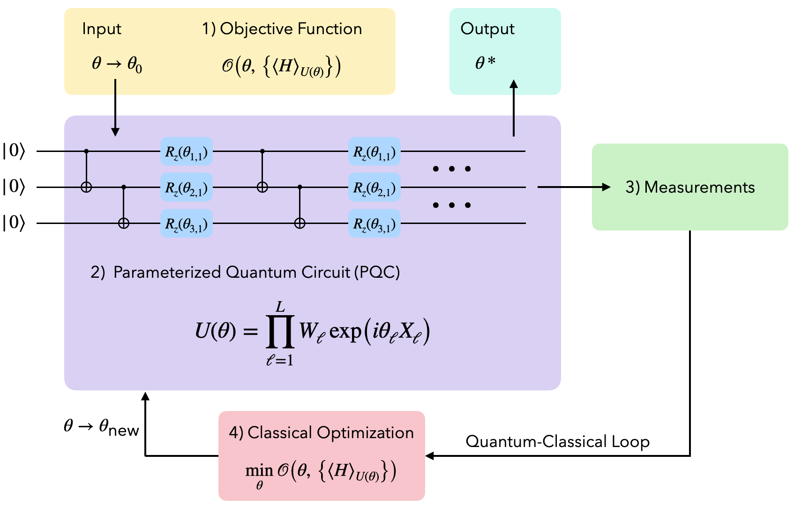
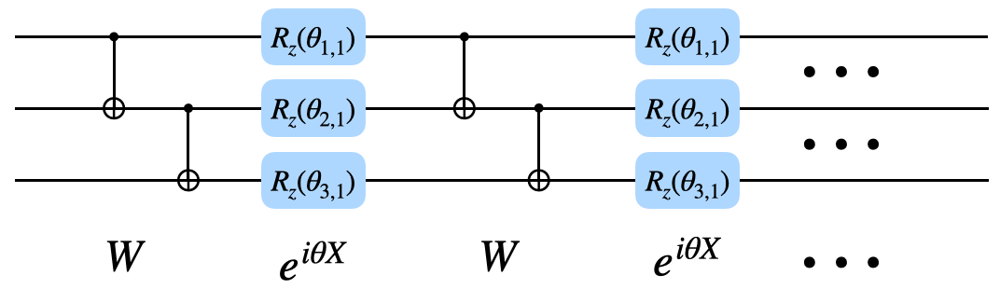
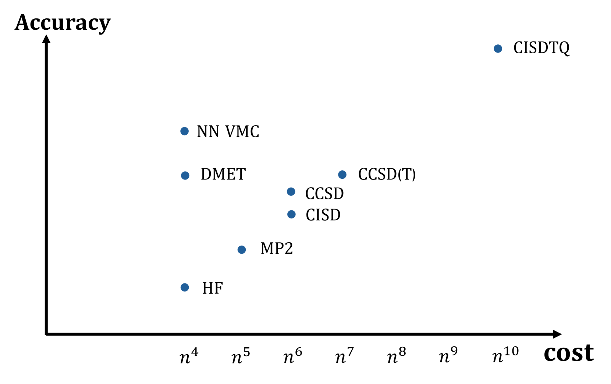
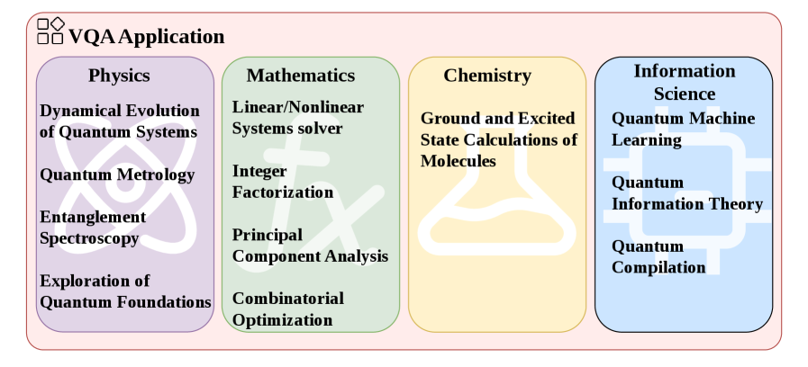

# 量子算法与应用

- **Date:** 2026-04-15
- **Tags:** quantum-computing, Shor, Grover, VQE, QAOA, QML, BQP

## Context

本文基于以下论文综述量子算法的核心概念、主要算法类型及其应用前景：

- Dalzell et al., "Quantum algorithms: A survey of applications and end-to-end complexities" (arXiv:2310.03011) — 全面的量子算法应用与端到端复杂度综述
- Wang et al., "A Review of Variational Quantum Algorithms: Insights into Fault-Tolerant Quantum Computing" (arXiv:2604.07909) — 变分量子算法最新综述 (2026)
- Wang & Liu, "A comprehensive review of Quantum Machine Learning: from NISQ to Fault Tolerance" (arXiv:2401.11351) — 量子机器学习综合评述
- Zhang et al., "Fault-tolerant quantum algorithms for quantum molecular systems: A survey" (arXiv:2502.02139) — 容错量子算法综述
- Aaronson et al., "The Acrobatics of BQP" (arXiv:2111.10409) — BQP 复杂度类关系研究
- Liu et al., "CNOT-count optimized quantum circuit of the Shor's algorithm" (arXiv:2112.11358) — Shor 算法电路优化
- Lomonaco, "Grover's quantum search algorithm" (arXiv:quant-ph/0010040) — Grover 算法教程
- Giovagnoli, "An Introduction to the Quantum Approximate Optimization Algorithm" (arXiv:2511.18377) — QAOA 入门教程
- Montanaro, "Quantum algorithms: an overview" (arXiv:1511.04206) — 量子算法概览

---

## 一、经典算法 vs 量子算法：复杂度视角

### BQP 的定义

**BQP** (Bounded-Error Quantum Polynomial-Time) 是量子计算理论中的核心复杂度类，由 Bernstein 和 Vazirani 于 1993 年定义，指在多项式时间内由量子算法以有界错误概率可解的判定问题类 [5]。

### BQP 与经典复杂度类的关系

Aaronson、Ingram 和 Kretschmer [5] 在 "The Acrobatics of BQP" 中系统研究了 BQP 与经典复杂度类的关系，提出了三个核心开放问题：

1. **BQP vs BPP**：量子计算机能否高效解决经典计算机无法解决的问题？即 $\mathsf{BPP} = \mathsf{BQP}$？
2. **BQP vs NP**：量子计算机能否在多项式时间内解决 NP-complete 问题？即 $\mathsf{NP} \subseteq \mathsf{BQP}$？
3. **BQP 的经典上界**：BQP 是否包含在 NP 或多项式层级 (PH) 中？

该工作基于 Raz 和 Tal 2018 年的突破性成果——存在一个 oracle 使得 $\mathsf{BQP} \not\subset \mathsf{PH}$——进一步证明了多个 oracle 分离结果，包括存在 oracle 使得 $\mathsf{NP}^{\mathsf{BQP}} \not\subset \mathsf{BQP}^{\mathsf{PH}}$，以及其逆向 $\mathsf{BQP}^{\mathsf{NP}} \not\subset \mathsf{PH}^{\mathsf{BQP}}$ [5]。这些结果表明，在 black-box 设定下，BQP 的计算能力与 NP 存在本质性的"解耦" (decoupling)，量子计算并非简单地包含于经典复杂度层级之中。

### 已知关系

目前已知的包含关系为 $\mathsf{P} \subseteq \mathsf{BPP} \subseteq \mathsf{BQP} \subseteq \mathsf{PP} \subseteq \mathsf{PSPACE}$ [1, 5]。普遍认为 BQP 严格大于 BPP（即量子计算提供超越经典随机计算的能力），但这尚未被证明。同时，广泛认为 BQP 不包含 NP-complete 问题——换言之，量子计算机可能无法高效解决所有 NP-hard 问题 [1]。

---

## 二、Shor 算法：整数分解与 RSA 威胁

### 核心思想

Shor 算法 (Shor, 1994) 是量子计算领域最具影响力的算法之一，它将整数分解问题从经典的亚指数时间 $O(\exp(n^{1/3}))$ 降低到量子多项式时间 $O(n^3)$（其中 $n$ 为待分解整数的位数）[1, 4]。

算法的核心步骤包括 [6]：

1. **问题转化**：将整数分解归约为**求阶** (order-finding) 问题——给定 $N$ 和与 $N$ 互素的 $a$，求最小正整数 $r$ 使得 $a^r \equiv 1 \pmod{N}$
2. **量子傅里叶变换 (QFT)**：利用量子并行性同时计算模幂运算 $a^x \bmod N$ 的叠加态，再通过 QFT 提取周期 $r$
3. **经典后处理**：利用连分数算法从测量结果中提取 $r$，再通过 $\gcd(a^{r/2} \pm 1, N)$ 获得因子

### 电路资源需求

Liu 等人 [6] 对 Shor 算法的量子电路进行了 CNOT 门数优化。对于分解 $n$ 位整数，他们的优化电路需要约 $217 \frac{n^3}{\log_2 n} + 4n^2 + n$ 个 CNOT 门。基于此，他们分析了在离子阱量子计算机上运行 Shor 算法的可行性和运行时间 [6]。

### RSA 安全性影响

Shor 算法对现代公钥密码体系（如 RSA）构成了根本性威胁。RSA 的安全性依赖于大整数分解的计算困难性；一旦大规模容错量子计算机实现，当前使用的 RSA-2048 等密码系统将不再安全 [1, 4]。这推动了后量子密码学 (post-quantum cryptography) 的发展。

---

## 三、Grover 算法：无结构搜索加速

### 算法原理

Grover 算法 (Grover, 1996) 解决**无结构搜索问题**：在 $N$ 个无序元素的数据库中查找满足特定条件的目标元素。经典算法需要 $O(N)$ 次查询，而 Grover 算法仅需 $O(\sqrt{N})$ 次——实现了二次加速 (quadratic speedup) [7, 1]。

Lomonaco [7] 详细描述了算法的核心步骤：

1. **初态准备**：将所有量子比特置于均匀叠加态 $|\psi\rangle = \frac{1}{\sqrt{N}} \sum_{x=0}^{N-1} |x\rangle$
2. **Oracle 反转**：对目标态施加相位翻转 $|x\rangle \mapsto -|x\rangle$（对满足搜索条件的 $x$）
3. **均值反转 (inversion about the mean)**：关于平均振幅进行反射操作 $I_{|\psi\rangle} = 2|\psi\rangle\langle\psi| - I$
4. **迭代**：重复步骤 2-3 约 $\frac{\pi}{4}\sqrt{N}$ 次后测量

### 最优性

Grover 算法的 $O(\sqrt{N})$ 查询复杂度已被证明是量子计算对无结构搜索问题所能达到的最优界 [1]。这意味着对于完全无结构的问题，量子计算最多只能提供二次加速，而非指数加速。

### 应用扩展

Grover 搜索框架可广泛应用于组合优化、约束满足、密码分析等问题。例如，它可以将暴力搜索对称密钥密码 (如 AES) 的时间从 $2^n$ 降至 $2^{n/2}$，这也是 NIST 建议将对称密钥长度加倍以应对量子威胁的原因 [1]。

---

## 四、变分量子算法 (VQE / QAOA)

变分量子算法 (VQAs) 是 NISQ 时代的核心算法框架，通过将参数化量子电路 (PQCs) 与经典优化器耦合，在当前有限的量子硬件上实现有意义的量子计算 [2, 3]。

### 4.1 变分量子本征求解器 (VQE)

VQE 由 Peruzzo 等人于 2014 年提出 [2]，是 NISQ 时代最重要的量子化学算法：

**核心思想**：利用量子变分原理 $E_0 \leq \langle\psi(\theta)|H|\psi(\theta)\rangle$，通过参数化量子电路准备试探波函数 $|\psi(\theta)\rangle$，经典优化器调整参数 $\theta$ 以最小化能量期望值。

**工作流程** [2, 4]：
1. 在量子处理器上制备参数化的 ansatz 态 $|\psi(\theta)\rangle$
2. 测量 Hamiltonian $H$ 的期望值 $\langle H \rangle$（通过将 $H$ 分解为 Pauli 字符串之和 $H = \sum_p \alpha_p \hat{\sigma}_p$）
3. 经典优化器根据测量结果更新参数 $\theta$
4. 迭代直至收敛

**Ansatz 设计**是 VQE 性能的关键 [2]。主要策略包括：
- **化学启发型 ansatz** (如 UCCSD)：基于酉耦合簇理论，保证化学精度但电路较深
- **硬件高效型 ansatz**：针对特定量子硬件的本征门集设计，电路浅但可能缺乏问题特异性
- **自适应 ansatz** (如 ADAPT-VQE)：迭代构建电路，平衡精度与深度

VQE 已在超导处理器 [2]、离子阱平台和光子架构上进行了实验验证。

### 4.2 量子近似优化算法 (QAOA)

QAOA 由 Farhi 等人于 2014 年提出 [2, 8]，是解决组合优化问题的核心量子算法：

**核心思想**：交替施加问题 Hamiltonian $H_C$（编码目标函数）和混合 Hamiltonian $H_M$（通常为横场 $\sum_i X_i$），有效地离散化了绝热量子演化 [2]。

Giovagnoli [8] 给出了 QAOA 的详细框架：

**电路结构**：$p$ 层 QAOA 电路为
$$|\gamma, \beta\rangle = \prod_{l=1}^{p} e^{-i\beta_l H_M} e^{-i\gamma_l H_C} |+\rangle^{\otimes n}$$

其中 $\gamma = (\gamma_1, \ldots, \gamma_p)$ 和 $\beta = (\beta_1, \ldots, \beta_p)$ 为待优化参数 [8]。

**应用领域**：QAOA 主要用于 QUBO (Quadratic Unconstrained Binary Optimization) 问题，包括 MaxCut、旅行商问题、调度问题等 [8]。Giovagnoli 还证明了 QAOA 能量景观具有对称性和周期性，可以有效减小参数搜索空间 [8]。

### 4.3 Barren Plateau 问题

Barren plateau 是 VQAs 面临的核心训练瓶颈 [2, 3]：损失函数的梯度随系统规模指数衰减，导致优化几乎不可能。

Wang & Liu [3] 总结了 barren plateau 的多种成因：
- **高度随机的 ansatz**：当变分电路近似 $k$-design 时，损失函数导数被 Hilbert 空间维度抑制
- **全局代价函数**：基于全局可观测量的代价函数即使在浅电路中也会导致 barren plateau；局部可观测量可缓解此问题
- **过度纠缠**：QNN 产生过多纠缠时，可见量子比特的约化态趋近最大混合态

Wang et al. [2] 进一步总结了缓解策略：
- 巧妙的参数初始化
- 利用张量网络进行经典预训练 (warm-start)
- 量子卷积神经网络 (QCNNs) 天然免疫 barren plateau
- 量子架构搜索 (QAS) 自动设计可训练电路

---

## 五、量子模拟

量子模拟被认为是量子计算最有前景的应用方向之一 [4, 1]。

### 5.1 Hamiltonian 模拟

Hamiltonian 模拟的目标是在量子计算机上近似实现时间演化算子 $U = e^{-iHt}$ [4]。Zhang et al. [4] 综述了主要方法：

**Product Formula (Trotter-Suzuki 分解)**：将 Hamiltonian $H = \sum_{l=1}^{L} H_l$ 的时间演化近似为各项分别演化的乘积 [4]：

- 一阶 Trotter 公式：$S_1(x) = \prod_{l=1}^{L} e^{-ixH_l}$
- 二阶 Trotter 公式进一步提高精度
- 高阶 Suzuki 递推可达到任意阶精度

**其他先进方法** [4]：
- **Taylor 级数展开**：将时间演化展开为 Taylor 级数并通过线性组合酉算子 (LCU) 实现
- **Qubitization**：利用量子信号处理 (QSP) 实现渐近最优的 Hamiltonian 模拟
- **自适应与变分 product formula**：适合近期量子设备的灵活方法

### 5.2 量子化学应用

量子化学是量子模拟的旗舰应用 [4, 2]。核心问题是求解电子结构 Hamiltonian（Born-Oppenheimer 近似下）：

$$H = -\sum_i \frac{\nabla_i^2}{2} - \sum_i \frac{Z_I}{|r_i - R_I|} + \sum_{i,j} \frac{1}{|r_i - r_j|}$$

Zhang et al. [4] 指出，经典计算求解此问题面临指数级困难（对于强关联系统），而量子计算机可通过以下路径获得优势：

- **量子相位估计 (QPE)**：给定能够准确实现受控量子演化 $U = e^{-iHt}$ 和与目标本征态有非平凡重叠的初态，QPE 可以达到 Heisenberg 极限 $O(\varepsilon^{-1})$ 的能量估计精度 [4]
- **VQE**：在 NISQ 设备上通过变分方法近似基态能量 [2, 4]

然而，近期量子算法面临训练困难、barren plateau 和量子纠错开销等挑战 [4]。量子优势是否能在电子结构问题中实现，仍是一个悬而未决的问题 [4]。

### 5.3 多体物理模拟

VQA 框架已广泛应用于多体物理模拟，包括 [2]：
- 量子自旋模型的基态求解
- 凝聚态物理中的相变研究
- 量子电池电解质的激发态计算（VQE-qEOM 方法）

---

## 六、量子机器学习 (QML)

### 6.1 QML 的动机

Wang & Liu [3] 指出 QML 的核心动机：经典机器学习严重依赖线性代数操作，而量子力学本质上建立在 Hilbert 空间的线性代数之上。HHL 算法 (Harrow-Hassidim-Lloyd) 在特定条件下（稀疏性、容错、小条件数、高效量子-经典接口）可将矩阵求逆从 $O(N \log N)$ 加速到 $O((\log N)^2)$ [3]。

### 6.2 NISQ 时代的 QML 模型

Wang et al. [2] 综述了基于 VQA 的 QML 模型：

**监督学习**：
- 变分量子模型 (VQM) 和量子电路学习 (QCL) 实现了早期的二分类任务
- 量子卷积神经网络 (QCNNs) 因天然免疫 barren plateau 而成为重要方向
- 量子图神经网络和变分影子量子学习 (VSQL) 用于高效特征提取

**无监督学习**：
- 量子电路 Born 机 (QCBM) 利用波函数的概率性质建模数据分布
- 量子自编码器 (QAEs) 用于降维

**半监督学习**：
- 量子生成对抗网络 (QGANs) 将对抗框架适配到变分量子电路

### 6.3 Quantum Kernel 方法

量子核方法将经典数据通过量子特征映射 $\phi(x)$ 嵌入到量子 Hilbert 空间，利用量子态的内积定义核函数 $K(x, x') = |\langle\phi(x)|\phi(x')\rangle|^2$ [3]。然而，Wang & Liu [3] 警告说噪声会影响量子核的性能，导致特征被指数级抑制，有效降低量子特征空间的维度。

### 6.4 Barren Plateau 与 QML 的未来

Wang & Liu [3] 提出了一个有趣的观察：量子噪声在某些情况下可能对 VQA 有益——类似于经典随机梯度下降中噪声帮助避免鞍点的现象。实验发现有噪声的情形有时优于无噪声情形，这意味着对某些 QML 应用，消除所有噪声可能并非必要，只要噪声低于某个阈值即可 [3]。

---

## 七、算法对比总结

| 算法 | 问题类型 | 量子加速 | 量子比特需求 | 硬件要求 | 来源 |
|------|---------|---------|------------|---------|------|
| Shor | 整数分解 | 指数加速 ($O(n^3)$ vs 亚指数) | $\sim 2n$ 逻辑量子比特 | 容错量子计算 | [1, 6] |
| Grover | 无结构搜索 | 二次加速 ($O(\sqrt{N})$ vs $O(N)$) | $O(\log N)$ | 容错量子计算 | [1, 7] |
| VQE | 基态能量估计 | 启发式/未证明 | 与分子轨道数相当 | NISQ 兼容 | [2, 4] |
| QAOA | 组合优化 | 启发式/未证明 | 与问题变量数相当 | NISQ 兼容 | [2, 8] |
| QPE | 本征值估计 | Heisenberg 极限 $O(\varepsilon^{-1})$ | 取决于问题 | 容错量子计算 | [4] |
| HHL | 线性方程组 | 指数加速（特定条件下） | $O(\log N)$ | 容错量子计算 | [3] |
| Hamiltonian 模拟 | 量子动力学 | 指数加速（vs 经典模拟） | 与系统大小线性 | 容错/早期容错 | [4] |

---

## 八、趋势与展望

1. **从 NISQ 到容错**：Wang et al. [2] 指出量子计算正从 NISQ 时代（$10^{-3}$ 级错误率）过渡到早期容错 (EFT) 时代，最终走向完全容错 (FT) 量子计算（$10^{-9}$ 级逻辑错误率）。VQA 在此过程中的角色正在被重新评估。

2. **经典去量子化的挑战**：Zhang et al. [4] 强调，量子优势的前景受到 dequantization（量子启发经典算法）和经典模拟技术进步的制约。对于量子化学问题，量子优势是否真正可实现仍是开放问题。

3. **硬件实验进展**：多个平台已展示了迈向容错量子计算的具体步骤，包括小规模逻辑量子比特的实现、重复综合征提取和基本逻辑操作 [2]。

4. **QML 的前景**：Wang & Liu [3] 指出 QML 仍处于早期阶段，关键挑战包括输入/输出问题、barren plateau、以及噪声对可训练性的影响。量子纠错的进步和更好的 inductive bias 设计是突破的关键。

---

## Open Questions

- BQP 与 NP 的确切关系能否在非 oracle 模型下解决？ [5]
- VQA 能否在实际问题上展示超越经典的量子优势？ [2, 4]
- 量子化学中的量子优势边界在哪里——哪些分子系统真正需要量子计算？ [4]
- Barren plateau 问题是否存在通用的解决方案？ [2, 3]
- 后量子密码学标准能否在大规模量子计算机出现之前完成部署？ [1]

---

## References

- [1] Montanaro, "Quantum algorithms: an overview", arXiv:1511.04206
- [2] Wang et al., "A Review of Variational Quantum Algorithms: Insights into Fault-Tolerant Quantum Computing", arXiv:2604.07909
- [3] Wang & Liu, "A comprehensive review of Quantum Machine Learning: from NISQ to Fault Tolerance", arXiv:2401.11351
- [4] Zhang et al., "Fault-tolerant quantum algorithms for quantum molecular systems: A survey", arXiv:2502.02139
- [5] Aaronson, Ingram & Kretschmer, "The Acrobatics of BQP", arXiv:2111.10409
- [6] Liu, Yang & Yang, "CNOT-count optimized quantum circuit of the Shor's algorithm", arXiv:2112.11358
- [7] Lomonaco, "Grover's quantum search algorithm", arXiv:quant-ph/0010040
- [8] Giovagnoli, "An Introduction to the Quantum Approximate Optimization Algorithm", arXiv:2511.18377
- [9] Dalzell et al., "Quantum algorithms: A survey of applications and end-to-end complexities", arXiv:2310.03011
