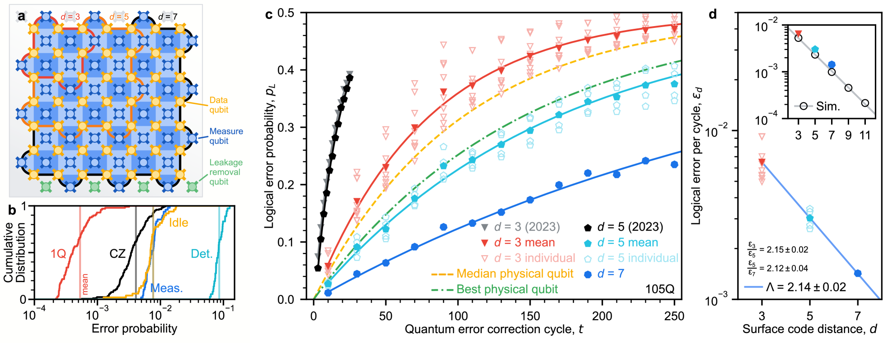
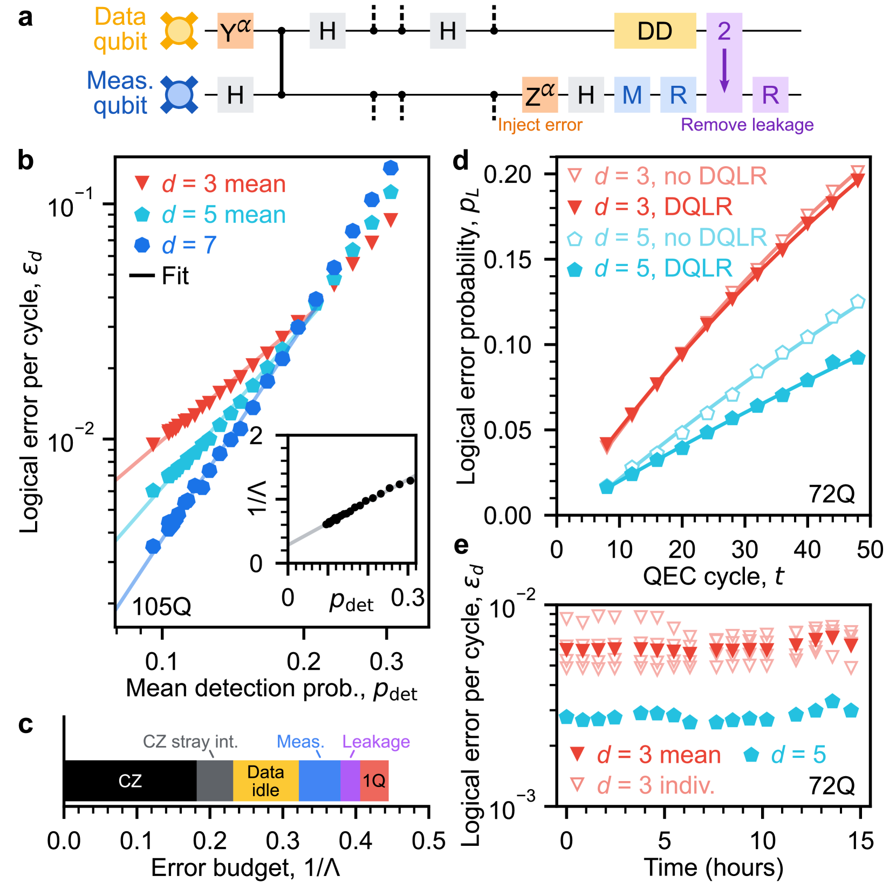
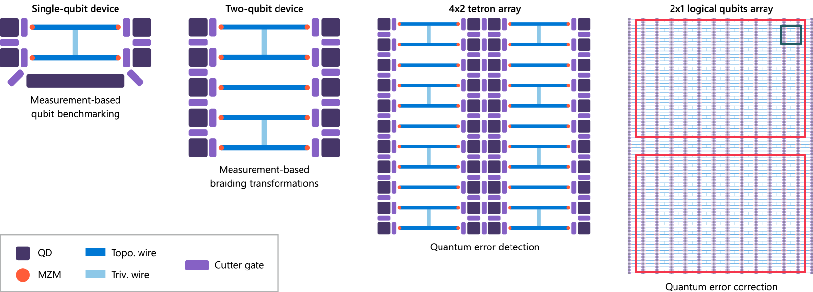
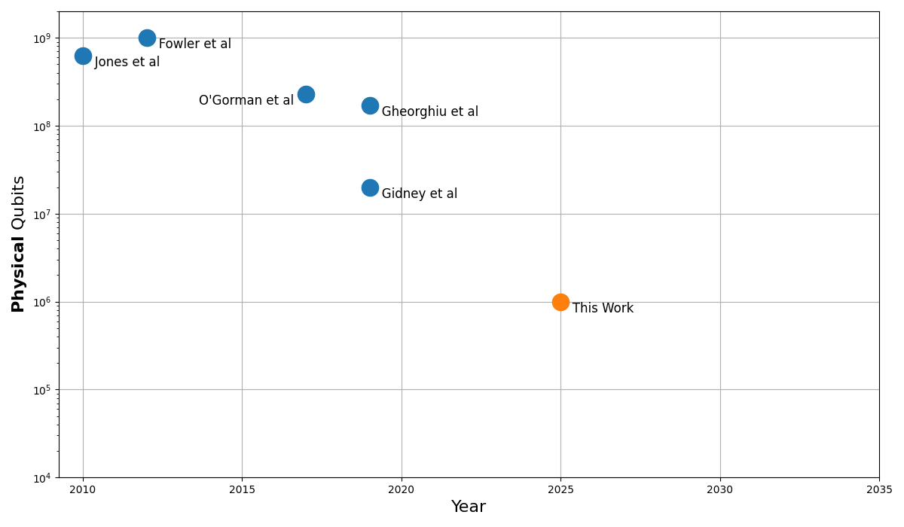

# 量子纠错与容错计算

- **Date:** 2026-04-15
- **Tags:** quantum-computing, QEC, surface-code, LDPC, fault-tolerant, Willow

## Context

本文基于以下核心论文整理量子纠错 (Quantum Error Correction, QEC) 与容错量子计算的关键概念与最新进展：

- Google Quantum AI, "Quantum error correction below the surface code threshold" (arXiv:2408.13687, 2024) [1]
- Gottesman, "Stabilizer Codes and Quantum Error Correction" (arXiv:quant-ph/9705052, 1997) [2]
- Panteleev & Kalachev, "Asymptotically Good Quantum and Locally Testable Classical LDPC Codes" (arXiv:2111.03654, 2021) [3]
- Gidney, "How to factor 2048 bit RSA integers with less than a million noisy qubits" (arXiv:2505.15917, 2025) [4]
- Gidney & Ekera, "How to factor 2048 bit RSA integers in 8 hours using 20 million noisy qubits" (arXiv:1905.09749, 2019) [5]
- Katabarwa et al., "Early Fault-Tolerant Quantum Computing" (arXiv:2311.14814, 2023) [6]
- Bradshaw et al., "Introduction to Quantum Error Correction with Stabilizer Codes" (arXiv:2507.07121, 2025) [7]
- Microsoft et al., "Roadmap to fault tolerant quantum computation using topological qubit arrays" (arXiv:2502.12252, 2025) [8]
- Paetznick, da Silva et al., "Demonstration of logical qubits and repeated error correction with better-than-physical error rates" (arXiv:2404.02280, 2024) [9]
- Dinur et al., "Good Quantum LDPC Codes with Linear Time Decoders" (arXiv:2206.07750, 2022) [10]
- Steane, "Efficient fault-tolerant quantum computing" (arXiv:quant-ph/9809054, 1998) [11]

---

## 一、为什么需要量子纠错？

### 量子比特的脆弱性

经典计算机中的比特是 0 或 1，本质上具有鲁棒性。但量子比特 (qubit) 处于叠加态 $\alpha|0\rangle + \beta|1\rangle$，极其脆弱。Google Quantum AI 在其 Willow 论文中指出：当前最先进的多量子比特平台刚刚实现 99.9% 的纠缠门保真度 (entangling gate fidelity)，但许多实际应用需要低于 $10^{-10}$ 的错误率——两者之间差距达 **7 个数量级** [1]。

### 不可克隆定理 (No-Cloning Theorem)

经典纠错的基本策略是冗余复制：把一个比特复制三份，通过多数投票纠错。但量子力学的不可克隆定理禁止复制未知量子态 [7]，因此不能简单地复制量子比特来保护信息。这正是量子纠错成为一个独立且困难的研究领域的根本原因。

### 退相干 (Decoherence) 与噪声

量子比特与环境的相互作用会导致退相干——量子叠加逐渐丧失。Google Willow 实验中测得的物理量子比特 $T_1$ 寿命中位数仅为 85 $\mu$s [1]。在如此短暂的相干时间内，需要执行海量量子门操作来完成有用计算，错误不可避免地积累。

---

## 二、量子纠错基础：稳定子码 (Stabilizer Codes)

### 核心思想

量子纠错的突破性框架由 Gottesman 于 1997 年提出 [2]。稳定子码 (stabilizer code) 利用群论结构，将量子信息编码到多个物理量子比特构成的子空间中。

一个 $[[n, k, d]]$ 稳定子码将 $k$ 个逻辑量子比特编码在 $n$ 个物理量子比特上，最小距离为 $d$，可以纠正最多 $\lfloor(d-1)/2\rfloor$ 个任意单量子比特错误 [2, 7]。

### 综合征测量 (Syndrome Measurement)

关键创新在于：我们不需要直接测量（从而破坏）量子态来检测错误。通过测量称为 "稳定子" (stabilizer) 的算符，可以提取关于错误的信息（综合征），而不扰动被编码的逻辑信息。这些稳定子是 Pauli 群的张量积元素，如 $X \otimes X \otimes I \otimes I$ 等 [7]。

### 经典码的量子推广：CSS 码

Calderbank-Shor-Steane (CSS) 码是稳定子码的重要子类，可以从两个经典线性码系统化地构造量子码。7 量子比特 Steane 码 $[[7,1,3]]$ 是其经典代表，可纠正单个量子比特的任意错误 [7, 11]。

---

## 三、表面码 (Surface Code)

### 为什么是表面码？

表面码 (surface code) 是目前最受关注的量子纠错码家族。由 Kitaev (2003) 和 Dennis et al. (2002) 提出的拓扑量子存储方案，其核心优势在于 [1]：

1. **几何局部性**：仅需最近邻量子比特间的相互作用，与超导量子比特的平面网格架构天然兼容
2. **较高的阈值**：容错阈值 (threshold) 约为 ~1%，是已知最高的码之一
3. **高效解码**：存在多项式时间的最小权重完美匹配 (MWPM) 解码算法

### 阈值定理 (Threshold Theorem)

表面码的核心数学关系为 [1]：

$$\varepsilon_d \propto \left(\frac{p}{p_{\text{thr}}}\right)^{(d+1)/2}$$

其中 $d$ 为码距 (code distance)，$p$ 为物理错误率，$p_{\text{thr}}$ 为阈值错误率，$\varepsilon_d$ 为逻辑错误率。当 $p \ll p_{\text{thr}}$ 时，逻辑错误率随码距指数级衰减。

距离为 $d$ 的表面码需要 $2d^2 - 1$ 个物理量子比特来编码一个逻辑量子比特 [1]。例如：

| 码距 $d$ | 物理量子比特数 | 可纠正错误数 |
|---------|-------------|-----------|
| 3       | 17          | 1         |
| 5       | 49          | 2         |
| 7       | 97          | 3         |
| 27      | 1457        | 13        |

### 当前局限

表面码的编码率 (encoding rate) 很低：$k/n \to 0$（$n$ 增大时）。编码单个逻辑量子比特需要大量物理量子比特，这驱动了对更高效码的研究。

---

## 四、LDPC 码与近期突破

### 量子 LDPC 码

量子低密度奇偶校验 (quantum Low-Density Parity-Check, qLDPC) 码是克服表面码低编码率的重要方向。经典 LDPC 码在通信中广泛应用（如 5G 标准），其量子版本同样追求高编码率与大码距。

### Panteleev-Kalachev 突破

2021 年，Panteleev 和 Kalachev 证明了 **qLDPC 猜想**：存在渐近好 (asymptotically good) 的量子 LDPC 码族，即编码率 $k/n$ 和相对距离 $d/n$ 均为常数 [3]。这是量子编码理论的里程碑结果，证明可以用线性增长的物理资源来保护线性增长的逻辑信息。

他们的构造使用了非交换群上的 lifted product 方法：对于码长 $N$ 的码，同时实现了 $k = \Theta(N)$ 和 $d = \Theta(N)$，这在此前被认为是量子 LDPC 码不可能做到的 [3]。

### 进一步发展

2022 年，Dinur, Hsieh, Lin 和 Vidick 构造了具有 **线性时间解码器** 的好量子 LDPC 码族 [10]，基于 left-right Cayley 复形 (left-right Cayley complex) 和随机码的张量积。这解决了好 qLDPC 码能否被高效解码的问题。

### 与表面码的对比

| 特性 | 表面码 | qLDPC 码 |
|------|-------|---------|
| 编码率 $k/n$ | $O(1/n)$ | $\Theta(1)$ |
| 相对距离 $d/n$ | $O(1/\sqrt{n})$ | $\Theta(1)$ |
| 连接性要求 | 最近邻 | 非局部 |
| 解码难度 | 高效 (MWPM) | 高效 (BP-OSD 等) [10] |
| 实验可行性 | 已验证 | 尚在探索 |

---

## 五、逻辑量子比特 vs 物理量子比特

### 开销比 (Overhead Ratio)

容错量子计算的核心挑战是物理资源开销。以表面码为例 [1]：

- **distance-7 码**：101 个物理量子比特编码 1 个逻辑量子比特（49 个数据 + 48 个测量 + 4 个泄漏移除）
- **达到 $10^{-6}$ 错误率**：需要 distance-27 码，即约 **1457 个物理量子比特/逻辑量子比特** [1]

Steane (1998) 曾估计，在门错误率约 $10^{-5}$ 时，量子计算机仅需比其内含的逻辑机器大一个数量级——例如扩展约 22 倍就足以进行大规模量子算法 [11]。但这一乐观估计基于高效码的使用。

### 超越损益平衡 (Break-Even)

一个关键里程碑是逻辑量子比特的寿命超过其组成物理量子比特中最好的一个。Google Willow 实验中 [1]：

- 物理量子比特寿命中位数：$85 \pm 7$ $\mu$s
- 物理量子比特寿命最佳值：$119 \pm 13$ $\mu$s
- **distance-7 逻辑量子比特寿命**：$291 \pm 6$ $\mu$s
- 超越最佳物理量子比特 **$2.4 \pm 0.3$ 倍**

---

## 六、Google Willow：低于阈值的量子纠错

### 实验平台

Google Quantum AI 使用其 105 量子比特超导处理器（Willow 芯片），基于 transmon 量子比特，实现了表面码首次在阈值以下的运行 [1]。处理器特性：

- 平均 $T_1 = 68$ $\mu$s，$T_{2,\text{CPMG}} = 89$ $\mu$s
- 纠错周期时间 1.1 $\mu$s

### 核心结果

**错误抑制因子 $\Lambda$**：每增加码距 2，逻辑错误率降低的倍数。

| 码距 | 逻辑错误率/周期 | $\Lambda$ |
|------|--------------|-----------|
| 3    | ~0.35%       | -         |
| 5    | ~0.14%       | >2        |
| 7    | 0.143% $\pm$ 0.003% | $2.14 \pm 0.02$ |

$\Lambda > 2$ 意味着每增加两个码距，逻辑错误减半以上——这是指数级错误压制的确凿证据 [1]。

### 重复码极限探索

在 72 量子比特处理器上运行的 distance-29 重复码实验中，团队执行了 $2 \times 10^{10}$ 个纠错周期（总计 5.5 小时）[1]：

- 重复码 $\Lambda = 8.4 \pm 0.1$（距离 5 到 11 间）
- 在高码距 ($d \geq 15$) 处观察到错误底限 (error floor) 约 $10^{-10}$
- 错误底限来源于约每小时一次的相关错误爆发事件
- 相比先前实验的 $10^{-6}$ 底限（每 10 秒一次高能撞击事件），gap-engineered Josephson junction 技术有效缓解了此问题

### 实时解码

实时解码是容错计算的关键需求。Google 实现了 [1]：
- 基于 Sparse Blossom 算法的流式解码器
- distance-5 平均解码延迟 $63 \pm 17$ $\mu$s
- 运行到 $10^6$ 周期延迟保持恒定
- 在实时解码条件下维持 $\Lambda = 2.0 \pm 0.1$

---

## 七、Microsoft 拓扑量子比特方案

### 拓扑保护的思路

与超导量子比特直接进行纠错不同，Microsoft 追求另一条路径：利用拓扑量子态（Majorana 零模）来构建天然受保护的量子比特 [8]。拓扑量子比特的信息存储在非局域的拓扑性质中，局域扰动难以改变——提供"硬件级"纠错。

### 发展路线图

Microsoft 于 2025 年发布了基于 Majorana 量子比特的容错计算路线图，描述了四代设备 [8]：

1. **第一代**：单量子比特器件，进行基准测试
2. **第二代**：双量子比特器件，通过基于测量的编织 (measurement-based braiding) 实现 Clifford 操作
3. **第三代**：8 量子比特器件，展示逻辑量子比特优于物理量子比特
4. **第四代**：拓扑量子比特阵列，支持晶格手术 (lattice surgery)

这些器件需要支持拓扑相的超导体-半导体异质结构 (superconductor-semiconductor heterostructure)，量子点 (quantum dot) 与耦合环的干涉测量系统 [8]。

### 与超导方案的互补

同时，Microsoft 与 Quantinuum 合作，使用离子阱量子计算机展示了编码逻辑量子比特达到优于物理量子比特的错误率 [9]：

- $[[7,1,3]]$ 码：逻辑错误率比物理层低 9.8 到 500 倍
- $[[12,2,4]]$ 码：逻辑错误率比物理层低 4.7 到 800 倍

---

## 八、容错量子计算的资源估算

### 破解 RSA-2048 的量子资源

资源估算为理解容错计算的实际需求提供了关键参考。Gidney 和 Ekera (2019) 估计 [5]：

- 在 0.1% 门错误率下
- 使用表面码纠错
- 需要 **2000 万个噪声量子比特**
- 约 8 小时可分解 2048 位 RSA 整数

2025 年 Gidney 大幅降低了此估计 [4]：

- 相同物理假设（0.1% 错误率，最近邻连接，1 $\mu$s 纠错周期）
- 需要 **不到 100 万个噪声量子比特**
- 约不到一周时间

改进来源于三项关键技术 [4]：
1. **近似剩余算术** (approximate residue arithmetic)：减少逻辑量子比特需求
2. **Yoked surface codes**：更高效地存储空闲逻辑量子比特
3. **Magic state cultivation**：减少 magic state 蒸馏 (distillation) 的空间

### 资源估算的演变

| 年份 | 文献 | 物理量子比特数 |
|------|------|-------------|
| 2012 | Jones et al. / Fowler et al. | ~10 亿 |
| 2019 | Gidney & Ekera [5] | 2000 万 |
| 2025 | Gidney [4] | <100 万 |

### Early FTQC 时代

Katabarwa 等 (2023) 提出了"早期容错量子计算" (Early Fault-Tolerant Quantum Computing, EFTQC) 的概念 [6]：在拥有数万到数百万物理量子比特、可支持容错协议但运行在阈值附近的设备上，通过适应性算法设计来扩展量子计算机的实用范围。他们展示了使用约 100 万物理量子比特，通过早期容错算法，可将量子计算机的"触达范围"从 90 量子比特实例扩展到超过 130 量子比特实例 [6]。

---

## 趋势与展望

1. **表面码已跨越阈值**：Google Willow 的 $\Lambda > 2$ 证明了指数级错误压制在实验中可实现 [1]
2. **qLDPC 码理论成熟**：Panteleev-Kalachev 证明了渐近好 qLDPC 码的存在 [3]，但实验实现仍有挑战（非局域连接需求）
3. **资源估算持续下降**：从 10 亿到 2000 万再到 100 万物理量子比特 [4, 5]，使得实用容错计算更加可期
4. **多路线竞争**：超导 (Google)、离子阱 (Quantinuum)、拓扑 (Microsoft) 各有优势
5. **关键瓶颈**：相关错误事件（如 Google 观察到的每小时一次的错误爆发 [1]）、实时解码的工程挑战、以及从量子存储到量子计算的跨越

---

## Open Questions

- qLDPC 码能否在非局域连接受限的硬件上实际部署？
- Google 观测到的 $10^{-10}$ 错误底限的物理根源是什么？如何缓解？
- 拓扑量子比特（Majorana 方案）的实验进展能否追上超导方案？
- 早期容错量子计算能否在 2030 年前实现有用的量子优势？

---

## References

- [1] Google Quantum AI and Collaborators, "Quantum error correction below the surface code threshold", arXiv:2408.13687 (2024)
- [2] Gottesman, D., "Stabilizer Codes and Quantum Error Correction", arXiv:quant-ph/9705052 (1997)
- [3] Panteleev, P. & Kalachev, G., "Asymptotically Good Quantum and Locally Testable Classical LDPC Codes", arXiv:2111.03654 (2021)
- [4] Gidney, C., "How to factor 2048 bit RSA integers with less than a million noisy qubits", arXiv:2505.15917 (2025)
- [5] Gidney, C. & Ekera, M., "How to factor 2048 bit RSA integers in 8 hours using 20 million noisy qubits", arXiv:1905.09749 (2019)
- [6] Katabarwa, A. et al., "Early Fault-Tolerant Quantum Computing", arXiv:2311.14814 (2023)
- [7] Bradshaw, Z.P. et al., "Introduction to Quantum Error Correction with Stabilizer Codes", arXiv:2507.07121 (2025)
- [8] Microsoft et al., "Roadmap to fault tolerant quantum computation using topological qubit arrays", arXiv:2502.12252 (2025)
- [9] Paetznick, A. et al., "Demonstration of logical qubits and repeated error correction with better-than-physical error rates", arXiv:2404.02280 (2024)
- [10] Dinur, I. et al., "Good Quantum LDPC Codes with Linear Time Decoders", arXiv:2206.07750 (2022)
- [11] Steane, A.M., "Efficient fault-tolerant quantum computing", arXiv:quant-ph/9809054 (1998)
