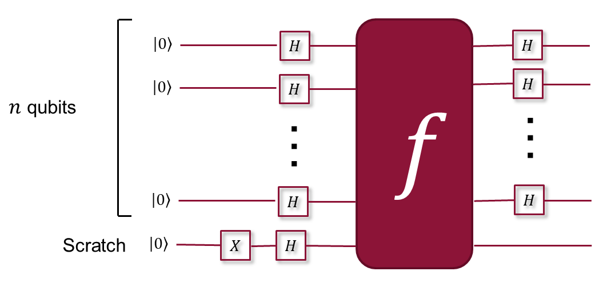
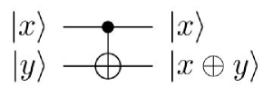

# 量子计算基础原理

- **Date:** 2026-04-15
- **Tags:** quantum-computing, qubit, superposition, entanglement, quantum-gates

## Context

本文是量子计算基础原理的系统性梳理，面向有计算机科学背景但缺乏量子物理基础的读者。内容主要基于以下两篇 arXiv 教程/综述论文：

1. Mahmud & Goldsmith (2025) 的 "A Minimal Introduction to Quantum Computing" [1]，从纯计算模型的视角介绍量子计算，不依赖物理直觉；
2. Zhao et al. (2024) 的 "Quantum Computing in Wireless Communications and Networking: A Tutorial-cum-Survey" [2]，系统介绍了量子力学公设、量子门、量子并行性等基础。

---

## 一、经典比特 vs 量子比特

在经典计算中，信息的基本单位是 **bit（比特）**，取值为 0 或 1，对应物理系统中两个可区分的状态（如高低电平信号）[2]。

量子计算的基本信息单位是 **qubit（量子比特）**。与经典比特不同，qubit 可以取多种物理形式：氢原子中电子的基态与激发态、质子的自旋态（$+\frac{1}{2}$ 和 $-\frac{1}{2}$）、或光的顺时针与逆时针圆偏振 [2]。qubit 的关键区别在于它可以处于 **superposition（叠加态）**，同时表示 0 和 1 以及它们的任意线性组合。

数学上，一个 qubit 是二维 Hilbert 空间中的单位向量 [2]：

$$|\phi\rangle = \alpha|0\rangle + \beta|1\rangle, \quad \text{s.t.} \; |\alpha|^2 + |\beta|^2 = 1$$

其中复数 $\alpha$ 和 $\beta$ 满足归一化条件，$|0\rangle$ 和 $|1\rangle$ 是正交归一基（对应列向量 $(1\;0)^T$ 和 $(0\;1)^T$）[2]。

**Bloch 球表示**：单个 qubit 的状态可以用 Bloch sphere（布洛赫球）上的一个点来可视化。Pauli 矩阵 $\sigma^x$、$\sigma^y$、$\sigma^z$ 不仅是幺正（unitary）的，也是厄米（Hermitian）的，它们的特征向量定义了 Bloch 球上的坐标轴 [2]。任意单量子比特态可通过球面坐标角 $\theta$ 和 $\varphi$ 参数化。

**信息容量的指数增长**：$n$ 个 qubit 构成的量子寄存器可以同时以概率 $|c_i|^2$ 存储从 0 到 $2^n - 1$ 的所有二进制数 [2]。换言之，一个 $n$-qubit 量子寄存器承载 $2^n$ 个二进制数的叠加。

---

## 二、量子叠加与纠缠

### 叠加（Superposition）

叠加是量子计算的核心概念之一。一个量子态（quantum state）是同一维度下基态（basis states）的加权和 [1]：

$$|\psi\rangle = \sum_{i=0}^{2^n - 1} c_i |i\rangle, \quad \text{s.t.} \; \sum_i |c_i|^2 = 1$$

权重 $c_i$ 为复数，其模的平方之和为 1 [1]。当一个量子态包含多个基态的非零权重时，即处于叠加态。例如 $i\frac{1}{\sqrt{2}}|01\rangle + \frac{1}{\sqrt{2}}|11\rangle$ 是基态 $|01\rangle$ 和 $|11\rangle$ 的叠加 [1]。

### 纠缠（Entanglement）

Entanglement 可以视为叠加的一种特殊形式 [2]。考虑两个 qubit 的复合系统，根据量子力学第四公设，其状态空间是子系统状态空间的 **tensor product（张量积）** [2]：

$$|\phi_1 \phi_2\rangle = |\phi_1\rangle \otimes |\phi_2\rangle$$

均匀叠加态 $\frac{1}{2}(|00\rangle + |01\rangle + |10\rangle + |11\rangle)$ **不是**纠缠态，因为它可以分解为 $\frac{1}{\sqrt{2}}(|0\rangle + |1\rangle) \otimes \frac{1}{\sqrt{2}}(|0\rangle + |1\rangle)$ [2]。

而 **Bell 态** $\frac{1}{\sqrt{2}}(|00\rangle + |11\rangle)$ 无法分解为两个子系统的张量积，因此是纠缠态 [2]。下图展示了通过 Hadamard 门 + CNOT 门制备 Bell 态 $\frac{1}{\sqrt{2}}(|00\rangle + |11\rangle)$ 的量子电路：

纠缠的强弱可通过 **entanglement entropy（纠缠熵）** 来定量衡量 [2]：

$$S(\rho) = -\text{tr}(\rho^A \log \rho^A) = -\sum_i \lambda_i \log \lambda_i$$

其中 $\rho^A$ 是子系统 A 的 reduced density operator（约化密度算符），$\lambda_i$ 是其特征值。Bell 态的纠缠熵为 1（最大纠缠），而 $\frac{1}{\sqrt{3}}(|00\rangle + |10\rangle + |11\rangle)$ 的纠缠熵约为 0.17 [2]。

---

## 三、量子干涉

**Quantum interference（量子干涉）** 是量子并行计算优势的关键机制。在量子计算中，quantum gate 对量子态进行幺正变换后，各基态的 probability amplitude（概率振幅）可能发生 **constructive interference（相长干涉）** 或 **destructive interference（相消干涉）** [1][2]。

具体而言，当算子 $O$ 作用于量子态 $\psi = \sum_k b_k |k\rangle$ 时，输出态中基态 $|i\rangle$ 的振幅为 [1]：

$$\sum_k a_{i,k} \cdot b_k$$

如果多个路径对同一基态的贡献符号相同，振幅增大（相长干涉）；如果符号相反，振幅减小甚至为零（相消干涉）[1]。量子算法（如 Deutsch-Jozsa 算法、Grover 搜索算法）的核心思想正是利用干涉来放大正确答案的概率、压制错误答案的概率 [2]。

Hadamard 门在干涉中扮演关键角色：$H|0\rangle = \frac{1}{\sqrt{2}}(|0\rangle + |1\rangle)$，$H|1\rangle = \frac{1}{\sqrt{2}}(|0\rangle - |1\rangle)$。注意第二个等式中的负号，这正是使干涉成为可能的相位差 [1]。

下图展示了 Deutsch-Jozsa 算法的量子电路——一个经典的量子干涉应用实例。$n$ 个输入 qubit 经 Hadamard 变换后通过 oracle $f$，再次经 Hadamard 变换后测量，利用干涉一次性判定 $f$ 是常数函数还是平衡函数 [1]：

---

## 四、量子门与量子电路

量子门（quantum gates）是量子计算的基本运算单元，将一个量子态变换为另一个量子态。所有量子门都必须是 **unitary（幺正）** 的，即满足 $OO^\dagger = O^\dagger O = I$，这保证了概率守恒（所有概率振幅的模平方之和始终为 1）[1][2]。

### 单量子比特门

**Pauli-X 门**（NOT 门）：翻转 qubit 状态 [1][2]。

$$X = |0\rangle\langle 1| + |1\rangle\langle 0| = \begin{pmatrix} 0 & 1 \\ 1 & 0 \end{pmatrix}$$

作用效果：$X|0\rangle = |1\rangle$，$X|1\rangle = |0\rangle$ [1]。

**Pauli-Y 门** [2]：

$$Y = \begin{pmatrix} 0 & -i \\ i & 0 \end{pmatrix}$$

作用效果：$Y|0\rangle = i|1\rangle$，$Y|1\rangle = -i|0\rangle$ [2]。

**Pauli-Z 门** [2]：

$$Z = \begin{pmatrix} 1 & 0 \\ 0 & -1 \end{pmatrix}$$

作用效果：$Z|0\rangle = |0\rangle$，$Z|1\rangle = -|1\rangle$（引入相位翻转但不改变基态）[2]。

**Hadamard 门** [1][2]：将基态变为均匀叠加态。

$$H = \frac{1}{\sqrt{2}}\begin{pmatrix} 1 & 1 \\ 1 & -1 \end{pmatrix}$$

作用效果：$H|0\rangle = \frac{1}{\sqrt{2}}(|0\rangle + |1\rangle) = |+\rangle$，$H|1\rangle = \frac{1}{\sqrt{2}}(|0\rangle - |1\rangle) = |-\rangle$ [2]。对 $n$ 个 qubit 全部施加 Hadamard 变换可创建 $2^n$ 个基态的均匀叠加 [2]：

$$H^{\otimes n}|00\cdots 0\rangle = \frac{1}{\sqrt{2^n}} \sum_{x=0}^{2^n - 1} |x\rangle$$

### Rotation 门（旋转门）

旋转门是参数化量子电路（PQC）的基本构建模块，沿 Bloch 球的 X、Y、Z 轴旋转 [2]：

$$R_x(\theta) = e^{-i\theta X/2} = \cos\frac{\theta}{2} I - i\sin\frac{\theta}{2} X$$

$$R_y(\theta) = e^{-i\theta Y/2} = \cos\frac{\theta}{2} I - i\sin\frac{\theta}{2} Y$$

$$R_z(\theta) = e^{-i\theta Z/2} = \cos\frac{\theta}{2} I - i\sin\frac{\theta}{2} Z$$

### 多量子比特门

**CNOT 门**（Controlled-NOT）：作用于两个 qubit 的门 [1][2]。控制 qubit $|x\rangle$ 不变，当 $|x\rangle = |1\rangle$ 时翻转目标 qubit $|y\rangle$：

$$\text{CNOT}: |x, y\rangle \rightarrow |x, x \oplus y\rangle$$

$$\text{CNOT} = |0\rangle\langle 0| \otimes I + |1\rangle\langle 1| \otimes X$$

作用效果：$|00\rangle \to |00\rangle$，$|01\rangle \to |01\rangle$，$|10\rangle \to |11\rangle$，$|11\rangle \to |10\rangle$ [2]。

**Toffoli 门**（CCX）：作用于三个 qubit 的门，两个控制 qubit 和一个目标 qubit [2]。只有当两个控制 qubit 都为 $|1\rangle$ 时，目标 qubit 才被翻转：

$$\text{Toffoli}: |x, y, z\rangle \rightarrow |x, y, (x \wedge y) \oplus z\rangle$$

$$\text{Toffoli} = |0\rangle\langle 0| \otimes I \otimes I + |1\rangle\langle 1| \otimes \text{CNOT}$$

Toffoli 门是量子电路中的基本模块，通常不再进一步分解 [2]。

### 量子电路模型

量子计算的标准模型是 **quantum circuit model（量子电路模型）**，由 Deutsch [2] 和 Yao [2] 提出，已被证明与量子 Turing 机模型等价 [2]。一个量子电路由一系列量子门按顺序作用于 qubit 寄存器构成。根据量子力学第二公设，封闭量子系统的演化可以通过 unitary operator $U$ 描述 [2]：

$$|\phi_1\rangle = U |\phi_0\rangle$$

---

## 五、测量与 Born 规则

量子物理的本质决定了我们永远无法直接访问量子态 [1]。必须通过 **measurement（测量）** 来提取经典信息，而每次测量的输出是概率性的。

对于量子态 $\psi = \sum_{k=0}^{2^n - 1} b_k |k\rangle$，测量时观察到基态 $|k\rangle$ 的概率为 $|b_k|^2$。这就是 **Born rule（玻恩规则）**，权重 $b_k$ 因此被称为 **probability amplitude（概率振幅）** [1]。观察到基态 $|k\rangle$ 后，实际看到的是对应的二进制串 [1]。

根据量子力学第三公设，一般的量子测量由一族线性算子 $\{M_m\}$ 描述，满足完备性条件 $\sum_m M_m^\dagger M_m = I$ [2]。对于状态 $|\phi\rangle$，观察到结果 $m$ 的概率为 [2]：

$$p(m) = \langle\phi| M_m^\dagger M_m |\phi\rangle$$

测量后状态坍缩为 [2]：

$$\frac{M_m |\phi\rangle}{\sqrt{\langle\phi| M_m^\dagger M_m |\phi\rangle}}$$

对于更常见的 **projective measurement（投影测量）**，即 Von Neumann 测量，投影算子 $P_m = |m\rangle\langle m|$ 满足 $P_m P_{m'} = \delta_{mm'} P_m$ 和 $\sum_m P_m = I$。量子态 $|\phi\rangle = \sum_i c_i |i\rangle$ 在投影测量下以概率 $|c_i|^2$ 坍缩到基态 $|i\rangle$ [2]。

下图展示了量子隐形传态（quantum teleportation）协议的电路，这是测量在量子信息中最重要的应用之一——通过 Bell 测量和经典通信，将未知量子态从一方传送到另一方 [2]：

测量的一个重要后果是 **no-cloning theorem（不可克隆定理）**：不存在一个幺正操作能完美复制未知量子态 [2]。这从根本上限制了从量子态中提取完整信息的能力。

---

## 六、退相干与量子噪声 (T1/T2)

现实中的量子系统不是封闭的，会与环境发生不可控的相互作用，导致 **decoherence（退相干）**。退相干使量子信息退化，是实现实用量子计算的主要障碍之一 [2]。

量子系统对环境噪声高度敏感，退相干会降低量子信息和计算的质量 [2]。在超导量子计算等物理实现中，两个关键时间尺度刻画了退相干：

- **$T_1$（能量弛豫时间/纵向弛豫时间）**：qubit 从激发态 $|1\rangle$ 自发衰减到基态 $|0\rangle$ 的特征时间。$T_1$ 过程对应能量耗散到环境。
- **$T_2$（退相时间/横向弛豫时间）**：qubit 叠加态中相位信息丢失的特征时间。$T_2$ 过程不涉及能量交换，而是相位的随机扰动（dephasing），满足 $T_2 \leq 2T_1$。

所有量子门操作必须在 $T_1$ 和 $T_2$ 时间内完成，否则量子信息将丢失。开发量子纠错（quantum error correction）技术和鲁棒算法来应对噪声和退相干是当前研究的重要方向 [2]。

---

## 七、Dirac 符号基础

Dirac notation（狄拉克符号），也称 **bra-ket notation**，是量子力学和量子信息中的标准数学语言 [1][2]。

- **Ket** $|x\rangle$：表示一个列向量（量子态）[1]。例如 $|001\rangle$ 是 $2^3 = 8$ 维空间中的标准单位列向量，除第 1 行（$001$ 的十进制为 1，从 0 开始编号）为 1 外其余全为 0 [1]。

- **Bra** $\langle x|$：$|x\rangle$ 的共轭转置，表示一个行向量 [1]。

- **Inner product（内积/点积）** $\langle x|y\rangle$：两个量子态的点积 [1]。对于正交归一基，$\langle x|y\rangle = 1$（若 $x = y$），$\langle x|y\rangle = 0$（若 $x \neq y$）[1]。

- **Outer product（外积）** $|x\rangle\langle y|$：产生一个矩阵 [1]。这是定义量子门的基本工具——一个作用于 $n$-qubit 的量子算子可写为 [1]：

$$O = \sum_{i=0}^{2^n - 1} \sum_{j=0}^{2^n - 1} a_{i,j} |i\rangle\langle j|$$

- **Tensor product（张量积）** $\otimes$：用于组合多个子系统的状态空间 [2]。$n$ 个子系统的联合态为 $|\phi_1\rangle \otimes \cdots \otimes |\phi_n\rangle$。

内积还可作为 **selection tool（选择工具）** 使用 [1]：当 $(|w\rangle\langle x|)|y\rangle$ 中 $x = y$ 时结果为 $|w\rangle$，否则为零向量。这一性质是量子门运算的数学基础 [1]。

---

## References

- [1] M M Hassan Mahmud, Daniel Goldsmith, "A Minimal Introduction to Quantum Computing", arXiv:2504.00995, 2025.
- [2] Wei Zhao, Tangjie Weng, Yue Ruan, Zhi Liu, Xuangou Wu, Xiao Zheng, Nei Kato, "Quantum Computing in Wireless Communications and Networking: A Tutorial-cum-Survey", arXiv:2406.02240, 2024.
