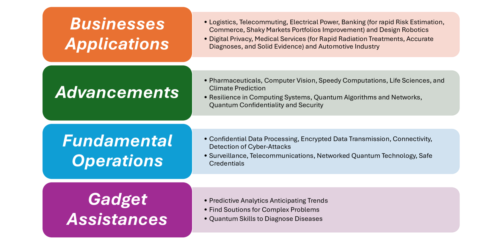
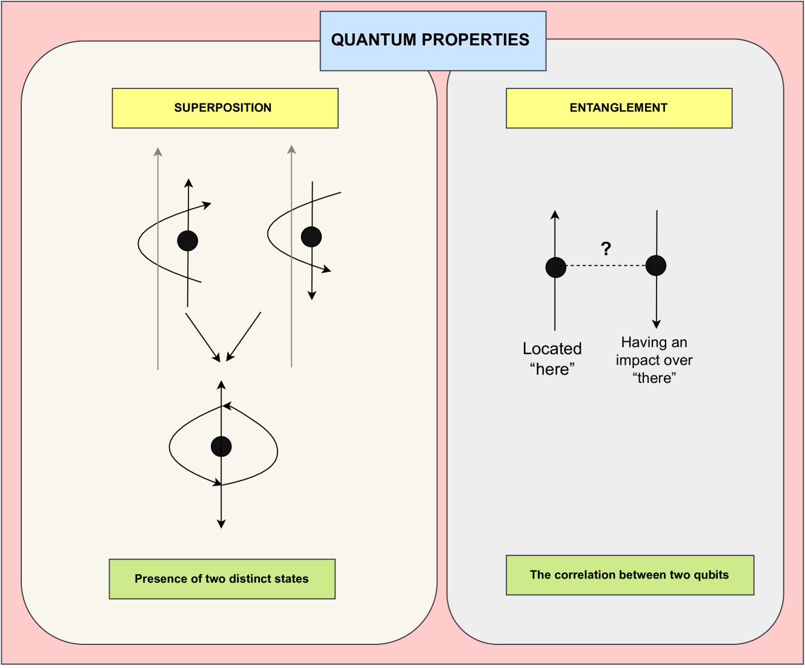
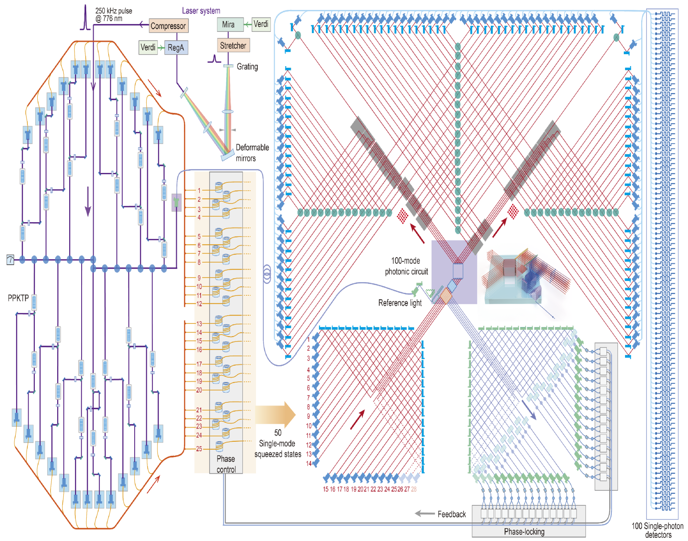
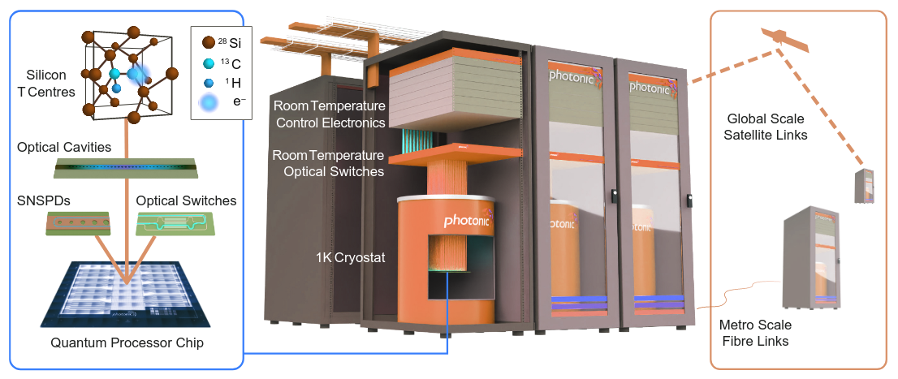
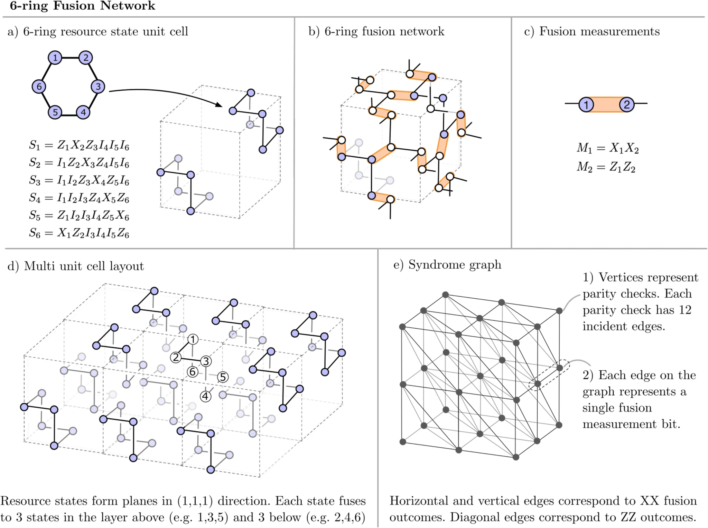
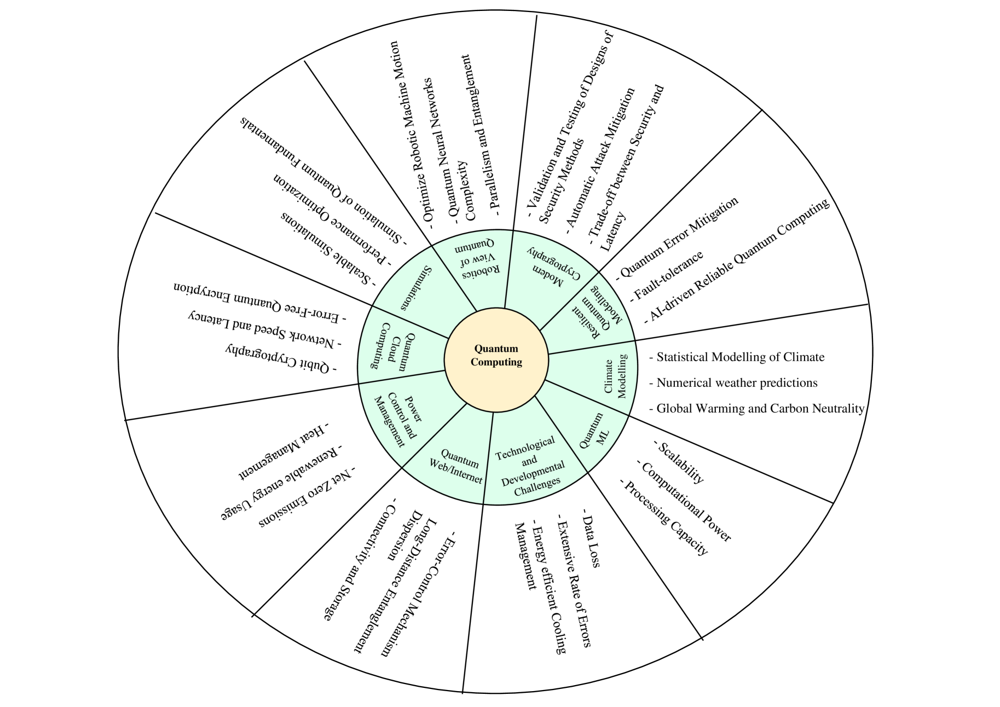

# 量子硬件路线

- **Date:** 2026-04-15
- **Tags:** quantum-computing, superconducting, trapped-ion, topological, photonic, neutral-atom, annealing

## Context

本文基于对 arXiv 上多篇量子计算硬件综述和平台专项论文的检索和阅读，综合梳理当前主流量子硬件路线的工作原理、性能指标、关键优势与挑战。主要参考来源包括：超导量子比特综述 [1,2]、离子阱量子计算综述 [3,4]、拓扑量子比特里程碑论文 [5,6]、光量子计算综述 [7,8]、中性原子量子计算综述 [9,10,11]、量子计算全景综述 [12,13]、以及量子退火综述 [14]。

---

## 一、量子硬件总览

量子计算的物理实现存在多条技术路线，每条路线利用不同的物理系统来编码和操控量子比特 (qubit)。根据 Gill et al. [12] 的综述，目前全球有超过一百个实验室在开发量子比特系统，主要商业化路线包括：

- **超导量子比特** (Superconducting Qubits)：基于 Josephson 结的超导电路，IBM、Google、Rigetti 等采用
- **离子阱** (Trapped Ions)：利用电磁场囚禁的单个离子，IonQ、Quantinuum 等采用
- **拓扑量子比特** (Topological Qubits)：基于 Majorana 零模的拓扑保护，Microsoft 主导研发
- **光量子** (Photonic)：以光子作为量子信息载体，Xanadu、PsiQuantum、USTC (九章) 等采用
- **中性原子** (Neutral Atoms)：利用光镊阵列囚禁中性原子，QuEra、Pasqal 等采用
- **量子退火** (Quantum Annealing)：基于绝热量子计算的近似实现，D-Wave 采用

如 Gill et al. [12] 所指出，保持量子比特的相干性 (coherence) 是所有路线面临的核心挑战。退相干 (decoherence) 发生在量子比特与环境相互作用时，会丢失其量子特性，是构建大规模量子设备的最大障碍之一。

---

## 二、超导量子比特 (Superconducting Qubits)

### 工作原理

超导量子比特是基于 Josephson 隧道结构建的固态电路 [1,2]。如 Krantz et al. [2] 所述，该领域在过去二十年间从基础研究发展到了越来越多地探索更大规模超导量子系统的工程化阶段。核心元件是 Josephson 结——在低温下唯一可用的非耗散、强非线性电路元件 [1]。

Wong [1] 的综述详细介绍了基于 Josephson 结形成的各类超导量子比特，包括 charge qubit、flux qubit、phase qubit，以及目前最广泛使用的 **transmon** 设计。不同设计之间存在多个设计参数的权衡，包括噪声免疫性。Transmon 通过增大 Josephson 能量与充电能量的比值 ($E_J / E_C$) 来降低对电荷噪声的敏感度。

### 关键指标（来源于 [1,2,12]）

- **量子比特数**：IBM 已提供最多 433 量子比特的云端处理器 [12]；Google Sycamore 为 53 量子比特（2019 年量子优越性实验）[12, 引用 Arute et al., Nature 2019]
- **门保真度**：单量子比特门保真度可达 >99.9%；双量子比特门保真度在 99%~99.5% 范围 [1,2]
- **相干时间**：transmon 的 T1 和 T2 时间已从早期的微秒级提升至数百微秒量级 [1,2]
- **主要噪声源**：Wong [1] 指出，两能级系统 (TLS) 缺陷是当前限制量子比特相干时间的主要因素；此外还有非平衡准粒子和 slotline 模式辐射 [1, 引用 Martinis & Megrant 2014]

### 关键优势

- 与成熟的半导体制造基础设施高度兼容，有利于大规模集成 [1]
- 量子比特与其他电路的耦合性好，便于读出和门操作实现 [1]
- 门速度快（纳秒级）

### 关键挑战

- 需要在 ~15 mK 的极低温 (dilution refrigerator) 下运行 [12]
- TLS 缺陷导致的退相干 [1]
- 双量子比特门保真度仍是实现高效容错量子计算的主要瓶颈 [1]
- 大规模集成面临布线和控制复杂度挑战 [1]

### 主要机构

IBM、Google Quantum AI、Rigetti Computing、Intel、Origin Quantum (中国)

---

## 三、离子阱 (Trapped Ions)

### 工作原理

离子阱量子计算利用电磁势 (Paul trap 或 Penning trap) 囚禁单个原子离子链，以离子的内部电子能级作为量子比特 [3,4]。如 Haeffner et al. [3] 所述，量子门操作通过激光脉冲实现：单量子比特门通过驱动离子的内部态跃迁完成，双量子比特门则通过离子链的集体振动模式 (共享声子总线) 实现离子间的纠缠耦合。

Bernardini et al. [4] 从 DiVincenzo 判据的角度评估了离子阱系统作为可扩展量子计算机的可行性，确认其满足所有基本要求。

Fernandes et al. [引用 2207.11619] 的综述进一步介绍了从离子囚禁物理到构建通用门集合的 Hamiltonian 工程。

### 关键指标（来源于 [3,4,12]）

- **量子比特数**：当前系统已演示数十个量子比特的操控；Quantinuum 的 H2 处理器达到 56 全连接量子比特
- **门保真度**：单量子比特门 >99.99%；双量子比特门 >99.9%——在所有平台中最高 [3]
- **相干时间**：离子阱量子比特的相干时间极长，可达秒级甚至分钟级 [3,4]
- **连通性**：全连接 (all-to-all connectivity)——任意两个离子间可实现双量子比特门 [3,4]

### 关键优势

- 全连接架构，无需 SWAP 门 [3]
- 极高的门保真度和极长的相干时间 [3]
- 量子比特之间完全相同 (由自然常数决定) [3]
- 已成功演示确定性量子隐形传态和量子纠错 [3]

### 关键挑战

- 门速度相对较慢（微秒至毫秒级），限制了电路深度 [3,4]
- 随离子数增加，链的振动模式变得复杂，串扰增大 [3]
- 扩展到大规模系统需要离子穿梭 (shuttling) 或模块化互联方案 [3,4]
- Wu & Duan [引用 2004.11608] 提出了二维离子阵列架构以结合高速门与可扩展性

### 主要机构

Quantinuum (Honeywell)、IonQ、Alpine Quantum Technologies (AQT/AQTION 项目)

---

## 四、拓扑量子比特 (Topological Qubits)

### 工作原理

拓扑量子比特利用 Majorana 零模 (Majorana Zero Modes, MZMs) 以非局域方式存储量子信息 [5,6]。如 Aasen et al. [5] 所述，这些零模出现在半导体纳米线与介观超导岛的混合结构中。由于量子信息编码在拓扑序 (topological order) 中而非局域的物理状态上，因此对局域噪声具有天然的保护作用。

Aasen et al. [5] 提出了从零模探测到量子计算的分阶段路线图：(1) 利用电荷传感器或泵浦电流探测非阿贝尔任意子的融合规则；(2) 验证原型拓扑量子比特；(3) 通过分支几何结构中的编织操作演示非阿贝尔统计。前两个里程碑仅需单根纳米线上的两个超导岛。

### 噪声模型

Knapp et al. [6] 建立了 Majorana 系统的随机噪声模型，将物理错误过程与容错分析中使用的噪声模型连接起来。该研究指出：

- 标准基于 Pauli 算子的量子比特噪声模型无法捕获由准粒子中毒 (quasiparticle poisoning) 事件引起的主导噪声过程 [6]
- 多量子比特测量中的关联错误具有重要影响 [6]
- 在足够快的准粒子弛豫条件下，错误可以用 Pauli 算子良好描述 [6]

### 关键指标（来源于 [5,6]）

- **量子比特数**：仍处于原理验证阶段，尚无规模化量子处理器
- **门保真度**：理论上门操作可受拓扑保护，但实际保真度受有限温度和系统尺寸导致的残余误差限制 [6]
- **相干时间**：由拓扑能隙和准粒子中毒速率决定 [5]
- **主要挑战**：Majorana 零模的实验证实仍存在争议 [5]

### 关键优势

- 量子信息天然受拓扑保护，对局域噪声具有固有抗性 [5,6]
- 如能实现，将大幅降低量子纠错的物理量子比特开销 [6, 引用 Li 2015]
- 编织操作可实现部分 Clifford 门 [5]

### 关键挑战

- Majorana 零模的实验实现极其困难 [5]
- 波函数重叠 (hybridization) 在编织过程中破坏基态简并，导致量子比特错误 [引用 Hodge et al. 2403.02481]
- 仍处于最早期的研究阶段，距离实用量子计算路途遥远

### 主要机构

Microsoft (Station Q)

---

## 五、光量子 (Photonic Quantum Computing)

### 工作原理

光量子计算将量子比特编码在光子的量子态中 [7,8]。如 Slussarenko & Pryde [8] 所述，光子系统是研究量子力学的旗舰平台——量子纠缠、隐形传态、量子密钥分发和早期量子计算演示都首先在光子系统中实现。光子量子比特的优势包括：对退相干的免疫性、可在室温下进行信息处理、以及通过光纤和自由空间通道传输光子的能力 [7]。

AbuGhanem [7] 的综合综述涵盖了多家光量子计算公司的架构和进展，包括 iPronics、Photonic Inc.、Quandela、ORCA Computing、Xanadu、PsiQuantum、Quix Quantum、TundraSystems、TuringQ、QBoson 等。

### 关键实验进展（来源于 [7]）

**Xanadu - Borealis**：Xanadu 推出的 Borealis 是一个完全可编程的光子量子计算系统，使用 216 个压缩模式通过三维连接配置实现纠缠。Borealis 在约 36 微秒内完成 Gaussian Boson Sampling (GBS) 任务，而最佳经典算法和超级计算机据称需要超过 9000 年 [7, 引用 Madsen et al.]。实验记录了涉及多达 219 个光子的事件，平均光子数为 125 [7]。

**USTC - 九章系列**：中国科学技术大学的九章 (Jiuzhang) 在 200 秒内完成了 GBS 任务，其输出产生多达 76 个光子点击 [7, 引用 Zhong et al. 2020]。后续版本九章 2.0 使用 144 个输出模式和 144 个超导纳米线单光子探测器 [7]。

**PsiQuantum**：采用硅芯片嵌入通道的光子方法，基于融合量子计算 (Fusion-Based Quantum Computation, FBQC) 架构 [7]。其探测器在约 4 K 运行——远高于超导量子比特所需的 mK 温度 [7]。PsiQuantum 报告其设计可承受每次融合中 10.4% 的光子损失概率（即每个光子仅 2.7% 的损失概率），以及 43.2% 的融合失败率 [7]。

### 关键指标（来源于 [7,8]）

- **量子比特编码**：dual-rail 编码、squeezed state 编码、time-bin 编码等
- **连通性**：通过干涉仪网络实现可编程连接
- **相干时间**：光子天然对退相干免疫，但光子损失是主要错误来源 [7,8]
- **门实现**：确定性双量子比特门困难，需依赖测量和辅助光子实现有效非线性 [8]

### 关键优势

- 室温运行（探测器除外）[7,8]
- 天然适合量子网络互联 [8]
- 模块化架构，易于扩展 [7]
- 光子产生速率快，适合采样任务 [7]

### 关键挑战

- 确定性双光子门难以实现 [8]
- 光子损失是主要误差来源 [7]
- 单光子源和单光子探测器的效率和确定性仍需提升 [7,8]
- 早期的量子优越性声明已受到 spoofing 攻击的挑战 [7]

### 主要机构

Xanadu、PsiQuantum、USTC (九章)、Quandela、ORCA Computing、Photonic Inc.

---

## 六、中性原子 (Neutral Atoms)

### 工作原理

中性原子量子计算利用光学阱 (optical tweezers) 阵列囚禁单个中性原子，以原子的超精细能级或 Rydberg 态编码量子比特 [9,10,11]。如 Henriet et al. [9] 所述，在过去三十年中，利用光操纵中性原子已产生了无数量子物理领域的科学发现。在光学阱阵列中实现的单粒子级别控制能力，同时保持量子物质的基本特性（相干性、纠缠、叠加），使这些技术成为实现颠覆性计算范式的首选候选者。

Wu et al. [11] 的综述回顾了 Rydberg 原子在量子计算和模拟中的应用。Rydberg 态原子间存在强长程偶极相互作用，可实现大规模量子门操作。

### 关键特性（来源于 [9,10,11]）

- **可扩展性**：Henriet et al. [9] 给出了中性原子量子处理器在 100-1000 量子比特范围内固有可扩展性的证据
- **计算模式**：支持数字级（门基电路编程）和模拟级（Hamiltonian 序列编程）两种模式 [9]
- **连通性**：通过原子重排和 Rydberg 相互作用实现灵活的连接拓扑 [9,10]
- **应用范围**：从优化问题到量子系统模拟，在 NISQ 时代已可高效处理多种任务 [9]

Wintersperger et al. [10] 从工业终端用户角度评估了中性原子平台，讨论了物理量子比特架构对态制备、量子比特间连通性、门保真度、原生门指令集和单量子比特稳定性的影响。

### 泄漏错误处理

Chow et al. [引用 2405.10434] 在铯原子量子处理器中演示了基于电路的泄漏-擦除转换 (leakage-to-erasure conversion)，利用泄漏检测单元 (LDU) 将泄漏错误转换为擦除错误，检测原子丢失错误的准确率约 93.4% [引用 2405.10434]。

### 关键优势

- 高度可扩展的架构，已实现数百量子比特阵列 [9]
- 灵活的原子重排能力，可动态改变连接拓扑 [9,10]
- 同时支持模拟和数字量子计算模式 [9]
- 所有量子比特完全相同（由原子物理决定）[9]

### 关键挑战

- 单量子比特和双量子比特门保真度仍在追赶超导和离子阱路线 [10]
- 原子丢失 (atom loss) 导致的泄漏错误 [引用 2405.10434]
- 门速度受 Rydberg 态寿命限制 [11]
- 中-远距离双量子比特门的保真度下降 [10]

### 主要机构

QuEra Computing、Pasqal、Infleqtion (原 ColdQuanta)、Planqc

---

## 七、量子退火 (Quantum Annealing)

### 工作原理

量子退火是绝热量子计算 (adiabatic quantum computation) 的一种近似实现 [12,14]。如 Cohen & Tamir [14] 所述，量子退火利用量子隧穿效应来搜索优化问题的全局最优解。系统从一个已知基态的简单 Hamiltonian 开始，然后缓慢演化到编码了目标优化问题的 Hamiltonian，利用量子力学的绝热定理保持系统处于基态。

Gill et al. [12] 指出，量子退火与门模型量子计算是两种主要的量子计算范式。量子退火基于量子系统自然趋向低能态的倾向，相比门模型对某些类型的计算错误更为鲁棒。

### 关键特性（来源于 [12,14]）

- **计算模型**：专用于组合优化问题，而非通用量子计算 [12,14]
- **量子比特数**：D-Wave 系统已达到 5000+ 量子比特（Advantage 系统）[12]
- **量子比特类型**：超导磁通量子比特 (flux qubits) [14]
- **连通性**：Pegasus 拓扑结构，每个量子比特连接 15 个邻居 [12]

### 关键优势

- 量子比特数远超门模型量子计算机 [12]
- 对特定优化问题可能具有量子加速 [14]
- 对某些计算错误天然鲁棒 [12]
- 已有商业化产品可用 [12,14]

### 关键挑战

- 非通用量子计算机，只能处理特定类型的优化问题 [12]
- 量子加速的证据仍存在争议 [14]
- 量子比特之间的连通性有限 [12]
- 需要在低温环境下运行 [14]

### 主要机构

D-Wave Systems；Fujitsu Digital Annealer（量子启发式经典计算）[12]

---

## 八、硬件路线对比

下表综合各路线的关键指标。由于各平台发展阶段不同，部分指标为近似范围值。

| 平台 | 量子比特数 | 相干时间 | 门保真度 (2-qubit) | 连通性 | 运行温度 | 可扩展性评估 | 主要来源 |
|------|-----------|---------|-------------------|--------|---------|------------|---------|
| 超导 (Transmon) | ~100-1000+ | ~100-500 $\mu$s (T1) | ~99-99.5% | 近邻 (nearest-neighbor) | ~15 mK | 高（兼容半导体工艺）| [1,2,12] |
| 离子阱 (Trapped Ion) | ~30-56 | 秒-分钟级 | >99.9% | 全连接 | 室温（真空腔） | 中（需模块化互联）| [3,4,12] |
| 拓扑 (Majorana) | ~0 (原理验证) | 理论上受拓扑保护 | 理论上受拓扑保护 | 编织操作 | ~mK | 待验证 | [5,6] |
| 光量子 (Photonic) | ~100-200+ 模式 | 光子天然不退相干 | 依赖测量方案 | 可编程干涉仪 | 室温（探测器~4K）| 高（硅光子集成）| [7,8] |
| 中性原子 (Neutral Atom) | ~100-1000+ | ~ms-s | 提升中 (~99%+) | 可重排（灵活）| 室温（真空腔） | 高（光镊阵列）| [9,10,11] |
| 量子退火 (Annealing) | ~5000+ | N/A（非门模型）| N/A（非门模型）| Pegasus 拓扑 | ~15 mK | 高（但仅限优化）| [12,14] |

---

## 九、发展路线图：NISQ → Early Fault-Tolerant → Full Fault-Tolerant

根据 Gill et al. [12] 和 Fedorov et al. [13] 的分析，量子计算正经历从 NISQ 到容错量子计算的过渡：

### NISQ 时代（当前）

Preskill (2018) 提出的 "Noisy Intermediate Scale Quantum" (NISQ) 概念定义了当前阶段 [12, 引用 Preskill 2018]。NISQ 设备的特征是：
- 50-1000 个物理量子比特
- 门保真度不足以进行深层电路运算
- 需要变分量子算法 (VQE, QAOA) 等混合量子-经典方案来应对噪声 [12]
- Google 的 Sycamore (53 量子比特) 和 USTC 的九章已在特定任务上展示量子优越性 [12]

### Early Fault-Tolerant 阶段（近期目标）

- 目标是实现少量逻辑量子比特，通过量子纠错码（如 surface code）保护
- 需要错误率降至 ~1% 以下 [12]
- 超导路线的 surface code 需要约 0.75% 的错误阈值 [引用 DiVincenzo 2009]
- 拓扑量子比特如能实现，可大幅降低物理量子比特开销——仅需数十个拓扑量子比特即可编码一个 surface code 逻辑量子比特，而普通量子比特约需一千个 [6, 引用 Li 2015]

### Full Fault-Tolerant 阶段（远期目标）

- 数百万物理量子比特支撑数千逻辑量子比特
- 可运行 Shor 算法破解 RSA 加密 [12]
- 可高效模拟量子化学和材料科学问题 [12]
- 需要在量子硬件、量子纠错、量子编译等多个层面的协同突破 [12,13]

各路线走向容错量子计算的策略各不相同 [12,13]：超导和离子阱路线主要依赖 surface code 等量子纠错码 [1,3]；拓扑路线试图通过硬件层面的拓扑保护减少纠错开销 [5,6]；光量子路线则探索 FBQC 和 QLDPC 码 [7]；中性原子路线利用其可扩展性优势结合擦除错误转换 [9]。

---

## References

- [1] H. Y. Wong, "Review of Superconducting Qubit Devices and Their Large-Scale Integration", arXiv:2602.04831 (2026)
- [2] P. Krantz, M. Kjaergaard, F. Yan, T. P. Orlando, S. Gustavsson, W. D. Oliver, "A Quantum Engineer's Guide to Superconducting Qubits", arXiv:1904.06560 (2019)
- [3] H. Haeffner, C. F. Roos, R. Blatt, "Quantum computing with trapped ions", arXiv:0809.4368 (2008)
- [4] F. Bernardini, A. Chakraborty, C. Ordonez, "Quantum computing with trapped ions: a beginner's guide", arXiv:2303.16358 (2023)
- [5] D. Aasen et al., "Milestones toward Majorana-based quantum computing", arXiv:1511.05153 (2015)
- [6] C. Knapp, M. Beverland, D. I. Pikulin, T. Karzig, "Modeling noise and error correction for Majorana-based quantum computing", arXiv:1806.01275 (2018)
- [7] M. AbuGhanem, "Photonic Quantum Computers", arXiv:2409.08229 (2024)
- [8] S. Slussarenko, G. J. Pryde, "Photonic quantum information processing: a concise review", arXiv:1907.06331 (2019)
- [9] L. Henriet et al., "Quantum computing with neutral atoms", arXiv:2006.12326 (2020)
- [10] K. Wintersperger et al., "Neutral Atom Quantum Computing Hardware: Performance and End-User Perspective", arXiv:2304.14360 (2023)
- [11] X. Wu et al., "A concise review of Rydberg atom based quantum computation and quantum simulation", arXiv:2012.10614 (2020)
- [12] S. S. Gill et al., "Quantum Computing: Vision and Challenges", arXiv:2403.02240 (2024)
- [13] A. K. Fedorov, N. Gisin, S. M. Beloussov, A. I. Lvovsky, "Quantum computing at the quantum advantage threshold: a down-to-business review", arXiv:2203.17181 (2022)
- [14] E. Cohen, B. Tamir, "Quantum Annealing - Foundations and Frontiers", arXiv:1408.5784 (2014)
