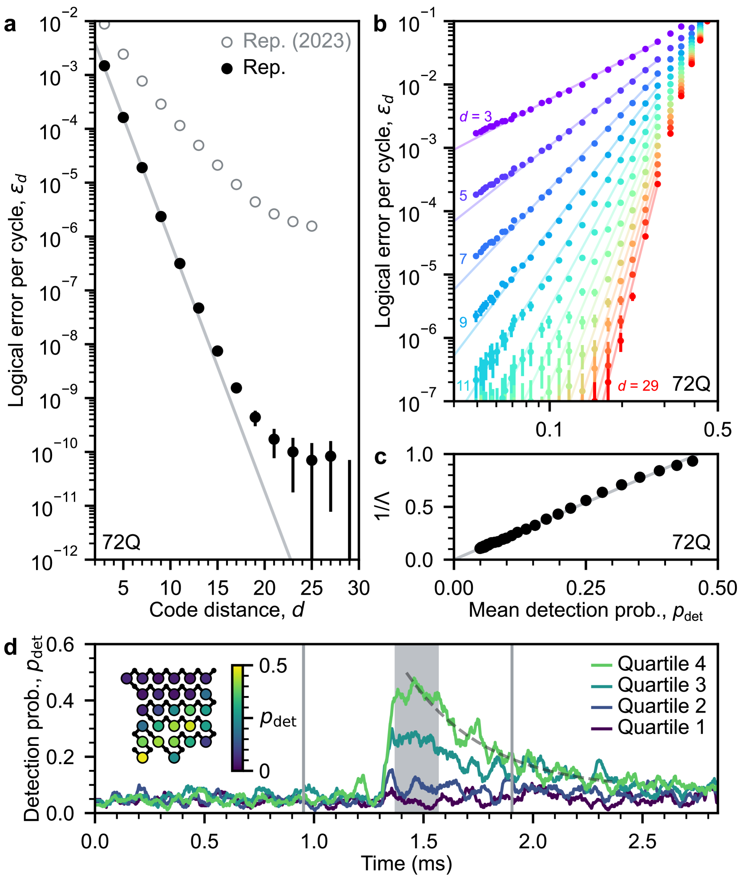
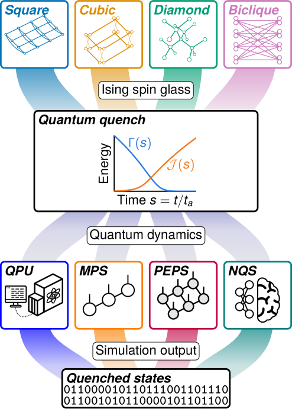
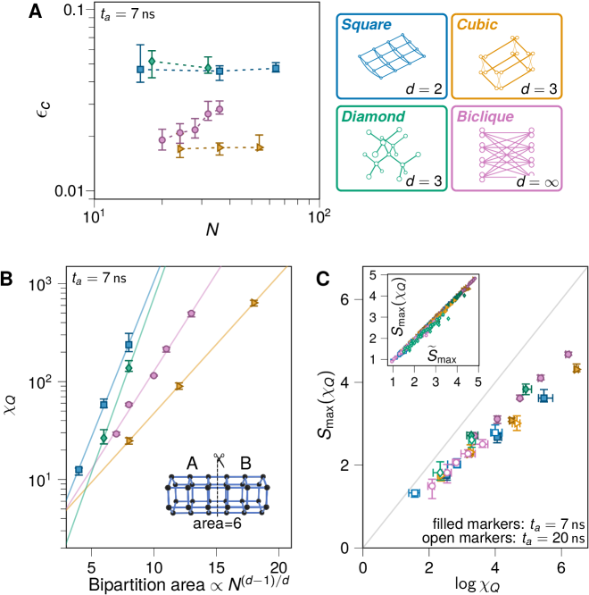
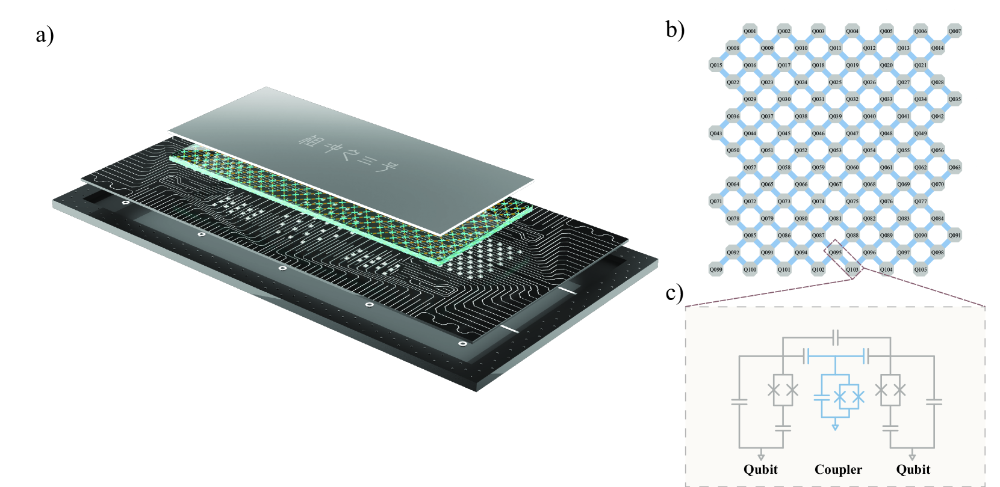
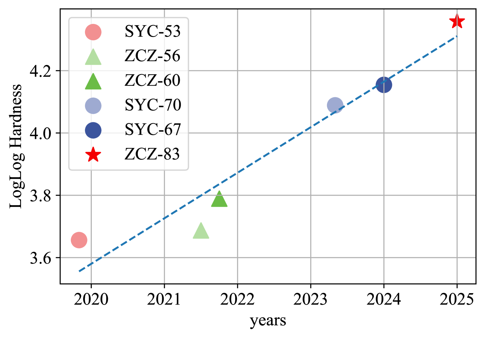

# 量子计算行业格局

- **Date:** 2026-04-15
- **Tags:** quantum-computing, Google, IBM, Microsoft, Amazon, Nvidia, IonQ, Quantinuum, USTC, D-Wave

## Context

本文基于对 arXiv 论文、Nature/Science 期刊发表论文、以及各公司官方公告的系统性检索整理。主要来源包括 Google Quantum AI 的 Sycamore/Willow 论文 [1][2]、IBM 的 Eagle 处理器 utility 实验 [3] 与 2025 年路线图更新 [27][28][29]、Microsoft Majorana 1 拓扑量子比特路线图 [4]、Nvidia 的 cuQuantum SDK [5] 及 Ising 量子 AI 模型 [6]、IonQ Forte 基准测试 [7] 与 2024-2025 年收购扩张 [24]、Quantinuum H2/Helios 系统 [8][30][31]、D-Wave 量子退火优势实验 [9]、以及中科大的九章 [10][11] 和祖冲之 [12][13] 系列处理器论文。

---

## 一、行业格局总览

量子计算行业正处于从"量子优越性验证"向"实用量子计算"过渡的关键阶段。2019 年 Google 首次宣称量子优越性 [1] 以来，全球主要科技公司和学术机构沿着不同的技术路线加速推进。

当前行业格局可以按技术路线划分为几大阵营：

- **超导量子比特**：Google、IBM、中科大（USTC）是主力，占据最大份额
- **离子阱（Trapped Ion）**：IonQ、Quantinuum 领跑商业化
- **拓扑量子比特**：Microsoft 独辟蹊径，押注 Majorana 粒子
- **Cat Qubit**：Amazon（AWS）探索新型纠错优化路线
- **量子退火（Quantum Annealing）**：D-Wave 专注组合优化问题
- **光量子**：中科大九章系列代表光子路线
- **GPU 加速量子模拟**：Nvidia 通过 cuQuantum/CUDA-Q/Ising 赋能整个生态

## 二、Google: Sycamore → Willow

### 技术路线：超导 transmon 量子比特

**Sycamore (2019)**

Google 在 2019 年 10 月发表于 Nature 的论文中，使用 53 量子比特的 Sycamore 处理器完成了随机量子电路采样（Random Circuit Sampling）任务 [1]。Google 声称该任务在 Sycamore 上仅需约 200 秒完成，而当时最强的经典超级计算机 Summit 需要约 10,000 年 [1]。IBM 随后反驳称，通过优化经典模拟方法，该任务可在约 2.5 天内完成 [14]。

此后，多个团队对 Sycamore 量子优越性声明提出了挑战。Pan & Zhang (2021) 使用 60 个 GPU 的小型集群在几小时内生成了百万个关联比特串 [15]。Liu et al. (2021) 在新一代神威超级计算机上进行了全尺度模拟，声称可以在一周内完成 Sycamore 的采样任务 [16]。这表明量子优越性是一个"移动靶标"。

**Willow (2024)**

Google 的 Willow 芯片代表了重大飞跃。该 105 量子比特处理器于 2024 年 12 月公布，相关论文发表于 Nature 638 (2025) [2]。关键突破包括：

- **低于阈值的量子纠错**：在 surface code 中实现了错误率随量子比特距离增加而指数级降低——从 3x3 到 5x5 到 7x7 编码量子比特阵列，每次将错误率减半 [2]
- 距离-7 surface code 使用 101 个量子比特，逻辑错误率约 0.143%/纠错周期 [2]
- 逻辑量子比特的寿命超过其最佳物理量子比特 2.4 倍 [2]
- 实时解码，平均延迟 63 微秒 [2]
- T1 弛豫时间接近 100 微秒，比上一代提升约 5 倍 [17]
- 在随机电路采样基准上，Willow 在不到 5 分钟内完成的计算，当今最快超级计算机需要 10^25（一千万亿亿）年 [17]

这是近 30 年来量子纠错领域追求的里程碑——首次在超导系统中证明了纠错可以随规模扩大而真正改善。

*图：Willow surface code 量子纠错实验结果。展示了从 3x3 到 5x5 到 7x7 编码量子比特阵列，每次将错误率减半的关键突破。来源：arXiv:2408.13687 Fig.1*

*图：Willow 重复码（repetition code）实验中逻辑错误率随码距增大的指数级下降趋势，证明了量子纠错低于阈值的里程碑。来源：arXiv:2408.13687 Fig.3*

## 三、IBM: Eagle → Heron → Condor

### 技术路线：超导 transmon 量子比特

IBM 采取了不同于 Google "量子优越性"叙事的策略，提出了"Quantum Utility"（量子实用性）概念。

**Eagle 处理器与 Nature 2023 实用性证据**

2023 年 6 月，IBM 在 Nature 封面论文中展示了 127 量子比特 Eagle 处理器在模拟材料自旋动力学方面的实用性 [3]。实验使用 Eagle 处理器生成大规模纠缠态来模拟 Ising 模型中的自旋动力学，并预测磁化强度等物理性质 [3]。IBM Research 主管 Dario Gil 称："这是量子计算机首次在模拟自然物理系统方面超越经典方法的精度" [3]。

然而，Tindall et al. (2024) 随后发表论文证明，通过张量网络方法（结合 belief propagation 技术），可以在经典计算机上获得"显著优于量子处理器"的精度和准确性 [18]。这一反驳在一定程度上削弱了 IBM 的实用性声明。

**Heron 处理器 (2023.12)**

2023 年 12 月 4 日，IBM 在 Quantum Summit 2023 上发布了 Heron 处理器 [27]。Heron 是 IBM 迄今性能最强的量子处理器：

- **156 量子比特**（r2 版本），采用 **tunable coupler**（可调耦合器）架构 [27]
- 消除了此前超导处理器中的串扰（cross-talk）错误 [27]
- 速度比 Eagle 处理器快 **5 倍** [27]
- 是 **IBM Quantum System Two** 的核心处理器 [27]
- EPLG（每层门错误率）2.16E-3，CLOPS 340K [27]

**Condor 处理器 (2023.12)**

与 Heron 同日发布的 Condor 处理器是 IBM 量子比特数最多的芯片 [28]：

- **1,121 量子比特**，按量子比特数排名全球第二（仅次于 Atom Computing 的 1,125 量子比特系统）[28]
- 采用 **cross-resonance** 门（交叉共振），而非 Heron 的 tunable coupler [28]
- 量子比特密度比 Osprey 提高 50%，包含超过 1 英里高密度低温柔性 IO 线缆 [28]
- 但速度**不如 Heron**——表明原始量子比特数量并不直接等同于计算能力 [28]

**2025 年路线图大更新 (2025.06.10)**

2025 年 6 月 10 日，IBM 发布了全面更新的量子计算路线图，宣布了通往大规模容错量子计算（FTQC）的明确路径 [29]。路线图以鸟类命名的处理器系列延伸至 2033 年：

| 处理器 | 年份 | 核心目标 | 关键技术 |
|--------|------|---------|---------|
| **Loon** | 2025 | qLDPC 架构测试 | C-coupler 长距离片内量子比特连接 |
| **Kookaburra** | 2026 | 首款模块化处理器 | 量子纠错内存 + 逻辑运算结合 |
| **Cockatoo** | 2027 | 多芯片纠缠 | L-coupler 连接两个 Kookaburra 模块 |
| **Starling** | 2029 | 首台大规模 FTQC | **200 逻辑量子比特，1 亿次量子操作** |
| **Blue Jay** | ~2033 | 下一代 FTQC | **2,000 逻辑量子比特，10 亿次量子操作** |

数据来源：[29]

IBM 声称 Starling 的计算能力将是当前量子计算机的 **20,000 倍**，表示其计算状态需要"超过 10^48 台全球最强超级计算机的内存"来经典表示 [29]。Blue Jay 预计需要约 100,000 个物理量子比特来支撑 2,000 个逻辑量子比特 [29]。

**qLDPC 突破**

IBM 路线图的基石是量子低密度奇偶校验码（quantum Low-Density Parity-Check, qLDPC）的突破性进展。相比传统 surface code，qLDPC 码（特别是"双变量自行车码" bivariate bicycle code）将物理量子比特开销降低了约 **10 倍（~90%）**[29][37]。

具体而言，一个 [[144,12,12]] 码可以用 288 个物理量子比特编码 12 个逻辑量子比特，达到与 surface code 方案（每个逻辑量子比特需要约 1,000 个物理量子比特）等效的错误抑制水平 [29]。相关研究发表在 arXiv:2506.03094（"Tour de gross: A modular quantum computer based on bivariate bicycle codes"）[37] 和 arXiv:2506.01779（快速 FPGA/ASIC 友好的实时纠错解码器）[38]。

IBM 表示："没有什么根本性的未知问题——现在只是工程规模化的问题" [29]。

**处理器路线图总结**

IBM 的量子处理器发展路线包括 Eagle (127 qubits) → Osprey → Heron (156 qubits, tunable coupler) → Condor (1,121 qubits, cross-resonance) → Nighthawk (120 qubits, square lattice) → Loon → Kookaburra → Cockatoo → Starling → Blue Jay。截至 2025 年，IBM Quantum Platform 上有 12 台设备对公众开放，累计超过 400,000 用户，生成超过 2,800 篇研究论文 [19]。IBM 部署了 28 台 100+ 量子比特量子计算机，总可用量子比特数达 2,299，电路执行量超过 3.6 万亿次 [27]。

## 四、Microsoft: Majorana 拓扑量子比特

### 技术路线：拓扑量子比特（Topological Qubit）

Microsoft 采取了量子计算领域最具风险但也可能最具回报的技术路线——基于 Majorana 零能模（Majorana Zero Modes）的拓扑量子比特。

**Majorana 1 芯片 (2025)**

2025 年 2 月，Microsoft 在 Nature 上发表论文，展示了 Majorana 1 芯片 [4][20]。这是首款由"拓扑核心"（Topological Core）架构驱动的量子处理器：

- 芯片包含 **8 个拓扑量子比特**，可放于掌心 [20]
- 使用砷化铟-铝（InAs-Al）混合异质结构作为"拓扑超导体"（topoconductor）——一种全新的物质状态 [20]
- 通过磁场和超导体的组合，诱导出自然界不存在的 Majorana 粒子 [20]
- 采用电压脉冲数字控制，而非每个量子比特的精密模拟调节 [20]

**争议与路线图**

值得注意的是，该论文引发了科学界的质疑。Nature 论文本身指出，测量结果"本身并不能确定通过干涉术检测到的低能态是否为拓扑态" [4]。区分 Majorana 模式与 Andreev 模式（后者为拓扑平庸的）仍是关键挑战。这与 Microsoft 在 2018 年撤回的类似 Nature 论文的争议一脉相承 [4]。

Aasen et al. (2025) 发表的路线图论文 [21] 描述了从单量子比特演示到八量子比特系统的四代设备发展路径，目标是展示逻辑量子比特优势。Microsoft 被 DARPA 选为 US2QC 量子计算项目进入最终阶段的两家公司之一 [20]。Microsoft 宣称将在"数年而非数十年"内实现商业化 [20]。

## 五、Amazon: Cat Qubit 路线

### 技术路线：Cat Qubit（猫态量子比特）

Amazon Web Services (AWS) 在其量子计算研究中心探索了一条独特的技术路线——Cat Qubit（猫态量子比特）。这种量子比特以 Schrodinger 猫态命名，利用超导电路中的微波谐振腔来编码量子信息。

**Ocelot 芯片 (2025)**

2025 年 2 月，Amazon 公布了其首款量子纠错芯片 Ocelot [22]。Cat Qubit 的核心设计理念是将量子纠错的硬件开销内建于物理量子比特层面：

- Cat Qubit 天然具有对特定类型错误（bit-flip 错误）的指数级抑制能力 [22]
- 这意味着纠错系统只需要处理相位翻转错误（phase-flip errors），而不是同时处理两种错误 [22]
- 理论上可以将实现容错量子计算所需的物理量子比特数量大幅减少 [22]

Amazon 的策略是通过硬件层面的错误抑制来降低量子纠错的整体成本，这与 Google/IBM 的 surface code 方法形成了互补。

## 六、Nvidia: cuQuantum / CUDA-Q / Ising

### 定位：GPU 加速量子计算生态系统

Nvidia 在量子计算领域的策略与其他公司截然不同——它不制造量子硬件，而是通过 GPU 加速工具赋能整个量子计算生态。

**cuQuantum SDK (2023)**

cuQuantum 是 Nvidia 发布的用于 GPU 加速量子电路模拟的高性能库 [5]。该 SDK 发表于 arXiv:2308.01999，提供了：

- 面向状态向量和张量网络两种模拟方法的构建模块 [5]
- 支持近似张量网络方法，包括矩阵乘积态（MPS）、投影纠缠对态（PEPS）等分解表示 [5]
- 相比纯 CPU 执行，在最新 Nvidia GPU 架构上实现了显著加速 [5]
- 可扩展到分布式 GPU 平台，包括云服务和超级计算中心 [5]
- 提供 Python 和 C 两种 API [5]

**CUDA-Q 平台**

CUDA-Q（前身为 QODA）是 Nvidia 的量子-经典混合计算开发平台 [23]：

- **QPU 无关性**：集成约 75% 的公开量子处理器，支持多种量子比特技术 [23]
- **混合编程模型**：在单个量子程序中同时利用 GPU、CPU 和 QPU 资源 [23]
- 量子模拟加速比 CPU 高达 180 倍，多 GPU 配置超过 300 倍 [23]
- 与 30 多家量子计算公司合作 [23]

**Ising 量子 AI 模型 (2026.04.14)**

2026 年 4 月 14 日，Nvidia 发布了 **Ising**——全球首个开源量子 AI 模型家族 [6]，旨在帮助研究人员和企业构建能运行有用应用的量子处理器。Nvidia CEO Jensen Huang 表示："AI is essential to making quantum computing practical. With Ising, AI becomes the control plane—the operating system of quantum machines—transforming fragile qubits into scalable reliable quantum-GPU systems." [6]

![Nvidia Ising 量子 AI 模型（来源：Nvidia Newsroom [6]）](2026-04-15-quantum-industry-landscape/fig-nvidia-ising.jpg)

Ising 命名来源于简化复杂物理系统理解的 Ising 数学模型，聚焦于量子纠错和处理器校准两大核心工程挑战 [6]。模型家族包括：

**Ising Calibration**：一个视觉语言模型（VLM），可以解读量子处理器的测量结果并自动化持续校准 [6]。
- 将校准时间从**数天缩短到数小时** [6]
- 支持 AI agent 自动化持续校准流程 [6]
- 采用方：Atom Computing、Academia Sinica、EeroQ、Conductor Quantum、Fermi National Accelerator Laboratory、Harvard John A. Paulson School of Engineering、Infleqtion、IonQ、IQM Quantum Computers、Lawrence Berkeley National Laboratory (AQT)、Q-CTRL、UK National Physical Laboratory (NPL) [6]

**Ising Decoding**：两种 3D 卷积神经网络变体（分别针对速度和精度优化），用于量子纠错的实时解码 [6]。
- 比行业标准 pyMatching **快 2.5 倍、准确 3 倍** [6]
- 采用方：Cornell University、EdenCode、Infleqtion、IQM Quantum Computers、Quantum Elements、Sandia National Laboratories、SEEQC、UC San Diego、UC Santa Barbara、University of Chicago、University of Southern California、Yonsei University [6]

**技术架构与生态集成** [6]：
- 与 **CUDA-Q** 软件平台集成，实现量子-经典混合编程
- 与 **NVQLink** QPU-GPU 硬件互连协同，支持实时量子控制
- 提供 **NVIDIA NIM** 微服务，支持在特定硬件上进行模型微调
- 模型可本地运行，保护专有数据
- 包含量子工作流 cookbook 和训练数据
- 通过 GitHub、Hugging Face 和 build.nvidia.com 开放获取 [6]

Ising 的发布标志着 Nvidia 从纯粹的量子模拟工具提供商升级为量子硬件开发的核心赋能者——AI 成为量子计算机的"操作系统"。这也是 Nvidia 开源模型组合（Nemotron、Cosmos、Isaac GR00T、BioNeMo、Alpamayo）在量子计算领域的延伸 [6]。

## 七、商业公司：IonQ / Quantinuum / D-Wave

### IonQ：离子阱路线领军者

**技术**：基于囚禁离子（trapped ion）的量子计算，由 Christopher Monroe 和 Jungsang Kim 联合创立 [24]。

**IonQ Forte 系统**

Chen et al. (2023) 在 arXiv:2308.05071 中详细描述了 IonQ Forte 系统的基准测试 [7]：

- **30 个囚禁离子量子比特**，全对全（all-to-all）连接 [7]
- 通过直接随机化基准测试（DRB）对全部 C(30,2) = 435 个门对进行评估 [7]
- 通过 Algorithmic Qubit (AQ) 基准套件达到 **AQ 29** [7]
- 系统级模型与实验在预测应用电路性能方面存在相关性，但定量偏差表明存在模型外误差 [7]

**商业地位**

截至 2026 年 4 月，IonQ 是"量子专业公司中最具商业验证"的企业 [24]：
- 年收入超过 **1.3 亿美元**（2025 年）[24]
- 员工 **1,132** 人（截至 2025 年 12 月）[24]
- 通过 AWS、Azure、Google Cloud 三大云平台提供服务 [24]
- 总资产 65.7 亿美元；净亏损 5.104 亿美元 [24]

**领导层变更**

2025 年 2 月 26 日，**Niccolo de Masi** 接替 Peter Chapman 出任总裁兼 CEO [24]。de Masi 于 2025 年 8 月 6 日被一致任命为董事长 [24]。

**2024-2025 大规模收购扩张**

IonQ 在 2024-2025 年间进行了一系列激进的战略收购，从纯量子计算公司转型为覆盖量子计算、量子网络、量子安全、量子传感的综合性量子技术平台 [24]：

| 收购标的 | 时间 | 金额 | 战略意义 |
|---------|------|------|---------|
| **Qubitekk** | 2024.11 | 未披露 | 量子网络技术 |
| **ID Quantique** | 2025.05 | 未披露（控股权） | 量子安全密码学；增加数百项专利 |
| **Oxford Ionics** | 2025.06 | **~$10.75 亿**（股票） | 英国离子阱芯片初创公司 |
| **Lightsynq Technologies** | 2025.06 | 1,240 万股股票 | 光子互连与量子内存 |
| **Capella Space** | 2025.07 | **$3.11 亿**（股票） | 卫星成像（SAR）；该公司此前融资 3.2 亿美元 |
| **Vector Atomic** | 2025.09 | 未披露 | 量子传感器（定位、导航、授时） |
| **SkyWater Technology** | 2026.01 | **$18 亿** | 半导体代工厂；垂直整合芯片制造能力 |

数据来源：Wikipedia "IonQ" [24]

其中最引人注目的两笔收购是 **Oxford Ionics**（约 10.75 亿美元）和 **SkyWater Technology**（18 亿美元）。Oxford Ionics 的收购加强了 IonQ 在离子阱芯片技术方面的能力，而 SkyWater 的收购则赋予了 IonQ 自有的半导体制造产能——这在量子计算公司中极为罕见 [24]。

**DARPA QBI Stage B 入选**

IonQ 也是 2025 年 11 月 DARPA 量子基准倡议 (QBI) Stage B 入选的 11 家公司之一 [34]。

### Quantinuum：离子阱路线的精度之王

**技术**：量子电荷耦合器件（QCCD）架构的囚禁离子量子计算 [8]。

**H 系列系统**

| 型号 | 年份 | 量子比特 | Quantum Volume |
|------|------|---------|----------------|
| H1-1 | 2020 | 12 | 初始部署 |
| H2 | 2023.05 | 32 | 65,536 (2^16) |
| H2 (更新) | 2025.09 | 32 | 33,554,432 (2^25) |

数据来源：[8]

**关键成就 [8]：**

- 首家达到 **99.9% 双量子比特门保真度**的公司
- 与 Microsoft 合作创建了 4 个逻辑量子比特，执行了 14,000 次实验无一错误
- 解决了"布线问题"——将每个量子比特的模拟线从约 20 根减少到仅 1 根数字线
- 估值 50 亿美元（2024 年 1 月），融资 6.25 亿美元

**软件生态**：TKET 开源编译器、Quantum Origin 量子安全密钥、InQuanto 计算化学平台 [8]。新增 **Guppy** 量子编程语言，采用类 Python 语法 [30]。

**Helios: 98 量子比特新旗舰 (2025.11)**

2025 年 11 月 5 日，Quantinuum 正式发布了第三代量子计算机 **Helios** [30][31]，被《华尔街日报》称为"下一台重大量子计算机已经到来"。

| 参数 | Helios | H2（对比） |
|------|--------|-----------|
| 量子比特数 | **98** | 32 |
| 离子种类 | **Ba-137**（首次使用） | Yb-171 |
| 架构 | **X-junction** 十字路口 + 旋转环形存储 | 赛道（racetrack） |
| 操作区域 | **8 个**（可并行处理 16 量子比特） | 较少 |
| 单量子比特门保真度 | **~99.9975%**（误差 ~2.5×10⁻⁵） | — |
| 双量子比特门保真度 | **~99.92%**（误差 ~7.9×10⁻⁴） | 99.9% |
| 态制备/测量保真度 | **~99.95%**（误差 ~4.8×10⁻⁴） | — |
| 每量子比特控制信号 | **~2.8** | ~4.8 |

数据来源：arXiv:2511.05465 [31]、postquantum.com [30]

Helios 的核心创新在于四路 X-junction 架构，使离子能够动态路由，并根据中间测量结果实时调整操作序列（mid-circuit measurement），支持条件操作 [31]。该系统配备了全新的**实时动态编译引擎**，并在随机量子电路采样任务中"远超经典模拟的能力范围" [31]。

Quantinuum 将 Helios 定位为"通往生成式量子 AI（Generative Quantum AI, GenQAI）的路径"，强调其前所未有的精度可以支持量子-AI 融合应用 [30]。Helios 的 X-junction 架构也是未来 Sol 和 Apollo 系统的可重复构建模块 [30]。

**$600M 融资与 IPO 进程**

- **2025 年 9 月**：Quantinuum 完成 **6 亿美元**股权融资，由 NVentures、QED Investors 等新老投资者参与，公司估值达到 **100 亿美元**（pre-money）[32]
- **2026 年 1 月 14 日**：Honeywell 宣布 Quantinuum 计划向 SEC 保密提交 **IPO 注册声明草案**（Draft Registration Statement），计划通过 IPO 上市 [33]。Honeywell 持有 Quantinuum 超过 54% 的股权 [33]

**DARPA 量子基准倡议 (QBI) Stage B 入选**

2025 年 11 月 6 日，DARPA 宣布 11 家公司从 QBI Stage A 晋级 Stage B，Quantinuum 入选 [34]。Stage B 为期 12 个月，每家公司最高获得 **1,500 万美元**资金支持，需制定详细的研发计划和原型路线图 [34]。Quantinuum 将基于 **Lumos** 系统（面向 2030 年代的全规模容错设计）开展 Stage B 工作，DARPA 测试与评估团队将验证其技术假设和规模化方案 [34]。同批入选的还包括 IBM、IonQ、QuEra、Xanadu 等 [34]。

### D-Wave：量子退火专家

**技术**：量子退火（Quantum Annealing）——非通用量子计算，专注于组合优化问题 [25]。

**商业系统 [25]：**

| 系统 | 年份 | 量子比特 | 拓扑 |
|------|------|---------|------|
| D-Wave One | 2011 | 128 | Chimera |
| D-Wave Two | 2013 | 512 | Chimera |
| D-Wave 2X | 2015 | 1,000+ | Chimera |
| Advantage | 2020 | 5,760 | Pegasus |
| Advantage2 | 2025 | 4,400+ | Zephyr (20 连接/qubit) |

**Science 2025 突破**

King et al. (2025) 在 Science 上发表论文 [9]，展示了超导量子退火处理器能够产生与 Schrodinger 方程解一致的样本：

- 在二维、三维及无限维自旋玻璃的淬火动力学中观察到面积律纠缠标度 [9]
- "几种基于张量网络和神经网络的领先近似方法无法在合理时间内达到与量子退火器相同的精度" [9]
- 这暗示量子退火器可以处理对传统系统而言计算上不可行的实际问题 [9]

但批评者指出，"问题是精心挑选的以突出系统优势，并不反映通用计算任务" [25]。

*图：D-Wave 量子退火器在二维/三维自旋玻璃系统中的淬火动力学采样实验设置与结果。来源：arXiv:2403.00910 Fig.1*

*图：量子退火器产生的面积律纠缠标度关系，以及与经典张量网络方法的等效键维度对比，展示了经典方法难以匹配的计算复杂度。来源：arXiv:2403.00910 Fig.4*

## 八、学术机构：中科大（USTC）

### 中国科学技术大学——潘建伟团队

中科大潘建伟、陆朝阳团队在量子计算领域同时推进了光量子和超导两条技术路线，是全球极少数在两条路线上都取得量子优越性成果的团队。

### 九章（Jiuzhang）系列：光量子路线

**九章 1.0 (2020)**

Zhong et al. (2020) 在 Science 上发表论文 [10]，使用 50 个输入单模压缩态通过 100 模超低损耗干涉仪，检测到最多 76 个光子：

- 输出态空间维度达到 10^30 [10]
- 采样速率比最先进模拟策略和超级计算机快 10^14 倍 [10]
- 神威·太湖之光超级计算机完成同样计算需要约 25 亿年 [26]
- 成为**首台光量子计算机宣称量子优越性** [26]

**九章 2.0 (2021)**

Zhong et al. (2021) 在 arXiv:2106.15534 发表了九章 2.0 [11]：

- 采用受激压缩光源，实现了 144 模光子电路中 113 个检测事件 [11]
- 可编程系统——通过输入压缩态的相位调谐控制 [11]
- Hilbert 空间维度达到 10^43，采样速率比暴力模拟快 10^24 倍 [11]

### 祖冲之（Zuchongzhi）系列：超导路线

**祖冲之 2.0 (2021)**

Wu et al. (2021) 在 arXiv:2106.14734 描述了 66 量子比特超导处理器 [12]：

- 使用最多 56 个量子比特、20 个周期进行随机量子电路采样测试 [12]
- 该量子系统约 1.2 小时完成的任务，经典超级计算机需要"至少 8 年" [12]

**祖冲之 3.0 (2024)**

Gao et al. (2024) 在 arXiv:2412.11924 展示了祖冲之 3.0 [13]：

- **105 量子比特**超导处理器 [13]
- 单量子比特门保真度 99.90%、双量子比特门保真度 99.62%、读出保真度 99.18% [13]
- 83 量子比特、32 周期随机电路采样，几百秒内完成百万样本 [13]
- 估算 Frontier 超级计算机需要约 **6.4 x 10^9 年**才能复制 [13]
- 经典模拟成本比 Google SYC-67 和 SYC-70 实验高出**六个数量级** [13]

*图：祖冲之 3.0 的 105 量子比特超导处理器示意图，包括量子比特布局、耦合拓扑与电路结构。来源：arXiv:2412.11924 Fig.1*

*图：随机量子电路采样（RCS）基准的历史进展时间线，展示各量子处理器相对于经典模拟复杂度的增长趋势。祖冲之 3.0 将经典模拟成本推至 Frontier 超级计算机约 6.4 x 10^9 年。来源：arXiv:2412.11924 Fig.4*

## 九、里程碑时间线

| 年份 | 事件 | 机构 | 来源 |
|------|------|------|------|
| 2011 | D-Wave One: 首台商用量子退火计算机 (128 qubits) | D-Wave | [25] |
| 2019.10 | Sycamore 53 qubits 宣称量子优越性 | Google | [1] |
| 2020.12 | 九章 1.0: 76 光子光量子优越性 | USTC | [10] |
| 2020.12 | Advantage: 5,760 qubit 量子退火系统 | D-Wave | [25] |
| 2021.06 | 祖冲之 2.0: 66 qubit 超导量子优越性 | USTC | [12] |
| 2021.06 | 九章 2.0: 113 光子可编程光量子优越性 | USTC | [11] |
| 2023.05 | Quantinuum H2: 32 qubit, QV 65,536 | Quantinuum | [8] |
| 2023.06 | Eagle 127 qubit "quantum utility" 证据发表于 Nature | IBM | [3] |
| 2023.08 | IonQ Forte: 30 qubit, AQ 29 | IonQ | [7] |
| 2023.08 | cuQuantum SDK 论文发表 | Nvidia | [5] |
| 2023.12 | Heron: 156 qubit tunable-coupler 处理器, 5x faster than Eagle | IBM | [27] |
| 2023.12 | Condor: 1,121 qubit cross-resonance 处理器 | IBM | [28] |
| 2024.12 | Willow 105 qubits, 低于阈值量子纠错 | Google | [2] |
| 2024.12 | 祖冲之 3.0: 105 qubit 新基准 | USTC | [13] |
| 2025.02 | Majorana 1: 8 拓扑量子比特, Nature 论文 | Microsoft | [4][20] |
| 2025.02 | Ocelot: Cat Qubit 纠错芯片 | Amazon | [22] |
| 2025.02 | Majorana 路线图论文 (arXiv:2502.12252) | Microsoft | [21] |
| 2025.03 | D-Wave 量子退火优势, Science 论文 | D-Wave | [9] |
| 2025.06 | IBM 路线图大更新: Starling (2029, 200 逻辑 qubits) / Blue Jay (2033) | IBM | [29] |
| 2025.06 | Oxford Ionics 收购 (~$10.75 亿) | IonQ | [24] |
| 2025.07 | Advantage2: 4,400+ qubits (Zephyr) 上线 | D-Wave | [25] |
| 2025.09 | Quantinuum H2 升级: QV 达 2^25 | Quantinuum | [8] |
| 2025.09 | Quantinuum $6 亿融资, 估值 $100 亿 | Quantinuum | [32] |
| 2025.11 | Helios: 98 qubit 离子阱量子计算机商业发布 | Quantinuum | [30][31] |
| 2025.11 | DARPA QBI Stage B: 11 家公司入选 | DARPA | [34] |
| 2026.01 | Quantinuum IPO 注册声明保密提交 | Quantinuum/Honeywell | [33] |
| 2026.01 | SkyWater Technology 收购 ($18 亿) | IonQ | [24] |
| 2026.04 | Ising: 开源量子 AI 模型发布 | Nvidia | [6] |

## 十、对比表

| 公司/机构 | 技术路线 | 量子比特数 | 关键成就 | 来源 |
|-----------|---------|-----------|---------|------|
| Google | 超导 transmon | 105 (Willow) | 低于阈值量子纠错; 量子优越性 | [1][2] |
| IBM | 超导 transmon | 1,121 (Condor) / 156 (Heron) | qLDPC 突破; Starling 2029 路线图; 200 逻辑 qubits | [3][27][28][29] |
| Microsoft | 拓扑 (Majorana) | 8 (Majorana 1) | 首款拓扑核心处理器; Nature 2025 | [4][20] |
| Amazon | Cat Qubit | N/A (Ocelot) | 首款 cat qubit 纠错芯片 | [22] |
| Nvidia | GPU 加速/AI | N/A (软件) | cuQuantum, CUDA-Q, Ising AI 模型 | [5][6][23] |
| IonQ | 离子阱 | 30 (Forte) | 7 项收购 (Oxford Ionics, SkyWater 等); $130M 收入; DARPA QBI | [7][24][34] |
| Quantinuum | 离子阱 (QCCD) | 98 (Helios) | Ba-137 离子; GenQAI; $100 亿估值; IPO 申请; DARPA QBI | [8][30][31][33][34] |
| D-Wave | 量子退火 | 5,760 (Advantage) | Science 2025 量子模拟优势 | [9][25] |
| USTC | 超导 + 光量子 | 105 (祖冲之 3.0) | 两条路线均实现量子优越性 | [10][11][12][13] |

---

## References

- [1] Arute, F. et al., "Supplementary information for 'Quantum supremacy using a programmable superconducting processor'", arXiv:1910.11333 (2019); 正文发表于 Nature 574, 505 (2019)
- [2] Acharya, R. et al., "Quantum error correction below the surface code threshold", arXiv:2408.13687; Nature 638, 920-926 (2025)
- [3] IBM, "IBM Quantum Computer Demonstrates Next Step Towards Moving Beyond Classical Supercomputing", IBM Newsroom (2023-06-14); 论文发表于 Nature 封面 (2023)
- [4] Microsoft Majorana 1 Nature 论文 (2025-02); Wikipedia "Majorana 1" 条目
- [5] Bayraktar, H. et al., "cuQuantum SDK: A High-Performance Library for Accelerating Quantum Science", arXiv:2308.01999 (2023)
- [6] Nvidia, "NVIDIA Launches Ising, the World's First Open AI Models to Accelerate the Path to Useful Quantum Computers", Nvidia Newsroom (2026-04-14)
- [7] Chen, J.-S. et al., "Benchmarking a trapped-ion quantum computer with 30 qubits", arXiv:2308.05071 (2023)
- [8] Wikipedia "Quantinuum" 条目 (含系统规格与里程碑数据)
- [9] King, A. D. et al., "Beyond-classical computation in quantum simulation", arXiv:2403.00910; Science (2025)
- [10] Zhong, H.-S. et al., "Quantum computational advantage using photons", arXiv:2012.01625; Science (2020)
- [11] Zhong, H.-S. et al., "Phase-Programmable Gaussian Boson Sampling Using Stimulated Squeezed Light", arXiv:2106.15534 (2021)
- [12] Wu, Y. et al., "Strong quantum computational advantage using a superconducting quantum processor", arXiv:2106.14734 (2021)
- [13] Gao, D. et al., "Establishing a New Benchmark in Quantum Computational Advantage with 105-qubit Zuchongzhi 3.0 Processor", arXiv:2412.11924 (2024)
- [14] IBM 反驳 Google 量子优越性声明 (2019); 参见 Wikipedia "Google Sycamore" 条目
- [15] Pan, F. & Zhang, P., "Simulating the Sycamore quantum supremacy circuits", arXiv:2103.03074 (2021)
- [16] Liu, X. et al., "Redefining the Quantum Supremacy Baseline With a New Generation Sunway Supercomputer", arXiv:2111.01066 (2021)
- [17] Google, "Meet Willow, our state-of-the-art quantum chip", Google Blog (2024-12-09)
- [18] Tindall, J. et al., "Efficient tensor network simulation of IBM's Eagle kicked Ising experiment", arXiv:2306.14887; PRX Quantum 5, 010308 (2024)
- [19] Wikipedia "IBM Quantum" 条目
- [20] Microsoft, "Microsoft's Majorana 1 chip carves new path for quantum computing", Microsoft News (2025)
- [21] Aasen, D. et al., "Roadmap to fault tolerant quantum computation using topological qubit arrays", arXiv:2502.12252 (2025)
- [22] Amazon, Ocelot quantum chip announcement (2025-02); 基于多家科技媒体报道
- [23] Nvidia CUDA-Q 官方页面, developer.nvidia.com/cuda-q
- [24] Wikipedia "IonQ" 条目
- [25] Wikipedia "D-Wave Systems" 条目
- [26] Wikipedia "Jiuzhang (quantum computer)" 条目
- [27] IBM Quantum Hardware 页面, ibm.com/quantum/hardware (2025); Wikipedia "IBM Heron" 条目 — Heron 处理器 156 qubits, tunable coupler, 5x faster than Eagle, Dec 2023
- [28] Wikipedia "IBM Condor" 条目 — Condor 处理器 1,121 qubits, cross-resonance gates, Dec 2023
- [29] IBM 量子路线图 2025 年 6 月 10 日更新; 参见 nextbigfuture.com "IBM Roadmap to a 2029 Large-Scale, Fault-Tolerant Quantum Computer" 及 postquantum.com "IBM's Roadmap to Large-Scale Fault-Tolerant Quantum Computing (FTQC) by 2029"
- [30] Dr. Bob Sutor Substack, "Quantinuum Announces Their 98-Qubit Trapped Ion Helios Quantum Computer" (2025-11); postquantum.com "Analysis of Quantinuum Helios, a 98-Qubit Trapped-Ion Quantum Computer"
- [31] Ryan, C. A. et al., "Helios: A 98-qubit trapped-ion quantum computer", arXiv:2511.05465 (2025)
- [32] accessipos.com "Quantinuum IPO: Will Quantinuum Stock Trade in 2026?" — $600M equity raise Sep 2025, $10B valuation
- [33] Honeywell, "Honeywell Announces Quantinuum's Plan to Make Confidential Submission of Draft Registration Statement" (2026-01-14); 参见 Reuters, Nasdaq, Morningstar 报道
- [34] postquantum.com, "DARPA's Quantum Benchmarking Initiative (QBI) — 11 Companies Advance to Stage B" (2025-11-06); Quantinuum, "Quantinuum Selected by DARPA to Advance to Stage B of Quantum Benchmarking Initiative" (2025-11-06)
- [35] Quantinuum 公司官网及新闻发布, quantinuum.com
- [36] Wall Street Journal, "The Next Big Quantum Computer Has Arrived" (2025-11, 关于 Helios)
- [37] Yoder, T. J. et al., "Tour de gross: A modular quantum computer based on bivariate bicycle codes", arXiv:2506.03094 (2025)
- [38] IBM, 快速 FPGA/ASIC 友好的 qLDPC 实时纠错解码器, arXiv:2506.01779 (2025)
