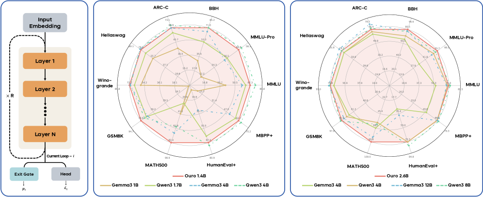
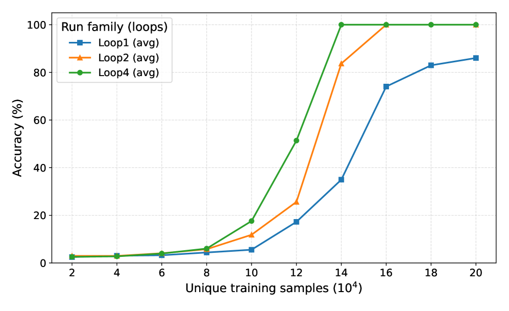
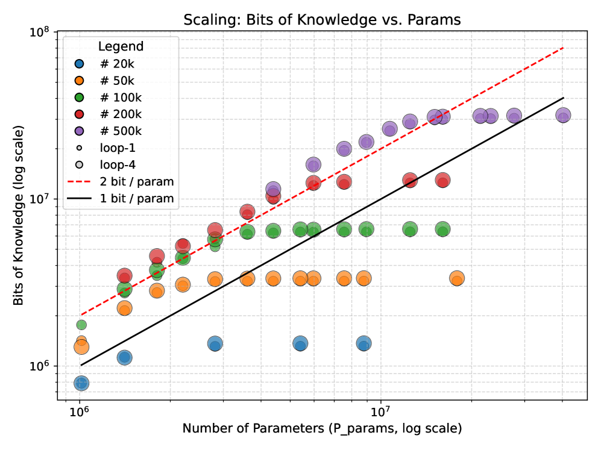

# 1.4B 干翻 4B？这篇论文让模型"原地转圈"就变强了

> Ouro：不加参数、不加 token，让同一组 Transformer 层反复跑，1.4B 模型的推理能力直逼 Qwen3-4B。

---

如果我告诉你，一个 1.4B 的小模型在数学推理上把 Qwen3-4B 按在地上摩擦（MATH500: 82.4 vs 59.6），你会怎么想？

堆数据了？用了什么秘密蒸馏配方？

都不是。它只做了一件事：**让模型把同一组层反复跑了 4 遍。**

这篇来自 Yoshua Bengio 参与的 70 人团队的论文，提出了 **Ouro**——一系列 Looped Language Model（LoopLM），在预训练阶段就内建了循环计算。名字取自衔尾蛇（Ouroboros），吞噬自身尾巴、永无止境的循环。

论文不仅开源了模型和全部 7.7T tokens 的训练数据，还回答了一个更深层的问题：**循环到底让模型学会了什么？**

答案可能会让你重新审视 CoT（Chain-of-Thought）的本质。

## 核心思路：不生成 token，只加深计算

当前 LLM 提升推理能力有三条路：

1. **堆参数**——太贵
2. **堆数据**——快枯竭了
3. **堆 CoT**——让模型"说出"推理过程，但上下文窗口有限

Ouro 走了**第四条路**：在每个 token 位置上，让同一组 Transformer 层反复作用多次，加深每个位置的计算深度——不多说一个字，但想得更深。



标准 Transformer：

```
输入 → [24层] → 输出 token
```

LoopLM（T=4）：

```
输入 → [24层] → [24层] → [24层] → [24层] → 输出 token
         ↑        ↑        ↑        ↑
       同一组权重，反复使用 4 次
```

参数量没变（还是 24 层的权重），但等效计算深度变成了 96 层。

## 效果：小模型的逆袭

Ouro 在 7.7T tokens 上预训练了两个模型（1.4B 和 2.6B），效果直接越级打怪：

**Ouro 1.4B vs 1-4B 级别模型：**

| 模型 | 参数量 | BBH | GSM8K | MATH500 |
|------|--------|-----|-------|---------|
| Qwen2.5-1.5B | 1.5B | 43.66 | 60.73 | 17.60 |
| Qwen3-1.7B | 1.7B | 53.51 | 70.28 | 25.80 |
| Qwen3-4B | 4B | 70.95 | 72.86 | 59.60 |
| **Ouro 1.4B** | **1.4B** | **71.02** | **78.92** | **82.40** |

1.4B 在 BBH 上超过 Qwen3-4B，MATH500 上是后者的 1.38 倍。

**Ouro 2.6B vs 3-12B 级别模型：**

| 模型 | 参数量 | MMLU-Pro | BBH | MATH500 |
|------|--------|---------|-----|---------|
| Qwen3-8B | 8B | 53.72 | 77.65 | 62.30 |
| Gemma3-12B | 12B | 49.21 | 78.41 | 83.20 |
| **Ouro 2.6B** | **2.6B** | **55.73** | **80.46** | **90.85** |

2.6B 在 MMLU-Pro 和 BBH 上超越 Qwen3-8B，MATH500 上超越 Gemma3-12B。

经过 SFT 得到的 Ouro-Thinking 推理模型同样亮眼——1.4B 在 AIME 2024 上拿到 65.0 分，超过 Qwen3-4B（61.3）和 DeepSeek-Distill-Qwen-7B（57.3）。

## 灵魂拷问一：不生成 token，怎么"理解更深"？

这是最直觉的疑问：CoT 至少还能把推理过程写出来，你原地转圈能转出什么？

关键在于：**token 只是信息的"瓶颈表示"，hidden state 才是模型真正思考的载体。**

每个 token 位置背后是一个 2048 维的连续向量。当模型把它重新喂入同一组 Attention + FFN 层时：

- **Attention 重新聚合**：上一轮每个位置已经"看过"了一轮全局信息，这一轮 Attention 相当于在**已经融合了上下文的表征**上再做一次深度聚合。信息传播距离翻倍。
- **FFN 重新变换**：非线性变换进一步组合和提炼特征。

想象一群人传话：第一轮你只知道邻座说了什么，第二轮你的邻座已经整合了他邻座的消息告诉你——**每多传一轮，你间接获得的信息量指数级增长。** 论文的理论证明也印证了这一点：LoopLM 解图可达性问题只需 $O(\log D)$ 步，而 CoT 需要 $O(n^2)$ 步。

KV Cache 实验也直接证明了 hidden state 在循环中发生了根本改变：

| KV Cache 策略 | GSM8K |
|------|-------|
| 4 轮都保留 | 78.92 |
| 只保留第 4 轮 | 78.85 |
| 只保留第 1 轮 | **18.73** |

第 1 轮和第 4 轮的 KV 值天差地别——循环确实在做有意义的计算更新，不是白转。

## 灵魂拷问二：转多了会不会"过平滑"？

搞过 GNN 的同学一定有这个直觉：消息传递层一多，所有节点的表征就趋于一致，信息全被抹平了。LoopLM 重复过同一组层，会不会有类似问题？

**答案是：确实存在，但机制不同。**

论文数据：

| 循环步 | 1 | 2 | 3 | **4** | 5 | 6 | 7 | 8 |
|--------|---|---|---|-------|---|---|---|---|
| MMLU (1.4B) | 41.2 | 60.4 | 66.7 | **67.5** | 66.6 | 65.8 | 65.3 | 64.5 |
| AIME24 (2.6B-Thinking) | 3.0 | 52.0 | **70.3** | 64.7 | 57.0 | 56.3 | 49.7 | 39.0 |

Base 模型在第 4 步后温和下降；Thinking 模型更惨，从 70.3 直接跌到 39.0。

GNN 的过平滑是"不同节点变成同一个向量"，LoopLM 的问题更像是**迭代映射的不动点收敛**——同一个函数 $f$ 反复作用，hidden state 收敛到不动点 $h^*$，之后继续循环就是在不动点附近做无意义的振荡。

Ouro 的应对策略很务实——**学会在恰好的时机停下来**。它训练了一个自适应退出门控，学习到的退出分布是：

```
步 1: 0.04% | 步 2: 8.6% | 步 3: 37.9% | 步 4: 53.5%
```

简单问题 2-3 步就退出，复杂问题才跑满 4 步。不是解决了过平滑，而是学会了在过平滑之前刹车。

## 灵魂拷问三：位置编码怎么办？

LoopLM 每轮循环都过同一组 Attention 层，而 Attention 中的 RoPE 位置编码是绑定在**序列位置**上的——也就是说，**每轮循环使用的位置编码完全一样**。

模型怎么知道自己在第几轮？

答案是：**它不通过位置编码知道，而是通过 hidden state 本身的内容推断。**

循环 1 的输入是原始 token embedding，循环 2 的输入是经过 24 层变换后的表征，两者的数值分布完全不同——就像你看到一个人的字迹就知道他几年级一样，模型从 hidden state 的"成熟度"推断自己在第几轮。

但这也解释了为什么外推能力差：第 5 轮的 hidden state 分布是训练时**从未见过的**，模型不知道该怎么应对。如果给循环维度加上显式的位置编码（比如 Loop Position Embedding），可能是突破循环步数限制的关键——但论文没有探索这个方向。

## 最意外的发现：CoT 可能在"编故事"

论文做了一个精妙的实验：用线性探针预测模型的最终答案，看"思考过程"是否真的改变了答案。

结果：

- **标准 CoT 模型（Qwen3-4B-Thinking）**：探针在"思考"开始前就能以 AUC=0.99 预测最终答案——也就是说，**模型先定了答案再"编"出推理过程**。CoT 大概率是事后合理化，不是真正的推理。

- **LoopLM**：步 2 和步 4 的决策仅 36.1% 一致——每轮循环都在真正修正之前的判断。



这对 interpretability 社区是一个重要信号：**你以为模型在"思考"，它可能只是在"表演思考"。**

## 循环到底增强了什么？

论文最核心的机制性实验给出了清晰的答案：

**知识容量**（模型能记住多少事实）：循环前后都是 ~2 bits/parameter，没有变化。

**知识操控**（模型能组合多少事实进行推理）：

| 模型 | 同参数量 | 树深度 10 | 树深度 24 |
|------|---------|----------|----------|
| 2 层 × 1 次 | 是 | 21.5% | 7.5% |
| **2 层 × 6 次** | **是** | **98.1%** | **78.0%** |
| 12 层 × 1 次 | 6x 参数 | 93.6% | 34.8% |

同样的 2 层权重，循环 6 次后在深度 24 的嵌套运算上从 7.5% 飙到 78.0%，甚至超过了参数量 6 倍的标准 12 层模型（34.8%）。



MMLU 子类别分析也验证了这一点：推理密集型类别提升最大（Elementary Math +155.6%, Formal Logic +143.3%），知识密集型类别提升最小（Virology +13.7%, Anatomy +21.4%）。

**一句话总结：循环不是让模型"知道"更多，而是让它更擅长"用已知的知识推理"。**

## 还有什么没解决？

1. **RL 训不动。** LoopLM 的动态循环退出和 vLLM/SGLang 不兼容，导致 GRPO/DAPO 训练失败。考虑到 RL 在 DeepSeek-R1 上的巨大提升，这可能严重限制了 Ouro 的推理上限。

2. **循环步数卡在 4。** 8 步循环导致梯度爆炸，被迫妥协到 4 步。论文没有尝试 gradient detach、progressive training 等可能的解决方案。

3. **同等 FLOP 下还是打不过标准 Transformer。** LoopLM 的优势本质上是"用更多计算换更少参数"。如果你不在乎参数量只在乎速度，标准 Transformer 仍然更优。

## 一个 Scaling 新方向

Ouro 为 LLM 的 Scaling 打开了一个新维度：不只是更大、更多数据、更长 CoT——**更深的循环**也是一条有效的路径。论文甚至给出了三变量 Scaling Law（$R^2$=0.96），覆盖模型大小、数据量和循环深度。

更重要的是，这项工作让我们重新思考一个根本问题：

> **推理应该发生在文本空间还是潜在空间？**

CoT 选择了文本空间——清晰、可解释，但可能只是"表演"。LoopLM 选择了潜在空间——不透明，但可能更"诚实"。最终的最优解，也许是两者的结合。

---

**论文链接：** https://arxiv.org/abs/2510.25741

**开源模型和数据：** 全部开源，包括 7.7T tokens 预训练数据

*你觉得推理应该"说出来"还是"想在心里"？欢迎留言讨论。*
