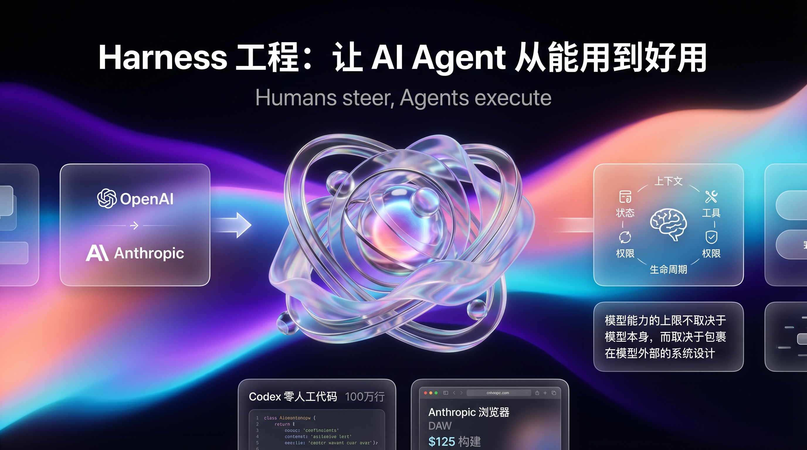
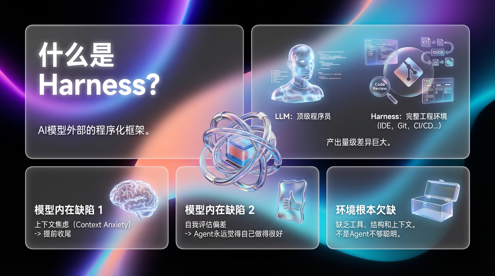
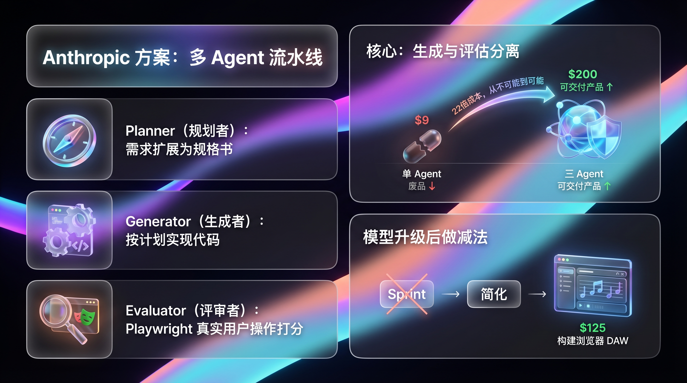
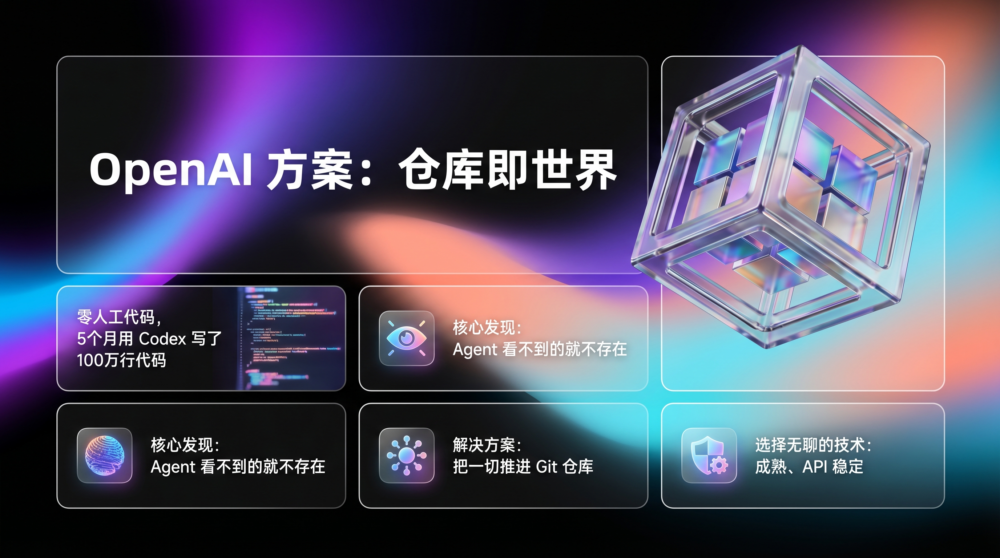
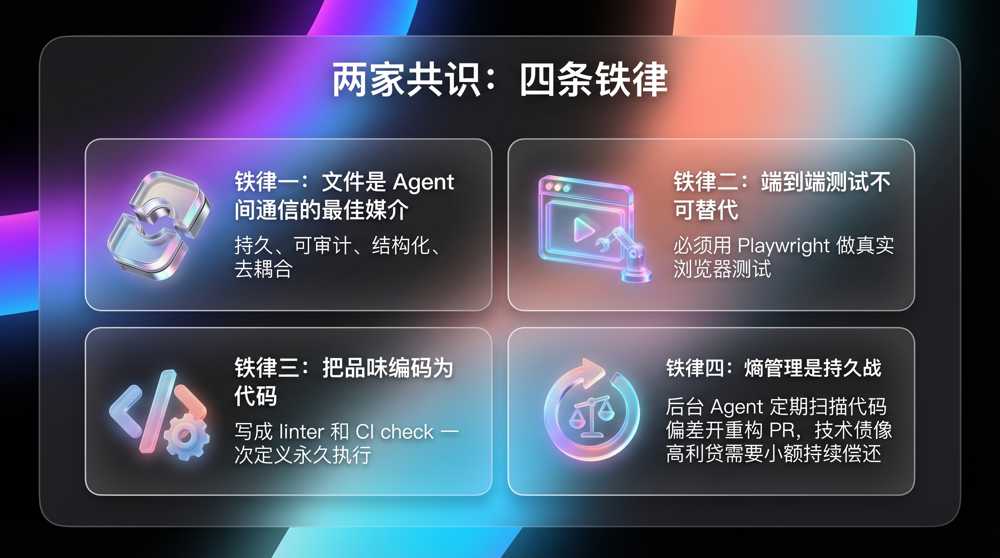
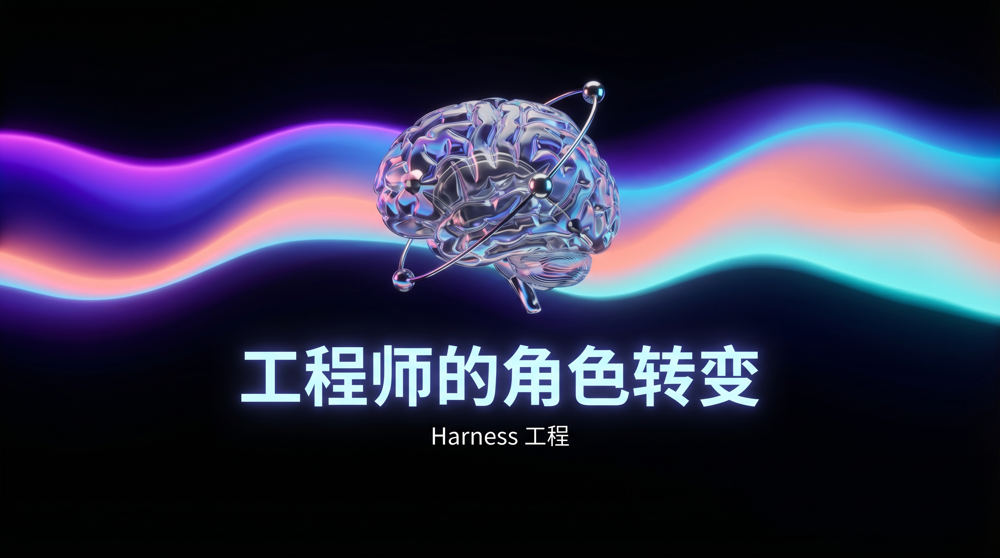

# OpenAI 和 Anthropic 都在押注的 Harness 工程，到底是什么？

> 不是模型不够强，是你没给它搭好台子。两家顶尖 AI 公司不约而同得出了同一个结论：**模型能力的上限，不取决于模型本身。**



---

最近有个事挺魔幻的。

OpenAI 说，他们用 Codex 从零开始、**零人工代码**，5 个月写了 100 万行代码，3 个工程师开了 1500 个 PR，日均 3.5 个 PR/人。产品有真实用户，能部署，能出 bug，也能修。

Anthropic 说，他们用 Claude 花 $125 和 4 小时，**从一句话需求构建出了一个能用的浏览器数字音频工作站（DAW）**。Agent 甚至能自己操作 DAW 来作曲。

这两家——全世界最卷的两家 AI 公司——几乎在同一时间，发表了同一主题的技术博客，用了同一个词：

**Harness。**



## 这东西到底是什么？

先说"不是什么"：Harness 不是 prompt engineering，不是 RAG，不是 fine-tuning，不是 multi-agent framework。

**Harness 是包裹在 AI 模型外部的整套运行环境。** 它管理 Agent 的上下文、状态、工具、权限、反馈循环和生命周期。它不改变模型的能力，但决定了模型能发挥出多少能力。

打个比方：LLM 是一个顶级程序员。Harness 是这个程序员的工作环境——IDE、Git、CI/CD、Code Review 流程、项目管理工具、团队协作规范。

一个大牛独自用记事本写代码，和同一个大牛在一个配备完善工程体系的团队里工作，**产出完全不是一个量级。**

OpenAI 的 Ryan Lopopolo 用一句话总结了这个新范式：

> **Humans steer. Agents execute.**（人类掌舵，Agent 执行）

## 为什么不能只靠模型？

两家公司从不同角度发现了同一个问题。

**Anthropic 发现的是模型的内在缺陷：**

- **上下文焦虑（Context Anxiety）：** 模型快用完上下文窗口时会"提前收尾、草草了事"。
- **自我评估偏差：** 让 Agent 评价自己的产出？它永远觉得自己做得很好——"即使在人类看来质量明显平庸"。

**OpenAI 发现的是环境的根本欠缺：**

> "Early progress was slower than we expected, not because Codex was incapable, but because **the environment was underspecified.**"

不是 Agent 不够聪明，是你没给它足够的工具、结构和上下文。当 Agent 失败时，正确的反应不是"再试一次"或者"换个 prompt"，而是问：**"什么能力缺失了？怎么让 Agent 看到并使用它？"**



## Anthropic 的方案：多 Agent 架构

Anthropic 的 Prithvi Rajasekaran 受 GAN 启发，设计了一个三 Agent 流水线：

```
Planner → Generator → Evaluator
(规划)     (实现)       (评审)
```

**Planner** 把一句话需求扩展成完整的产品规格书。**Generator** 按计划实现代码。**Evaluator** 用 Playwright 像真实用户一样操作应用，按量化标准打分。

关键在于**生成与评估分离**——你让写代码的人自己测自己，他永远觉得没问题。

实测一个复古游戏制作器：

| 方案 | 时长 | 成本 | 结果 |
|------|------|------|------|
| 单 Agent | 20 min | $9 | 界面能渲染，游戏不能玩 |
| 三 Agent | 6 hr | $200 | 16 个功能，游戏可玩可交付 |

22 倍成本，但产出从"废品"变成"产品"。**Harness 不是让简单任务变贵，而是让不可能的任务变为可能。**

后来 Opus 4.6 发布，模型变强了，他们又做了减法——砍掉 Sprint 结构，Evaluator 改为最终单次评审。简化后的 Harness 用 $125 就构建出了浏览器 DAW。

这引出了一条关键原则：**Harness 的每个组件都编码了"模型做不到"的假设。模型升级后，要重新验证这些假设，该拆的就拆。**



## OpenAI 的方案：仓库即世界

OpenAI 走了一条更激进的路——不是让 Agent 完成单个任务，而是让 Agent 团队持续开发整个产品。

他们的核心发现可以浓缩成一句话：

> **Agent 看不到的就不存在。**

Slack 里的讨论、Google Docs 里的决策、人脑中的默契——对 Agent 来说全是黑洞。所以他们把一切都推进了 Git 仓库：

- 架构讨论？→ 写成 design doc 提交
- 代码规范？→ 写成 linter 规则提交
- 产品需求？→ 写成 product spec 提交

`AGENTS.md` 不是百科全书，而是**目录表**——~100 行的"地图"，指向 `docs/design-docs/`、`docs/exec-plans/`、`docs/product-specs/` 等深层知识源。Agent 从小入口出发，按需探索。

他们还做了一件反直觉的事：选"无聊"的技术。因为成熟、API 稳定、训练集里见过很多的技术，Agent 更容易理解和推理。他们甚至选择自己重新实现某些功能，而不是引入黑盒的第三方库——Agent 需要能完全理解它使用的每一个依赖。



## 两家的共识：四条铁律

虽然路径不同，但 Anthropic 和 OpenAI 在核心原则上高度一致：

**1. 文件是 Agent 间通信的最佳媒介。** 两家都用文件系统而非 API 或数据库做 Agent 间状态传递。持久、可审计、结构化、去耦合。

**2. 端到端测试不可替代。** Agent 做完修改后会用 curl 或单元测试验证，但总是发现不了集成问题。必须用 Playwright/Puppeteer 做真实的浏览器测试。OpenAI 更进一步，把日志、指标、trace 全暴露给 Agent，让它能发出 "确保启动时间低于 800ms" 这样的指令。

**3. 把品味编码为代码。** 文档和规范在高吞吐量下会迅速腐烂。正确的做法是写成 linter、CI check、结构化测试——一次定义，永久执行。OpenAI 说："In a human-first workflow, these rules might feel pedantic. With agents, they become multipliers."

**4. 熵管理是持久战。** OpenAI 团队最初每周五花 20% 时间清理 "AI slop"。后来改用自动化：后台 Agent 定期扫描代码偏差，开重构 PR，大部分一分钟内审完自动合并。技术债像高利贷，小额持续偿还远好过积攒后痛苦地清偿。

## Claude Code 和 Codex：两种 Harness 产品

有意思的是，两家公司各自的 Coding Agent 产品——Claude Code 和 Codex——本身就是 Harness 理念的最佳实践。

Claude Code（512K+ 行 TypeScript）实现了完整的 Harness 体系：
- **Memory 系统**：4 种类型（user/feedback/project/reference）的跨会话记忆
- **Hook 系统**：在工具执行前后注入权限检查和结果变换
- **Skills 系统**：三层加载（编译内置 → 磁盘 → MCP），按需组合行为
- **Coordinator 模式**：Lead Agent 调度 Worker Agents，工具权限分层隔离

Codex 则走了标准化协议路线——App Server 用 JSON-RPC over stdio 暴露整个 Harness，让 VS Code、Web、CLI、Xcode、Desktop App 共用同一套 Agent 循环。协议定义了三层会话原语：Item（原子操作）→ Turn（一次 Agent 工作）→ Thread（持久化会话）。

**两条路，同一个目标：让 Harness 变得可复用、可扩展、可标准化。**



## 所以 Harness 工程到底是什么？

一句话版本：**Harness 工程是"设计 Agent 工作环境"的系统工程学科。**

它回答的核心问题不是"如何让模型更聪明"，而是"如何让已有的模型在复杂任务中发挥出最大能力"。

它包含两个层面：
- **任务层面**（Anthropic 侧重）：如何让 Agent 高质量地完成一个复杂任务——多 Agent 架构、上下文管理、反馈循环
- **项目层面**（OpenAI 侧重）：如何让 Agent 团队可持续地开发软件——仓库知识体系、架构约束、熵管理、品味编码

而最关键的认知转变是：**模型在变强，但 Harness 不会消失。旧的脚手架拆除，新的脚手架建起。** Anthropic 说："The space of interesting harness combinations doesn't shrink as models improve. Instead, it moves."

工程师的角色不是消失了，而是上移了一个抽象层——从写代码，变成设计让 Agent 写好代码的环境。

---

**参考文献：**

1. Justin Young, *Effective Harnesses for Long-Running Agents*, Anthropic, 2025-11
2. Ryan Lopopolo, *Harness Engineering: Leveraging Codex in an Agent-First World*, OpenAI, 2026-02
3. Celia Chen, *Unlocking the Codex Harness: How We Built the App Server*, OpenAI, 2026-02
4. Prithvi Rajasekaran, *Harness Design for Long-Running Application Development*, Anthropic, 2026-03

*你觉得 AI 时代的工程师，最核心的能力是什么？欢迎留言讨论。*
