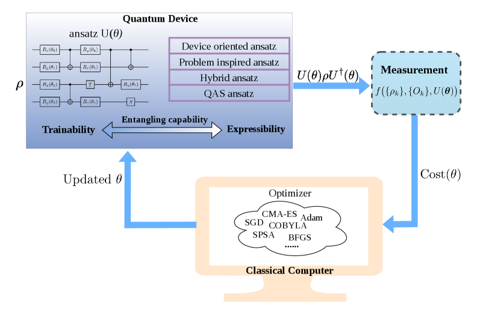
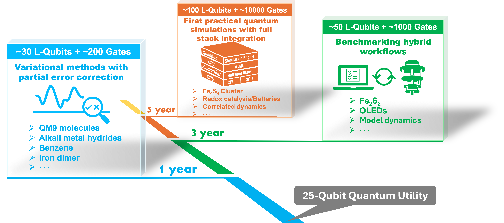
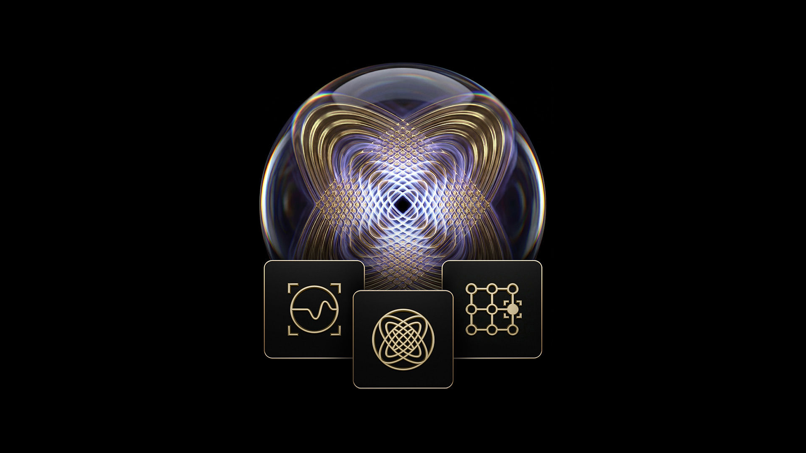

# 从旋转的硬币到万亿美元赛道：量子计算到底是什么？

想象一下：你的银行账户、电子邮件、医疗记录——几乎所有数字世界里的"锁"，都依赖同一个数学难题来保护。这个难题叫做**大整数分解**：给你两个大质数的乘积，让你反过来找出是哪两个质数。

用今天最快的超级计算机来解这个难题，需要的时间比宇宙的年龄还长。所以我们放心地用它来加密。

但 1994 年，数学家 Peter Shor 证明了一件事：如果有一台足够大的**量子计算机**，这个难题可以在几小时内解开。不是快一点，不是快十倍，而是从"宇宙年龄"级别直接降到"喝杯咖啡"级别。

这不是科幻。2025 年，Google 的研究人员估算，用不到 100 万个量子比特就能破解目前广泛使用的 RSA-2048 加密。虽然今天最大的量子处理器只有约 1000 个量子比特，但整个行业正在以惊人的速度追赶。

那么，量子计算到底是什么？它为什么能做到经典计算机做不到的事？离真正影响我们的生活还有多远？

---

## 从硬币说起：什么是量子比特？

你正在使用的电脑、手机——所有经典计算机的最小信息单位都是**比特（bit）**。一个比特只能是 0 或者 1，就像一个开关，要么开要么关。

量子计算机的最小信息单位叫**量子比特（qubit）**。它和经典比特的根本区别在于——

**一枚普通硬币**放在桌上，要么正面朝上，要么反面朝上，就像经典比特的 0 和 1。

**一枚旋转中的硬币**呢？在它落地之前，你说不清它是正面还是反面。它处于一种"既是正面也是反面"的中间状态。这就是量子力学中的**叠加态（superposition）**。

量子比特可以同时处于 0 和 1 的叠加态。当我们去"看"它（测量）的时候，它才会随机地"坍缩"为确定的 0 或 1。

*Bell 态制备电路：通过 Hadamard 门和 CNOT 门，两个量子比特变成"命运绑定"的纠缠态*

但一个叠加态的量子比特并不稀奇。量子计算的真正威力来自第二个关键概念：**纠缠（entanglement）**。

想象一对神奇的骰子：无论把它们分开多远，当你掷其中一个得到 6 时，另一个也必定是 6。不是因为它们事先约好了，而是它们之间存在一种超越距离的关联。爱因斯坦曾把这种现象称为"鬼魅般的超距作用"——他到死都觉得这事不对劲，但无数实验证明了纠缠是真实的。

**叠加 + 纠缠**结合起来，就产生了量子计算的核心优势：

- 1 个量子比特 → 2 个状态
- 10 个量子比特 → 1,024 个状态
- **300 个量子比特 → 比宇宙中所有原子的数量还多的状态**

还有一个秘密武器：**量子干涉**。量子算法通过精心设计，让正确答案的概率不断增大（波峰叠加），错误答案的概率不断减小（波峰与波谷抵消）。就像在水面上制造波纹，让有用信号变大，让噪声消失。

**叠加让量子计算机同时探索多条路径，纠缠让这些路径保持关联，干涉让最终结果指向正确答案**——三者缺一不可。

---

## 它能做什么？（以及不能做什么）

一个常见的误解："量子计算机就是超级快的电脑。"

**不对。**

量子计算机不会让你打开网页更快，不会让游戏帧率翻倍。它的优势集中在一类特殊的问题上——那些经典计算机所需时间呈指数级爆炸的问题。

*变分量子算法（VQA）的混合量子-经典工作流：量子处理器准备态，经典计算机优化参数*

**破解密码：** Shor 算法可以在多项式时间内分解大整数。对 RSA-2048 密钥，这意味着从"数十亿年"降到"几小时"。更可怕的是"先收集、后解密"攻击——有人可能已经在存储你今天的加密数据，等量子计算机成熟后再解密。好消息是，美国 NIST 已在 2024 年 8 月发布了三项**后量子密码标准**。

**大海捞针：** Grover 算法能把搜索 100 万条记录从查 50 万次降到约 1000 次——二次加速。

**模拟自然：** 这是量子计算最被看好的近期应用。用经典计算机模拟一个分子中电子的行为，计算量随电子数指数级增长。但量子计算机本身就是量子系统——用量子模拟量子，天然高效。药物研发、材料设计、化学反应理解都将受益。

*25-100 个逻辑量子比特即可在量子化学中实现实际影响*

**量子 + AI：** 2026 年的一项覆盖 570 多个实验的研究发现，量子层在多个 AI 任务中提升了 0.2%-5.8% 的性能。但经典模拟也在快速追赶，量子 ML 能否真正超越经典方法仍是悬而未决的问题。

| 问题类型 | 量子加速 | 现实意义 |
|---------|---------|---------|
| 整数分解 | **指数加速** | 威胁现有密码体系 |
| 无结构搜索 | 二次加速 | 有用但不颠覆 |
| 量子模拟 | **指数加速** | 最有前景的近期应用 |
| 组合优化 | 未证明 | 启发式，无理论保证 |
| 日常计算 | **无加速** | 量子计算机不擅长 |

---

## 谁在造量子计算机？一场四十年的长跑

量子计算不是突然出现的。它是四十多年科学积累的结果。

**1982 年**，Feynman 提出用量子系统模拟量子物理的设想。**1994 年**，Shor 算法震惊了学术界和情报机构。**2019 年**，Google 用 53 量子比特的 Sycamore 宣称"量子优越性"——200 秒完成超级计算机需要 10,000 年的任务。**2020 年**，中科大九章以 76 个光子实现了光量子优越性。

*Google Willow 芯片：从 3x3 到 7x7，每增加一级编码，错误率减半——近 30 年来量子纠错领域追求的里程碑*

然后是 2024 年 12 月的重大突破：**Google Willow 芯片**（105 量子比特）首次证明量子纠错可以随规模扩大而真正改善。逻辑量子比特的寿命超过了最佳物理量子比特 2.4 倍。

2025 年 2 月，**Microsoft 展示了 Majorana 1 拓扑量子比特**，**Amazon 公布了 Ocelot 猫态量子比特芯片**。2026 年 4 月，**Nvidia 发布了 Ising 量子 AI 模型**，用 AI 校准量子处理器，将校准时间从数天缩短到数小时。

*Nvidia Ising：全球首个开源量子 AI 模型，让 AI 成为量子计算机的"操作系统"*

现在有六条主要赛道在同时推进：

- **超导量子比特** — Google Willow、IBM（路线图到 2033 年）、中科大祖冲之
- **离子阱** — Quantinuum（Helios 98 qubits，准备 IPO）、IonQ（$30 亿+收购扩张）
- **拓扑量子比特** — Microsoft Majorana 1
- **光量子** — PsiQuantum（$6B 估值）、中科大九章
- **中性原子** — QuEra（3000 量子比特系统）、Pasqal
- **量子退火** — D-Wave（5,760 qubits）

这还是一场**国家级竞赛**：美国投入超 $30 亿、中国估计 $50-150 亿、欧盟 €10 亿、英国 £45 亿……量子计算已经上升为国家战略。

---

## 离我们还有多远？

如果把量子计算比作登月——**我们已经把火箭送上了天，但还没到月球。**

当前的量子计算机处于**"嘈杂的青春期"（NISQ 时代）**。量子比特极其脆弱：Google Willow 上量子比特的寿命仅为 85 微秒——你眨一次眼的时间里，量子信息就已经"蒸发"了一千次。

*Google Willow 实验中，错误率随纠错码规模的增大而指数级下降——量子纠错真的在起作用*

好消息是，**量子纠错正在取得突破**。把量子信息"分散"存储在多个物理量子比特上，即使个别出错也能恢复——就像把拼图碎片分给很多人保管，丢几块也能拼回来。Google Willow 证明了这条路行得通，IBM 的 qLDPC 码将所需资源降低了 90%。

各大公司的路线图是：

- **IBM Starling（2029 年）：** 200 逻辑量子比特，计算能力是当前的 20,000 倍
- **IBM Blue Jay（~2033 年）：** 2,000 逻辑量子比特
- **Microsoft：** 数年内展示拓扑量子比特优势

*破解 RSA-2048 所需的物理量子比特数：从 10 亿（2012）→ 2000 万（2019）→ 不到 100 万（2025）*

虽然大规模容错量子计算还在路上，但量子技术已经在落地：中国建成了 4,600 公里量子通信网络、NIST 的后量子密码标准已经发布、量子传感器已经商用。

---

## 回到那把锁

还记得开篇的那把锁吗？

现在你知道了：量子计算机确实有可能打开它。但你也知道了——**新的锁已经在更换中。** NIST 的后量子密码标准已经发布，全球正在从旧锁换成量子计算机也打不开的新锁。

量子计算不是一个"突然降临"的事件，而是一场持续了四十多年的科学长跑。费曼在 1982 年种下的种子，经过 Shor、Grover、Gottesman 的理论浇灌，通过 Google、IBM、Microsoft、中科大和无数创业公司的工程实现，正在一步步长成一棵大树。

**我们正处在这棵树即将开花结果的阶段。**

也许 2029 年，也许 2033 年，也许更久——但方向已经清晰，脚步不会停下。

---

*本文基于 80+ 篇 arXiv 论文、Nature/Science 发表论文及官方公告整理而成。完整技术细节和引用来源可在 Li Yi 的研究笔记中查阅。*
