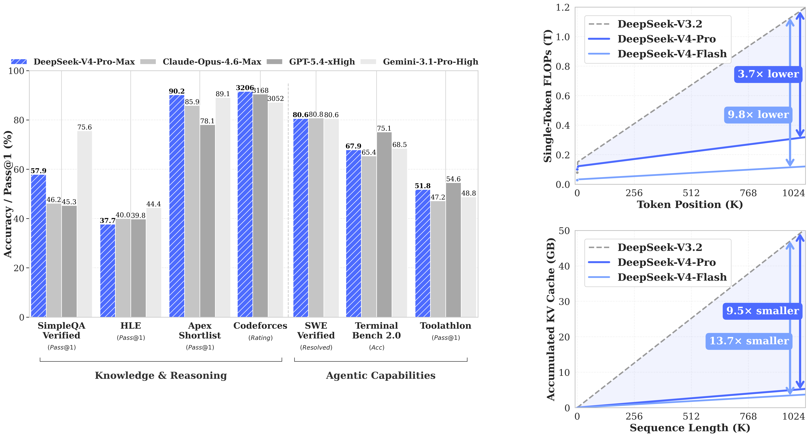
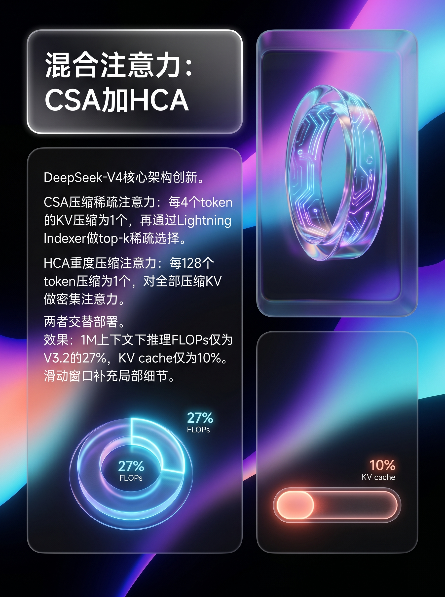
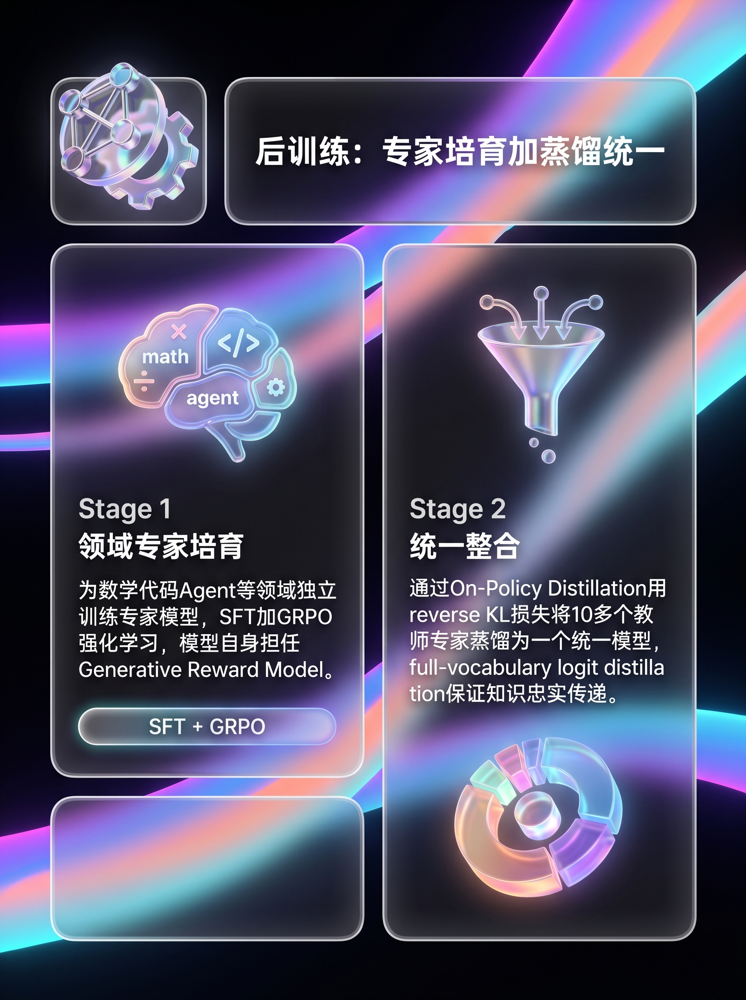

# DeepSeek-V4 技术深度解读：1.6 万亿参数，百万 Token 上下文，开源最强

> 55 页技术报告全面拆解：一文看懂 DeepSeek-V4 如何用三板斧打破长上下文效率瓶颈。

---

4 月 22 日，DeepSeek 悄悄在 HuggingFace 上传了两个新模型——DeepSeek-V4-Pro 和 DeepSeek-V4-Flash。

没有发布会，没有预热营销，一如既往地「低调放炸弹」。

但这颗炸弹的当量不小：**1.6 万亿参数、49B 激活、原生百万 Token 上下文**。配套的 55 页技术报告，信息密度极高，每一页都值得细读。

我花了一天时间通读了这份报告。如果只用一句话总结 V4 的核心叙事，那就是：

**打破超长上下文处理的效率瓶颈，让百万 Token 成为日常。**

先看一组数字感受一下（下图来自技术报告 Figure 1）：

| 指标 | V3.2 → V4-Pro（1M 上下文） |
|------|--------------------------|
| 推理 FLOPs | **降至 27%** |
| KV cache | **降至 10%** |
| 相对标准 BF16 注意力 | KV cache 降至约 **2%** |

这意味着，V4-Pro 的 49B 激活参数虽然比 V3.2 的 37B 还多，但在百万 Token 上下文下反而更快、更省内存。

## DeepSeek 进化史：从 V2 到 V4

在深入技术之前，先拉一条时间线：

| 特性 | V2 (2024.5) | V3 (2024.12) | V3.2 (2025.12) | **V4 (2026.4)** |
|------|-------------|-------------|----------------|-----------------|
| 总参数 | 236B | 671B | 671B | **1.6T** |
| 激活参数 | 21B | 37B | 37B | **49B** |
| 上下文 | 128K | 128K | 128K | **1M** |
| 注意力 | MLA | MLA | MLA+DSA | **CSA+HCA** |
| 优化器 | AdamW | AdamW | AdamW | **Muon** |

每一代都有标志性的技术跳跃。V4 的跳跃是**三连跳**：注意力架构、残差连接、优化器全部换代。

## 核心创新一：CSA + HCA 混合注意力

这是 V4 最核心的架构突破。

传统 Transformer 的注意力机制有一个老问题：计算量随序列长度**二次方增长**。128K 还能忍，到 1M 直接不可用——光 KV cache 就能把显存撑爆。

V4 的解法是设计两种「压缩注意力」，像夹心饼干一样交替使用：

### CSA（Compressed Sparse Attention）：先压缩，再挑选

三步走：

1. **KV 压缩**：每 4 个 token 的 KV cache 通过可学习的 softmax 加权合并为 1 个条目，序列长度直接缩短 4 倍
2. **Lightning Indexer 稀疏选择**：用一个轻量级「检索器」，从所有压缩 KV 中挑出最相关的 top-k 个（V4-Pro 中 k=1024）
3. **滑动窗口补充**：最近 128 个 token 保留原始 KV 不压缩，确保局部细节不丢失

CSA 的精妙之处在于：**它不是简单地扔掉信息，而是先压缩再智能检索**。Lightning Indexer 本质上是把「该注意哪些历史信息」转化成了一个轻量级检索问题。

### HCA（Heavily Compressed Attention）：压得更狠，但全都要

HCA 更激进——每 128 个 token 压缩为 1 个条目。但它不做稀疏选择，而是对所有压缩后的 KV 做完整注意力。

你可以这样理解：
- **CSA** = 近视眼 + 望远镜（看不远，但挑重点看得很清楚）
- **HCA** = 俯瞰全局的卫星图（什么都能看到，但细节模糊）

两者交替使用，既有全局视野，又不丢关键细节。

## 核心创新二：mHC 流形约束超连接

深层网络有个经典难题：**信号在 60+ 层传播过程中容易数值爆炸或消失**。

V4 引入了 Manifold-Constrained Hyper-Connections（mHC），核心思路非常优雅：

**把残差连接的映射矩阵约束到「双随机矩阵」流形上。**

双随机矩阵有一个好性质：谱范数恒等于 1。这意味着：
- 信号经过残差映射不会被放大也不会被缩小
- 多层堆叠后仍然稳定（因为双随机矩阵的乘积还是双随机矩阵）

具体实现用 **Sinkhorn-Knopp 算法**做 20 次迭代投影。通过融合 kernel 优化后，额外训练开销仅 **6.7%**——这个代价换来万亿参数的稳定训练，很划算。

V4 还有两个训练稳定性的「奇技淫巧」：

- **Anticipatory Routing（预判式路由）**：用历史参数算路由，用当前参数算特征。这个解耦操作能消除 MoE 训练中的 loss spike。DeepSeek 坦承理论机制还不清楚，但实用效果显著。
- **SwiGLU Clamping**：把 SwiGLU 激活值钳制在 [-10, 10]，简单粗暴但有效消除 outlier。

## 核心创新三：领域专家培育 + On-Policy 蒸馏

V4 的后训练范式做了一个重大变革：**用 On-Policy Distillation 完全替代了混合 RL**。

### Stage 1：领域专家培育

不再「一锅炖」，而是为每个领域（数学、代码、Agent、写作等）**独立训练**一个专家模型：

1. 先用高质量数据做 SFT
2. 再用 GRPO 做领域特定 RL

亮点是**模型自己当 Reward Model**——让 actor 网络兼任 Generative Reward Model (GRM)，RL 同时优化生成和评判能力。少量人类标注就能泛化。

### Stage 2：On-Policy 蒸馏统一

10+ 个领域专家，通过 on-policy distillation 融合为一个统一模型。

关键技术选择：
- **Reverse KL**：学生自己采样，教师来打分，保证 on-policy
- **Full-vocabulary logit distillation**：不是简单的 token-level 近似，而是保留完整 128K 词表的 logit 分布，梯度更稳定

为什么不继续用混合 RL？因为多目标 RL 容易 reward hacking，不同领域的奖励信号互相冲突。蒸馏方案更模块化、更可控。

## 效果：开源最强是什么水平？

| 基准 | V4-Pro-Max | Opus 4.6 | GPT-5.4 | Gemini-3.1-Pro |
|------|-----------|----------|---------|---------------|
| Codeforces 评分 | **3206** | — | 3168 | 3052 |
| LiveCodeBench | **93.5** | 88.8 | — | 91.7 |
| HMMT 2026 Feb | 95.2 | 96.2 | **97.7** | 94.7 |
| SWE-Verified | 80.6 | **80.8** | — | 80.6 |
| SimpleQA-Verified | 57.9 | 46.2 | 75.6 | **75.6** |
| 中文 SimpleQA | 84.4 | 76.4 | 76.8 | **85.9** |

几个关键解读：

**代码能力跻身顶级**：Codeforces 3206 分，超越 GPT-5.4（3168）和 Gemini-3.1-Pro（3052），首次有开源模型在竞赛编程中匹配闭源。LiveCodeBench 93.5 也是全场最高。

**推理追上第一梯队**：数学竞赛（HMMT、IMO）成绩接近 GPT-5.4 和 Opus 4.6，虽有差距但已极小。

**知识仍是短板**：SimpleQA 等知识密集型任务上，V4 大幅领先其他开源模型，但与 Gemini-3.1-Pro 仍有明显差距。DeepSeek 自评「落后前沿约 3-6 个月」。

**中文能力突出**：功能性写作赢率 62.7% vs Gemini-3.1-Pro；白领任务 non-loss 率 63% vs Opus 4.6。

还有一个有趣的数据：V4-Flash（仅 13B 激活）在 Think Max 模式下的推理能力，已经接近 V4-Pro 的 Think High 模式。**小模型 + 更多思考时间 ≈ 大模型 + 较少思考时间**，测试时计算扩展（test-time scaling）的威力在此。

## 值得关注的工程细节

除了三大创新，技术报告中还有几个值得圈出来的工程亮点：

**1. MoE 通信-计算完全重叠**：V4 把专家分成多个 wave，流水线执行，理论加速 1.92×。并且向芯片厂商喊话：「带宽超过某个阈值后收益递减，不如把面积给计算单元。」

**2. Bitwise 确定性训练**：整个训练栈实现了位级确定性——同样的输入在任何批次大小下产生完全相同的输出。这在调试 loss spike 和保证后训练一致性方面价值极大。

**3. Quick Instruction**：在输入末尾附加特殊 token，让模型在正式生成前并行完成搜索判断、标题生成等辅助任务，共享 KV cache，降低首 token 延迟。

**4. DSec 弹性沙箱**：为 Agent 训练和推理构建的生产级沙箱平台，支持 Function Call / Container / microVM / fullVM 四种基底，单集群管理数十万并发实例。

## 局限与思考

诚实地说，V4 不是没有问题：

1. **架构复杂度高**：CSA + HCA + mHC + Muon + Hash Routing + Anticipatory Routing + SwiGLU Clamping… 报告自己也承认「保留了很多初步验证的组件，架构相对复杂」。哪些真正必要？需要后续 ablation 研究。

2. **长上下文仍有退化**：MRCR 任务显示 128K 之后性能开始下降。百万 Token 的潜力还没完全释放。

3. **部分创新理论空白**：Anticipatory Routing 为什么能消除 loss spike？SwiGLU Clamping 的理论依据是什么？DeepSeek 选择先公开、后解释——这种务实精神值得尊敬，但也留下了研究空间。

## 写在最后

回看 DeepSeek 的技术演进：V2 引入 MLA 和 DeepSeekMoE，V3 推到 671B 并开源训练数据，V3.2 加入 DSA 和 agentic 能力，V4 则在注意力、残差、优化器三个维度同时换代。

每一代都不是简单的「堆参数」，而是在架构层面做真正的创新。V4 的 CSA + HCA 混合注意力和 mHC 流形约束，代表了一种深思熟虑的系统设计能力。

**百万 Token 上下文不再是实验室玩具，而是可以日常使用的生产力工具。** 这对 Agent、RAG、长文档分析等下游场景的影响，可能比模型本身的 benchmark 数字更深远。

下一步是什么？报告末尾提到了多模态和在线学习。DeepSeek-V4 只是 Preview 版本——正式版还会更强。

---

> **技术报告原文**：[DeepSeek-V4 Technical Report (PDF)](https://huggingface.co/deepseek-ai/DeepSeek-V4-Pro/blob/main/DeepSeek_V4.pdf)
>
> **模型下载**：[HuggingFace](https://huggingface.co/collections/deepseek-ai/deepseek-v4) | [ModelScope](https://modelscope.cn/models/deepseek-ai/DeepSeek-V4-Pro)

*这是「一个名字逼死 Ian 无数脑细胞」的 AI 技术深度解读系列。如果觉得有收获，欢迎点赞关注。*
