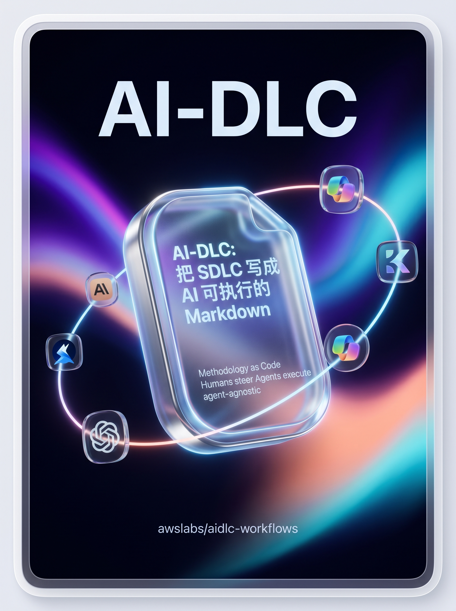
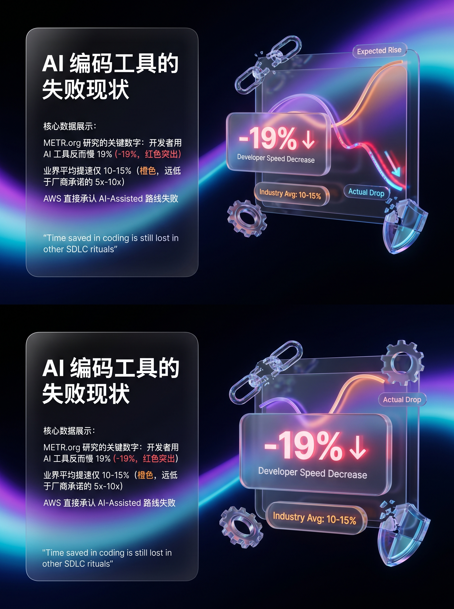
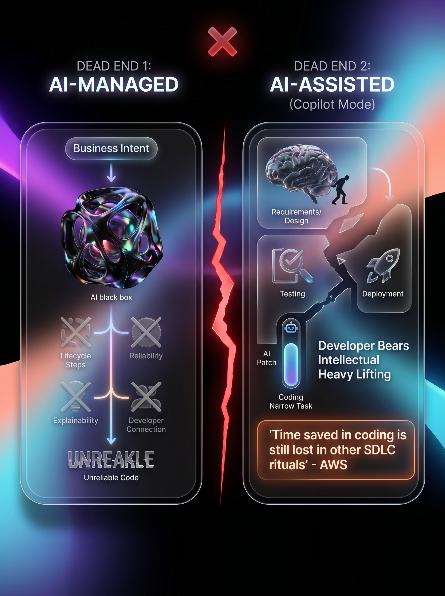
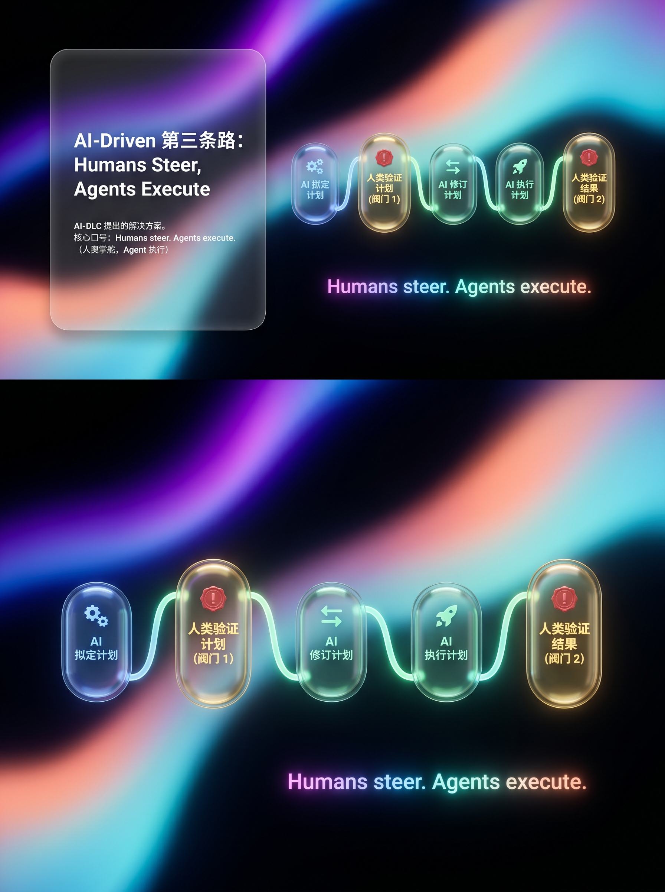
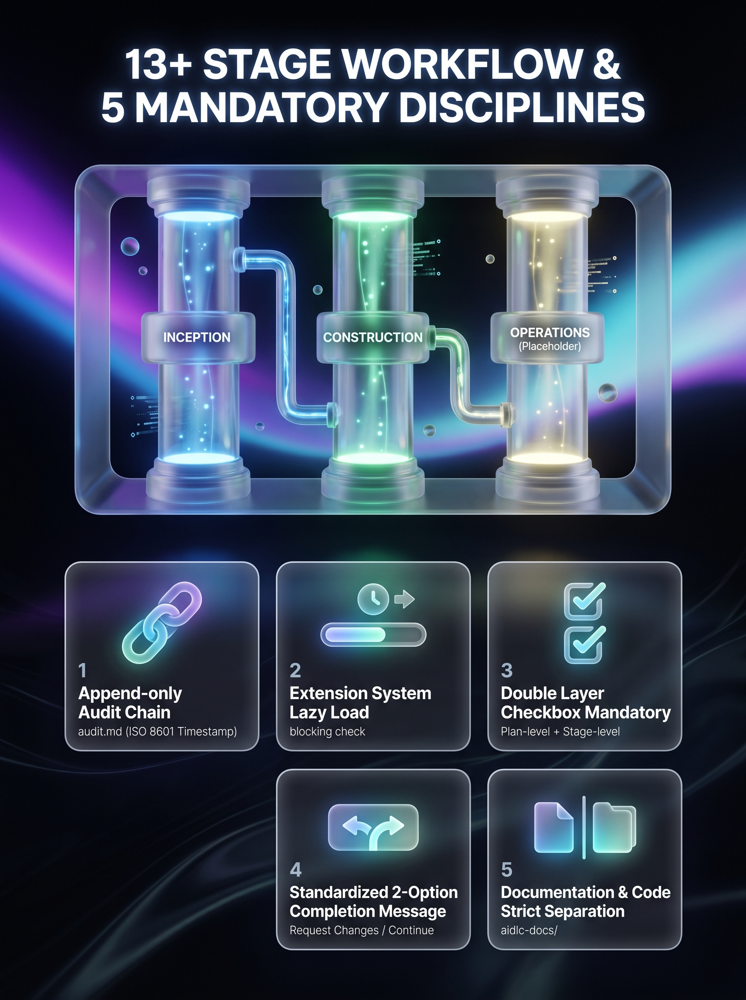
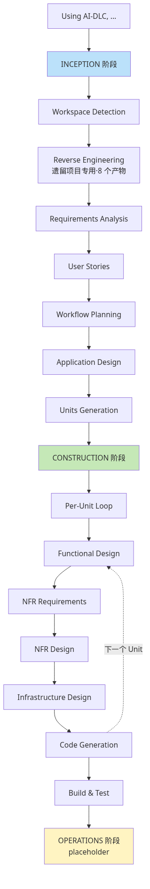
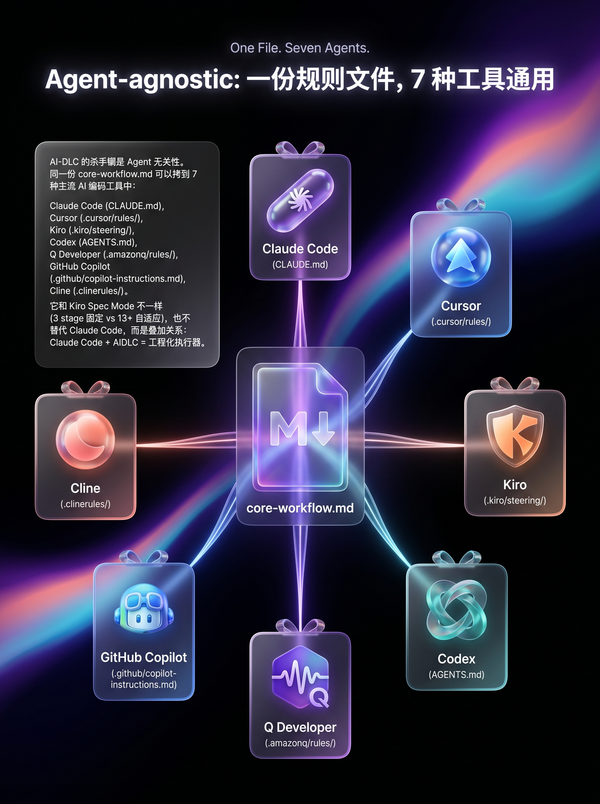
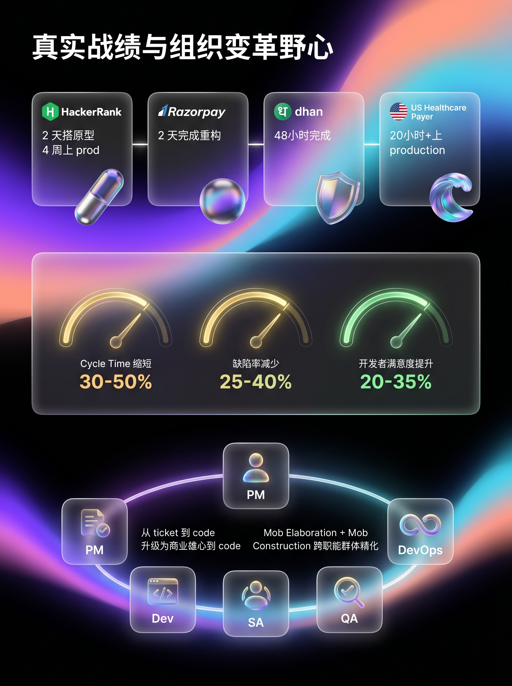

# AWS 偷偷开源了一份"AI 编码方法论"，3 天就在 GitHub 上拿了 1500 星



> METR 的研究说，开发者用 AI 反而**慢了 19%**。AWS 的回应不是又造一个新 Agent，而是写了一份 25KB 的 Markdown 文件——告诉 Claude Code、Cursor、Kiro 怎么"按方法论干活"。

---

## 一个魔幻的事实：用 AI 写代码，可能更慢



最近读到一组数据，挺打脸的。

**METR.org** 的实验结果：开发者用 AI 工具做任务，**比不用 AI 慢了 19%**。

业界平均的"AI 提速比"也只有 **10–15%**——和厂商承诺的"5 倍 / 10 倍"差了一个量级。

更尴尬的是，AWS 在最新发布的 AI-DLC 方法论里直接把这个数据作为开场——**他们承认了"AI-Assisted"这条主流路线失败了。**

然后他们做了件挺有意思的事：

> 不是再造一个 Copilot 替代品，而是开源了一份**方法论**——告诉**任意** AI 编码工具（Claude Code、Cursor、Kiro、Q Developer、Codex、Copilot、Cline）：**应该按什么流程干活。**

这就是 **AI-DLC（AI-Driven Development Life Cycle）**。仓库 [awslabs/aidlc-workflows](https://github.com/awslabs/aidlc-workflows)，截至今天 1553 星。

## 它到底是什么？25KB 的 Markdown，仅此而已

打开仓库你会震惊。它不是 SaaS、不是 CLI、不是 IDE 插件，也不是 Agent。

**就是一份 25KB 的 `core-workflow.md`，加上一堆扩展规则。**

用法简单到离谱：

| 你用什么工具 | 把文件拷到哪 |
|---|---|
| **Claude Code** | `CLAUDE.md` |
| **Cursor** | `.cursor/rules/ai-dlc-workflow.mdc` |
| **Kiro** | `.kiro/steering/` |
| **Codex** | `AGENTS.md` |
| **Q Developer** | `.amazonq/rules/` |
| **Copilot** | `.github/copilot-instructions.md` |

然后在聊天框里说一句：

```
Using AI-DLC, 帮我做 XXX
```

工作流就自动接管了。

AWS 给出的核心原则只有 5 条，第二条特别关键：

> **Methodology first.** AI-DLC 是方法论，不是工具。用户**不应该需要安装任何东西**就能开始用。

## 为什么主流 AI 编码工具都失败了？



行业现状有两条死路：

### 死路 1：AI-Managed（AI 全自动写代码）

```
商业意图 ──▶ [AI 自主开发] ──▶ 软件系统
              （没有任何 lifecycle 步骤）
```

**问题**：

- 不可靠（seldom works）
- 不可解释（unexplainable）
- **开发者和代码"断联"**——你根本不知道 AI 写了什么、为什么这么写

### 死路 2：AI-Assisted（Copilot 模式，目前主流）

```
商业意图 → 需求 → 设计 → 编码（← AI 在这里）→ 编码 → 编码
                            ↑
                    开发者承担"智识重活"
                    AI 只在窄任务里打补丁
```

**问题**——AWS 用了句很狠的话：

> **"Time saved in coding is still lost in other SDLC rituals."**
> 编码省下的时间，在需求、设计、测试、部署等环节又被吐回去了。

### AIDLC 的第三条路：AI-Driven



> AI **编排**整个开发流程——规划、任务分解、架构建议。
> 开发者保留**验证、决策和监督**的最终责任。

一句话总结：

> **Humans steer. Agents execute.**
> 人类掌舵，Agent 执行。

具体操作模型是这 5 步：

```
AI 拟定计划 ─▶ 人类验证计划 ─▶ AI 修订计划 ─▶ AI 执行计划 ─▶ 人类验证结果
              ↑ 阀门 1                                    ↑ 阀门 2
```

每个阀门都是**强制人审**——不是"AI 决定大方向，遇到难题来问你"，而是"每个阶段完成后必须等你点 Continue"。

## 13+ 个 Stage，每一步都被审计



这才是 AIDLC 真正硬核的地方。它把 SDLC 拆成了 3 大阶段、13+ 个 stage：



**真正的杀手锏**是这 5 条强制纪律：

### 1. Append-only 审计链 (audit.md)

每一次用户输入必须**完整原文**记录、ISO 8601 时间戳。规则文件里写得很狠：

> **CRITICAL**: 永远不要用会 overwrite 的工具修改 audit.md。Capture 用户的 COMPLETE RAW INPUT，**禁止 paraphrase 或 summarize**。

### 2. Extension 系统（懒加载）

`extensions/` 目录下放 security、property-based testing 等扩展。启动时**只加载 `*.opt-in.md`**（节省 context），用户在需求阶段勾选后才加载完整规则——而且一旦启用，**每个 stage 都会做 blocking check**，不合规根本不让进下一阶段。

### 3. 双层 Checkbox 强制

- Plan-level：每个 stage 内部步骤
- Stage-level：跨 stage 的总进度

规则原文：

> **NEVER complete any work without updating plan checkboxes**.
> 必须在**同一次交互内**勾选 [x]，不能延后。

### 4. 标准化 2 选项完成消息

每个 stage 完成时，AI **只能** 给：

```
[Request Changes]   [Continue to Next Stage]
```

明令禁止"涌现出"3 选项菜单。语义在所有阶段保持一致——人审纪律可重复。

### 5. 文档和代码严格分离

```
<workspace-root>/        # 应用代码在这里
└── aidlc-docs/          # 仅放文档，绝不放代码
    ├── inception/
    ├── construction/
    ├── aidlc-state.md   # 状态机（session 中断可续）
    └── audit.md         # 审计链（append-only）
```

## 和 Kiro Spec、Claude Code 是什么关系？



很多人会问：**Kiro 不是已经有 spec mode 了吗？Claude Code 不是有 plan mode 吗？**

GitHub Issue #182 里 AWS 官方做了对比：

| | **Kiro Spec Mode** | **AI-DLC** |
|---|---|---|
| 阶段数 | 3 个固定 | **13+** 个，自适应跳过 |
| 支持 Agent | 仅 Kiro | Kiro / Q / Claude Code / Cursor / Cline / Copilot / Codex / 任意 markdown rules |
| 可定制 stage | ❌ 写死 | ✅ 可加减 + 自定义扩展 |
| 遗留项目支持 | Steering files | **专门 Reverse Engineering 阶段（8 产物）** |
| 审计链 | 无 | append-only audit.md |
| CI/CD | 无 | GitHub Actions + 自动 evaluator |
| NFR/Infra 设计 | 无独立阶段 | per-unit 独立 stage |

**它和 Claude Code 不是替代关系，是叠加关系**：

- Claude Code 是"裸 agent"——能调用工具、改文件
- Claude Code + AIDLC = **一个被强制按 SDLC 干活、每步留痕、随时可暂停可恢复的工程化执行器**

你只需要把 `core-workflow.md` 拷成项目根的 `CLAUDE.md`，下次跟 Claude Code 说 "Using AI-DLC, ..."，它就自动按 13+ stage 推进，每步等你审批。

## 真实战绩：48 小时干完原计划 2 个月的活



AWS 给出的客户案例（**注意：这是销售口径，不是第三方测量**）：

| 客户 | 工程量 | 时长 |
|---|---|---|
| **HackerRank** ($500M) | AI 监考微服务（眼动/物体/三角面）+ UI + 报告 | 2 天搭原型，4 周上 prod |
| **Razorpay** ($7.5B) | PHP 单体 → Go 微服务（多租户重构）| **2 天** |
| **Dhan**（印度券商） | 6 个核心模块到 pre-prod | **48 小时**完成原计划 2 个月 |
| **Healthcare Payer**（美国医保） | DDD 驱动的 Production 平台 | 20 小时 + 3 地远程团队 |

AWS 自报指标：

| 指标 | 传统 SDLC | AIDLC | 改善 |
|---|---|---|---|
| Cycle Time | 周到月 | 小时到天 | **30–50% 缩短** |
| 缺陷率 | 波动 | 一致 | **25–40% 减少** |
| 开发者满意度 | 传统 | 战略聚焦 | **20–35% 提升** |

建议把它当作"在 AWS 咨询 + workshop 配合下的最佳案例"——**但即便打个对折，也比 METR 那个 −19% 的现状好太多。**

## 它真正想推的——不是工具，是组织变革

AIDLC 的"野心"——重写每个 SDLC 角色的工作内容：

| 角色 | 传统 | AIDLC 后 |
|---|---|---|
| **PM/PO** | 写需求、协调团队 | **验证 AI intent 拆解、批准 AI 提议的 Units** |
| **开发** | 按需求写代码、手测 | **验证 AI 生成的 domain model、批准架构决策** |
| **架构师** | 个人架构设计 | **验证 AI 逻辑设计、引导 AI 做 AWS 服务映射** |
| **QA** | 手写用例、人工执行 | **验证 AI 测试场景、引导 AI 测试优化** |
| **DevOps** | 手工 pipeline | **验证 AI 部署单元、批准 AI infra 推荐** |

AWS 给这种新形态起了两个名字：

- **Mob Elaboration**：跨职能"群体精化"取代孤岛交付
- **Mob Construction**：开发者"以判断的速度迭代"——从"ticket 到 code"升级为"商业雄心到 code"

## 我的判断：这件事真正的意义

读完这份资料，我的几个 takeaway：

**1. AIDLC 的创新不是阶段划分。**

瀑布、RUP、SAFe、Agile 都拆过 13+ 阶段。它真正的创新是：**把"阶段"重写成 AI 可执行 + 人审批 + audit-loggable 的 markdown rule**。

这是"**方法论作为代码**"——SDLC 第一次以可被 AI 直接执行的形式存在。

**2. 它和学界的方向一致。**

近一年学界（Voyager、SWE-agent、recent reasoning + reflection 论文）都在指出：单 prompt → 单输出 范式在复杂工程任务上失败，需要 reasoning + reflection + memory + structured tool use。

AIDLC 是工业界对这个反思的工程化回应——它不研究模型怎么 reflect，但它**强制把 reflection 拆成显式 stage 和审批阀门**。

**3. 它不适合所有场景。**

- 一次性脚本？不需要 13 个 stage
- 个人探索性研究？流程开销过大
- 不需要审计的小团队？太重

**它真正适合**：

- 有合规需求的企业（金融、医疗、政府）
- 接手老代码的项目（reverse engineering 8 产物超值）
- 跨地理协同的远程团队（audit.md 自动同步上下文）
- 想给团队建立"AI 编码 SOP"的工程组织

**4. 这只是开始。**

OPERATIONS 阶段还是 placeholder。Extension 系统目前只内置 security 和 property-based testing。如果 AWS 把 AgentCore、CodeCatalyst 接入 OPERATIONS 阶段，这套方法论的杀伤力会再上一个台阶。

---

## 想试试？

1. 装好 Claude Code（或 Cursor / Kiro / Q Developer 任意一个）
2. 从 [仓库 Releases](https://github.com/awslabs/aidlc-workflows/releases/latest) 下载 zip，解压
3. 拷贝规则文件：

```bash
# Claude Code 用户
cp ~/Downloads/aidlc-rules/aws-aidlc-rules/core-workflow.md ./CLAUDE.md
mkdir -p .aidlc-rule-details
cp -R ~/Downloads/aidlc-rules/aws-aidlc-rule-details/* .aidlc-rule-details/
```

4. 进项目，跟 Claude Code 说一句：

```
Using AI-DLC, 帮我把这个 PHP 项目重构成 Go 微服务
```

剩下的它会按 13+ stage 推进，每一步等你审批。

---

> Methodology first. Models keep getting better — but **process discipline outlives any specific model**.
> 方法论永远比具体模型活得久。

🤖 Generated with [Claude Code](https://claude.com/claude-code)

---

**参考资料**

- 仓库：<https://github.com/awslabs/aidlc-workflows>
- 核心规则：<https://raw.githubusercontent.com/awslabs/aidlc-workflows/main/aidlc-rules/aws-aidlc-rules/core-workflow.md>
- AWS 官方对比 (Issue #182)：<https://github.com/awslabs/aidlc-workflows/issues/182>
- AWS Blog：<https://aws.amazon.com/blogs/devops/ai-driven-development-life-cycle/>
- 方法论论文：<https://prod.d13rzhkk8cj2z0.amplifyapp.com/>
- METR 负面研究：METR.org
