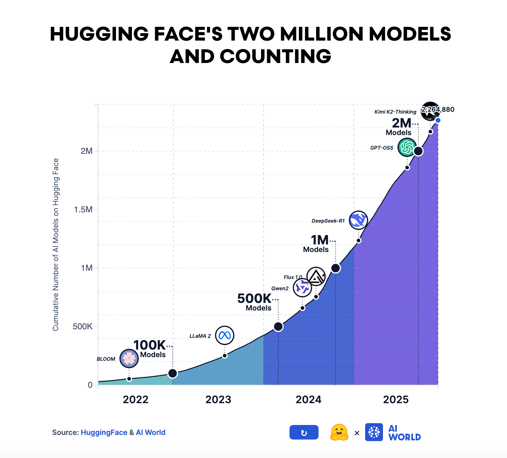
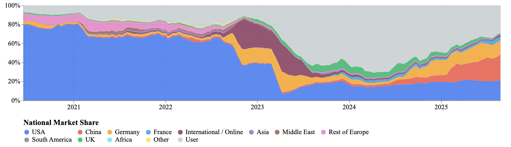
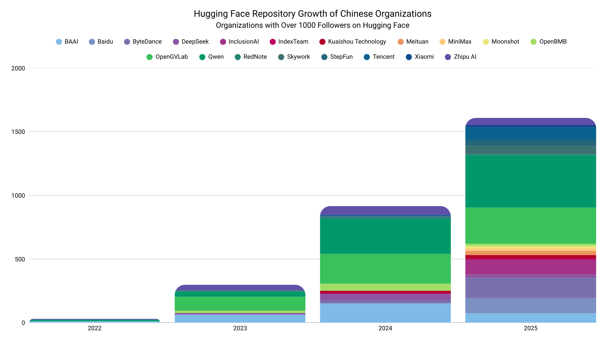
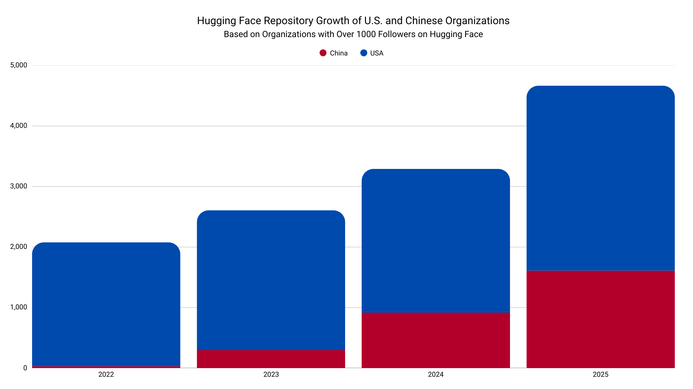
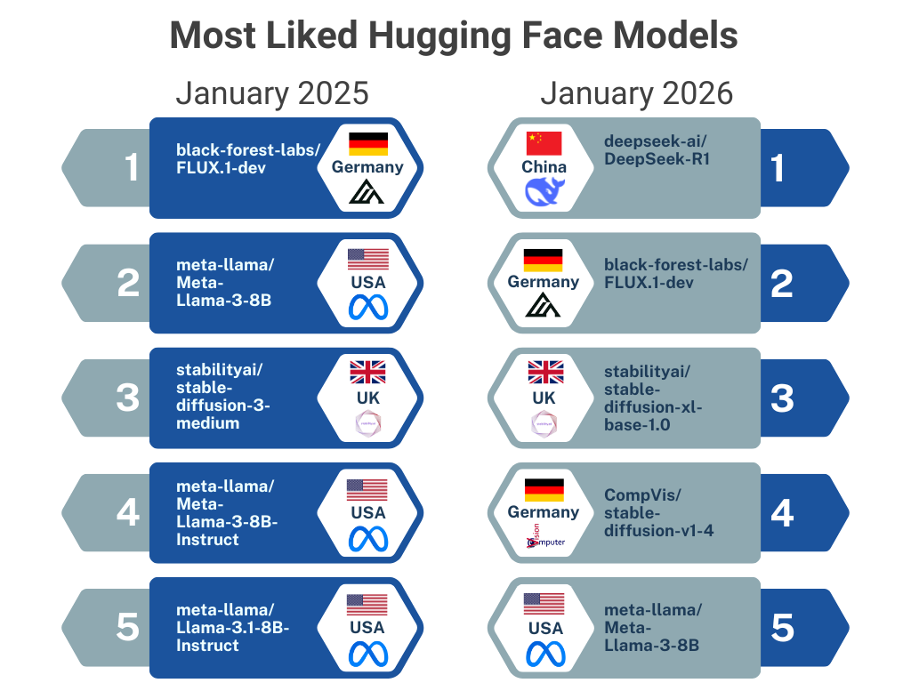
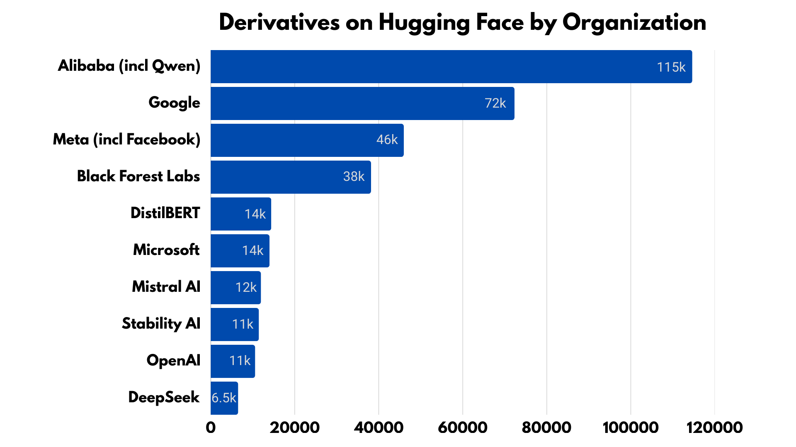
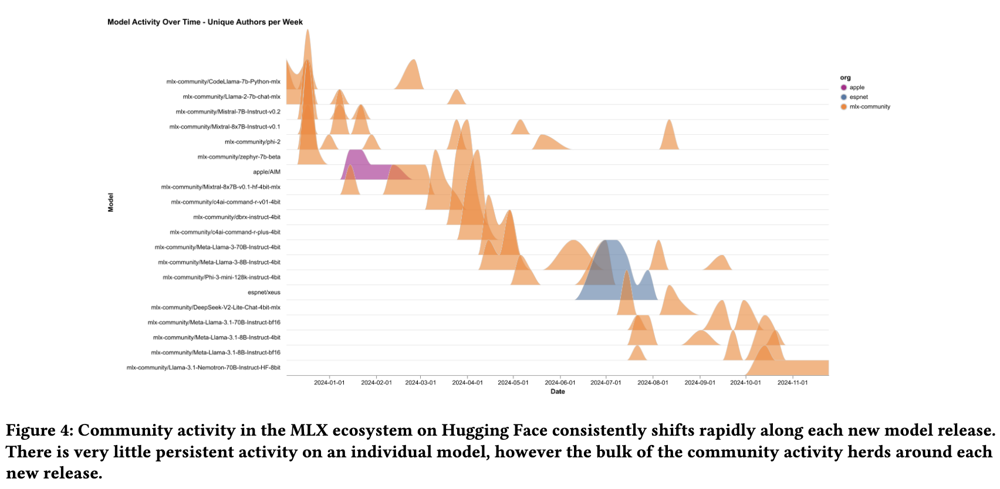
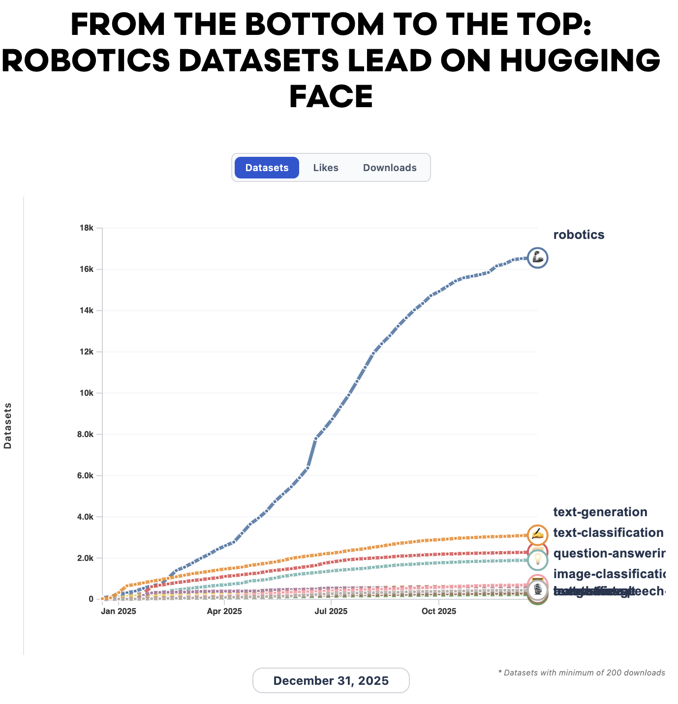
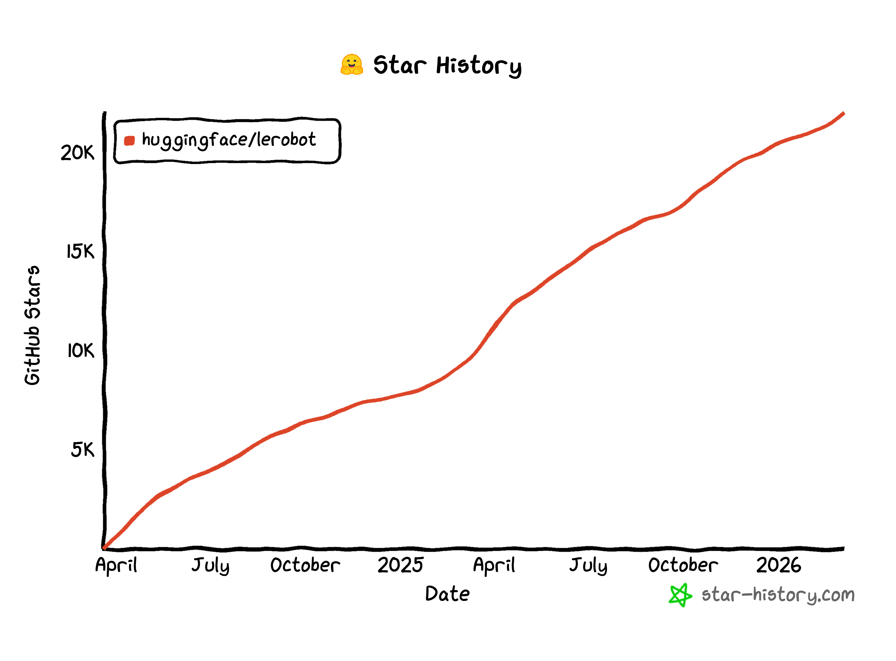

# HuggingFace 春季报告：中国模型已经占了 41% 的下载量，开源 AI 的版图被改写了

> 一年之前，HF Hub 上最受欢迎的还是 Llama。
> 一年之后，榜单第一是 **DeepSeek-R1**，阿里 Qwen 的衍生模型数量**超过了 Google + Meta 之和**。
> 这是 HuggingFace 自己刚发布的春季 2026 开源现状报告里的话——不是哪家中文媒体的解读。

---

## 先说三个数字，看完你大概会愣一下

最近 HuggingFace 发了一份《**State of Open Source on Hugging Face: Spring 2026**》，作者署名是 HF 内部的 Avijit Ghosh、Yacine Jernite、Irene Solaiman 等几位常年研究开源生态的人。

打开这篇报告之前，我以为又是一份"开源真好啊"的鸡汤。

读完之后只想说三个字：**风向变了。**

报告里有几个数据，建议你先停下来读两遍：

> **🇨🇳 中国模型占 HuggingFace 下载量的 41%**，月度和总下载量都已经超过美国。
>
> **🏢 行业（公司）贡献的开源仓库占比从 70% 降到 37%**，独立开发者从 17% 涨到 39%。
>
> **🤖 机器人数据集**从 2024 年的 1145 个，飙到 2025 年的 **26991 个**——成为 Hub 上**最大的数据集品类**。

这不是"中国 AI 追上来了"那种情绪化叙事。这是 HF 自己拿着 1300 万用户、200 万模型、50 万数据集的后台数据，写给所有人看的"事实陈述"。

下面把报告里我觉得最有冲击力的几条拆开聊聊。

---

## 第一件事：DeepSeek 时刻之后，中国开源仓库 8-9 倍地涨

报告里专门画了一张中国大公司在 HF 上发仓库的趋势图。**百度从 2024 年的 0 个仓库，涨到 2025 年的 100+。** 字节、腾讯的发布量增长 8-9 倍。百度、MiniMax 这些原本闭源的厂商，开始把模型公开放出来。

对比美国的曲线，差异就更直观了：

> **美国不是没在涨，是涨得没那么野。**

报告点名了一个分水岭事件——「**DeepSeek R1 时刻**」。R1 之后，中国大模型公司集体调整了开源策略：

- 从"防守式开源"（小模型、老版本）→ "进攻式开源"（旗舰模型直接放权重）
- 从"等论文发完再放代码"→ "权重和论文同步发布"
- 从"内部消化"→ "全球分发，靠下载量打榜"

而 HF 的下载榜单也确实变了样。一年前最受 like 的模型还是 Meta 的 Llama 系列，现在榜首是 **DeepSeek-R1**，整个 Top 10 是一个真正的国际混合阵容。

---

## 第二件事：Qwen 衍生模型 > Google + Meta 总和

如果说下载量还可以归因为"用户随手点点"，那**衍生模型**这个指标就硬核了——它代表"有人愿意拿你的模型去 fine-tune、做 LoRA、做蒸馏"。

报告给出的数字让我重看了三遍：

> **阿里巴巴在 HF 上的衍生模型数量，超过了 Google + Meta 的总和。**
>
> 仅 Qwen 系列，衍生模型 **>113000 个**；如果把所有打了 Qwen 标签的模型都算上，**>200000 个**。

这意味着什么？

意味着 Qwen 已经成了**事实上的开源基座**——就像当年 Linux 之于服务器、PyTorch 之于科研代码。开发者社区"用脚投票"投出来的胜负，比任何 benchmark 都更难造假。

---

## 第三件事：被严重低估的"小模型时代"

报告里有一组数据很反直觉：

> 2023 年模型平均规模 **8.27 亿参数**，2025 年 **208 亿参数**——**均值涨了 25 倍**。
>
> 但**中位数**呢？只从 3.26 亿微涨到 **4.06 亿**。

这是经典的"长尾被平均"。少数几个百亿、千亿大模型把均值拉飞了，但**真正在被部署的、有人下载的、被衍生再开发的，绝大多数是 1-9B 的"小模型"。**

具体到 HF 数据：1-9B 模型的中位下载量，是 100B+ 模型的**约 4 倍**。

而且更扎心的一个数据：

> **一个开源模型在社区的平均"保鲜期"，只有 6 周。**

DeepSeek 之所以能持续霸榜，靠的是 V3 → R1 → V3.2 这种**节奏感极强**的连续发布。模型不是"发一次就完了"，而是要像 SaaS 产品一样持续迭代，否则 6 周后社区就移情别恋了。

---

## 第四件事：机器人，正在悄悄成为 HF 最大的数据集品类

如果只看模型，你看到的是"中美在打"。但报告还揭示了另一条主线——**新前沿在崛起**。

最让我震惊的是机器人数据：

> 2024 年：HF 上机器人数据集 **1145 个**，排在第 44 位。
>
> 2025 年：**26991 个**，**Hub 上最大的数据集品类**。第二名"文本生成"只有约 5000 个。

3 年时间从第 44 → 第 1，**24 倍增长**。

具体的资源也很硬：

| 项目 | 体量 |
|------|------|
| **L2D**（LeRobot × Yaak）| 史上最大的空间智能多模态数据集 |
| **RoboMIND** | 107000+ 真实机器人轨迹，479 个任务 |
| **LeRobot 库** | GitHub Star 一年内**接近 3 倍增长** |
| **Pollen Robotics** | 被 HF 收购，开放机器人开始商业化 |

LLM 那块红海打得火热，但 HF 自己已经在用真金白银下注下一个战场——**具身智能（Embodied AI）**。

---

## 第五件事：开源 AI 是"主权问题"了

报告里一个新出现的章节叫 **Sovereignty and Global Open Source**（主权与全球开源）。这是过去几年开源生态里几乎没人讨论的话题。

现在变了：

- **🇰🇷 韩国**（2025 年中）：国家主权 AI 计划，**指定 LG AI Research、SK Telecom、Naver Cloud、NC AI、Upstage 为"国家冠军"**——直接给政策、给算力、给市场。2026 年 3 月又和 Reflection AI 谈成数据中心合作。
- **🇨🇭 瑞士**：Swiss AI 计划。
- **🇬🇧 英国**：明确"**公共资金，公共代码**"原则。

> 一个有意思的发现：**模型和数据集，往往在它的开发地区被使用得最多。**

这其实就是数字主权的另一种表达——大模型在变成基础设施，每个国家都不想把基础设施完全交给别人。

---

## 最后：HF 留下的那个"决定性问题"

报告结尾的语气很克制，但这句话我读了好几遍：

> **2026 年的决定性问题：以 OpenAI 的 GPT-OSS、AI2 的 OLMo、Google 的 Gemma 为代表的西方开源新军，能不能追上 Qwen 和 DeepSeek 的采用势头。**

仔细品味这句话——**是西方追中国**，不是反过来。

一年前我们讨论开源 AI，话题还是"Meta 开源 Llama 多伟大"。一年后 HF 自己说，**OpenAI 都在做开源版本来"应对竞争"了**。

GPT-OSS 是 OpenAI 推出的开源模型系列，OLMo 是 AI2 的完全开源（含数据）模型，Gemma 是 Google 的开源版 Gemini。这三个项目同时出现，且在报告里被定位为"挑战者"——**这本身就是格局变化的最直接证据**。

---

## 我读完想到的几件事

1. **开源 AI 的"中心"在悄悄迁移。** 不是说美国不行了，而是单极变多极。这种变化里，普通开发者其实是受益方——选择更多了。

2. **小模型才是真正的"生产力"。** 别被那些千亿、万亿参数的新闻晃了眼。真正在跑业务的、被下载的、被衍生的，是 1-9B 这个区间。

3. **6 周的"保鲜期"很残酷。** 对模型团队来说，想红一次容易，想持续被记得，必须像 DeepSeek 那样高频迭代。

4. **机器人是下一个 LLM。** 数据集 24 倍增长，HF 已经在 all-in 这条线了。

5. **开源不再是"良心选项"，是默认选项。** 当开源模型能比闭源旗舰**便宜 10–1000 倍**且性能可比的时候，闭源那套商业逻辑会被持续挤压。

报告原文在这：
> https://huggingface.co/blog/huggingface/state-of-os-hf-spring-2026

它不长，半小时能读完，强烈建议自己去翻一遍——HF 内部的视角，比任何二手解读都更有信息量。

---

*我是 Li Yi，每周读一些有意思的 AI 论文/报告，写成普通人也看得懂的笔记。点个在看，下期见。*
